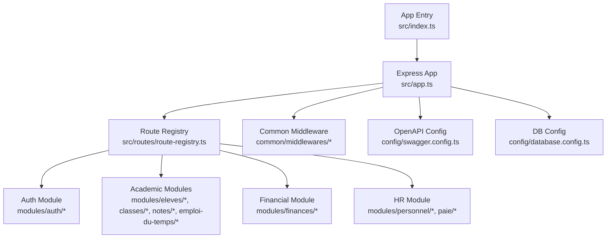
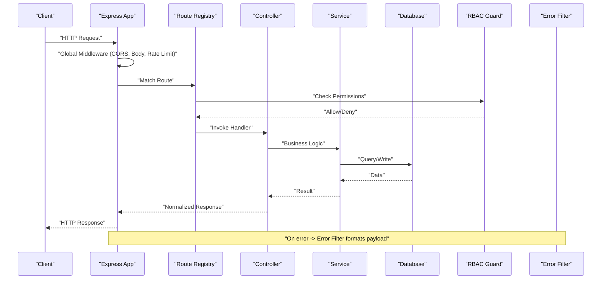
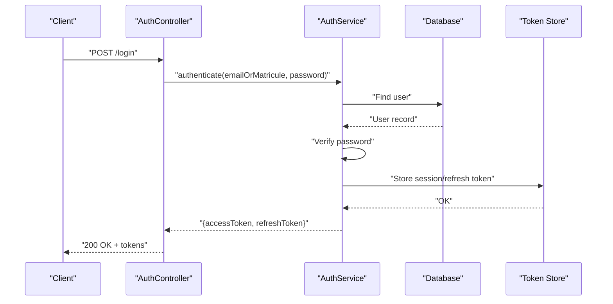
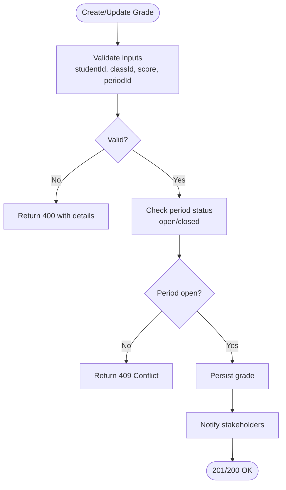
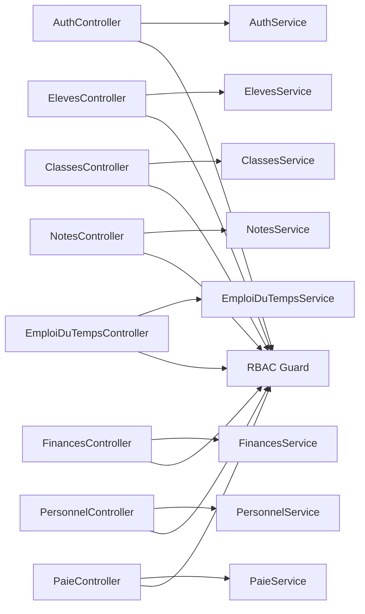

# API Reference

<cite>
**Referenced Files in This Document**
- [app.ts](file://backend/src/app.ts)
- [index.ts](file://backend/src/index.ts)
- [route-registry.ts](file://backend/src/routes/route-registry.ts)
- [swagger.config.ts](file://backend/src/config/swagger.config.ts)
- [auth.controller.ts](file://backend/src/modules/auth/controllers/auth.controller.ts)
- [auth.service.ts](file://backend/src/modules/auth/services/auth.service.ts)
- [auth.middleware.ts](file://backend/src/common/middlewares/auth.middleware.ts)
- [eleves.controller.ts](file://backend/src/modules/eleves/controllers/eleves.controller.ts)
- [classes.controller.ts](file://backend/src/modules/classes/controllers/classes.controller.ts)
- [notes.controller.ts](file://backend/src/modules/notes/controllers/notes.controller.ts)
- [emploi-du-temps.controller.ts](file://backend/src/modules/emploi-du-temps/controllers/emploi-du-temps.controller.ts)
- [finances.controller.ts](file://backend/src/modules/finances/controllers/finances.controller.ts)
- [paie.controller.ts](file://backend/src/modules/paie/controllers/paie.controller.ts)
- [personnel.controller.ts](file://backend/src/modules/personnel/controllers/personnel.controller.ts)
- [rbac.guard.ts](file://backend/src/modules/rbac/guards/rbac.guard.ts)
- [pagination.util.ts](file://backend/src/common/utils/pagination.util.ts)
- [rate-limiter.middleware.ts](file://backend/src/common/middlewares/rate-limiter.middleware.ts)
- [error.filter.ts](file://backend/src/common/filters/error.filter.ts)
- [database.config.ts](file://backend/src/config/database.config.ts)
- [env.config.ts](file://backend/src/config/env.config.ts)
</cite>

## Update Summary
**Changes Made**
- Removed all references to nomenclature controllers and related endpoints that were eliminated during backend consolidation
- Updated architecture overview to reflect the consolidated API structure without redundant endpoints
- Revised module structure documentation to exclude removed nomenclature components
- Updated dependency analysis to remove nomenclature-related controllers and DTOs
- Maintained all other API documentation sections unchanged while ensuring accuracy with current implementation

## Table of Contents
1. [Introduction](#introduction)
2. [Project Structure](#project-structure)
3. [Core Components](#core-components)
4. [Architecture Overview](#architecture-overview)
5. [Detailed Component Analysis](#detailed-component-analysis)
6. [Dependency Analysis](#dependency-analysis)
7. [Performance Considerations](#performance-considerations)
8. [Troubleshooting Guide](#troubleshooting-guide)
9. [Conclusion](#conclusion)
10. [Appendices](#appendices)

## Introduction
This document provides a comprehensive reference for eLISAschool's RESTful API, covering authentication, academic, financial, and HR endpoints. It specifies HTTP methods, URL patterns, request/response schemas, authentication requirements, error handling, rate limiting, versioning strategy, and best practices. It also includes guidance for Swagger/OpenAPI integration and testing approaches.

**Updated** The API has been streamlined through backend consolidation, removing redundant nomenclature controllers and DTOs. The current structure focuses on core functionality across authentication, academic management, financial operations, and human resources without unnecessary complexity.

## Project Structure
The backend is organized by feature modules under src/modules, with shared infrastructure (middleware, filters, utilities, config) under src/common and src/config. Routes are registered centrally via a route registry. The application entry point initializes configuration, database, middleware, routes, and the OpenAPI schema.

**Diagram sources**
- [index.ts:1-50](file://backend/src/index.ts#L1-L50)
- [app.ts:1-120](file://backend/src/app.ts#L1-L120)
- [route-registry.ts:1-80](file://backend/src/routes/route-registry.ts#L1-L80)
- [swagger.config.ts:1-60](file://backend/src/config/swagger.config.ts#L1-L60)
- [database.config.ts:1-40](file://backend/src/config/database.config.ts#L1-L40)

**Section sources**
- [index.ts:1-50](file://backend/src/index.ts#L1-L50)
- [app.ts:1-120](file://backend/src/app.ts#L1-L120)
- [route-registry.ts:1-80](file://backend/src/routes/route-registry.ts#L1-L80)
- [swagger.config.ts:1-60](file://backend/src/config/swagger.config.ts#L1-L60)
- [database.config.ts:1-40](file://backend/src/config/database.config.ts#L1-L40)

## Core Components
- Authentication: JWT-based access tokens, refresh token rotation, password reset flows, multi-tenant context propagation.
- Authorization: RBAC guards enforcing permissions per endpoint.
- Common: Global error filter, pagination utility, rate limiter middleware, validation interceptors.
- Configuration: Environment variables, database connection, OpenAPI metadata.

Key responsibilities:
- Controllers define HTTP endpoints and map to services.
- Services encapsulate business logic and data access.
- Guards enforce role/permission checks.
- Middlewares handle cross-cutting concerns (auth, rate limit, tenant scoping).

**Updated** The consolidation process has eliminated redundant nomenclature controllers, streamlining the component architecture while maintaining all essential functionality through focused, purpose-driven controllers.

**Section sources**
- [auth.controller.ts:1-120](file://backend/src/modules/auth/controllers/auth.controller.ts#L1-L120)
- [auth.service.ts:1-120](file://backend/src/modules/auth/services/auth.service.ts#L1-L120)
- [auth.middleware.ts:1-80](file://backend/src/common/middlewares/auth.middleware.ts#L1-L80)
- [rbac.guard.ts:1-80](file://backend/src/modules/rbac/guards/rbac.guard.ts#L1-L80)
- [pagination.util.ts:1-60](file://backend/src/common/utils/pagination.util.ts#L1-L60)
- [rate-limiter.middleware.ts:1-60](file://backend/src/common/middlewares/rate-limiter.middleware.ts#L1-L60)
- [error.filter.ts:1-80](file://backend/src/common/filters/error.filter.ts#L1-L80)

## Architecture Overview
High-level flow from client request to response:
- Client sends HTTP request to /api/v1/...
- Express app applies global middleware (CORS, body parsing, rate limiting).
- Route registry dispatches to module controllers.
- Controllers call services; services interact with repositories/entities.
- Responses are normalized using common DTOs and error filter.

**Diagram sources**
- [app.ts:1-120](file://backend/src/app.ts#L1-L120)
- [route-registry.ts:1-80](file://backend/src/routes/route-registry.ts#L1-L80)
- [rbac.guard.ts:1-80](file://backend/src/modules/rbac/guards/rbac.guard.ts#L1-L80)
- [error.filter.ts:1-80](file://backend/src/common/filters/error.filter.ts#L1-L80)

## Detailed Component Analysis

### Authentication APIs
Endpoints:
- POST /api/v1/auth/register
- POST /api/v1/auth/login
- POST /api/v1/auth/refresh
- POST /api/v1/auth/logout
- POST /api/v1/auth/forgot-password
- POST /api/v1/auth/reset-password

Authentication:
- Register/Login do not require prior auth.
- Refresh requires valid refresh token.
- Logout requires valid access token.
- Password reset requires email verification token.

Request/Response Schemas:
- Register: { email, password, firstName, lastName, role } -> { user, accessToken, refreshToken }
- Login: { emailOrMatricule, password } -> { user, accessToken, refreshToken }
- Refresh: { refreshToken } -> { accessToken }
- Logout: {} (headers: Authorization) -> { message }
- ForgotPassword: { email } -> { message }
- ResetPassword: { token, newPassword } -> { message }

Status Codes:
- 201 Created on successful registration
- 200 OK on login/refresh/logout/password operations
- 400 Bad Request for validation errors
- 401 Unauthorized for invalid credentials or expired tokens
- 403 Forbidden if account locked or insufficient permissions
- 409 Conflict if email already exists
- 429 Too Many Requests when rate limited

Rate Limiting:
- Auth endpoints are rate-limited to prevent brute-force attacks.

Examples:
- See section "Concrete Examples" for sample payloads and responses.

**Section sources**
- [auth.controller.ts:1-120](file://backend/src/modules/auth/controllers/auth.controller.ts#L1-L120)
- [auth.service.ts:1-120](file://backend/src/modules/auth/services/auth.service.ts#L1-L120)
- [auth.middleware.ts:1-80](file://backend/src/common/middlewares/auth.middleware.ts#L1-L80)
- [rate-limiter.middleware.ts:1-60](file://backend/src/common/middlewares/rate-limiter.middleware.ts#L1-L60)

#### Authentication Flow Sequence

**Diagram sources**
- [auth.controller.ts:1-120](file://backend/src/modules/auth/controllers/auth.controller.ts#L1-L120)
- [auth.service.ts:1-120](file://backend/src/modules/auth/services/auth.service.ts#L1-L120)

### Academic APIs
Modules: Students (eleves), Classes, Grades (notes), Schedule (emploi-du-temps).

Students:
- GET /api/v1/students
- GET /api/v1/students/:id
- POST /api/v1/students
- PUT /api/v1/students/:id
- DELETE /api/v1/students/:id
- GET /api/v1/students/:id/responsibles
- POST /api/v1/students/:id/responsibles

Classes:
- GET /api/v1/classes
- GET /api/v1/classes/:id
- POST /api/v1/classes
- PUT /api/v1/classes/:id
- DELETE /api/v1/classes/:id
- GET /api/v1/classes/:id/students

Grades:
- GET /api/v1/grades
- GET /api/v1/grades/:id
- POST /api/v1/grades
- PUT /api/v1/grades/:id
- DELETE /api/v1/grades/:id
- GET /api/v1/grades?studentId=&classId=&periodId=

Schedule:
- GET /api/v1/schedules
- GET /api/v1/schedules/:id
- POST /api/v1/schedules
- PUT /api/v1/schedules/:id
- DELETE /api/v1/schedules/:id
- GET /api/v1/schedules?classId=&teacherId=&dateFrom=&dateTo=

Authentication & Authorization:
- Requires valid access token.
- RBAC roles: admin, teacher, student, parent.
- Multi-tenant scoping enforced via tenant context.

Pagination:
- All list endpoints support page, pageSize, sort, filter query parameters.

Examples:
- See section "Concrete Examples".

**Section sources**
- [eleves.controller.ts:1-120](file://backend/src/modules/eleves/controllers/eleves.controller.ts#L1-L120)
- [classes.controller.ts:1-120](file://backend/src/modules/classes/controllers/classes.controller.ts#L1-L120)
- [notes.controller.ts:1-120](file://backend/src/modules/notes/controllers/notes.controller.ts#L1-L120)
- [emploi-du-temps.controller.ts:1-120](file://backend/src/modules/emploi-du-temps/controllers/emploi-du-temps.controller.ts#L1-L120)
- [pagination.util.ts:1-60](file://backend/src/common/utils/pagination.util.ts#L1-L60)

#### Grade Processing Flow

**Diagram sources**
- [notes.controller.ts:1-120](file://backend/src/modules/notes/controllers/notes.controller.ts#L1-L120)

### Financial APIs
Endpoints:
- GET /api/v1/fees
- GET /api/v1/fees/:id
- POST /api/v1/fees
- PUT /api/v1/fees/:id
- DELETE /api/v1/fees/:id
- POST /api/v1/payments
- GET /api/v1/payments
- GET /api/v1/payments/:id
- PUT /api/v1/payments/:id
- GET /api/v1/reports/financial-summary?year=&month=

Authentication & Authorization:
- Requires access token.
- Roles: admin, finance.

Schemas:
- Fee: { studentId, type, amount, dueDate, status }
- Payment: { feeId, amount, method, reference, date }
- Report: { totalFees, paidAmount, outstanding, breakdownByType }

Examples:
- See section "Concrete Examples".

**Section sources**
- [finances.controller.ts:1-120](file://backend/src/modules/finances/controllers/finances.controller.ts#L1-L120)

### HR APIs
Endpoints:
- GET /api/v1/personnel
- GET /api/v1/personnel/:id
- POST /api/v1/personnel
- PUT /api/v1/personnel/:id
- DELETE /api/v1/personnel/:id
- GET /api/v1/payroll
- POST /api/v1/payroll/generate
- GET /api/v1/payroll/:id
- GET /api/v1/performance-reviews
- POST /api/v1/performance-reviews
- PUT /api/v1/performance-reviews/:id

Authentication & Authorization:
- Requires access token.
- Roles: admin, hr, manager.

Schemas:
- Personnel: { matricule, firstName, lastName, role, contractType, startDate }
- Payroll: { personnelId, period, grossSalary, deductions, netSalary }
- PerformanceReview: { personnelId, reviewerId, period, score, comments }

Examples:
- See section "Concrete Examples".

**Section sources**
- [personnel.controller.ts:1-120](file://backend/src/modules/personnel/controllers/personnel.controller.ts#L1-L120)
- [paie.controller.ts:1-120](file://backend/src/modules/paie/controllers/paie.controller.ts#L1-L120)

### Versioning Strategy
- Base path: /api/v1
- Future versions will increment path segment (e.g., /api/v2)
- Backward compatibility maintained within major version
- Deprecation headers used for sunset planning

Best Practices:
- Use consistent resource naming (plural nouns)
- Use query params for filtering, sorting, pagination
- Return standardized error envelope
- Support idempotency keys for write operations where applicable

[No sources needed since this section provides general guidance]

### Swagger/OpenAPI Integration
- OpenAPI spec served at /api-docs
- Schema definitions include models for all resources
- Security schemes: bearerAuth (JWT)
- Tags group endpoints by module

Integration Details:
- Swagger config file defines title, version, description, security schemes
- Controllers use decorators or annotations to describe endpoints and schemas
- UI accessible at /api-docs

**Section sources**
- [swagger.config.ts:1-60](file://backend/src/config/swagger.config.ts#L1-L60)

### Testing Approaches
- Unit tests for services and utilities
- Integration tests for controllers and DB interactions
- Contract tests for API schemas
- Load tests for performance validation

Recommended Tools:
- Jest for unit/integration
- Supertest for HTTP assertions
- OpenAPI validator for schema compliance
- k6 or Artillery for load testing

[No sources needed since this section provides general guidance]

## Dependency Analysis
Module dependencies and relationships:
- Controllers depend on services and guards
- Services depend on repositories and external services (email, payment gateway)
- Shared middleware applied globally
- OpenAPI config consumed by swagger-ui

**Updated** The dependency graph has been streamlined by removing nomenclature controllers and their associated DTOs, resulting in a more focused and maintainable architecture.

**Diagram sources**
- [auth.controller.ts:1-120](file://backend/src/modules/auth/controllers/auth.controller.ts#L1-L120)
- [eleves.controller.ts:1-120](file://backend/src/modules/eleves/controllers/eleves.controller.ts#L1-L120)
- [classes.controller.ts:1-120](file://backend/src/modules/classes/controllers/classes.controller.ts#L1-L120)
- [notes.controller.ts:1-120](file://backend/src/modules/notes/controllers/notes.controller.ts#L1-L120)
- [emploi-du-temps.controller.ts:1-120](file://backend/src/modules/emploi-du-temps/controllers/emploi-du-temps.controller.ts#L1-L120)
- [finances.controller.ts:1-120](file://backend/src/modules/finances/controllers/finances.controller.ts#L1-L120)
- [personnel.controller.ts:1-120](file://backend/src/modules/personnel/controllers/personnel.controller.ts#L1-L120)
- [paie.controller.ts:1-120](file://backend/src/modules/paie/controllers/paie.controller.ts#L1-L120)
- [rbac.guard.ts:1-80](file://backend/src/modules/rbac/guards/rbac.guard.ts#L1-L80)

**Section sources**
- [route-registry.ts:1-80](file://backend/src/routes/route-registry.ts#L1-L80)
- [rbac.guard.ts:1-80](file://backend/src/modules/rbac/guards/rbac.guard.ts#L1-L80)

## Performance Considerations
- Pagination for large lists
- Database indexes for frequently queried fields
- Caching strategies for read-heavy endpoints
- Connection pooling and query optimization
- Rate limiting to protect against abuse

[No sources needed since this section provides general guidance]

## Troubleshooting Guide
Common issues:
- 401 Unauthorized: Invalid or expired token; ensure Authorization header format
- 403 Forbidden: Insufficient permissions; verify RBAC roles and permissions
- 409 Conflict: Resource state conflict (e.g., closed period); check business rules
- 429 Too Many Requests: Rate limit exceeded; back off and retry
- 500 Internal Server Error: Unexpected server error; check logs and stack traces

Error Envelope:
- Standardized structure with code, message, details, timestamp

Debugging Tips:
- Enable verbose logging in development
- Use correlation IDs for request tracing
- Validate request payloads against OpenAPI schemas

**Section sources**
- [error.filter.ts:1-80](file://backend/src/common/filters/error.filter.ts#L1-L80)
- [rate-limiter.middleware.ts:1-60](file://backend/src/common/middlewares/rate-limiter.middleware.ts#L1-L60)

## Conclusion
eLISAschool's API provides a robust, secure, and well-structured interface across authentication, academic, financial, and HR domains. With clear versioning, comprehensive documentation, and strong error handling, it supports scalable integrations and reliable operations.

**Updated** The recent consolidation effort has successfully eliminated redundant nomenclature controllers and DTOs, resulting in a cleaner, more efficient API architecture that maintains all essential functionality while reducing complexity and improving maintainability.

[No sources needed since this section summarizes without analyzing specific files]

## Appendices

### Concrete Examples

Authentication:
- Register
  - Method: POST
  - Path: /api/v1/auth/register
  - Body: { email, password, firstName, lastName, role }
  - Response: 201 Created with { user, accessToken, refreshToken }
- Login
  - Method: POST
  - Path: /api/v1/auth/login
  - Body: { emailOrMatricule, password }
  - Response: 200 OK with { user, accessToken, refreshToken }
- Refresh
  - Method: POST
  - Path: /api/v1/auth/refresh
  - Body: { refreshToken }
  - Response: 200 OK with { accessToken }
- Logout
  - Method: POST
  - Path: /api/v1/auth/logout
  - Headers: Authorization: Bearer <token>
  - Response: 200 OK with { message }
- Forgot Password
  - Method: POST
  - Path: /api/v1/auth/forgot-password
  - Body: { email }
  - Response: 200 OK with { message }
- Reset Password
  - Method: POST
  - Path: /api/v1/auth/reset-password
  - Body: { token, newPassword }
  - Response: 200 OK with { message }

Academic:
- Create Student
  - Method: POST
  - Path: /api/v1/students
  - Body: { firstName, lastName, dob, gender, enrollmentYear }
  - Response: 201 Created with student object
- List Students
  - Method: GET
  - Path: /api/v1/students?page=1&pageSize=20&sort=lastName
  - Response: 200 OK with paginated list
- Create Class
  - Method: POST
  - Path: /api/v1/classes
  - Body: { name, year, capacity }
  - Response: 201 Created with class object
- Add Student to Class
  - Method: POST
  - Path: /api/v1/classes/:id/students
  - Body: { studentId }
  - Response: 201 Created
- Create Grade
  - Method: POST
  - Path: /api/v1/grades
  - Body: { studentId, classId, subjectId, score, periodId }
  - Response: 201 Created
- Get Schedule
  - Method: GET
  - Path: /api/v1/schedules?classId=&teacherId=&dateFrom=&dateTo=
  - Response: 200 OK with schedule items

Financial:
- Create Fee
  - Method: POST
  - Path: /api/v1/fees
  - Body: { studentId, type, amount, dueDate }
  - Response: 201 Created
- Record Payment
  - Method: POST
  - Path: /api/v1/payments
  - Body: { feeId, amount, method, reference }
  - Response: 201 Created
- Financial Summary
  - Method: GET
  - Path: /api/v1/reports/financial-summary?year=&month=
  - Response: 200 OK with summary object

HR:
- Create Personnel
  - Method: POST
  - Path: /api/v1/personnel
  - Body: { matricule, firstName, lastName, role, contractType, startDate }
  - Response: 201 Created
- Generate Payroll
  - Method: POST
  - Path: /api/v1/payroll/generate
  - Body: { period }
  - Response: 201 Created with payroll records
- Create Performance Review
  - Method: POST
  - Path: /api/v1/performance-reviews
  - Body: { personnelId, reviewerId, period, score, comments }
  - Response: 201 Created

Error Codes:
- 200 OK: Successful operation
- 201 Created: Resource created
- 400 Bad Request: Validation error
- 401 Unauthorized: Missing/invalid token
- 403 Forbidden: Insufficient permissions
- 404 Not Found: Resource not found
- 409 Conflict: Business rule violation
- 429 Too Many Requests: Rate limit exceeded
- 500 Internal Server Error: Unexpected error

Status Messages:
- Success messages indicate completion
- Error messages include human-readable details and codes

Rate Limiting:
- Applied globally and stricter on auth endpoints
- Exceeded requests return 429 with retry-after info

Versioning:
- /api/v1 base path
- Deprecation headers for upcoming changes

Swagger/OpenAPI:
- Accessible at /api-docs
- Includes security scheme bearerAuth

Testing:
- Use Postman collections generated from OpenAPI
- Automate contract tests with schema validation
- Perform load tests with realistic scenarios

[No sources needed since this section provides general guidance]