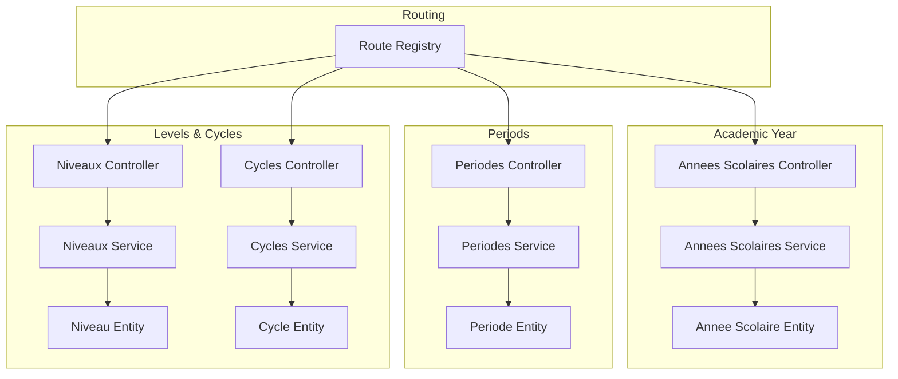
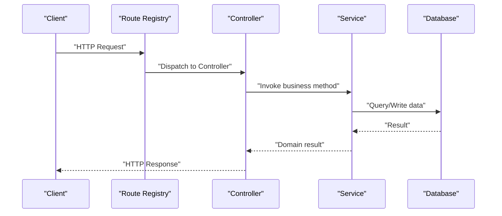
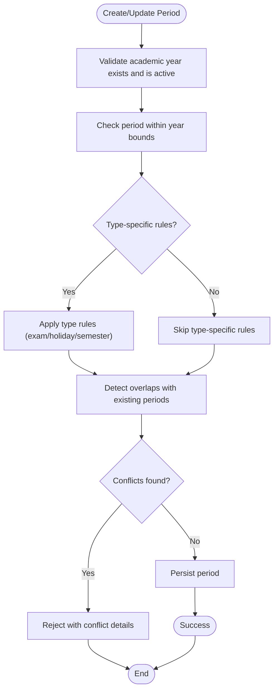
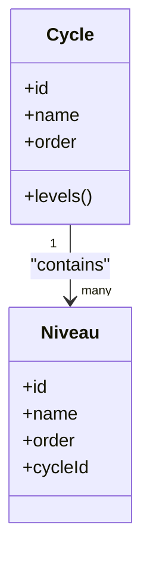
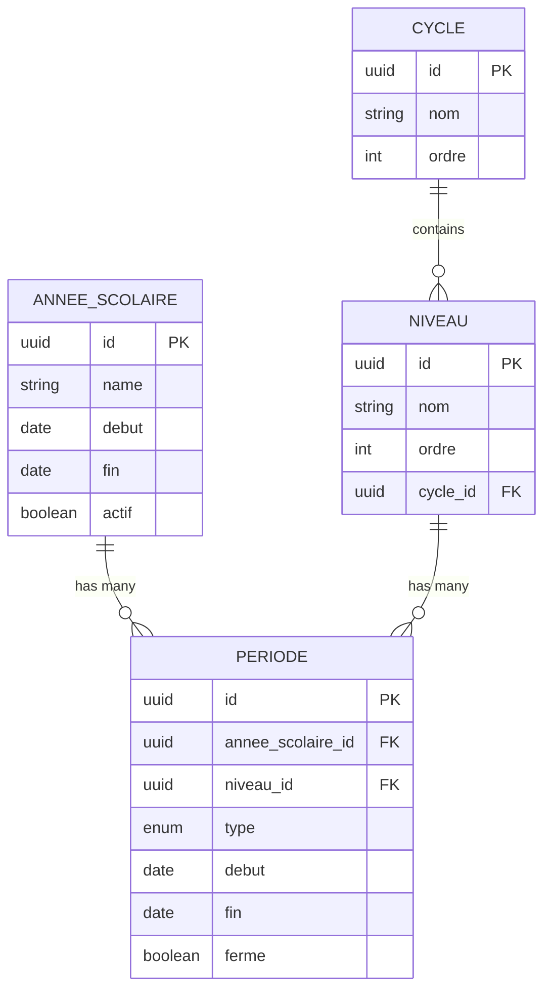
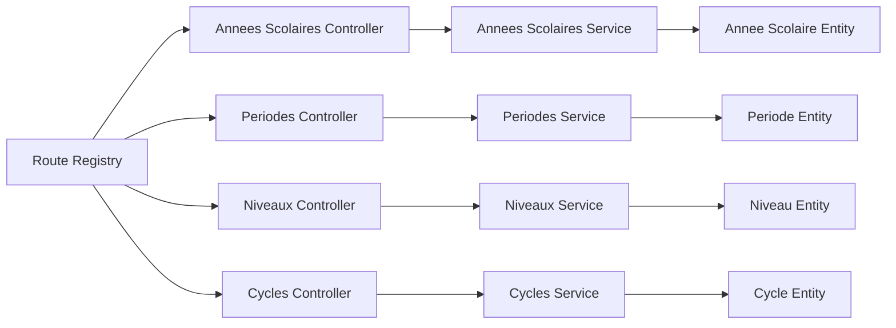
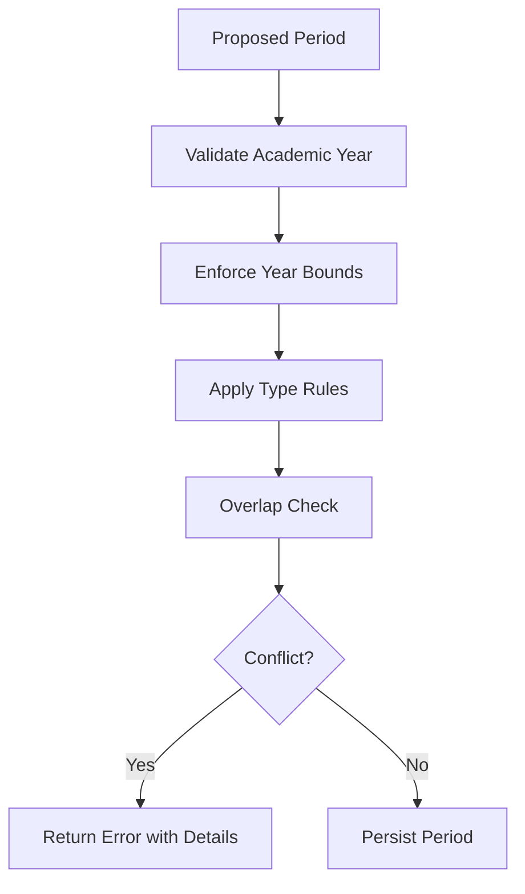
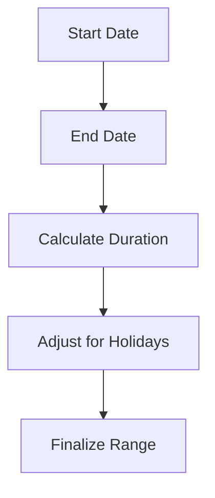

# Academic Calendar API

<cite>
**Referenced Files in This Document**
- [backend/src/modules/annees-scolaires/controllers/annees-scolaires.controller.ts](file://backend/src/modules/annees-scolaires/controllers/annees-scolaires.controller.ts)
- [backend/src/modules/annees-scolaires/services/annees-scolaires.service.ts](file://backend/src/modules/annees-scolaires/services/annees-scolaires.service.ts)
- [backend/src/modules/annees-scolaires/entities/annee-scolaire.entity.ts](file://backend/src/modules/annees-scolaires/entities/annee-scolaire.entity.ts)
- [backend/src/modules/periodes/controllers/periodes.controller.ts](file://backend/src/modules/periodes/controllers/periodes.controller.ts)
- [backend/src/modules/periodes/services/periodes.service.ts](file://backend/src/modules/periodes/services/periodes.service.ts)
- [backend/src/modules/periodes/entities/periode.entity.ts](file://backend/src/modules/periodes/entities/periode.entity.ts)
- [backend/src/modules/niveaux/controllers/niveaux.controller.ts](file://backend/src/modules/niveaux/controllers/niveaux.controller.ts)
- [backend/src/modules/niveaux/services/niveaux.service.ts](file://backend/src/modules/niveaux/services/niveaux.service.ts)
- [backend/src/modules/niveaux/entities/niveau.entity.ts](file://backend/src/modules/niveaux/entities/niveau.entity.ts)
- [backend/src/modules/cycles/controllers/cycles.controller.ts](file://backend/src/modules/cycles/controllers/cycles.controller.ts)
- [backend/src/modules/cycles/services/cycles.service.ts](file://backend/src/modules/cycles/services/cycles.service.ts)
- [backend/src/modules/cycles/entities/cycle.entity.ts](file://backend/src/modules/cycles/entities/cycle.entity.ts)
- [backend/src/routes/route-registry.ts](file://backend/src/routes/route-registry.ts)
- [backend/database/migrations/103-templates-periode-personnalisables.sql](file://backend/database/migrations/103-templates-periode-personnalisables.sql)
- [backend/database/migrations/104-refonte-periodes-niveaux-configurables.sql](file://backend/database/migrations/104-refonte-periodes-niveaux-configurables.sql)
- [backend/database/migrations/105-migration-templates-v5.sql](file://backend/database/migrations/105-migration-templates-v5.sql)
- [backend/database/migrations/102-periodes-hierarchie.sql](file://backend/database/migrations/102-periodes-hierarchie.sql)
- [backend/database/migrations/088-refactorisation-architecture-academique.sql](file://backend/database/migrations/088-refactorisation-architecture-academique.sql)
- [backend/database/migrations/089-finalisation-architecture-academique-v2.sql](file://backend/database/migrations/089-finalisation-architecture-academique-v2.sql)
- [backend/database/migrations/091-peuplement-architecture-academique.sql](file://backend/database/migrations/091-peuplement-architecture-academique.sql)
</cite>

## Table of Contents
1. [Introduction](#introduction)
2. [Project Structure](#project-structure)
3. [Core Components](#core-components)
4. [Architecture Overview](#architecture-overview)
5. [Detailed Component Analysis](#detailed-component-analysis)
6. [Dependency Analysis](#dependency-analysis)
7. [Performance Considerations](#performance-considerations)
8. [Troubleshooting Guide](#troubleshooting-guide)
9. [Conclusion](#conclusion)
10. [Appendices](#appendices)

## Introduction
This document provides detailed API documentation for eLISAschool’s academic calendar and period management endpoints. It covers:
- Academic year APIs for year configuration, term definitions, and academic cycle management
- Period management APIs for semester setup, exam periods, and holiday scheduling
- Level and cycle APIs for educational stage definitions and progression tracking
- Template systems for standard academic calendars and customization options
- Examples of period validation, date range calculations, and conflict detection
- Business rules for academic year boundaries, period overlaps, and institutional policies

The goal is to enable developers and administrators to configure and operate the academic calendar reliably across institutions.

## Project Structure
The academic calendar functionality is implemented as a set of modules with controllers, services, entities, and database migrations. Routes are registered centrally.

**Diagram sources**
- [backend/src/routes/route-registry.ts](file://backend/src/routes/route-registry.ts)
- [backend/src/modules/annees-scolaires/controllers/annees-scolaires.controller.ts](file://backend/src/modules/annees-scolaires/controllers/annees-scolaires.controller.ts)
- [backend/src/modules/annees-scolaires/services/annees-scolaires.service.ts](file://backend/src/modules/annees-scolaires/services/annees-scolaires.service.ts)
- [backend/src/modules/annees-scolaires/entities/annee-scolaire.entity.ts](file://backend/src/modules/annees-scolaires/entities/annee-scolaire.entity.ts)
- [backend/src/modules/periodes/controllers/periodes.controller.ts](file://backend/src/modules/periodes/controllers/periodes.controller.ts)
- [backend/src/modules/periodes/services/periodes.service.ts](file://backend/src/modules/periodes/services/periodes.service.ts)
- [backend/src/modules/periodes/entities/periode.entity.ts](file://backend/src/modules/periodes/entities/periode.entity.ts)
- [backend/src/modules/niveaux/controllers/niveaux.controller.ts](file://backend/src/modules/niveaux/controllers/niveaux.controller.ts)
- [backend/src/modules/niveaux/services/niveaux.service.ts](file://backend/src/modules/niveaux/services/niveaux.service.ts)
- [backend/src/modules/niveaux/entities/niveau.entity.ts](file://backend/src/modules/niveaux/entities/niveau.entity.ts)
- [backend/src/modules/cycles/controllers/cycles.controller.ts](file://backend/src/modules/cycles/controllers/cycles.controller.ts)
- [backend/src/modules/cycles/services/cycles.service.ts](file://backend/src/modules/cycles/services/cycles.service.ts)
- [backend/src/modules/cycles/entities/cycle.entity.ts](file://backend/src/modules/cycles/entities/cycle.entity.ts)

**Section sources**
- [backend/src/routes/route-registry.ts](file://backend/src/routes/route-registry.ts)

## Core Components
- Academic Year (Annee Scolaire): Represents an institution’s academic year with start/end dates and status flags. Used to scope terms and periods.
- Period (Periode): A time-bound interval within an academic year (e.g., semester, trimester, exam window, holiday). Supports hierarchy and templates.
- Level (Niveau): Educational stage definition (e.g., primary, secondary) used to scope periods and curriculum.
- Cycle (Cycle): Higher-level grouping of levels that defines progression pathways.

Key responsibilities:
- Controllers expose REST endpoints for CRUD and specialized operations.
- Services implement business logic, including validation, overlap checks, and template application.
- Entities define data models and constraints.

**Section sources**
- [backend/src/modules/annees-scolaires/controllers/annees-scolaires.controller.ts](file://backend/src/modules/annees-scolaires/controllers/annees-scolaires.controller.ts)
- [backend/src/modules/annees-scolaires/services/annees-scolaires.service.ts](file://backend/src/modules/annees-scolaires/services/annees-scolaires.service.ts)
- [backend/src/modules/annees-scolaires/entities/annee-scolaire.entity.ts](file://backend/src/modules/annees-scolaires/entities/annee-scolaire.entity.ts)
- [backend/src/modules/periodes/controllers/periodes.controller.ts](file://backend/src/modules/periodes/controllers/periodes.controller.ts)
- [backend/src/modules/periodes/services/periodes.service.ts](file://backend/src/modules/periodes/services/periodes.service.ts)
- [backend/src/modules/periodes/entities/periode.entity.ts](file://backend/src/modules/periodes/entities/periode.entity.ts)
- [backend/src/modules/niveaux/controllers/niveaux.controller.ts](file://backend/src/modules/niveaux/controllers/niveaux.controller.ts)
- [backend/src/modules/niveaux/services/niveaux.service.ts](file://backend/src/modules/niveaux/services/niveaux.service.ts)
- [backend/src/modules/niveaux/entities/niveau.entity.ts](file://backend/src/modules/niveaux/entities/niveau.entity.ts)
- [backend/src/modules/cycles/controllers/cycles.controller.ts](file://backend/src/modules/cycles/controllers/cycles.controller.ts)
- [backend/src/modules/cycles/services/cycles.service.ts](file://backend/src/modules/cycles/services/cycles.service.ts)
- [backend/src/modules/cycles/entities/cycle.entity.ts](file://backend/src/modules/cycles/entities/cycle.entity.ts)

## Architecture Overview
The system follows a layered architecture:
- Route registry maps HTTP endpoints to controllers.
- Controllers handle request/response and delegate to services.
- Services enforce business rules and orchestrate entity persistence.
- Entities model domain data and constraints.
- Migrations define schema evolution for academic structures and period templates.

**Diagram sources**
- [backend/src/routes/route-registry.ts](file://backend/src/routes/route-registry.ts)
- [backend/src/modules/annees-scolaires/controllers/annees-scolaires.controller.ts](file://backend/src/modules/annees-scolaires/controllers/annees-scolaires.controller.ts)
- [backend/src/modules/annees-scolaires/services/annees-scolaires.service.ts](file://backend/src/modules/annees-scolaires/services/annees-scolaires.service.ts)
- [backend/src/modules/periodes/controllers/periodes.controller.ts](file://backend/src/modules/periodes/controllers/periodes.controller.ts)
- [backend/src/modules/periodes/services/periodes.service.ts](file://backend/src/modules/periodes/services/periodes.service.ts)

## Detailed Component Analysis

### Academic Year Management
Endpoints typically include:
- Create, update, delete, list academic years
- Set current active year
- Retrieve year details and related terms

Business rules:
- Only one active academic year per institution at a time.
- Start date must be before end date.
- Deletion is blocked if dependent periods exist.

Validation examples:
- Overlap check when creating or updating year boundaries.
- Status transitions (active/inactive) enforced by service.

**Section sources**
- [backend/src/modules/annees-scolaires/controllers/annees-scolaires.controller.ts](file://backend/src/modules/annees-scolaires/controllers/annees-scolaires.controller.ts)
- [backend/src/modules/annees-scolaires/services/annees-scolaires.service.ts](file://backend/src/modules/annees-scolaires/services/annees-scolaires.service.ts)
- [backend/src/modules/annees-scolaires/entities/annee-scolaire.entity.ts](file://backend/src/modules/annees-scolaires/entities/annee-scolaire.entity.ts)

### Period Management (Semesters, Exams, Holidays)
Endpoints typically include:
- Create, update, delete, list periods
- Assign periods to academic years and levels
- Mark periods as closed or locked
- Bulk operations via templates

Business rules:
- Periods must fall within their parent academic year boundaries.
- No overlapping periods of the same type within the same level/year.
- Closed/locked periods cannot be edited without explicit override.

Validation examples:
- Date range calculation ensures start <= end and alignment with year boundaries.
- Conflict detection prevents overlapping intervals for conflicting types.

**Diagram sources**
- [backend/src/modules/periodes/services/periodes.service.ts](file://backend/src/modules/periodes/services/periodes.service.ts)
- [backend/src/modules/periodes/controllers/periodes.controller.ts](file://backend/src/modules/periodes/controllers/periodes.controller.ts)
- [backend/src/modules/periodes/entities/periode.entity.ts](file://backend/src/modules/periodes/entities/periode.entity.ts)

**Section sources**
- [backend/src/modules/periodes/controllers/periodes.controller.ts](file://backend/src/modules/periodes/controllers/periodes.controller.ts)
- [backend/src/modules/periodes/services/periodes.service.ts](file://backend/src/modules/periodes/services/periodes.service.ts)
- [backend/src/modules/periodes/entities/periode.entity.ts](file://backend/src/modules/periodes/entities/periode.entity.ts)

### Levels and Cycles (Educational Stages and Progression)
Endpoints typically include:
- Manage levels (create, update, delete, list)
- Manage cycles (create, update, delete, list)
- Link levels to cycles and order them for progression

Business rules:
- Levels belong to a cycle and have a defined order.
- Deleting a cycle requires handling associated levels.
- Ordering constraints prevent gaps or duplicates.

**Diagram sources**
- [backend/src/modules/cycles/entities/cycle.entity.ts](file://backend/src/modules/cycles/entities/cycle.entity.ts)
- [backend/src/modules/niveaux/entities/niveau.entity.ts](file://backend/src/modules/niveaux/entities/niveau.entity.ts)
- [backend/src/modules/cycles/controllers/cycles.controller.ts](file://backend/src/modules/cycles/controllers/cycles.controller.ts)
- [backend/src/modules/cycles/services/cycles.service.ts](file://backend/src/modules/cycles/services/cycles.service.ts)
- [backend/src/modules/niveaux/controllers/niveaux.controller.ts](file://backend/src/modules/niveaux/controllers/niveaux.controller.ts)
- [backend/src/modules/niveaux/services/niveaux.service.ts](file://backend/src/modules/niveaux/services/niveaux.service.ts)

**Section sources**
- [backend/src/modules/cycles/controllers/cycles.controller.ts](file://backend/src/modules/cycles/controllers/cycles.controller.ts)
- [backend/src/modules/cycles/services/cycles.service.ts](file://backend/src/modules/cycles/services/cycles.service.ts)
- [backend/src/modules/cycles/entities/cycle.entity.ts](file://backend/src/modules/cycles/entities/cycle.entity.ts)
- [backend/src/modules/niveaux/controllers/niveaux.controller.ts](file://backend/src/modules/niveaux/controllers/niveaux.controller.ts)
- [backend/src/modules/niveaux/services/niveaux.service.ts](file://backend/src/modules/niveaux/services/niveaux.service.ts)
- [backend/src/modules/niveaux/entities/niveau.entity.ts](file://backend/src/modules/niveaux/entities/niveau.entity.ts)

### Template System for Standard Academic Calendars
Templates allow defining reusable period configurations per level or institution. Key capabilities:
- Define template sets for semesters, exams, holidays
- Apply templates to create concrete periods
- Customize templates per level or institution while preserving defaults

Relevant schema changes:
- Customizable period templates
- Refactored period-level configurability
- Template migration v5 enhancements

**Section sources**
- [backend/database/migrations/103-templates-periode-personnalisables.sql](file://backend/database/migrations/103-templates-periode-personnalisables.sql)
- [backend/database/migrations/104-refonte-periodes-niveaux-configurables.sql](file://backend/database/migrations/104-refonte-periodes-niveaux-configurables.sql)
- [backend/database/migrations/105-migration-templates-v5.sql](file://backend/database/migrations/105-migration-templates-v5.sql)

### Academic Hierarchy and Relationships
The academic structure includes hierarchical relationships between periods and supports multi-tenant scoping.

**Diagram sources**
- [backend/database/migrations/088-refactorisation-architecture-academique.sql](file://backend/database/migrations/088-refactorisation-architecture-academique.sql)
- [backend/database/migrations/089-finalisation-architecture-academique-v2.sql](file://backend/database/migrations/089-finalisation-architecture-academique-v2.sql)
- [backend/database/migrations/091-peuplement-architecture-academique.sql](file://backend/database/migrations/091-peuplement-architecture-academique.sql)
- [backend/database/migrations/102-periodes-hierarchie.sql](file://backend/database/migrations/102-periodes-hierarchie.sql)

## Dependency Analysis
High-level dependencies among components:
- Controllers depend on services for business logic.
- Services depend on entities and database layer.
- Route registry wires controllers to HTTP endpoints.
- Migrations define schema evolution for academic structures and templates.

**Diagram sources**
- [backend/src/routes/route-registry.ts](file://backend/src/routes/route-registry.ts)
- [backend/src/modules/annees-scolaires/controllers/annees-scolaires.controller.ts](file://backend/src/modules/annees-scolaires/controllers/annees-scolaires.controller.ts)
- [backend/src/modules/annees-scolaires/services/annees-scolaires.service.ts](file://backend/src/modules/annees-scolaires/services/annees-scolaires.service.ts)
- [backend/src/modules/annees-scolaires/entities/annee-scolaire.entity.ts](file://backend/src/modules/annees-scolaires/entities/annee-scolaire.entity.ts)
- [backend/src/modules/periodes/controllers/periodes.controller.ts](file://backend/src/modules/periodes/controllers/periodes.controller.ts)
- [backend/src/modules/periodes/services/periodes.service.ts](file://backend/src/modules/periodes/services/periodes.service.ts)
- [backend/src/modules/periodes/entities/periode.entity.ts](file://backend/src/modules/periodes/entities/periode.entity.ts)
- [backend/src/modules/niveaux/controllers/niveaux.controller.ts](file://backend/src/modules/niveaux/controllers/niveaux.controller.ts)
- [backend/src/modules/niveaux/services/niveaux.service.ts](file://backend/src/modules/niveaux/services/niveaux.service.ts)
- [backend/src/modules/niveaux/entities/niveau.entity.ts](file://backend/src/modules/niveaux/entities/niveau.entity.ts)
- [backend/src/modules/cycles/controllers/cycles.controller.ts](file://backend/src/modules/cycles/controllers/cycles.controller.ts)
- [backend/src/modules/cycles/services/cycles.service.ts](file://backend/src/modules/cycles/services/cycles.service.ts)
- [backend/src/modules/cycles/entities/cycle.entity.ts](file://backend/src/modules/cycles/entities/cycle.entity.ts)

**Section sources**
- [backend/src/routes/route-registry.ts](file://backend/src/routes/route-registry.ts)

## Performance Considerations
- Use pagination and filtering for large lists of periods and academic years.
- Index frequently queried fields such as academic year boundaries, period types, and level associations.
- Batch operations for applying templates should be transactional to maintain consistency.
- Avoid redundant queries by loading related entities efficiently.

[No sources needed since this section provides general guidance]

## Troubleshooting Guide
Common issues and resolutions:
- Overlap errors: Ensure new periods do not intersect with existing ones of conflicting types within the same level and academic year.
- Boundary violations: Verify period dates fall within the selected academic year’s start and end dates.
- Locked periods: Editing closed/locked periods may require administrative override or unlocking first.
- Template application failures: Confirm template availability for the target level and institution; validate required fields.

Operational tips:
- Validate inputs early in controllers and return clear error messages.
- Log conflicts with context (period IDs, types, dates) to aid debugging.
- Provide rollback-friendly transactions for bulk template applications.

**Section sources**
- [backend/src/modules/periodes/services/periodes.service.ts](file://backend/src/modules/periodes/services/periodes.service.ts)
- [backend/src/modules/annees-scolaires/services/annees-scolaires.service.ts](file://backend/src/modules/annees-scolaires/services/annees-scolaires.service.ts)

## Conclusion
The academic calendar and period management system provides robust APIs for configuring academic years, managing periods, and organizing educational stages through levels and cycles. The template system enables scalable calendar creation and customization. Strong validation and conflict detection ensure data integrity and compliance with institutional policies.

[No sources needed since this section summarizes without analyzing specific files]

## Appendices

### Example Workflows

#### Period Validation and Conflict Detection
- Input: proposed period (type, start, end, level, academic year)
- Process:
  - Validate academic year existence and activity
  - Enforce year boundary constraints
  - Apply type-specific rules (e.g., exam vs holiday)
  - Detect overlaps with existing periods
  - Return success or conflict details

**Diagram sources**
- [backend/src/modules/periodes/services/periodes.service.ts](file://backend/src/modules/periodes/services/periodes.service.ts)

#### Date Range Calculations
- Compute number of days in a period
- Determine working days excluding holidays
- Align period boundaries with academic year

**Diagram sources**
- [backend/src/modules/periodes/services/periodes.service.ts](file://backend/src/modules/periodes/services/periodes.service.ts)

### Business Rules Summary
- Academic year boundaries: start < end; only one active year per institution.
- Period overlaps: disallow overlapping periods of conflicting types within the same level and academic year.
- Institutional policies: support customizable templates and per-level overrides.
- Lifecycle controls: closed/locked periods restrict edits unless explicitly unlocked.

**Section sources**
- [backend/database/migrations/103-templates-periode-personnalisables.sql](file://backend/database/migrations/103-templates-periode-personnalisables.sql)
- [backend/database/migrations/104-refonte-periodes-niveaux-configurables.sql](file://backend/database/migrations/104-refonte-periodes-niveaux-configurables.sql)
- [backend/database/migrations/105-migration-templates-v5.sql](file://backend/database/migrations/105-migration-templates-v5.sql)
- [backend/database/migrations/102-periodes-hierarchie.sql](file://backend/database/migrations/102-periodes-hierarchie.sql)