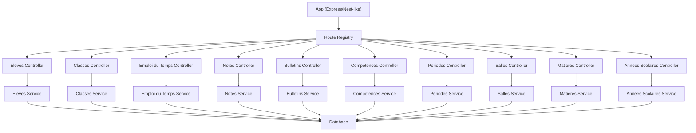
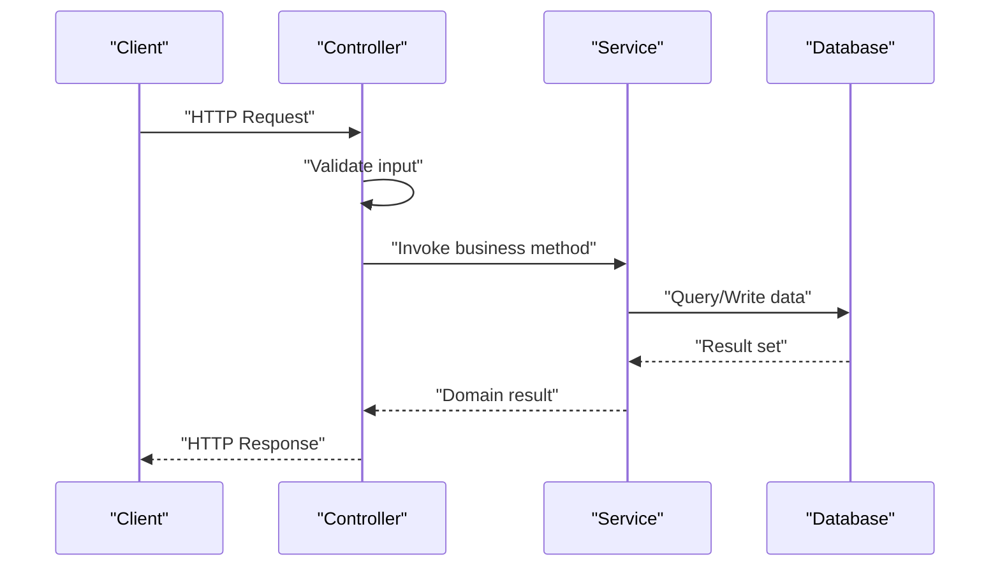
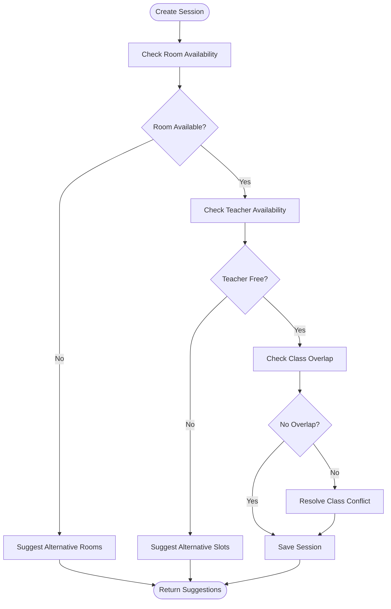
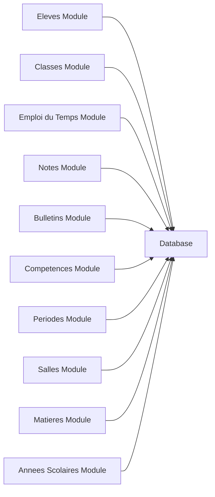

# Academic Management API

<cite>
**Referenced Files in This Document**
- [app.ts](file://backend/src/app.ts)
- [route-registry.ts](file://backend/src/routes/route-registry.ts)
- [eleves.controller.ts](file://backend/src/modules/eleves/controllers/eleves.controller.ts)
- [eleves.service.ts](file://backend/src/modules/eleves/services/eleves.service.ts)
- [classes.controller.ts](file://backend/src/modules/classes/controllers/classes.controller.ts)
- [classes.service.ts](file://backend/src/modules/classes/services/classes.service.ts)
- [emploi-du-temps.controller.ts](file://backend/src/modules/emploi-du-temps/controllers/emploi-du-temps.controller.ts)
- [emploi-du-temps.service.ts](file://backend/src/modules/emploi-du-temps/services/emploi-du-temps.service.ts)
- [bulletins.controller.ts](file://backend/src/modules/bulletins/controllers/bulletins.controller.ts)
- [bulletins.service.ts](file://backend/src/modules/bulletins/services/bulletins.service.ts)
- [notes.controller.ts](file://backend/src/modules/notes/controllers/notes.controller.ts)
- [notes.service.ts](file://backend/src/modules/notes/services/notes.service.ts)
- [competences.controller.ts](file://backend/src/modules/competences/controllers/competences.controller.ts)
- [competences.service.ts](file://backend/src/modules/competences/services/competences.service.ts)
- [periodes.controller.ts](file://backend/src/modules/periodes/controllers/periodes.controller.ts)
- [periodes.service.ts](file://backend/src/modules/periodes/services/periodes.service.ts)
- [salles.controller.ts](file://backend/src/modules/salles/controllers/salles.controller.ts)
- [salles.service.ts](file://backend/src/modules/salles/services/salles.service.ts)
- [matieres.controller.ts](file://backend/src/modules/matieres/controllers/matieres.controller.ts)
- [matieres.service.ts](file://backend/src/modules/matieres/services/matieres.service.ts)
- [annees-scolaires.controller.ts](file://backend/src/modules/annees-scolaires/controllers/annees-scolaires.controller.ts)
- [annees-scolaires.service.ts](file://backend/src/modules/annees-scolaires/services/annees-scolaires.service.ts)
- [063-creer-module-emploi-du-temps.sql](file://backend/database/migrations/063-creer-module-emploi-du-temps.sql)
- [062-creer-table-evaluations-competences.sql](file://backend/database/migrations/062-creer-table-evaluations-competences.sql)
- [061-creer-table-bulletins-matieres.sql](file://backend/database/migrations/061-creer-table-bulletins-matieres.sql)
- [070-module-salles.sql](file://backend/database/migrations/070-module-salles.sql)
- [088-refactorisation-architecture-academique.sql](file://backend/database/migrations/088-refactorisation-architecture-academique.sql)
- [089-finalisation-architecture-academique-v2.sql](file://backend/database/migrations/089-finalisation-architecture-academique-v2.sql)
- [091-peuplement-architecture-academique.sql](file://backend/database/migrations/091-peuplement-architecture-academique.sql)
- [092-refactorisation-classeAnneeId.sql](file://backend/database/migrations/092-refactorisation-classeAnneeId.sql)
- [102-periodes-hierarchie.sql](file://backend/database/migrations/102-periodes-hierarchie.sql)
- [103-templates-periode-personnalisables.sql](file://backend/database/migrations/103-templates-periode-personnalisables.sql)
- [104-refonte-periodes-niveaux-configurables.sql](file://backend/database/migrations/104-refonte-periodes-niveaux-configurables.sql)
</cite>

## Table of Contents
1. [Introduction](#introduction)
2. [Project Structure](#project-structure)
3. [Core Components](#core-components)
4. [Architecture Overview](#architecture-overview)
5. [Detailed Component Analysis](#detailed-component-analysis)
6. [Dependency Analysis](#dependency-analysis)
7. [Performance Considerations](#performance-considerations)
8. [Troubleshooting Guide](#troubleshooting-guide)
9. [Conclusion](#conclusion)
10. [Appendices](#appendices)

## Introduction
This document provides comprehensive API documentation for eLISAschool’s academic management endpoints. It covers:
- Student information system APIs: enrollment workflows, profile management, and academic history tracking
- Class and schedule management APIs: timetable creation, room allocation, and conflict resolution
- Grade and evaluation system APIs: competency-based assessment, grade calculation rules, and report card generation
- Academic calendar APIs: period management, holiday configuration, and exam scheduling

The goal is to enable developers to integrate with the backend services reliably by describing request/response patterns, validation rules, and business logic constraints.

## Project Structure
Academic management functionality is implemented as modular services under backend/src/modules, each exposing REST endpoints via controllers and backed by services and database migrations. The application bootstraps routes through a central registry and mounts them on the main app instance.



**Diagram sources**
- [app.ts](file://backend/src/app.ts)
- [route-registry.ts](file://backend/src/routes/route-registry.ts)
- [eleves.controller.ts](file://backend/src/modules/eleves/controllers/eleves.controller.ts)
- [classes.controller.ts](file://backend/src/modules/classes/controllers/classes.controller.ts)
- [emploi-du-temps.controller.ts](file://backend/src/modules/emploi-du-temps/controllers/emploi-du-temps.controller.ts)
- [notes.controller.ts](file://backend/src/modules/notes/controllers/notes.controller.ts)
- [bulletins.controller.ts](file://backend/src/modules/bulletins/controllers/bulletins.controller.ts)
- [competences.controller.ts](file://backend/src/modules/competences/controllers/competences.controller.ts)
- [periodes.controller.ts](file://backend/src/modules/periodes/controllers/periodes.controller.ts)
- [salles.controller](file://backend/src/modules/salles/controllers/salles.controller.ts)
- [matieres.controller.ts](file://backend/src/modules/matieres/controllers/matieres.controller.ts)
- [annees-scolaires.controller.ts](file://backend/src/modules/annees-scolaires/controllers/annees-scolaires.controller.ts)

**Section sources**
- [app.ts](file://backend/src/app.ts)
- [route-registry.ts](file://backend/src/routes/route-registry.ts)

## Core Components
- Students (Eleves): Enrollment, profile CRUD, and academic history retrieval
- Classes: Class lifecycle and student assignment
- Timetable (Emploi du temps): Schedule creation, room allocation, and conflict checks
- Grades (Notes): Assessment entries and aggregation
- Evaluations/Competencies (Competences): Competency-based assessments and scoring
- Report Cards (Bulletins): Generation and export of academic reports
- Periods (Périodes): Academic periods, holidays, and exam scheduling
- Rooms (Salles): Room inventory and availability
- Subjects (Matières): Subject catalog and assignments
- School Years (Années scolaires): Year boundaries and period templates

Key responsibilities:
- Controllers handle HTTP requests, validate inputs, and delegate to services
- Services implement business logic, orchestrate data access, and enforce constraints
- Migrations define schema evolution for academic entities

**Section sources**
- [eleves.controller.ts](file://backend/src/modules/eleves/controllers/eleves.controller.ts)
- [eleves.service.ts](file://backend/src/modules/eleves/services/eleves.service.ts)
- [classes.controller.ts](file://backend/src/modules/classes/controllers/classes.controller.ts)
- [classes.service.ts](file://backend/src/modules/classes/services/classes.service.ts)
- [emploi-du-temps.controller.ts](file://backend/src/modules/emploi-du-temps/controllers/emploi-du-temps.controller.ts)
- [emploi-du-temps.service.ts](file://backend/src/modules/emploi-du-temps/services/emploi-du-temps.service.ts)
- [notes.controller.ts](file://backend/src/modules/notes/controllers/notes.controller.ts)
- [notes.service.ts](file://backend/src/modules/notes/services/notes.service.ts)
- [bulletins.controller.ts](file://backend/src/modules/bulletins/controllers/bulletins.controller.ts)
- [bulletins.service.ts](file://backend/src/modules/bulletins/services/bulletins.service.ts)
- [competences.controller.ts](file://backend/src/modules/competences/controllers/competences.controller.ts)
- [competences.service.ts](file://backend/src/modules/competences/services/competences.service.ts)
- [periodes.controller.ts](file://backend/src/modules/periodes/controllers/periodes.controller.ts)
- [periodes.service.ts](file://backend/src/modules/periodes/services/periodes.service.ts)
- [salles.controller.ts](file://backend/src/modules/salles/controllers/salles.controller.ts)
- [salles.service.ts](file://backend/src/modules/salles/services/salles.service.ts)
- [matieres.controller.ts](file://backend/src/modules/matieres/controllers/matieres.controller.ts)
- [matieres.service.ts](file://backend/src/modules/matieres/services/matieres.service.ts)
- [annees-scolaires.controller.ts](file://backend/src/modules/annees-scolaires/controllers/annees-scolaires.controller.ts)
- [annees-scolaires.service.ts](file://backend/src/modules/annees-scolaires/services/annees-scolaires.service.ts)

## Architecture Overview
The academic module follows a layered architecture:
- Presentation layer: Controllers expose REST endpoints
- Business layer: Services encapsulate domain logic and validations
- Data layer: Database models and migrations provide persistence



[No diagram sources needed since this diagram shows conceptual flow]

## Detailed Component Analysis

### Student Information System (Students)
Endpoints overview:
- Create enrollment
- Update student profile
- Retrieve student details and academic history
- List students with filters (class, year, status)

Request/response examples:
- POST /api/students/enroll
  - Body fields: studentId, classId, schoolYearId, enrollmentDate, status
  - Validation: required fields, valid references, date within school year
  - Response: enrollment record with computed fields
- PUT /api/students/:id/profile
  - Body fields: personal info, contact, guardians
  - Validation: email format, phone pattern, guardian relationships
  - Response: updated profile
- GET /api/students/:id/history
  - Query params: includeGrades, includePeriods
  - Response: timeline of enrollments, grades, and period results

Business logic constraints:
- Enrollment must reference an active class within the selected school year
- Profile updates cannot modify immutable identifiers
- Academic history aggregates across periods and subjects

Error handling:
- 400 for validation errors
- 404 for missing entities
- 409 for duplicate or conflicting enrollments

**Section sources**
- [eleves.controller.ts](file://backend/src/modules/eleves/controllers/eleves.controller.ts)
- [eleves.service.ts](file://backend/src/modules/eleves/services/eleves.service.ts)

### Class and Schedule Management (Classes, Timetable, Rooms)
Endpoints overview:
- Manage classes and assign teachers/subjects
- Create timetables and allocate rooms
- Detect and resolve conflicts

Request/response examples:
- POST /api/classes
  - Body fields: name, levelId, cycleId, schoolYearId, capacity
  - Validation: unique name per year, capacity > 0
  - Response: created class
- POST /api/timetables
  - Body fields: classId, teacherId, subjectId, roomId, startTime, endTime, dayOfWeek
  - Validation: time overlap checks, room capacity, teacher availability
  - Response: timetable entry with conflict warnings
- GET /api/timetables/conflicts?classId=&dateRange=
  - Response: list of overlapping sessions and suggestions

Conflict resolution workflow:


**Diagram sources**
- [emploi-du-temps.controller.ts](file://backend/src/modules/emploi-du-temps/controllers/emploi-du-temps.controller.ts)
- [emploi-du-temps.service.ts](file://backend/src/modules/emploi-du-temps/services/emploi-du-temps.service.ts)
- [salles.controller.ts](file://backend/src/modules/salles/controllers/salles.controller.ts)
- [salles.service.ts](file://backend/src/modules/salles/services/salles.service.ts)

**Section sources**
- [classes.controller.ts](file://backend/src/modules/classes/controllers/classes.controller.ts)
- [classes.service.ts](file://backend/src/modules/classes/services/classes.service.ts)
- [emploi-du-temps.controller.ts](file://backend/src/modules/emploi-du-temps/controllers/emploi-du-temps.controller.ts)
- [emploi-du-temps.service.ts](file://backend/src/modules/emploi-du-temps/services/emploi-du-temps.service.ts)
- [salles.controller.ts](file://backend/src/modules/salles/controllers/salles.controller.ts)
- [salles.service.ts](file://backend/src/modules/salles/services/salles.service.ts)

### Grade and Evaluation System (Notes, Competences, Bulletins)
Endpoints overview:
- Record assessments and grades
- Compute final scores using coefficients and rules
- Generate report cards per period/year

Request/response examples:
- POST /api/grades
  - Body fields: studentId, subjectId, periodId, score, coefficient, type
  - Validation: score range, coefficient > 0, period within school year
  - Response: grade entry with computed weighted value
- GET /api/grades/calculate?studentId=&periodId=
  - Response: aggregated scores by subject and overall average
- POST /api/report-cards/generate
  - Body fields: studentId, periodId, templateId
  - Response: PDF/JSON report card with competencies and remarks

Competency-based assessment:
- POST /api/competencies/assessments
  - Body fields: studentId, competenceId, level, evidence
  - Validation: competence exists, level within defined scale
  - Response: assessment record linked to student progress

Report card generation:
- Uses bulletins service to aggregate notes and competencies
- Applies grading rules and formatting based on template

**Section sources**
- [notes.controller.ts](file://backend/src/modules/notes/controllers/notes.controller.ts)
- [notes.service.ts](file://backend/src/modules/notes/services/notes.service.ts)
- [competences.controller.ts](file://backend/src/modules/competences/controllers/competences.controller.ts)
- [competences.service.ts](file://backend/src/modules/competences/services/competences.service.ts)
- [bulletins.controller.ts](file://backend/src/modules/bulletins/controllers/bulletins.controller.ts)
- [bulletins.service.ts](file://backend/src/modules/bulletins/services/bulletins.service.ts)

### Academic Calendar (Periods, Holidays, Exams)
Endpoints overview:
- Manage academic periods and hierarchies
- Configure holidays and exam schedules
- Link periods to school years and levels

Request/response examples:
- POST /api/periods
  - Body fields: name, startDate, endDate, type, parentId
  - Validation: non-overlapping dates, parent-child hierarchy integrity
  - Response: created period
- PUT /api/periods/:id/holidays
  - Body fields: holidayDates[], reason
  - Validation: dates within period bounds
  - Response: updated holiday list
- GET /api/periods/exams?periodId=
  - Response: scheduled exams with room and invigilator assignments

Constraints:
- Periods must belong to an active school year
- Holiday configurations cannot extend beyond period boundaries
- Exam scheduling respects room and teacher availability

**Section sources**
- [periodes.controller.ts](file://backend/src/modules/periodes/controllers/periodes.controller.ts)
- [periodes.service.ts](file://backend/src/modules/periodes/services/periodes.service.ts)

### Supporting Entities (Subjects, Rooms, School Years)
Endpoints overview:
- Manage subjects and their attributes
- Maintain room inventory and capacities
- Define school year boundaries and templates

Request/response examples:
- POST /api/subjects
  - Body fields: name, code, levelIds, coefficients
  - Validation: unique code per level, coefficients positive
  - Response: subject record
- POST /api/rooms
  - Body fields: name, capacity, type, features
  - Validation: capacity > 0, unique name per building
  - Response: room record
- POST /api/school-years
  - Body fields: name, startDate, endDate, defaultPeriodTemplate
  - Validation: non-overlapping years, valid template reference
  - Response: school year record

**Section sources**
- [matieres.controller.ts](file://backend/src/modules/matieres/controllers/matieres.controller.ts)
- [matieres.service.ts](file://backend/src/modules/matieres/services/matieres.service.ts)
- [salles.controller.ts](file://backend/src/modules/salles/controllers/salles.controller.ts)
- [salles.service.ts](file://backend/src/modules/salles/services/salles.service.ts)
- [annees-scolaires.controller.ts](file://backend/src/modules/annees-scolaires/controllers/annees-scolaires.controller.ts)
- [annees-scolaires.service.ts](file://backend/src/modules/annees-scolaires/services/annees-scolaires.service.ts)

## Dependency Analysis
Academic modules depend on shared infrastructure (database, RBAC, configuration). Key dependencies:
- Controllers depend on services for business logic
- Services depend on database models and migrations
- Cross-module interactions occur via shared IDs (e.g., classId, studentId, periodId)



**Diagram sources**
- [app.ts](file://backend/src/app.ts)
- [route-registry.ts](file://backend/src/routes/route-registry.ts)

**Section sources**
- [app.ts](file://backend/src/app.ts)
- [route-registry.ts](file://backend/src/routes/route-registry.ts)

## Performance Considerations
- Use pagination for large lists (students, grades, timetables)
- Index frequently queried fields (dates, IDs, codes)
- Cache static lookups (subjects, rooms, periods) where appropriate
- Batch operations for bulk enrollments and grade imports
- Avoid N+1 queries by joining related entities in services

[No sources needed since this section provides general guidance]

## Troubleshooting Guide
Common issues and resolutions:
- Validation failures: check required fields and formats in request bodies
- Conflict errors: review timetable overlaps and room availability
- Missing entities: verify referenced IDs exist and are active
- Permission errors: ensure user roles have necessary permissions

Debugging steps:
- Inspect controller logs for request payloads and responses
- Validate service-level business rules and constraints
- Review database constraints and migration states

**Section sources**
- [eleves.controller.ts](file://backend/src/modules/eleves/controllers/eleves.controller.ts)
- [emploi-du-temps.controller.ts](file://backend/src/modules/emploi-du-temps/controllers/emploi-du-temps.controller.ts)
- [notes.controller.ts](file://backend/src/modules/notes/controllers/notes.controller.ts)
- [bulletins.controller.ts](file://backend/src/modules/bulletins/controllers/bulletins.controller.ts)
- [periodes.controller.ts](file://backend/src/modules/periodes/controllers/periodes.controller.ts)

## Conclusion
The eLISAschool academic management APIs provide a robust foundation for managing students, classes, schedules, grades, evaluations, and academic calendars. By following the documented endpoints, validation rules, and business constraints, integrators can build reliable frontends and third-party tools that align with the system’s architecture and data model.

[No sources needed since this section summarizes without analyzing specific files]

## Appendices

### Database Schema Highlights
Key tables and relationships relevant to academic management:
- Timetable module schema
- Competency evaluations schema
- Bulletin subjects schema
- Rooms module schema
- Academic architecture refactoring and population
- Period hierarchy and templates

```mermaid
erDiagram
STUDENT {
uuid id PK
string firstName
string lastName
datetime birthDate
enum status
}
CLASS {
uuid id PK
string name
int capacity
uuid school_year_id FK
}
TIMETABLE_SESSION {
uuid id PK
uuid class_id FK
uuid teacher_id FK
uuid subject_id FK
uuid room_id FK
datetime start_time
datetime end_time
enum day_of_week
}
GRADE {
uuid id PK
uuid student_id FK
uuid subject_id FK
uuid period_id FK
decimal score
int coefficient
enum type
}
COMPETENCY_ASSESSMENT {
uuid id PK
uuid student_id FK
uuid competence_id FK
enum level
text evidence
}
BULLETIN_SUBJECT {
uuid id PK
uuid bulletin_id FK
uuid subject_id FK
decimal final_score
}
PERIOD {
uuid id PK
string name
datetime start_date
datetime end_date
uuid parent_id FK
}
ROOM {
uuid id PK
string name
int capacity
enum type
}
SUBJECT {
uuid id PK
string name
string code
}
SCHOOL_YEAR {
uuid id PK
string name
datetime start_date
datetime end_date
}
STUDENT ||--o{ GRADE : "has"
CLASS ||--o{ TIMETABLE_SESSION : "contains"
TEACHER ||--o{ TIMETABLE_SESSION : "teaches"
SUBJECT ||--o{ GRADE : "graded_in"
SUBJECT ||--o{ TIMETABLE_SESSION : "taught_as"
ROOM ||--o{ TIMETABLE_SESSION : "hosts"
PERIOD ||--o{ GRADE : "covers"
PERIOD ||--o{ COMPETENCY_ASSESSMENT : "includes"
SCHOOL_YEAR ||--o{ CLASS : "defines"
SCHOOL_YEAR ||--o{ PERIOD : "contains"
```

**Diagram sources**
- [063-creer-module-emploi-du-temps.sql](file://backend/database/migrations/063-creer-module-emploi-du-temps.sql)
- [062-creer-table-evaluations-competences.sql](file://backend/database/migrations/062-creer-table-evaluations-competences.sql)
- [061-creer-table-bulletins-matieres.sql](file://backend/database/migrations/061-creer-table-bulletins-matieres.sql)
- [070-module-salles.sql](file://backend/database/migrations/070-module-salles.sql)
- [088-refactorisation-architecture-academique.sql](file://backend/database/migrations/088-refactorisation-architecture-academique.sql)
- [089-finalisation-architecture-academique-v2.sql](file://backend/database/migrations/089-finalisation-architecture-academique-v2.sql)
- [091-peuplement-architecture-academique.sql](file://backend/database/migrations/091-peuplement-architecture-academique.sql)
- [092-refactorisation-classeAnneeId.sql](file://backend/database/migrations/092-refactorisation-classeAnneeId.sql)
- [102-periodes-hierarchie.sql](file://backend/database/migrations/102-periodes-hierarchie.sql)
- [103-templates-periode-personnalisables.sql](file://backend/database/migrations/103-templates-periode-personnalisables.sql)
- [104-refonte-periodes-niveaux-configurables.sql](file://backend/database/migrations/104-refonte-periodes-niveaux-configurables.sql)