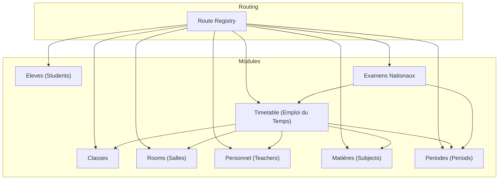
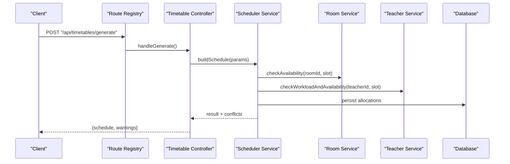
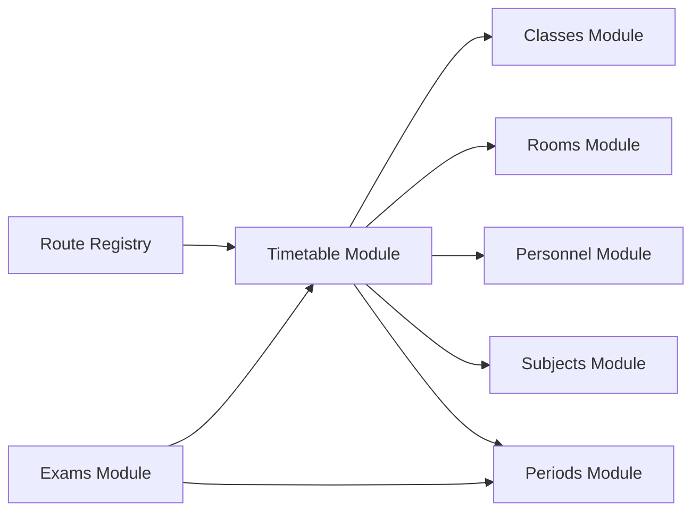

# Class & Scheduling API

<cite>
**Referenced Files in This Document**
- [backend/src/modules/classes/index.ts](file://backend/src/modules/classes/index.ts)
- [backend/src/modules/emploi-du-temps/index.ts](file://backend/src/modules/emploi-du-temps/index.ts)
- [backend/src/modules/salles/index.ts](file://backend/src/modules/salles/index.ts)
- [backend/src/modules/personnel/index.ts](file://backend/src/modules/personnel/index.ts)
- [backend/src/modules/eleves/index.ts](file://backend/src/modules/eleves/index.ts)
- [backend/src/modules/matieres/index.ts](file://backend/src/modules/matieres/index.ts)
- [backend/src/modules/periodes/index.ts](file://backend/src/modules/periodes/index.ts)
- [backend/src/modules/examens-nationaux/index.ts](file://backend/src/modules/examens-nationaux/index.ts)
- [backend/src/routes/route-registry.ts](file://backend/src/routes/route-registry.ts)
- [backend/database/migrations/063-creer-module-emploi-du-temps.sql](file://backend/database/migrations/063-creer-module-emploi-du-temps.sql)
- [backend/database/migrations/070-module-salles.sql](file://backend/database/migrations/070-module-salles.sql)
- [backend/database/migrations/100-classes-salle-principale.sql](file://backend/database/migrations/100-classes-salle-principale.sql)
</cite>

## Table of Contents
1. [Introduction](#introduction)
2. [Project Structure](#project-structure)
3. [Core Components](#core-components)
4. [Architecture Overview](#architecture-overview)
5. [Detailed Component Analysis](#detailed-component-analysis)
6. [Dependency Analysis](#dependency-analysis)
7. [Performance Considerations](#performance-considerations)
8. [Troubleshooting Guide](#troubleshooting-guide)
9. [Conclusion](#conclusion)
10. [Appendices](#appendices)

## Introduction
This document provides comprehensive API documentation for eLISAschool’s class and scheduling management capabilities. It covers:
- Class structure APIs for creating classes, assigning students, and managing class hierarchies
- Timetable creation APIs including schedule generation, room allocation, and conflict resolution
- Teacher assignment APIs for course scheduling and workload management
- Periodic scheduling systems for exam timetables and holiday calendars
- Validation rules for time slot conflicts and resource availability checks
- Examples of schedule optimization, conflict detection, and bulk scheduling operations

The goal is to enable developers to integrate and extend the system with confidence, while ensuring robustness, performance, and maintainability.

## Project Structure
The backend organizes functionality by modules under src/modules. Relevant modules for this documentation include:
- Classes: class entities, hierarchy, and student assignments
- Emploi du temps (timetable): schedule generation, slots, allocations, and validations
- Salles (rooms): room resources and constraints
- Personnel (teachers): teacher availability, workload, and assignments
- Eleves (students): enrollment and class membership
- Matières (subjects): curriculum mapping to classes and teachers
- Periodes (periods): academic periods and recurring schedules
- Examens nationaux (national exams): periodic exam timetable generation

**Diagram sources**
- [backend/src/routes/route-registry.ts](file://backend/src/routes/route-registry.ts)
- [backend/src/modules/classes/index.ts](file://backend/src/modules/classes/index.ts)
- [backend/src/modules/emploi-du-temps/index.ts](file://backend/src/modules/emploi-du-temps/index.ts)
- [backend/src/modules/salles/index.ts](file://backend/src/modules/salles/index.ts)
- [backend/src/modules/personnel/index.ts](file://backend/src/modules/personnel/index.ts)
- [backend/src/modules/eleves/index.ts](file://backend/src/modules/eleves/index.ts)
- [backend/src/modules/matieres/index.ts](file://backend/src/modules/matieres/index.ts)
- [backend/src/modules/periodes/index.ts](file://backend/src/modules/periodes/index.ts)
- [backend/src/modules/examens-nationaux/index.ts](file://backend/src/modules/examens-nationaux/index.ts)

**Section sources**
- [backend/src/routes/route-registry.ts](file://backend/src/routes/route-registry.ts)
- [backend/src/modules/classes/index.ts](file://backend/src/modules/classes/index.ts)
- [backend/src/modules/emploi-du-temps/index.ts](file://backend/src/modules/emploi-du-temps/index.ts)
- [backend/src/modules/salles/index.ts](file://backend/src/modules/salles/index.ts)
- [backend/src/modules/personnel/index.ts](file://backend/src/modules/personnel/index.ts)
- [backend/src/modules/eleves/index.ts](file://backend/src/modules/eleves/index.ts)
- [backend/src/modules/matieres/index.ts](file://backend/src/modules/matieres/index.ts)
- [backend/src/modules/periodes/index.ts](file://backend/src/modules/periodes/index.ts)
- [backend/src/modules/examens-nationaux/index.ts](file://backend/src/modules/examens-nationaux/index.ts)

## Core Components
- Class Management
  - Create/update classes, define hierarchical relationships (e.g., levels, sections), and manage metadata such as capacity and labels.
  - Assign students to classes and track enrollment changes over time.
- Timetable Management
  - Define time slots, days, and periods; generate weekly schedules; allocate rooms; detect and resolve conflicts.
- Room Management
  - Manage room inventory, capacities, equipment, and availability windows.
- Teacher Management
  - Maintain teacher profiles, availability, preferred subjects, and workload limits.
- Student Management
  - Maintain student records and their memberships across classes and groups.
- Subject Management
  - Maintain subject catalog and mappings to curricula and evaluation schemes.
- Periods Management
  - Define academic periods, holidays, and recurring patterns used by timetables and exams.
- National Exams
  - Generate periodic exam timetables aligned with national calendars and constraints.

**Section sources**
- [backend/src/modules/classes/index.ts](file://backend/src/modules/classes/index.ts)
- [backend/src/modules/emploi-du-temps/index.ts](file://backend/src/modules/emploi-du-temps/index.ts)
- [backend/src/modules/salles/index.ts](file://backend/src/modules/salles/index.ts)
- [backend/src/modules/personnel/index.ts](file://backend/src/modules/personnel/index.ts)
- [backend/src/modules/eleves/index.ts](file://backend/src/modules/eleves/index.ts)
- [backend/src/modules/matieres/index.ts](file://backend/src/modules/matieres/index.ts)
- [backend/src/modules/periodes/index.ts](file://backend/src/modules/periodes/index.ts)
- [backend/src/modules/examens-nationaux/index.ts](file://backend/src/modules/examens-nationaux/index.ts)

## Architecture Overview
The API layer exposes REST endpoints registered via a central route registry. Each module encapsulates controllers, services, DTOs, and data access logic. The timetable engine coordinates multiple resources (classes, rooms, teachers, subjects, periods) to produce valid schedules.

**Diagram sources**
- [backend/src/routes/route-registry.ts](file://backend/src/routes/route-registry.ts)
- [backend/src/modules/emploi-du-temps/index.ts](file://backend/src/modules/emploi-du-temps/index.ts)
- [backend/src/modules/salles/index.ts](file://backend/src/modules/salles/index.ts)
- [backend/src/modules/personnel/index.ts](file://backend/src/modules/personnel/index.ts)

## Detailed Component Analysis

### Class Management API
Purpose:
- Create and update class entities
- Manage class hierarchy (levels, sections, streams)
- Enforce capacity and uniqueness constraints
- Assign and remove students from classes

Key endpoints (conceptual):
- POST /api/classes
- PATCH /api/classes/:id
- DELETE /api/classes/:id
- GET /api/classes/:id/students
- POST /api/classes/:id/students/bulk
- PUT /api/classes/:id/hierarchy

Validation rules:
- Unique class identifiers per establishment
- Capacity must be positive and not exceeded by enrollments
- Hierarchy references must exist and form a DAG (no cycles)

Conflict detection:
- Prevent duplicate names or codes within the same scope
- Warn when total assigned students exceed capacity

Bulk operations:
- Batch add/remove students with transactional integrity
- Return partial success results with per-student statuses

Example flows:
- Create class with initial students
- Reassign students between classes during term transitions
- Update class hierarchy after structural reorganization

**Section sources**
- [backend/src/modules/classes/index.ts](file://backend/src/modules/classes/index.ts)

### Timetable Creation and Schedule Generation API
Purpose:
- Define time slots and days
- Generate weekly schedules for classes and subjects
- Allocate rooms and teachers
- Detect and resolve conflicts

Key endpoints (conceptual):
- POST /api/timetables/slots
- POST /api/timetables/weeks
- POST /api/timetables/generate
- POST /api/timetables/allocate-room
- GET /api/timetables/conflicts
- PATCH /api/timetables/resolve-conflict

Algorithm highlights:
- Constraint-based scheduling with backtracking
- Priority heuristics for scarce resources (rooms, specialized teachers)
- Conflict detection for overlapping teacher/class/room usage
- Optional soft constraints for preferences and fairness

Room allocation:
- Match room capacity to class size
- Respect equipment requirements and maintenance windows

Conflict resolution:
- Auto-resolve by shifting sessions to alternative slots
- Provide manual override options with impact analysis

Example flows:
- Bulk import of weekly sessions and auto-generate schedule
- Resolve teacher double-bookings by swapping sessions
- Optimize room utilization by consolidating adjacent classes

**Section sources**
- [backend/src/modules/emploi-du-temps/index.ts](file://backend/src/modules/emploi-du-temps/index.ts)
- [backend/database/migrations/063-creer-module-emploi-du-temps.sql](file://backend/database/migrations/063-creer-module-emploi-du-temps.sql)

### Room Management API
Purpose:
- Manage room inventory, capacities, and features
- Define availability windows and maintenance blocks
- Integrate with timetable allocation engine

Key endpoints (conceptual):
- POST /api/rooms
- PATCH /api/rooms/:id
- DELETE /api/rooms/:id
- POST /api/rooms/:id/availability
- GET /api/rooms/:id/occupancy

Constraints:
- Capacity must be greater than zero
- Availability windows cannot overlap with maintenance blocks
- Room type must match required features for scheduled sessions

Integration points:
- Timetable generator queries available rooms per slot
- Occupancy analytics inform future capacity planning

**Section sources**
- [backend/src/modules/salles/index.ts](file://backend/src/modules/salles/index.ts)
- [backend/database/migrations/070-module-salles.sql](file://backend/database/migrations/070-module-salles.sql)

### Teacher Assignment and Workload Management API
Purpose:
- Maintain teacher profiles, availability, and subject qualifications
- Enforce workload caps and distribute teaching hours fairly
- Assign teachers to sessions and classes

Key endpoints (conceptual):
- POST /api/personnel/teachers
- PATCH /api/personnel/teachers/:id
- POST /api/personnel/teachers/:id/availability
- POST /api/personnel/teachers/:id/assignments
- GET /api/personnel/teachers/:id/workload

Rules:
- Weekly hour caps per teacher and per subject
- Availability windows respected by scheduler
- Qualification checks ensure teacher can teach assigned subjects

Optimization:
- Balance workloads across teachers
- Prefer teachers’ preferred slots and minimize travel/time gaps

**Section sources**
- [backend/src/modules/personnel/index.ts](file://backend/src/modules/personnel/index.ts)

### Student Enrollment and Class Membership API
Purpose:
- Enroll students into classes and groups
- Track historical memberships and transfers
- Support bulk operations for intake periods

Key endpoints (conceptual):
- POST /api/eleves/:id/enroll
- POST /api/eleves/bulk-enroll
- DELETE /api/eleves/:id/enrollments/:classId
- GET /api/eleves/:id/enrollments

Validation:
- Ensure class capacity is not exceeded
- Prevent duplicate active enrollments
- Validate eligibility based on grade/level rules

**Section sources**
- [backend/src/modules/eleves/index.ts](file://backend/src/modules/eleves/index.ts)

### Subject Catalog and Curriculum Mapping API
Purpose:
- Maintain subjects and their attributes
- Map subjects to classes and evaluation schemes
- Support coefficient and credit definitions

Key endpoints (conceptual):
- POST /api/matieres
- PATCH /api/matieres/:id
- POST /api/matieres/:id/class-mappings
- GET /api/matieres/:id/usage

Constraints:
- Unique subject codes per establishment
- Valid parent-child relationships if applicable

**Section sources**
- [backend/src/modules/matieres/index.ts](file://backend/src/modules/matieres/index.ts)

### Periods and Recurring Schedules API
Purpose:
- Define academic periods, weeks, and holidays
- Configure recurring patterns for timetables and exams
- Align schedules with institutional calendars

Key endpoints (conceptual):
- POST /api/periodes
- PATCH /api/periodes/:id
- POST /api/periodes/:id/recurring-patterns
- GET /api/periodes/:id/calendar

Rules:
- Non-overlapping period ranges per establishment
- Holiday blocks block scheduling unless explicitly allowed

**Section sources**
- [backend/src/modules/periodes/index.ts](file://backend/src/modules/periodes/index.ts)

### National Exams and Periodic Timetables API
Purpose:
- Generate exam timetables aligned with national calendars
- Coordinate exam sessions, rooms, invigilators, and student groups
- Handle special constraints (e.g., spacing between exams)

Key endpoints (conceptual):
- POST /api/exams/national/generate
- POST /api/exams/national/allocate
- GET /api/exams/national/conflicts
- PATCH /api/exams/national/resolve

Constraints:
- Minimum spacing between same-student exams
- Room capacity and security requirements
- Invigilator availability and workload limits

**Section sources**
- [backend/src/modules/examens-nationaux/index.ts](file://backend/src/modules/examens-nationaux/index.ts)

## Dependency Analysis
The following diagram shows how the timetable generator depends on other modules to validate and allocate resources.

**Diagram sources**
- [backend/src/routes/route-registry.ts](file://backend/src/routes/route-registry.ts)
- [backend/src/modules/emploi-du-temps/index.ts](file://backend/src/modules/emploi-du-temps/index.ts)
- [backend/src/modules/classes/index.ts](file://backend/src/modules/classes/index.ts)
- [backend/src/modules/salles/index.ts](file://backend/src/modules/salles/index.ts)
- [backend/src/modules/personnel/index.ts](file://backend/src/modules/personnel/index.ts)
- [backend/src/modules/matieres/index.ts](file://backend/src/modules/matieres/index.ts)
- [backend/src/modules/periodes/index.ts](file://backend/src/modules/periodes/index.ts)
- [backend/src/modules/examens-nationaux/index.ts](file://backend/src/modules/examens-nationaux/index.ts)

**Section sources**
- [backend/src/routes/route-registry.ts](file://backend/src/routes/route-registry.ts)
- [backend/src/modules/emploi-du-temps/index.ts](file://backend/src/modules/emploi-du-temps/index.ts)

## Performance Considerations
- Use pagination and filtering for large datasets (classes, students, rooms).
- Cache read-heavy lookups (room availability, teacher availability) with short TTLs.
- Batch database writes for bulk enrollments and schedule generations.
- Index frequently queried columns (establishment_id, period_id, class_id, room_id, teacher_id).
- Offload heavy scheduling jobs to background workers with progress tracking.
- Avoid N+1 queries by eager loading related entities where appropriate.

[No sources needed since this section provides general guidance]

## Troubleshooting Guide
Common issues and resolutions:
- Time slot conflicts
  - Check overlapping sessions for the same teacher, class, or room.
  - Use conflict detection endpoints to list violations and suggested fixes.
- Resource unavailability
  - Verify room availability windows and maintenance blocks.
  - Confirm teacher availability and workload caps.
- Capacity exceeded
  - Review class capacity vs. current enrollments.
  - Split classes or adjust capacity before finalizing schedules.
- Invalid hierarchy
  - Ensure no cycles in class hierarchy and all referenced IDs exist.
- Bulk operation failures
  - Inspect per-item errors and roll back transactions accordingly.

Operational tips:
- Enable detailed logs for scheduling decisions and constraint checks.
- Export conflict reports for manual review and iterative adjustments.
- Use dry-run modes for schedule generation to preview outcomes without persistence.

**Section sources**
- [backend/src/modules/emploi-du-temps/index.ts](file://backend/src/modules/emploi-du-temps/index.ts)
- [backend/src/modules/salles/index.ts](file://backend/src/modules/salles/index.ts)
- [backend/src/modules/personnel/index.ts](file://backend/src/modules/personnel/index.ts)
- [backend/src/modules/classes/index.ts](file://backend/src/modules/classes/index.ts)

## Conclusion
The eLISAschool class and scheduling APIs provide a robust foundation for managing academic structures, timetables, and periodic events. By leveraging constraint-based scheduling, clear validation rules, and modular design, institutions can automate complex scheduling tasks while maintaining control over exceptions and optimizations.

[No sources needed since this section summarizes without analyzing specific files]

## Appendices

### Validation Rules Summary
- Time slot conflicts: prevent overlapping assignments for the same teacher, class, or room within a period.
- Resource availability: enforce room capacity, equipment requirements, and availability windows.
- Teacher workload: cap weekly hours and respect availability and qualifications.
- Class hierarchy: ensure acyclic relationships and valid references.
- Student enrollment: enforce capacity and eligibility constraints.

### Example Scenarios
- Schedule optimization: prefer teachers’ preferred slots and balance workloads across staff.
- Conflict detection: identify and report overlaps, then propose alternative slots.
- Bulk scheduling: import hundreds of sessions and auto-generate a coherent weekly plan.

[No sources needed since this section provides general guidance]