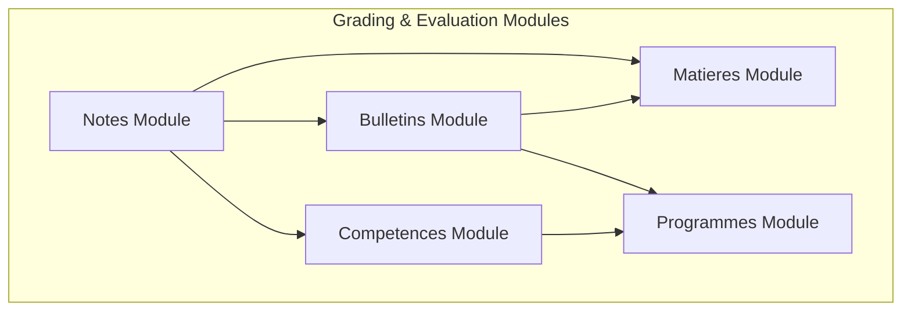
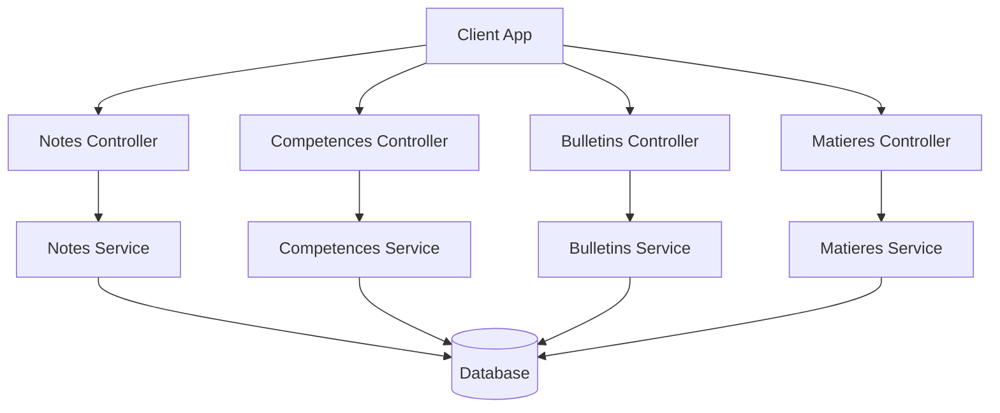
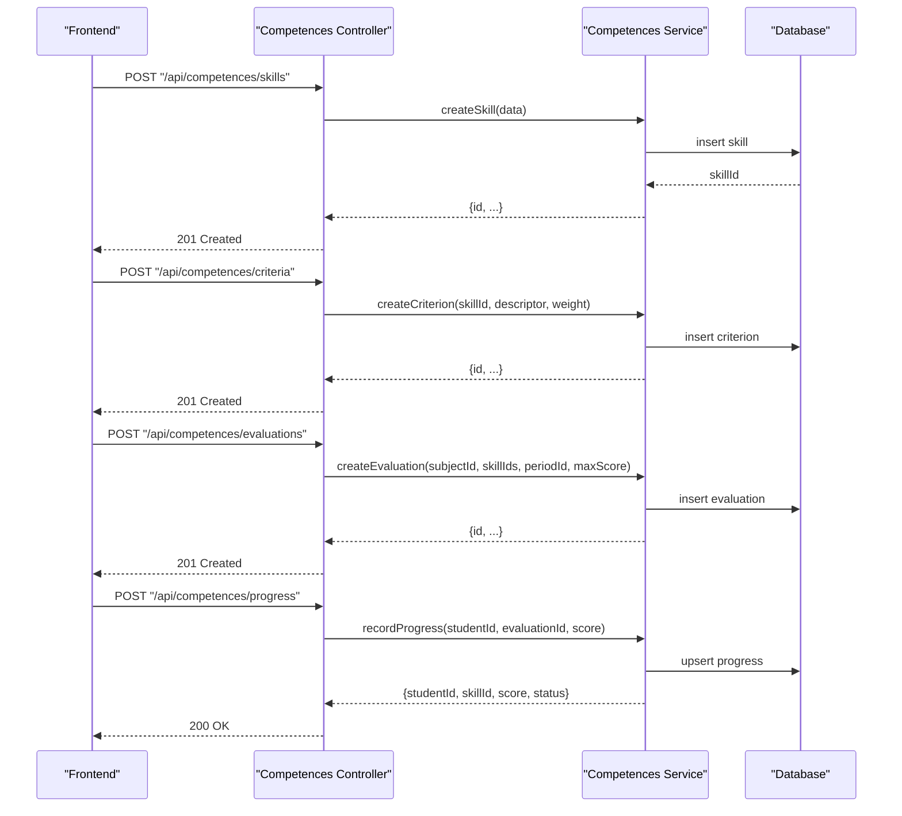
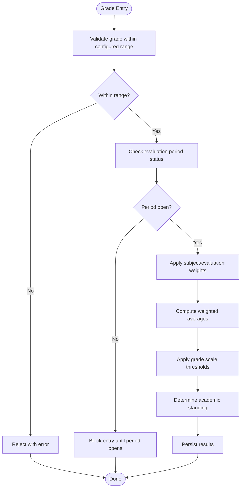
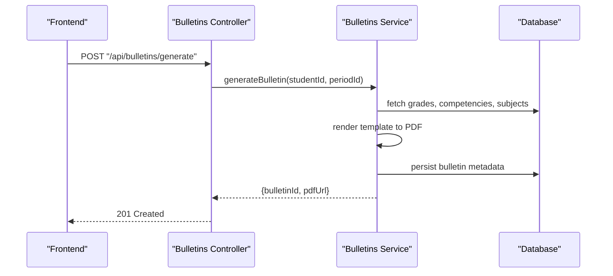
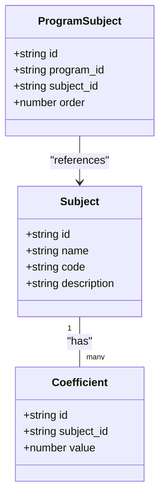
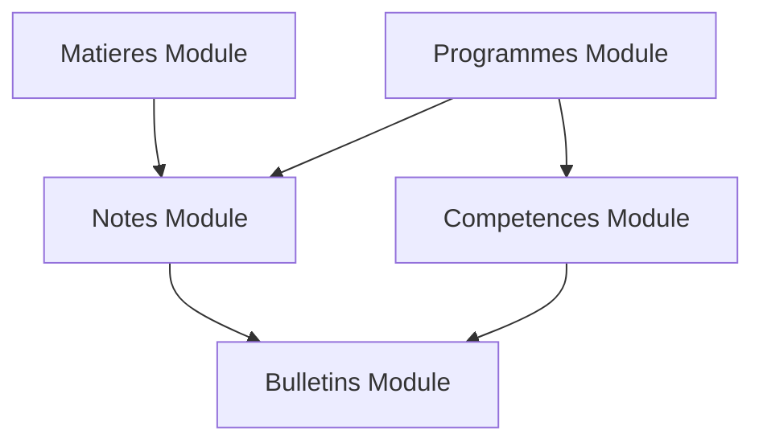

# Grading & Evaluation API

<cite>
**Referenced Files in This Document**
- [backend/src/modules/notes](file://backend/src/modules/notes)
- [backend/src/modules/competences](file://backend/src/modules/competences)
- [backend/src/modules/bulletins](file://backend/src/modules/bulletins)
- [backend/src/modules/matieres](file://backend/src/modules/matieres)
- [backend/src/modules/programmes](file://backend/src/modules/programmes)
- [backend/database/migrations/062-creer-table-evaluations-competences.sql](file://backend/database/migrations/062-creer-table-evaluations-competences.sql)
- [backend/database/migrations/059-ajouter-a-matiere-sous-systeme.sql](file://backend/database/migrations/059-ajouter-a-matiere-sous-systeme.sql)
- [backend/database/migrations/060-ajouter-affectation-matiere-coefficient.sql](file://backend/database/migrations/060-ajouter-affectation-matiere-coefficient.sql)
- [backend/database/migrations/061-creer-table-bulletins-matieres.sql](file://backend/database/migrations/061-creer-table-bulletins-matieres.sql)
- [backend/database/migrations/106-rename-sequence-to-evaluation.sql](file://backend/database/migrations/106-rename-sequence-to-evaluation.sql)
</cite>

## Table of Contents
1. [Introduction](#introduction)
2. [Project Structure](#project-structure)
3. [Core Components](#core-components)
4. [Architecture Overview](#architecture-overview)
5. [Detailed Component Analysis](#detailed-component-analysis)
6. [Dependency Analysis](#dependency-analysis)
7. [Performance Considerations](#performance-considerations)
8. [Troubleshooting Guide](#troubleshooting-guide)
9. [Conclusion](#conclusion)
10. [Appendices](#appendices)

## Introduction
This document provides comprehensive API documentation for eLISAschool’s grading and evaluation system. It covers competency-based assessment APIs (skill definitions, evaluation criteria, progress tracking), grade calculation APIs with configurable weighting systems, grade scales, and academic standing rules, as well as report card generation APIs for bulletin creation, transcript generation, and academic performance reports. Subject management APIs for curriculum organization and coefficient calculations are also included. The guide presents end-to-end workflows for grade entry, automated calculations, custom grading schemes, and validation rules for grade ranges, evaluation periods, and academic integrity checks.

## Project Structure
The grading and evaluation system is implemented across several backend modules:
- notes: Grade entries, evaluations, and related operations
- competences: Competency definitions, skill levels, and progress tracking
- bulletins: Bulletin and transcript generation
- matieres: Subject definitions and coefficients
- programmes: Curriculum organization and program structures

[No sources needed since this diagram shows conceptual workflow, not actual code structure]

## Core Components
- Competency-Based Assessment
  - Skill definitions and levels
  - Evaluation criteria mapping to skills
  - Progress tracking per student and period
- Grade Calculation Engine
  - Configurable weighting by subject and evaluation type
  - Grade scales and thresholds
  - Academic standing rules (pass/fail, honors, etc.)
- Report Card Generation
  - Bulletin creation per period/year
  - Transcript generation with aggregated metrics
  - Performance reports and analytics
- Subject Management
  - Curriculum organization
  - Coefficient configuration and application
  - Mapping subjects to programs and cycles

**Section sources**
- [backend/src/modules/notes](file://backend/src/modules/notes)
- [backend/src/modules/competences](file://backend/src/modules/competences)
- [backend/src/modules/bulletins](file://backend/src/modules/bulletins)
- [backend/src/modules/matieres](file://backend/src/modules/matieres)
- [backend/src/modules/programmes](file://backend/src/modules/programmes)

## Architecture Overview
The system follows a modular architecture where each domain (grades, competencies, bulletins, subjects, programs) exposes REST endpoints via controllers and services. Data persistence is handled through database migrations that define the schema for evaluations, competencies, bulletins, and subject assignments.

[No sources needed since this diagram shows conceptual workflow, not actual code structure]

## Detailed Component Analysis

### Competency-Based Assessment APIs
- Endpoints overview
  - Skills: CRUD for skill definitions and levels
  - Criteria: Define evaluation criteria mapped to skills
  - Evaluations: Create assessments linked to skills and subjects
  - Progress: Track student progress per skill and period
- Key data models
  - Skill: identifier, name, description, level scale
  - Criterion: identifier, skill_id, descriptors, weights
  - Evaluation: identifier, subject_id, skill_ids, period_id, max_score
  - StudentProgress: student_id, skill_id, evaluation_id, score, status
- Validation rules
  - Score must be within configured min/max
  - Evaluation must belong to an active period
  - Skill-criterion mapping must exist before evaluation creation
- Example workflow
  - Create skill and criterion
  - Define evaluation with associated skills
  - Record student scores and compute progress
  - Retrieve progress dashboard data

**Section sources**
- [backend/src/modules/competences](file://backend/src/modules/competences)
- [backend/database/migrations/062-creer-table-evaluations-competences.sql](file://backend/database/migrations/062-creer-table-evaluations-competences.sql)

### Grade Calculation APIs
- Endpoints overview
  - Grades: CRUD for numeric grades per evaluation
  - Weights: Configure subject and evaluation weights
  - Scales: Define grade scales and thresholds
  - Standing: Compute academic standing based on rules
- Key data models
  - Grade: identifier, student_id, evaluation_id, value, timestamp
  - Weight: identifier, subject_id or evaluation_id, factor
  - Scale: identifier, label, min/max, pass_threshold
  - Standing: identifier, student_id, period_id, aggregate, status
- Calculation logic
  - Weighted average per subject using factors
  - Aggregation across subjects for overall average
  - Apply scale thresholds to determine standing
- Validation rules
  - Grade values within configured range
  - Period must be open for grade entry
  - Integrity checks prevent duplicate submissions

**Section sources**
- [backend/src/modules/notes](file://backend/src/modules/notes)
- [backend/database/migrations/060-ajouter-affectation-matiere-coefficient.sql](file://backend/database/migrations/060-ajouter-affectation-matiere-coefficient.sql)
- [backend/database/migrations/106-rename-sequence-to-evaluation.sql](file://backend/database/migrations/106-rename-sequence-to-evaluation.sql)

### Report Card Generation APIs
- Endpoints overview
  - Bulletins: Generate bulletin PDFs per student and period
  - Transcripts: Compile full-year transcripts with aggregates
  - Reports: Produce academic performance reports and analytics
- Key data models
  - Bulletin: identifier, student_id, period_id, generated_at, pdf_url
  - Transcript: identifier, student_id, year_id, generated_at, pdf_url
  - Report: identifier, student_id, period_id, metrics_json
- Generation process
  - Aggregate grades and competencies
  - Render templates into PDFs
  - Store artifacts and return URLs
- Validation rules
  - Ensure all required periods are closed
  - Verify completeness of grades and evaluations
  - Audit trail for generated documents

**Section sources**
- [backend/src/modules/bulletins](file://backend/src/modules/bulletins)
- [backend/database/migrations/061-creer-table-bulletins-matieres.sql](file://backend/database/migrations/061-creer-table-bulletins-matieres.sql)

### Subject Management APIs
- Endpoints overview
  - Subjects: CRUD for subject definitions
  - Coefficients: Assign coefficients to subjects and evaluations
  - Programs: Map subjects to programs and cycles
- Key data models
  - Subject: identifier, name, code, description
  - Coefficient: identifier, subject_id, value
  - ProgramSubject: identifier, program_id, subject_id, order
- Validation rules
  - Unique subject codes per establishment
  - Coefficient must be positive
  - Program-subject mapping must respect hierarchy

**Section sources**
- [backend/src/modules/matieres](file://backend/src/modules/matieres)
- [backend/database/migrations/059-ajouter-a-matiere-sous-systeme.sql](file://backend/database/migrations/059-ajouter-a-matiere-sous-systeme.sql)
- [backend/database/migrations/060-ajouter-affectation-matiere-coefficient.sql](file://backend/database/migrations/060-ajouter-affectation-matiere-coefficient.sql)

## Dependency Analysis
The grading and evaluation system depends on subject and program configurations to calculate grades and generate reports. Competency assessments integrate with evaluations and influence standing determinations.

[No sources needed since this diagram shows conceptual workflow, not actual code structure]

## Performance Considerations
- Indexing strategies for frequent queries on student_id, evaluation_id, and period_id
- Batch processing for bulletin generation to avoid timeouts
- Caching of static configurations like coefficients and scales
- Pagination for large lists of evaluations and progress records

[No sources needed since this section provides general guidance]

## Troubleshooting Guide
Common issues and resolutions:
- Grade entry blocked due to closed period: verify period status and reopen if necessary
- Invalid grade range: check configured min/max and adjust accordingly
- Missing subject coefficients: ensure coefficients are assigned before calculating averages
- Bulletin generation failures: confirm all required data is present and templates are valid

**Section sources**
- [backend/src/modules/notes](file://backend/src/modules/notes)
- [backend/src/modules/bulletins](file://backend/src/modules/bulletins)

## Conclusion
The eLISAschool grading and evaluation system provides robust APIs for competency-based assessments, grade calculations with configurable weighting, and comprehensive report card generation. Subject management supports curriculum organization and coefficient calculations. By following the documented workflows and validation rules, integrators can implement accurate and reliable academic processes.

[No sources needed since this section summarizes without analyzing specific files]

## Appendices
- API Endpoint Reference
  - Competences: /api/competences/skills, /api/competences/criteria, /api/competences/evaluations, /api/competences/progress
  - Notes: /api/notes/grades, /api/notes/weights, /api/notes/scales, /api/notes/standing
  - Bulletins: /api/bulletins/generate, /api/bulletins/transcripts, /api/bulletins/reports
  - Matieres: /api/matieres/subjects, /api/matieres/coefficients, /api/matieres/programs
- Validation Rules Summary
  - Grade ranges enforced per evaluation
  - Evaluation periods must be open for modifications
  - Academic integrity checks prevent unauthorized changes

**Section sources**
- [backend/src/modules/competences](file://backend/src/modules/competences)
- [backend/src/modules/notes](file://backend/src/modules/notes)
- [backend/src/modules/bulletins](file://backend/src/modules/bulletins)
- [backend/src/modules/matieres](file://backend/src/modules/matieres)