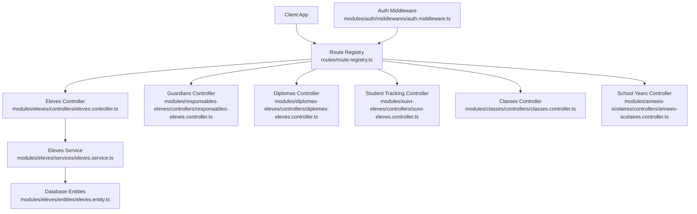
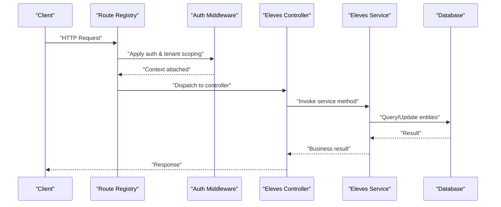
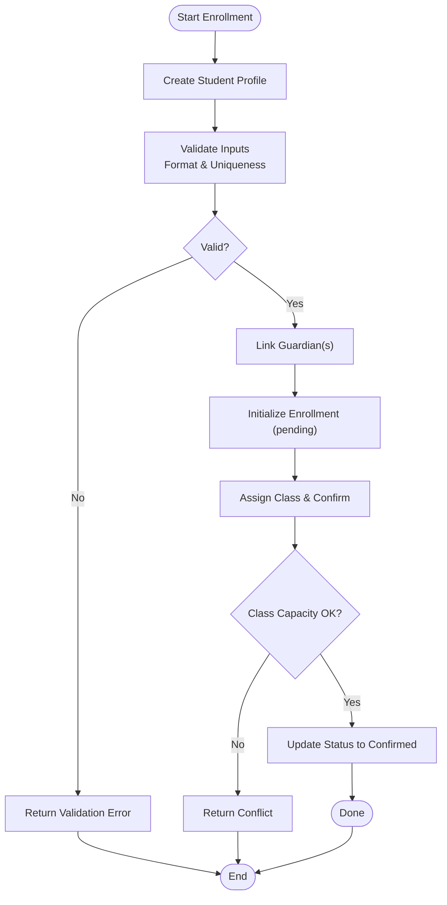
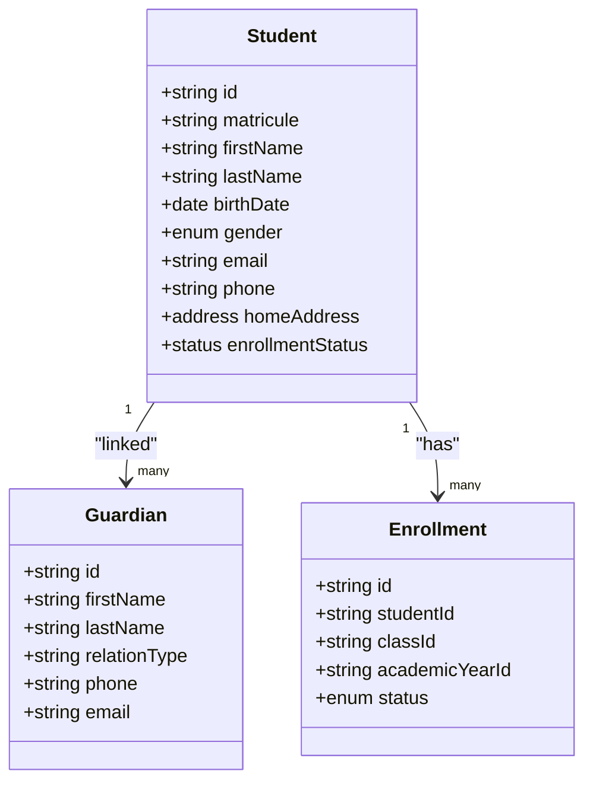
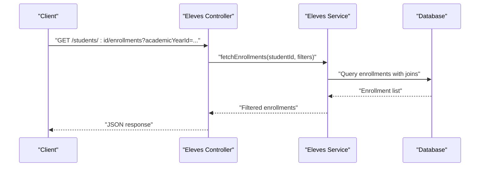
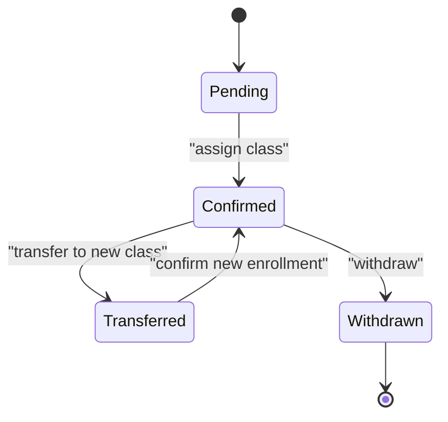
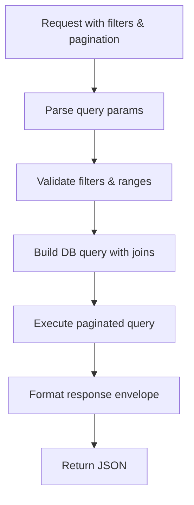
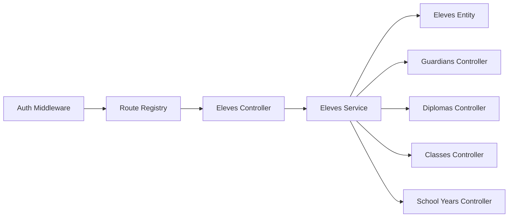

# Student Management API

<cite>
**Referenced Files in This Document**
- [app.ts](file://backend/src/app.ts)
- [route-registry.ts](file://backend/src/routes/route-registry.ts)
- [eleves.controller.ts](file://backend/src/modules/eleves/controllers/eleves.controller.ts)
- [eleves.service.ts](file://backend/src/modules/eleves/services/eleves.service.ts)
- [eleves.entity.ts](file://backend/src/modules/eleves/entities/eleves.entity.ts)
- [responsables-eleves.controller.ts](file://backend/src/modules/responsables-eleves/controllers/responsables-eleves.controller.ts)
- [diplomes-eleves.controller.ts](file://backend/src/modules/diplomes-eleves/controllers/diplomes-eleves.controller.ts)
- [suivi-eleves.controller.ts](file://backend/src/modules/suivi-eleves/controllers/suivi-eleves.controller.ts)
- [classes.controller.ts](file://backend/src/modules/classes/controllers/classes.controller.ts)
- [annees-scolaires.controller.ts](file://backend/src/modules/annees-scolaires/controllers/annees-scolaires.controller.ts)
- [auth.middleware.ts](file://backend/src/modules/auth/middlewares/auth.middleware.ts)
- [pagination-guide.md](file://backend/docs/pagination-guide.md)
</cite>

## Table of Contents
1. [Introduction](#introduction)
2. [Project Structure](#project-structure)
3. [Core Components](#core-components)
4. [Architecture Overview](#architecture-overview)
5. [Detailed Component Analysis](#detailed-component-analysis)
6. [Dependency Analysis](#dependency-analysis)
7. [Performance Considerations](#performance-considerations)
8. [Troubleshooting Guide](#troubleshooting-guide)
9. [Conclusion](#conclusion)
10. [Appendices](#appendices)

## Introduction
This document provides comprehensive API documentation for eLISAschool’s student management endpoints. It covers:
- Student enrollment workflows (registration, profile creation, academic history tracking)
- Student profile management (personal information updates, contact details, emergency contacts)
- Academic history APIs (enrollment records, class assignments, graduation status)
- Transfer and withdrawal processes with state transitions
- Request/response schemas, validation rules, business logic constraints, and authentication requirements
- Bulk operations, search filters, and pagination patterns

The goal is to enable developers to integrate with the student lifecycle features reliably and efficiently.

## Project Structure
Student management functionality is implemented as a set of modules under backend/src/modules. The primary module for students is eleves, with supporting modules for guardians (responsables-eleves), diplomas (diplomes-eleves), student tracking (suivi-eleves), classes, and school years. Routes are registered centrally and protected by authentication middleware.

**Diagram sources**
- [route-registry.ts](file://backend/src/routes/route-registry.ts)
- [eleves.controller.ts](file://backend/src/modules/eleves/controllers/eleves.controller.ts)
- [eleves.service.ts](file://backend/src/modules/eleves/services/eleves.service.ts)
- [eleves.entity.ts](file://backend/src/modules/eleves/entities/eleves.entity.ts)
- [responsables-eleves.controller.ts](file://backend/src/modules/responsables-eleves/controllers/responsables-eleves.controller.ts)
- [diplomes-eleves.controller.ts](file://backend/src/modules/diplomes-eleves/controllers/diplomes-eleves.controller.ts)
- [suivi-eleves.controller.ts](file://backend/src/modules/suivi-eleves/controllers/suivi-eleves.controller.ts)
- [classes.controller.ts](file://backend/src/modules/classes/controllers/classes.controller.ts)
- [annees-scolaires.controller.ts](file://backend/src/modules/annees-scolaires/controllers/annees-scolaires.controller.ts)
- [auth.middleware.ts](file://backend/src/modules/auth/middlewares/auth.middleware.ts)

**Section sources**
- [app.ts](file://backend/src/app.ts)
- [route-registry.ts](file://backend/src/routes/route-registry.ts)

## Core Components
- Eleves Module: Provides CRUD and workflow endpoints for student profiles, enrollment, transfers, withdrawals, and related data.
- Responsables-Eleves Module: Manages parent/guardian relationships and emergency contacts linked to students.
- Diplomes-Eleves Module: Handles graduation records and diploma issuance tied to students.
- Suivi-Eleves Module: Tracks student progress, attendance, and academic history events.
- Classes and Annees Scolaires Modules: Provide reference data for class assignments and academic year context.

Key responsibilities:
- Enforce multi-tenant scoping per establishment
- Validate request payloads against entity constraints
- Manage state transitions for enrollment, transfer, and withdrawal
- Support pagination, filtering, and bulk operations where applicable

**Section sources**
- [eleves.controller.ts](file://backend/src/modules/eleves/controllers/eleves.controller.ts)
- [eleves.service.ts](file://backend/src/modules/eleves/services/eleves.service.ts)
- [eleves.entity.ts](file://backend/src/modules/eleves/entities/eleves.entity.ts)
- [responsables-eleves.controller.ts](file://backend/src/modules/responsables-eleves/controllers/responsables-eleves.controller.ts)
- [diplomes-eleves.controller.ts](file://backend/src/modules/diplomes-eleves/controllers/diplomes-eleves.controller.ts)
- [suivi-eleves.controller.ts](file://backend/src/modules/suivi-eleves/controllers/suivi-eleves.controller.ts)
- [classes.controller.ts](file://backend/src/modules/classes/controllers/classes.controller.ts)
- [annees-scolaires.controller.ts](file://backend/src/modules/annees-scolaires/controllers/annees-scolaires.controller.ts)

## Architecture Overview
The student management API follows a layered architecture:
- Controllers expose REST endpoints and handle input validation
- Services implement business logic, including state transitions and cross-entity operations
- Entities define data models and constraints
- Authentication middleware enforces access control and tenant scoping
- Route registry centralizes endpoint registration

**Diagram sources**
- [route-registry.ts](file://backend/src/routes/route-registry.ts)
- [auth.middleware.ts](file://backend/src/modules/auth/middlewares/auth.middleware.ts)
- [eleves.controller.ts](file://backend/src/modules/eleves/controllers/eleves.controller.ts)
- [eleves.service.ts](file://backend/src/modules/eleves/services/eleves.service.ts)
- [eleves.entity.ts](file://backend/src/modules/eleves/entities/eleves.entity.ts)

## Detailed Component Analysis

### Student Enrollment Workflow
Covers registration, profile creation, and initial enrollment into a class within an academic year.

- Registration and Profile Creation
  - Endpoint: POST /api/students
  - Purpose: Create a new student profile and initiate enrollment
  - Authentication: Required (JWT or session-based via auth middleware)
  - Validation:
    - Required fields include personal identifiers, date of birth, gender, and guardian linkage
    - Email and phone must conform to format constraints if provided
    - Establishment ID is derived from authenticated tenant context
  - Business Logic:
    - Ensure uniqueness of matricule (student ID) within the establishment
    - Link to at least one responsible (guardian) if required by policy
    - Initialize enrollment record with default status pending confirmation
  - Response:
    - Returns created student object with enrollment reference
    - Includes next steps for enrollment confirmation

- Class Assignment and Enrollment Confirmation
  - Endpoint: PUT /api/students/:id/enrollments
  - Purpose: Assign student to a class and confirm enrollment
  - Constraints:
    - Class must belong to the same establishment and be open for the target academic year
    - Capacity checks enforced; returns conflict if full
  - State Transition:
    - Enrollment status moves from pending to confirmed upon successful assignment
  - Response:
    - Updated enrollment record with class and academic year references

- Academic Year Context
  - Reference Endpoints: GET /api/school-years, GET /api/school-years/:id
  - Used to validate academic year availability and configuration before enrollment

**Diagram sources**
- [eleves.controller.ts](file://backend/src/modules/eleves/controllers/eleves.controller.ts)
- [eleves.service.ts](file://backend/src/modules/eleves/services/eleves.service.ts)
- [annees-scolaires.controller.ts](file://backend/src/modules/annees-scolaires/controllers/annees-scolaires.controller.ts)

**Section sources**
- [eleves.controller.ts](file://backend/src/modules/eleves/controllers/eleves.controller.ts)
- [eleves.service.ts](file://backend/src/modules/eleves/services/eleves.service.ts)
- [annees-scolaires.controller.ts](file://backend/src/modules/annees-scolaires/controllers/annees-scolaires.controller.ts)

### Student Profile Management
Endpoints for updating personal information, contact details, and emergency contacts.

- Personal Information Updates
  - Endpoint: PATCH /api/students/:id
  - Fields: name, surname, date of birth, gender, nationality, etc.
  - Validation: Field-specific constraints enforced; partial updates supported
  - Response: Updated student object

- Contact Details
  - Endpoint: PATCH /api/students/:id/contact
  - Fields: email, phone, address
  - Validation: Email and phone formats; optional fields allowed
  - Response: Updated contact section

- Emergency Contacts (via Guardians Module)
  - Endpoint: POST /api/students/:id/guardians
  - Purpose: Add or update guardian linked as emergency contact
  - Validation: Guardian identity and relationship type validated
  - Response: Linked guardian record

**Diagram sources**
- [eleves.entity.ts](file://backend/src/modules/eleves/entities/eleves.entity.ts)
- [responsables-eleves.controller.ts](file://backend/src/modules/responsables-eleves/controllers/responsables-eleves.controller.ts)

**Section sources**
- [eleves.controller.ts](file://backend/src/modules/eleves/controllers/eleves.controller.ts)
- [responsables-eleves.controller.ts](file://backend/src/modules/responsables-eleves/controllers/responsables-eleves.controller.ts)

### Academic History APIs
Endpoints for enrollment records, class assignments, and graduation status.

- Enrollment Records
  - Endpoint: GET /api/students/:id/enrollments
  - Filters: academicYearId, classId, status
  - Response: List of enrollment records with references to class and academic year

- Class Assignments
  - Endpoint: GET /api/students/:id/class-assignments
  - Purpose: Retrieve current and historical class assignments
  - Response: Array of assignments with effective dates and statuses

- Graduation Status
  - Endpoint: GET /api/students/:id/diplomas
  - Purpose: Access diploma records and graduation status
  - Response: Diploma entries with issue dates and types

**Diagram sources**
- [eleves.controller.ts](file://backend/src/modules/eleves/controllers/eleves.controller.ts)
- [eleves.service.ts](file://backend/src/modules/eleves/services/eleves.service.ts)
- [diplomes-eleves.controller.ts](file://backend/src/modules/diplomes-eleves/controllers/diplomes-eleves.controller.ts)

**Section sources**
- [eleves.controller.ts](file://backend/src/modules/eleves/controllers/eleves.controller.ts)
- [diplomes-eleves.controller.ts](file://backend/src/modules/diplomes-eleves/controllers/diplomes-eleves.controller.ts)

### Transfer and Withdrawal Processes
Stateful workflows for transferring students between classes or withdrawing them from the institution.

- Transfer Between Classes
  - Endpoint: PUT /api/students/:id/transfer
  - Payload: targetClassId, effectiveDate, reason
  - Validation: Target class must be valid for the academic year; capacity check
  - State Transition: Current enrollment closed; new enrollment created and confirmed
  - Response: New enrollment record and audit trail entry

- Withdrawal
  - Endpoint: PUT /api/students/:id/withdraw
  - Payload: effectiveDate, reason, notes
  - Validation: Withdrawal allowed only if no active obligations (e.g., fees)
  - State Transition: Enrollment status updated to withdrawn; future enrollments blocked
  - Response: Updated student and enrollment records

**Diagram sources**
- [eleves.controller.ts](file://backend/src/modules/eleves/controllers/eleves.controller.ts)
- [eleves.service.ts](file://backend/src/modules/eleves/services/eleves.service.ts)

**Section sources**
- [eleves.controller.ts](file://backend/src/modules/eleves/controllers/eleves.controller.ts)
- [eleves.service.ts](file://backend/src/modules/eleves/services/eleves.service.ts)

### Search, Filtering, Pagination, and Bulk Operations
- Search and Filters
  - Query parameters: name, surname, matricule, gender, enrollmentStatus, academicYearId, classId
  - Partial matching on text fields; exact match on enums and IDs
- Pagination
  - Parameters: page, limit, sortBy, sortOrder
  - Consistent envelope structure with total count and metadata
  - See pagination guide for conventions and performance tips
- Bulk Operations
  - Endpoint: POST /api/students/bulk
  - Supported actions: create, update, assign-class, enroll-batch
  - Idempotency keys recommended for reliability
  - Batch size limits enforced; errors aggregated per item

**Diagram sources**
- [eleves.controller.ts](file://backend/src/modules/eleves/controllers/eleves.controller.ts)
- [pagination-guide.md](file://backend/docs/pagination-guide.md)

**Section sources**
- [eleves.controller.ts](file://backend/src/modules/eleves/controllers/eleves.controller.ts)
- [pagination-guide.md](file://backend/docs/pagination-guide.md)

## Dependency Analysis
- Controllers depend on services for business logic
- Services depend on database entities and may call other modules (guardians, diplomas, classes, school years)
- Authentication middleware applies to all routes, enforcing role-based permissions and tenant isolation
- Route registry centralizes endpoint definitions and applies global middleware

**Diagram sources**
- [auth.middleware.ts](file://backend/src/modules/auth/middlewares/auth.middleware.ts)
- [route-registry.ts](file://backend/src/routes/route-registry.ts)
- [eleves.controller.ts](file://backend/src/modules/eleves/controllers/eleves.controller.ts)
- [eleves.service.ts](file://backend/src/modules/eleves/services/eleves.service.ts)
- [eleves.entity.ts](file://backend/src/modules/eleves/entities/eleves.entity.ts)
- [responsables-eleves.controller.ts](file://backend/src/modules/responsables-eleves/controllers/responsables-eleves.controller.ts)
- [diplomes-eleves.controller.ts](file://backend/src/modules/diplomes-eleves/controllers/diplomes-eleves.controller.ts)
- [classes.controller.ts](file://backend/src/modules/classes/controllers/classes.controller.ts)
- [annees-scolaires.controller.ts](file://backend/src/modules/annees-scolaires/controllers/annees-scolaires.controller.ts)

**Section sources**
- [route-registry.ts](file://backend/src/routes/route-registry.ts)
- [auth.middleware.ts](file://backend/src/modules/auth/middlewares/auth.middleware.ts)

## Performance Considerations
- Use pagination for list endpoints to avoid large payloads
- Apply selective field projection where possible
- Leverage indexes defined in migrations for common filter columns (matricule, enrollmentStatus, academicYearId)
- Prefer batch operations for bulk updates to reduce round trips
- Cache reference data (school years, classes) when appropriate

[No sources needed since this section provides general guidance]

## Troubleshooting Guide
Common issues and resolutions:
- Authentication failures: Ensure JWT/session token is present and not expired; verify tenant context
- Validation errors: Check payload schema and constraints; review error messages for specific fields
- Capacity conflicts: When assigning classes, ensure available seats; retry with alternative class
- State transition errors: Transfers and withdrawals require valid conditions; consult error details for missing prerequisites
- Pagination anomalies: Verify page and limit bounds; use sortBy and sortOrder consistently

**Section sources**
- [auth.middleware.ts](file://backend/src/modules/auth/middlewares/auth.middleware.ts)
- [eleves.controller.ts](file://backend/src/modules/eleves/controllers/eleves.controller.ts)

## Conclusion
The student management API provides robust endpoints for managing the entire student lifecycle, from enrollment to graduation, with strong validation, state management, and multi-tenant support. By following the documented schemas, constraints, and patterns, integrators can build reliable workflows for registration, profile updates, academic history tracking, transfers, and withdrawals.

[No sources needed since this section summarizes without analyzing specific files]

## Appendices

### Authentication Requirements
- All endpoints require authentication via the auth middleware
- Role-based permissions determine access to specific operations
- Tenant isolation ensures data visibility scoped to the authenticated establishment

**Section sources**
- [auth.middleware.ts](file://backend/src/modules/auth/middlewares/auth.middleware.ts)

### Request/Response Schema Conventions
- Requests follow strict validation rules defined per endpoint
- Responses include standardized envelopes with data, pagination metadata, and error details
- Enums and statuses are consistent across modules

**Section sources**
- [eleves.controller.ts](file://backend/src/modules/eleves/controllers/eleves.controller.ts)
- [pagination-guide.md](file://backend/docs/pagination-guide.md)