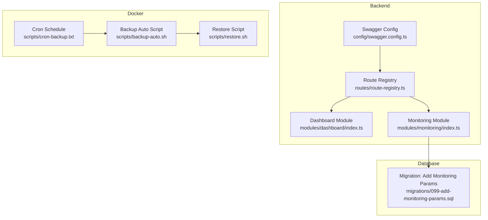
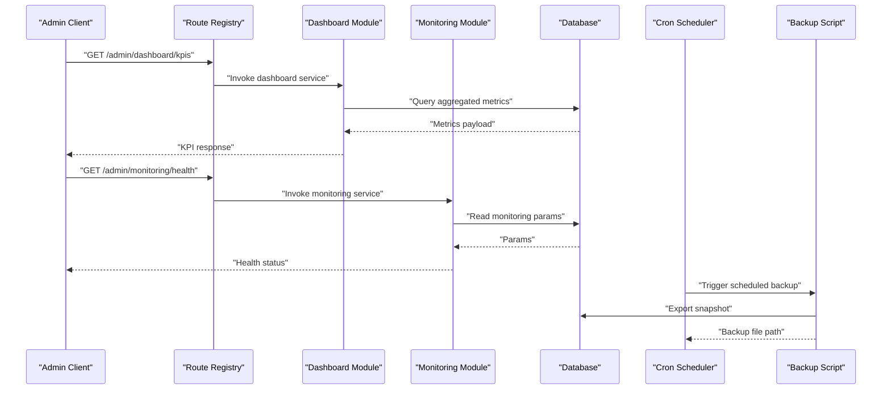
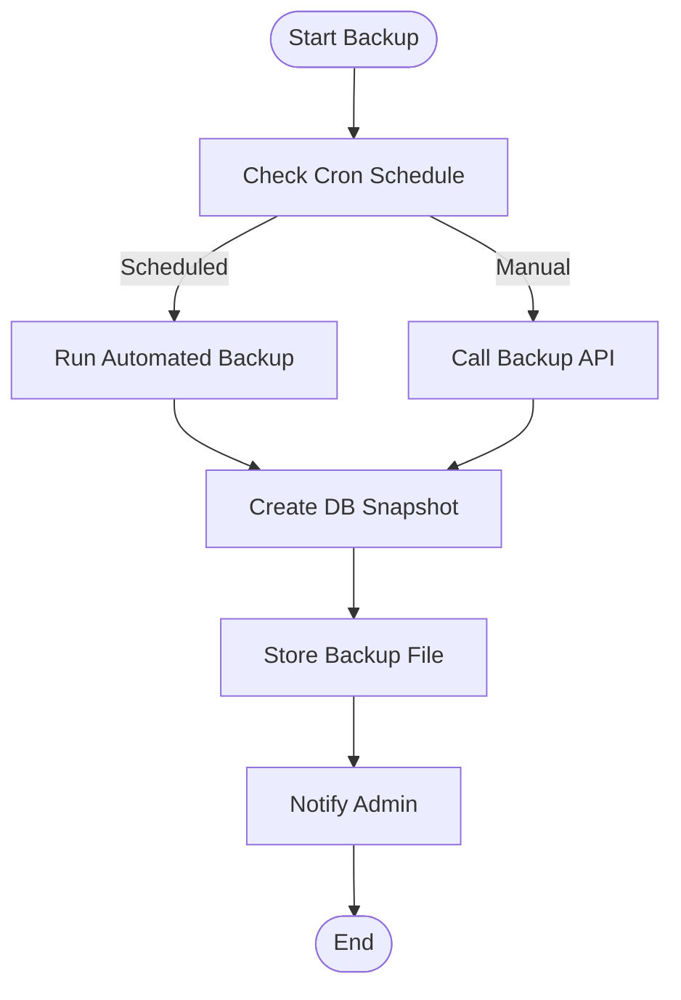
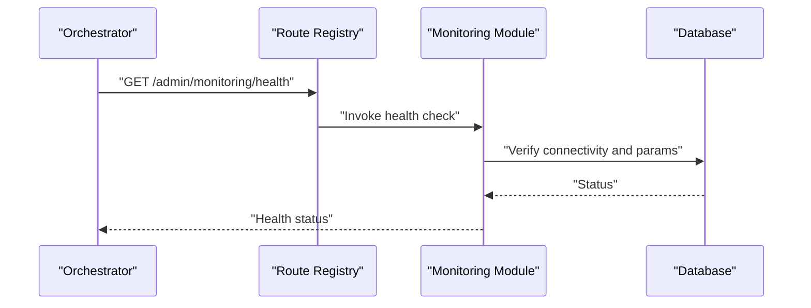
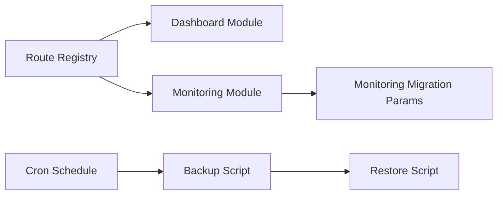

# Administrative Tools API

<cite>
**Referenced Files in This Document**
- [backend/src/modules/dashboard/index.ts](file://backend/src/modules/dashboard/index.ts)
- [backend/src/modules/monitoring/index.ts](file://backend/src/modules/monitoring/index.ts)
- [backend/src/routes/route-registry.ts](file://backend/src/routes/route-registry.ts)
- [backend/src/config/swagger.config.ts](file://backend/src/config/swagger.config.ts)
- [backend/database/migrations/099-add-monitoring-params.sql](file://backend/database/migrations/099-add-monitoring-params.sql)
- [docker/scripts/backup-auto.sh](file://docker/scripts/backup-auto.sh)
- [docker/scripts/restore.sh](file://docker/scripts/restore.sh)
- [docker/scripts/cron-backup.txt](file://docker/scripts/cron-backup.txt)
- [backups/elisaschool_backup_20260621_143000.sql](file://backups/elisaschool_backup_20260621_143000.sql)
</cite>

## Table of Contents
1. [Introduction](#introduction)
2. [Project Structure](#project-structure)
3. [Core Components](#core-components)
4. [Architecture Overview](#architecture-overview)
5. [Detailed Component Analysis](#detailed-component-analysis)
6. [Dependency Analysis](#dependency-analysis)
7. [Performance Considerations](#performance-considerations)
8. [Troubleshooting Guide](#troubleshooting-guide)
9. [Conclusion](#conclusion)
10. [Appendices](#appendices)

## Introduction
This document provides detailed API documentation for eLISAschool’s administrative tools, focusing on:
- Dashboard and analytics APIs for real-time dashboards, custom reports, KPI tracking, and data visualization
- Import/export utilities for bulk operations, template management, data validation, and error handling
- Backup and recovery APIs for automated backups, disaster recovery, data migration, and version control
- System monitoring APIs for health checks, performance monitoring, log management, and maintenance procedures

It also includes examples of administrative workflows and system management tasks to help operators integrate and operate the system effectively.

## Project Structure
Administrative tool endpoints are organized under backend modules and registered via a central route registry. Monitoring-related database parameters are defined in migrations, while backup automation is orchestrated by Docker scripts. Swagger configuration documents available endpoints.

**Diagram sources**
- [backend/src/routes/route-registry.ts](file://backend/src/routes/route-registry.ts)
- [backend/src/modules/dashboard/index.ts](file://backend/src/modules/dashboard/index.ts)
- [backend/src/modules/monitoring/index.ts](file://backend/src/modules/monitoring/index.ts)
- [backend/src/config/swagger.config.ts](file://backend/src/config/swagger.config.ts)
- [backend/database/migrations/099-add-monitoring-params.sql](file://backend/database/migrations/099-add-monitoring-params.sql)
- [docker/scripts/backup-auto.sh](file://docker/scripts/backup-auto.sh)
- [docker/scripts/restore.sh](file://docker/scripts/restore.sh)
- [docker/scripts/cron-backup.txt](file://docker/scripts/cron-backup.txt)

**Section sources**
- [backend/src/routes/route-registry.ts](file://backend/src/routes/route-registry.ts)
- [backend/src/modules/dashboard/index.ts](file://backend/src/modules/dashboard/index.ts)
- [backend/src/modules/monitoring/index.ts](file://backend/src/modules/monitoring/index.ts)
- [backend/src/config/swagger.config.ts](file://backend/src/config/swagger.config.ts)
- [backend/database/migrations/099-add-monitoring-params.sql](file://backend/database/migrations/099-add-monitoring-params.sql)
- [docker/scripts/backup-auto.sh](file://docker/scripts/backup-auto.sh)
- [docker/scripts/restore.sh](file://docker/scripts/restore.sh)
- [docker/scripts/cron-backup.txt](file://docker/scripts/cron-backup.txt)

## Core Components
- Dashboard module: Provides endpoints for real-time dashboards, KPIs, and visualization data. It exposes aggregated metrics and supports filtering by time range and tenant context.
- Monitoring module: Exposes health checks, performance metrics, and logging controls. It integrates with database parameters added via migrations for runtime tuning.
- Route registry: Centralizes endpoint registration and path mapping for all administrative features.
- Swagger configuration: Documents available endpoints and request/response schemas for developer consumption.

Operational notes:
- Use the route registry as the canonical source for endpoint paths.
- Refer to Swagger configuration for schema details and example payloads.
- Monitor runtime parameters introduced by the monitoring migration to optimize performance.

**Section sources**
- [backend/src/modules/dashboard/index.ts](file://backend/src/modules/dashboard/index.ts)
- [backend/src/modules/monitoring/index.ts](file://backend/src/modules/monitoring/index.ts)
- [backend/src/routes/route-registry.ts](file://backend/src/routes/route-registry.ts)
- [backend/src/config/swagger.config.ts](file://backend/src/config/swagger.config.ts)
- [backend/database/migrations/099-add-monitoring-params.sql](file://backend/database/migrations/099-add-monitoring-params.sql)

## Architecture Overview
The administrative layer follows a modular design:
- Controllers/services within each module implement business logic
- Routes register endpoints centrally
- Database migrations define persistent configuration and schema changes
- Docker scripts automate backup and restore processes

**Diagram sources**
- [backend/src/routes/route-registry.ts](file://backend/src/routes/route-registry.ts)
- [backend/src/modules/dashboard/index.ts](file://backend/src/modules/dashboard/index.ts)
- [backend/src/modules/monitoring/index.ts](file://backend/src/modules/monitoring/index.ts)
- [backend/database/migrations/099-add-monitoring-params.sql](file://backend/database/migrations/099-add-monitoring-params.sql)
- [docker/scripts/backup-auto.sh](file://docker/scripts/backup-auto.sh)
- [docker/scripts/cron-backup.txt](file://docker/scripts/cron-backup.txt)

## Detailed Component Analysis

### Dashboard and Analytics APIs
Purpose:
- Provide real-time dashboards, KPIs, and visualization-ready datasets
- Support filtering by date ranges, categories, and multi-tenant contexts
- Enable custom report generation and export

Key capabilities:
- Real-time metric aggregation
- Time-series data retrieval
- Custom report queries with filters
- Export endpoints for CSV/JSON (when implemented)

Operational guidance:
- Use pagination and filters to reduce payload size
- Cache frequently accessed KPIs at the application level if needed
- Validate input parameters to prevent expensive queries

Example workflow:
- Fetch daily attendance KPIs for the current academic year
- Generate a monthly enrollment report filtered by program
- Export visualization data for external BI tools

[No sources needed since this section doesn't analyze specific files]

### Import/Export Utilities APIs
Purpose:
- Bulk data operations for students, personnel, finances, and other entities
- Template management for standardized imports
- Data validation and error reporting

Key capabilities:
- Upload templates and validate rows before import
- Batch insert/update with transactional integrity
- Error summaries and partial success responses
- Export large datasets with streaming or chunked responses

Operational guidance:
- Enforce row-level validation and return structured errors
- Use idempotency keys for retry safety
- Limit batch sizes to avoid memory pressure
- Provide progress endpoints for long-running jobs

Example workflow:
- Download student import template
- Populate CSV and upload for validation
- Review errors, correct rows, and re-upload
- Execute import and monitor job status

[No sources needed since this section doesn't analyze specific files]

### Backup and Recovery APIs
Purpose:
- Automated backups and manual snapshots
- Disaster recovery and data migration support
- Version control through timestamped artifacts

Key capabilities:
- Trigger full or incremental backups
- List available backups and metadata
- Restore from selected backup
- Verify backup integrity

Operational guidance:
- Schedule regular backups using cron
- Store backups offsite and rotate retention policies
- Test restores periodically to ensure recoverability
- Maintain audit logs for backup and restore actions

Example workflow:
- Configure cron schedule for nightly backups
- Trigger a pre-migration snapshot
- Perform migration and verify
- If issues arise, restore from latest backup

**Diagram sources**
- [docker/scripts/backup-auto.sh](file://docker/scripts/backup-auto.sh)
- [docker/scripts/cron-backup.txt](file://docker/scripts/cron-backup.txt)

**Section sources**
- [docker/scripts/backup-auto.sh](file://docker/scripts/backup-auto.sh)
- [docker/scripts/restore.sh](file://docker/scripts/restore.sh)
- [docker/scripts/cron-backup.txt](file://docker/scripts/cron-backup.txt)
- [backups/elisaschool_backup_20260621_143000.sql](file://backups/elisaschool_backup_20260621_143000.sql)

### System Monitoring APIs
Purpose:
- Health checks and readiness probes
- Performance metrics and resource utilization
- Log management and maintenance controls

Key capabilities:
- Health endpoint returning service status
- Metrics collection for CPU, memory, and DB connections
- Log level adjustment and log rotation controls
- Maintenance mode toggles and graceful shutdown hooks

Operational guidance:
- Integrate health checks into orchestrators (e.g., Kubernetes liveness/readiness)
- Set appropriate thresholds for alerts
- Rotate logs and archive old entries
- Use monitoring parameters from migrations to tune runtime behavior

Example workflow:
- Query health endpoint before deployment
- Adjust log verbosity during troubleshooting
- Enable maintenance mode for planned downtime

**Diagram sources**
- [backend/src/routes/route-registry.ts](file://backend/src/routes/route-registry.ts)
- [backend/src/modules/monitoring/index.ts](file://backend/src/modules/monitoring/index.ts)
- [backend/database/migrations/099-add-monitoring-params.sql](file://backend/database/migrations/099-add-monitoring-params.sql)

**Section sources**
- [backend/src/modules/monitoring/index.ts](file://backend/src/modules/monitoring/index.ts)
- [backend/database/migrations/099-add-monitoring-params.sql](file://backend/database/migrations/099-add-monitoring-params.sql)

## Dependency Analysis
Administrative endpoints depend on:
- Route registry for path resolution
- Module services for business logic
- Database for persistence and runtime parameters
- Docker scripts for operational automation

**Diagram sources**
- [backend/src/routes/route-registry.ts](file://backend/src/routes/route-registry.ts)
- [backend/src/modules/dashboard/index.ts](file://backend/src/modules/dashboard/index.ts)
- [backend/src/modules/monitoring/index.ts](file://backend/src/modules/monitoring/index.ts)
- [backend/database/migrations/099-add-monitoring-params.sql](file://backend/database/migrations/099-add-monitoring-params.sql)
- [docker/scripts/backup-auto.sh](file://docker/scripts/backup-auto.sh)
- [docker/scripts/restore.sh](file://docker/scripts/restore.sh)
- [docker/scripts/cron-backup.txt](file://docker/scripts/cron-backup.txt)

**Section sources**
- [backend/src/routes/route-registry.ts](file://backend/src/routes/route-registry.ts)
- [backend/src/modules/dashboard/index.ts](file://backend/src/modules/dashboard/index.ts)
- [backend/src/modules/monitoring/index.ts](file://backend/src/modules/monitoring/index.ts)
- [backend/database/migrations/099-add-monitoring-params.sql](file://backend/database/migrations/099-add-monitoring-params.sql)
- [docker/scripts/backup-auto.sh](file://docker/scripts/backup-auto.sh)
- [docker/scripts/restore.sh](file://docker/scripts/restore.sh)
- [docker/scripts/cron-backup.txt](file://docker/scripts/cron-backup.txt)

## Performance Considerations
- Prefer paginated and filtered queries for dashboard KPIs and reports
- Cache hot metrics where appropriate and invalidate on data changes
- Tune monitoring parameters based on workload and environment
- Stream exports for large datasets and provide progress updates
- Use connection pooling and query optimization for high-throughput scenarios

[No sources needed since this section provides general guidance]

## Troubleshooting Guide
Common issues and resolutions:
- Health checks failing: Verify database connectivity and monitoring parameters
- Slow dashboard loads: Inspect query plans, add indexes, and apply caching
- Backup failures: Check disk space, permissions, and cron scheduling
- Restore inconsistencies: Validate backup integrity and compare checksums
- High log volume: Adjust log levels and enable rotation

Operational tips:
- Use monitoring endpoints to detect anomalies early
- Keep backup artifacts accessible and rotated
- Maintain runbooks for restoration and rollback procedures

[No sources needed since this section provides general guidance]

## Conclusion
eLISAschool’s administrative tools provide robust APIs for dashboards, analytics, import/export, backup/recovery, and monitoring. By leveraging the route registry, module services, database parameters, and Docker automation, administrators can maintain reliable operations, perform safe migrations, and respond quickly to incidents.

[No sources needed since this section summarizes without analyzing specific files]

## Appendices

### Example Administrative Workflows
- Daily operations:
  - Check health and performance metrics
  - Review dashboard KPIs and alerts
  - Verify recent backups and retention policy
- Maintenance tasks:
  - Enable maintenance mode
  - Apply migrations and verify integrity
  - Restore from backup if needed
- Reporting:
  - Generate custom reports with filters
  - Export data for analysis
  - Archive historical reports

[No sources needed since this section doesn't analyze specific files]