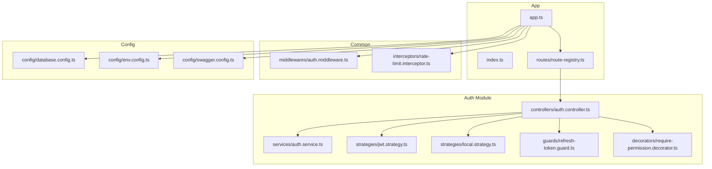
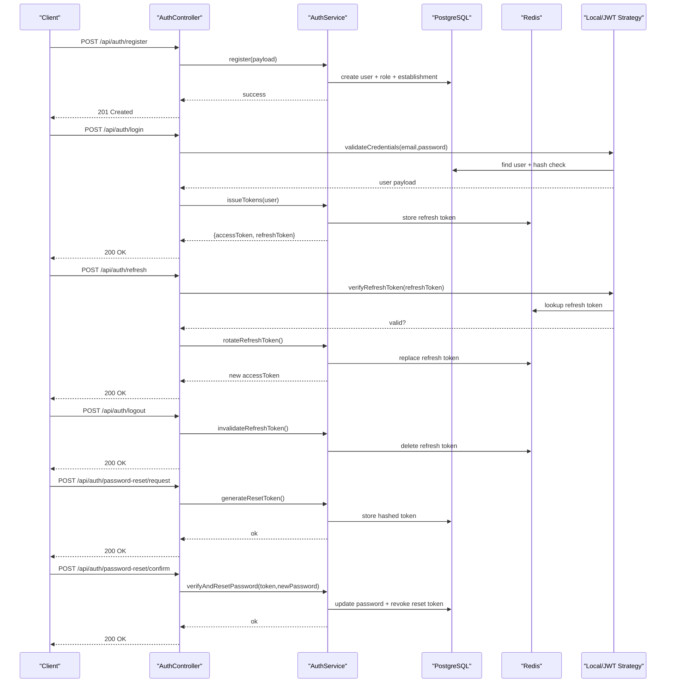
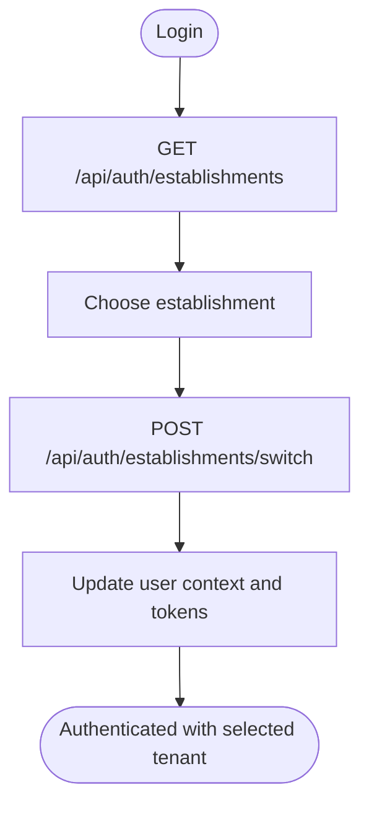
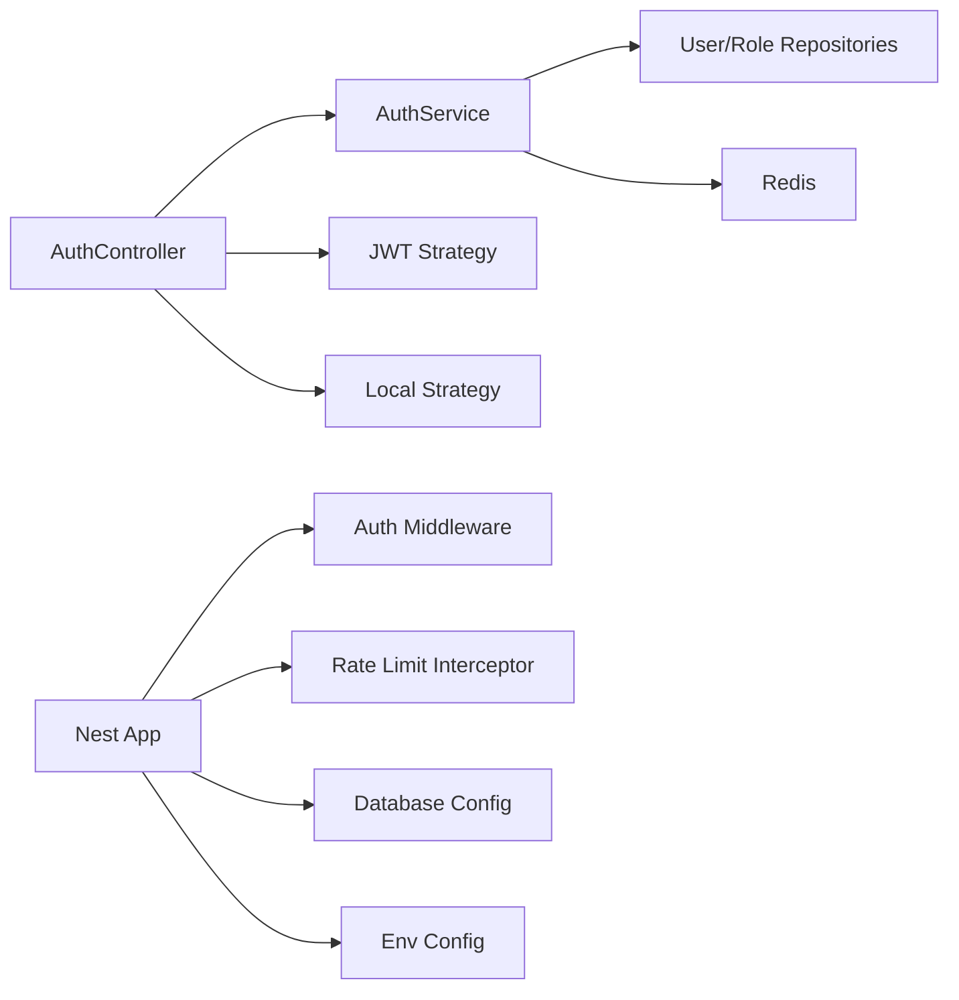

# Authentication API

<cite>
**Referenced Files in This Document**
- [app.ts](file://backend/src/app.ts)
- [index.ts](file://backend/src/index.ts)
- [route-registry.ts](file://backend/src/routes/route-registry.ts)
- [auth.controller.ts](file://backend/src/modules/auth/controllers/auth.controller.ts)
- [auth.service.ts](file://backend/src/modules/auth/services/auth.service.ts)
- [jwt.strategy.ts](file://backend/src/modules/auth/strategies/jwt.strategy.ts)
- [local.strategy.ts](file://backend/src/modules/auth/strategies/local.strategy.ts)
- [refresh-token.guard.ts](file://backend/src/modules/auth/guards/refresh-token.guard.ts)
- [require-permission.decorator.ts](file://backend/src/modules/auth/decorators/require-permission.decorator.ts)
- [rate-limit.interceptor.ts](file://backend/src/common/interceptors/rate-limit.interceptor.ts)
- [auth.middleware.ts](file://backend/src/common/middlewares/auth.middleware.ts)
- [database.config.ts](file://backend/src/config/database.config.ts)
- [env.config.ts](file://backend/src/config/env.config.ts)
- [swagger.config.ts](file://backend/src/config/swagger.config.ts)
- [027-auth-multi-mode.sql](file://backend/database/migrations/027-auth-multi-mode.sql)
- [050-multi-tenant-v3-max-etablissements.sql](file://backend/database/migrations/050-multi-tenant-v3-max-etablissements.sql)
- [migrate-rbac-v3.sql](file://backend/database/migrations/migrate-rbac-v3.sql)
- [ANALYSE-ROUTE-LOGIN.md](file://docs/analyses/ANALYSE-ROUTE-LOGIN.md)
- [GUIDE-AUTHENTIFICATION.md](file://docs/guides/GUIDE-AUTHENTIFICATION.md)
- [IMPLÉMENTATION-AUTH-COMPLETE.md](file://docs/implementations/IMPLÉMENTATION-AUTH-COMPLETE.md)
- [AUTH-MULTI-ETABLISSEMENT-SPEC.ts](file://backend/test/integration/auth-multi-etablissement.spec.ts)
</cite>

## Table of Contents
1. [Introduction](#introduction)
2. [Project Structure](#project-structure)
3. [Core Components](#core-components)
4. [Architecture Overview](#architecture-overview)
5. [Detailed Component Analysis](#detailed-component-analysis)
6. [Dependency Analysis](#dependency-analysis)
7. [Performance Considerations](#performance-considerations)
8. [Troubleshooting Guide](#troubleshooting-guide)
9. [Conclusion](#conclusion)
10. [Appendices](#appendices)

## Introduction
This document provides comprehensive API documentation for eLISAschool’s authentication endpoints. It covers user registration, login, logout, token management (access and refresh tokens), password reset, multi-tenant authentication flows, JWT handling, session management, and role-based access control integration. It also includes security considerations, rate limiting, and best practices for client implementation.

The backend is a NestJS application with modular architecture. Authentication is implemented using Passport strategies (JWT and local), decorators and guards for authorization, middleware for tenant context, and Redis-backed rate limiting. Multi-tenant support allows users to authenticate within an establishment context and switch between establishments after login.

## Project Structure
Authentication-related code is organized under the auth module with controllers, services, strategies, guards, and decorators. Global configuration and middleware are defined at the app level. Database migrations provide schema for users, roles, permissions, and multi-tenant associations.

**Diagram sources**
- [app.ts](file://backend/src/app.ts)
- [index.ts](file://backend/src/index.ts)
- [route-registry.ts](file://backend/src/routes/route-registry.ts)
- [auth.controller.ts](file://backend/src/modules/auth/controllers/auth.controller.ts)
- [auth.service.ts](file://backend/src/modules/auth/services/auth.service.ts)
- [jwt.strategy.ts](file://backend/src/modules/auth/strategies/jwt.strategy.ts)
- [local.strategy.ts](file://backend/src/modules/auth/strategies/local.strategy.ts)
- [refresh-token.guard.ts](file://backend/src/modules/auth/guards/refresh-token.guard.ts)
- [require-permission.decorator.ts](file://backend/src/modules/auth/decorators/require-permission.decorator.ts)
- [auth.middleware.ts](file://backend/src/common/middlewares/auth.middleware.ts)
- [rate-limit.interceptor.ts](file://backend/src/common/interceptors/rate-limit.interceptor.ts)
- [database.config.ts](file://backend/src/config/database.config.ts)
- [env.config.ts](file://backend/src/config/env.config.ts)
- [swagger.config.ts](file://backend/src/config/swagger.config.ts)

**Section sources**
- [app.ts](file://backend/src/app.ts)
- [index.ts](file://backend/src/index.ts)
- [route-registry.ts](file://backend/src/routes/route-registry.ts)

## Core Components
- Auth Controller: Exposes HTTP endpoints for registration, login, logout, token refresh, password reset, and establishment switching.
- Auth Service: Implements business logic for credential validation, token issuance, refresh token rotation, password reset flow, and multi-tenant scoping.
- Strategies: Local strategy validates credentials against the database; JWT strategy decodes and validates access tokens.
- Guards: Refresh token guard protects routes requiring a valid refresh token.
- Decorators: Require permission decorator enforces RBAC checks on endpoints.
- Middleware: Auth middleware extracts tenant context from headers or cookies and attaches it to the request.
- Interceptors: Rate limit interceptor applies per-endpoint throttling using Redis.
- Configuration: Database, environment variables, and Swagger settings define runtime behavior.

Key responsibilities:
- Registration: Create user, hash password, assign default role, seed establishment association if applicable.
- Login: Validate credentials, issue access and refresh tokens, record login attempt, enforce lockout policies.
- Logout: Invalidate refresh token and clear server-side session state.
- Token Management: Access token short-lived; refresh token long-lived with rotation and revocation.
- Password Reset: Generate secure token, store hashed token, validate expiry, allow password update.
- Multi-Tenant: Establishment-scoped operations via header or cookie; post-login establishment listing and switching.

**Section sources**
- [auth.controller.ts](file://backend/src/modules/auth/controllers/auth.controller.ts)
- [auth.service.ts](file://backend/src/modules/auth/services/auth.service.ts)
- [jwt.strategy.ts](file://backend/src/modules/auth/strategies/jwt.strategy.ts)
- [local.strategy.ts](file://backend/src/modules/auth/strategies/local.strategy.ts)
- [refresh-token.guard.ts](file://backend/src/modules/auth/guards/refresh-token.guard.ts)
- [require-permission.decorator.ts](file://backend/src/modules/auth/decorators/require-permission.decorator.ts)
- [auth.middleware.ts](file://backend/src/common/middlewares/auth.middleware.ts)
- [rate-limit.interceptor.ts](file://backend/src/common/interceptors/rate-limit.interceptor.ts)
- [database.config.ts](file://backend/src/config/database.config.ts)
- [env.config.ts](file://backend/src/config/env.config.ts)
- [swagger.config.ts](file://backend/src/config/swagger.config.ts)

## Architecture Overview
The authentication flow integrates HTTP endpoints, strategies, service layer, and storage backends (PostgreSQL and Redis). JWTs carry minimal claims; RBAC enforcement uses stored permissions. Multi-tenant context is enforced by middleware and service-level queries.

**Diagram sources**
- [auth.controller.ts](file://backend/src/modules/auth/controllers/auth.controller.ts)
- [auth.service.ts](file://backend/src/modules/auth/services/auth.service.ts)
- [jwt.strategy.ts](file://backend/src/modules/auth/strategies/jwt.strategy.ts)
- [local.strategy.ts](file://backend/src/modules/auth/strategies/local.strategy.ts)
- [refresh-token.guard.ts](file://backend/src/modules/auth/guards/refresh-token.guard.ts)
- [database.config.ts](file://backend/src/config/database.config.ts)
- [env.config.ts](file://backend/src/config/env.config.ts)

## Detailed Component Analysis

### Endpoints Reference
All endpoints are prefixed with /api/auth unless otherwise noted. Content-Type is application/json for JSON payloads. Authentication-required endpoints require Authorization: Bearer <accessToken>. Multi-tenant endpoints may require X-Etablissement-ID header or establishment cookie.

- Register
  - Method: POST
  - Path: /api/auth/register
  - Headers: Content-Type: application/json
  - Body: email, password, firstName, lastName, phone (optional), establishmentId (optional)
  - Response: 201 Created with user profile (excluding sensitive fields)
  - Errors: 400 Validation error, 409 Conflict (email exists)

- Login
  - Method: POST
  - Path: /api/auth/login
  - Headers: Content-Type: application/json
  - Body: email, password
  - Response: 200 OK with accessToken, refreshToken, expiresIn, user profile
  - Errors: 401 Invalid credentials, 429 Too many attempts (lockout)

- Logout
  - Method: POST
  - Path: /api/auth/logout
  - Headers: Authorization: Bearer <accessToken>
  - Response: 200 OK
  - Errors: 401 Unauthorized

- Refresh Token
  - Method: POST
  - Path: /api/auth/refresh
  - Headers: Content-Type: application/json
  - Body: refreshToken
  - Response: 200 OK with new accessToken (and optionally rotated refreshToken)
  - Errors: 401 Invalid or expired refresh token

- Password Reset Request
  - Method: POST
  - Path: /api/auth/password-reset/request
  - Headers: Content-Type: application/json
  - Body: email
  - Response: 200 OK (always returns success even if email not found)
  - Errors: 400 Validation error

- Password Reset Confirm
  - Method: POST
  - Path: /api/auth/password-reset/confirm
  - Headers: Content-Type: application/json
  - Body: token, newPassword
  - Response: 200 OK
  - Errors: 400 Invalid/expired token, 401 Unauthorized

- List Establishments
  - Method: GET
  - Path: /api/auth/establishments
  - Headers: Authorization: Bearer <accessToken>
  - Response: 200 OK with list of establishments user belongs to
  - Errors: 401 Unauthorized

- Switch Establishment
  - Method: POST
  - Path: /api/auth/establishments/switch
  - Headers: Authorization: Bearer <accessToken>, Content-Type: application/json
  - Body: establishmentId
  - Response: 200 OK with updated user context and new tokens (if needed)
  - Errors: 400 Invalid establishmentId, 403 Forbidden, 401 Unauthorized

Notes:
- All responses include standard error envelope with message and code.
- Rate limiting applies to login and password reset endpoints.

**Section sources**
- [auth.controller.ts](file://backend/src/modules/auth/controllers/auth.controller.ts)
- [auth.service.ts](file://backend/src/modules/auth/services/auth.service.ts)
- [ANALYSE-ROUTE-LOGIN.md](file://docs/analyses/ANALYSE-ROUTE-LOGIN.md)

### JWT Token Handling
- Access Token: Short-lived, signed with secret configured in env. Contains minimal claims (userId, roles, establishmentId).
- Refresh Token: Long-lived, stored in Redis with expiration and rotation. Used to obtain new access tokens.
- Strategy: JWT strategy verifies signature and extracts claims; local strategy validates credentials against database.

Best practices:
- Store access token in memory only.
- Persist refresh token securely (httpOnly cookie recommended).
- Rotate refresh tokens on each use.

**Section sources**
- [jwt.strategy.ts](file://backend/src/modules/auth/strategies/jwt.strategy.ts)
- [local.strategy.ts](file://backend/src/modules/auth/strategies/local.strategy.ts)
- [env.config.ts](file://backend/src/config/env.config.ts)

### Session Management
- Server-side session state is managed via Redis for refresh tokens and login attempt counters.
- Logout invalidates refresh token and clears associated session data.
- Lockout policy persists failed attempts and enforces temporary block periods.

**Section sources**
- [auth.service.ts](file://backend/src/modules/auth/services/auth.service.ts)
- [rate-limit.interceptor.ts](file://backend/src/common/interceptors/rate-limit.interceptor.ts)

### Role-Based Access Control Integration
- Permissions are stored in database and attached to roles.
- Require permission decorator enforces endpoint-level authorization based on current user’s roles and permissions.
- Multi-tenant scoping ensures users can only access resources within their assigned establishment(s).

**Section sources**
- [require-permission.decorator.ts](file://backend/src/modules/auth/decorators/require-permission.decorator.ts)
- [migrate-rbac-v3.sql](file://backend/database/migrations/migrate-rbac-v3.sql)

### Multi-Tenant Authentication Flows
- Users may belong to multiple establishments.
- After login, clients can list available establishments and switch context.
- Establishment context is propagated via headers or cookies and enforced by middleware and service queries.

**Diagram sources**
- [auth.controller.ts](file://backend/src/modules/auth/controllers/auth.controller.ts)
- [auth.service.ts](file://backend/src/modules/auth/services/auth.service.ts)
- [auth.middleware.ts](file://backend/src/common/middlewares/auth.middleware.ts)

**Section sources**
- [027-auth-multi-mode.sql](file://backend/database/migrations/027-auth-multi-mode.sql)
- [050-multi-tenant-v3-max-etablissements.sql](file://backend/database/migrations/050-multi-tenant-v3-max-etablissements.sql)
- [AUTH-MULTI-ETABLISSEMENT-SPEC.ts](file://backend/test/integration/auth-multi-etablissement.spec.ts)

## Dependency Analysis
Authentication depends on configuration modules, database connectivity, Redis for caching, and global middlewares/interceptors. The controller delegates to the service, which interacts with repositories and cache. Strategies integrate with Passport and environment secrets.

**Diagram sources**
- [auth.controller.ts](file://backend/src/modules/auth/controllers/auth.controller.ts)
- [auth.service.ts](file://backend/src/modules/auth/services/auth.service.ts)
- [jwt.strategy.ts](file://backend/src/modules/auth/strategies/jwt.strategy.ts)
- [local.strategy.ts](file://backend/src/modules/auth/strategies/local.strategy.ts)
- [auth.middleware.ts](file://backend/src/common/middlewares/auth.middleware.ts)
- [rate-limit.interceptor.ts](file://backend/src/common/interceptors/rate-limit.interceptor.ts)
- [database.config.ts](file://backend/src/config/database.config.ts)
- [env.config.ts](file://backend/src/config/env.config.ts)

**Section sources**
- [route-registry.ts](file://backend/src/routes/route-registry.ts)
- [swagger.config.ts](file://backend/src/config/swagger.config.ts)

## Performance Considerations
- Use short-lived access tokens to minimize exposure window.
- Cache frequently accessed user profiles and permissions in Redis where appropriate.
- Apply rate limiting to login and password reset endpoints to mitigate brute-force attacks.
- Optimize database queries with indexes for email and establishment associations.
- Avoid heavy computations during token issuance; precompute roles/permissions when possible.

[No sources needed since this section provides general guidance]

## Troubleshooting Guide
Common issues and resolutions:
- 401 Unauthorized: Ensure Authorization header contains a valid Bearer token; check token expiry and secret configuration.
- 403 Forbidden: Verify user has required permissions for the endpoint; confirm establishment context matches resource scope.
- 429 Too Many Requests: Login or password reset attempts exceeded limits; wait for cooldown period.
- Token Rotation Failures: Ensure refresh token is present and not revoked; handle 401 by prompting re-login.
- Multi-Tenant Context Errors: Provide correct X-Etablissement-ID header or establishment cookie; ensure user is associated with the target establishment.

Operational checks:
- Validate Redis connectivity and TTL settings.
- Confirm database migrations applied successfully for RBAC and multi-tenant schemas.
- Review logs for authentication failures and lockout events.

**Section sources**
- [auth.service.ts](file://backend/src/modules/auth/services/auth.service.ts)
- [rate-limit.interceptor.ts](file://backend/src/common/interceptors/rate-limit.interceptor.ts)
- [migrate-rbac-v3.sql](file://backend/database/migrations/migrate-rbac-v3.sql)
- [027-auth-multi-mode.sql](file://backend/database/migrations/027-auth-multi-mode.sql)

## Conclusion
eLISAschool’s authentication system provides robust, multi-tenant-capable APIs with JWT-based access control, refresh token rotation, and RBAC enforcement. Clients should implement secure token handling, respect rate limits, and manage establishment context appropriately. Following the documented endpoints and best practices ensures reliable and secure integration.

[No sources needed since this section summarizes without analyzing specific files]

## Appendices

### Security Considerations
- Enforce HTTPS for all endpoints.
- Use httpOnly, Secure, SameSite cookies for refresh tokens.
- Rotate JWT secrets regularly and store them securely in environment variables.
- Implement account lockout after repeated failed login attempts.
- Validate and sanitize all inputs; reject malformed requests early.

### Best Practices for Client Implementation
- Store access tokens in memory; persist refresh tokens securely.
- Handle 401 responses by refreshing tokens or redirecting to login.
- Include establishment context in every authenticated request.
- Respect rate limiting and implement exponential backoff on retries.
- Log errors without exposing sensitive details.

### References
- Authentication guide and implementation summaries:
  - [GUIDE-AUTHENTIFICATION.md](file://docs/guides/GUIDE-AUTHENTIFICATION.md)
  - [IMPLÉMENTATION-AUTH-COMPLETE.md](file://docs/implementations/IMPLÉMENTATION-AUTH-COMPLETE.md)
  - [ANALYSE-ROUTE-LOGIN.md](file://docs/analyses/ANALYSE-ROUTE-LOGIN.md)