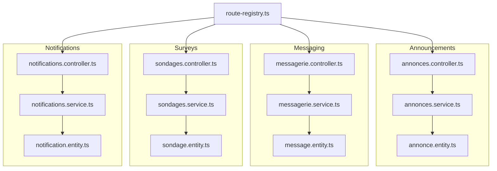
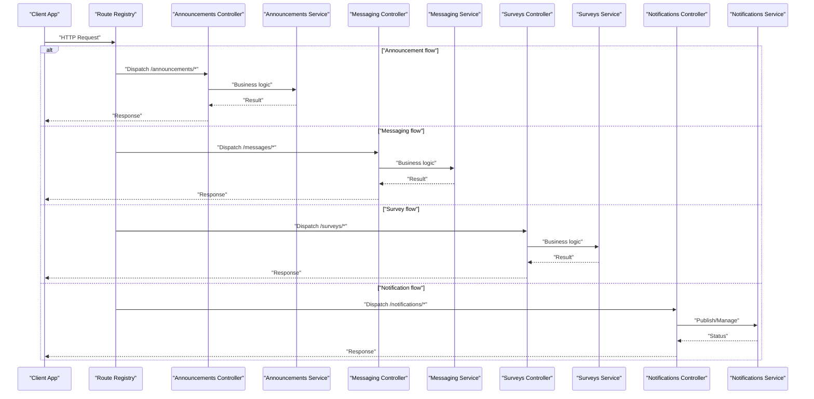
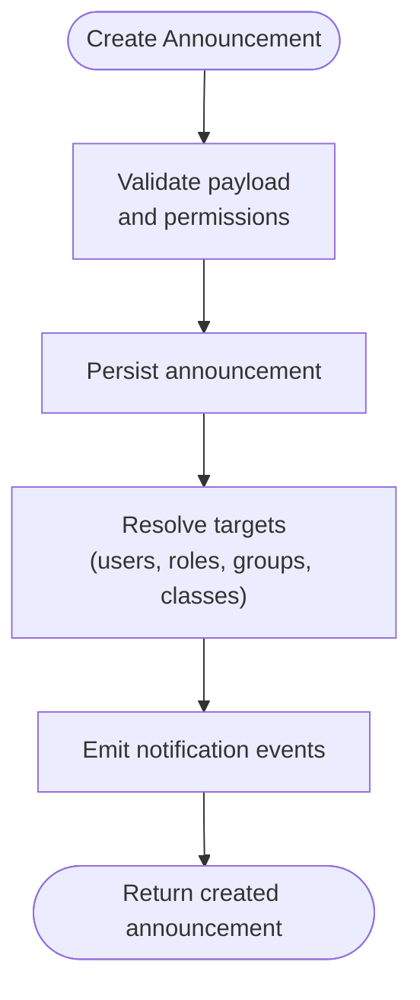
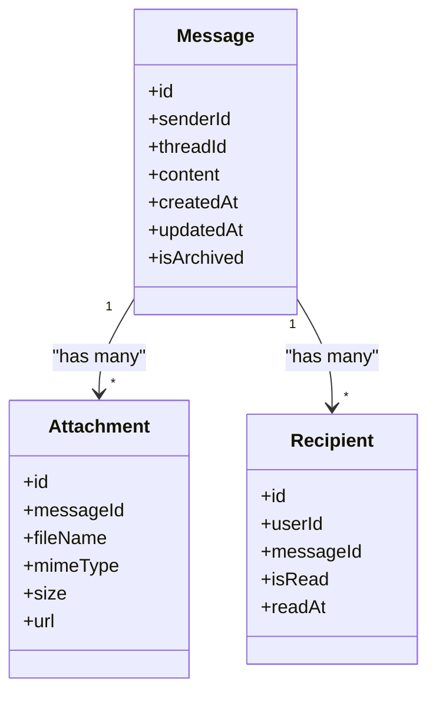
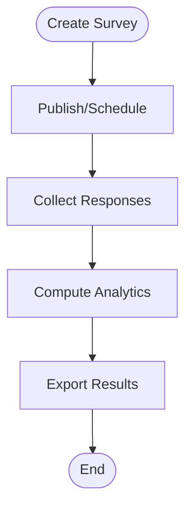
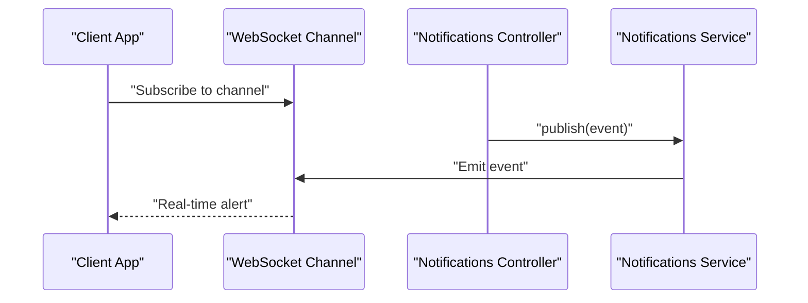
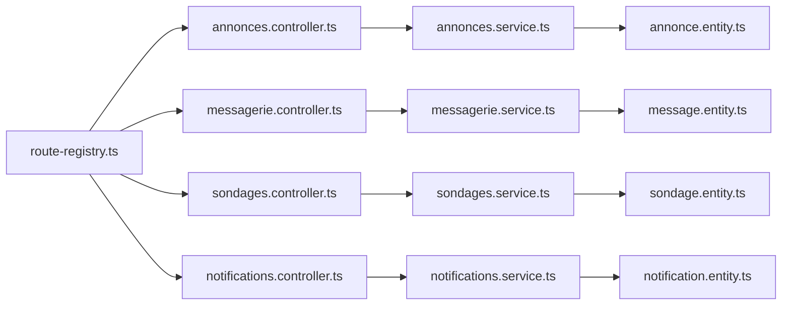

# Communication & Collaboration API

<cite>
**Referenced Files in This Document**
- [backend/src/modules/annonces/controllers/annonces.controller.ts](file://backend/src/modules/annonces/controllers/annonces.controller.ts)
- [backend/src/modules/annonces/services/annonces.service.ts](file://backend/src/modules/annonces/services/annonces.service.ts)
- [backend/src/modules/annonces/entities/annonce.entity.ts](file://backend/src/modules/annonces/entities/annonce.entity.ts)
- [backend/src/modules/messagerie/controllers/messagerie.controller.ts](file://backend/src/modules/messagerie/controllers/messagerie.controller.ts)
- [backend/src/modules/messagerie/services/messagerie.service.ts](file://backend/src/modules/messagerie/services/messagerie.service.ts)
- [backend/src/modules/messagerie/entities/message.entity.ts](file://backend/src/modules/messagerie/entities/message.entity.ts)
- [backend/src/modules/sondages/controllers/sondages.controller.ts](file://backend/src/modules/sondages/controllers/sondages.controller.ts)
- [backend/src/modules/sondages/services/sondages.service.ts](file://backend/src/modules/sondages/services/sondages.service.ts)
- [backend/src/modules/sondages/entities/sondage.entity.ts](file://backend/src/modules/sondages/entities/sondage.entity.ts)
- [backend/src/modules/notifications/controllers/notifications.controller.ts](file://backend/src/modules/notifications/controllers/notifications.controller.ts)
- [backend/src/modules/notifications/services/notifications.service.ts](file://backend/src/modules/notifications/services/notifications.service.ts)
- [backend/src/modules/notifications/entities/notification.entity.ts](file://backend/src/modules/notifications/entities/notification.entity.ts)
- [backend/src/routes/route-registry.ts](file://backend/src/routes/route-registry.ts)
- [backend/database/migrations/041-module-annonces.sql](file://backend/database/migrations/041-module-annonces.sql)
- [backend/database/migrations/043-module-messagerie-complete.sql](file://backend/database/migrations/043-module-messagerie-complete.sql)
- [backend/database/migrations/041-module-sondages.sql](file://backend/database/migrations/041-module-sondages.sql)
- [backend/database/migrations/047-notifications-ameliorations.sql](file://backend/database/migrations/047-notifications-ameliorations.sql)
</cite>

## Table of Contents
1. [Introduction](#introduction)
2. [Project Structure](#project-structure)
3. [Core Components](#core-components)
4. [Architecture Overview](#architecture-overview)
5. [Detailed Component Analysis](#detailed-component-analysis)
6. [Dependency Analysis](#dependency-analysis)
7. [Performance Considerations](#performance-considerations)
8. [Troubleshooting Guide](#troubleshooting-guide)
9. [Conclusion](#conclusion)

## Introduction
This document provides comprehensive API documentation for eLISAschool’s communication and collaboration features, focusing on:
- Announcement system APIs for broadcast communications, targeted notifications, message archiving, and read receipts
- Internal messaging APIs for department communication, direct messaging, message threading, and file sharing
- Survey and polling APIs for survey creation, response collection, analytics, and automated surveys
- Notification engine APIs for real-time alerts, email notifications, SMS integration, and push notifications

It also includes examples of communication workflows and real-time interaction patterns to help you integrate these capabilities effectively.

## Project Structure
The backend implements a modular architecture where each feature is encapsulated in its own module with controllers, services, entities, and DTOs. The routes are registered centrally.

**Diagram sources**
- [backend/src/routes/route-registry.ts](file://backend/src/routes/route-registry.ts)
- [backend/src/modules/annonces/controllers/annonces.controller.ts](file://backend/src/modules/annonces/controllers/annonces.controller.ts)
- [backend/src/modules/annonces/services/annonces.service.ts](file://backend/src/modules/annonces/services/annonces.service.ts)
- [backend/src/modules/annonces/entities/annonce.entity.ts](file://backend/src/modules/annonces/entities/annonce.entity.ts)
- [backend/src/modules/messagerie/controllers/messagerie.controller.ts](file://backend/src/modules/messagerie/controllers/messagerie.controller.ts)
- [backend/src/modules/messagerie/services/messagerie.service.ts](file://backend/src/modules/messagerie/services/messagerie.service.ts)
- [backend/src/modules/messagerie/entities/message.entity.ts](file://backend/src/modules/messagerie/entities/message.entity.ts)
- [backend/src/modules/sondages/controllers/sondages.controller.ts](file://backend/src/modules/sondages/controllers/sondages.controller.ts)
- [backend/src/modules/sondages/services/sondages.service.ts](file://backend/src/modules/sondages/services/sondages.service.ts)
- [backend/src/modules/sondages/entities/sondage.entity.ts](file://backend/src/modules/sondages/entities/sondage.entity.ts)
- [backend/src/modules/notifications/controllers/notifications.controller.ts](file://backend/src/modules/notifications/controllers/notifications.controller.ts)
- [backend/src/modules/notifications/services/notifications.service.ts](file://backend/src/modules/notifications/services/notifications.service.ts)
- [backend/src/modules/notifications/entities/notification.entity.ts](file://backend/src/modules/notifications/entities/notification.entity.ts)

**Section sources**
- [backend/src/routes/route-registry.ts](file://backend/src/routes/route-registry.ts)

## Core Components
- Announcements controller and service expose endpoints for creating, listing, updating, deleting announcements; broadcasting to roles/groups; targeting specific users or classes; archiving; and tracking read receipts.
- Messaging controller and service provide internal messaging across departments, direct messages between users, threaded conversations, and file attachments.
- Surveys controller and service support survey creation, question management, responses, analytics, and scheduling recurring surveys.
- Notifications controller and service orchestrate real-time alerts, email, SMS, and push channels, including delivery status and retry logic.

Key responsibilities:
- Controllers handle HTTP routing, request validation, and response formatting.
- Services implement business logic, data access, and cross-cutting concerns (e.g., notifications).
- Entities define database schema and relationships.

**Section sources**
- [backend/src/modules/annonces/controllers/annonces.controller.ts](file://backend/src/modules/annonces/controllers/annonces.controller.ts)
- [backend/src/modules/annonces/services/annonces.service.ts](file://backend/src/modules/annonces/services/annonces.service.ts)
- [backend/src/modules/annonces/entities/annonce.entity.ts](file://backend/src/modules/annonces/entities/annonce.entity.ts)
- [backend/src/modules/messagerie/controllers/messagerie.controller.ts](file://backend/src/modules/messagerie/controllers/messagerie.controller.ts)
- [backend/src/modules/messagerie/services/messagerie.service.ts](file://backend/src/modules/messagerie/services/messagerie.service.ts)
- [backend/src/modules/messagerie/entities/message.entity.ts](file://backend/src/modules/messagerie/entities/message.entity.ts)
- [backend/src/modules/sondages/controllers/sondages.controller.ts](file://backend/src/modules/sondages/controllers/sondages.controller.ts)
- [backend/src/modules/sondages/services/sondages.service.ts](file://backend/src/modules/sondages/services/sondages.service.ts)
- [backend/src/modules/sondages/entities/sondage.entity.ts](file://backend/src/modules/sondages/entities/sondage.entity.ts)
- [backend/src/modules/notifications/controllers/notifications.controller.ts](file://backend/src/modules/notifications/controllers/notifications.controller.ts)
- [backend/src/modules/notifications/services/notifications.service.ts](file://backend/src/modules/notifications/services/notifications.service.ts)
- [backend/src/modules/notifications/entities/notification.entity.ts](file://backend/src/modules/notifications/entities/notification.entity.ts)

## Architecture Overview
The communication stack integrates four modules orchestrated by the route registry. Controllers delegate to services, which interact with entities and external notification providers.

**Diagram sources**
- [backend/src/routes/route-registry.ts](file://backend/src/routes/route-registry.ts)
- [backend/src/modules/annonces/controllers/annonces.controller.ts](file://backend/src/modules/annonces/controllers/annonces.controller.ts)
- [backend/src/modules/annonces/services/annonces.service.ts](file://backend/src/modules/annonces/services/annonces.service.ts)
- [backend/src/modules/messagerie/controllers/messagerie.controller.ts](file://backend/src/modules/messagerie/controllers/messagerie.controller.ts)
- [backend/src/modules/messagerie/services/messagerie.service.ts](file://backend/src/modules/messagerie/services/messagerie.service.ts)
- [backend/src/modules/sondages/controllers/sondages.controller.ts](file://backend/src/modules/sondages/controllers/sondages.controller.ts)
- [backend/src/modules/sondages/services/sondages.service.ts](file://backend/src/modules/sondages/services/sondages.service.ts)
- [backend/src/modules/notifications/controllers/notifications.controller.ts](file://backend/src/modules/notifications/controllers/notifications.controller.ts)
- [backend/src/modules/notifications/services/notifications.service.ts](file://backend/src/modules/notifications/services/notifications.service.ts)

## Detailed Component Analysis

### Announcements API
Capabilities:
- Create, update, delete, list announcements
- Broadcast to roles, groups, classes, or target specific users
- Archive announcements and manage visibility
- Track read receipts per recipient

Endpoints overview:
- POST /announcements: Create announcement
- GET /announcements: List announcements (with filters)
- GET /announcements/:id: Get announcement details
- PUT /announcements/:id: Update announcement
- DELETE /announcements/:id: Delete announcement
- POST /announcements/:id/archive: Archive announcement
- GET /announcements/:id/read-receipts: Read receipt status

Request/Response highlights:
- Targeting supports arrays of user IDs, role IDs, group IDs, class IDs
- Read receipts include per-user timestamps and status flags

Example workflow:
- Admin creates an announcement targeting multiple classes
- System records recipients and generates read receipts when users view it
- Admin can archive old announcements to reduce noise

**Diagram sources**
- [backend/src/modules/annonces/controllers/annonces.controller.ts](file://backend/src/modules/annonces/controllers/annonces.controller.ts)
- [backend/src/modules/annonces/services/annonces.service.ts](file://backend/src/modules/annonces/services/annonces.service.ts)
- [backend/src/modules/annonces/entities/annonce.entity.ts](file://backend/src/modules/annonces/entities/annonce.entity.ts)

**Section sources**
- [backend/src/modules/annonces/controllers/annonces.controller.ts](file://backend/src/modules/annonces/controllers/annonces.controller.ts)
- [backend/src/modules/annonces/services/annonces.service.ts](file://backend/src/modules/annonces/services/annonces.service.ts)
- [backend/src/modules/annonces/entities/annonce.entity.ts](file://backend/src/modules/annonces/entities/annonce.entity.ts)
- [backend/database/migrations/041-module-annonces.sql](file://backend/database/migrations/041-module-annonces.sql)

### Messaging API
Capabilities:
- Department-wide and direct messages
- Threaded conversations with replies
- File attachments and metadata
- Message archival and read receipts

Endpoints overview:
- POST /messages: Send message (direct or group)
- GET /messages: List messages with filters (threadId, sender, date range)
- GET /messages/:id: Get message details
- PUT /messages/:id: Edit message (if allowed)
- DELETE /messages/:id: Delete message (soft delete/archival)
- POST /messages/:id/reply: Reply to create thread
- GET /messages/:id/read-receipts: Read receipts for a message
- POST /messages/:id/files: Attach files

Data model relationships:
- Messages reference sender, optional thread, and recipients
- Threads represent conversation chains
- Attachments store file references and metadata

Example workflow:
- Teacher sends a direct message to a student
- Student replies, forming a thread
- Both parties receive notifications and can mark messages as read

**Diagram sources**
- [backend/src/modules/messagerie/controllers/messagerie.controller.ts](file://backend/src/modules/messagerie/controllers/messagerie.controller.ts)
- [backend/src/modules/messagerie/services/messagerie.service.ts](file://backend/src/modules/messagerie/services/messagerie.service.ts)
- [backend/src/modules/messagerie/entities/message.entity.ts](file://backend/src/modules/messagerie/entities/message.entity.ts)

**Section sources**
- [backend/src/modules/messagerie/controllers/messagerie.controller.ts](file://backend/src/modules/messagerie/controllers/messagerie.controller.ts)
- [backend/src/modules/messagerie/services/messagerie.service.ts](file://backend/src/modules/messagerie/services/messagerie.service.ts)
- [backend/src/modules/messagerie/entities/message.entity.ts](file://backend/src/modules/messagerie/entities/message.entity.ts)
- [backend/database/migrations/043-module-messagerie-complete.sql](file://backend/database/migrations/043-module-messagerie-complete.sql)

### Surveys and Polling API
Capabilities:
- Create surveys with questions and options
- Collect responses from users
- Generate analytics and export results
- Schedule recurring surveys automatically

Endpoints overview:
- POST /surveys: Create survey
- GET /surveys: List surveys (filters by status, author, audience)
- GET /surveys/:id: Get survey details
- PUT /surveys/:id: Update survey
- DELETE /surveys/:id: Delete survey
- POST /surveys/:id/responses: Submit response
- GET /surveys/:id/analytics: Retrieve aggregated analytics
- POST /surveys/:id/schedule: Schedule recurring deployment

Data model relationships:
- Surveys contain questions and options
- Responses link users to answers
- Analytics compute aggregates per question

Example workflow:
- Administrator creates a survey targeting all students
- Students submit responses
- Analytics dashboard displays results and exports CSV

**Diagram sources**
- [backend/src/modules/sondages/controllers/sondages.controller.ts](file://backend/src/modules/sondages/controllers/sondages.controller.ts)
- [backend/src/modules/sondages/services/sondages.service.ts](file://backend/src/modules/sondages/services/sondages.service.ts)
- [backend/src/modules/sondages/entities/sondage.entity.ts](file://backend/src/modules/sondages/entities/sondage.entity.ts)

**Section sources**
- [backend/src/modules/sondages/controllers/sondages.controller.ts](file://backend/src/modules/sondages/controllers/sondages.controller.ts)
- [backend/src/modules/sondages/services/sondages.service.ts](file://backend/src/modules/sondages/services/sondages.service.ts)
- [backend/src/modules/sondages/entities/sondage.entity.ts](file://backend/src/modules/sondages/entities/sondage.entity.ts)
- [backend/database/migrations/041-module-sondages.sql](file://backend/database/migrations/041-module-sondages.sql)

### Notification Engine API
Capabilities:
- Real-time alerts via WebSocket or SSE
- Email notifications through provider integrations
- SMS integration for critical alerts
- Push notifications for mobile/web clients
- Delivery status tracking and retries

Endpoints overview:
- POST /notifications/publish: Publish notification event
- GET /notifications: List notifications for current tenant/user
- GET /notifications/:id: Get notification details
- PUT /notifications/:id/status: Update delivery status
- POST /notifications/email/send: Send email notification
- POST /notifications/sms/send: Send SMS notification
- POST /notifications/push/send: Send push notification

Real-time pattern:
- Clients subscribe to channels based on roles or user IDs
- Server emits events upon message, announcement, or survey updates

**Diagram sources**
- [backend/src/modules/notifications/controllers/notifications.controller.ts](file://backend/src/modules/notifications/controllers/notifications.controller.ts)
- [backend/src/modules/notifications/services/notifications.service.ts](file://backend/src/modules/notifications/services/notifications.service.ts)
- [backend/src/modules/notifications/entities/notification.entity.ts](file://backend/src/modules/notifications/entities/notification.entity.ts)

**Section sources**
- [backend/src/modules/notifications/controllers/notifications.controller.ts](file://backend/src/modules/notifications/controllers/notifications.controller.ts)
- [backend/src/modules/notifications/services/notifications.service.ts](file://backend/src/modules/notifications/services/notifications.service.ts)
- [backend/src/modules/notifications/entities/notification.entity.ts](file://backend/src/modules/notifications/entities/notification.entity.ts)
- [backend/database/migrations/047-notifications-ameliorations.sql](file://backend/database/migrations/047-notifications-ameliorations.sql)

## Dependency Analysis
Module interactions and shared dependencies:
- Route registry centralizes endpoint registration and dispatches to controllers
- Controllers depend on services for business logic
- Services depend on entities for persistence
- Notification service may be used by other modules to emit events

**Diagram sources**
- [backend/src/routes/route-registry.ts](file://backend/src/routes/route-registry.ts)
- [backend/src/modules/annonces/controllers/annonces.controller.ts](file://backend/src/modules/annonces/controllers/annonces.controller.ts)
- [backend/src/modules/annonces/services/annonces.service.ts](file://backend/src/modules/annonces/services/annonces.service.ts)
- [backend/src/modules/annonces/entities/annonce.entity.ts](file://backend/src/modules/annonces/entities/annonce.entity.ts)
- [backend/src/modules/messagerie/controllers/messagerie.controller.ts](file://backend/src/modules/messagerie/controllers/messagerie.controller.ts)
- [backend/src/modules/messagerie/services/messagerie.service.ts](file://backend/src/modules/messagerie/services/messagerie.service.ts)
- [backend/src/modules/messagerie/entities/message.entity.ts](file://backend/src/modules/messagerie/entities/message.entity.ts)
- [backend/src/modules/sondages/controllers/sondages.controller.ts](file://backend/src/modules/sondages/controllers/sondages.controller.ts)
- [backend/src/modules/sondages/services/sondages.service.ts](file://backend/src/modules/sondages/services/sondages.service.ts)
- [backend/src/modules/sondages/entities/sondage.entity.ts](file://backend/src/modules/sondages/entities/sondage.entity.ts)
- [backend/src/modules/notifications/controllers/notifications.controller.ts](file://backend/src/modules/notifications/controllers/notifications.controller.ts)
- [backend/src/modules/notifications/services/notifications.service.ts](file://backend/src/modules/notifications/services/notifications.service.ts)
- [backend/src/modules/notifications/entities/notification.entity.ts](file://backend/src/modules/notifications/entities/notification.entity.ts)

**Section sources**
- [backend/src/routes/route-registry.ts](file://backend/src/routes/route-registry.ts)

## Performance Considerations
- Use pagination and filtering for large lists (announcements, messages, surveys)
- Index frequently queried fields (recipient IDs, thread IDs, timestamps)
- Batch operations for bulk announcements and notifications
- Cache read-heavy endpoints (survey analytics, public announcements)
- Offload heavy tasks (email/SMS sending) to background jobs
- Optimize file uploads with streaming and CDN storage

[No sources needed since this section provides general guidance]

## Troubleshooting Guide
Common issues and resolutions:
- Authentication failures: Ensure JWT tokens are valid and include required scopes
- Permission errors: Verify RBAC roles and permissions for endpoints
- Delivery failures: Check notification provider credentials and retry policies
- Database constraints: Validate foreign keys and unique constraints during migrations
- File upload limits: Adjust server limits and validate MIME types

Operational checks:
- Confirm route registration in the registry
- Validate entity migrations have been applied
- Inspect logs for service-level exceptions
- Monitor queue health for async tasks

**Section sources**
- [backend/src/routes/route-registry.ts](file://backend/src/routes/route-registry.ts)
- [backend/database/migrations/041-module-annonces.sql](file://backend/database/migrations/041-module-annonces.sql)
- [backend/database/migrations/043-module-messagerie-complete.sql](file://backend/database/migrations/043-module-messagerie-complete.sql)
- [backend/database/migrations/041-module-sondages.sql](file://backend/database/migrations/041-module-sondages.sql)
- [backend/database/migrations/047-notifications-ameliorations.sql](file://backend/database/migrations/047-notifications-ameliorations.sql)

## Conclusion
The communication and collaboration APIs provide a robust foundation for school-wide broadcasts, internal messaging, surveys, and multi-channel notifications. By following the documented endpoints, data models, and workflows, you can build responsive, secure, and scalable integrations tailored to your institution’s needs.

[No sources needed since this section summarizes without analyzing specific files]