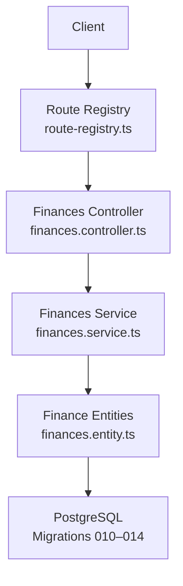
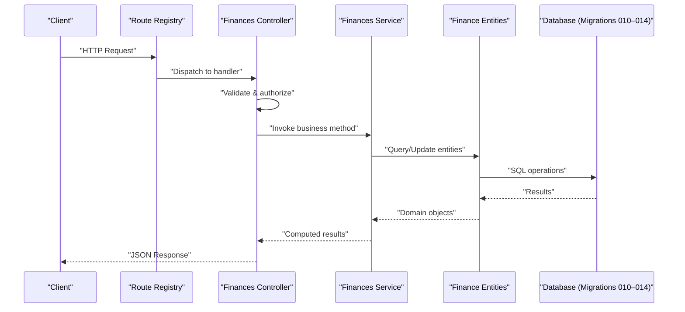
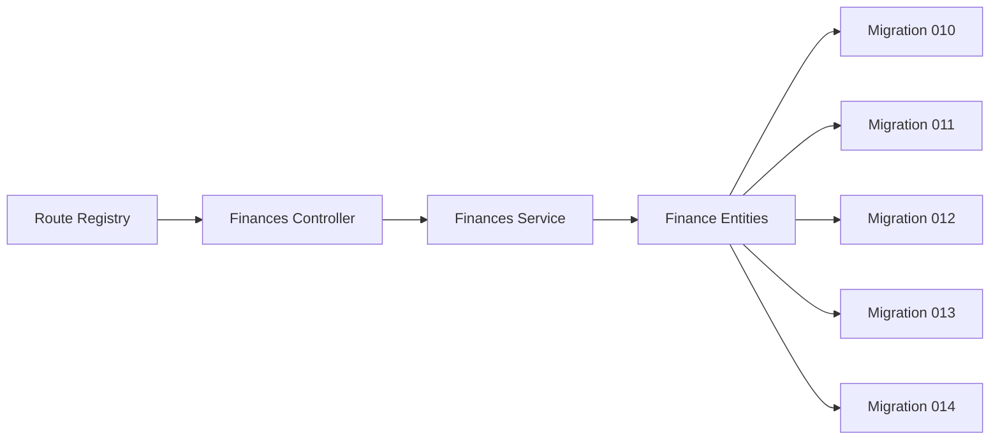

# Fee Structure Management API

<cite>
**Referenced Files in This Document**
- [API-FINANCES.md](file://docs/API-FINANCES.md)
- [IMPLEMENTATION-COMPLETE-FINANCES.md](file://docs/implementations/IMPLEMENTATION-COMPLETE-FINANCES.md)
- [ANALYSE-FRAIS-REMISES-COHERENCE.md](file://docs/analyses/ANALYSE-FRAIS-REMISES-COHERENCE.md)
- [010-module-finances.sql](file://backend/database/migrations/010-module-finances.sql)
- [011-module-finances-part2.sql](file://backend/database/migrations/011-module-finances-part2.sql)
- [012-module-finances-part3-parametres.sql](file://backend/database/migrations/012-module-finances-part3-parametres.sql)
- [013-module-finances-phase1-granularite.sql](file://backend/database/migrations/013-module-finances-phase1-granularite.sql)
- [014-module-finances-phase2-section.sql](file://backend/database/migrations/014-module-finances-phase2-section.sql)
- [finances.controller.ts](file://backend/src/modules/finances/controllers/finances.controller.ts)
- [finances.service.ts](file://backend/src/modules/finances/services/finances.service.ts)
- [finances.entity.ts](file://backend/src/modules/finances/entities/finances.entity.ts)
- [route-registry.ts](file://backend/src/routes/route-registry.ts)
</cite>

## Table of Contents
1. [Introduction](#introduction)
2. [Project Structure](#project-structure)
3. [Core Components](#core-components)
4. [Architecture Overview](#architecture-overview)
5. [Detailed Component Analysis](#detailed-component-analysis)
6. [Dependency Analysis](#dependency-analysis)
7. [Performance Considerations](#performance-considerations)
8. [Troubleshooting Guide](#troubleshooting-guide)
9. [Conclusion](#conclusion)
10. [Appendices](#appendices)

## Introduction
This document provides detailed API documentation for fee structure management endpoints, including fee categories creation and management, discount and waiver systems, payment plan configurations, and late fee policy settings. It covers HTTP methods, URL patterns, request/response schemas, validation rules for financial calculations, business logic examples, inheritance from academic levels, conditional application based on student status, bulk operations, authentication requirements, error handling patterns, and integration with enrollment workflows.

## Project Structure
The finance module is implemented under backend/src/modules/finances and exposed via the route registry. Database schema definitions are provided by migrations 010–014. High-level API behavior and implementation notes are documented in docs/API-FINANCES.md and docs/implementations/IMPLEMENTATION-COMPLETE-FINANCES.md.

**Diagram sources**
- [route-registry.ts](file://backend/src/routes/route-registry.ts)
- [finances.controller.ts](file://backend/src/modules/finances/controllers/finances.controller.ts)
- [finances.service.ts](file://backend/src/modules/finances/services/finances.service.ts)
- [finances.entity.ts](file://backend/src/modules/finances/entities/finances.entity.ts)
- [010-module-finances.sql](file://backend/database/migrations/010-module-finances.sql)
- [011-module-finances-part2.sql](file://backend/database/migrations/011-module-finances-part2.sql)
- [012-module-finances-part3-parametres.sql](file://backend/database/migrations/012-module-finances-part3-parametres.sql)
- [013-module-finances-phase1-granularite.sql](file://backend/database/migrations/013-module-finances-phase1-granularite.sql)
- [014-module-finances-phase2-section.sql](file://backend/database/migrations/014-module-finances-phase2-section.sql)

**Section sources**
- [API-FINANCES.md](file://docs/API-FINANCES.md)
- [IMPLEMENTATION-COMPLETE-FINANCES.md](file://docs/implementations/IMPLEMENTATION-COMPLETE-FINANCES.md)
- [route-registry.ts](file://backend/src/routes/route-registry.ts)

## Core Components
- Finances Controller: Exposes REST endpoints for fee structures, discounts, waivers, payment plans, and late fee policies. Handles request validation, authorization checks, and response formatting.
- Finances Service: Encapsulates business logic for fee calculation, inheritance resolution, conditional application, and bulk operations.
- Finance Entities: Data models representing fee categories, discounts/waivers, payment plans, and late fee policies.
- Route Registry: Centralized registration of finance routes and middleware composition.

Key responsibilities:
- Fee categories CRUD and hierarchy mapping to academic levels.
- Discount and waiver configuration with precedence rules.
- Payment plan scheduling and installment generation.
- Late fee policy enforcement with configurable thresholds.
- Conditional application based on student status and enrollment context.
- Bulk operations for mass updates and recalculations.

**Section sources**
- [finances.controller.ts](file://backend/src/modules/finances/controllers/finances.controller.ts)
- [finances.service.ts](file://backend/src/modules/finances/services/finances.service.ts)
- [finances.entity.ts](file://backend/src/modules/finances/entities/finances.entity.ts)
- [route-registry.ts](file://backend/src/routes/route-registry.ts)

## Architecture Overview
The finance API follows a layered architecture:
- Routes are registered centrally and delegate to controllers.
- Controllers validate inputs, enforce permissions, and call services.
- Services implement domain logic, orchestrate entity interactions, and compute fees.
- Entities map to database tables defined by migrations.

**Diagram sources**
- [route-registry.ts](file://backend/src/routes/route-registry.ts)
- [finances.controller.ts](file://backend/src/modules/finances/controllers/finances.controller.ts)
- [finances.service.ts](file://backend/src/modules/finances/services/finances.service.ts)
- [finances.entity.ts](file://backend/src/modules/finances/entities/finances.entity.ts)
- [010-module-finances.sql](file://backend/database/migrations/010-module-finances.sql)
- [011-module-finances-part2.sql](file://backend/database/migrations/011-module-finances-part2.sql)
- [012-module-finances-part3-parametres.sql](file://backend/database/migrations/012-module-finances-part3-parametres.sql)
- [013-module-finances-phase1-granularite.sql](file://backend/database/migrations/013-module-finances-phase1-granularite.sql)
- [014-module-finances-phase2-section.sql](file://backend/database/migrations/014-module-finances-phase2-section.sql)

## Detailed Component Analysis

### Fee Categories Management
Endpoints:
- POST /api/finance/fee-categories: Create a new fee category.
- GET /api/finance/fee-categories: List all fee categories.
- GET /api/finance/fee-categories/:id: Retrieve a specific fee category.
- PUT /api/finance/fee-categories/:id: Update an existing fee category.
- DELETE /api/finance/fee-categories/:id: Remove a fee category.

Request/Response Schema:
- Category fields include name, code, description, applicable academic level(s), currency, amount type (fixed or percentage), base reference (tuition, registration, etc.), effective dates, and status flags.
- Responses include created/updated timestamps and audit metadata.

Validation Rules:
- Amount must be non-negative; percentage values must be within 0–100.
- Effective date ranges must not overlap for the same scope.
- Academic level references must exist and be active.

Business Logic Examples:
- Inheritance: If a category is defined at a higher academic level, it applies to lower levels unless overridden by a more specific level assignment.
- Scope: Categories can be scoped by section, program, or class.

Authentication:
- Requires role-based permission to manage fee structures.

Error Handling:
- 400 for invalid payloads.
- 404 when referencing non-existent categories or academic levels.
- 409 for overlapping effective date conflicts.

**Section sources**
- [finances.controller.ts](file://backend/src/modules/finances/controllers/finances.controller.ts)
- [finances.service.ts](file://backend/src/modules/finances/services/finances.service.ts)
- [finances.entity.ts](file://backend/src/modules/finances/entities/finances.entity.ts)
- [010-module-finances.sql](file://backend/database/migrations/010-module-finances.sql)
- [011-module-finances-part2.sql](file://backend/database/migrations/011-module-finances-part2.sql)
- [012-module-finances-part3-parametres.sql](file://backend/database/migrations/012-module-finances-part3-parametres.sql)
- [013-module-finances-phase1-granularite.sql](file://backend/database/migrations/013-module-finances-phase1-granularite.sql)
- [014-module-finances-phase2-section.sql](file://backend/database/migrations/014-module-finances-phase2-section.sql)

### Discounts and Waivers System
Endpoints:
- POST /api/finance/discounts: Create a discount rule.
- GET /api/finance/discounts: List discount rules.
- PUT /api/finance/discounts/:id: Update a discount rule.
- DELETE /api/finance/discounts/:id: Remove a discount rule.
- POST /api/finance/waivers: Create a waiver rule.
- GET /api/finance/waivers: List waiver rules.
- PUT /api/finance/waivers/:id: Update a waiver rule.
- DELETE /api/finance/waivers/:id: Remove a waiver rule.

Request/Response Schema:
- Rule fields include type (discount/waiver), value (amount or percentage), conditions (student status, scholarship flag, enrollment phase), priority, effective period, and target scope (category or total).
- Responses include computed applied amounts and reason codes.

Validation Rules:
- Percentage values must be within 0–100; absolute amounts must be non-negative.
- Conditions must reference valid enums and existing identifiers.
- Priority determines precedence when multiple rules apply.

Business Logic Examples:
- Precedence: Higher priority rules override lower ones; waivers take precedence over discounts when both match.
- Conditional Application: Rules can be scoped by student status (e.g., enrolled, pending, graduated) and enrollment workflow stage.

Authentication:
- Requires administrative permission for financial adjustments.

Error Handling:
- 400 for invalid rule parameters.
- 404 for missing referenced entities.
- 409 for conflicting rule priorities or overlapping scopes.

**Section sources**
- [finances.controller.ts](file://backend/src/modules/finances/controllers/finances.controller.ts)
- [finances.service.ts](file://backend/src/modules/finances/services/finances.service.ts)
- [finances.entity.ts](file://backend/src/modules/finances/entities/finances.entity.ts)
- [ANALYSE-FRAIS-REMISES-COHERENCE.md](file://docs/analyses/ANALYSE-FRAIS-REMISES-COHERENCE.md)

### Payment Plan Configurations
Endpoints:
- POST /api/finance/payment-plans: Create a payment plan.
- GET /api/finance/payment-plans: List payment plans.
- GET /api/finance/payment-plans/:id: Retrieve a specific plan.
- PUT /api/finance/payment-plans/:id: Update a plan.
- DELETE /api/finance/payment-plans/:id: Remove a plan.
- POST /api/finance/payment-plans/:id/generate-installments: Generate installments for a given enrollment.

Request/Response Schema:
- Plan fields include name, schedule type (monthly, quarterly, per-term), number of installments, due day offsets, grace period, auto-retry flags, and associated fee categories.
- Installment responses include due dates, amounts, statuses (pending, paid, overdue), and links to payments.

Validation Rules:
- Number of installments must be positive and within configured limits.
- Due dates must be future-dated relative to enrollment start.
- Grace periods must be non-negative.

Business Logic Examples:
- Auto-generation: When an enrollment is confirmed, installments are generated according to the selected plan.
- Recalculation: Changes to fee amounts trigger installment recalculation respecting plan constraints.

Authentication:
- Requires permission to configure billing schedules.

Error Handling:
- 400 for invalid plan parameters.
- 404 for missing plans or enrollments.
- 409 for schedule conflicts or duplicate installment dates.

**Section sources**
- [finances.controller.ts](file://backend/src/modules/finances/controllers/finances.controller.ts)
- [finances.service.ts](file://backend/src/modules/finances/services/finances.service.ts)
- [finances.entity.ts](file://backend/src/modules/finances/entities/finances.entity.ts)
- [013-module-finances-phase1-granularite.sql](file://backend/database/migrations/013-module-finances-phase1-granularite.sql)
- [014-module-finances-phase2-section.sql](file://backend/database/migrations/014-module-finances-phase2-section.sql)

### Late Fee Policy Settings
Endpoints:
- POST /api/finance/late-fee-policies: Create a late fee policy.
- GET /api/finance/late-fee-policies: List policies.
- PUT /api/finance/late-fee-policies/:id: Update a policy.
- DELETE /api/finance/late-fee-policies/:id: Remove a policy.
- POST /api/finance/late-fee-policies/:id/calculate: Calculate late fees for a set of installments.

Request/Response Schema:
- Policy fields include threshold days, fee type (flat or percentage), cap limits, compounding rules, and applicability scope (plan or category).
- Calculation responses include per-installment late fees, totals, and reasons.

Validation Rules:
- Threshold days must be non-negative.
- Percentage caps must be within 0–100.
- Compounding intervals must be valid time units.

Business Logic Examples:
- Enforcement: Late fees are applied after the grace period expires; compounding occurs at configured intervals up to the cap.
- Integration: Late fee calculations integrate with payment reminders and collection workflows.

Authentication:
- Requires administrative permission for financial policies.

Error Handling:
- 400 for invalid policy parameters.
- 404 for missing policies or installments.
- 409 for conflicting policy scopes.

**Section sources**
- [finances.controller.ts](file://backend/src/modules/finances/controllers/finances.controller.ts)
- [finances.service.ts](file://backend/src/modules/finances/services/finances.service.ts)
- [finances.entity.ts](file://backend/src/modules/finances/entities/finances.entity.ts)
- [012-module-finances-part3-parametres.sql](file://backend/database/migrations/012-module-finances-part3-parametres.sql)

### Fee Inheritance and Conditional Application
Inheritance:
- Fees defined at higher academic levels cascade down unless explicitly overridden at a lower level.
- Section-specific overrides take precedence over level defaults.

Conditional Application:
- Student status filters determine eligibility (e.g., only active enrollments).
- Enrollment workflow stages gate certain fees (e.g., registration vs. tuition).

Bulk Operations:
- Batch update endpoints allow applying changes across multiple students or classes.
- Bulk recalculation triggers re-evaluation of inherited and conditional rules.

Integration with Enrollment Workflows:
- On enrollment confirmation, applicable fees are resolved and installments generated.
- Status transitions (e.g., from pending to enrolled) may activate additional fees or waivers.

**Section sources**
- [finances.service.ts](file://backend/src/modules/finances/services/finances.service.ts)
- [finances.entity.ts](file://backend/src/modules/finances/entities/finances.entity.ts)
- [013-module-finances-phase1-granularite.sql](file://backend/database/migrations/013-module-finances-phase1-granularite.sql)
- [014-module-finances-phase2-section.sql](file://backend/database/migrations/014-module-finances-phase2-section.sql)

### Authentication and Authorization
- All endpoints require authenticated requests with appropriate roles/permissions.
- Role-based access control restricts creation/modification of financial configurations to administrators.
- Audit logging captures who made changes and when.

**Section sources**
- [finances.controller.ts](file://backend/src/modules/finances/controllers/finances.controller.ts)
- [route-registry.ts](file://backend/src/routes/route-registry.ts)

### Error Handling Patterns
- Consistent JSON error responses with code, message, and details.
- Validation errors return structured field-level messages.
- Business rule violations return descriptive codes for client-side handling.

**Section sources**
- [finances.controller.ts](file://backend/src/modules/finances/controllers/finances.controller.ts)
- [finances.service.ts](file://backend/src/modules/finances/services/finances.service.ts)

## Dependency Analysis
The finance module depends on:
- Route registry for endpoint registration.
- Controller layer for request handling and validation.
- Service layer for business logic and orchestration.
- Entity layer for data persistence mapped by migrations.

**Diagram sources**
- [route-registry.ts](file://backend/src/routes/route-registry.ts)
- [finances.controller.ts](file://backend/src/modules/finances/controllers/finances.controller.ts)
- [finances.service.ts](file://backend/src/modules/finances/services/finances.service.ts)
- [finances.entity.ts](file://backend/src/modules/finances/entities/finances.entity.ts)
- [010-module-finances.sql](file://backend/database/migrations/010-module-finances.sql)
- [011-module-finances-part2.sql](file://backend/database/migrations/011-module-finances-part2.sql)
- [012-module-finances-part3-parametres.sql](file://backend/database/migrations/012-module-finances-part3-parametres.sql)
- [013-module-finances-phase1-granularite.sql](file://backend/database/migrations/013-module-finances-phase1-granularite.sql)
- [014-module-finances-phase2-section.sql](file://backend/database/migrations/014-module-finances-phase2-section.sql)

**Section sources**
- [route-registry.ts](file://backend/src/routes/route-registry.ts)
- [finances.controller.ts](file://backend/src/modules/finances/controllers/finances.controller.ts)
- [finances.service.ts](file://backend/src/modules/finances/services/finances.service.ts)
- [finances.entity.ts](file://backend/src/modules/finances/entities/finances.entity.ts)

## Performance Considerations
- Use pagination for list endpoints to handle large datasets.
- Cache frequently accessed fee categories and policies where appropriate.
- Optimize queries with indexes defined in migration scripts.
- Avoid unnecessary recalculations by batching updates and using incremental computations.

[No sources needed since this section provides general guidance]

## Troubleshooting Guide
Common issues:
- Invalid financial calculations: Check validation rules and ensure amounts/percentages are within allowed ranges.
- Overlapping effective dates: Resolve conflicts by adjusting date ranges or priorities.
- Missing references: Ensure academic levels, sections, and student statuses exist before creating rules.
- Permission errors: Verify user roles have required permissions for financial operations.

Diagnostic steps:
- Inspect error responses for structured codes and messages.
- Review audit logs for change history.
- Validate entity relationships against migration schemas.

**Section sources**
- [finances.controller.ts](file://backend/src/modules/finances/controllers/finances.controller.ts)
- [finances.service.ts](file://backend/src/modules/finances/services/finances.service.ts)

## Conclusion
The Fee Structure Management API provides comprehensive capabilities for managing fee categories, discounts, waivers, payment plans, and late fee policies. It supports inheritance, conditional application, and bulk operations, integrating seamlessly with enrollment workflows. Proper authentication, robust validation, and clear error handling ensure reliable financial operations.

[No sources needed since this section summarizes without analyzing specific files]

## Appendices

### API Endpoints Summary
- Fee Categories: POST, GET, GET/:id, PUT/:id, DELETE/:id
- Discounts: POST, GET, PUT/:id, DELETE/:id
- Waivers: POST, GET, PUT/:id, DELETE/:id
- Payment Plans: POST, GET, GET/:id, PUT/:id, DELETE/:id, POST/:id/generate-installments
- Late Fee Policies: POST, GET, PUT/:id, DELETE/:id, POST/:id/calculate

**Section sources**
- [API-FINANCES.md](file://docs/API-FINANCES.md)
- [IMPLEMENTATION-COMPLETE-FINANCES.md](file://docs/implementations/IMPLEMENTATION-COMPLETE-FINANCES.md)