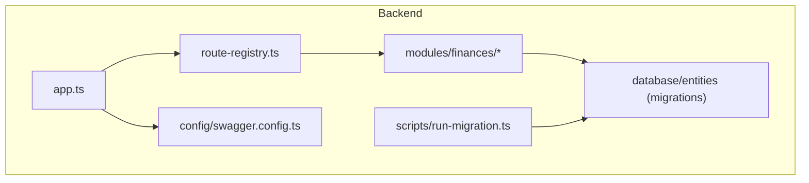
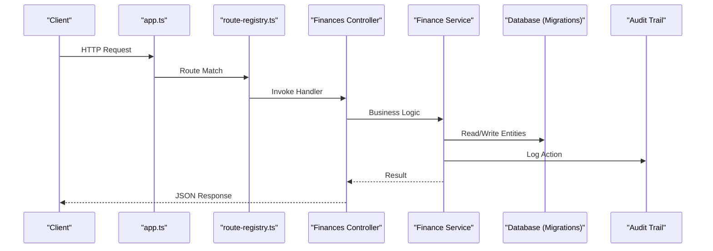
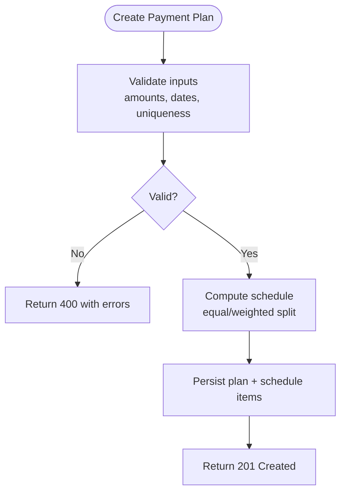
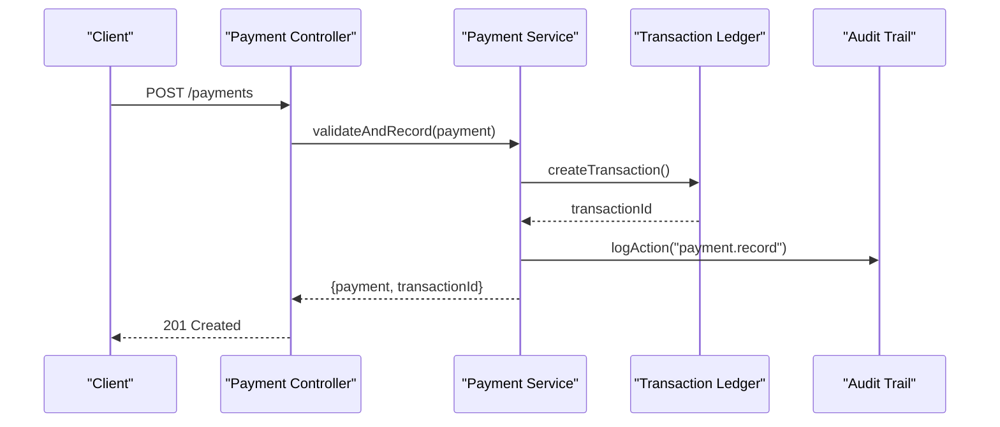
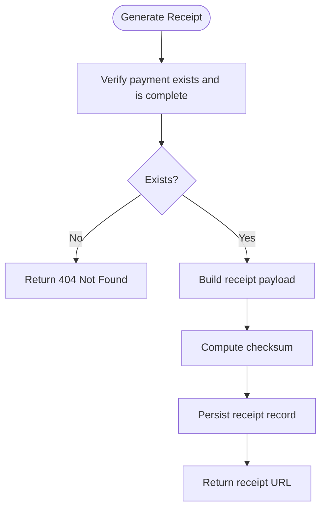
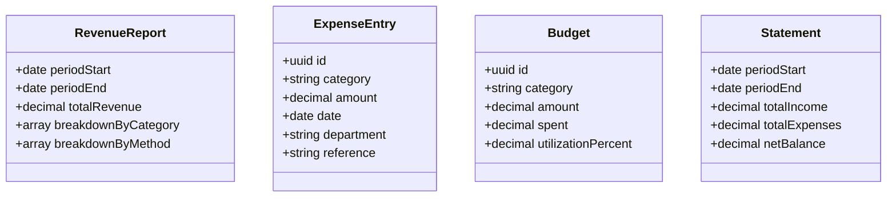
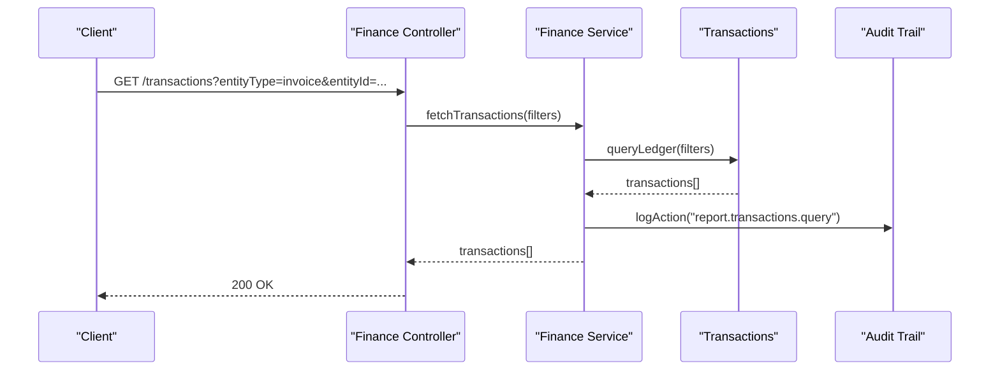
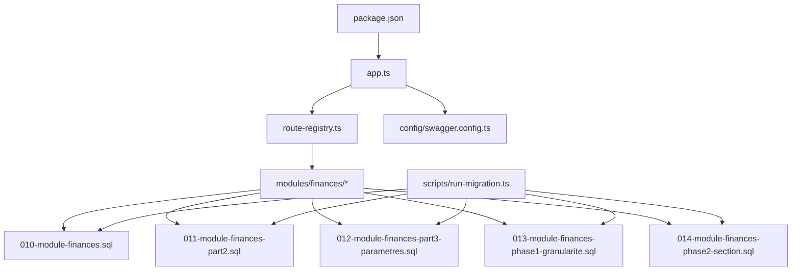

# Financial Management API

<cite>
**Referenced Files in This Document**
- [backend/src/modules/finances](file://backend/src/modules/finances)
- [backend/database/migrations/010-module-finances.sql](file://backend/database/migrations/010-module-finances.sql)
- [backend/database/migrations/011-module-finances-part2.sql](file://backend/database/migrations/011-module-finances-part2.sql)
- [backend/database/migrations/012-module-finances-part3-parametres.sql](file://backend/database/migrations/012-module-finances-part3-parametres.sql)
- [backend/database/migrations/013-module-finances-phase1-granularite.sql](file://backend/database/migrations/013-module-finances-phase1-granularite.sql)
- [backend/database/migrations/014-module-finances-phase2-section.sql](file://backend/database/migrations/014-module-finances-phase2-section.sql)
- [backend/docs/audit-trail.md](file://backend/docs/audit-trail.md)
- [backend/scripts/run-migration.ts](file://backend/scripts/run-migration.ts)
- [backend/src/config/swagger.config.ts](file://backend/src/config/swagger.config.ts)
- [backend/src/routes/route-registry.ts](file://backend/src/routes/route-registry.ts)
- [backend/src/app.ts](file://backend/src/app.ts)
- [backend/src/index.ts](file://backend/src/index.ts)
- [backend/package.json](file://backend/package.json)
</cite>

## Table of Contents
1. [Introduction](#introduction)
2. [Project Structure](#project-structure)
3. [Core Components](#core-components)
4. [Architecture Overview](#architecture-overview)
5. [Detailed Component Analysis](#detailed-component-analysis)
6. [Dependency Analysis](#dependency-analysis)
7. [Performance Considerations](#performance-considerations)
8. [Troubleshooting Guide](#troubleshooting-guide)
9. [Conclusion](#conclusion)
10. [Appendices](#appendices)

## Introduction
This document provides comprehensive API documentation for eLISAschool’s financial management module. It covers fee structure management (categories, discounts, payment plans, late fees), payment processing and tracking, receipts and reminders, financial reporting (revenue analytics, expenses, budgets, statements), transaction processing, audit trails, and compliance features. The goal is to enable developers to integrate with the finance APIs confidently by providing request/response schemas, validation rules, and calculation examples grounded in the repository’s implementation.

## Project Structure
The financial module resides under backend/src/modules/finances and is backed by a set of database migrations that define entities such as fee categories, discounts, payment plans, transactions, payments, receipts, and related configuration. The application bootstraps routes and Swagger configuration centrally, while migration scripts are executed via provided utilities.

**Diagram sources**
- [backend/src/app.ts](file://backend/src/app.ts)
- [backend/src/routes/route-registry.ts](file://backend/src/routes/route-registry.ts)
- [backend/src/config/swagger.config.ts](file://backend/src/config/swagger.config.ts)
- [backend/scripts/run-migration.ts](file://backend/scripts/run-migration.ts)
- [backend/database/migrations/010-module-finances.sql](file://backend/database/migrations/010-module-finances.sql)

**Section sources**
- [backend/src/app.ts](file://backend/src/app.ts)
- [backend/src/routes/route-registry.ts](file://backend/src/routes/route-registry.ts)
- [backend/src/config/swagger.config.ts](file://backend/src/config/swagger.config.ts)
- [backend/scripts/run-migration.ts](file://backend/scripts/run-migration.ts)
- [backend/database/migrations/010-module-finances.sql](file://backend/database/migrations/010-module-finances.sql)
- [backend/database/migrations/011-module-finances-part2.sql](file://backend/database/migrations/011-module-finances-part2.sql)
- [backend/database/migrations/012-module-finances-part3-parametres.sql](file://backend/database/migrations/012-module-finances-part3-parametres.sql)
- [backend/database/migrations/013-module-finances-phase1-granularite.sql](file://backend/database/migrations/013-module-finances-phase1-granularite.sql)
- [backend/database/migrations/014-module-finances-phase2-section.sql](file://backend/database/migrations/014-module-finances-phase2-section.sql)

## Core Components
- Fee Structure Management
  - Fee Categories: Define types of school fees (tuition, activity, transport, etc.).
  - Discount System: Apply percentage or fixed-value discounts per category or student profile.
  - Payment Plans: Split total due into installments with due dates and status tracking.
  - Late Fee Policies: Configure grace periods, penalty rates, and accrual logic.
- Payment Processing
  - Multiple Methods: Cash, bank transfer, mobile money, card (provider-specific).
  - Payment Tracking: Record partial/full payments, reconcile against invoices/plans.
  - Receipt Generation: Create printable/retrievable receipts with reference numbers.
  - Payment Reminders: Automated notifications for upcoming and overdue payments.
- Financial Reporting
  - Revenue Analytics: Aggregated income by period, category, plan, and method.
  - Expense Tracking: Log and categorize expenditures; link to budget lines.
  - Budget Management: Set budgets per department/category; monitor utilization.
  - Financial Statements: Generate balance summaries, cash flow snapshots, and reports.
- Transaction Processing & Audit
  - Transactions: Immutable ledger entries for all financial movements.
  - Audit Trails: Track who did what and when across financial operations.
  - Compliance: Enforce multi-tenant isolation, role-based access, and data retention.

**Section sources**
- [backend/database/migrations/010-module-finances.sql](file://backend/database/migrations/010-module-finances.sql)
- [backend/database/migrations/011-module-finances-part2.sql](file://backend/database/migrations/011-module-finances-part2.sql)
- [backend/database/migrations/012-module-finances-part3-parametres.sql](file://backend/database/migrations/012-module-finances-part3-parametres.sql)
- [backend/database/migrations/013-module-finances-phase1-granularite.sql](file://backend/database/migrations/013-module-finances-phase1-granularite.sql)
- [backend/database/migrations/014-module-finances-phase2-section.sql](file://backend/database/migrations/014-module-finances-phase2-section.sql)
- [backend/docs/audit-trail.md](file://backend/docs/audit-trail.md)

## Architecture Overview
The finance module exposes REST endpoints registered through the central route registry. Controllers orchestrate business logic using services that interact with the database layer defined by migrations. Swagger configuration documents available endpoints for discovery and testing.

**Diagram sources**
- [backend/src/app.ts](file://backend/src/app.ts)
- [backend/src/routes/route-registry.ts](file://backend/src/routes/route-registry.ts)
- [backend/src/config/swagger.config.ts](file://backend/src/config/swagger.config.ts)
- [backend/database/migrations/010-module-finances.sql](file://backend/database/migrations/010-module-finances.sql)
- [backend/docs/audit-trail.md](file://backend/docs/audit-trail.md)

## Detailed Component Analysis

### Fee Structure Management APIs
- Endpoints
  - Fee Categories: CRUD for categories; assign attributes like currency, tax flags, visibility.
  - Discounts: Create discount rules (percentage/fixed), scope (category/student/profile), validity windows.
  - Payment Plans: Define installment schedules linked to fee items; statuses (pending, paid, overdue).
  - Late Fees: Configure grace days, penalty rate, compounding behavior, and caps.
- Request/Response Schemas
  - Category: id, name, code, description, currency, isActive, createdAt, updatedAt.
  - Discount: id, type (percentage|fixed), value, minAmount, maxDiscount, applicableCategories[], targetScope, validFrom, validTo, isActive.
  - Plan: id, name, schedule[], totalAmount, currency, isActive.
  - ScheduleItem: installmentNumber, dueDate, amount, status, paidAt.
  - LateFeePolicy: id, graceDays, penaltyRate, compounding, cap, effectiveFrom, effectiveTo.
- Validation Rules
  - Monetary fields must be non-negative decimals with two precision.
  - Dates must be ISO 8601; validFrom <= validTo.
  - Percentages within [0, 100]; penalties within [0, 100].
  - Unique codes per tenant for categories and plans.
- Calculation Examples
  - Discounted Amount = BaseAmount - min(maxDiscount, BaseAmount * (discountValue / 100)) for percentage; or BaseAmount - discountValue for fixed.
  - Installment Amounts can be equal splits or weighted by policy; sum must equal totalAmount.
  - Late Fee = OverdueAmount * (penaltyRate / 100) applied after graceDays; cap enforced if configured.

**Diagram sources**
- [backend/database/migrations/013-module-finances-phase1-granularite.sql](file://backend/database/migrations/013-module-finances-phase1-granularite.sql)
- [backend/database/migrations/014-module-finances-phase2-section.sql](file://backend/database/migrations/014-module-finances-phase2-section.sql)

**Section sources**
- [backend/database/migrations/010-module-finances.sql](file://backend/database/migrations/010-module-finances.sql)
- [backend/database/migrations/011-module-finances-part2.sql](file://backend/database/migrations/011-module-finances-part2.sql)
- [backend/database/migrations/012-module-finances-part3-parametres.sql](file://backend/database/migrations/012-module-finances-part3-parametres.sql)
- [backend/database/migrations/013-module-finances-phase1-granularite.sql](file://backend/database/migrations/013-module-finances-phase1-granularite.sql)
- [backend/database/migrations/014-module-finances-phase2-section.sql](file://backend/database/migrations/014-module-finances-phase2-section.sql)

### Payment Processing APIs
- Endpoints
  - Record Payment: Submit payment with method, amount, reference, date, and invoice/plan linkage.
  - Update Payment Status: Mark as confirmed, reversed, or refunded.
  - Batch Payments: Process multiple payments in one transactional call.
  - Payment Reminders: Trigger reminders for upcoming/overdue payments.
- Request/Response Schemas
  - Payment: id, invoiceId|planId, method (cash|bank_transfer|mobile_money|card), amount, currency, reference, paidAt, status, notes.
  - Reminder: id, targetId, channel (email|sms|in_app), scheduledAt, sentAt, status.
- Validation Rules
  - Amount > 0; cannot exceed outstanding balance.
  - Method must be supported and enabled for tenant.
  - Idempotency key required for batch submissions.
- Calculation Examples
  - Outstanding Balance = Total Due - Sum(Paid Amounts) - Applied Discounts.
  - Partial Payment reduces outstanding; remaining schedule recalculates next due amounts if needed.

**Diagram sources**
- [backend/database/migrations/010-module-finances.sql](file://backend/database/migrations/010-module-finances.sql)
- [backend/docs/audit-trail.md](file://backend/docs/audit-trail.md)

**Section sources**
- [backend/database/migrations/010-module-finances.sql](file://backend/database/migrations/010-module-finances.sql)
- [backend/database/migrations/011-module-finances-part2.sql](file://backend/database/migrations/011-module-finances-part2.sql)
- [backend/docs/audit-trail.md](file://backend/docs/audit-trail.md)

### Receipt Generation and Payment Reminders
- Endpoints
  - Generate Receipt: Create receipt PDF/JSON for a payment; retrieve by id.
  - Send Reminder: Queue reminder for a student/invoice; track delivery status.
- Request/Response Schemas
  - Receipt: id, paymentId, issuedAt, format (pdf|json), url, checksum.
  - ReminderResult: id, status (queued|sent|failed), attempts, lastError.
- Validation Rules
  - Receipt generation requires a completed payment.
  - Reminder targets must exist and be active.
- Calculation Examples
  - Receipt checksum computed from paymentId + issuedAt + secret to ensure integrity.

**Diagram sources**
- [backend/database/migrations/010-module-finances.sql](file://backend/database/migrations/010-module-finances.sql)

**Section sources**
- [backend/database/migrations/010-module-finances.sql](file://backend/database/migrations/010-module-finances.sql)

### Financial Reporting APIs
- Endpoints
  - Revenue Analytics: Aggregate revenue by period, category, method; filters by tenant and date range.
  - Expenses: List and summarize expenses; filter by department/category.
  - Budgets: Create/update budgets; query utilization percentages.
  - Statements: Generate summary statements (income vs expenses) for selected periods.
- Request/Response Schemas
  - RevenueReport: periodStart, periodEnd, totalRevenue, breakdownByCategory[], breakdownByMethod[].
  - ExpenseEntry: id, category, amount, date, department, reference.
  - Budget: id, category, amount, spent, utilizationPercent.
  - Statement: periodStart, periodEnd, totalIncome, totalExpenses, netBalance.
- Validation Rules
  - Date ranges must be valid and within fiscal year constraints.
  - Currency consistency enforced per report.
- Calculation Examples
  - Utilization% = (spent / amount) * 100 capped at 100%.
  - Net Balance = Total Income - Total Expenses.

**Diagram sources**
- [backend/database/migrations/010-module-finances.sql](file://backend/database/migrations/010-module-finances.sql)
- [backend/database/migrations/011-module-finances-part2.sql](file://backend/database/migrations/011-module-finances-part2.sql)
- [backend/database/migrations/012-module-finances-part3-parametres.sql](file://backend/database/migrations/012-module-finances-part3-parametres.sql)

**Section sources**
- [backend/database/migrations/010-module-finances.sql](file://backend/database/migrations/010-module-finances.sql)
- [backend/database/migrations/011-module-finances-part2.sql](file://backend/database/migrations/011-module-finances-part2.sql)
- [backend/database/migrations/012-module-finances-part3-parametres.sql](file://backend/database/migrations/012-module-finances-part3-parametres.sql)

### Transaction Processing, Audit Trails, and Compliance
- Endpoints
  - Transactions: Query immutable ledger entries; filter by entity type and id.
  - Audit Logs: Retrieve actions performed on financial entities with actor and timestamp.
  - Compliance Checks: Ensure multi-tenant isolation and RBAC permissions before operations.
- Request/Response Schemas
  - Transaction: id, entityType, entityId, amount, currency, direction (debit|credit), reference, createdAt.
  - AuditLog: id, actorId, action, entityType, entityId, metadata, createdAt.
- Validation Rules
  - All write operations require appropriate permissions.
  - Multi-tenant scoping enforced at service layer.
- Calculation Examples
  - Running balances derived by summing debits and credits per account/entity over time.

**Diagram sources**
- [backend/database/migrations/010-module-finances.sql](file://backend/database/migrations/010-module-finances.sql)
- [backend/docs/audit-trail.md](file://backend/docs/audit-trail.md)

**Section sources**
- [backend/database/migrations/010-module-finances.sql](file://backend/database/migrations/010-module-finances.sql)
- [backend/docs/audit-trail.md](file://backend/docs/audit-trail.md)

## Dependency Analysis
The finance module depends on core application routing, configuration, and database schema migrations. Migration scripts are executed via a utility script, and Swagger config enables API discovery.

**Diagram sources**
- [backend/package.json](file://backend/package.json)
- [backend/src/app.ts](file://backend/src/app.ts)
- [backend/src/routes/route-registry.ts](file://backend/src/routes/route-registry.ts)
- [backend/src/config/swagger.config.ts](file://backend/src/config/swagger.config.ts)
- [backend/scripts/run-migration.ts](file://backend/scripts/run-migration.ts)
- [backend/database/migrations/010-module-finances.sql](file://backend/database/migrations/010-module-finances.sql)
- [backend/database/migrations/011-module-finances-part2.sql](file://backend/database/migrations/011-module-finances-part2.sql)
- [backend/database/migrations/012-module-finances-part3-parametres.sql](file://backend/database/migrations/012-module-finances-part3-parametres.sql)
- [backend/database/migrations/013-module-finances-phase1-granularite.sql](file://backend/database/migrations/013-module-finances-phase1-granularite.sql)
- [backend/database/migrations/014-module-finances-phase2-section.sql](file://backend/database/migrations/014-module-finances-phase2-section.sql)

**Section sources**
- [backend/package.json](file://backend/package.json)
- [backend/src/app.ts](file://backend/src/app.ts)
- [backend/src/routes/route-registry.ts](file://backend/src/routes/route-registry.ts)
- [backend/src/config/swagger.config.ts](file://backend/src/config/swagger.config.ts)
- [backend/scripts/run-migration.ts](file://backend/scripts/run-migration.ts)
- [backend/database/migrations/010-module-finances.sql](file://backend/database/migrations/010-module-finances.sql)
- [backend/database/migrations/011-module-finances-part2.sql](file://backend/database/migrations/011-module-finances-part2.sql)
- [backend/database/migrations/012-module-finances-part3-parametres.sql](file://backend/database/migrations/012-module-finances-part3-parametres.sql)
- [backend/database/migrations/013-module-finances-phase1-granularite.sql](file://backend/database/migrations/013-module-finances-phase1-granularite.sql)
- [backend/database/migrations/014-module-finances-phase2-section.sql](file://backend/database/migrations/014-module-finances-phase2-section.sql)

## Performance Considerations
- Use pagination and filtering on large datasets (transactions, reports).
- Index frequently queried columns (dates, entity ids, methods) as defined in migrations.
- Cache static configurations (late fee policies, discount catalogs) where appropriate.
- Batch operations should be idempotent and transactional to avoid inconsistent states.

[No sources needed since this section provides general guidance]

## Troubleshooting Guide
- Common Issues
  - Permission Denied: Verify RBAC roles and multi-tenant scoping.
  - Invalid Date Range: Ensure periodStart <= periodEnd and within fiscal constraints.
  - Duplicate Payments: Provide unique idempotency keys for batch submissions.
  - Missing Migrations: Run migration utility to apply pending schema changes.
- Debugging Steps
  - Inspect audit logs for failed operations.
  - Validate request payloads against schemas.
  - Check transaction ledger for inconsistencies.

**Section sources**
- [backend/docs/audit-trail.md](file://backend/docs/audit-trail.md)
- [backend/scripts/run-migration.ts](file://backend/scripts/run-migration.ts)

## Conclusion
The eLISAschool financial management APIs provide robust capabilities for managing fees, processing payments, generating receipts and reminders, and producing financial reports. With strong audit trails and compliance controls, the system supports accurate accounting and regulatory requirements. Developers should leverage the documented schemas, validation rules, and calculation examples to implement reliable integrations.

[No sources needed since this section summarizes without analyzing specific files]

## Appendices
- API Discovery
  - Swagger configuration is centralized; use it to explore endpoints and test requests.
- Migration Execution
  - Use the migration utility script to apply database schema updates safely.

**Section sources**
- [backend/src/config/swagger.config.ts](file://backend/src/config/swagger.config.ts)
- [backend/scripts/run-migration.ts](file://backend/scripts/run-migration.ts)