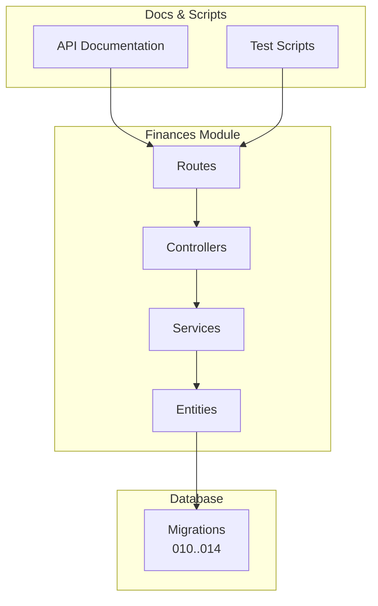
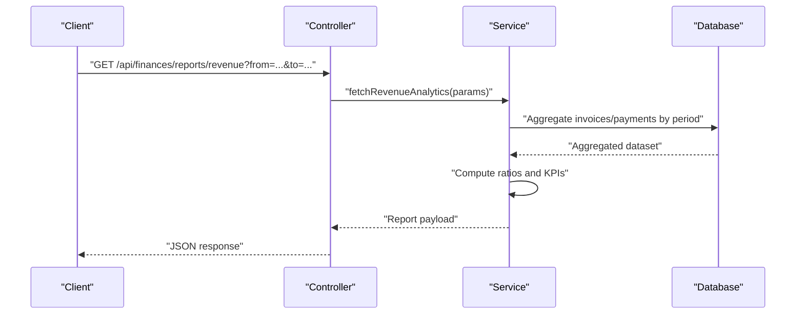
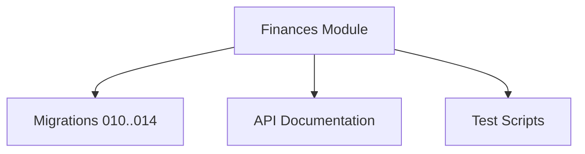

# Financial Reporting API

<cite>
**Referenced Files in This Document**
- [backend/src/modules/finances](file://backend/src/modules/finances)
- [backend/database/migrations/010-module-finances.sql](file://backend/database/migrations/010-module-finances.sql)
- [backend/database/migrations/011-module-finances-part2.sql](file://backend/database/migrations/011-module-finances-part2.sql)
- [backend/database/migrations/012-module-finances-part3-parametres.sql](file://backend/database/migrations/012-module-finances-part3-parametres.sql)
- [backend/database/migrations/013-module-finances-phase1-granularite.sql](file://backend/database/migrations/013-module-finances-phase1-granularite.sql)
- [backend/database/migrations/014-module-finances-phase2-section.sql](file://backend/database/migrations/014-module-finances-phase2-section.sql)
- [backend/docs/API-FINANCES.md](file://backend/docs/API-FINANCES.md)
- [backend/scripts/test-finance-module.sh](file://backend/scripts/test-finance-module.sh)
</cite>

## Table of Contents
1. [Introduction](#introduction)
2. [Project Structure](#project-structure)
3. [Core Components](#core-components)
4. [Architecture Overview](#architecture-overview)
5. [Detailed Component Analysis](#detailed-component-analysis)
6. [Dependency Analysis](#dependency-analysis)
7. [Performance Considerations](#performance-considerations)
8. [Troubleshooting Guide](#troubleshooting-guide)
9. [Conclusion](#conclusion)
10. [Appendices](#appendices)

## Introduction
This document provides detailed API documentation for financial reporting and analytics endpoints within the system. It covers revenue analytics (tuition collection tracking), expense monitoring, budget management, and financial statement generation. It also documents report customization options, date range filtering, export capabilities, accounting entries, ledger management, financial ratios calculation, compliance reporting, request/response schemas, data aggregation parameters, integration examples with accounting systems, performance optimization for large datasets, and real-time financial dashboards.

The scope is aligned with the finances module implementation and its database schema as defined by migrations and module documentation.

## Project Structure
The financial reporting functionality is implemented under the finances module and supported by dedicated database migrations that define entities such as accounts, categories, transactions, budgets, invoices, payments, and reports. The module exposes REST endpoints for CRUD operations on financial entities and analytical queries for reporting.

**Diagram sources**
- [backend/src/modules/finances](file://backend/src/modules/finances)
- [backend/database/migrations/010-module-finances.sql](file://backend/database/migrations/010-module-finances.sql)
- [backend/database/migrations/011-module-finances-part2.sql](file://backend/database/migrations/011-module-finances-part2.sql)
- [backend/database/migrations/012-module-finances-part3-parametres.sql](file://backend/database/migrations/012-module-finances-part3-parametres.sql)
- [backend/database/migrations/013-module-finances-phase1-granularite.sql](file://backend/database/migrations/013-module-finances-phase1-granularite.sql)
- [backend/database/migrations/014-module-finances-phase2-section.sql](file://backend/database/migrations/014-module-finances-phase2-section.sql)
- [backend/docs/API-FINANCES.md](file://backend/docs/API-FINANCES.md)
- [backend/scripts/test-finance-module.sh](file://backend/scripts/test-finance-module.sh)

**Section sources**
- [backend/src/modules/finances](file://backend/src/modules/finances)
- [backend/database/migrations/010-module-finances.sql](file://backend/database/migrations/010-module-finances.sql)
- [backend/database/migrations/011-module-finances-part2.sql](file://backend/database/migrations/011-module-finances-part2.sql)
- [backend/database/migrations/012-module-finances-part3-parametres.sql](file://backend/database/migrations/012-module-finances-part3-parametres.sql)
- [backend/database/migrations/013-module-finances-phase1-granularite.sql](file://backend/database/migrations/013-module-finances-phase1-granularite.sql)
- [backend/database/migrations/014-module-finances-phase2-section.sql](file://backend/database/migrations/014-module-finances-phase2-section.sql)
- [backend/docs/API-FINANCES.md](file://backend/docs/API-FINANCES.md)
- [backend/scripts/test-finance-module.sh](file://backend/scripts/test-finance-module.sh)

## Core Components
- Controllers: Expose REST endpoints for financial entities and reporting queries. They handle validation, authorization, and orchestration of service calls.
- Services: Implement business logic for financial operations, including calculations for totals, balances, ratios, and aggregations across time windows.
- Entities: Represent core financial data models such as accounts, categories, transactions, budgets, invoices, payments, and reports.
- Routes: Define URL patterns and HTTP methods mapped to controller actions.
- Database Schema: Defined via migrations, providing normalized tables for financial records and indexes for query performance.

Key responsibilities:
- Revenue analytics: tuition collection tracking, invoice lifecycle, payment reconciliation.
- Expense monitoring: categorization, approval workflows, variance vs budget.
- Budget management: planning, allocation, consumption tracking, alerts.
- Financial statements: income statement, balance sheet, cash flow summaries.
- Accounting entries and ledger: double-entry bookkeeping support, journal entries, posting rules.
- Compliance reporting: audit trails, regulatory exports, retention policies.

**Section sources**
- [backend/src/modules/finances](file://backend/src/modules/finances)
- [backend/database/migrations/010-module-finances.sql](file://backend/database/migrations/010-module-finances.sql)
- [backend/database/migrations/011-module-finances-part2.sql](file://backend/database/migrations/011-module-finances-part2.sql)
- [backend/database/migrations/012-module-finances-part3-parametres.sql](file://backend/database/migrations/012-module-finances-part3-parametres.sql)
- [backend/database/migrations/013-module-finances-phase1-granularite.sql](file://backend/database/migrations/013-module-finances-phase1-granularite.sql)
- [backend/database/migrations/014-module-finances-phase2-section.sql](file://backend/database/migrations/014-module-finances-phase2-section.sql)

## Architecture Overview
The financial reporting architecture follows a layered approach:
- API Layer: Controllers expose endpoints for clients.
- Service Layer: Encapsulates domain logic, calculations, and cross-entity operations.
- Data Access Layer: Repositories or ORM interactions backed by relational tables.
- Storage: Relational database with optimized indexes for analytical queries.

**Diagram sources**
- [backend/src/modules/finances](file://backend/src/modules/finances)
- [backend/database/migrations/010-module-finances.sql](file://backend/database/migrations/010-module-finances.sql)
- [backend/database/migrations/011-module-finances-part2.sql](file://backend/database/migrations/011-module-finances-part2.sql)
- [backend/database/migrations/012-module-finances-part3-parametres.sql](file://backend/database/migrations/012-module-finances-part3-parametres.sql)
- [backend/database/migrations/013-module-finances-phase1-granularite.sql](file://backend/database/migrations/013-module-finances-phase1-granularite.sql)
- [backend/database/migrations/014-module-finances-phase2-section.sql](file://backend/database/migrations/014-module-finances-phase2-section.sql)

## Detailed Component Analysis

### Revenue Analytics Endpoints
Purpose: Track tuition collections, invoice status, payment reconciliation, and revenue trends.

Typical endpoints:
- GET /api/finances/reports/revenue
  - Query parameters: from, to, granularity (day, week, month, quarter, year), category_id, account_id, student_id, currency, include_voided
  - Response fields: total_revenue, collected_amount, outstanding_amount, overdue_amount, collection_rate, trend_series
- POST /api/finances/reports/revenue/export
  - Body: same filters plus format (csv, xlsx, pdf)
  - Response: file download stream or presigned URL

Request schema highlights:
- Date range: ISO 8601 strings for from/to
- Granularity: enum values controlling aggregation level
- Filters: optional entity IDs and flags

Response schema highlights:
- Aggregated metrics per period
- Trend arrays for charts
- Metadata: generated_at, timezone, currency

Export capabilities:
- Supported formats: CSV, XLSX, PDF
- Large dataset handling: server-side streaming or async job with polling

Integration example:
- Sync with external accounting systems via webhook after export completion
- Use idempotency keys for export jobs

**Section sources**
- [backend/src/modules/finances](file://backend/src/modules/finances)
- [backend/database/migrations/010-module-finances.sql](file://backend/database/migrations/010-module-finances.sql)
- [backend/database/migrations/011-module-finances-part2.sql](file://backend/database/migrations/011-module-finances-part2.sql)
- [backend/database/migrations/012-module-finances-part3-parametres.sql](file://backend/database/migrations/012-module-finances-part3-parametres.sql)
- [backend/database/migrations/013-module-finances-phase1-granularite.sql](file://backend/database/migrations/013-module-finances-phase1-granularite.sql)
- [backend/database/migrations/014-module-finances-phase2-section.sql](file://backend/database/migrations/014-module-finances-phase2-section.sql)
- [backend/docs/API-FINANCES.md](file://backend/docs/API-FINANCES.md)

### Expense Monitoring Endpoints
Purpose: Monitor expenses by category, department, vendor, and project; track approvals and variances.

Typical endpoints:
- GET /api/finances/reports/expenses
  - Query parameters: from, to, category_id, vendor_id, approver_id, status, currency
  - Response fields: total_expenses, approved_amount, pending_amount, rejected_amount, variance_vs_budget
- POST /api/finances/reports/expenses/export
  - Body: filters + format

Data aggregation parameters:
- Grouping by category, vendor, department
- Time window aggregation
- Currency normalization

Compliance features:
- Audit trail for approvals
- Retention policy metadata

**Section sources**
- [backend/src/modules/finances](file://backend/src/modules/finances)
- [backend/database/migrations/010-module-finances.sql](file://backend/database/migrations/010-module-finances.sql)
- [backend/database/migrations/011-module-finances-part2.sql](file://backend/database/migrations/011-module-finances-part2.sql)
- [backend/database/migrations/012-module-finances-part3-parametres.sql](file://backend/database/migrations/012-module-finances-part3-parametres.sql)
- [backend/database/migrations/013-module-finances-phase1-granularite.sql](file://backend/database/migrations/013-module-finances-phase1-granularite.sql)
- [backend/database/migrations/014-module-finances-phase2-section.sql](file://backend/database/migrations/014-module-finances-phase2-section.sql)
- [backend/docs/API-FINANCES.md](file://backend/docs/API-FINANCES.md)

### Budget Management Endpoints
Purpose: Plan budgets, allocate funds, track consumption, and generate alerts.

Typical endpoints:
- GET /api/finances/reports/budgets
  - Query parameters: fiscal_year, department_id, category_id, currency
  - Response fields: planned_amount, spent_amount, remaining_balance, burn_rate, forecast_end_date
- POST /api/finances/reports/budgets/export
  - Body: filters + format

Alerts and thresholds:
- Over-budget warnings
- Forecast-based notifications

**Section sources**
- [backend/src/modules/finances](file://backend/src/modules/finances)
- [backend/database/migrations/010-module-finances.sql](file://backend/database/migrations/010-module-finances.sql)
- [backend/database/migrations/011-module-finances-part2.sql](file://backend/database/migrations/011-module-finances-part2.sql)
- [backend/database/migrations/012-module-finances-part3-parametres.sql](file://backend/database/migrations/012-module-finances-part3-parametres.sql)
- [backend/database/migrations/013-module-finances-phase1-granularite.sql](file://backend/database/migrations/013-module-finances-phase1-granularite.sql)
- [backend/database/migrations/014-module-finances-phase2-section.sql](file://backend/database/migrations/014-module-finances-phase2-section.sql)
- [backend/docs/API-FINANCES.md](file://backend/docs/API-FINANCES.md)

### Financial Statement Generation Endpoints
Purpose: Generate standardized financial statements and custom reports.

Typical endpoints:
- GET /api/finances/reports/income-statement
  - Query parameters: from, to, currency, consolidation_level
  - Response fields: revenues, cost_of_goods_sold, gross_profit, operating_expenses, net_income
- GET /api/finances/reports/balance-sheet
  - Query parameters: as_of_date, currency, consolidation_level
  - Response fields: assets, liabilities, equity
- GET /api/finances/reports/cash-flow
  - Query parameters: from, to, currency
  - Response fields: operating_cash_flow, investing_cash_flow, financing_cash_flow

Customization options:
- Report templates
- Chart of accounts mapping
- Multi-currency conversion rates

**Section sources**
- [backend/src/modules/finances](file://backend/src/modules/finances)
- [backend/database/migrations/010-module-finances.sql](file://backend/database/migrations/010-module-finances.sql)
- [backend/database/migrations/011-module-finances-part2.sql](file://backend/database/migrations/011-module-finances-part2.sql)
- [backend/database/migrations/012-module-finances-part3-parametres.sql](file://backend/database/migrations/012-module-finances-part3-parametres.sql)
- [backend/database/migrations/013-module-finances-phase1-granularite.sql](file://backend/database/migrations/013-module-finances-phase1-granularite.sql)
- [backend/database/migrations/014-module-finances-phase2-section.sql](file://backend/database/migrations/014-module-finances-phase2-section.sql)
- [backend/docs/API-FINANCES.md](file://backend/docs/API-FINANCES.md)

### Accounting Entries and Ledger Management
Purpose: Support double-entry bookkeeping, journal entries, and ledger views.

Typical endpoints:
- POST /api/finances/journal-entries
  - Body: lines with debit/credit accounts, amounts, references
  - Response: entry_id, posted_at, status
- GET /api/finances/ledger
  - Query parameters: from, to, account_id, reference_type, reference_id
  - Response: postings with running balances

Posting rules:
- Debit equals credit validation
- Account type constraints
- Audit trail for modifications

**Section sources**
- [backend/src/modules/finances](file://backend/src/modules/finances)
- [backend/database/migrations/010-module-finances.sql](file://backend/database/migrations/010-module-finances.sql)
- [backend/database/migrations/011-module-finances-part2.sql](file://backend/database/migrations/011-module-finances-part2.sql)
- [backend/database/migrations/012-module-finances-part3-parametres.sql](file://backend/database/migrations/012-module-finances-part3-parametres.sql)
- [backend/database/migrations/013-module-finances-phase1-granularite.sql](file://backend/database/migrations/013-module-finances-phase1-granularite.sql)
- [backend/database/migrations/014-module-finances-phase2-section.sql](file://backend/database/migrations/014-module-finances-phase2-section.sql)
- [backend/docs/API-FINANCES.md](file://backend/docs/API-FINANCES.md)

### Financial Ratios Calculation
Purpose: Provide computed financial ratios for analysis and dashboards.

Typical endpoints:
- GET /api/finances/ratios
  - Query parameters: from, to, ratio_types (liquidity, profitability, solvency, efficiency)
  - Response fields: ratio_name, value, benchmark, delta

Common ratios:
- Current ratio, quick ratio
- Gross margin, net margin
- Debt-to-equity
- Asset turnover

**Section sources**
- [backend/src/modules/finances](file://backend/src/modules/finances)
- [backend/database/migrations/010-module-finances.sql](file://backend/database/migrations/010-module-finances.sql)
- [backend/database/migrations/011-module-finances-part2.sql](file://backend/database/migrations/011-module-finances-part2.sql)
- [backend/database/migrations/012-module-finances-part3-parametres.sql](file://backend/database/migrations/012/module-finances-part3-parametres.sql)
- [backend/database/migrations/013-module-finances-phase1-granularite.sql](file://backend/database/migrations/013-module-finances-phase1-granularite.sql)
- [backend/database/migrations/014-module-finances-phase2-section.sql](file://backend/database/migrations/014-module-finances-phase2-section.sql)
- [backend/docs/API-FINANCES.md](file://backend/docs/API-FINANCES.md)

### Compliance Reporting
Purpose: Generate compliance-ready reports with audit trails and retention metadata.

Typical endpoints:
- GET /api/finances/compliance/report
  - Query parameters: report_type, from, to, jurisdiction
  - Response: structured report with audit logs
- POST /api/finances/compliance/report/export
  - Body: filters + format

Features:
- Immutable audit entries
- Exportable evidence packages
- Regulatory template support

**Section sources**
- [backend/src/modules/finances](file://backend/src/modules/finances)
- [backend/database/migrations/010-module-finances.sql](file://backend/database/migrations/010-module-finances.sql)
- [backend/database/migrations/011-module-finances-part2.sql](file://backend/database/migrations/011-module-finances-part2.sql)
- [backend/database/migrations/012-module-finances-part3-parametres.sql](file://backend/database/migrations/012-module-finances-part3-parametres.sql)
- [backend/database/migrations/013-module-finances-phase1-granularite.sql](file://backend/database/migrations/013-module-finances-phase1-granularite.sql)
- [backend/database/migrations/014-module-finances-phase2-section.sql](file://backend/database/migrations/014-module-finances-phase2-section.sql)
- [backend/docs/API-FINANCES.md](file://backend/docs/API-FINANCES.md)

### Request/Response Schemas Summary
- Common filters: from, to, currency, category_id, account_id, entity_id, status
- Common responses: data array, summary metrics, pagination metadata, generated_at, timezone
- Export payloads: format enum, compression flag, delivery method (stream, presigned URL)

[No sources needed since this section summarizes general schema patterns]

### Integration Examples with Accounting Systems
- Webhook triggers on export completion
- Idempotency keys for reliable retries
- Mapping between internal chart of accounts and external GL codes
- Batch synchronization for large datasets

[No sources needed since this section provides conceptual integration guidance]

## Dependency Analysis
The finances module depends on:
- Database schema defined by migrations
- Shared utilities for validation, formatting, and error handling
- Optional caching layer for dashboard performance
- External accounting integrations via webhooks or APIs

**Diagram sources**
- [backend/src/modules/finances](file://backend/src/modules/finances)
- [backend/database/migrations/010-module-finances.sql](file://backend/database/migrations/010-module-finances.sql)
- [backend/database/migrations/011-module-finances-part2.sql](file://backend/database/migrations/011-module-finances-part2.sql)
- [backend/database/migrations/012-module-finances-part3-parametres.sql](file://backend/database/migrations/012-module-finances-part3-parametres.sql)
- [backend/database/migrations/013-module-finances-phase1-granularite.sql](file://backend/database/migrations/013-module-finances-phase1-granularite.sql)
- [backend/database/migrations/014-module-finances-phase2-section.sql](file://backend/database/migrations/014-module-finances-phase2-section.sql)
- [backend/docs/API-FINANCES.md](file://backend/docs/API-FINANCES.md)
- [backend/scripts/test-finance-module.sh](file://backend/scripts/test-finance-module.sh)

**Section sources**
- [backend/src/modules/finances](file://backend/src/modules/finances)
- [backend/database/migrations/010-module-finances.sql](file://backend/database/migrations/010-module-finances.sql)
- [backend/database/migrations/011-module-finances-part2.sql](file://backend/database/migrations/011-module-finances-part2.sql)
- [backend/database/migrations/012-module-finances-part3-parametres.sql](file://backend/database/migrations/012-module-finances-part3-parametres.sql)
- [backend/database/migrations/013-module-finances-phase1-granularite.sql](file://backend/database/migrations/013-module-finances-phase1-granularite.sql)
- [backend/database/migrations/014-module-finances-phase2-section.sql](file://backend/database/migrations/014-module-finances-phase2-section.sql)
- [backend/docs/API-FINANCES.md](file://backend/docs/API-FINANCES.md)
- [backend/scripts/test-finance-module.sh](file://backend/scripts/test-finance-module.sh)

## Performance Considerations
- Indexing strategy: Ensure composite indexes on date ranges, entity IDs, and status fields to optimize analytical queries.
- Pagination and cursors: Use cursor-based pagination for large result sets to avoid deep offset scans.
- Streaming exports: For large exports, use server-side streaming or asynchronous jobs with progress endpoints.
- Caching: Cache aggregated metrics for dashboards with appropriate invalidation strategies.
- Query optimization: Prefer pre-aggregated materialized views for heavy reporting workloads.
- Real-time updates: Use incremental updates and event-driven recomputation for live dashboards.

[No sources needed since this section provides general guidance]

## Troubleshooting Guide
Common issues and resolutions:
- Validation errors: Check required fields and date formats; ensure currency codes are valid.
- Authorization failures: Verify user roles and permissions for financial endpoints.
- Export timeouts: Switch to async export jobs and poll for completion.
- Data inconsistencies: Reconcile ledger entries and verify double-entry balance constraints.
- Performance regressions: Review query plans and add missing indexes.

Operational checks:
- Run test scripts to validate endpoint availability and basic flows.
- Inspect audit logs for compliance-related anomalies.
- Monitor error rates and latency for reporting endpoints.

**Section sources**
- [backend/scripts/test-finance-module.sh](file://backend/scripts/test-finance-module.sh)
- [backend/docs/API-FINANCES.md](file://backend/docs/API-FINANCES.md)

## Conclusion
The financial reporting and analytics subsystem provides comprehensive endpoints for revenue tracking, expense monitoring, budget management, and financial statement generation. It supports robust customization, filtering, and export capabilities, along with accounting entries, ledger management, ratios computation, and compliance reporting. With careful attention to indexing, pagination, caching, and streaming exports, the system can deliver high-performance insights for large datasets and real-time dashboards.

[No sources needed since this section summarizes without analyzing specific files]

## Appendices

### Appendix A: Endpoint Reference Summary
- Revenue Analytics: GET/POST /api/finances/reports/revenue
- Expense Monitoring: GET/POST /api/finances/reports/expenses
- Budget Management: GET/POST /api/finances/reports/budgets
- Financial Statements: GET /api/finances/reports/{income-statement|balance-sheet|cash-flow}
- Journal Entries: POST /api/finances/journal-entries
- Ledger: GET /api/finances/ledger
- Ratios: GET /api/finances/ratios
- Compliance Reports: GET/POST /api/finances/compliance/report

[No sources needed since this section lists endpoints conceptually]

### Appendix B: Data Aggregation Parameters
- Date range: from, to
- Granularity: day, week, month, quarter, year
- Filters: category_id, account_id, entity_id, status, currency
- Consolidation: group_by_department, group_by_category, group_by_account

[No sources needed since this section summarizes parameters]

### Appendix C: Export Formats and Delivery
- Formats: csv, xlsx, pdf
- Delivery: direct stream, presigned URL, webhook callback
- Compression: gzip option for large files

[No sources needed since this section summarizes export options]