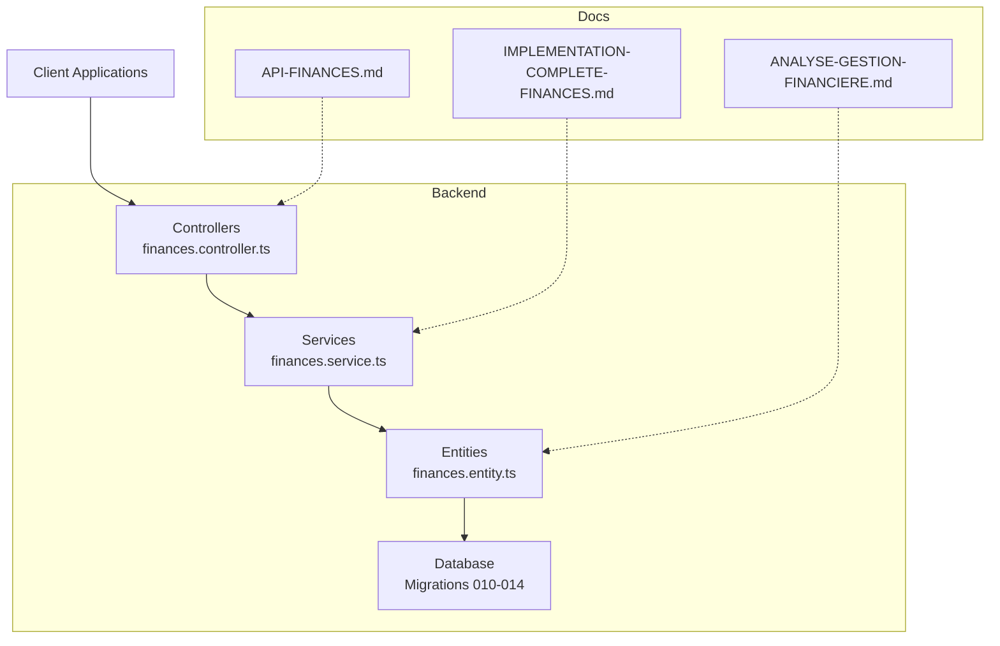
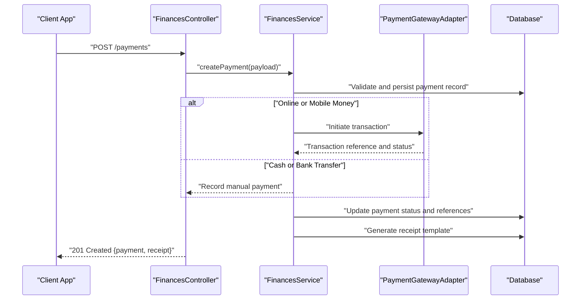
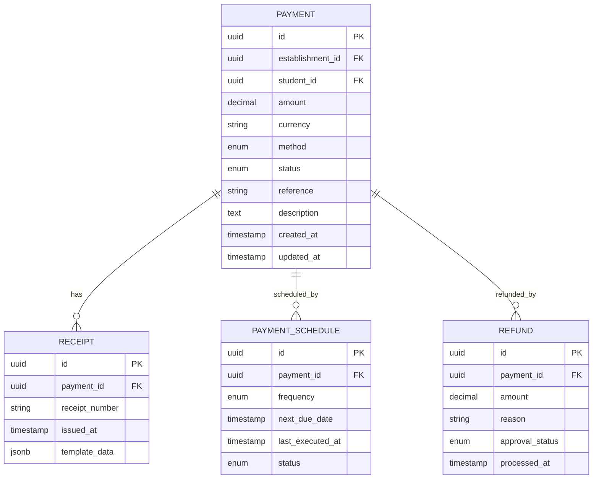
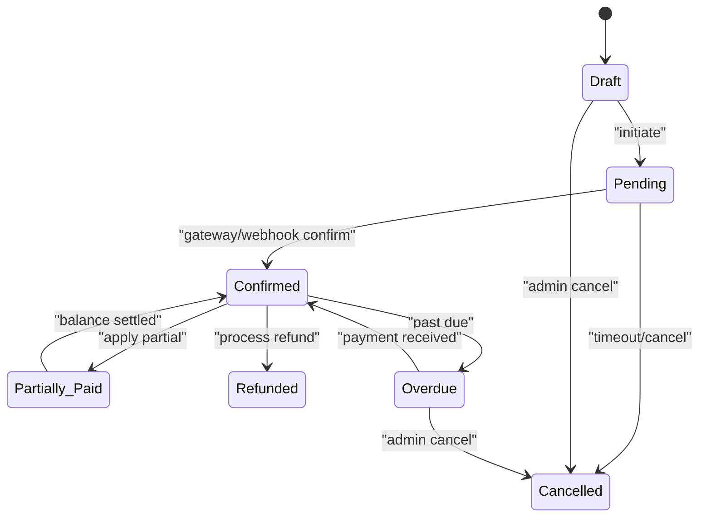
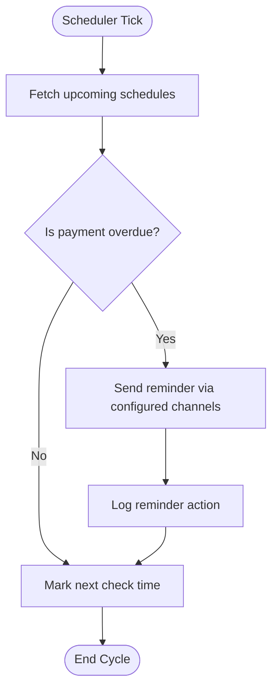
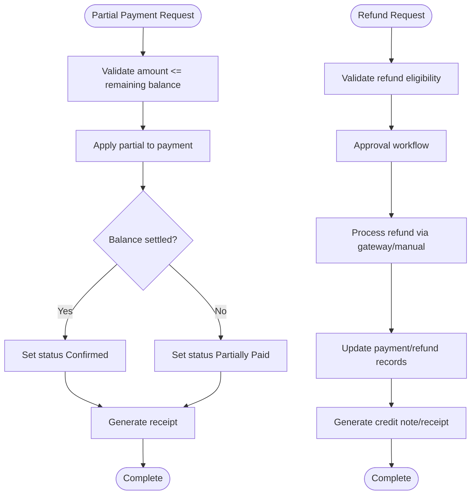
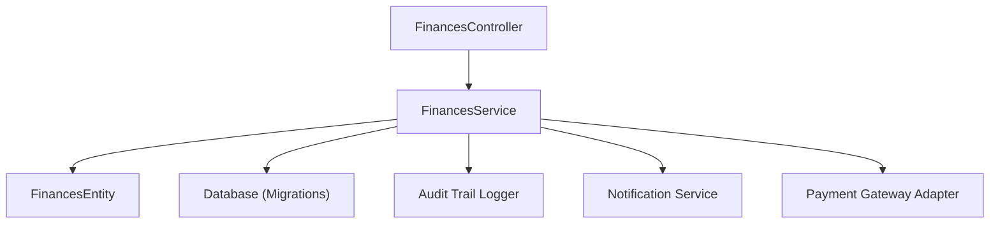

# Payment Processing API

<cite>
**Referenced Files in This Document**
- [API-FINANCES.md](file://docs/API-FINANCES.md)
- [IMPLEMENTATION-COMPLETE-FINANCES.md](file://docs/implementations/IMPLEMENTATION-COMPLETE-FINANCES.md)
- [ANALYSE-GESTION-FINANCIERE.md](file://docs/analyses/ANALYSE-GESTION-FINANCIERE.md)
- [010-module-finances.sql](file://backend/database/migrations/010-module-finances.sql)
- [011-module-finances-part2.sql](file://backend/database/migrations/011-module-finances-part2.sql)
- [012-module-finances-part3-parametres.sql](file://backend/database/migrations/012-module-finances-part3-parametres.sql)
- [013-module-finances-phase1-granularite.sql](file://backend/database/migrations/013-module-finances-phase1-granularite.sql)
- [014-module-finances-phase2-section.sql](file://backend/database/migrations/014-module-finances-phase2-section.sql)
- [finances.controller.ts](file://backend/src/modules/finances/controllers/finances.controller.ts)
- [finances.service.ts](file://backend/src/modules/finances/services/finances.service.ts)
- [finances.entity.ts](file://backend/src/modules/finances/entities/finances.entity.ts)
- [audit-trail.md](file://backend/docs/audit-trail.md)
</cite>

## Table of Contents
1. [Introduction](#introduction)
2. [Project Structure](#project-structure)
3. [Core Components](#core-components)
4. [Architecture Overview](#architecture-overview)
5. [Detailed Component Analysis](#detailed-component-analysis)
6. [Dependency Analysis](#dependency-analysis)
7. [Performance Considerations](#performance-considerations)
8. [Security and Compliance](#security-and-compliance)
9. [Troubleshooting Guide](#troubleshooting-guide)
10. [Conclusion](#conclusion)
11. [Appendices](#appendices)

## Introduction
This document provides comprehensive API documentation for payment processing endpoints within the finance module. It covers multiple payment methods (cash, bank transfer, mobile money, online payments), payment recording, receipt generation, tracking and reconciliation, automated reminders, scheduling, partial payments, refunds, and status management. It also includes request/response schemas, confirmation workflows, integration examples with external gateways, security considerations, audit trails, and compliance requirements.

## Project Structure
The payment processing functionality is implemented under the finances module with controllers, services, entities, and database migrations. Documentation and implementation summaries are available in the docs directory.

**Diagram sources**
- [finances.controller.ts](file://backend/src/modules/finances/controllers/finances.controller.ts)
- [finances.service.ts](file://backend/src/modules/finances/services/finances.service.ts)
- [finances.entity.ts](file://backend/src/modules/finances/entities/finances.entity.ts)
- [010-module-finances.sql](file://backend/database/migrations/010-module-finances.sql)
- [011-module-finances-part2.sql](file://backend/database/migrations/011-module-finances-part2.sql)
- [012-module-finances-part3-parametres.sql](file://backend/database/migrations/012-module-finances-part3-parametres.sql)
- [013-module-finances-phase1-granularite.sql](file://backend/database/migrations/013-module-finances-phase1-granularite.sql)
- [014-module-finances-phase2-section.sql](file://backend/database/migrations/014-module-finances-phase2-section.sql)
- [API-FINANCES.md](file://docs/API-FINANCES.md)
- [IMPLEMENTATION-COMPLETE-FINANCES.md](file://docs/implementations/IMPLEMENTATION-COMPLETE-FINANCES.md)
- [ANALYSE-GESTION-FINANCIERE.md](file://docs/analyses/ANALYSE-GESTION-FINANCIERE.md)

**Section sources**
- [API-FINANCES.md](file://docs/API-FINANCES.md)
- [IMPLEMENTATION-COMPLETE-FINANCES.md](file://docs/implementations/IMPLEMENTATION-COMPLETE-FINANCES.md)
- [ANALYSE-GESTION-FINANCIERE.md](file://docs/analyses/ANALYSE-GESTION-FINANCIERE.md)
- [010-module-finances.sql](file://backend/database/migrations/010-module-finances.sql)
- [011-module-finances-part2.sql](file://backend/database/migrations/011-module-finances-part2.sql)
- [012-module-finances-part3-parametres.sql](file://backend/database/migrations/012-module-finances-part3-parametres.sql)
- [013-module-finances-phase1-granularite.sql](file://backend/database/migrations/013-module-finances-phase1-granularite.sql)
- [014-module-finances-phase2-section.sql](file://backend/database/migrations/014-module-finances-phase2-section.sql)

## Core Components
- Controller: Exposes REST endpoints for payment operations including creation, listing, updates, confirmations, receipts, reminders, scheduling, partial payments, and refunds.
- Service: Implements business logic for payment recording, validation, reconciliation, reminders, scheduling, partial payments, and refund processing.
- Entity: Defines data models for payments, receipts, schedules, and related financial records.
- Migrations: Provide schema definitions for payment tables, statuses, references, and indexes.

Key responsibilities:
- Validate inputs and enforce multi-tenant scoping.
- Record payments with method-specific details.
- Generate receipts and manage templates.
- Track payment lifecycle and reconcile balances.
- Schedule recurring payments and send reminders.
- Process partial payments and refunds safely.

**Section sources**
- [finances.controller.ts](file://backend/src/modules/finances/controllers/finances.controller.ts)
- [finances.service.ts](file://backend/src/modules/finances/services/finances.service.ts)
- [finances.entity.ts](file://backend/src/modules/finances/entities/finances.entity.ts)
- [010-module-finances.sql](file://backend/database/migrations/010-module-finances.sql)
- [011-module-finances-part2.sql](file://backend/database/migrations/011-module-finances-part2.sql)
- [012-module-finances-part3-parametres.sql](file://backend/database/migrations/012-module-finances-part3-parametres.sql)
- [013-module-finances-phase1-granularite.sql](file://backend/database/migrations/013-module-finances-phase1-granularite.sql)
- [014-module-finances-phase2-section.sql](file://backend/database/migrations/014-module-finances-phase2-section.sql)

## Architecture Overview
The payment processing architecture follows a layered approach: controller handles HTTP requests, service orchestrates business rules, entity maps to database schema, and migrations define persistent structures. External integrations (e.g., payment gateways) are invoked via service-level adapters.

**Diagram sources**
- [finances.controller.ts](file://backend/src/modules/finances/controllers/finances.controller.ts)
- [finances.service.ts](file://backend/src/modules/finances/services/finances.service.ts)
- [010-module-finances.sql](file://backend/database/migrations/010-module-finances.sql)
- [011-module-finances-part2.sql](file://backend/database/migrations/011-module-finances-part2.sql)

## Detailed Component Analysis

### Payment Endpoints
Endpoints cover full payment lifecycle:
- Create payment: supports cash, bank transfer, mobile money, online payments.
- List/query payments: filters by student, period, status, method, date range.
- Update payment: adjust notes, references, or status transitions.
- Confirm payment: finalize transactions from external gateways.
- Generate receipt: render receipt using configured templates.
- Schedule payment: recurring or one-time scheduled payments.
- Partial payment: apply partial amounts against outstanding balances.
- Refund: process full or partial refunds with approvals.
- Reminders: trigger automated notifications for overdue payments.

Request/Response Schemas (high level):
- Payment create/update:
  - Fields: amount, currency, method, reference, description, dueDate, scheduleId, parentId/studentId, establishmentId, metadata.
  - Response: payment object with id, status, timestamps, links to receipt and schedule.
- Receipt:
  - Fields: receiptNumber, issuedAt, payerName, amountPaid, balanceRemaining, paymentMethod, establishmentInfo, templateVersion.
- Reminder:
  - Fields: recipientId, channel (email/SMS/in-app), messageTemplateId, scheduledAt, status.
- Schedule:
  - Fields: frequency, nextDueDate, lastExecutedAt, status, recurrenceRules.
- Refund:
  - Fields: originalPaymentId, amount, reason, approvalStatus, processedAt.

Integration Examples:
- Online payments: initiate transaction via gateway, capture webhook callbacks to confirm payment.
- Mobile money: generate USSD or API call, poll for confirmation, update status on callback.
- Bank transfer: record manual entries with proof-of-payment attachments; reconcile later.
- Cash: register at point of collection with receipt generation.

Confirmation Workflow:
- Client initiates payment -> Service validates -> Gateway processes -> Webhook confirms -> Service updates status -> Receipt generated -> Notification sent.

**Section sources**
- [finances.controller.ts](file://backend/src/modules/finances/controllers/finances.controller.ts)
- [finances.service.ts](file://backend/src/modules/finances/services/finances.service.ts)
- [API-FINANCES.md](file://docs/API-FINANCES.md)
- [IMPLEMENTATION-COMPLETE-FINANCES.md](file://docs/implementations/IMPLEMENTATION-COMPLETE-FINANCES.md)

### Data Models and Relationships
Core entities include payments, receipts, schedules, and related financial records. Migrations define fields, constraints, and indexes for performance.

**Diagram sources**
- [finances.entity.ts](file://backend/src/modules/finances/entities/finances.entity.ts)
- [010-module-finances.sql](file://backend/database/migrations/010-module-finances.sql)
- [011-module-finances-part2.sql](file://backend/database/migrations/011-module-finances-part2.sql)
- [012-module-finances-part3-parametres.sql](file://backend/database/migrations/012-module-finances-part3-parametres.sql)
- [013-module-finances-phase1-granularite.sql](file://backend/database/migrations/013-module-finances-phase1-granularite.sql)
- [014-module-finances-phase2-section.sql](file://backend/database/migrations/014-module-finances-phase2-section.sql)

### Payment Status Management
Statuses track lifecycle:
- Draft: created but not confirmed.
- Pending: awaiting external confirmation.
- Confirmed: validated and recorded.
- Partially Paid: partial amounts applied.
- Overdue: past due date without sufficient payment.
- Cancelled: voided by admin.
- Refunded: fully or partially refunded.

Transitions are enforced by service logic to ensure consistency and auditability.

**Diagram sources**
- [finances.service.ts](file://backend/src/modules/finances/services/finances.service.ts)
- [010-module-finances.sql](file://backend/database/migrations/010-module-finances.sql)

### Automated Reminders and Scheduling
Reminders are triggered based on schedule rules and overdue thresholds. Channels include email, SMS, and in-app notifications. Schedules support recurring patterns and can be paused or resumed.

**Diagram sources**
- [finances.service.ts](file://backend/src/modules/finances/services/finances.service.ts)
- [013-module-finances-phase1-granularite.sql](file://backend/database/migrations/013-module-finances-phase1-granularite.sql)

### Partial Payments and Refunds
Partial payments allow applying amounts incrementally until the balance is settled. Refunds require approval workflows and must preserve audit trails. Both operations update payment status and generate corresponding receipts or credit notes.

**Diagram sources**
- [finances.service.ts](file://backend/src/modules/finances/services/finances.service.ts)
- [014-module-finances-phase2-section.sql](file://backend/database/migrations/014-module-finances-phase2-section.sql)

## Dependency Analysis
The payment system depends on:
- Database schema defined by migrations.
- Audit trail logging for compliance.
- Notification services for reminders.
- External payment gateway adapters for online/mobile money.

**Diagram sources**
- [finances.controller.ts](file://backend/src/modules/finances/controllers/finances.controller.ts)
- [finances.service.ts](file://backend/src/modules/finances/services/finances.service.ts)
- [finances.entity.ts](file://backend/src/modules/finances/entities/finances.entity.ts)
- [audit-trail.md](file://backend/docs/audit-trail.md)
- [010-module-finances.sql](file://backend/database/migrations/010-module-finances.sql)

**Section sources**
- [finances.controller.ts](file://backend/src/modules/finances/controllers/finances.controller.ts)
- [finances.service.ts](file://backend/src/modules/finances/services/finances.service.ts)
- [finances.entity.ts](file://backend/src/modules/finances/entities/finances.entity.ts)
- [audit-trail.md](file://backend/docs/audit-trail.md)
- [010-module-finances.sql](file://backend/database/migrations/010-module-finances.sql)
- [011-module-finances-part2.sql](file://backend/database/migrations/011-module-finances-part2.sql)
- [012-module-finances-part3-parametres.sql](file://backend/database/migrations/012-module-finances-part3-parametres.sql)
- [013-module-finances-phase1-granularite.sql](file://backend/database/migrations/013-module-finances-phase1-granularite.sql)
- [014-module-finances-phase2-section.sql](file://backend/database/migrations/014-module-finances-phase2-section.sql)

## Performance Considerations
- Indexing: Ensure queries on establishmentId, studentId, status, and dates are optimized with appropriate indexes.
- Pagination: Use pagination for list endpoints to handle large datasets efficiently.
- Idempotency: Implement idempotent keys for payment creation and confirmation to prevent duplicates.
- Caching: Cache configuration and templates where appropriate to reduce DB load.
- Concurrency: Use transactions for partial payments and refunds to maintain consistency.

[No sources needed since this section provides general guidance]

## Security and Compliance
- Authentication and Authorization: Enforce role-based access control for payment operations.
- Multi-Tenant Isolation: Scope all queries to establishmentId to prevent cross-tenant data leakage.
- Input Validation: Validate amounts, currencies, and method-specific fields rigorously.
- Audit Trails: Log all payment actions with user context and timestamps for compliance.
- Data Protection: Encrypt sensitive fields and secure transmission via HTTPS.
- Compliance: Align with local regulations for financial records and receipts.

**Section sources**
- [audit-trail.md](file://backend/docs/audit-trail.md)
- [010-module-finances.sql](file://backend/database/migrations/010-module-finances.sql)
- [011-module-finances-part2.sql](file://backend/database/migrations/011-module-finances-part2.sql)
- [012-module-finances-part3-parametres.sql](file://backend/database/migrations/012-module-finances-part3-parametres.sql)
- [013-module-finances-phase1-granularite.sql](file://backend/database/migrations/013-module-finances-phase1-granularite.sql)
- [014-module-finances-phase2-section.sql](file://backend/database/migrations/014-module-finances-phase2-section.sql)

## Troubleshooting Guide
Common issues and resolutions:
- Payment not confirmed: Verify gateway webhook delivery and retry mechanisms.
- Duplicate payments: Check idempotency keys and unique constraints.
- Overdue reminders not sent: Inspect scheduler logs and notification channels.
- Partial payment errors: Validate remaining balance calculations and concurrency locks.
- Refund failures: Review approval workflow states and gateway error codes.

Operational checks:
- Monitor payment status transitions and error rates.
- Validate receipt template rendering and versioning.
- Ensure audit logs capture all critical actions.

**Section sources**
- [finances.service.ts](file://backend/src/modules/finances/services/finances.service.ts)
- [audit-trail.md](file://backend/docs/audit-trail.md)

## Conclusion
The payment processing API provides robust capabilities for managing diverse payment methods, ensuring accurate recording, receipt generation, tracking, reconciliation, reminders, scheduling, partial payments, and refunds. With strong security, audit trails, and compliance measures, it supports reliable financial operations across multiple establishments.

[No sources needed since this section summarizes without analyzing specific files]

## Appendices

### API Endpoint Reference Summary
- POST /payments: Create payment
- GET /payments: List/query payments
- PUT /payments/:id: Update payment
- POST /payments/:id/confirm: Confirm payment
- GET /receipts/:paymentId: Generate receipt
- POST /schedules: Create payment schedule
- POST /payments/:id/partial: Apply partial payment
- POST /payments/:id/refund: Process refund
- POST /reminders: Trigger reminder

For detailed request/response schemas and examples, refer to:
- [API-FINANCES.md](file://docs/API-FINANCES.md)
- [IMPLEMENTATION-COMPLETE-FINANCES.md](file://docs/implementations/IMPLEMENTATION-COMPLETE-FINANCES.md)

**Section sources**
- [API-FINANCES.md](file://docs/API-FINANCES.md)
- [IMPLEMENTATION-COMPLETE-FINANCES.md](file://docs/implementations/IMPLEMENTATION-COMPLETE-FINANCES.md)