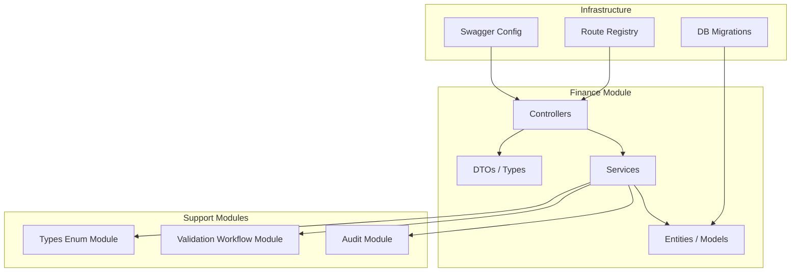
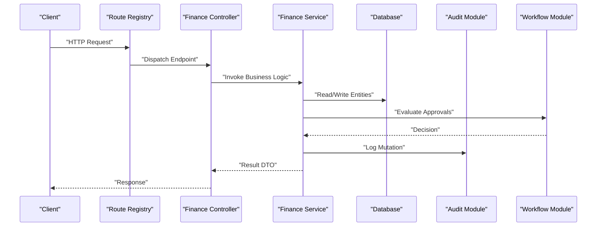
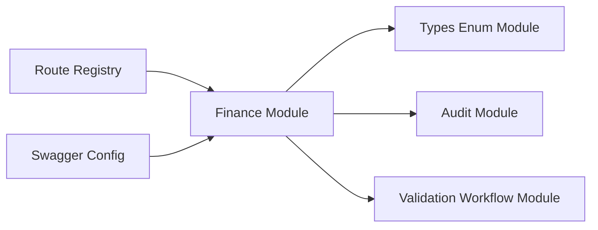

# Transaction Management API

<cite>
**Referenced Files in This Document**
- [backend/src/modules/finances](file://backend/src/modules/finances)
- [backend/database/migrations/010-module-finances.sql](file://backend/database/migrations/010-module-finances.sql)
- [backend/database/migrations/011-module-finances-part2.sql](file://backend/database/migrations/011-module-finances-part2.sql)
- [backend/database/migrations/012-module-finances-part3-parametres.sql](file://backend/database/migrations/012-module-finances-part3-parametres.sql)
- [backend/database/migrations/013-module-finances-phase1-granularite.sql](file://backend/database/migrations/013-module-finances-phase1-granularite.sql)
- [backend/database/migrations/014-module-finances-phase2-section.sql](file://backend/database/migrations/014-module-finances-phase2-section.sql)
- [backend/docs/audit-trail.md](file://backend/docs/audit-trail.md)
- [backend/src/modules/audit](file://backend/src/modules/audit)
- [backend/src/modules/validation-workflow](file://backend/src/modules/validation-workflow)
- [backend/src/modules/types-enum](file://backend/src/modules/types-enum)
- [backend/src/config/swagger.config.ts](file://backend/src/config/swagger.config.ts)
- [backend/src/routes/route-registry.ts](file://backend/src/routes/route-registry.ts)
</cite>

## Table of Contents
1. [Introduction](#introduction)
2. [Project Structure](#project-structure)
3. [Core Components](#core-components)
4. [Architecture Overview](#architecture-overview)
5. [Detailed Component Analysis](#detailed-component-analysis)
6. [Dependency Analysis](#dependency-analysis)
7. [Performance Considerations](#performance-considerations)
8. [Troubleshooting Guide](#troubleshooting-guide)
9. [Conclusion](#conclusion)
10. [Appendices](#appendices)

## Introduction
This document provides comprehensive API documentation for transaction management and financial operations within the system. It covers expense tracking, payment schedule management (echeanciers), transaction auditing, and financial workflow automation. The scope includes transaction categorization, approval workflows, multi-currency support, financial calendar management, batch processing, recurring payments, automatic late fee calculation, and financial alerts. It also defines detailed schemas for transaction records, approval chains, audit logs, and integration examples with banking systems. Finally, it addresses transaction rollback mechanisms, error handling, and financial data integrity.

## Project Structure
The finance module is implemented under backend/src/modules/finances and backed by a series of database migrations that define core entities such as transactions, categories, schedules, approvals, and configuration parameters. Audit logging and validation workflows are provided by dedicated modules. Swagger configuration and route registration expose the APIs to clients.

**Diagram sources**
- [backend/src/modules/finances](file://backend/src/modules/finances)
- [backend/src/modules/audit](file://backend/src/modules/audit)
- [backend/src/modules/validation-workflow](file://backend/src/modules/validation-workflow)
- [backend/src/modules/types-enum](file://backend/src/modules/types-enum)
- [backend/src/config/swagger.config.ts](file://backend/src/config/swagger.config.ts)
- [backend/src/routes/route-registry.ts](file://backend/src/routes/route-registry.ts)
- [backend/database/migrations/010-module-finances.sql](file://backend/database/migrations/010-module-finances.sql)

**Section sources**
- [backend/src/modules/finances](file://backend/src/modules/finances)
- [backend/src/config/swagger.config.ts](file://backend/src/config/swagger.config.ts)
- [backend/src/routes/route-registry.ts](file://backend/src/routes/route-registry.ts)

## Core Components
- Expense Tracking: Create, update, list, and archive expenses; associate with students, classes, or sections; attach receipts and notes.
- Payment Schedules (Echeanciers): Generate installment plans per enrollment or service; manage due dates, partial payments, and status transitions.
- Transaction Records: Central ledger entries capturing type, amount, currency, category, references, and state.
- Approval Workflows: Multi-step approvals for high-value or policy-bound transactions; configurable chains and delegation.
- Auditing: Immutable audit trail for all financial mutations with actor context and change summaries.
- Configuration: Financial parameters including currencies, late fees, thresholds, calendars, and section rules.
- Batch Processing: Bulk creation and updates for schedules and transactions with idempotency keys.
- Recurring Payments: Automated generation of future installments based on templates and calendars.
- Late Fee Calculation: Automatic computation based on configured rules and financial calendar.
- Alerts: Notifications for overdue items, approvals required, and anomalies.

**Section sources**
- [backend/database/migrations/010-module-finances.sql](file://backend/database/migrations/010-module-finances.sql)
- [backend/database/migrations/011-module-finances-part2.sql](file://backend/database/migrations/011-module-finances-part2.sql)
- [backend/database/migrations/012-module-finances-part3-parametres.sql](file://backend/database/migrations/012-module-finances-part3-parametres.sql)
- [backend/database/migrations/013-module-finances-phase1-granularite.sql](file://backend/database/migrations/013-module-finances-phase1-granularite.sql)
- [backend/database/migrations/014-module-finances-phase2-section.sql](file://backend/database/migrations/014-module-finances-phase2-section.sql)

## Architecture Overview
The finance subsystem follows a layered architecture: controllers handle HTTP requests, services implement business logic, and entities map to database tables. Audit and workflow modules provide cross-cutting concerns. Swagger documents the API surface, while route registry wires endpoints.

**Diagram sources**
- [backend/src/routes/route-registry.ts](file://backend/src/routes/route-registry.ts)
- [backend/src/modules/finances](file://backend/src/modules/finances)
- [backend/src/modules/audit](file://backend/src/modules/audit)
- [backend/src/modules/validation-workflow](file://backend/src/modules/validation-workflow)

## Detailed Component Analysis

### Transaction Ledger API
Purpose: Manage financial transactions across categories, currencies, and contexts.

Key capabilities:
- Create transaction with idempotency key
- Update and void transactions
- List with filters (date range, category, currency, status)
- Attach supporting documents and references
- Compute running balances per entity and period

Request/Response schema highlights:
- Idempotency-Key: string header for safe retries
- Amount: decimal with precision
- Currency: ISO code
- CategoryId: reference to category
- EntityRef: polymorphic reference (student/class/section)
- Status: enum values (draft, pending, approved, posted, voided)
- Metadata: optional JSON for integrations

Example endpoint paths:
- POST /api/finances/transactions
- PATCH /api/finances/transactions/{id}
- DELETE /api/finances/transactions/{id}/void
- GET /api/finances/transactions

Error handling:
- Validation errors return structured messages
- Duplicate idempotency key returns existing transaction
- Insufficient permissions return authorization error

Integration example:
- Banking webhook posts payment confirmation; controller validates signature, maps to transaction, and triggers posting workflow.

**Section sources**
- [backend/database/migrations/010-module-finances.sql](file://backend/database/migrations/010-module-finances.sql)
- [backend/database/migrations/011-module-finances-part2.sql](file://backend/database/migrations/011-module-finances-part2.sql)
- [backend/src/modules/finances](file://backend/src/modules/finances)

### Expense Tracking API
Purpose: Record and manage school-related expenses with categorization and approvals.

Capabilities:
- Create expense with vendor, description, amount, currency, category
- Link expense to budget line or project
- Upload receipts and notes
- Route through approval workflow if threshold exceeded
- Post to ledger upon approval

Schema highlights:
- VendorId, CategoryId, BudgetLineId
- Amount, Currency, TaxAmount
- Status: draft, submitted, approved, rejected, posted
- ApprovalChainId for complex flows

Batch operations:
- POST /api/finances/expenses/batch with array of expenses and idempotency keys

**Section sources**
- [backend/database/migrations/010-module-finances.sql](file://backend/database/migrations/010-module-finances.sql)
- [backend/database/migrations/013-module-finances-phase1-granularite.sql](file://backend/database/migrations/013-module-finances-phase1-granularite.sql)
- [backend/src/modules/finances](file://backend/src/modules/finances)

### Payment Schedule (Echeancier) Management API
Purpose: Generate and manage installment plans for tuition or services.

Capabilities:
- Create schedule from template or manual definition
- Define due dates aligned with financial calendar
- Support partial payments and overpayments
- Auto-generate next installments via recurring job
- Calculate late fees automatically when due date passes

Schema highlights:
- TemplateId, EnrollmentId, SectionId
- Installments: array of {dueDate, amount, currency, status}
- Status: active, paid, overdue, cancelled
- LateFeeRules: referenced configuration

Recurring payments:
- Scheduled job reads upcoming due dates and creates payment reminders and late fees according to rules.

**Section sources**
- [backend/database/migrations/011-module-finances-part2.sql](file://backend/database/migrations/011-module-finances-part2.sql)
- [backend/database/migrations/012-module-finances-part3-parametres.sql](file://backend/database/migrations/012-module-finances-part3-parametres.sql)
- [backend/database/migrations/014-module-finances-phase2-section.sql](file://backend/database/migrations/014-module-finances-phase2-section.sql)
- [backend/src/modules/finances](file://backend/src/modules/finances)

### Approval Workflow Integration
Purpose: Enforce multi-step approvals for sensitive financial actions.

Flow:
- Submit transaction or expense
- Evaluate policy rules (amount, category, entity)
- Build approval chain (roles, delegates)
- Collect approvals and record decisions
- Transition to approved or rejected states

API touchpoints:
- POST /api/finances/approvals/initiate
- POST /api/finances/approvals/{id}/decide
- GET /api/finances/approvals/{id}/status

Audit linkage:
- Each decision recorded with actor, timestamp, and comment.

**Section sources**
- [backend/src/modules/validation-workflow](file://backend/src/modules/validation-workflow)
- [backend/src/modules/audit](file://backend/src/modules/audit)
- [backend/src/modules/finances](file://backend/src/modules/finances)

### Audit Trail API
Purpose: Provide immutable logs for all financial changes.

Capabilities:
- Query audit events by entity type and id
- Filter by actor, date range, action type
- Retrieve before/after snapshots where applicable

Endpoints:
- GET /api/audit/events?entityType=transaction&entityId={id}
- GET /api/audit/events?actorId={id}&from={iso}&to={iso}

**Section sources**
- [backend/docs/audit-trail.md](file://backend/docs/audit-trail.md)
- [backend/src/modules/audit](file://backend/src/modules/audit)

### Configuration and Parameters API
Purpose: Manage financial settings such as currencies, late fee rules, thresholds, and calendars.

Settings include:
- Currencies and exchange rates
- Late fee percentage and grace period
- Approval thresholds by category
- Financial calendar holidays and working days
- Section-specific billing rules

Endpoints:
- GET /api/finances/config/currencies
- PUT /api/finances/config/late-fees
- GET /api/finances/config/calendar

**Section sources**
- [backend/database/migrations/012-module-finances-part3-parametres.sql](file://backend/database/migrations/012-module-finances-part3-parametres.sql)
- [backend/src/modules/finances](file://backend/src/modules/finances)

### Batch Transaction Processing API
Purpose: Efficiently process large sets of financial operations with idempotency and partial failure handling.

Features:
- Batch create/update transactions and schedules
- Per-item idempotency keys
- Aggregate result with success/failure details
- Atomicity at batch level with compensating actions on failure

Endpoints:
- POST /api/finances/batch/transactions
- POST /api/finances/batch/schedules

**Section sources**
- [backend/src/modules/finances](file://backend/src/modules/finances)

### Recurring Payments and Calendar Management
Purpose: Automate future installments and align due dates with institutional calendars.

Capabilities:
- Define recurrence patterns (monthly, quarterly, term-based)
- Respect financial calendar exclusions
- Generate drafts and convert to active schedules
- Send reminders and trigger late fee calculations

Endpoints:
- POST /api/finances/recurring/templates
- POST /api/finances/recurring/generate
- GET /api/finances/calendar/holidays

**Section sources**
- [backend/database/migrations/012-module-finances-part3-parametres.sql](file://backend/database/migrations/012-module-finances-part3-parametres.sql)
- [backend/src/modules/finances](file://backend/src/modules/finances)

### Financial Alerts and Notifications
Purpose: Notify stakeholders about critical financial events.

Triggers:
- Overdue installments
- Approval required
- Anomalies detected (duplicate payments, negative balances)
- Threshold breaches

Channels:
- In-app notifications
- Email/SMS providers (configurable)

Endpoints:
- GET /api/notifications?scope=finance
- POST /api/finances/alerts/test

**Section sources**
- [backend/src/modules/notifications](file://backend/src/modules/notifications)
- [backend/src/modules/finances](file://backend/src/modules/finances)

### Data Integrity and Rollback Mechanisms
Principles:
- Use database transactions for multi-step writes
- Idempotency keys prevent duplicate effects
- Compensating actions reverse partial successes
- Audit trail captures pre/post states for reversibility

Operational guidance:
- On failure, log reason and revert intermediate changes
- Expose retry endpoints with same idempotency key
- Ensure eventual consistency for external integrations

**Section sources**
- [backend/src/modules/finances](file://backend/src/modules/finances)
- [backend/src/modules/audit](file://backend/src/modules/audit)

## Dependency Analysis
The finance module depends on shared enums, audit logging, and workflow validation. Swagger and route registry expose endpoints consistently.

**Diagram sources**
- [backend/src/modules/finances](file://backend/src/modules/finances)
- [backend/src/modules/types-enum](file://backend/src/modules/types-enum)
- [backend/src/modules/audit](file://backend/src/modules/audit)
- [backend/src/modules/validation-workflow](file://backend/src/modules/validation-workflow)
- [backend/src/config/swagger.config.ts](file://backend/src/config/swagger.config.ts)
- [backend/src/routes/route-registry.ts](file://backend/src/routes/route-registry.ts)

**Section sources**
- [backend/src/modules/finances](file://backend/src/modules/finances)
- [backend/src/modules/types-enum](file://backend/src/modules/types-enum)
- [backend/src/modules/audit](file://backend/src/modules/audit)
- [backend/src/modules/validation-workflow](file://backend/src/modules/validation-workflow)
- [backend/src/config/swagger.config.ts](file://backend/src/config/swagger.config.ts)
- [backend/src/routes/route-registry.ts](file://backend/src/routes/route-registry.ts)

## Performance Considerations
- Indexing: Ensure composite indexes on frequently filtered fields (entityId, status, createdAt).
- Pagination: Use cursor-based pagination for large lists.
- Batching: Prefer batch endpoints for bulk operations.
- Caching: Cache read-heavy configuration and calendar data.
- Transactions: Keep database transactions short; offload heavy computations to background jobs.
- Concurrency: Use optimistic locking or version fields to avoid write conflicts.

[No sources needed since this section provides general guidance]

## Troubleshooting Guide
Common issues and resolutions:
- Duplicate payment: Check idempotency key usage and deduplication logic.
- Approval stuck: Verify workflow rules and delegate assignments.
- Late fee not applied: Confirm calendar configuration and scheduled job execution.
- Balance mismatch: Review audit trail snapshots and transaction postings.
- Permission denied: Validate RBAC permissions and role assignments.

Diagnostic steps:
- Query audit events for the affected entity.
- Inspect workflow decisions and comments.
- Re-run reconciliation reports comparing ledger vs. schedules.

**Section sources**
- [backend/docs/audit-trail.md](file://backend/docs/audit-trail.md)
- [backend/src/modules/audit](file://backend/src/modules/audit)
- [backend/src/modules/validation-workflow](file://backend/src/modules/validation-workflow)

## Conclusion
The Transaction Management API provides a robust foundation for financial operations in an educational institution context. With strong auditability, flexible approval workflows, and comprehensive configuration, it supports accurate accounting, compliance, and automation. Adhering to idempotency, transactional integrity, and performance best practices ensures reliable and scalable financial processing.

[No sources needed since this section summarizes without analyzing specific files]

## Appendices

### API Endpoints Summary
- Transactions
  - POST /api/finances/transactions
  - PATCH /api/finances/transactions/{id}
  - DELETE /api/finances/transactions/{id}/void
  - GET /api/finances/transactions
- Expenses
  - POST /api/finances/expenses
  - POST /api/finances/expenses/batch
- Schedules (Echeanciers)
  - POST /api/finances/schedules
  - POST /api/finances/schedules/batch
  - GET /api/finances/schedules/{id}
- Approvals
  - POST /api/finances/approvals/initiate
  - POST /api/finances/approvals/{id}/decide
  - GET /api/finances/approvals/{id}/status
- Audit
  - GET /api/audit/events
- Configuration
  - GET /api/finances/config/currencies
  - PUT /api/finances/config/late-fees
  - GET /api/finances/config/calendar
- Recurring
  - POST /api/finances/recurring/templates
  - POST /api/finances/recurring/generate
- Alerts
  - GET /api/notifications?scope=finance
  - POST /api/finances/alerts/test

**Section sources**
- [backend/src/config/swagger.config.ts](file://backend/src/config/swagger.config.ts)
- [backend/src/routes/route-registry.ts](file://backend/src/routes/route-registry.ts)

### Database Schema Overview
Core entities defined by migrations:
- Transactions: id, type, amount, currency, categoryId, entityId, entityType, status, metadata, createdAt, updatedAt
- Categories: id, name, code, isActive
- Schedules: id, templateId, enrollmentId, sectionId, status, totalAmount, currency
- Installments: id, scheduleId, dueDate, amount, currency, status, paidAt
- Approvals: id, entityType, entityId, chainId, status, decisions
- AuditEvents: id, entityType, entityId, action, actorId, payload, createdAt
- ConfigParams: key, value, valueType, tenantId, updatedAt

**Section sources**
- [backend/database/migrations/010-module-finances.sql](file://backend/database/migrations/010-module-finances.sql)
- [backend/database/migrations/011-module-finances-part2.sql](file://backend/database/migrations/011-module-finances-part2.sql)
- [backend/database/migrations/012-module-finances-part3-parametres.sql](file://backend/database/migrations/012-module-finances-part3-parametres.sql)
- [backend/database/migrations/013-module-finances-phase1-granularite.sql](file://backend/database/migrations/013-module-finances-phase1-granularite.sql)
- [backend/database/migrations/014-module-finances-phase2-section.sql](file://backend/database/migrations/014-module-finances-phase2-section.sql)

### Error Handling and Status Codes
- 200 OK: Successful operation
- 201 Created: Resource created
- 400 Bad Request: Validation error
- 401 Unauthorized: Authentication failed
- 403 Forbidden: Insufficient permissions
- 409 Conflict: Duplicate idempotency key or conflicting state
- 422 Unprocessable Entity: Business rule violation
- 500 Internal Server Error: Unexpected server error

Responses include structured error objects with message, code, and field-level details where applicable.

**Section sources**
- [backend/src/modules/finances](file://backend/src/modules/finances)

### Integration Examples with Banking Systems
- Webhook ingestion: Bank sends payment confirmation; system validates signature, maps to transaction, and triggers posting workflow.
- Export for reconciliation: Periodic export of posted transactions and schedule statuses for bank statement matching.
- Retry strategy: Failed webhooks retried with exponential backoff; idempotency prevents duplicates.

**Section sources**
- [backend/src/modules/finances](file://backend/src/modules/finances)
- [backend/src/modules/audit](file://backend/src/modules/audit)