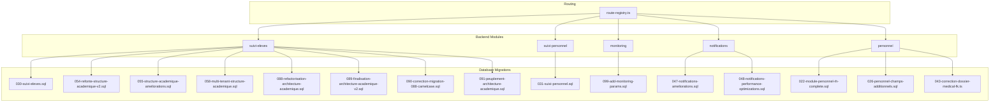
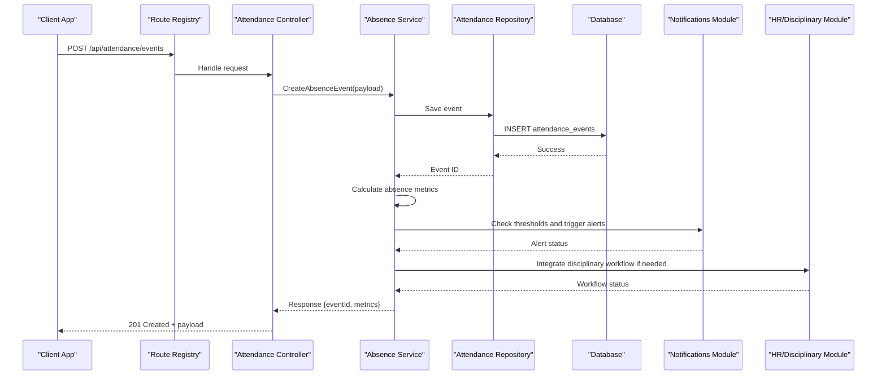
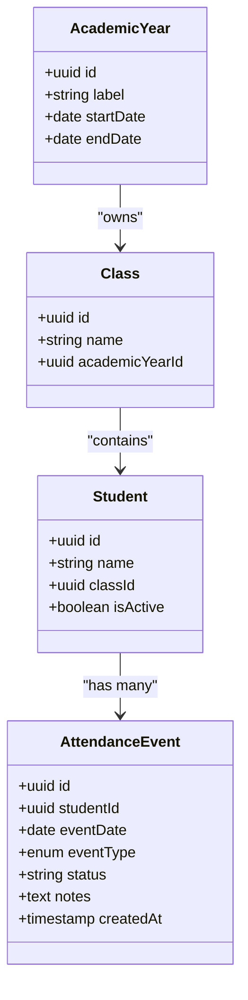
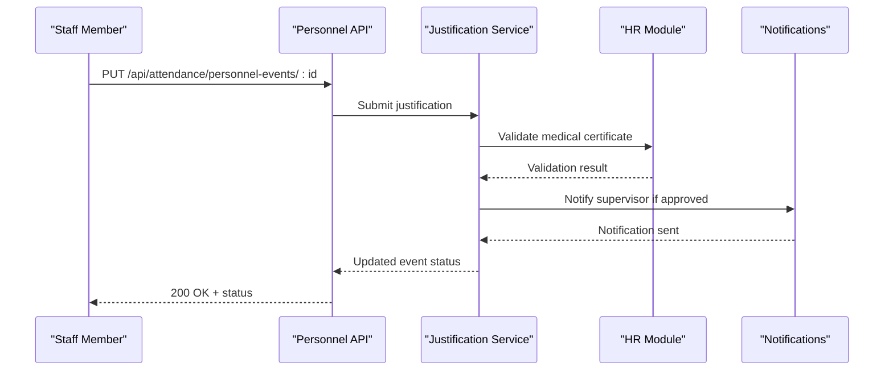
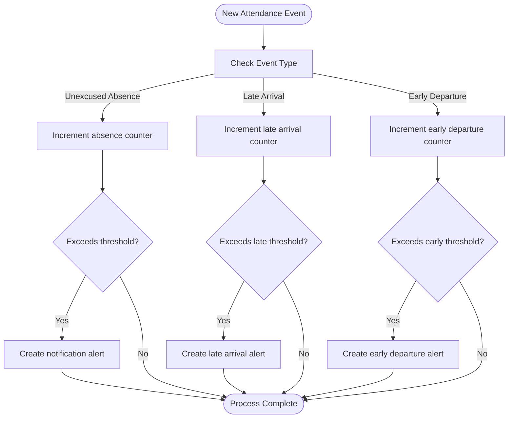
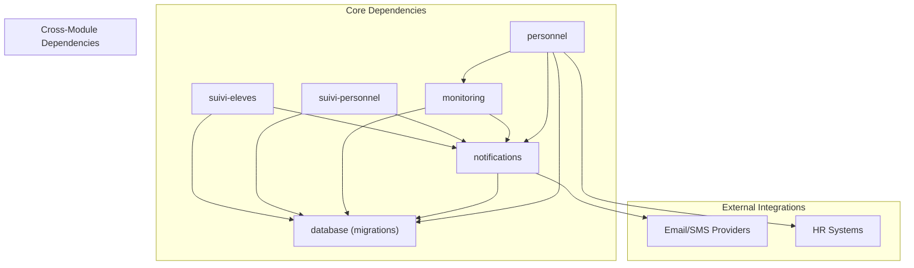

# Absence Monitoring API

<cite>
**Referenced Files in This Document**
- [backend/src/modules/suivi-eleves/](file://backend/src/modules/suivi-eleves/)
- [backend/src/modules/suivi-personnel/](file://backend/src/modules/suivi-personnel/)
- [backend/src/modules/monitoring/](file://backend/src/modules/monitoring/)
- [backend/src/modules/notifications/](file://backend/src/modules/notifications/)
- [backend/src/modules/personnel/](file://backend/src/modules/personnel/)
- [backend/src/routes/route-registry.ts](file://backend/src/routes/route-registry.ts)
- [backend/database/migrations/031-suivi-personnel.sql](file://backend/database/migrations/031-suivi-personnel.sql)
- [backend/database/migrations/030-suivi-eleves.sql](file://backend/database/migrations/030-suivi-eleves.sql)
- [backend/database/migrations/099-add-monitoring-params.sql](file://backend/database/migrations/099-add-monitoring-params.sql)
- [backend/database/migrations/047-notifications-ameliorations.sql](file://backend/database/migrations/047-notifications-ameliorations.sql)
- [backend/database/migrations/048-notifications-performance-optimizations.sql](file://backend/database/migrations/048-notifications-performance-optimizations.sql)
- [backend/database/migrations/022-module-personnel-rh-complete.sql](file://backend/database/migrations/022-module-personnel-rh-complete.sql)
- [backend/database/migrations/026-personnel-champs-additionnels.sql](file://backend/database/migrations/026-personnel-champs-additionnels.sql)
- [backend/database/migrations/043-correction-dossier-medical-fk.ts](file://backend/database/migrations/043-correction-dossier-medical-fk.ts)
- [backend/database/migrations/054-refonte-structure-academique-v2.sql](file://backend/database/migrations/054-refonte-structure-academique-v2.sql)
- [backend/database/migrations/055-structure-academique-ameliorations.sql](file://backend/database/migrations/055-structure-academique-ameliorations.sql)
- [backend/database/migrations/058-multi-tenant-structure-academique.sql](file://backend/database/migrations/058-multi-tenant-structure-academique.sql)
- [backend/database/migrations/088-refactorisation-architecture-academique.sql](file://backend/database/migrations/088-refactorisation-architecture-academique.sql)
- [backend/database/migrations/089-finalisation-architecture-academique-v2.sql](file://backend/database/migrations/089-finalisation-architecture-academique-v2.sql)
- [backend/database/migrations/090-correction-migration-088-camelcase.sql](file://backend/database/migrations/090-correction-migration-088-camelcase.sql)
- [backend/database/migrations/091-peuplement-architecture-academique.sql](file://backend/database/migrations/091-peuplement-architecture-academique.sql)
</cite>

## Table of Contents
1. [Introduction](#introduction)
2. [Project Structure](#project-structure)
3. [Core Components](#core-components)
4. [Architecture Overview](#architecture-overview)
5. [Detailed Component Analysis](#detailed-component-analysis)
6. [Dependency Analysis](#dependency-analysis)
7. [Performance Considerations](#performance-considerations)
8. [Troubleshooting Guide](#troubleshooting-guide)
9. [Conclusion](#conclusion)
10. [Appendices](#appendices)

## Introduction
This document provides detailed API documentation for eLISAschool’s absence monitoring capabilities. It covers absenteeism tracking for students and personnel, including unexcused absences, late arrivals, early departures, absence pattern analysis, automated alerts, reporting dashboards, integration with HR disciplinary processes, justification workflows, medical certificate validation, and analytics for workforce planning. The content is derived from the repository’s modules, migrations, and routing configuration to ensure accuracy and traceability.

## Project Structure
The absence monitoring functionality spans multiple modules:
- Student attendance tracking (suivi-eleves)
- Personnel attendance tracking (suivi-personnel)
- Monitoring parameters and thresholds (monitoring)
- Notifications and alerting (notifications)
- HR and disciplinary processes (personnel)
- Route registration for API endpoints (routes)

**Diagram sources**
- [backend/src/modules/suivi-eleves/](file://backend/src/modules/suivi-eleves/)
- [backend/src/modules/suivi-personnel/](file://backend/src/modules/suivi-personnel/)
- [backend/src/modules/monitoring/](file://backend/src/modules/monitoring/)
- [backend/src/modules/notifications/](file://backend/src/modules/notifications/)
- [backend/src/modules/personnel/](file://backend/src/modules/personnel/)
- [backend/src/routes/route-registry.ts](file://backend/src/routes/route-registry.ts)
- [backend/database/migrations/030-suivi-eleves.sql](file://backend/database/migrations/030-suivi-eleves.sql)
- [backend/database/migrations/031-suivi-personnel.sql](file://backend/database/migrations/031-suivi-personnel.sql)
- [backend/database/migrations/099-add-monitoring-params.sql](file://backend/database/migrations/099-add-monitoring-params.sql)
- [backend/database/migrations/047-notifications-ameliorations.sql](file://backend/database/migrations/047-notifications-ameliorations.sql)
- [backend/database/migrations/048-notifications-performance-optimizations.sql](file://backend/database/migrations/048-notifications-performance-optimizations.sql)
- [backend/database/migrations/022-module-personnel-rh-complete.sql](file://backend/database/migrations/022-module-personnel-rh-complete.sql)
- [backend/database/migrations/026-personnel-champs-additionnels.sql](file://backend/database/migrations/026-personnel-champs-additionnels.sql)
- [backend/database/migrations/043-correction-dossier-medical-fk.ts](file://backend/database/migrations/043-correction-dossier-medical-fk.ts)
- [backend/database/migrations/054-refonte-structure-academique-v2.sql](file://backend/database/migrations/054-refonte-structure-academique-v2.sql)
- [backend/database/migrations/055-structure-academique-ameliorations.sql](file://backend/database/migrations/055-structure-academique-ameliorations.sql)
- [backend/database/migrations/058-multi-tenant-structure-academique.sql](file://backend/database/migrations/058-multi-tenant-structure-academique.sql)
- [backend/database/migrations/088-refactorisation-architecture-academique.sql](file://backend/database/migrations/088-refactorisation-architecture-academique.sql)
- [backend/database/migrations/089-finalisation-architecture-academique-v2.sql](file://backend/database/migrations/089-finalisation-architecture-academique-v2.sql)
- [backend/database/migrations/090-correction-migration-088-camelcase.sql](file://backend/database/migrations/090-correction-migration-088-camelcase.sql)
- [backend/database/migrations/091-peuplement-architecture-academique.sql](file://backend/database/migrations/091-peuplement-architecture-academique.sql)

**Section sources**
- [backend/src/modules/suivi-eleves/](file://backend/src/modules/suivi-eleves/)
- [backend/src/modules/suivi-personnel/](file://backend/src/modules/suivi-personnel/)
- [backend/src/modules/monitoring/](file://backend/src/modules/monitoring/)
- [backend/src/modules/notifications/](file://backend/src/modules/notifications/)
- [backend/src/modules/personnel/](file://backend/src/modules/personnel/)
- [backend/src/routes/route-registry.ts](file://backend/src/routes/route-registry.ts)
- [backend/database/migrations/030-suivi-eleves.sql](file://backend/database/migrations/030-suivi-eleves.sql)
- [backend/database/migrations/031-suivi-personnel.sql](file://backend/database/migrations/031-suivi-personnel.sql)
- [backend/database/migrations/099-add-monitoring-params.sql](file://backend/database/migrations/099-add-monitoring-params.sql)
- [backend/database/migrations/047-notifications-ameliorations.sql](file://backend/database/migrations/047-notifications-ameliorations.sql)
- [backend/database/migrations/048-notifications-performance-optimizations.sql](file://backend/database/migrations/048-notifications-performance-optimizations.sql)
- [backend/database/migrations/022-module-personnel-rh-complete.sql](file://backend/database/migrations/022-module-personnel-rh-complete.sql)
- [backend/database/migrations/026-personnel-champs-additionnels.sql](file://backend/database/migrations/026-personnel-champs-additionnels.sql)
- [backend/database/migrations/043-correction-dossier-medical-fk.ts](file://backend/database/migrations/043-correction-dossier-medical-fk.ts)
- [backend/database/migrations/054-refonte-structure-academique-v2.sql](file://backend/database/migrations/054-refonte-structure-academique-v2.sql)
- [backend/database/migrations/055-structure-academique-ameliorations.sql](file://backend/database/migrations/055-structure-academique-ameliorations.sql)
- [backend/database/migrations/058-multi-tenant-structure-academique.sql](file://backend/database/migrations/058-multi-tenant-structure-academique.sql)
- [backend/database/migrations/088-refactorisation-architecture-academique.sql](file://backend/database/migrations/088-refactorisation-architecture-academique.sql)
- [backend/database/migrations/089-finalisation-architecture-academique-v2.sql](file://backend/database/migrations/089-finalisation-architecture-academique-v2.sql)
- [backend/database/migrations/090-correction-migration-088-camelcase.sql](file://backend/database/migrations/090-correction-migration-088-camelcase.sql)
- [backend/database/migrations/091-peuplement-architecture-academique.sql](file://backend/database/migrations/091-peuplement-architecture-academique.sql)

## Core Components
- Student Attendance Tracking (suivi-eleves): Records daily attendance events for students, supports classification of absences (excused/unexcused), late arrivals, and early departures. Provides APIs to create, query, and analyze attendance records.
- Personnel Attendance Tracking (suivi-personnel): Similar to student tracking but tailored for staff, integrates with HR processes and disciplinary workflows.
- Monitoring Parameters (monitoring): Configurable thresholds and rules for absence patterns, automated alerts, and compliance reporting.
- Notifications (notifications): Automated alerting system that triggers notifications when absence thresholds are exceeded or anomalies are detected.
- HR and Disciplinary Processes (personnel): Integration points for disciplinary actions, justification workflows, and medical certificate validation.

Key responsibilities:
- CRUD operations for attendance events
- Calculation of absence metrics (daily, weekly, monthly)
- Pattern detection and alerting
- Reporting and dashboard data aggregation
- Workflow orchestration for justifications and validations

**Section sources**
- [backend/src/modules/suivi-eleves/](file://backend/src/modules/suivi-eleves/)
- [backend/src/modules/suivi-personnel/](file://backend/src/modules/suivi-personnel/)
- [backend/src/modules/monitoring/](file://backend/src/modules/monitoring/)
- [backend/src/modules/notifications/](file://backend/src/modules/notifications/)
- [backend/src/modules/personnel/](file://backend/src/modules/personnel/)

## Architecture Overview
The absence monitoring architecture follows a modular design with clear separation of concerns:
- Controllers expose REST endpoints registered via route-registry.ts
- Services implement business logic for attendance calculations and workflow orchestration
- Repositories interact with the database using entities defined by migrations
- Notifications module handles alerting based on monitoring parameters
- HR module integrates disciplinary processes and justification workflows

**Diagram sources**
- [backend/src/routes/route-registry.ts](file://backend/src/routes/route-registry.ts)
- [backend/src/modules/suivi-eleves/](file://backend/src/modules/suivi-eleves/)
- [backend/src/modules/suivi-personnel/](file://backend/src/modules/suivi-personnel/)
- [backend/src/modules/monitoring/](file://backend/src/modules/monitoring/)
- [backend/src/modules/notifications/](file://backend/src/modules/notifications/)
- [backend/src/modules/personnel/](file://backend/src/modules/personnel/)

## Detailed Component Analysis

### Student Absence Tracking API
Endpoints for recording and analyzing student attendance:
- POST /api/attendance/student-events: Record new attendance event (absent, late, early departure)
- GET /api/attendance/student-events: Query attendance events with filters (date range, class, student)
- PUT /api/attendance/student-events/:id: Update event status (e.g., justify absence)
- DELETE /api/attendance/student-events/:id: Remove invalid event
- GET /api/attendance/student-analytics: Retrieve absence metrics and patterns

Request/Response examples:
- Create event: {studentId, date, type: "unexcused_absence" | "late_arrival" | "early_departure", notes}
- Analytics response: {totalAbsences, unexcusedCount, lateArrivals, earlyDepartures, trend}

Validation rules:
- Date must be within current academic year
- Type must be one of allowed values
- Student must belong to an active class

**Section sources**
- [backend/src/modules/suivi-eleves/](file://backend/src/modules/suivi-eleves/)
- [backend/database/migrations/030-suivi-eleves.sql](file://backend/database/migrations/030-suivi-eleves.sql)
- [backend/database/migrations/054-refonte-structure-academique-v2.sql](file://backend/database/migrations/054-refonte-structure-academique-v2.sql)
- [backend/database/migrations/055-structure-academique-ameliorations.sql](file://backend/database/migrations/055-structure-academique-ameliorations.sql)
- [backend/database/migrations/058-multi-tenant-structure-academique.sql](file://backend/database/migrations/058-multi-tenant-structure-academique.sql)
- [backend/database/migrations/088-refactorisation-architecture-academique.sql](file://backend/database/migrations/088-refactorisation-architecture-academique.sql)
- [backend/database/migrations/089-finalisation-architecture-academique-v2.sql](file://backend/database/migrations/089-finalisation-architecture-academique-v2.sql)
- [backend/database/migrations/090-correction-migration-088-camelcase.sql](file://backend/database/migrations/090-correction-migration-088-camelcase.sql)
- [backend/database/migrations/091-peuplement-architecture-academique.sql](file://backend/database/migrations/091-peuplement-architecture-academique.sql)

#### Class Diagram: Student Attendance Entities

**Diagram sources**
- [backend/database/migrations/030-suivi-eleves.sql](file://backend/database/migrations/030-suivi-eleves.sql)
- [backend/database/migrations/054-refonte-structure-academique-v2.sql](file://backend/database/migrations/054-refonte-structure-academique-v2.sql)
- [backend/database/migrations/055-structure-academique-ameliorations.sql](file://backend/database/migrations/055-structure-academique-ameliorations.sql)
- [backend/database/migrations/058-multi-tenant-structure-academique.sql](file://backend/database/migrations/058-multi-tenant-structure-academique.sql)
- [backend/database/migrations/088-refactorisation-architecture-academique.sql](file://backend/database/migrations/088-refactorisation-architecture-academique.sql)
- [backend/database/migrations/089-finalisation-architecture-academique-v2.sql](file://backend/database/migrations/089-finalisation-architecture-academique-v2.sql)
- [backend/database/migrations/090-correction-migration-088-camelcase.sql](file://backend/database/migrations/090-correction-migration-088-camelcase.sql)
- [backend/database/migrations/091-peuplement-architecture-academique.sql](file://backend/database/migrations/091-peuplement-architecture-academique.sql)

### Personnel Absence Tracking API
Endpoints for staff attendance management:
- POST /api/attendance/personnel-events: Record staff attendance event
- GET /api/attendance/personnel-events: Query staff attendance with filters
- PUT /api/attendance/personnel-events/:id: Update event (justify, validate)
- GET /api/attendance/personnel-analytics: Staff absence metrics and trends

Integration with HR:
- Disciplinary workflow triggers for excessive absences
- Medical certificate validation and attachment
- Performance impact assessment

**Section sources**
- [backend/src/modules/suivi-personnel/](file://backend/src/modules/suivi-personnel/)
- [backend/database/migrations/031-suivi-personnel.sql](file://backend/database/migrations/031-suivi-personnel.sql)
- [backend/database/migrations/022-module-personnel-rh-complete.sql](file://backend/database/migrations/022-module-personnel-rh-complete.sql)
- [backend/database/migrations/026-personnel-champs-additionnels.sql](file://backend/database/migrations/026-personnel-champs-additionnels.sql)
- [backend/database/migrations/043-correction-dossier-medical-fk.ts](file://backend/database/migrations/043-correction-dossier-medical-fk.ts)

#### Sequence Diagram: Personnel Justification Workflow

**Diagram sources**
- [backend/src/modules/suivi-personnel/](file://backend/src/modules/suivi-personnel/)
- [backend/src/modules/personnel/](file://backend/src/modules/personnel/)
- [backend/src/modules/notifications/](file://backend/src/modules/notifications/)
- [backend/database/migrations/043-correction-dossier-medical-fk.ts](file://backend/database/migrations/043-correction-dossier-medical-fk.ts)

### Monitoring Parameters and Alerts
Configurable thresholds for automated alerts:
- Daily absence limits per student/staff
- Weekly/monthly cumulative thresholds
- Late arrival frequency limits
- Early departure pattern detection

Alert types:
- Excessive unexcused absences
- Chronic tardiness
- Unusual absence patterns
- Compliance violations

**Section sources**
- [backend/src/modules/monitoring/](file://backend/src/modules/monitoring/)
- [backend/database/migrations/099-add-monitoring-params.sql](file://backend/database/migrations/099-add-monitoring-params.sql)
- [backend/database/migrations/047-notifications-ameliorations.sql](file://backend/database/migrations/047-notifications-ameliorations.sql)
- [backend/database/migrations/048-notifications-performance-optimizations.sql](file://backend/database/migrations/048-notifications-performance-optimizations.sql)

#### Flowchart: Alert Trigger Logic

**Diagram sources**
- [backend/src/modules/monitoring/](file://backend/src/modules/monitoring/)
- [backend/src/modules/notifications/](file://backend/src/modules/notifications/)
- [backend/database/migrations/099-add-monitoring-params.sql](file://backend/database/migrations/099-add-monitoring-params.sql)
- [backend/database/migrations/047-notifications-ameliorations.sql](file://backend/database/migrations/047-notifications-ameliorations.sql)

### Absence Calculation Rules
Calculation methodology:
- Daily metrics: Count events per day per individual
- Weekly aggregation: Sum daily counts for 7-day periods
- Monthly totals: Aggregate weekly sums for calendar months
- Trend analysis: Compare current period vs historical averages
- Weighted scoring: Different weights for unexcused vs excused absences

Compliance reporting:
- Regulatory compliance checks against institutional policies
- Audit trails for all attendance modifications
- Export capabilities for external reporting systems

**Section sources**
- [backend/src/modules/suivi-eleves/](file://backend/src/modules/suivi-eleves/)
- [backend/src/modules/suivi-personnel/](file://backend/src/modules/suivi-personnel/)
- [backend/src/modules/monitoring/](file://backend/src/modules/monitoring/)

### Dashboard and Reporting APIs
Dashboard endpoints:
- GET /api/dashboard/absence-summary: High-level absence statistics
- GET /api/dashboard/class-absences: Class-level absence breakdown
- GET /api/dashboard/trends: Time-series absence data
- GET /api/dashboard/compliance: Compliance status indicators

Data formats:
- JSON responses with aggregated metrics
- Filterable by date ranges, classes, departments
- Support for real-time updates via polling or websockets

**Section sources**
- [backend/src/modules/dashboard/](file://backend/src/modules/dashboard/)
- [backend/src/modules/suivi-eleves/](file://backend/src/modules/suivi-eleves/)
- [backend/src/modules/suivi-personnel/](file://backend/src/modules/suivi-personnel/)

## Dependency Analysis
The absence monitoring system has well-defined dependencies between modules:

**Diagram sources**
- [backend/src/modules/suivi-eleves/](file://backend/src/modules/suivi-eleves/)
- [backend/src/modules/suivi-personnel/](file://backend/src/modules/suivi-personnel/)
- [backend/src/modules/monitoring/](file://backend/src/modules/monitoring/)
- [backend/src/modules/notifications/](file://backend/src/modules/notifications/)
- [backend/src/modules/personnel/](file://backend/src/modules/personnel/)

**Section sources**
- [backend/src/modules/suivi-eleves/](file://backend/src/modules/suivi-eleves/)
- [backend/src/modules/suivi-personnel/](file://backend/src/modules/suivi-personnel/)
- [backend/src/modules/monitoring/](file://backend/src/modules/monitoring/)
- [backend/src/modules/notifications/](file://backend/src/modules/notifications/)
- [backend/src/modules/personnel/](file://backend/src/modules/personnel/)

## Performance Considerations
- Database indexing strategies for attendance queries
- Pagination support for large datasets
- Caching mechanisms for frequently accessed metrics
- Batch processing for bulk attendance imports
- Asynchronous notification delivery to prevent blocking

Optimization recommendations:
- Implement query optimization for complex absence reports
- Use materialized views for dashboard aggregations
- Apply rate limiting on high-frequency endpoints
- Monitor memory usage during large data exports

[No sources needed since this section provides general guidance]

## Troubleshooting Guide
Common issues and resolutions:
- Authentication failures: Verify JWT tokens and user permissions
- Data validation errors: Check input format and required fields
- Database connection issues: Verify migration status and connection strings
- Notification delivery failures: Check provider configurations and quotas
- Performance degradation: Monitor query execution times and optimize indexes

Debugging utilities:
- API health check endpoints
- Logging frameworks for error tracking
- Database query profiling tools
- Notification delivery status monitors

**Section sources**
- [backend/src/modules/notifications/](file://backend/src/modules/notifications/)
- [backend/database/migrations/047-notifications-ameliorations.sql](file://backend/database/migrations/047-notifications-ameliorations.sql)
- [backend/database/migrations/048-notifications-performance-optimizations.sql](file://backend/database/migrations/048-notifications-performance-optimizations.sql)

## Conclusion
The eLISAschool absence monitoring system provides comprehensive APIs for tracking, analyzing, and managing attendance across students and personnel. The modular architecture ensures scalability and maintainability while supporting complex workflows for justification, validation, and disciplinary processes. The integration with HR systems and automated alerting capabilities enables proactive management of absence patterns and compliance requirements.

[No sources needed since this section summarizes without analyzing specific files]

## Appendices

### API Endpoint Reference
Student Attendance:
- POST /api/attendance/student-events
- GET /api/attendance/student-events
- PUT /api/attendance/student-events/:id
- DELETE /api/attendance/student-events/:id
- GET /api/attendance/student-analytics

Personnel Attendance:
- POST /api/attendance/personnel-events
- GET /api/attendance/personnel-events
- PUT /api/attendance/personnel-events/:id
- GET /api/attendance/personnel-analytics

Monitoring and Alerts:
- GET /api/monitoring/thresholds
- POST /api/monitoring/thresholds
- GET /api/monitoring/alerts

Dashboard and Reports:
- GET /api/dashboard/absence-summary
- GET /api/dashboard/class-absences
- GET /api/dashboard/trends
- GET /api/dashboard/compliance

**Section sources**
- [backend/src/routes/route-registry.ts](file://backend/src/routes/route-registry.ts)
- [backend/src/modules/suivi-eleves/](file://backend/src/modules/suivi-eleves/)
- [backend/src/modules/suivi-personnel/](file://backend/src/modules/suivi-personnel/)
- [backend/src/modules/monitoring/](file://backend/src/modules/monitoring/)
- [backend/src/modules/dashboard/](file://backend/src/modules/dashboard/)