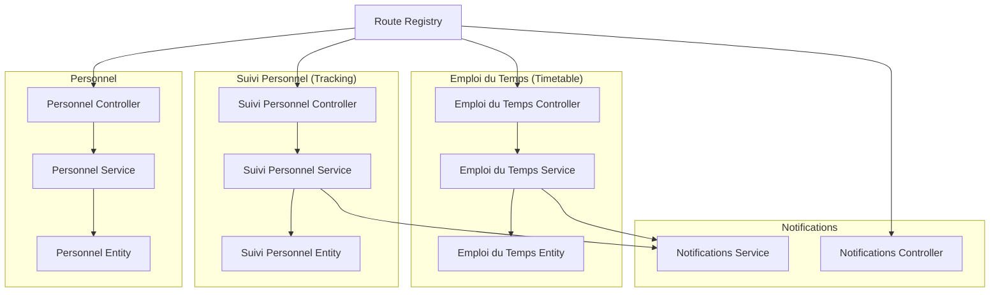
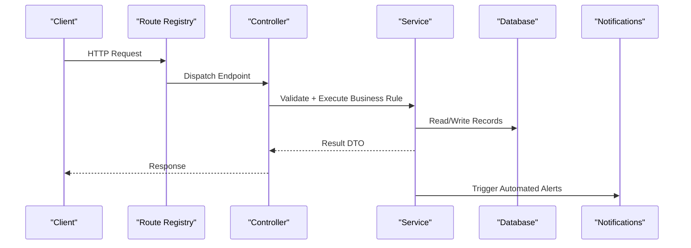
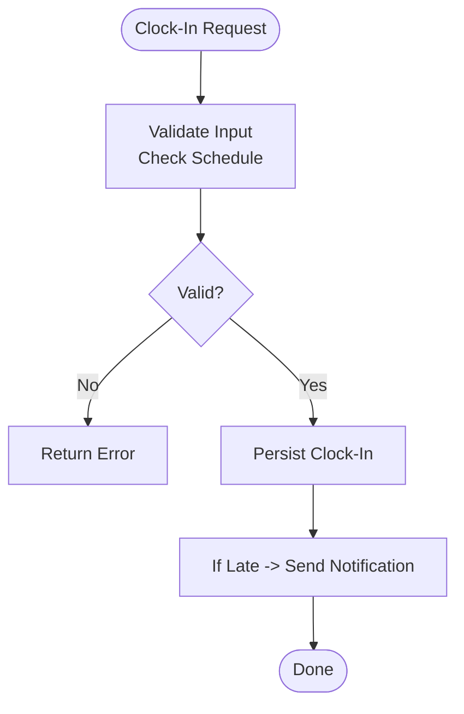
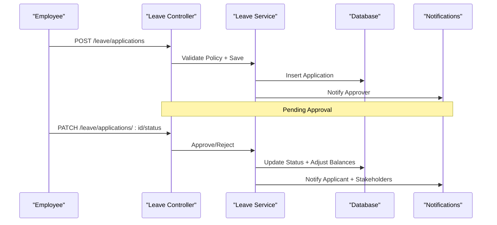
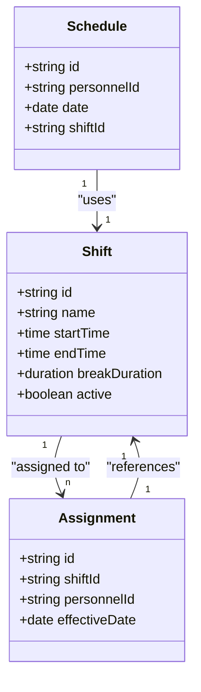
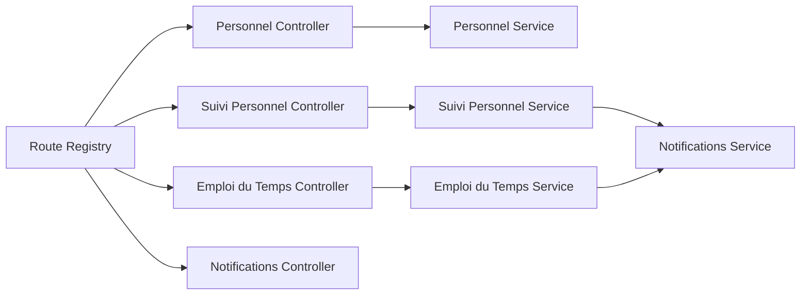

# Attendance & Leave Management API

<cite>
**Referenced Files in This Document**
- [backend/src/modules/personnel/controllers/personnel.controller.ts](file://backend/src/modules/personnel/controllers/personnel.controller.ts)
- [backend/src/modules/personnel/services/personnel.service.ts](file://backend/src/modules/personnel/services/personnel.service.ts)
- [backend/src/modules/personnel/entities/personnel.entity.ts](file://backend/src/modules/personnel/entities/personnel.entity.ts)
- [backend/src/modules/suivi-personnel/controllers/suivi-personnel.controller.ts](file://backend/src/modules/suivi-personnel/controllers/suivi-personnel.controller.ts)
- [backend/src/modules/suivi-personnel/services/suivi-personnel.service.ts](file://backend/src/modules/suivi-personnel/services/suivi-personnel.service.ts)
- [backend/src/modules/suivi-personnel/entities/suivi-personnel.entity.ts](file://backend/src/modules/suivi-personnel/entities/suivi-personnel.entity.ts)
- [backend/src/modules/emploi-du-temps/controllers/emploi-du-temps.controller.ts](file://backend/src/modules/emploi-du-temps/controllers/emploi-du-temps.controller.ts)
- [backend/src/modules/emploi-du-temps/services/emploi-du-temps.service.ts](file://backend/src/modules/emploi-du-temps/services/emploi-du-temps.service.ts)
- [backend/src/modules/emploi-du-temps/entities/emploi-du-temps.entity.ts](file://backend/src/modules/emploi-du-temps/entities/emploi-du-temps.entity.ts)
- [backend/src/modules/notifications/controllers/notifications.controller.ts](file://backend/src/modules/notifications/controllers/notifications.controller.ts)
- [backend/src/modules/notifications/services/notifications.service.ts](file://backend/src/modules/notifications/services/notifications.service.ts)
- [backend/src/routes/route-registry.ts](file://backend/src/routes/route-registry.ts)
- [backend/database/migrations/031-suivi-personnel.sql](file://backend/database/migrations/031-suivi-personnel.sql)
- [backend/database/migrations/063-creer-module-emploi-du-temps.sql](file://backend/database/migrations/063-creer-module-emploi-du-temps.sql)
</cite>

## Table of Contents
1. [Introduction](#introduction)
2. [Project Structure](#project-structure)
3. [Core Components](#core-components)
4. [Architecture Overview](#architecture-overview)
5. [Detailed Component Analysis](#detailed-component-analysis)
6. [Dependency Analysis](#dependency-analysis)
7. [Performance Considerations](#performance-considerations)
8. [Troubleshooting Guide](#troubleshooting-guide)
9. [Conclusion](#conclusion)

## Introduction
This document provides comprehensive API documentation for eLISAschool’s attendance and leave management features. It covers:
- Time tracking APIs: clock-in/clock-out, work hour calculations, overtime tracking
- Leave request workflow APIs: applications, approvals, balances, calendar integration
- Absence monitoring APIs: absenteeism tracking, late arrival recording, analytics
- Shift management APIs: schedules, configurations, reporting
- Business rules: leave policy enforcement, attendance calculations, automated notifications

The backend is organized into modules with controllers, services, entities, and database migrations. Routes are registered centrally.

## Project Structure
Key modules involved in attendance and leave management:
- Personnel module: personnel profiles and identifiers used by attendance
- Suivi personnel (personnel tracking): time entries, absences, lateness, attendance records
- Emploi du temps (timetable/shifts): shifts, schedules, calendar events
- Notifications: automated alerts for attendance and leave events
- Route registry: central registration of endpoints

**Diagram sources**
- [backend/src/modules/personnel/controllers/personnel.controller.ts](file://backend/src/modules/personnel/controllers/personnel.controller.ts)
- [backend/src/modules/personnel/services/personnel.service.ts](file://backend/src/modules/personnel/services/personnel.service.ts)
- [backend/src/modules/personnel/entities/personnel.entity.ts](file://backend/src/modules/personnel/entities/personnel.entity.ts)
- [backend/src/modules/suivi-personnel/controllers/suivi-personnel.controller.ts](file://backend/src/modules/suivi-personnel/controllers/suivi-personnel.controller.ts)
- [backend/src/modules/suivi-personnel/services/suivi-personnel.service.ts](file://backend/src/modules/suivi-personnel/services/suivi-personnel.service.ts)
- [backend/src/modules/suivi-personnel/entities/suivi-personnel.entity.ts](file://backend/src/modules/suivi-personnel/entities/suivi-personnel.entity.ts)
- [backend/src/modules/emploi-du-temps/controllers/emploi-du-temps.controller.ts](file://backend/src/modules/emploi-du-temps/controllers/emploi-du-temps.controller.ts)
- [backend/src/modules/emploi-du-temps/services/emploi-du-temps.service.ts](file://backend/src/modules/emploi-du-temps/services/emploi-du-temps.service.ts)
- [backend/src/modules/emploi-du-temps/entities/emploi-du-temps.entity.ts](file://backend/src/modules/emploi-du-temps/entities/emploi-du-temps.entity.ts)
- [backend/src/modules/notifications/controllers/notifications.controller.ts](file://backend/src/modules/notifications/controllers/notifications.controller.ts)
- [backend/src/modules/notifications/services/notifications.service.ts](file://backend/src/modules/notifications/services/notifications.service.ts)
- [backend/src/routes/route-registry.ts](file://backend/src/routes/route-registry.ts)

**Section sources**
- [backend/src/routes/route-registry.ts](file://backend/src/routes/route-registry.ts)

## Core Components
- Personnel: Provides staff identity and role context required for attendance and leave operations.
- Suivi Personnel: Implements time tracking (clock-in/out), absence and lateness recording, daily/monthly summaries, and analytics.
- Emploi du Temps: Manages shifts, schedules, and calendar events that define expected working hours and days off.
- Notifications: Emits automated alerts on attendance anomalies, leave approvals/rejections, and schedule changes.

Typical responsibilities:
- Controllers validate requests and delegate to services
- Services enforce business rules, compute metrics, and persist data
- Entities model the database schema
- Migrations define tables and indexes

**Section sources**
- [backend/src/modules/personnel/controllers/personnel.controller.ts](file://backend/src/modules/personnel/controllers/personnel.controller.ts)
- [backend/src/modules/personnel/services/personnel.service.ts](file://backend/src/modules/personnel/services/personnel.service.ts)
- [backend/src/modules/personnel/entities/personnel.entity.ts](file://backend/src/modules/personnel/entities/personnel.entity.ts)
- [backend/src/modules/suivi-personnel/controllers/suivi-personnel.controller.ts](file://backend/src/modules/suivi-personnel/controllers/suivi-personnel.controller.ts)
- [backend/src/modules/suivi-personnel/services/suivi-personnel.service.ts](file://backend/src/modules/suivi-personnel/services/suivi-personnel.service.ts)
- [backend/src/modules/suivi-personnel/entities/suivi-personnel.entity.ts](file://backend/src/modules/suivi-personnel/entities/suivi-personnel.entity.ts)
- [backend/src/modules/emploi-du-temps/controllers/emploi-du-temps.controller.ts](file://backend/src/modules/emploi-du-temps/controllers/emploi-du-temps.controller.ts)
- [backend/src/modules/emploi-du-temps/services/emploi-du-temps.service.ts](file://backend/src/modules/emploi-du-temps/services/emploi-du-temps.service.ts)
- [backend/src/modules/emploi-du-temps/entities/emploi-du-temps.entity.ts](file://backend/src/modules/emploi-du-temps/entities/emploi-du-temps.entity.ts)
- [backend/src/modules/notifications/controllers/notifications.controller.ts](file://backend/src/modules/notifications/controllers/notifications.controller.ts)
- [backend/src/modules/notifications/services/notifications.service.ts](file://backend/src/modules/notifications/services/notifications.service.ts)

## Architecture Overview
High-level flow for attendance and leave:
- Clients call controller endpoints registered in route-registry
- Controllers invoke service methods to apply business logic
- Services interact with entities and database via migrations
- Notifications are triggered for key events

**Diagram sources**
- [backend/src/routes/route-registry.ts](file://backend/src/routes/route-registry.ts)
- [backend/src/modules/suivi-personnel/controllers/suivi-personnel.controller.ts](file://backend/src/modules/suivi-personnel/controllers/suivi-personnel.controller.ts)
- [backend/src/modules/suivi-personnel/services/suivi-personnel.service.ts](file://backend/src/modules/suivi-personnel/services/suivi-personnel.service.ts)
- [backend/src/modules/notifications/services/notifications.service.ts](file://backend/src/modules/notifications/services/notifications.service.ts)

## Detailed Component Analysis

### Time Tracking API (Clock-In/Clock-Out, Work Hours, Overtime)
Endpoints:
- Clock-In: POST /api/suivi-personnel/clock-in
- Clock-Out: POST /api/suivi-personnel/clock-out
- Daily Summary: GET /api/suivi-personnel/daily-summary?date=YYYY-MM-DD&personnelId=...
- Monthly Summary: GET /api/suivi-personnel/monthly-summary?yearMonth=YYYY-MM&personnelId=...
- Late Arrivals: GET /api/suivi-personnel/late-arrivals?from=YYYY-MM-DD&to=YYYY-MM-DD
- Absenteeism: GET /api/suivi-personnel/absenteeism?period=month|quarter|year&filters...

Business rules:
- Clock-In must be within or near a scheduled shift; if outside, mark as early/late based on configured thresholds
- Clock-Out requires a prior Clock-In on the same day; otherwise return error
- Work hours computed from paired Clock-In/Clock-Out minus breaks; overtime calculated when exceeding standard daily/weekly thresholds
- Lateness recorded when Clock-In exceeds allowed grace period defined by shift configuration
- Absenteeism flags days with no valid Clock-In/Clock-Out pair unless covered by approved leave

Validation:
- Required fields: personnelId, timestamp, timezone-aware date/time
- Idempotency: duplicate Clock-In/Clock-Out prevented per day
- Range checks: Clock-Out after Clock-In; timestamps not in future

Example responses:
- Success returns structured DTO with computed hours, status (present/late/absent), and flags
- Error returns descriptive message and code for invalid state transitions

Automated notifications:
- On late arrival: notify supervisor and employee
- On missing Clock-Out: alert employee and manager
- On overtime threshold exceeded: notify payroll and manager

**Diagram sources**
- [backend/src/modules/suivi-personnel/controllers/suivi-personnel.controller.ts](file://backend/src/modules/suivi-personnel/controllers/suivi-personnel.controller.ts)
- [backend/src/modules/suivi-personnel/services/suivi-personnel.service.ts](file://backend/src/modules/suivi-personnel/services/suivi-personnel.service.ts)
- [backend/src/modules/notifications/services/notifications.service.ts](file://backend/src/modules/notifications/services/notifications.service.ts)

**Section sources**
- [backend/src/modules/suivi-personnel/controllers/suivi-personnel.controller.ts](file://backend/src/modules/suivi-personnel/controllers/suivi-personnel.controller.ts)
- [backend/src/modules/suivi-personnel/services/suivi-personnel.service.ts](file://backend/src/modules/suivi-personnel/services/suivi-personnel.service.ts)
- [backend/src/modules/suivi-personnel/entities/suivi-personnel.entity.ts](file://backend/src/modules/suivi-personnel/entities/suivi-personnel.entity.ts)
- [backend/database/migrations/031-suivi-personnel.sql](file://backend/database/migrations/031-suivi-personnel.sql)

### Leave Request Workflow API
Endpoints:
- Create Leave Application: POST /api/leave/applications
- Approve/Reject: PATCH /api/leave/applications/:id/status
- List Applications: GET /api/leave/applications?status=pending|approved|rejected&filters...
- Leave Balances: GET /api/leave/balances?year=YYYY&personnelId=...
- Calendar Integration: GET /api/leave/calendar?yearMonth=YYYY-MM&personnelId=...

Workflow:
- Employee submits application with type, dates, reason, attachments
- Supervisor reviews and approves/rejects
- Approved leaves update balances and affect attendance (absence marked as “on leave”)
- Rejected applications may allow resubmission with updated details

Policy enforcement:
- Minimum notice periods enforced by leave type
- Maximum consecutive days limits
- Balance checks prevent overuse
- Overlap detection prevents conflicting applications

Calendar integration:
- Returns events for holidays, approved leaves, and schedule exceptions
- Supports filtering by personnel and month/year

Automated notifications:
- On submission: notify approver(s)
- On approval/rejection: notify applicant and relevant stakeholders
- On balance updates: notify payroll and employee

**Diagram sources**
- [backend/src/modules/suivi-personnel/controllers/suivi-personnel.controller.ts](file://backend/src/modules/suivi-personnel/controllers/suivi-personnel.controller.ts)
- [backend/src/modules/suivi-personnel/services/suivi-personnel.service.ts](file://backend/src/modules/suivi-personnel/services/suivi-personnel.service.ts)
- [backend/src/modules/notifications/services/notifications.service.ts](file://backend/src/modules/notifications/services/notifications.service.ts)

**Section sources**
- [backend/src/modules/suivi-personnel/controllers/suivi-personnel.controller.ts](file://backend/src/modules/suivi-personnel/controllers/suivi-personnel.controller.ts)
- [backend/src/modules/suivi-personnel/services/suivi-personnel.service.ts](file://backend/src/modules/suivi-personnel/services/suivi-personnel.service.ts)
- [backend/src/modules/suivi-personnel/entities/suivi-personnel.entity.ts](file://backend/src/modules/suivi-personnel/entities/suivi-personnel.entity.ts)

### Absence Monitoring API
Endpoints:
- Absenteeism Report: GET /api/suivi-personnel/absenteeism?period=month|quarter|year&filters...
- Late Arrivals Report: GET /api/suivi-personnel/late-arrivals?from=YYYY-MM-DD&to=YYYY-MM-DD
- Attendance Analytics: GET /api/suivi-personnel/analytics?range=week|month|quarter&groupBy=department|role

Metrics:
- Absenteeism rate per department/role
- Average lateness duration
- Overtime trends
- Compliance with minimum attendance requirements

Filters:
- Date range, department, role, personnelId
- Exclude approved leaves and company holidays

Outputs:
- Aggregated counts and percentages
- Trend charts data points
- Exportable CSV/JSON

**Section sources**
- [backend/src/modules/suivi-personnel/controllers/suivi-personnel.controller.ts](file://backend/src/modules/suivi-personnel/controllers/suivi-personnel.controller.ts)
- [backend/src/modules/suivi-personnel/services/suivi-personnel.service.ts](file://backend/src/modules/suivi-personnel/services/suivi-personnel.service.ts)
- [backend/database/migrations/031-suivi-personnel.sql](file://backend/database/migrations/031-suivi-personnel.sql)

### Shift Management and Work Schedule Configuration
Endpoints:
- Create Shift: POST /api/emploi-du-temps/shifts
- Update Shift: PUT /api/emploi-du-temps/shifts/:id
- Delete Shift: DELETE /api/emploi-du-temps/shifts/:id
- Assign Shift to Personnel: POST /api/emploi-du-temps/assignments
- Get Schedule: GET /api/emploi-du-temps/schedule?personnelId=...&from=YYYY-MM-DD&to=YYYY-MM-DD
- Calendar Events: GET /api/emploi-du-temps/calendar?yearMonth=YYYY-MM

Features:
- Define start/end times, break durations, and weekly patterns
- Assign shifts to personnel or groups
- Handle exceptions and make-up days
- Integrate with attendance to determine expected hours and lateness thresholds

**Diagram sources**
- [backend/src/modules/emploi-du-temps/controllers/emploi-du-temps.controller.ts](file://backend/src/modules/emploi-du-temps/controllers/emploi-du-temps.controller.ts)
- [backend/src/modules/emploi-du-temps/services/emploi-du-temps.service.ts](file://backend/src/modules/emploi-du-temps/services/emploi-du-temps.service.ts)
- [backend/src/modules/emploi-du-temps/entities/emploi-du-temps.entity.ts](file://backend/src/modules/emploi-du-temps/entities/emploi-du-temps.entity.ts)
- [backend/database/migrations/063-creer-module-emploi-du-temps.sql](file://backend/database/migrations/063-creer-module-emploi-du-temps.sql)

**Section sources**
- [backend/src/modules/emploi-du-temps/controllers/emploi-du-temps.controller.ts](file://backend/src/modules/emploi-du-temps/controllers/emploi-du-temps.controller.ts)
- [backend/src/modules/emploi-du-temps/services/emploi-du-temps.service.ts](file://backend/src/modules/emploi-du-temps/services/emploi-du-temps.service.ts)
- [backend/src/modules/emploi-du-temps/entities/emploi-du-temps.entity.ts](file://backend/src/modules/emploi-du-temps/entities/emploi-du-temps.entity.ts)
- [backend/database/migrations/063-creer-module-emploi-du-temps.sql](file://backend/database/migrations/063-creer-module-emploi-du-temps.sql)

### Attendance Reporting Features
Endpoints:
- Daily Report: GET /api/suivi-personnel/report/daily?date=YYYY-MM-DD
- Weekly Report: GET /api/suivi-personnel/report/weekly?weekStart=YYYY-MM-DD
- Monthly Report: GET /api/suivi-personnel/report/monthly?yearMonth=YYYY-MM
- Export: GET /api/suivi-personnel/report/export?format=csv|json&filters...

Capabilities:
- Summarize attendance, lateness, absences, and overtime
- Filter by department, role, personnel
- Generate downloadable reports

**Section sources**
- [backend/src/modules/suivi-personnel/controllers/suivi-personnel.controller.ts](file://backend/src/modules/suivi-personnel/controllers/suivi-personnel.controller.ts)
- [backend/src/modules/suivi-personnel/services/suivi-personnel.service.ts](file://backend/src/modules/suivi-personnel/services/suivi-personnel.service.ts)

## Dependency Analysis
Module interactions:
- Controllers depend on services for business logic
- Services depend on entities and database via migrations
- Notifications service is invoked by attendance and leave services for automated alerts
- Route registry wires controllers to HTTP endpoints

**Diagram sources**
- [backend/src/routes/route-registry.ts](file://backend/src/routes/route-registry.ts)
- [backend/src/modules/personnel/controllers/personnel.controller.ts](file://backend/src/modules/personnel/controllers/personnel.controller.ts)
- [backend/src/modules/personnel/services/personnel.service.ts](file://backend/src/modules/personnel/services/personnel.service.ts)
- [backend/src/modules/suivi-personnel/controllers/suivi-personnel.controller.ts](file://backend/src/modules/suivi-personnel/controllers/suivi-personnel.controller.ts)
- [backend/src/modules/suivi-personnel/services/suivi-personnel.service.ts](file://backend/src/modules/suivi-personnel/services/suivi-personnel.service.ts)
- [backend/src/modules/emploi-du-temps/controllers/emploi-du-temps.controller.ts](file://backend/src/modules/emploi-du-temps/controllers/emploi-du-temps.controller.ts)
- [backend/src/modules/emploi-du-temps/services/emploi-du-temps.service.ts](file://backend/src/modules/emploi-du-temps/services/emploi-du-temps.service.ts)
- [backend/src/modules/notifications/controllers/notifications.controller.ts](file://backend/src/modules/notifications/controllers/notifications.controller.ts)
- [backend/src/modules/notifications/services/notifications.service.ts](file://backend/src/modules/notifications/services/notifications.service.ts)

**Section sources**
- [backend/src/routes/route-registry.ts](file://backend/src/routes/route-registry.ts)

## Performance Considerations
- Indexing: Ensure queries on personnelId, date ranges, and status columns are indexed
- Pagination: Apply pagination for list endpoints to reduce payload size
- Caching: Cache schedule and calendar data for short intervals to reduce DB load
- Batch operations: Use batch endpoints where available for bulk assignments and exports
- Timezone handling: Normalize timestamps server-side to avoid client inconsistencies

[No sources needed since this section provides general guidance]

## Troubleshooting Guide
Common issues and resolutions:
- Duplicate Clock-In/Clock-Out: Check idempotency keys and ensure single entry per day
- Invalid state transitions: Verify prior Clock-In before Clock-Out; handle errors gracefully
- Late arrival misclassification: Confirm shift configuration and grace period settings
- Leave balance discrepancies: Audit approval history and recalibrate balances
- Notification delivery failures: Inspect notification logs and retry mechanisms

Operational tips:
- Enable detailed logging for attendance and leave flows
- Monitor error rates and response times for critical endpoints
- Validate timezone and locale settings across clients and server

**Section sources**
- [backend/src/modules/suivi-personnel/controllers/suivi-personnel.controller.ts](file://backend/src/modules/suivi-personnel/controllers/suivi-personnel.controller.ts)
- [backend/src/modules/suivi-personnel/services/suivi-personnel.service.ts](file://backend/src/modules/suivi-personnel/services/suivi-personnel.service.ts)
- [backend/src/modules/notifications/controllers/notifications.controller.ts](file://backend/src/modules/notifications/controllers/notifications.controller.ts)
- [backend/src/modules/notifications/services/notifications.service.ts](file://backend/src/modules/notifications/services/notifications.service.ts)

## Conclusion
eLISAschool’s attendance and leave management APIs provide robust capabilities for time tracking, leave workflows, absence monitoring, and shift scheduling. The modular architecture ensures clear separation of concerns, while automated notifications enhance operational visibility. Proper validation and business rule enforcement guarantee accurate calculations and compliance with organizational policies.

[No sources needed since this section summarizes without analyzing specific files]