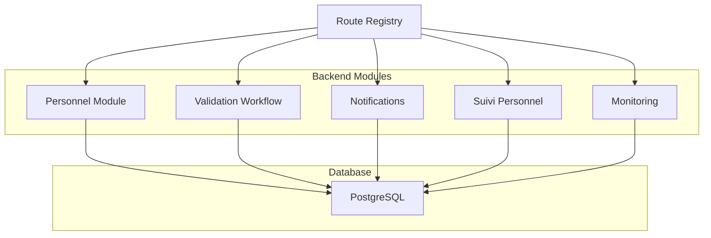
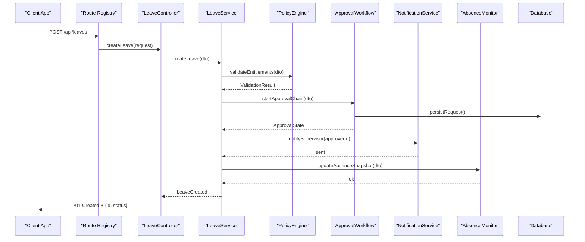
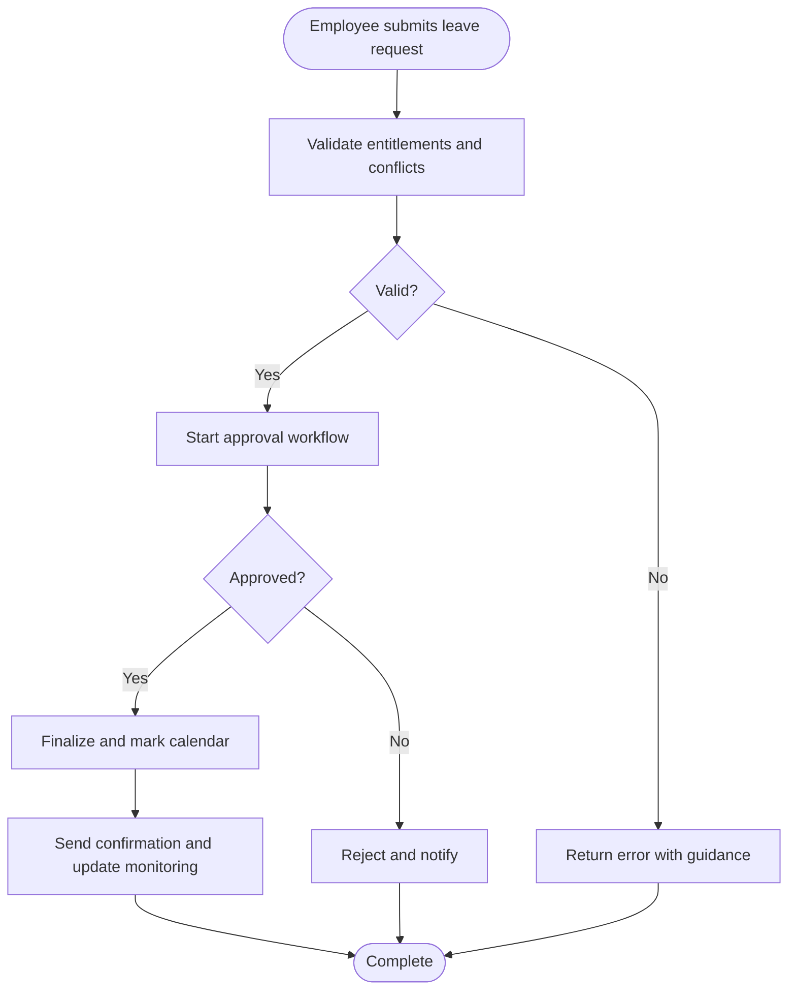
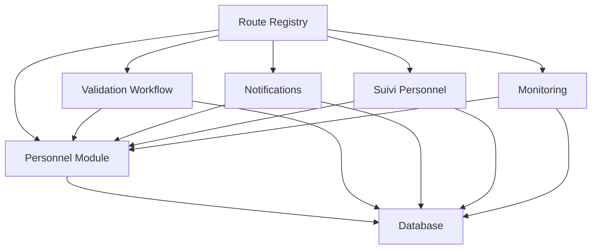

# Leave Workflow API

<cite>
**Referenced Files in This Document**
- [backend/src/modules/personnel](file://backend/src/modules/personnel)
- [backend/src/modules/validation-workflow](file://backend/src/modules/validation-workflow)
- [backend/src/modules/notifications](file://backend/src/modules/notifications)
- [backend/src/modules/suivi-personnel](file://backend/src/modules/suivi-personnel)
- [backend/src/modules/monitoring](file://backend/src/modules/monitoring)
- [backend/src/routes/route-registry.ts](file://backend/src/routes/route-registry.ts)
- [backend/database/migrations/016-module-personnel-rh-phase1.sql](file://backend/database/migrations/016-module-personnel-rh-phase1.sql)
- [backend/database/migrations/017-module-personnel-rh-phase2.sql](file://backend/database/migrations/017-module-personnel-rh-phase2.sql)
- [backend/database/migrations/018-module-personnel-rh-phase3.sql](file://backend/database/migrations/018-module-personnel-rh-phase3.sql)
- [backend/database/migrations/019-module-personnel-rh-phase4.sql](file://backend/database/migrations/019-module-personnel-rh-phase4.sql)
- [backend/database/migrations/020-module-personnel-rh-phase5.sql](file://backend/database/migrations/020-module-personnel-rh-phase5.sql)
- [backend/database/migrations/021-module-personnel-rh-permissions-attribution.sql](file://backend/database/migrations/021-module-personnel-rh-permissions-attribution.sql)
- [backend/database/migrations/022-module-personnel-rh-complete.sql](file://backend/database/migrations/022-module-personnel-rh-complete.sql)
- [backend/database/migrations/031-suivi-personnel.sql](file://backend/database/migrations/031-suivi-personnel.sql)
- [backend/database/migrations/047-notifications-ameliorations.sql](file://backend/database/migrations/047-notifications-ameliorations.sql)
- [backend/database/migrations/048-notifications-performance-optimizations.sql](file://backend/database/migrations/048-notifications-performance-optimizations.sql)
- [backend/database/migrations/099-add-monitoring-params.sql](file://backend/database/migrations/099-add-monitoring-params.sql)
</cite>

## Table of Contents
1. [Introduction](#introduction)
2. [Project Structure](#project-structure)
3. [Core Components](#core-components)
4. [Architecture Overview](#architecture-overview)
5. [Detailed Component Analysis](#detailed-component-analysis)
6. [Dependency Analysis](#dependency-analysis)
7. [Performance Considerations](#performance-considerations)
8. [Troubleshooting Guide](#troubleshooting-guide)
9. [Conclusion](#conclusion)
10. [Appendices](#appendices)

## Introduction
This document provides comprehensive API documentation for eLISAschool’s leave management workflow. It covers leave request creation with policy validation, multi-level approval workflows, leave balance calculations, calendar integration, leave type configurations (annual, sick, maternity, etc.), automated notifications to supervisors, and leave history tracking. It also addresses leave conflict resolution, carry-over policies, integration with absence monitoring systems, entitlement calculations, partial day requests, and emergency leave procedures.

The scope includes:
- REST endpoints for leave lifecycle operations
- Policy-driven validation rules
- Approval routing and escalation
- Balance and entitlement computation
- Notification triggers
- Audit and history tracking
- Integration points with calendars and monitoring

## Project Structure
Leave-related functionality is implemented across several modules and database migrations:
- Personnel module: core HR data and leave entities
- Validation workflow: configurable approval flows
- Notifications: automated messaging to stakeholders
- Suivi personnel: personnel tracking and leave history
- Monitoring: absence monitoring integration
- Route registry: endpoint registration

**Diagram sources**
- [backend/src/routes/route-registry.ts](file://backend/src/routes/route-registry.ts)
- [backend/src/modules/personnel](file://backend/src/modules/personnel)
- [backend/src/modules/validation-workflow](file://backend/src/modules/validation-workflow)
- [backend/src/modules/notifications](file://backend/src/modules/notifications)
- [backend/src/modules/suivi-personnel](file://backend/src/modules/suivi-personnel)
- [backend/src/modules/monitoring](file://backend/src/modules/monitoring)

**Section sources**
- [backend/src/routes/route-registry.ts](file://backend/src/routes/route-registry.ts)
- [backend/src/modules/personnel](file://backend/src/modules/personnel)
- [backend/src/modules/validation-workflow](file://backend/src/modules/validation-workflow)
- [backend/src/modules/notifications](file://backend/src/modules/notifications)
- [backend/src/modules/suivi-personnel](file://backend/src/modules/suivi-personnel)
- [backend/src/modules/monitoring](file://backend/src/modules/monitoring)

## Core Components
- Leave Request Lifecycle: Create, validate, approve/reject, finalize, cancel
- Policy Engine: Entitlements, balances, conflicts, carry-over, partial days, emergencies
- Approval Workflow: Multi-level approvals, escalations, delegation
- Notifications: Supervisor alerts, employee updates, audit logs
- History & Audit: Immutable records, state transitions, reasons
- Calendar Integration: Marking approved leaves on schedules
- Absence Monitoring: Real-time dashboards and alerts

Key responsibilities:
- Controllers handle HTTP endpoints and orchestrate services
- Services implement business logic (validation, approvals, calculations)
- Repositories access the database via TypeORM entities
- Events trigger notifications and monitoring updates

**Section sources**
- [backend/src/modules/personnel](file://backend/src/modules/personnel)
- [backend/src/modules/validation-workflow](file://backend/src/modules/validation-workflow)
- [backend/src/modules/notifications](file://backend/src/modules/notifications)
- [backend/src/modules/suivi-personnel](file://backend/src/modules/suivi-personnel)
- [backend/src/modules/monitoring](file://backend/src/modules/monitoring)

## Architecture Overview
High-level flow for a leave request:

**Diagram sources**
- [backend/src/routes/route-registry.ts](file://backend/src/routes/route-registry.ts)
- [backend/src/modules/personnel](file://backend/src/modules/personnel)
- [backend/src/modules/validation-workflow](file://backend/src/modules/validation-workflow)
- [backend/src/modules/notifications](file://backend/src/modules/notifications)
- [backend/src/modules/monitoring](file://backend/src/modules/monitoring)

## Detailed Component Analysis

### Leave Types and Configuration
Supported leave types include annual, sick, maternity, paternity, unpaid, and emergency. Configuration defines:
- Accrual rules per year or tenure
- Carry-over limits and expiration
- Partial day support and minimum units
- Required documents (e.g., medical certificate for sick leave)
- Emergency override flags and post-facto validation

Typical configuration keys:
- type: enum (annual, sick, maternity, paternity, unpaid, emergency)
- accrual: yearly allowance, pro-rata rules
- carry_over: max carry-over, expiry month
- partial_days: allowed, min unit (hours)
- required_documents: list of required attachments
- emergency: boolean, post_validation_required

**Section sources**
- [backend/database/migrations/016-module-personnel-rh-phase1.sql](file://backend/database/migrations/016-module-personnel-rh-phase1.sql)
- [backend/database/migrations/017-module-personnel-rh-phase2.sql](file://backend/database/migrations/017-module-personnel-rh-phase2.sql)
- [backend/database/migrations/018-module-personnel-rh-phase3.sql](file://backend/database/migrations/018-module-personnel-rh-phase3.sql)
- [backend/database/migrations/019-module-personnel-rh-phase4.sql](file://backend/database/migrations/019-module-personnel-rh-phase4.sql)
- [backend/database/migrations/020-module-personnel-rh-phase5.sql](file://backend/database/migrations/020-module-personnel-rh-phase5.sql)
- [backend/database/migrations/022-module-personnel-rh-complete.sql](file://backend/database/migrations/022-module-personnel-rh-complete.sql)

### Leave Request Creation and Policy Validation
Endpoints:
- POST /api/leaves: Create a new leave request
- GET /api/leaves/:id: Retrieve a specific leave
- PUT /api/leaves/:id: Update draft or pending requests
- DELETE /api/leaves/:id: Cancel a non-finalized request

Validation steps:
- Check employee eligibility and active status
- Compute available balance by type and period
- Enforce partial day constraints and minimum units
- Detect overlapping requests and conflicts
- Apply carry-over and expiry rules
- Validate required documents for certain types

Conflict resolution:
- Overlapping dates: reject or propose split into multiple requests
- Exceeding balance: require additional unpaid leave or reduce duration
- Missing documents: block until provided (except emergency)

Partial day handling:
- Accept half-day or custom hour ranges
- Convert hours to fractional days based on working schedule
- Ensure daily caps are respected

Emergency procedure:
- Allow immediate submission without prior approval
- Require post-facto validation within defined SLA
- Auto-notify supervisor and HR upon submission

**Section sources**
- [backend/src/modules/personnel](file://backend/src/modules/personnel)
- [backend/src/modules/validation-workflow](file://backend/src/modules/validation-workflow)
- [backend/database/migrations/016-module-personnel-rh-phase1.sql](file://backend/database/migrations/016-module-personnel-rh-phase1.sql)
- [backend/database/migrations/017-module-personnel-rh-phase2.sql](file://backend/database/migrations/017-module-personnel-rh-phase2.sql)
- [backend/database/migrations/018-module-personnel-rh-phase3.sql](file://backend/database/migrations/018-module-personnel-rh-phase3.sql)
- [backend/database/migrations/019-module-personnel-rh-phase4.sql](file://backend/database/migrations/019-module-personnel-rh-phase4.sql)
- [backend/database/migrations/020-module-personnel-rh-phase5.sql](file://backend/database/migrations/020-module-personnel-rh-phase5.sql)
- [backend/database/migrations/022-module-personnel-rh-complete.sql](file://backend/database/migrations/022-module-personnel-rh-complete.sql)

### Multi-Level Approval Workflows
Workflows support:
- Sequential approvals (supervisor → department head → HR)
- Parallel approvals (multiple approvers)
- Conditional routing based on leave type, duration, or amount
- Escalation after timeout
- Delegation when approver unavailable

API actions:
- POST /api/leaves/:id/approve: Approve at current step
- POST /api/leaves/:id/reject: Reject with reason
- POST /api/leaves/:id/escalate: Escalate to next level
- GET /api/leaves/:id/workflow: Inspect current step and history

State transitions:
- Draft → Pending → Approved/Rejected → Finalized
- Emergency: Submitted → Post-validation → Approved/Rejected

**Section sources**
- [backend/src/modules/validation-workflow](file://backend/src/modules/validation-workflow)
- [backend/database/migrations/021-module-personnel-rh-permissions-attribution.sql](file://backend/database/migrations/021-module-personnel-rh-permissions-attribution.sql)
- [backend/database/migrations/022-module-personnel-rh-complete.sql](file://backend/database/migrations/022-module-personnel-rh-complete.sql)

### Leave Balance Calculations and Entitlements
Balance computation considers:
- Annual allowance per type
- Pro-rata accrual for mid-year hires
- Carry-over from previous years up to configured limit
- Usage deductions for approved leaves
- Adjustments for corrections and reversals

Calculation inputs:
- Employee tenure and effective date
- Working calendar and part-time factor
- Historical usage and carry-over balances
- Current period boundaries

Outputs:
- Available balance by type and period
- Forecasted balance after pending requests
- Alerts for near-limit conditions

**Section sources**
- [backend/database/migrations/016-module-personnel-rh-phase1.sql](file://backend/database/migrations/016-module-personnel-rh-phase1.sql)
- [backend/database/migrations/017-module-personnel-rh-phase2.sql](file://backend/database/migrations/017-module-personnel-rh-phase2.sql)
- [backend/database/migrations/018-module-personnel-rh-phase3.sql](file://backend/database/migrations/018-module-personnel-rh-phase3.sql)
- [backend/database/migrations/019-module-personnel-rh-phase4.sql](file://backend/database/migrations/019-module-personnel-rh-phase4.sql)
- [backend/database/migrations/020-module-personnel-rh-phase5.sql](file://backend/database/migrations/020-module-personnel-rh-phase5.sql)
- [backend/database/migrations/022-module-personnel-rh-complete.sql](file://backend/database/migrations/022-module-personnel-rh-complete.sql)

### Calendar Integration
Approved leaves should be reflected in organizational calendars:
- Mark employee absence blocks on team calendars
- Prevent scheduling conflicts during approved leaves
- Sync with class schedules and meeting planners

Integration points:
- Webhook or event-based updates to calendar service
- Read-only sync for viewing availability
- Conflict detection before finalization

**Section sources**
- [backend/src/modules/personnel](file://backend/src/modules/personnel)
- [backend/src/modules/validation-workflow](file://backend/src/modules/validation-workflow)

### Automated Notifications
Triggers:
- New leave request submitted
- Approval action taken
- Rejection with reason
- Finalization and cancellation
- Escalation and reminders

Channels:
- In-app notifications
- Email
- Optional SMS or chat integrations

Recipient roles:
- Employee requester
- Immediate supervisor
- Department head
- HR administrator

**Section sources**
- [backend/src/modules/notifications](file://backend/src/modules/notifications)
- [backend/database/migrations/047-notifications-ameliorations.sql](file://backend/database/migrations/047-notifications-ameliorations.sql)
- [backend/database/migrations/048-notifications-performance-optimizations.sql](file://backend/database/migrations/048-notifications-performance-optimizations.sql)

### Leave History Tracking and Audit Trail
Immutable records capture:
- Submission details and attachments
- Approval chain and decisions
- State transitions and timestamps
- Reasons and comments
- Corrections and reversals

Queries:
- List all leaves for an employee
- Filter by type, status, date range
- Export reports for payroll and compliance

**Section sources**
- [backend/src/modules/suivi-personnel](file://backend/src/modules/suivi-personnel)
- [backend/database/migrations/031-suivi-personnel.sql](file://backend/database/migrations/031-suivi-personnel.sql)

### Absence Monitoring Integration
Real-time monitoring:
- Dashboards showing current absences
- Alerts for excessive absenteeism
- Aggregated statistics by department and type

Integration APIs:
- GET /api/monitoring/absences: Current snapshot
- POST /api/monitoring/events: Stream leave events
- GET /api/monitoring/stats: Aggregated metrics

**Section sources**
- [backend/src/modules/monitoring](file://backend/src/modules/monitoring)
- [backend/database/migrations/099-add-monitoring-params.sql](file://backend/database/migrations/099-add-monitoring-params.sql)

### Conceptual Overview
Conceptual leave workflow:

[No sources needed since this diagram shows conceptual workflow, not actual code structure]

## Dependency Analysis
Module dependencies and interactions:

**Diagram sources**
- [backend/src/routes/route-registry.ts](file://backend/src/routes/route-registry.ts)
- [backend/src/modules/personnel](file://backend/src/modules/personnel)
- [backend/src/modules/validation-workflow](file://backend/src/modules/validation-workflow)
- [backend/src/modules/notifications](file://backend/src/modules/notifications)
- [backend/src/modules/suivi-personnel](file://backend/src/modules/suivi-personnel)
- [backend/src/modules/monitoring](file://backend/src/modules/monitoring)

**Section sources**
- [backend/src/routes/route-registry.ts](file://backend/src/routes/route-registry.ts)
- [backend/src/modules/personnel](file://backend/src/modules/personnel)
- [backend/src/modules/validation-workflow](file://backend/src/modules/validation-workflow)
- [backend/src/modules/notifications](file://backend/src/modules/notifications)
- [backend/src/modules/suivi-personnel](file://backend/src/modules/suivi-personnel)
- [backend/src/modules/monitoring](file://backend/src/modules/monitoring)

## Performance Considerations
- Indexes on frequently queried fields (employee_id, type, status, date_range)
- Batch processing for bulk approvals and notifications
- Caching of entitlement snapshots and balances
- Asynchronous notification delivery
- Pagination and filtering for large histories
- Monitoring query optimization and slow SQL

[No sources needed since this section provides general guidance]

## Troubleshooting Guide
Common issues and resolutions:
- Validation errors: Review entitlements, conflicts, and required documents
- Approval timeouts: Configure escalation rules and delegate approvals
- Notification failures: Check provider configuration and retry policies
- Calendar sync errors: Verify webhook endpoints and conflict resolution
- Monitoring discrepancies: Re-sync events and reconcile state transitions

Operational checks:
- Verify migration execution and schema consistency
- Confirm route registration and middleware order
- Inspect audit logs for state transitions and reasons
- Monitor performance metrics and alert thresholds

**Section sources**
- [backend/database/migrations/047-notifications-ameliorations.sql](file://backend/database/migrations/047-notifications-ameliorations.sql)
- [backend/database/migrations/048-notifications-performance-optimizations.sql](file://backend/database/migrations/048-notifications-performance-optimizations.sql)
- [backend/database/migrations/099-add-monitoring-params.sql](file://backend/database/migrations/099-add-monitoring-params.sql)

## Conclusion
The eLISAschool leave management workflow integrates policy validation, multi-level approvals, balance calculations, notifications, history tracking, calendar synchronization, and absence monitoring. The modular architecture ensures scalability and maintainability while providing robust features for complex HR scenarios such as partial days, emergencies, and carry-over policies.

[No sources needed since this section summarizes without analyzing specific files]

## Appendices

### API Endpoints Summary
- POST /api/leaves: Create leave request
- GET /api/leaves/:id: Get leave details
- PUT /api/leaves/:id: Update draft/pending
- DELETE /api/leaves/:id: Cancel non-finalized
- POST /api/leaves/:id/approve: Approve at current step
- POST /api/leaves/:id/reject: Reject with reason
- POST /api/leaves/:id/escalate: Escalate to next level
- GET /api/leaves/:id/workflow: Inspect workflow state
- GET /api/monitoring/absences: Current absence snapshot
- POST /api/monitoring/events: Stream leave events
- GET /api/monitoring/stats: Aggregated metrics

**Section sources**
- [backend/src/routes/route-registry.ts](file://backend/src/routes/route-registry.ts)
- [backend/src/modules/personnel](file://backend/src/modules/personnel)
- [backend/src/modules/validation-workflow](file://backend/src/modules/validation-workflow)
- [backend/src/modules/notifications](file://backend/src/modules/notifications)
- [backend/src/modules/suivi-personnel](file://backend/src/modules/suivi-personnel)
- [backend/src/modules/monitoring](file://backend/src/modules/monitoring)