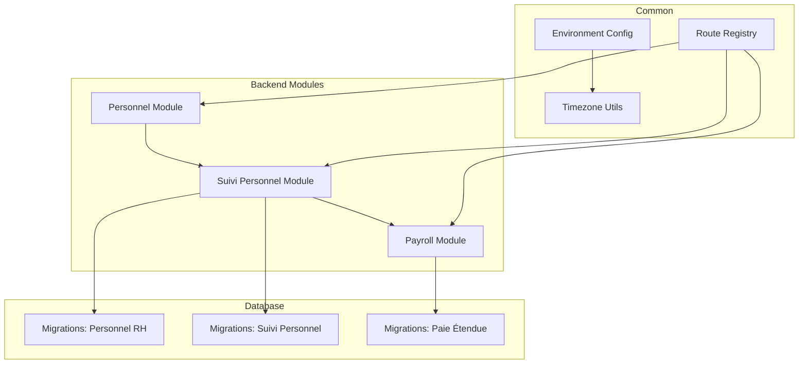
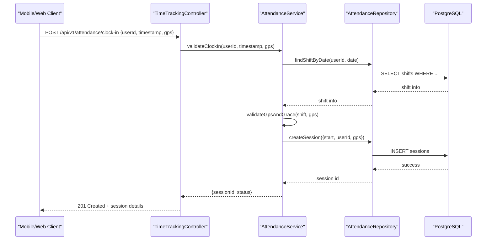
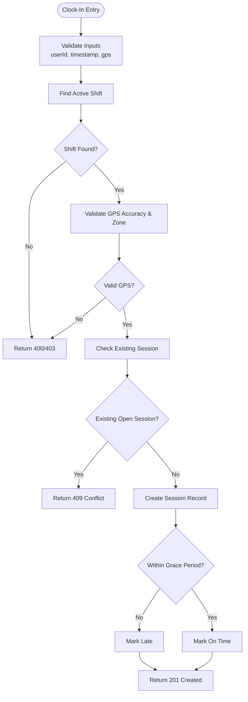
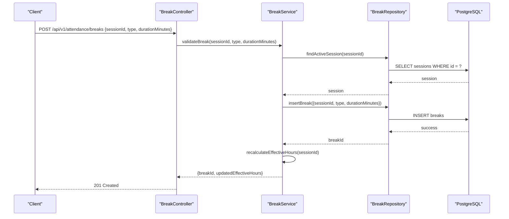
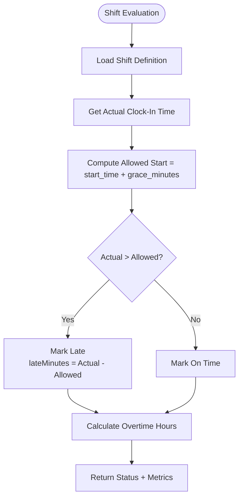
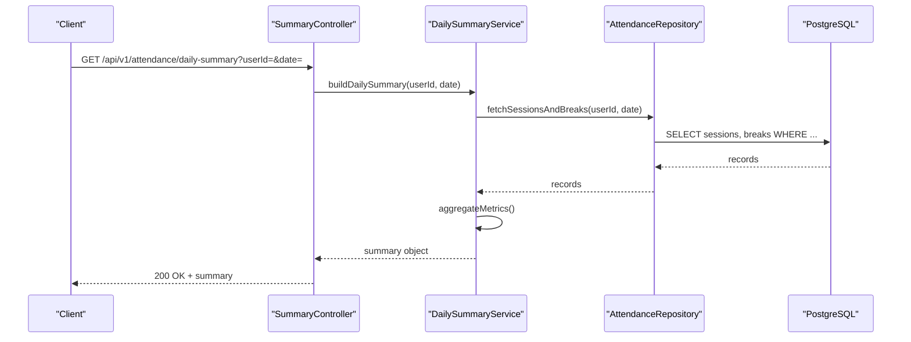
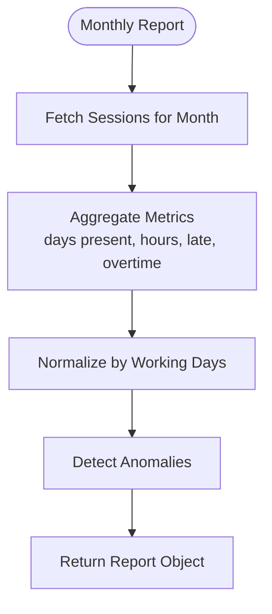
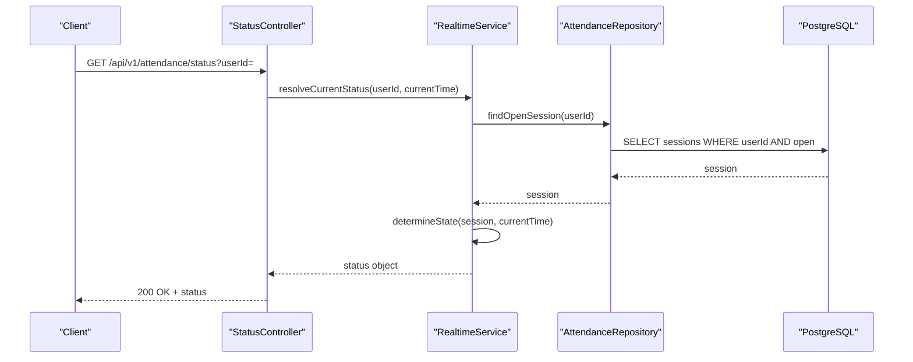
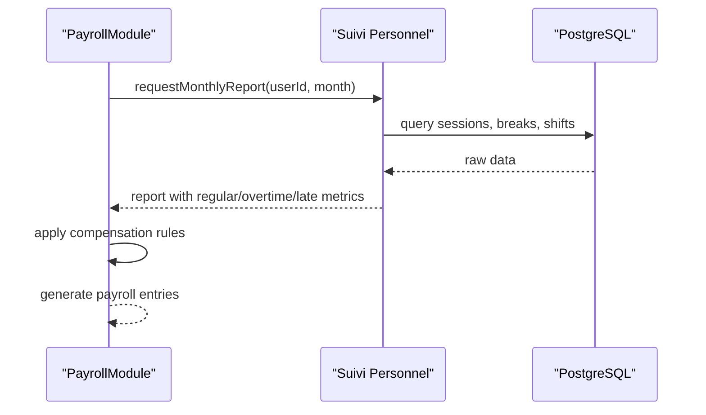
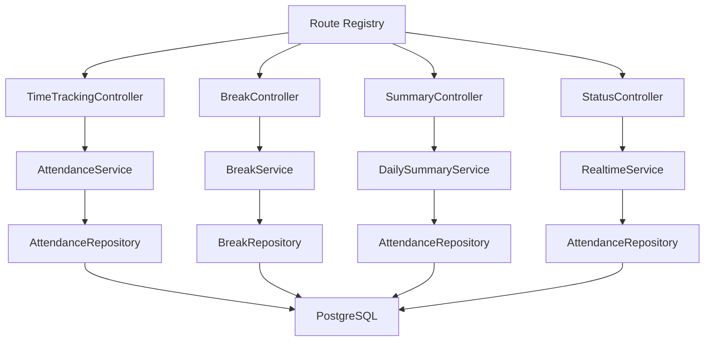

# Time Tracking API

<cite>
**Referenced Files in This Document**
- [backend/src/modules/suivi-personnel/](file://backend/src/modules/suivi-personnel/)
- [backend/src/modules/personnel/](file://backend/src/modules/personnel/)
- [backend/database/migrations/016-module-personnel-rh-phase1.sql](file://backend/database/migrations/016-module-personnel-rh-phase1.sql)
- [backend/database/migrations/017-module-personnel-rh-phase2.sql](file://backend/database/migrations/017-module-personnel-rh-phase2.sql)
- [backend/database/migrations/018-module-personnel-rh-phase3.sql](file://backend/database/migrations/018-module-personnel-rh-phase3.sql)
- [backend/database/migrations/019-module-personnel-rh-phase4.sql](file://backend/database/migrations/019-module-personnel-rh-phase4.sql)
- [backend/database/migrations/020-module-personnel-rh-phase5.sql](file://backend/database/migrations/020-module-personnel-rh-phase5.sql)
- [backend/database/migrations/022-module-personnel-rh-complete.sql](file://backend/database/migrations/022-module-personnel-rh-complete.sql)
- [backend/database/migrations/031-suivi-personnel.sql](file://backend/database/migrations/031-suivi-personnel.sql)
- [backend/database/migrations/029-paie-etendue.sql](file://backend/database/migrations/029-paie-etendue.sql)
- [backend/src/modules/paie/](file://backend/src/modules/paie/)
- [backend/src/routes/route-registry.ts](file://backend/src/routes/route-registry.ts)
- [backend/src/config/env.config.ts](file://backend/src/config/env.config.ts)
- [backend/src/common/utils/timezone.util.ts](file://backend/src/common/utils/timezone.util.ts)
</cite>

## Table of Contents
1. [Introduction](#introduction)
2. [Project Structure](#project-structure)
3. [Core Components](#core-components)
4. [Architecture Overview](#architecture-overview)
5. [Detailed Component Analysis](#detailed-component-analysis)
6. [Dependency Analysis](#dependency-analysis)
7. [Performance Considerations](#performance-considerations)
8. [Troubleshooting Guide](#troubleshooting-guide)
9. [Conclusion](#conclusion)
10. [Appendices](#appendices)

## Introduction
This document provides detailed API documentation for eLISAschool’s time tracking capabilities, focusing on personnel attendance and work hour management. It covers clock-in/clock-out operations with GPS validation, break tracking, shift-based attendance, overtime detection, daily summaries, monthly reports, real-time status, timezone handling, mobile check-in features, and payroll integration points. The goal is to enable developers to implement robust time tracking workflows that are accurate, auditable, and aligned with payroll calculations.

## Project Structure
Time tracking functionality spans the Personnel module (personnel data and roles), the Suivi Personnel module (attendance and time entries), database migrations defining schema, and Payroll integration endpoints. Routes are registered centrally, and configuration includes environment variables and timezone utilities.

**Diagram sources**
- [backend/src/routes/route-registry.ts](file://backend/src/routes/route-registry.ts)
- [backend/src/modules/personnel/](file://backend/src/modules/personnel/)
- [backend/src/modules/suivi-personnel/](file://backend/src/modules/suivi-personnel/)
- [backend/src/modules/paie/](file://backend/src/modules/paie/)
- [backend/database/migrations/016-module-personnel-rh-phase1.sql](file://backend/database/migrations/016-module-personnel-rh-phase1.sql)
- [backend/database/migrations/031-suivi-personnel.sql](file://backend/database/migrations/031-suivi-personnel.sql)
- [backend/database/migrations/029-paie-etendue.sql](file://backend/database/migrations/029-paie-etendue.sql)

**Section sources**
- [backend/src/routes/route-registry.ts](file://backend/src/routes/route-registry.ts)
- [backend/src/config/env.config.ts](file://backend/src/config/env.config.ts)
- [backend/src/common/utils/timezone.util.ts](file://backend/src/common/utils/timezone.util.ts)

## Core Components
- Clock-In/Clock-Out API: Records start/end of work sessions with GPS coordinates and optional notes. Validates location against configured allowed zones and enforces shift windows.
- Break Tracking API: Logs breaks within a session; supports multiple breaks per day and calculates effective working hours by subtracting break durations.
- Shift-Based Attendance: Associates time entries with defined shifts; determines late arrivals based on scheduled start times and grace periods.
- Daily Work Summary: Aggregates per-day totals including worked hours, breaks, late minutes, and overtime flags.
- Monthly Attendance Report: Summarizes monthly metrics such as total worked days, average daily hours, overtime totals, and exceptions.
- Real-Time Status API: Returns current attendance state (e.g., not checked-in, working, on break) for a user at a given time.
- Payroll Integration: Exposes computed fields like regular hours, overtime hours, and late penalties to support payroll calculations.

Key considerations:
- Timezone handling: All timestamps normalized to UTC for storage; client-side display uses local timezone via utility functions.
- Mobile check-in: Supports GPS capture from mobile devices; validates device location accuracy and rejects low-confidence entries.
- Data synchronization: Idempotent endpoints and conflict resolution strategies ensure consistency across devices and offline scenarios.

[No sources needed since this section provides general guidance]

## Architecture Overview
The time tracking system follows a layered architecture:
- Controllers expose REST endpoints for clock-in/out, breaks, summaries, and reports.
- Services encapsulate business logic: validation (GPS, shift windows), calculations (effective hours, overtime), and reporting.
- Repositories interact with the database using entities defined in migrations.
- Common utilities handle timezone conversions and shared validations.

**Diagram sources**
- [backend/src/modules/suivi-personnel/](file://backend/src/modules/suivi-personnel/)
- [backend/database/migrations/031-suivi-personnel.sql](file://backend/database/migrations/031-suivi-personnel.sql)

## Detailed Component Analysis

### Clock-In/Clock-Out Endpoints
- Purpose: Record start and end of work sessions with GPS validation and shift window enforcement.
- Inputs:
  - userId: identifier of the employee
  - timestamp: ISO 8601 string (UTC recommended)
  - gps: latitude, longitude, accuracy radius
  - note: optional free-text field
- Outputs:
  - sessionId: unique identifier for the session
  - status: “checked_in”, “late”, or error codes
  - warnings: list of validation issues (e.g., low GPS accuracy)
- Validation rules:
  - GPS must be within allowed zone(s) configured for the establishment or site.
  - Timestamp must fall within the shift window or grace period; otherwise flagged as late.
  - Duplicate clock-in for the same day is prevented unless previous session is closed.
- Error handling:
  - 400 Bad Request for invalid inputs
  - 403 Forbidden if user lacks permission or is outside allowed zone
  - 409 Conflict if duplicate entry detected
  - 500 Internal Server Error for unexpected failures

**Diagram sources**
- [backend/src/modules/suivi-personnel/](file://backend/src/modules/suivi-personnel/)
- [backend/database/migrations/031-suivi-personnel.sql](file://backend/database/migrations/031-suivi-personnel.sql)

**Section sources**
- [backend/src/modules/suivi-personnel/](file://backend/src/modules/suivi-personnel/)
- [backend/database/migrations/031-suivi-personnel.sql](file://backend/database/migrations/031-suivi-personnel.sql)

### Break Tracking Endpoints
- Purpose: Log breaks during an active session; compute effective working hours by subtracting break durations.
- Inputs:
  - sessionId: reference to the active session
  - type: “short_break”, “meal_break”, “personal”
  - durationMinutes: planned or actual duration
  - reason: optional explanation
- Outputs:
  - breakId: unique identifier
  - updatedEffectiveHours: recalculated working hours after break
- Rules:
  - Breaks can only be recorded when session is active.
  - Total break time cannot exceed configured maximum per day.
  - Overlapping breaks are rejected.

**Diagram sources**
- [backend/src/modules/suivi-personnel/](file://backend/src/modules/suivi-personnel/)
- [backend/database/migrations/031-suivi-personnel.sql](file://backend/database/migrations/031-suivi-personnel.sql)

**Section sources**
- [backend/src/modules/suivi-personnel/](file://backend/src/modules/suivi-personnel/)
- [backend/database/migrations/031-suivi-personnel.sql](file://backend/database/migrations/031-suivi-personnel.sql)

### Shift-Based Attendance and Late Arrival Detection
- Purpose: Associate time entries with predefined shifts and detect late arrivals based on scheduled start times and grace periods.
- Key concepts:
  - Shift definition includes start_time, end_time, and grace_minutes.
  - Late arrival occurs when clock-in timestamp exceeds start_time + grace_minutes.
  - Overtime calculation considers total worked hours minus standard shift duration.
- Outputs:
  - attendanceStatus: “on_time”, “late”, “absent”
  - lateMinutes: difference between actual start and allowed start
  - overtimeFlag: boolean indicating potential overtime

**Diagram sources**
- [backend/database/migrations/016-module-personnel-rh-phase1.sql](file://backend/database/migrations/016-module-personnel-rh-phase1.sql)
- [backend/database/migrations/017-module-personnel-rh-phase2.sql](file://backend/database/migrations/017-module-personnel-rh-phase2.sql)
- [backend/database/migrations/018-module-personnel-rh-phase3.sql](file://backend/database/migrations/018-module-personnel-rh-phase3.sql)
- [backend/database/migrations/019-module-personnel-rh-phase4.sql](file://backend/database/migrations/019-module-personnel-rh-phase4.sql)
- [backend/database/migrations/020-module-personnel-rh-phase5.sql](file://backend/database/migrations/020-module-personnel-rh-phase5.sql)
- [backend/database/migrations/022-module-personnel-rh-complete.sql](file://backend/database/migrations/022-module-personnel-rh-complete.sql)

**Section sources**
- [backend/database/migrations/016-module-personnel-rh-phase1.sql](file://backend/database/migrations/016-module-personnel-rh-phase1.sql)
- [backend/database/migrations/017-module-personnel-rh-phase2.sql](file://backend/database/migrations/017-module-personnel-rh-phase2.sql)
- [backend/database/migrations/018-module-personnel-rh-phase3.sql](file://backend/database/migrations/018-module-personnel-rh-phase3.sql)
- [backend/database/migrations/019-module-personnel-rh-phase4.sql](file://backend/database/migrations/019-module-personnel-rh-phase4.sql)
- [backend/database/migrations/020-module-personnel-rh-phase5.sql](file://backend/database/migrations/020-module-personnel-rh-phase5.sql)
- [backend/database/migrations/022-module-personnel-rh-complete.sql](file://backend/database/migrations/022-module-personnel-rh-complete.sql)

### Daily Work Summary API
- Purpose: Provide aggregated metrics for a specific day including total worked hours, break time, late minutes, and overtime indicators.
- Inputs:
  - userId
  - date (YYYY-MM-DD)
- Outputs:
  - totalWorkedMinutes
  - totalBreakMinutes
  - effectiveWorkedMinutes
  - lateMinutes
  - overtimeFlag
  - exceptions: list of anomalies (e.g., missing clock-out)

**Diagram sources**
- [backend/src/modules/suivi-personnel/](file://backend/src/modules/suivi-personnel/)
- [backend/database/migrations/031-suivi-personnel.sql](file://backend/database/migrations/031-suivi-personnel.sql)

**Section sources**
- [backend/src/modules/suivi-personnel/](file://backend/src/modules/suivi-personnel/)
- [backend/database/migrations/031-suivi-personnel.sql](file://backend/database/migrations/031-suivi-personnel.sql)

### Monthly Attendance Report API
- Purpose: Generate monthly aggregates for payroll and HR analytics.
- Inputs:
  - userId
  - month (YYYY-MM)
- Outputs:
  - totalDaysPresent
  - averageDailyHours
  - totalOvertimeHours
  - totalLateMinutes
  - attendanceRate
  - anomalies: list of irregularities

**Diagram sources**
- [backend/src/modules/suivi-personnel/](file://backend/src/modules/suivi-personnel/)
- [backend/database/migrations/031-suivi-personnel.sql](file://backend/database/migrations/031-suivi-personnel.sql)

**Section sources**
- [backend/src/modules/suivi-personnel/](file://backend/src/modules/suivi-personnel/)
- [backend/database/migrations/031-suivi-personnel.sql](file://backend/database/migrations/031-suivi-personnel.sql)

### Real-Time Attendance Status API
- Purpose: Provide immediate status for a user (not checked-in, working, on break).
- Inputs:
  - userId
  - currentTime (optional; defaults to server time)
- Outputs:
  - status: enum values
  - currentSessionId: if applicable
  - nextScheduledShift: upcoming shift info

**Diagram sources**
- [backend/src/modules/suivi-personnel/](file://backend/src/modules/suivi-personnel/)
- [backend/database/migrations/031-suivi-personnel.sql](file://backend/database/migrations/031-suivi-personnel.sql)

**Section sources**
- [backend/src/modules/suivi-personnel/](file://backend/src/modules/suivi-personnel/)
- [backend/database/migrations/031-suivi-personnel.sql](file://backend/database/migrations/031-suivi-personnel.sql)

### Payroll Integration Points
- Purpose: Supply payroll-ready metrics derived from attendance data.
- Key outputs:
  - regularHours: standard contracted hours
  - overtimeHours: hours beyond standard threshold
  - latePenalties: monetary or point deductions based on policy
  - attendanceFlags: used for eligibility checks
- Integration flow:
  - Payroll service consumes daily/monthly summaries.
  - Applies compensation rules and generates payroll entries.

**Diagram sources**
- [backend/src/modules/paie/](file://backend/src/modules/paie/)
- [backend/database/migrations/029-paie-etendue.sql](file://backend/database/migrations/029-paie-etendue.sql)
- [backend/database/migrations/031-suivi-personnel.sql](file://backend/database/migrations/031-suivi-personnel.sql)

**Section sources**
- [backend/src/modules/paie/](file://backend/src/modules/paie/)
- [backend/database/migrations/029-paie-etendue.sql](file://backend/database/migrations/029-paie-etendue.sql)
- [backend/database/migrations/031-suivi-personnel.sql](file://backend/database/migrations/031-suivi-personnel.sql)

## Dependency Analysis
- Route registry centralizes endpoint registration for time tracking controllers.
- Personnel module provides foundational user and role data required for attendance context.
- Suivi personnel module implements core attendance logic and persistence.
- Payroll module depends on attendance summaries for compensation calculations.
- Database migrations define entities and relationships underpinning these modules.

**Diagram sources**
- [backend/src/routes/route-registry.ts](file://backend/src/routes/route-registry.ts)
- [backend/src/modules/suivi-personnel/](file://backend/src/modules/suivi-personnel/)
- [backend/database/migrations/031-suivi-personnel.sql](file://backend/database/migrations/031-suivi-personnel.sql)

**Section sources**
- [backend/src/routes/route-registry.ts](file://backend/src/routes/route-registry.ts)
- [backend/src/modules/suivi-personnel/](file://backend/src/modules/suivi-personnel/)
- [backend/database/migrations/031-suivi-personnel.sql](file://backend/database/migrations/031-suivi-personnel.sql)

## Performance Considerations
- Indexing: Ensure indexes on foreign keys and frequently queried columns (userId, date, sessionId) to optimize summary and report queries.
- Pagination: For large datasets (monthly reports), implement pagination and filtering to reduce payload size.
- Caching: Cache real-time status responses briefly to reduce database load during peak usage.
- Batch Operations: Support batch clock-in/out for group activities where applicable.
- Timezone Normalization: Store all timestamps in UTC to avoid ambiguity and simplify aggregation.

[No sources needed since this section provides general guidance]

## Troubleshooting Guide
Common issues and resolutions:
- GPS validation failures:
  - Verify device location permissions and accuracy radius thresholds.
  - Confirm allowed zones are correctly configured for the establishment/site.
- Duplicate clock-in conflicts:
  - Ensure previous sessions are properly closed before new clock-ins.
  - Implement idempotency keys to prevent accidental retries.
- Late arrival misclassification:
  - Review shift definitions and grace periods.
  - Validate timezone settings and server time synchronization.
- Missing clock-outs:
  - Implement automatic session closure policies and alerts for anomalies.
- Payroll discrepancies:
  - Cross-check daily summaries and monthly reports for outliers.
  - Audit break logging and overtime calculations.

**Section sources**
- [backend/src/modules/suivi-personnel/](file://backend/src/modules/suivi-personnel/)
- [backend/database/migrations/031-suivi-personnel.sql](file://backend/database/migrations/031-suivi-personnel.sql)

## Conclusion
The eLISAschool time tracking system provides comprehensive APIs for recording attendance, managing breaks, calculating work hours, detecting overtime, and generating summaries and reports. With robust GPS validation, shift-based logic, timezone handling, and payroll integration points, it supports accurate and auditable workforce management. Developers should adhere to the documented validation rules, error handling patterns, and performance best practices to ensure reliable operation across web and mobile clients.

[No sources needed since this section summarizes without analyzing specific files]

## Appendices

### Timezone Handling
- All timestamps stored in UTC.
- Client applications should send ISO 8601 strings with explicit timezone offsets or use UTC.
- Utility functions convert UTC to local time for display purposes.

**Section sources**
- [backend/src/config/env.config.ts](file://backend/src/config/env.config.ts)
- [backend/src/common/utils/timezone.util.ts](file://backend/src/common/utils/timezone.util.ts)

### Mobile Check-In Features
- Capture GPS coordinates from device sensors.
- Enforce minimum accuracy thresholds to reject imprecise locations.
- Support offline queuing with conflict resolution upon reconnection.

[No sources needed since this section provides general guidance]

### Attendance Data Synchronization
- Use idempotent endpoints with unique request IDs to prevent duplicates.
- Implement optimistic concurrency control for session updates.
- Provide reconciliation endpoints to detect and resolve inconsistencies.

[No sources needed since this section provides general guidance]