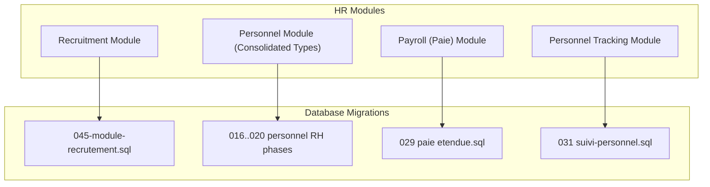
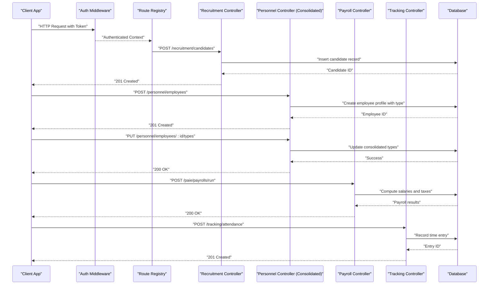
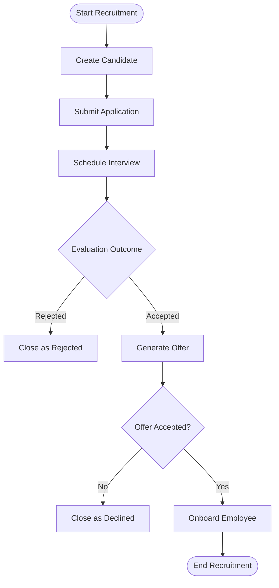
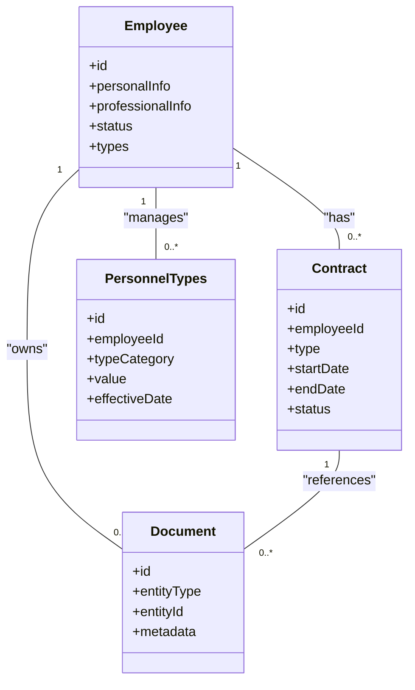
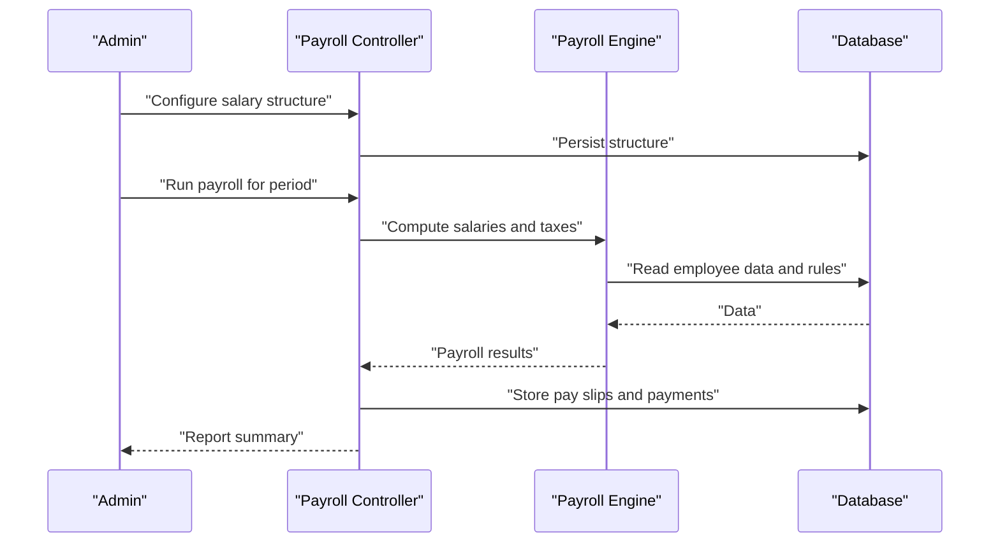
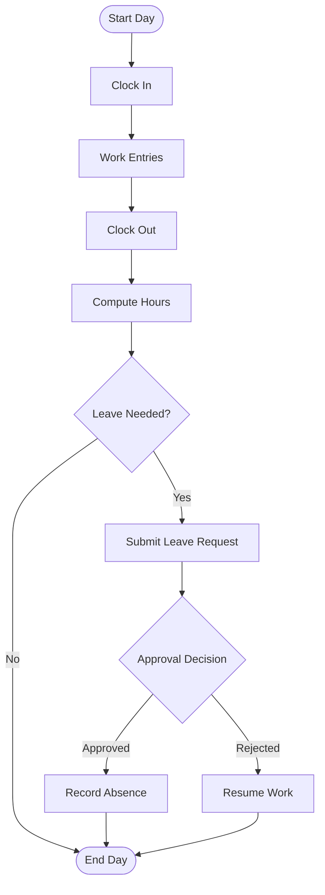
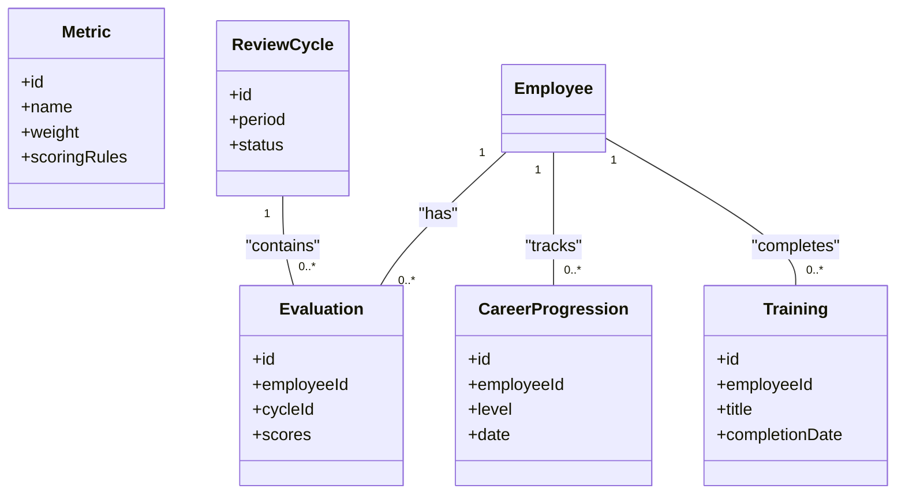
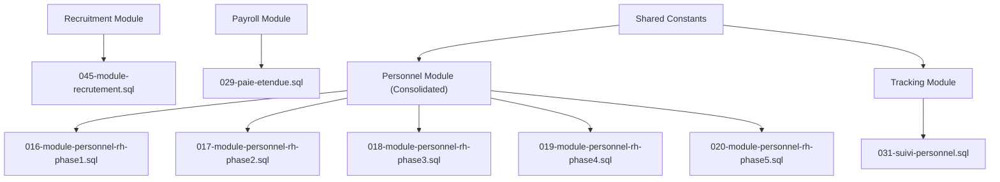

# Human Resources API

<cite>
**Referenced Files in This Document**
- [backend/src/modules/personnel/index.ts](file://backend/src/modules/personnel/index.ts)
- [backend/src/modules/recrutement/index.ts](file://backend/src/modules/recrutement/index.ts)
- [backend/src/modules/paie/index.ts](file://backend/src/modules/paie/index.ts)
- [backend/src/modules/suivi-personnel/index.ts](file://backend/src/modules/suivi-personnel/index.ts)
- [backend/database/migrations/045-module-recrutement.sql](file://backend/database/migrations/045-module-recrutement.sql)
- [backend/database/migrations/016-module-personnel-rh-phase1.sql](file://backend/database/migrations/016-module-personnel-rh-phase1.sql)
- [backend/database/migrations/017-module-personnel-rh-phase2.sql](file://backend/database/migrations/017-module-personnel-rh-phase2.sql)
- [backend/database/migrations/018-module-personnel-rh-phase3.sql](file://backend/database/migrations/018-module-personnel-rh-phase3.sql)
- [backend/database/migrations/019-module-personnel-rh-phase4.sql](file://backend/database/migrations/019-module-personnel-rh-phase4.sql)
- [backend/database/migrations/020-module-personnel-rh-phase5.sql](file://backend/database/migrations/020-module-personnel-rh-phase5.sql)
- [backend/database/migrations/029-paie-etendue.sql](file://backend/database/migrations/029-paie-etendue.sql)
- [backend/database/migrations/031-suivi-personnel.sql](file://backend/database/migrations/031-suivi-personnel.sql)
- [backend/src/shared/constants/personnel.constants.ts](file://backend/src/shared/constants/personnel.constants.ts)
</cite>

## Update Summary
**Changes Made**
- Updated Personnel Administration section to reflect consolidation of personnel type services
- Removed references to standalone personnel type endpoints that no longer exist
- Updated architecture diagrams to show consolidated service approach
- Revised dependency analysis to reflect integrated functionality

## Table of Contents
1. [Introduction](#introduction)
2. [Project Structure](#project-structure)
3. [Core Components](#core-components)
4. [Architecture Overview](#architecture-overview)
5. [Detailed Component Analysis](#detailed-component-analysis)
6. [Dependency Analysis](#dependency-analysis)
7. [Performance Considerations](#performance-considerations)
8. [Troubleshooting Guide](#troubleshooting-guide)
9. [Conclusion](#conclusion)
10. [Appendices](#appendices)

## Introduction
This document provides comprehensive API documentation for eLISAschool's human resources module, covering:
- Personnel administration: staff recruitment workflow, employee profiles, contract management, and document handling
- Payroll processing: salary structure configuration, tax calculations, payment processing, and payroll reports
- Attendance and leave management: time tracking systems, leave request workflows, absence monitoring, and attendance reports
- Performance evaluation: metrics, review workflows, career progression, and training management

The goal is to enable developers and integrators to implement HR workflows confidently using the available endpoints, data models, and relationships.

**Updated** The personnel type management has been consolidated into core services, eliminating separate type-specific endpoints in favor of a unified approach.

## Project Structure
The HR functionality is implemented across dedicated backend modules and database migrations:
- Recruitment module: manages candidate lifecycle and hiring workflow
- Personnel module: core employee profiles, contracts, documents, and consolidated type management
- Payroll (paie) module: salary structures, taxes, payments, and reporting
- Personnel tracking (suivi-personnel): attendance, leave requests, absences, and performance evaluations

**Diagram sources**
- [backend/src/modules/recrutement/index.ts](file://backend/src/modules/recrutement/index.ts)
- [backend/src/modules/personnel/index.ts](file://backend/src/modules/personnel/index.ts)
- [backend/src/modules/paie/index.ts](file://backend/src/modules/paie/index.ts)
- [backend/src/modules/suivi-personnel/index.ts](file://backend/src/modules/suivi-personnel/index.ts)
- [backend/database/migrations/045-module-recrutement.sql](file://backend/database/migrations/045-module-recrutement.sql)
- [backend/database/migrations/016-module-personnel-rh-phase1.sql](file://backend/database/migrations/016-module-personnel-rh-phase1.sql)
- [backend/database/migrations/017-module-personnel-rh-phase2.sql](file://backend/database/migrations/017-module-personnel-rh-phase2.sql)
- [backend/database/migrations/018-module-personnel-rh-phase3.sql](file://backend/database/migrations/018-module-personnel-rh-phase3.sql)
- [backend/database/migrations/019-module-personnel-rh-phase4.sql](file://backend/database/migrations/019-module-personnel-rh-phase4.sql)
- [backend/database/migrations/020-module-personnel-rh-phase5.sql](file://backend/database/migrations/020-module-personnel-rh-phase5.sql)
- [backend/database/migrations/029-paie-etendue.sql](file://backend/database/migrations/029-paie-etendue.sql)
- [backend/database/migrations/031-suivi-personnel.sql](file://backend/database/migrations/031-suivi-personnel.sql)

**Section sources**
- [backend/src/modules/recrutement/index.ts](file://backend/src/modules/recrutement/index.ts)
- [backend/src/modules/personnel/index.ts](file://backend/src/modules/personnel/index.ts)
- [backend/src/modules/paie/index.ts](file://backend/src/modules/paie/index.ts)
- [backend/src/modules/suivi-personnel/index.ts](file://backend/src/modules/suivi-personnel/index.ts)
- [backend/database/migrations/045-module-recrutement.sql](file://backend/database/migrations/045-module-recrutement.sql)
- [backend/database/migrations/016-module-personnel-rh-phase1.sql](file://backend/database/migrations/016-module-personnel-rh-phase1.sql)
- [backend/database/migrations/017-module-personnel-rh-phase2.sql](file://backend/database/migrations/017-module-personnel-rh-phase2.sql)
- [backend/database/migrations/018-module-personnel-rh-phase3.sql](file://backend/database/migrations/018-module-personnel-rh-phase3.sql)
- [backend/database/migrations/019-module-personnel-rh-phase4.sql](file://backend/database/migrations/019-module-personnel-rh-phase4.sql)
- [backend/database/migrations/020-module-personnel-rh-phase5.sql](file://backend/database/migrations/020-module-personnel-rh-phase5.sql)
- [backend/database/migrations/029-paie-etendue.sql](file://backend/database/migrations/029-paie-etendue.sql)
- [backend/database/migrations/031-suivi-personnel.sql](file://backend/database/migrations/031-suivi-personnel.sql)

## Core Components
- Recruitment API: Candidate registration, application submission, interview scheduling, offer generation, and onboarding triggers
- Personnel API: Employee profile CRUD, contract lifecycle, document storage and retrieval, status transitions, and **consolidated type management**
- Payroll API: Salary structure setup, tax rules, pay slips, payment runs, and payroll reports
- Attendance & Leave API: Time entries, leave requests/approvals, absence tracking, and attendance summaries
- Performance Evaluation API: Metrics definition, review cycles, career progression records, and training logs

These components are backed by well-defined database schemas created via migrations and exposed through REST endpoints within each module.

**Updated** Personnel type management is now integrated directly into the core personnel service rather than being handled by separate type-specific endpoints.

**Section sources**
- [backend/src/modules/recrutement/index.ts](file://backend/src/modules/recrutement/index.ts)
- [backend/src/modules/personnel/index.ts](file://backend/src/modules/personnel/index.ts)
- [backend/src/modules/paie/index.ts](file://backend/src/modules/paie/index.ts)
- [backend/src/modules/suivi-personnel/index.ts](file://backend/src/modules/suivi-personnel/index.ts)

## Architecture Overview
The HR system follows a modular architecture where each domain has its own controller/service layer and database schema. Endpoints are registered per module and share common authentication, authorization, and multi-tenant scoping. Personnel type operations are now handled within the consolidated personnel service.

**Diagram sources**
- [backend/src/modules/recrutement/index.ts](file://backend/src/modules/recrutement/index.ts)
- [backend/src/modules/personnel/index.ts](file://backend/src/modules/personnel/index.ts)
- [backend/src/modules/paie/index.ts](file://backend/src/modules/paie/index.ts)
- [backend/src/modules/suivi-personnel/index.ts](file://backend/src/modules/suivi-personnel/index.ts)

## Detailed Component Analysis

### Recruitment API
Covers candidate lifecycle from application to onboarding. Typical operations include creating candidates, submitting applications, scheduling interviews, issuing offers, and transitioning to employee records.

Key concepts:
- Candidate entity with application history
- Interview sessions and outcomes
- Offer letters and acceptance flow
- Onboarding trigger that creates an employee profile

**Diagram sources**
- [backend/database/migrations/045-module-recrutement.sql](file://backend/database/migrations/045-module-recrutement.sql)
- [backend/src/modules/recrutement/index.ts](file://backend/src/modules/recrutement/index.ts)

**Section sources**
- [backend/src/modules/recrutement/index.ts](file://backend/src/modules/recrutement/index.ts)
- [backend/database/migrations/045-module-recrutement.sql](file://backend/database/migrations/045-module-recrutement.sql)

### Personnel Administration API
Handles employee profiles, contracts, documents, and **consolidated type management**. Includes creation, updates, status transitions, attachment handling, and integrated personnel type operations.

Key concepts:
- Employee profile with personal and professional details
- Contract types and lifecycle states
- Document attachments linked to employees or contracts
- Status transitions (active, inactive, terminated)
- **Consolidated personnel type management within core service**

**Updated** Personnel type management is now integrated directly into the employee entity and core service, eliminating the need for separate type-specific endpoints.

**Diagram sources**
- [backend/database/migrations/016-module-personnel-rh-phase1.sql](file://backend/database/migrations/016-module-personnel-rh-phase1.sql)
- [backend/database/migrations/017-module-personnel-rh-phase2.sql](file://backend/database/migrations/017-module-personnel-rh-phase2.sql)
- [backend/database/migrations/018-module-personnel-rh-phase3.sql](file://backend/database/migrations/018-module-personnel-rh-phase3.sql)
- [backend/database/migrations/019-module-personnel-rh-phase4.sql](file://backend/database/migrations/019-module-personnel-rh-phase4.sql)
- [backend/database/migrations/020-module-personnel-rh-phase5.sql](file://backend/database/migrations/020-module-personnel-rh-phase5.sql)
- [backend/src/modules/personnel/index.ts](file://backend/src/modules/personnel/index.ts)

**Section sources**
- [backend/src/modules/personnel/index.ts](file://backend/src/modules/personnel/index.ts)
- [backend/database/migrations/016-module-personnel-rh-phase1.sql](file://backend/database/migrations/016-module-personnel-rh-phase1.sql)
- [backend/database/migrations/017-module-personnel-rh-phase2.sql](file://backend/database/migrations/017-module-personnel-rh-phase2.sql)
- [backend/database/migrations/018-module-personnel-rh-phase3.sql](file://backend/database/migrations/018-module-personnel-rh-phase3.sql)
- [backend/database/migrations/019-module-personnel-rh-phase4.sql](file://backend/database/migrations/019-module-personnel-rh-phase4.sql)
- [backend/database/migrations/020-module-personnel-rh-phase5.sql](file://backend/database/migrations/020-module-personnel-rh-phase5.sql)

### Payroll Processing API
Provides salary structure configuration, tax calculations, pay slip generation, payment runs, and payroll reports.

Key concepts:
- Salary components (base, allowances, deductions)
- Tax rules and brackets
- Payroll run execution and batch processing
- Reports summarizing totals, taxes, and net pay

**Diagram sources**
- [backend/src/modules/paie/index.ts](file://backend/src/modules/paie/index.ts)
- [backend/database/migrations/029-paie-etendue.sql](file://backend/database/migrations/029-paie-etendue.sql)

**Section sources**
- [backend/src/modules/paie/index.ts](file://backend/src/modules/paie/index.ts)
- [backend/database/migrations/029-paie-etendue.sql](file://backend/database/migrations/029-paie-etendue.sql)

### Attendance and Leave Management API
Supports time tracking, leave requests, approvals, absence monitoring, and attendance reports.

Key concepts:
- Time entries for daily attendance
- Leave request lifecycle (submitted, approved, rejected)
- Absence aggregation and alerts
- Attendance summaries by period and employee

**Diagram sources**
- [backend/src/modules/suivi-personnel/index.ts](file://backend/src/modules/suivi-personnel/index.ts)
- [backend/database/migrations/031-suivi-personnel.sql](file://backend/database/migrations/031-suivi-personnel.sql)

**Section sources**
- [backend/src/modules/suivi-personnel/index.ts](file://backend/src/modules/suivi-personnel/index.ts)
- [backend/database/migrations/031-suivi-personnel.sql](file://backend/database/migrations/031-suivi-personnel.sql)

### Performance Evaluation API
Manages metrics, review cycles, career progression, and training management.

Key concepts:
- Metrics definitions and scoring
- Review cycle orchestration
- Career progression records tied to employee profiles
- Training logs and certifications

**Diagram sources**
- [backend/src/modules/suivi-personnel/index.ts](file://backend/src/modules/suivi-personnel/index.ts)
- [backend/database/migrations/031-suivi-personnel.sql](file://backend/database/migrations/031-suivi-personnel.sql)

**Section sources**
- [backend/src/modules/suivi-personnel/index.ts](file://backend/src/modules/suivi-personnel/index.ts)
- [backend/database/migrations/031-suivi-personnel.sql](file://backend/database/migrations/031-suivi-personnel.sql)

## Dependency Analysis
HR modules depend on shared constants and database schemas defined in migrations. The following diagram shows module-to-migration dependencies and shared constants usage. Personnel type functionality is now consolidated within the core personnel service.

**Updated** Personnel type management is now part of the consolidated personnel service rather than a separate module.

**Diagram sources**
- [backend/src/modules/recrutement/index.ts](file://backend/src/modules/recrutement/index.ts)
- [backend/src/modules/personnel/index.ts](file://backend/src/modules/personnel/index.ts)
- [backend/src/modules/paie/index.ts](file://backend/src/modules/paie/index.ts)
- [backend/src/modules/suivi-personnel/index.ts](file://backend/src/modules/suivi-personnel/index.ts)
- [backend/database/migrations/045-module-recrutement.sql](file://backend/database/migrations/045-module-recrutement.sql)
- [backend/database/migrations/016-module-personnel-rh-phase1.sql](file://backend/database/migrations/016-module-personnel-rh-phase1.sql)
- [backend/database/migrations/017-module-personnel-rh-phase2.sql](file://backend/database/migrations/017-module-personnel-rh-phase2.sql)
- [backend/database/migrations/018-module-personnel-rh-phase3.sql](file://backend/database/migrations/018-module-personnel-rh-phase3.sql)
- [backend/database/migrations/019-module-personnel-rh-phase4.sql](file://backend/database/migrations/019-module-personnel-rh-phase4.sql)
- [backend/database/migrations/020-module-personnel-rh-phase5.sql](file://backend/database/migrations/020-module-personnel-rh-phase5.sql)
- [backend/database/migrations/029-paie-etendue.sql](file://backend/database/migrations/029-paie-etendue.sql)
- [backend/database/migrations/031-suivi-personnel.sql](file://backend/database/migrations/031-suivi-personnel.sql)
- [backend/src/shared/constants/personnel.constants.ts](file://backend/src/shared/constants/personnel.constants.ts)

**Section sources**
- [backend/src/modules/recrutement/index.ts](file://backend/src/modules/recrutement/index.ts)
- [backend/src/modules/personnel/index.ts](file://backend/src/modules/personnel/index.ts)
- [backend/src/modules/paie/index.ts](file://backend/src/modules/paie/index.ts)
- [backend/src/modules/suivi-personnel/index.ts](file://backend/src/modules/suivi-personnel/index.ts)
- [backend/src/shared/constants/personnel.constants.ts](file://backend/src/shared/constants/personnel.constants.ts)
- [backend/database/migrations/045-module-recrutement.sql](file://backend/database/migrations/045-module-recrutement.sql)
- [backend/database/migrations/016-module-personnel-rh-phase1.sql](file://backend/database/migrations/016-module-personnel-rh-phase1.sql)
- [backend/database/migrations/017-module-personnel-rh-phase2.sql](file://backend/database/migrations/017-module-personnel-rh-phase2.sql)
- [backend/database/migrations/018-module-personnel-rh-phase3.sql](file://backend/database/migrations/018-module-personnel-rh-phase3.sql)
- [backend/database/migrations/019-module-personnel-rh-phase4.sql](file://backend/database/migrations/019-module-personnel-rh-phase4.sql)
- [backend/database/migrations/020-module-personnel-rh-phase5.sql](file://backend/database/migrations/020-module-personnel-rh-phase5.sql)
- [backend/database/migrations/029-paie-etendue.sql](file://backend/database/migrations/029-paie-etendue.sql)
- [backend/database/migrations/031-suivi-personnel.sql](file://backend/database/migrations/031-suivi-personnel.sql)

## Performance Considerations
- Use pagination and filtering on list endpoints to reduce payload sizes
- Batch payroll computations to avoid long-running transactions
- Index frequently queried fields (e.g., employeeId, date ranges) as defined in migrations
- Cache static configurations like salary structures and tax rules when appropriate
- Monitor database query performance and adjust indexes based on workload patterns
- **Consolidated personnel type operations reduce API call overhead and improve response times**

## Troubleshooting Guide
Common issues and resolutions:
- Authentication failures: Ensure tokens are valid and include required scopes; verify multi-tenant context headers
- Permission errors: Confirm user roles have necessary permissions for HR endpoints
- Data integrity errors: Validate foreign key constraints between recruitment, personnel, and payroll entities
- Payroll computation errors: Check salary structure and tax rule configurations; validate input data completeness
- Attendance anomalies: Verify clock-in/out timestamps and timezone settings; reconcile leave approvals with absence records
- **Personnel type errors**: Since type management is now consolidated, ensure all type operations use the main personnel endpoints rather than deprecated type-specific routes

**Updated** Personnel type-related issues should now be resolved through the consolidated personnel service endpoints.

**Section sources**
- [backend/src/shared/constants/personnel.constants.ts](file://backend/src/shared/constants/personnel.constants.ts)

## Conclusion
The eLISAschool HR API provides a robust set of endpoints to manage recruitment, personnel, payroll, attendance, leave, and performance evaluation. The recent consolidation of personnel type management into the core service improves efficiency and simplifies the API surface. By leveraging the documented workflows, data models, and relationships, integrators can build reliable HR processes aligned with institutional needs.

**Updated** The consolidation of personnel type services eliminates redundant endpoints and provides a more streamlined approach to managing employee classifications and attributes.

## Appendices

### Example HR Workflows
- Recruitment to Onboarding: Create candidate → submit application → schedule interview → issue offer → accept offer → onboard employee
- **Consolidated Personnel Management**: Create employee → set basic info → assign types → manage contracts → handle documents
- Payroll Run: Configure salary structure → compute taxes → generate pay slips → execute payments → produce report
- Attendance and Leave: Clock in/out → submit leave request → approve/reject → record absence → generate attendance report
- Performance Review: Define metrics → initiate review cycle → evaluate scores → update career progression → log training

**Updated** Personnel management workflow now includes consolidated type assignment within the main employee management process.