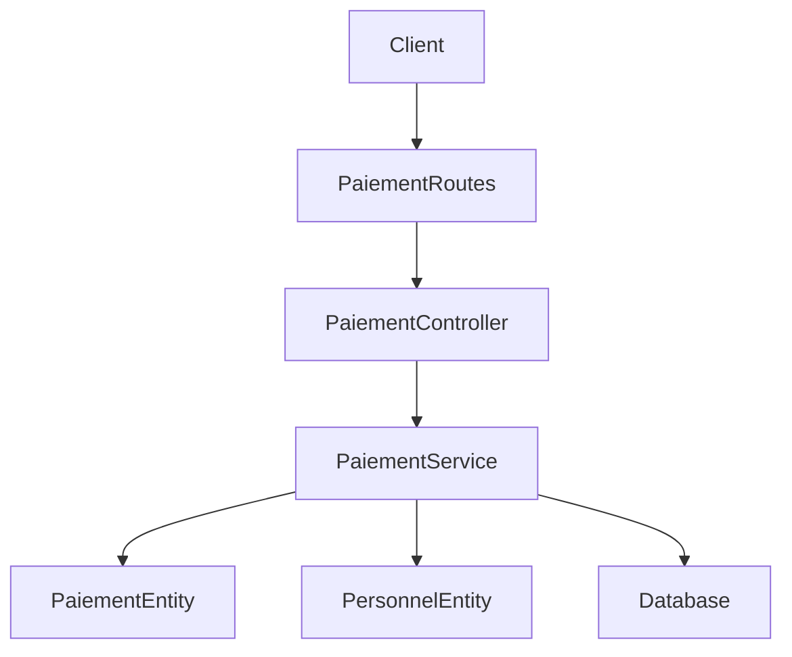
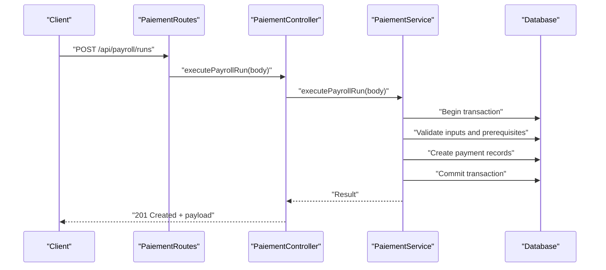
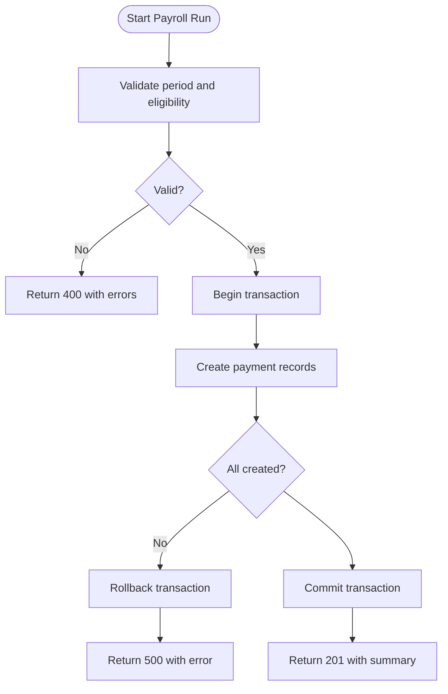
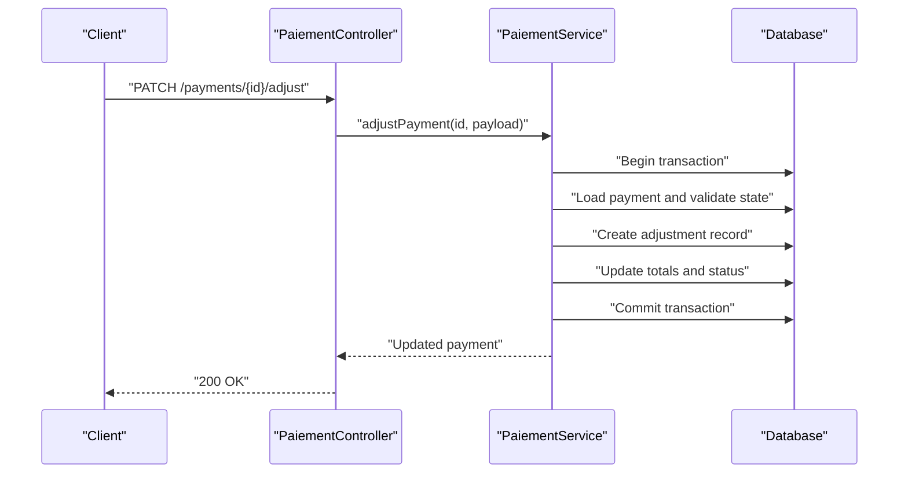
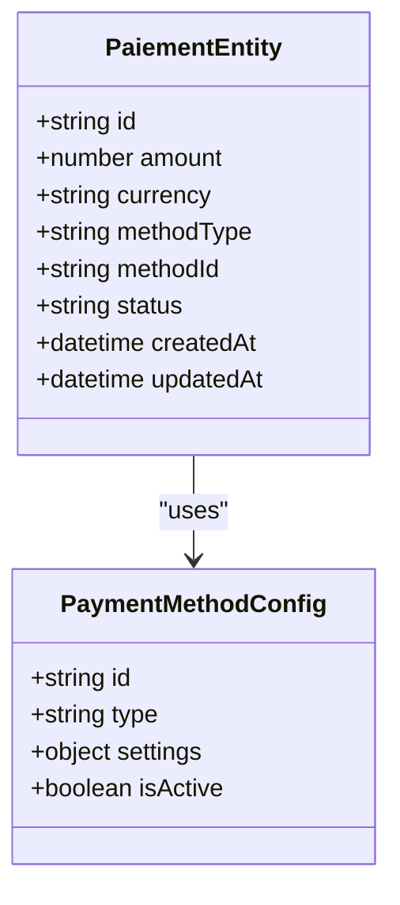
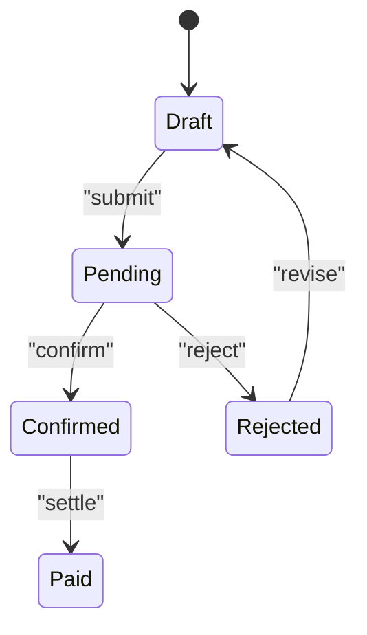
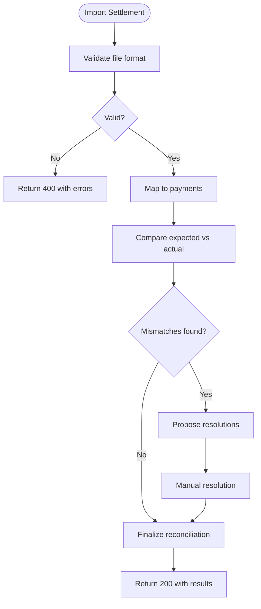
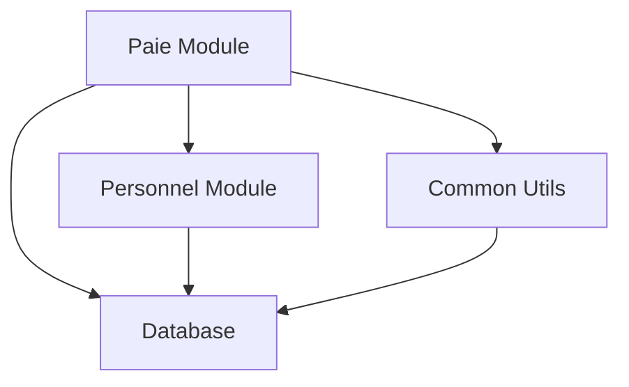

# Payment Processing API

<cite>
**Referenced Files in This Document**
- [backend/src/modules/paie/controllers/PaiementController.ts](file://backend/src/modules/paie/controllers/PaiementController.ts)
- [backend/src/modules/paie/services/PaiementService.ts](file://backend/src/modules/paie/services/PaiementService.ts)
- [backend/src/modules/paie/entities/PaiementEntity.ts](file://backend/src/modules/paie/entities/PaiementEntity.ts)
- [backend/src/modules/paie/dto/PaiementDto.ts](file://backend/src/modules/paie/dto/PaiementDto.ts)
- [backend/src/modules/paie/routes/PaiementRoutes.ts](file://backend/src/modules/paie/routes/PaiementRoutes.ts)
- [backend/database/migrations/029-paie-etendue.sql](file://backend/database/migrations/029-paie-etendue.sql)
- [backend/src/modules/personnel/controllers/PersonnelController.ts](file://backend/src/modules/personnel/controllers/PersonnelController.ts)
- [backend/src/modules/personnel/entities/PersonnelEntity.ts](file://backend/src/modules/personnel/entities/PersonnelEntity.ts)
- [backend/src/common/utils/validation.util.ts](file://backend/src/common/utils/validation.util.ts)
- [backend/src/common/filters/global-error.filter.ts](file://backend/src/common/filters/global-error.filter.ts)
</cite>

## Table of Contents
1. [Introduction](#introduction)
2. [Project Structure](#project-structure)
3. [Core Components](#core-components)
4. [Architecture Overview](#architecture-overview)
5. [Detailed Component Analysis](#detailed-component-analysis)
6. [Dependency Analysis](#dependency-analysis)
7. [Performance Considerations](#performance-considerations)
8. [Troubleshooting Guide](#troubleshooting-guide)
9. [Conclusion](#conclusion)

## Introduction
This document provides comprehensive API documentation for payroll payment processing endpoints, covering:
- Payroll run execution APIs for batch salary processing and payment generation
- Individual payment APIs for manual payments, adjustments, and corrections
- Payment method configuration APIs for bank transfers, cash payments, and digital wallets
- Payment confirmation workflows, reconciliation processes, and status tracking
- Validation rules, error handling strategies, and transaction management patterns

The goal is to enable developers and integrators to implement robust payroll payment flows with clear contracts, consistent error responses, and reliable state transitions.

## Project Structure
The payroll payment functionality is implemented under the paie module with a layered architecture:
- Controllers expose REST endpoints
- Services encapsulate business logic and orchestrate transactions
- Entities model persistent data
- DTOs define request/response schemas
- Routes register HTTP paths
- Database migrations define schema structures

**Diagram sources**
- [backend/src/modules/paie/routes/PaiementRoutes.ts](file://backend/src/modules/paie/routes/PaiementRoutes.ts)
- [backend/src/modules/paie/controllers/PaiementController.ts](file://backend/src/modules/paie/controllers/PaiementController.ts)
- [backend/src/modules/paie/services/PaiementService.ts](file://backend/src/modules/paie/services/PaiementService.ts)
- [backend/src/modules/paie/entities/PaiementEntity.ts](file://backend/src/modules/paie/entities/PaiementEntity.ts)
- [backend/src/modules/personnel/entities/PersonnelEntity.ts](file://backend/src/modules/personnel/entities/PersonnelEntity.ts)

**Section sources**
- [backend/src/modules/paie/routes/PaiementRoutes.ts](file://backend/src/modules/paie/routes/PaiementRoutes.ts)
- [backend/src/modules/paie/controllers/PaiementController.ts](file://backend/src/modules/paie/controllers/PaiementController.ts)
- [backend/src/modules/paie/services/PaiementService.ts](file://backend/src/modules/paie/services/PaiementService.ts)
- [backend/src/modules/paie/entities/PaiementEntity.ts](file://backend/src/modules/paie/entities/PaiementEntity.ts)
- [backend/src/modules/personnel/entities/PersonnelEntity.ts](file://backend/src/modules/personnel/entities/PersonnelEntity.ts)

## Core Components
- PaiementController: Defines REST endpoints for payroll runs, individual payments, adjustments, corrections, confirmations, and reconciliations.
- PaiementService: Implements business logic, validation, transaction boundaries, and integration with personnel data.
- PaiementEntity: Represents payment records, including amount, currency, method, status, and audit fields.
- PaiementDto: Request/response payloads for all payment operations.
- PaiementRoutes: Registers routes and binds them to controller methods.
- PersonnelEntity: Provides employee context used during payroll calculations and payment creation.

Key responsibilities:
- Input validation and normalization
- Business rule enforcement (e.g., negative amounts disallowed, required fields present)
- Transactional consistency across related entities
- Status transitions and audit logging
- Error mapping and standardized error responses

**Section sources**
- [backend/src/modules/paie/controllers/PaiementController.ts](file://backend/src/modules/paie/controllers/PaiementController.ts)
- [backend/src/modules/paie/services/PaiementService.ts](file://backend/src/modules/paie/services/PaiementService.ts)
- [backend/src/modules/paie/entities/PaiementEntity.ts](file://backend/src/modules/paie/entities/PaiementEntity.ts)
- [backend/src/modules/paie/dto/PaiementDto.ts](file://backend/src/modules/paie/dto/PaiementDto.ts)
- [backend/src/modules/paie/routes/PaiementRoutes.ts](file://backend/src/modules/paie/routes/PaiementRoutes.ts)
- [backend/src/modules/personnel/entities/PersonnelEntity.ts](file://backend/src/modules/personnel/entities/PersonnelEntity.ts)

## Architecture Overview
The system follows a typical layered architecture with clear separation of concerns:
- HTTP layer: Routes and controllers handle requests, parse bodies, and return responses
- Service layer: Encapsulates domain logic, orchestrates database operations, and enforces constraints
- Data layer: Entities and repositories persist data and manage relationships

**Diagram sources**
- [backend/src/modules/paie/routes/PaiementRoutes.ts](file://backend/src/modules/paie/routes/PaiementRoutes.ts)
- [backend/src/modules/paie/controllers/PaiementController.ts](file://backend/src/modules/paie/controllers/PaiementController.ts)
- [backend/src/modules/paie/services/PaiementService.ts](file://backend/src/modules/paie/services/PaiementService.ts)

## Detailed Component Analysis

### Payroll Run Execution APIs
Purpose: Execute batch payroll runs to generate multiple payments for employees within a period.

Endpoints:
- POST /api/payroll/runs: Create and execute a payroll run
- GET /api/payroll/runs/{id}: Retrieve payroll run details
- PUT /api/payroll/runs/{id}/confirm: Confirm payroll run after review
- DELETE /api/payroll/runs/{id}: Cancel or rollback a payroll run

Request body highlights:
- Period identifiers (start/end dates)
- Employee selection criteria or explicit list
- Payment method defaults
- Currency and rounding rules
- Optional notes and approval flags

Response highlights:
- Payroll run ID and status
- Summary counts (created, failed, pending)
- Errors per employee if partial failures occur

Validation rules:
- Period must be valid and not closed
- At least one eligible employee must exist
- Amounts must be non-negative and within configured limits
- Required fields must be present and well-formed

Error handling:
- 400 Bad Request for invalid input
- 409 Conflict for closed periods or duplicate runs
- 500 Internal Server Error for unexpected failures
- Partial success returns aggregated errors with per-employee messages

Transaction management:
- Begin transaction before creating payment records
- Commit on success; rollback on any failure
- Ensure idempotency via unique run identifiers

**Diagram sources**
- [backend/src/modules/paie/services/PaiementService.ts](file://backend/src/modules/paie/services/PaiementService.ts)
- [backend/src/modules/paie/controllers/PaiementController.ts](file://backend/src/modules/paie/controllers/PaiementController.ts)

**Section sources**
- [backend/src/modules/paie/controllers/PaiementController.ts](file://backend/src/modules/paie/controllers/PaiementController.ts)
- [backend/src/modules/paie/services/PaiementService.ts](file://backend/src/modules/paie/services/PaiementService.ts)
- [backend/src/modules/paie/dto/PaiementDto.ts](file://backend/src/modules/paie/dto/PaiementDto.ts)

### Individual Payment APIs
Purpose: Create, adjust, correct, and manage individual payments outside of batch runs.

Endpoints:
- POST /api/payments: Create an individual payment
- PATCH /api/payments/{id}/adjust: Apply an adjustment (positive/negative)
- PATCH /api/payments/{id}/correct: Correct a payment (reissue with corrected values)
- GET /api/payments/{id}: Retrieve payment details
- DELETE /api/payments/{id}: Void or cancel a payment

Request body highlights:
- Employee identifier
- Amount and currency
- Payment method and reference
- Reason codes for adjustments/corrections
- Approval metadata when required

Validation rules:
- Amount must be non-zero and within allowed bounds
- Adjustment type determines sign and limits
- Correction requires original payment existence and matching period
- Method-specific fields validated (e.g., bank account presence for transfers)

Status transitions:
- Draft -> Pending -> Confirmed -> Paid
- Adjustments and corrections create new linked records while preserving audit trail

Error handling:
- 400 for validation failures
- 404 for missing payments
- 409 for conflicting states (e.g., adjusting already paid)
- 500 for internal errors

Transaction management:
- Each operation wrapped in a transaction
- Idempotent keys supported for safe retries

**Diagram sources**
- [backend/src/modules/paie/controllers/PaiementController.ts](file://backend/src/modules/paie/controllers/PaiementController.ts)
- [backend/src/modules/paie/services/PaiementService.ts](file://backend/src/modules/paie/services/PaiementService.ts)

**Section sources**
- [backend/src/modules/paie/controllers/PaiementController.ts](file://backend/src/modules/paie/controllers/PaiementController.ts)
- [backend/src/modules/paie/services/PaiementService.ts](file://backend/src/modules/paie/services/PaiementService.ts)
- [backend/src/modules/paie/dto/PaiementDto.ts](file://backend/src/modules/paie/dto/PaiementDto.ts)

### Payment Method Configuration APIs
Purpose: Configure and manage payment methods for bank transfers, cash payments, and digital wallets.

Endpoints:
- POST /api/payment-methods: Create a payment method
- GET /api/payment-methods: List available methods
- GET /api/payment-methods/{id}: Retrieve method details
- PUT /api/payment-methods/{id}: Update method settings
- DELETE /api/payment-methods/{id}: Remove method

Configuration fields:
- Type (bank_transfer, cash, digital_wallet)
- Provider-specific settings (e.g., bank account, wallet provider)
- Default currency and fee rules
- Active/inactive flag

Validation rules:
- Type-specific mandatory fields enforced
- Duplicate configurations prevented
- Removal blocked if method is referenced by active payments

Error handling:
- 400 for invalid configuration
- 409 for conflicts (e.g., deletion with references)
- 500 for unexpected failures

**Diagram sources**
- [backend/src/modules/paie/entities/PaiementEntity.ts](file://backend/src/modules/paie/entities/PaiementEntity.ts)

**Section sources**
- [backend/src/modules/paie/controllers/PaiementController.ts](file://backend/src/modules/paie/controllers/PaiementController.ts)
- [backend/src/modules/paie/services/PaiementService.ts](file://backend/src/modules/paie/services/PaiementService.ts)
- [backend/src/modules/paie/entities/PaiementEntity.ts](file://backend/src/modules/paie/entities/PaiementEntity.ts)

### Payment Confirmation Workflows
Purpose: Approve and finalize payments or payroll runs after review.

Endpoints:
- POST /api/payments/{id}/confirm: Confirm an individual payment
- PUT /api/payroll/runs/{runId}/confirm: Confirm a payroll run

Workflow:
- Verify permissions and prerequisites
- Transition status to confirmed
- Generate confirmation artifacts (receipts, notifications)
- Persist audit entries

Validation rules:
- Only pending payments can be confirmed
- Required approvals satisfied
- No conflicting modifications in progress

Error handling:
- 400 for invalid state transitions
- 403 for insufficient permissions
- 409 for concurrent updates
- 500 for internal errors

**Diagram sources**
- [backend/src/modules/paie/services/PaiementService.ts](file://backend/src/modules/paie/services/PaiementService.ts)

**Section sources**
- [backend/src/modules/paie/controllers/PaiementController.ts](file://backend/src/modules/paie/controllers/PaiementController.ts)
- [backend/src/modules/paie/services/PaiementService.ts](file://backend/src/modules/paie/services/PaiementService.ts)

### Reconciliation Processes
Purpose: Match external settlement records with internal payment records to ensure accuracy.

Endpoints:
- POST /api/reconciliations: Import and reconcile settlement files
- GET /api/reconciliations/{id}: View reconciliation results
- PATCH /api/reconciliations/{id}/resolve: Resolve discrepancies manually

Process:
- Parse settlement file and map to payment IDs
- Compare expected vs actual amounts and statuses
- Flag mismatches and propose resolutions
- Allow manual overrides with audit trails

Validation rules:
- File format and encoding validated
- Mapping keys must match existing payments
- Resolutions require justification and approver

Error handling:
- 400 for malformed files or invalid mappings
- 404 for missing payments
- 409 for conflicting resolutions
- 500 for processing failures

**Diagram sources**
- [backend/src/modules/paie/services/PaiementService.ts](file://backend/src/modules/paie/services/PaiementService.ts)

**Section sources**
- [backend/src/modules/paie/controllers/PaiementController.ts](file://backend/src/modules/paie/controllers/PaiementController.ts)
- [backend/src/modules/paie/services/PaiementService.ts](file://backend/src/modules/paie/services/PaiementService.ts)

### Payment Status Tracking
Purpose: Query and monitor payment lifecycle states.

Endpoints:
- GET /api/payments?status=...&period=...&method=...: Filtered listing
- GET /api/payments/{id}/history: Audit history for a payment
- GET /api/payroll/runs/{id}/payments: Payments generated by a run

Features:
- Pagination and sorting
- Rich filtering by status, method, period, employee
- Detailed history with timestamps and actors

Error handling:
- 400 for invalid filters
- 404 for missing resources
- 500 for server errors

**Section sources**
- [backend/src/modules/paie/controllers/PaiementController.ts](file://backend/src/modules/paie/controllers/PaiementController.ts)
- [backend/src/modules/paie/services/PaiementService.ts](file://backend/src/modules/paie/services/PaiementService.ts)

## Dependency Analysis
The payroll payment module depends on:
- Personnel module for employee data and eligibility checks
- Common utilities for validation and error handling
- Database layer for persistence and transactions

**Diagram sources**
- [backend/src/modules/paie/services/PaiementService.ts](file://backend/src/modules/paie/services/PaiementService.ts)
- [backend/src/modules/personnel/controllers/PersonnelController.ts](file://backend/src/modules/personnel/controllers/PersonnelController.ts)
- [backend/src/common/utils/validation.util.ts](file://backend/src/common/utils/validation.util.ts)

**Section sources**
- [backend/src/modules/paie/services/PaiementService.ts](file://backend/src/modules/paie/services/PaiementService.ts)
- [backend/src/modules/personnel/controllers/PersonnelController.ts](file://backend/src/modules/personnel/controllers/PersonnelController.ts)
- [backend/src/common/utils/validation.util.ts](file://backend/src/common/utils/validation.util.ts)

## Performance Considerations
- Use pagination for large lists of payments and runs
- Batch operations should leverage transactions to reduce round-trips
- Index frequently queried fields (status, period, method)
- Avoid N+1 queries by eager loading related entities
- Cache static configuration like payment methods where appropriate

[No sources needed since this section provides general guidance]

## Troubleshooting Guide
Common issues and resolutions:
- Validation errors: Check request payloads against DTO schemas and ensure required fields are present
- State conflicts: Verify current payment status before attempting transitions
- Transaction failures: Inspect logs for constraint violations or deadlocks
- Permission denied: Confirm user roles and permissions for the requested action

Diagnostic tools:
- Global error filter captures and standardizes error responses
- Audit trails provide detailed histories for payments and runs

**Section sources**
- [backend/src/common/filters/global-error.filter.ts](file://backend/src/common/filters/global-error.filter.ts)
- [backend/src/modules/paie/services/PaiementService.ts](file://backend/src/modules/paie/services/PaiementService.ts)

## Conclusion
The payroll payment processing APIs provide a robust foundation for batch and individual payment operations, with strong validation, transactional integrity, and comprehensive status tracking. By following the documented workflows and error handling strategies, integrators can build reliable payroll systems that support diverse payment methods and reconciliation needs.

[No sources needed since this section summarizes without analyzing specific files]