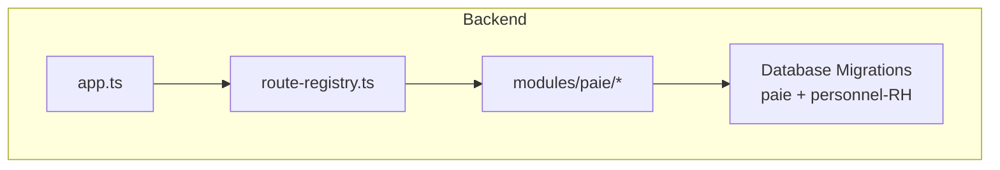
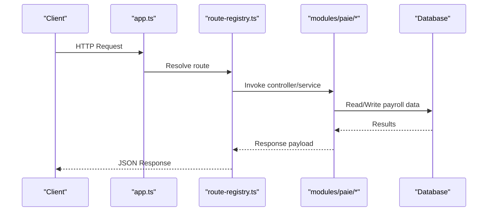
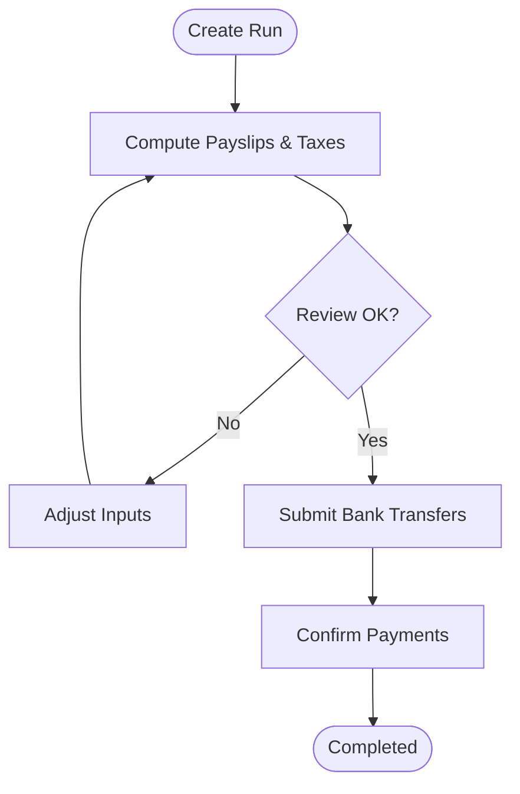
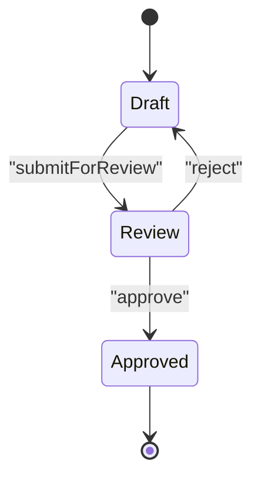
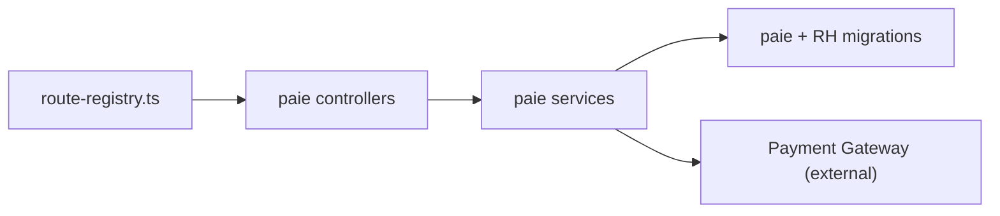
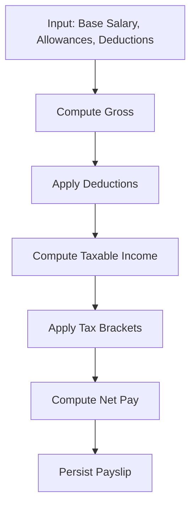

# Payroll Processing API

<cite>
**Referenced Files in This Document**
- [backend/src/modules/paie/](file://backend/src/modules/paie/)
- [backend/database/migrations/029-paie-etendue.sql](file://backend/database/migrations/029-paie-etendue.sql)
- [backend/database/migrations/016-module-personnel-rh-phase1.sql](file://backend/database/migrations/016-module-personnel-rh-phase1.sql)
- [backend/database/migrations/017-module-personnel-rh-phase2.sql](file://backend/database/migrations/017-module-personnel-rh-phase2.sql)
- [backend/database/migrations/018-module-personnel-rh-phase3.sql](file://backend/database/migrations/018-module-personnel-rh-phase3.sql)
- [backend/database/migrations/019-module-personnel-rh-phase4.sql](file://backend/database/migrations/019-module-personnel-rh-phase4.sql)
- [backend/database/migrations/020-module-personnel-rh-phase5.sql](file://backend/database/migrations/020-module-personnel-rh-phase5.sql)
- [backend/database/migrations/022-module-personnel-rh-complete.sql](file://backend/database/migrations/022-module-personnel-rh-complete.sql)
- [backend/database/migrations/026-personnel-champs-additionnels.sql](file://backend/database/migrations/026-personnel-champs-additionnels.sql)
- [backend/src/routes/route-registry.ts](file://backend/src/routes/route-registry.ts)
- [backend/src/app.ts](file://backend/src/app.ts)
- [backend/src/index.ts](file://backend/src/index.ts)
</cite>

## Table of Contents
1. [Introduction](#introduction)
2. [Project Structure](#project-structure)
3. [Core Components](#core-components)
4. [Architecture Overview](#architecture-overview)
5. [Detailed Component Analysis](#detailed-component-analysis)
6. [Dependency Analysis](#dependency-analysis)
7. [Performance Considerations](#performance-considerations)
8. [Troubleshooting Guide](#troubleshooting-guide)
9. [Conclusion](#conclusion)
10. [Appendices](#appendices)

## Introduction
This document provides comprehensive API documentation for eLISAschool’s payroll processing capabilities. It covers:
- Salary structure configuration (base salaries, allowances, deductions, tax calculations)
- Payment processing (payroll runs, payment methods, bank transfers, confirmations)
- Payroll reporting (payslips, tax reports, financial summaries)
- Salary history tracking and pay adjustment workflows
- Compliance reporting and auditability

The goal is to enable developers and administrators to integrate with the payroll module confidently, including validation rules, error handling, and best practices.

## Project Structure
Payroll functionality is implemented under a dedicated module and supported by database migrations that define entities and relationships. The application registers routes centrally and boots via an entrypoint file.

**Diagram sources**
- [backend/src/app.ts](file://backend/src/app.ts)
- [backend/src/routes/route-registry.ts](file://backend/src/routes/route-registry.ts)
- [backend/src/modules/paie/](file://backend/src/modules/paie/)
- [backend/database/migrations/029-paie-etendue.sql](file://backend/database/migrations/029-paie-etendue.sql)

**Section sources**
- [backend/src/app.ts](file://backend/src/app.ts)
- [backend/src/routes/route-registry.ts](file://backend/src/routes/route-registry.ts)
- [backend/src/index.ts](file://backend/src/index.ts)

## Core Components
The payroll module exposes REST endpoints organized around these domains:
- Salary Structure Configuration
  - Base salary definitions per position or employee
  - Allowances and deductions catalogs and assignments
  - Tax rules and brackets
- Payment Processing
  - Payroll run creation and execution
  - Payment method selection (bank transfer, cash, etc.)
  - Bank transfer details and batch submission
  - Payment confirmation and reconciliation
- Reporting
  - Payslip generation per employee and period
  - Tax reports (withholding, totals, compliance)
  - Financial summaries (by department, cost center, period)
- History and Adjustments
  - Salary history log (changes over time)
  - Pay adjustment workflow (draft, review, approval)
- Compliance and Audit
  - Audit trail for changes
  - Regulatory report exports

Key implementation locations:
- Controllers and services under modules/paie
- Data models and constraints defined in payroll and HR migrations
- Route registration and app bootstrap files

**Section sources**
- [backend/src/modules/paie/](file://backend/src/modules/paie/)
- [backend/database/migrations/029-paie-etendue.sql](file://backend/database/migrations/029-paie-etendue.sql)
- [backend/database/migrations/016-module-personnel-rh-phase1.sql](file://backend/database/migrations/016-module-personnel-rh-phase1.sql)
- [backend/database/migrations/017-module-personnel-rh-phase2.sql](file://backend/database/migrations/017-module-personnel-rh-phase2.sql)
- [backend/database/migrations/018-module-personnel-rh-phase3.sql](file://backend/database/migrations/018-module-personnel-rh-phase3.sql)
- [backend/database/migrations/019-module-personnel-rh-phase4.sql](file://backend/database/migrations/019-module-personnel-rh-phase4.sql)
- [backend/database/migrations/020-module-personnel-rh-phase5.sql](file://backend/database/migrations/020-module-personnel-rh-phase5.sql)
- [backend/database/migrations/022-module-personnel-rh-complete.sql](file://backend/database/migrations/022-module-personnel-rh-complete.sql)
- [backend/database/migrations/026-personnel-champs-additionnels.sql](file://backend/database/migrations/026-personnel-champs-additionnels.sql)

## Architecture Overview
High-level flow from client request to persistence and response:

**Diagram sources**
- [backend/src/app.ts](file://backend/src/app.ts)
- [backend/src/routes/route-registry.ts](file://backend/src/routes/route-registry.ts)
- [backend/src/modules/paie/](file://backend/src/modules/paie/)

## Detailed Component Analysis

### Salary Structure Configuration APIs
Purpose: Define and manage base salaries, allowances, deductions, and tax rules used in payroll calculations.

Typical endpoints:
- POST /api/payroll/salary-structures
  - Create a new salary structure template
  - Body includes baseSalary, allowances[], deductions[], taxRules[]
  - Validation: non-negative amounts, unique codes, valid tax bracket ranges
- GET /api/payroll/salary-structures
  - List all templates with filters (e.g., by positionId, effectiveDate)
- PUT /api/payroll/salary-structures/:id
  - Update a template; versioning recommended
- DELETE /api/payroll/salary-structures/:id
  - Soft delete if not referenced by active contracts

Allowance/Deduction Catalog:
- POST /api/payroll/allowances
- POST /api/payroll/deductions
- GET /api/payroll/allowances
- GET /api/payroll/deductions

Tax Rules:
- POST /api/payroll/tax-rules
- PUT /api/payroll/tax-rules/:id
- GET /api/payroll/tax-rules
- Supports progressive brackets, thresholds, exemptions

Validation and Error Handling:
- Reject negative values for monetary fields
- Ensure no overlapping tax brackets
- Enforce referential integrity (positionId, contractId)
- Return 400 for validation errors, 404 for missing resources, 409 for conflicts

Example calculation logic:
- Gross = baseSalary + sum(allowances)
- TaxableIncome = max(0, Gross - sum(deductions))
- Tax = applyTaxBrackets(taxableIncome)
- Net = Gross - sum(deductions) - Tax

**Section sources**
- [backend/src/modules/paie/](file://backend/src/modules/paie/)
- [backend/database/migrations/029-paie-etendue.sql](file://backend/database/migrations/029-paie-etendue.sql)

### Payment Processing APIs
Purpose: Execute payroll runs, select payment methods, submit bank transfers, and confirm payments.

Endpoints:
- POST /api/payroll/runs
  - Create a payroll run for a period and set of employees
  - Body includes periodId, currency, paymentMethod, notes
  - Returns runId and status
- GET /api/payroll/runs
  - List runs with filters (periodId, status)
- POST /api/payroll/runs/:runId/process
  - Compute payslips, calculate taxes, generate payment lines
  - Idempotent by runId
- POST /api/payroll/runs/:runId/bank-transfers
  - Submit batch bank transfer instructions
  - Validate account numbers, routing info, amounts
- POST /api/payroll/runs/:runId/confirm
  - Confirm payment after external settlement
  - Requires authorization and audit logging
- GET /api/payroll/runs/:runId/status
  - Retrieve current state (draft, processing, completed, failed)

Workflow:

Error Handling:
- 400 for invalid inputs (e.g., zero total payout)
- 409 if run already confirmed
- 502/503 for external payment gateway failures with retry guidance

**Section sources**
- [backend/src/modules/paie/](file://backend/src/modules/paie/)
- [backend/database/migrations/029-paie-etendue.sql](file://backend/database/migrations/029-paie-etendue.sql)

### Payroll Report Generation APIs
Purpose: Generate payslips, tax reports, and financial summaries.

Endpoints:
- GET /api/payroll/reports/payslips?runId=&employeeId=
  - Download payslip(s) in PDF/JSON
- GET /api/payroll/reports/tax-report?periodId=
  - Withholding summary, taxable income, tax paid
- GET /api/payroll/reports/financial-summary?periodId=&groupBy=department|costCenter
  - Aggregated totals by dimension

Output Formats:
- JSON for programmatic consumption
- PDF for printable payslips and official reports

Validation:
- Require authorized access and tenant scoping
- Validate date ranges and groupBy dimensions

**Section sources**
- [backend/src/modules/paie/](file://backend/src/modules/paie/)

### Salary History Tracking and Pay Adjustment Workflows
Purpose: Track changes to employee compensation and manage adjustments through a workflow.

Endpoints:
- GET /api/payroll/history?employeeId=&from=&to=
  - Historical salary entries with change reasons
- POST /api/payroll/adjustments
  - Draft a pay adjustment (new base, allowances, deductions)
- PUT /api/payroll/adjustments/:id/review
  - Review step with comments
- PUT /api/payroll/adjustments/:id/approve
  - Approve and activate effective date
- GET /api/payroll/adjustments/:id/status
  - Current workflow state

State transitions:

Auditability:
- All transitions logged with actor, timestamp, and reason

**Section sources**
- [backend/src/modules/paie/](file://backend/src/modules/paie/)
- [backend/database/migrations/029-paie-etendue.sql](file://backend/database/migrations/029-paie-etendue.sql)

### Compliance Reporting
Purpose: Provide regulatory and internal compliance outputs.

Endpoints:
- GET /api/payroll/compliance/tax-withholding?periodId=
- GET /api/payroll/compliance/social-contributions?periodId=
- GET /api/payroll/compliance/audit-log?actorId=&from=&to=

Features:
- Export to CSV/PDF
- Immutable audit logs
- Role-based access control

**Section sources**
- [backend/src/modules/paie/](file://backend/src/modules/paie/)

## Dependency Analysis
Module dependencies and integration points:
- Routes are registered centrally and delegate to controllers/services in modules/paie
- Database schema relies on payroll and HR migrations
- External integrations (payment gateways) are invoked during bank transfer submission

**Diagram sources**
- [backend/src/routes/route-registry.ts](file://backend/src/routes/route-registry.ts)
- [backend/src/modules/paie/](file://backend/src/modules/paie/)
- [backend/database/migrations/029-paie-etendue.sql](file://backend/database/migrations/029-paie-etendue.sql)

**Section sources**
- [backend/src/routes/route-registry.ts](file://backend/src/routes/route-registry.ts)
- [backend/src/modules/paie/](file://backend/src/modules/paie/)

## Performance Considerations
- Batch operations for large payroll runs (chunked processing)
- Indexes on frequently filtered fields (periodId, employeeId, runId)
- Pagination for list endpoints
- Caching for static catalogs (allowances, deductions, tax rules)
- Asynchronous job queues for heavy computations and external calls

[No sources needed since this section provides general guidance]

## Troubleshooting Guide
Common issues and resolutions:
- Validation errors (negative amounts, overlapping tax brackets): check request payloads and rule definitions
- Conflict errors (duplicate runs or approvals): ensure idempotency keys and correct states
- External gateway failures: implement retries with exponential backoff and capture error codes
- Missing references (positionId, contractId): verify upstream HR data consistency

Operational checks:
- Verify migration status for payroll schema
- Inspect audit logs for recent changes
- Monitor job queue health for background tasks

**Section sources**
- [backend/src/modules/paie/](file://backend/src/modules/paie/)

## Conclusion
The payroll processing API provides a robust foundation for configuring salary structures, executing payroll runs, processing payments, generating reports, and maintaining compliance. By following the validation rules, error handling patterns, and performance recommendations outlined here, integrators can build reliable payroll workflows tailored to institutional needs.

[No sources needed since this section summarizes without analyzing specific files]

## Appendices

### Example: Payroll Calculation Flow

[No sources needed since this diagram shows conceptual workflow, not actual code structure]