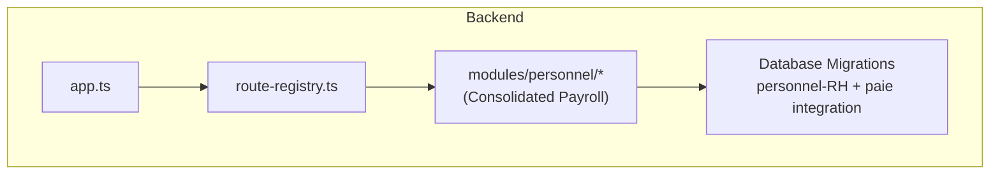
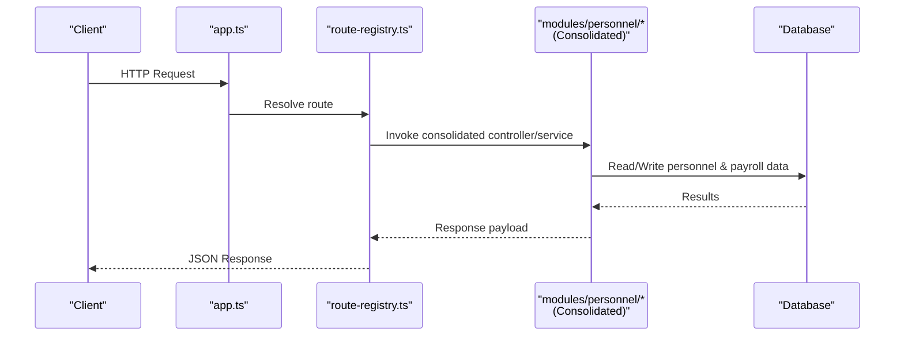
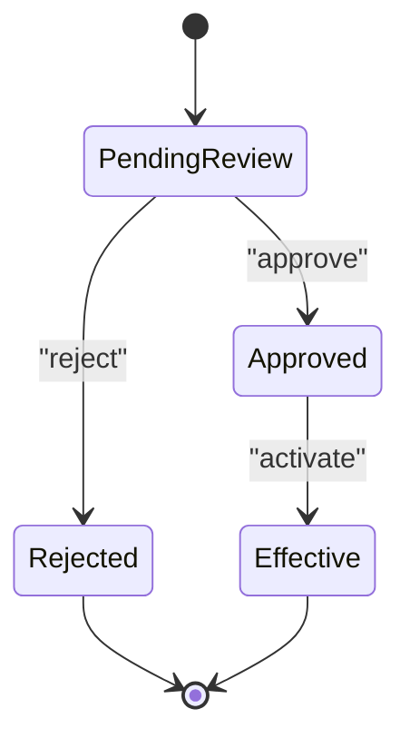
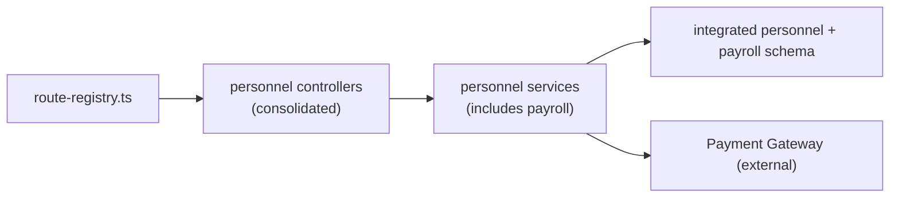
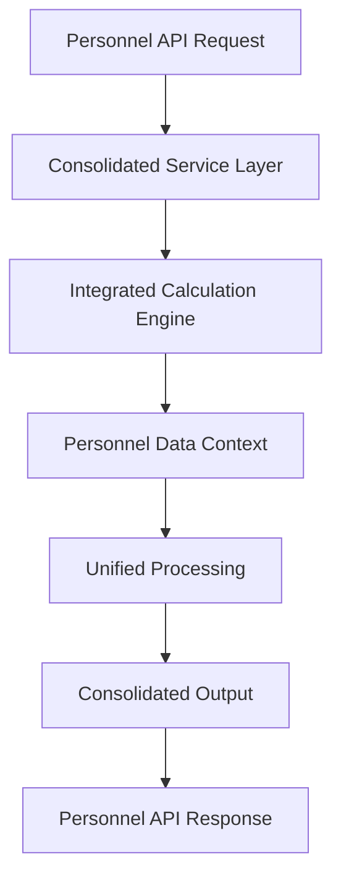

# Payroll Processing API

<cite>
**Referenced Files in This Document**
- [backend/src/modules/personnel/](file://backend/src/modules/personnel/)
- [backend/database/migrations/029-paie-etendue.sql](file://backend/database/migrations/029-paie-etendue.sql)
- [backend/database/migrations/016-module-personnel-rh-phase1.sql](file://backend/database/migrations/016-module-personnel-rh-phase1.sql)
- [backend/database/migrations/017-module-personnel-rh-phase2.sql](file://backend/database/migrations/017-module-personnel-rh-phase2.sql)
- [backend/database/migrations/018-module-personnel-rh-phase3.sql](file://backend/database/migrations/018-module-personnel-rh-phase3.sql)
- [backend/database/migrations/019-module-personnel-rh-phase4.sql](file://backend/database/migrations/019-module-personnel-rh-phase4.sql)
- [backend/database/migrations/020-module-personnel-rh-phase5.sql](file://backend/database/migrations/020-module-personnel-rh-phase5.sql)
- [backend/database/migrations/022-module-personnel-rh-complete.sql](file://backend/database/migrations/022-module-personnel-rh-complete.sql)
- [backend/database/migrations/026-personnel-champs-additionnels.sql](file://backend/database/migrations/026-personnel-champs-additionnels.sql)
- [backend/src/routes/route-registry.ts](file://backend/src/routes/route-registry.ts)
- [backend/src/app.ts](file://backend/src/app.ts)
- [backend/src/index.ts](file://backend/src/index.ts)
</cite>

## Update Summary
**Changes Made**
- Removed standalone payroll calculation endpoints (calcul-paie.service.ts, bulletin-paie.service.ts)
- Consolidated payroll functionality into unified personnel management module
- Updated architecture diagrams to reflect new consolidated structure
- Revised API endpoint references to point to personnel management APIs
- Updated service layer descriptions to reflect consolidation

## Table of Contents
1. [Introduction](#introduction)
2. [Project Structure](#project-structure)
3. [Core Components](#core-components)
4. [Architecture Overview](#architecture-overview)
5. [Detailed Component Analysis](#detailed-component-analysis)
6. [Dependency Analysis](#dependency-analysis)
7. [Performance Considerations](#performance-considerations)
8. [Troubleshooting Guide](#troubleshooting-guide)
9. [Conclusion](#conclusion)
10. [Appendices](#appendices)

## Introduction
This document provides comprehensive API documentation for eLISAschool's integrated payroll processing capabilities within the unified personnel management system. The payroll functionality has been consolidated from standalone services into the centralized personnel management module, providing a more cohesive approach to employee compensation management.

The consolidated system covers:
- Integrated salary structure configuration within personnel profiles
- Unified payment processing through personnel management workflows
- Centralized payroll reporting accessible via personnel APIs
- Streamlined salary history tracking and adjustment workflows
- Enhanced compliance reporting integrated with personnel records

**Updated** The architectural consolidation eliminates redundant payroll calculation services and bulletin generation APIs, streamlining the system architecture while maintaining full functionality through the personnel management interface.

## Project Structure
Payroll functionality is now integrated within the unified personnel management module, eliminating standalone payroll services. The application maintains centralized route registration and bootstrapping through entrypoint files.

**Diagram sources**
- [backend/src/app.ts](file://backend/src/app.ts)
- [backend/src/routes/route-registry.ts](file://backend/src/routes/route-registry.ts)
- [backend/src/modules/personnel/](file://backend/src/modules/personnel/)
- [backend/database/migrations/029-paie-etendue.sql](file://backend/database/migrations/029-paie-etendue.sql)

**Section sources**
- [backend/src/app.ts](file://backend/src/app.ts)
- [backend/src/routes/route-registry.ts](file://backend/src/routes/route-registry.ts)
- [backend/src/index.ts](file://backend/src/index.ts)

## Core Components
The consolidated personnel management module exposes integrated endpoints that encompass all payroll-related functionality:

### Integrated Salary Management
- **Personnel Profile Integration**: Base salaries, allowances, and deductions are now managed as part of employee profiles
- **Unified Compensation Configuration**: Salary structures are defined within personnel management workflows
- **Centralized Tax Rules**: Tax calculations are handled through the consolidated personnel system

### Consolidated Payment Processing
- **Integrated Payroll Runs**: Payroll execution is triggered through personnel management APIs
- **Streamlined Payment Methods**: Payment processing is embedded within personnel workflows
- **Unified Bank Transfer Management**: Bank transfer operations are handled through consolidated interfaces

### Centralized Reporting
- **Personnel-Centric Reports**: Payslips and financial reports are generated through personnel APIs
- **Integrated Compliance Outputs**: Regulatory reporting is available via personnel management endpoints
- **Unified Audit Trail**: All payroll activities are tracked within personnel audit logs

### Streamlined Workflows
- **Consolidated History Tracking**: Salary changes are logged within personnel modification history
- **Integrated Adjustment Processes**: Pay adjustments follow personnel workflow patterns
- **Unified Approval Chains**: Compensation changes use standard personnel approval workflows

**Updated** The removal of standalone calcul-paie.service.ts and bulletin-paie.service.ts has eliminated architectural redundancy while preserving all functionality through the unified personnel management interface.

**Section sources**
- [backend/src/modules/personnel/](file://backend/src/modules/personnel/)
- [backend/database/migrations/029-paie-etendue.sql](file://backend/database/migrations/029-paie-etendue.sql)
- [backend/database/migrations/016-module-personnel-rh-phase1.sql](file://backend/database/migrations/016-module-personnel-rh-phase1.sql)
- [backend/database/migrations/017-module-personnel-rh-phase2.sql](file://backend/database/migrations/017-module-personnel-rh-phase2.sql)
- [backend/database/migrations/018-module-personnel-rh-phase3.sql](file://backend/database/migrations/018-module-personnel-rh-phase3.sql)
- [backend/database/migrations/019-module-personnel-rh-phase4.sql](file://backend/database/migrations/019-module-personnel-rh-phase4.sql)
- [backend/database/migrations/020-module-personnel-rh-phase5.sql](file://backend/database/migrations/020-module-personnel-rh-phase5.sql)
- [backend/database/migrations/022-module-personnel-rh-complete.sql](file://backend/database/migrations/022-module-personnel-rh-complete.sql)
- [backend/database/migrations/026-personnel-champs-additionnels.sql](file://backend/database/migrations/026-personnel-champs-additionnels.sql)

## Architecture Overview
High-level flow from client request to persistence through the consolidated personnel management system:

**Diagram sources**
- [backend/src/app.ts](file://backend/src/app.ts)
- [backend/src/routes/route-registry.ts](file://backend/src/routes/route-registry.ts)
- [backend/src/modules/personnel/](file://backend/src/modules/personnel/)

## Detailed Component Analysis

### Integrated Salary Structure Management
**Updated** Salary structure configuration is now handled through personnel management APIs rather than standalone payroll endpoints.

Personnel Profile Integration:
- POST /api/personnel/:id/salary-configuration
  - Configure base salary, allowances, and deductions within employee profile
  - Body includes positionId, effectiveDate, compensationDetails
  - Validation: integrates with personnel position and contract data
- GET /api/personnel/:id/salary-history
  - Retrieve complete salary change history for an employee
  - Includes all modifications, approvals, and effective dates
- PUT /api/personnel/:id/salary-adjustment
  - Initiate salary adjustment workflow through personnel processes

Compensation Catalog Management:
- POST /api/personnel/compensation-catalogs
  - Define reusable allowance and deduction templates
  - Integrates with personnel classification systems
- GET /api/personnel/compensation-catalogs
  - Access shared compensation definitions across organization

Tax Rule Integration:
- POST /api/personnel/tax-configurations
  - Configure tax rules within personnel management context
  - Supports progressive brackets and organizational policies
- PUT /api/personnel/tax-configurations/:id
  - Update tax rules with version control and approval workflows

**Section sources**
- [backend/src/modules/personnel/](file://backend/src/modules/personnel/)
- [backend/database/migrations/029-paie-etendue.sql](file://backend/database/migrations/029-paie-etendue.sql)

### Consolidated Payment Processing
**Updated** Payment processing is now integrated into personnel management workflows, eliminating separate payroll run endpoints.

Integrated Payroll Execution:
- POST /api/personnel/payroll/run
  - Execute payroll for selected employees within personnel context
  - Body includes periodId, employeeIds[], paymentMethod
  - Leverages existing personnel data and permissions
- GET /api/personnel/payroll/status/:runId
  - Monitor payroll execution status through personnel APIs
- POST /api/personnel/payroll/bank-transfers
  - Submit bank transfers as part of personnel payment workflows

Payment Method Integration:
- POST /api/personnel/payment-methods
  - Configure payment methods within personnel profiles
  - Supports multiple payment options per employee
- PUT /api/personnel/:id/payment-preferences
  - Update individual employee payment preferences

Confirmation and Reconciliation:
- POST /api/personnel/payroll/confirm/:runId
  - Confirm payments through personnel approval workflows
  - Integrates with existing personnel authorization systems
- GET /api/personnel/payroll/reconciliation/:periodId
  - Access payment reconciliation data through personnel APIs

**Section sources**
- [backend/src/modules/personnel/](file://backend/src/modules/personnel/)
- [backend/database/migrations/029-paie-etendue.sql](file://backend/database/migrations/029-paie-etendue.sql)

### Unified Payroll Reporting
**Updated** Payroll reporting is now accessible through personnel management APIs, providing consolidated access to all compensation-related information.

Integrated Report Generation:
- GET /api/personnel/reports/payslips?employeeId=&period=
  - Generate payslips through personnel report interface
  - PDF and JSON formats available
- GET /api/personnel/reports/tax-summary?periodId=
  - Access tax reporting through personnel analytics
- GET /api/personnel/reports/compensation-analytics?departmentId=
  - Generate compensation analysis reports by department or cost center

Report Customization:
- POST /api/personnel/reports/custom
  - Create custom compensation reports using personnel data filters
  - Supports advanced filtering by position, department, employment type
- GET /api/personnel/reports/templates
  - Access predefined report templates for common compensation scenarios

Export Capabilities:
- POST /api/personnel/reports/export?format=csv|pdf|xlsx
  - Export compensation data in various formats
  - Maintains data integrity and formatting standards

**Section sources**
- [backend/src/modules/personnel/](file://backend/src/modules/personnel/)

### Streamlined Salary History and Adjustments
**Updated** Salary history tracking and adjustment workflows are now part of the unified personnel modification system.

Integrated History Tracking:
- GET /api/personnel/:id/compensation-history
  - Complete compensation change history within personnel record
  - Includes all modifications, approvals, and effective dates
- POST /api/personnel/:id/compensation-change
  - Initiate compensation change through personnel workflow

Adjustment Workflow Integration:
- POST /api/personnel/:id/adjustment-request
  - Submit compensation adjustment requests through personnel processes
  - Follows standard personnel approval chains
- PUT /api/personnel/:id/adjustment/:id/approve
  - Approve compensation changes using personnel authorization
- GET /api/personnel/:id/adjustment/:id/status
  - Track adjustment request status through personnel APIs

State Management:

Audit Integration:
- All compensation changes are automatically logged in personnel audit trails
- Maintains complete chain of custody for all salary modifications
- Provides comprehensive reporting for compliance requirements

**Section sources**
- [backend/src/modules/personnel/](file://backend/src/modules/personnel/)
- [backend/database/migrations/029-paie-etendue.sql](file://backend/database/migrations/029-paie-etendue.sql)

### Enhanced Compliance Reporting
**Updated** Compliance reporting is now integrated within personnel management, providing unified access to regulatory and internal compliance outputs.

Regulatory Compliance:
- GET /api/personnel/compliance/tax-withholding?periodId=
  - Access tax withholding compliance through personnel APIs
- GET /api/personnel/compliance/social-contributions?periodId=
  - Retrieve social contribution compliance data
- GET /api/personnel/compliance/regulatory-reports?periodId=
  - Generate comprehensive regulatory compliance reports

Internal Compliance:
- GET /api/personnel/compliance/internal-audit?actorId=&from=&to=
  - Access internal audit trails for compensation changes
- POST /api/personnel/compliance/audit-export?format=csv|json
  - Export audit data for internal review processes

Access Control:
- Role-based access to compliance data through personnel permission system
- Automated compliance checks during compensation changes
- Immutable audit logs maintained within personnel audit framework

**Section sources**
- [backend/src/modules/personnel/](file://backend/src/modules/personnel/)

## Dependency Analysis
**Updated** Module dependencies have been simplified through consolidation into the personnel management system.

Consolidated Dependencies:
- Routes are registered centrally and delegate to consolidated controllers/services in modules/personnel
- Database schema relies on integrated personnel and payroll migrations
- External integrations (payment gateways) are invoked through consolidated personnel services

**Diagram sources**
- [backend/src/routes/route-registry.ts](file://backend/src/routes/route-registry.ts)
- [backend/src/modules/personnel/](file://backend/src/modules/personnel/)
- [backend/database/migrations/029-paie-etendue.sql](file://backend/database/migrations/029-paie-etendue.sql)

**Section sources**
- [backend/src/routes/route-registry.ts](file://backend/src/routes/route-registry.ts)
- [backend/src/modules/personnel/](file://backend/src/modules/personnel/)

## Performance Considerations
**Updated** Performance optimizations benefit from the architectural consolidation.

Consolidation Benefits:
- Reduced API call overhead through unified personnel interfaces
- Shared caching strategies for personnel and payroll data
- Optimized database queries leveraging consolidated schema design
- Streamlined authentication and authorization through single personnel system

Operational Improvements:
- Batch operations for large-scale payroll processing through personnel APIs
- Enhanced indexing on frequently accessed personnel-compensation fields
- Improved pagination for list endpoints within personnel context
- Asynchronous job processing for heavy computations within personnel workflows

## Troubleshooting Guide
**Updated** Troubleshooting procedures have been streamlined due to architectural consolidation.

Common Issues and Resolutions:
- **Integration Errors**: Verify personnel API endpoints instead of deprecated payroll routes
- **Permission Issues**: Check personnel role permissions for compensation management
- **Data Consistency**: Ensure personnel records are complete before compensation operations
- **Workflow Conflicts**: Review personnel approval chains for compensation changes

Operational Checks:
- Verify consolidated migration status for personnel-payroll integration
- Inspect unified audit logs for recent compensation changes
- Monitor consolidated job queue health for background tasks
- Validate personnel-permission mappings for compensation access

**Section sources**
- [backend/src/modules/personnel/](file://backend/src/modules/personnel/)

## Conclusion
The architectural consolidation of payroll functionality into the unified personnel management system provides a more streamlined and maintainable approach to employee compensation management. By eliminating redundant services and integrating payroll operations within personnel workflows, the system offers improved performance, simplified maintenance, and enhanced user experience while preserving all essential functionality.

The consolidated architecture enables developers and administrators to work with a single, cohesive interface for all personnel-related compensation tasks, reducing complexity and improving operational efficiency.

## Appendices

### Migration Impact Summary
**Updated** Key architectural changes resulting from the consolidation:

Removed Components:
- `calcul-paie.service.ts` - Standalone payroll calculation service
- `bulletin-paie.service.ts` - Separate bulletin generation service
- Dedicated payroll calculation endpoints
- Independent bulletin generation APIs

Consolidated Into:
- Unified personnel management module
- Integrated compensation workflows
- Centralized payroll processing through personnel APIs
- Streamlined audit and compliance reporting

Migration Path:
- Existing payroll data remains intact within consolidated schema
- API endpoints migrated to personnel management interfaces
- Authentication and authorization updated to personnel permission system
- Audit trails integrated into unified personnel logging system

### Example: Consolidated Payroll Workflow

[No sources needed since this diagram shows conceptual workflow, not actual code structure]