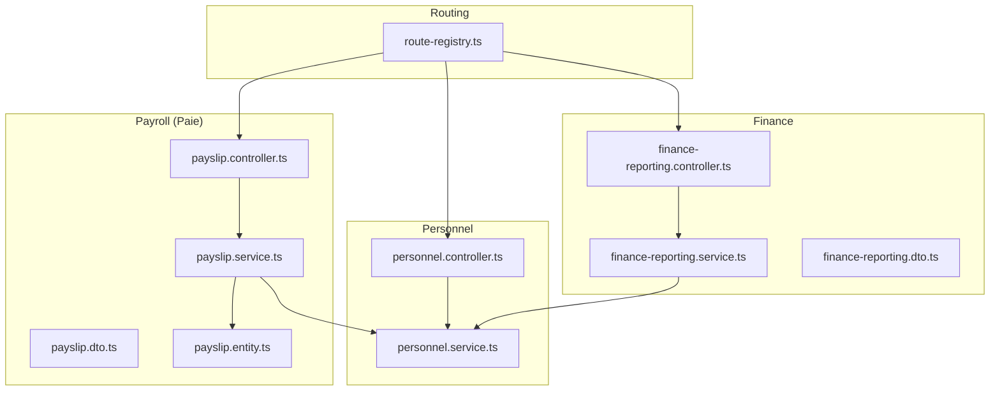
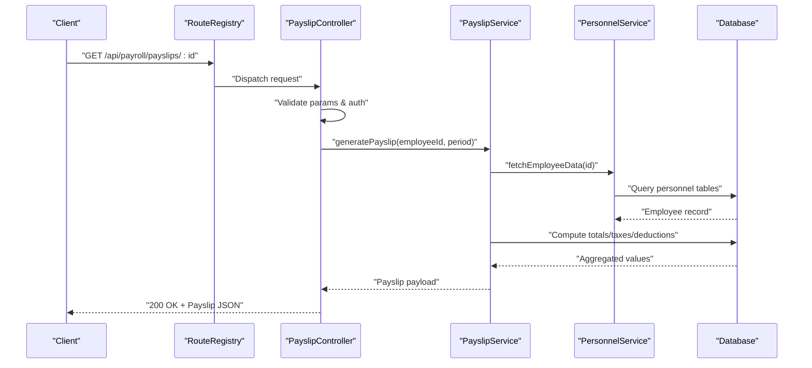
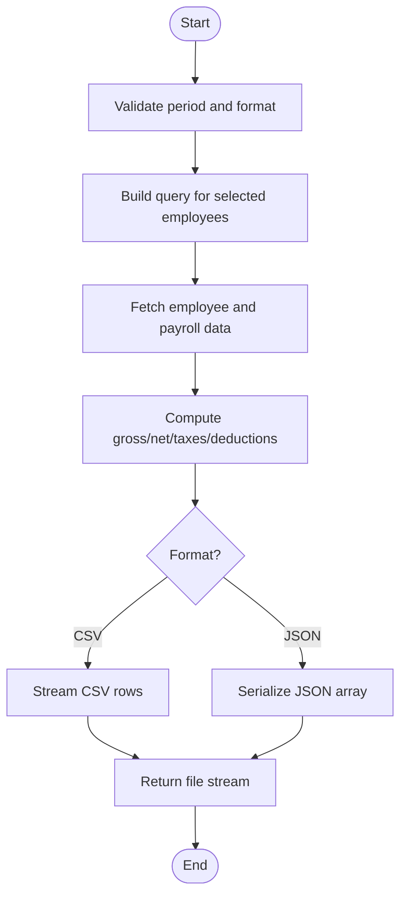
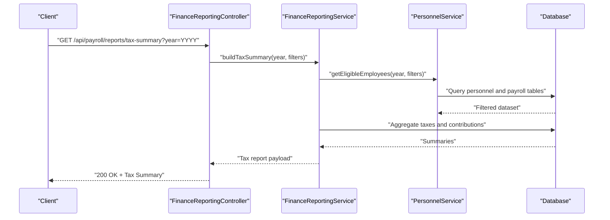
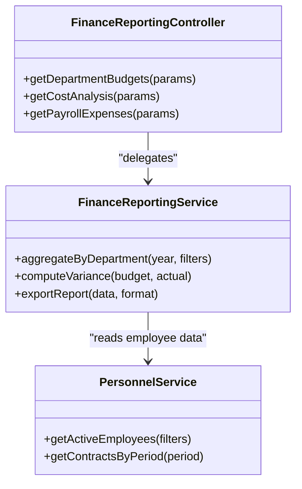
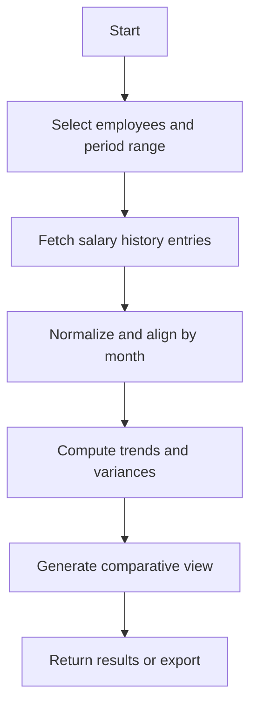
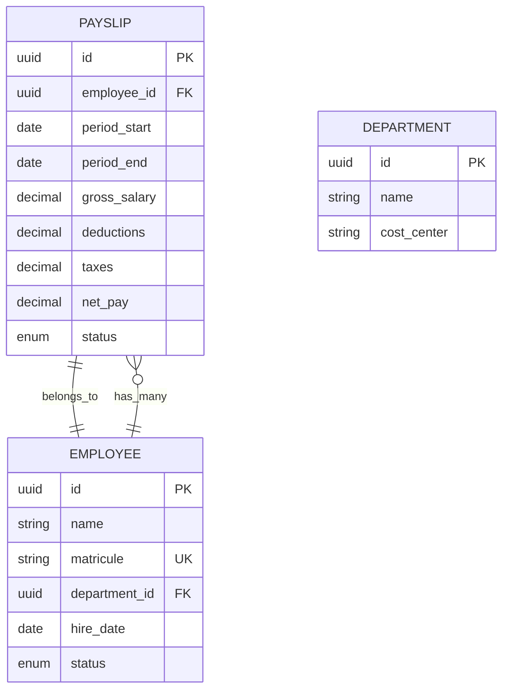
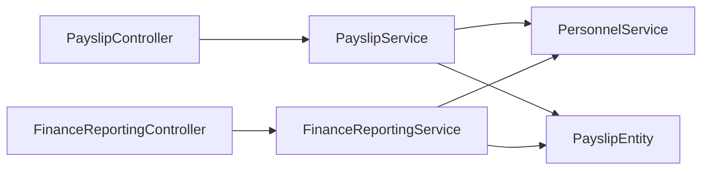

# Payroll Reporting API

<cite>
**Referenced Files in This Document**
- [backend/src/modules/paie/controllers/payslip.controller.ts](file://backend/src/modules/paie/controllers/payslip.controller.ts)
- [backend/src/modules/paie/services/payslip.service.ts](file://backend/src/modules/paie/services/payslip.service.ts)
- [backend/src/modules/paie/dto/payslip.dto.ts](file://backend/src/modules/paie/dto/payslip.dto.ts)
- [backend/src/modules/paie/entities/payslip.entity.ts](file://backend/src/modules/paie/entities/payslip.entity.ts)
- [backend/src/modules/personnel/controllers/personnel.controller.ts](file://backend/src/modules/personnel/controllers/personnel.controller.ts)
- [backend/src/modules/personnel/services/personnel.service.ts](file://backend/src/modules/personnel/services/personnel.service.ts)
- [backend/src/modules/finances/controllers/finance-reporting.controller.ts](file://backend/src/modules/finances/controllers/finance-reporting.controller.ts)
- [backend/src/modules/finances/services/finance-reporting.service.ts](file://backend/src/modules/finances/services/finance-reporting.service.ts)
- [backend/src/modules/finances/dto/finance-reporting.dto.ts](file://backend/src/modules/finances/dto/finance-reporting.dto.ts)
- [backend/src/routes/route-registry.ts](file://backend/src/routes/route-registry.ts)
- [backend/database/migrations/029-paie-etendue.sql](file://backend/database/migrations/029-paie-etendue.sql)
- [backend/database/migrations/016-module-personnel-rh-phase1.sql](file://backend/database/migrations/016-module-personnel-rh-phase1.sql)
- [backend/database/migrations/017-module-personnel-rh-phase2.sql](file://backend/database/migrations/018-module-personnel-rh-phase3.sql)
- [backend/database/migrations/019-module-personnel-rh-phase4.sql]
</cite>

## Table of Contents
1. [Introduction](#introduction)
2. [Project Structure](#project-structure)
3. [Core Components](#core-components)
4. [Architecture Overview](#architecture-overview)
5. [Detailed Component Analysis](#detailed-component-analysis)
6. [Dependency Analysis](#dependency-analysis)
7. [Performance Considerations](#performance-considerations)
8. [Troubleshooting Guide](#troubleshooting-guide)
9. [Conclusion](#conclusion)
10. [Appendices](#appendices)

## Introduction
This document provides comprehensive API documentation for payroll reporting and analytics endpoints, focusing on:
- Payslip generation for individual employees and bulk export
- Tax reporting for government compliance, social security contributions, and fiscal year summaries
- Financial reporting for department budgets, cost analysis, and payroll expenses
- Salary history tracking, trend analysis, and comparative reports
- Report generation workflows, data export formats, and compliance requirements with filtering and aggregation

The scope covers the backend modules responsible for personnel management, payroll (paie), and financial reporting, including controllers, services, DTOs, entities, and database migrations that define the schema and relationships used by these APIs.

## Project Structure
Payroll reporting spans three primary areas:
- Personnel module: employee master data and employment attributes required to compute payslips and reports
- Payroll (paie) module: payslip computation, generation, and bulk export
- Finance module: aggregated financial reporting, budgeting, and expense analysis

**Diagram sources**
- [backend/src/routes/route-registry.ts](file://backend/src/routes/route-registry.ts)
- [backend/src/modules/personnel/controllers/personnel.controller.ts](file://backend/src/modules/personnel/controllers/personnel.controller.ts)
- [backend/src/modules/personnel/services/personnel.service.ts](file://backend/src/modules/personnel/services/personnel.service.ts)
- [backend/src/modules/paie/controllers/payslip.controller.ts](file://backend/src/modules/paie/controllers/payslip.controller.ts)
- [backend/src/modules/paie/services/payslip.service.ts](file://backend/src/modules/paie/services/payslip.service.ts)
- [backend/src/modules/paie/dto/payslip.dto.ts](file://backend/src/modules/paie/dto/payslip.dto.ts)
- [backend/src/modules/paie/entities/payslip.entity.ts](file://backend/src/modules/paie/entities/payslip.entity.ts)
- [backend/src/modules/finances/controllers/finance-reporting.controller.ts](file://backend/src/modules/finances/controllers/finance-reporting.controller.ts)
- [backend/src/modules/finances/services/finance-reporting.service.ts](file://backend/src/modules/finances/services/finance-reporting.service.ts)
- [backend/src/modules/finances/dto/finance-reporting.dto.ts](file://backend/src/modules/finances/dto/finance-reporting.dto.ts)

**Section sources**
- [backend/src/routes/route-registry.ts](file://backend/src/routes/route-registry.ts)
- [backend/src/modules/personnel/controllers/personnel.controller.ts](file://backend/src/modules/personnel/controllers/personnel.controller.ts)
- [backend/src/modules/personnel/services/personnel.service.ts](file://backend/src/modules/personnel/services/personnel.service.ts)
- [backend/src/modules/paie/controllers/payslip.controller.ts](file://backend/src/modules/paie/controllers/payslip.controller.ts)
- [backend/src/modules/paie/services/payslip.service.ts](file://backend/src/modules/paie/services/payslip.service.ts)
- [backend/src/modules/paie/dto/payslip.dto.ts](file://backend/src/modules/paie/dto/payslip.dto.ts)
- [backend/src/modules/paie/entities/payslip.entity.ts](file://backend/src/modules/paie/entities/payslip.entity.ts)
- [backend/src/modules/finances/controllers/finance-reporting.controller.ts](file://backend/src/modules/finances/controllers/finance-reporting.controller.ts)
- [backend/src/modules/finances/services/finance-reporting.service.ts](file://backend/src/modules/finances/services/finance-reporting.service.ts)
- [backend/src/modules/finances/dto/finance-reporting.dto.ts](file://backend/src/modules/finances/dto/finance-reporting.dto.ts)

## Core Components
- Payslip Controller: exposes endpoints for generating individual payslips and exporting bulk payslips. It validates requests using DTOs and delegates computation to the service layer.
- Payslip Service: orchestrates data retrieval from personnel and payroll entities, computes gross/net amounts, taxes, and deductions, and returns structured responses or files for export.
- Personnel Controller/Service: provide employee master data, contract details, and employment status needed for payroll calculations and historical salary queries.
- Finance Reporting Controller/Service: aggregate payroll expenses, department budgets, tax liabilities, and social security contributions across time windows; support filters by period, department, and cost center.
- Route Registry: centralizes route registration for all reporting endpoints, ensuring consistent base paths and middleware application.

Key responsibilities:
- Input validation and authorization checks at controller level
- Business logic and aggregation in service layer
- Data access via entities and repositories
- Export formatting (CSV/JSON/PDF) and streaming responses for large datasets

**Section sources**
- [backend/src/modules/paie/controllers/payslip.controller.ts](file://backend/src/modules/paie/controllers/payslip.controller.ts)
- [backend/src/modules/paie/services/payslip.service.ts](file://backend/src/modules/paie/services/payslip.service.ts)
- [backend/src/modules/paie/dto/payslip.dto.ts](file://backend/src/modules/paie/dto/payslip.dto.ts)
- [backend/src/modules/personnel/controllers/personnel.controller.ts](file://backend/src/modules/personnel/controllers/personnel.controller.ts)
- [backend/src/modules/personnel/services/personnel.service.ts](file://backend/src/modules/personnel/services/personnel.service.ts)
- [backend/src/modules/finances/controllers/finance-reporting.controller.ts](file://backend/src/modules/finances/controllers/finance-reporting.controller.ts)
- [backend/src/modules/finances/services/finance-reporting.service.ts](file://backend/src/modules/finances/services/finance-reporting.service.ts)
- [backend/src/modules/finances/dto/finance-reporting.dto.ts](file://backend/src/modules/finances/dto/finance-reporting.dto.ts)
- [backend/src/routes/route-registry.ts](file://backend/src/routes/route-registry.ts)

## Architecture Overview
The reporting architecture follows a layered approach:
- Controllers handle HTTP concerns: routing, validation, response shaping
- Services encapsulate business rules: computation, aggregation, export orchestration
- Entities represent persistent models: payslips, personnel records, finance aggregates
- Migrations define schema evolution: payroll tables, indexes, constraints

**Diagram sources**
- [backend/src/routes/route-registry.ts](file://backend/src/routes/route-registry.ts)
- [backend/src/modules/paie/controllers/payslip.controller.ts](file://backend/src/modules/paie/controllers/payslip.controller.ts)
- [backend/src/modules/paie/services/payslip.service.ts](file://backend/src/modules/paie/services/payslip.service.ts)
- [backend/src/modules/personnel/services/personnel.service.ts](file://backend/src/modules/personnel/services/personnel.service.ts)

## Detailed Component Analysis

### Payslip Generation API
Endpoints:
- Generate individual payslip: GET /api/payroll/payslips/:employeeId?period=YYYY-MM
- Bulk payslip export: POST /api/payroll/payslips/export?format=csv|json&period=YYYY-MM

Request/response characteristics:
- Individual payslip returns a structured object with earnings, deductions, taxes, net pay, and metadata
- Bulk export supports CSV and JSON formats; large exports are streamed to avoid memory spikes

Filtering and aggregation:
- Period-based filtering ensures only relevant payroll cycles are included
- Employee status and active contracts are considered during computation

Export workflow:
- Controller validates format and period
- Service builds dataset from personnel and payroll entities
- Service streams rows for CSV or serializes JSON
- Response headers include content-type and filename

**Diagram sources**
- [backend/src/modules/paie/controllers/payslip.controller.ts](file://backend/src/modules/paie/controllers/payslip.controller.ts)
- [backend/src/modules/paie/services/payslip.service.ts](file://backend/src/modules/paie/services/payslip.service.ts)
- [backend/src/modules/paie/dto/payslip.dto.ts](file://backend/src/modules/paie/dto/payslip.dto.ts)
- [backend/src/modules/paie/entities/payslip.entity.ts](file://backend/src/modules/paie/entities/payslip.entity.ts)

**Section sources**
- [backend/src/modules/paie/controllers/payslip.controller.ts](file://backend/src/modules/paie/controllers/payslip.controller.ts)
- [backend/src/modules/paie/services/payslip.service.ts](file://backend/src/modules/paie/services/payslip.service.ts)
- [backend/src/modules/paie/dto/payslip.dto.ts](file://backend/src/modules/paie/dto/payslip.dto.ts)
- [backend/src/modules/paie/entities/payslip.entity.ts](file://backend/src/modules/paie/entities/payslip.entity.ts)

### Tax Reporting API
Endpoints:
- Government tax summary: GET /api/payroll/reports/tax-summary?year=YYYY&department=...
- Social security contributions: GET /api/payroll/reports/social-security?year=YYYY&department=...
- Fiscal year summary: GET /api/payroll/reports/fiscal-year?year=YYYY

Capabilities:
- Aggregates taxable income, withholding, and statutory contributions
- Supports department and cost-center filters
- Returns standardized fields for compliance submissions

Compliance considerations:
- Ensure consistent rounding rules and currency precision
- Include audit trail references for each computed value
- Provide raw and summarized views for regulator review

**Diagram sources**
- [backend/src/modules/finances/controllers/finance-reporting.controller.ts](file://backend/src/modules/finances/controllers/finance-reporting.controller.ts)
- [backend/src/modules/finances/services/finance-reporting.service.ts](file://backend/src/modules/finances/services/finance-reporting.service.ts)
- [backend/src/modules/personnel/services/personnel.service.ts](file://backend/src/modules/personnel/services/personnel.service.ts)

**Section sources**
- [backend/src/modules/finances/controllers/finance-reporting.controller.ts](file://backend/src/modules/finances/controllers/finance-reporting.controller.ts)
- [backend/src/modules/finances/services/finance-reporting.service.ts](file://backend/src/modules/finances/services/finance-reporting.service.ts)
- [backend/src/modules/finances/dto/finance-reporting.dto.ts](file://backend/src/modules/finances/dto/finance-reporting.dto.ts)
- [backend/src/modules/personnel/services/personnel.service.ts](file://backend/src/modules/personnel/services/personnel.service.ts)

### Financial Reporting API
Endpoints:
- Department budgets: GET /api/payroll/reports/department-budgets?year=YYYY
- Cost analysis: GET /api/payroll/reports/cost-analysis?year=YYYY&department=...
- Payroll expenses: GET /api/payroll/reports/payroll-expenses?year=YYYY&department=...

Features:
- Budget vs actual comparisons with variance analysis
- Cost breakdown by category (salary, benefits, taxes, contributions)
- Time-series trends for monthly and quarterly views

Data export:
- CSV and JSON outputs with consistent column naming
- Optional inclusion of explanatory notes and calculation methods

**Diagram sources**
- [backend/src/modules/finances/controllers/finance-reporting.controller.ts](file://backend/src/modules/finances/controllers/finance-reporting.controller.ts)
- [backend/src/modules/finances/services/finance-reporting.service.ts](file://backend/src/modules/finances/services/finance-reporting.service.ts)
- [backend/src/modules/personnel/services/personnel.service.ts](file://backend/src/modules/personnel/services/personnel.service.ts)

**Section sources**
- [backend/src/modules/finances/controllers/finance-reporting.controller.ts](file://backend/src/modules/finances/controllers/finance-reporting.controller.ts)
- [backend/src/modules/finances/services/finance-reporting.service.ts](file://backend/src/modules/finances/services/finance-reporting.service.ts)
- [backend/src/modules/finances/dto/finance-reporting.dto.ts](file://backend/src/modules/finances/dto/finance-reporting.dto.ts)

### Salary History Tracking and Trend Analysis
Capabilities:
- Retrieve historical salary changes per employee over specified periods
- Compute trend metrics (monthly growth, variance, anomalies)
- Comparative reports across departments or roles

Workflow:
- Query personnel service for employee identifiers and contract history
- Aggregate salary components by period
- Apply smoothing or normalization for trend visualization

[No sources needed since this diagram shows conceptual workflow, not actual code structure]

**Section sources**
- [backend/src/modules/personnel/services/personnel.service.ts](file://backend/src/modules/personnel/services/personnel.service.ts)
- [backend/src/modules/paie/services/payslip.service.ts](file://backend/src/modules/paie/services/payslip.service.ts)

### Data Models and Schema
Relevant schema elements:
- Payslip entity defines core fields for earnings, deductions, taxes, and net pay
- Personnel tables store employee identity, contract terms, and employment status
- Finance reporting tables hold aggregated metrics and budget allocations

**Diagram sources**
- [backend/src/modules/paie/entities/payslip.entity.ts](file://backend/src/modules/paie/entities/payslip.entity.ts)
- [backend/database/migrations/029-paie-etendue.sql](file://backend/database/migrations/029-paie-etendue.sql)
- [backend/database/migrations/016-module-personnel-rh-phase1.sql](file://backend/database/migrations/016-module-personnel-rh-phase1.sql)
- [backend/database/migrations/017-module-personnel-rh-phase2.sql](file://backend/database/migrations/018-module-personnel-rh-phase3.sql)
- [backend/database/migrations/019-module-personnel-rh-phase4.sql]

**Section sources**
- [backend/src/modules/paie/entities/payslip.entity.ts](file://backend/src/modules/paie/entities/payslip.entity.ts)
- [backend/database/migrations/029-paie-etendue.sql](file://backend/database/migrations/029-paie-etendue.sql)
- [backend/database/migrations/016-module-personnel-rh-phase1.sql](file://backend/database/migrations/016-module-personnel-rh-phase1.sql)
- [backend/database/migrations/017-module-personnel-rh-phase2.sql](file://backend/database/migrations/018-module-personnel-rh-phase3.sql)
- [backend/database/migrations/019-module-personnel-rh-phase4.sql]

## Dependency Analysis
Inter-module dependencies:
- Payslip service depends on personnel service for employee data and on payroll entities for computations
- Finance reporting service depends on personnel service and payroll aggregates for budgeting and expense analysis
- Controllers depend on their respective services and DTOs for validation and response shaping

**Diagram sources**
- [backend/src/modules/paie/controllers/payslip.controller.ts](file://backend/src/modules/paie/controllers/payslip.controller.ts)
- [backend/src/modules/paie/services/payslip.service.ts](file://backend/src/modules/paie/services/payslip.service.ts)
- [backend/src/modules/personnel/services/personnel.service.ts](file://backend/src/modules/personnel/services/personnel.service.ts)
- [backend/src/modules/paie/entities/payslip.entity.ts](file://backend/src/modules/paie/entities/payslip.entity.ts)
- [backend/src/modules/finances/controllers/finance-reporting.controller.ts](file://backend/src/modules/finances/controllers/finance-reporting.controller.ts)
- [backend/src/modules/finances/services/finance-reporting.service.ts](file://backend/src/modules/finances/services/finance-reporting.service.ts)

**Section sources**
- [backend/src/modules/paie/controllers/payslip.controller.ts](file://backend/src/modules/paie/controllers/payslip.controller.ts)
- [backend/src/modules/paie/services/payslip.service.ts](file://backend/src/modules/paie/services/payslip.service.ts)
- [backend/src/modules/personnel/services/personnel.service.ts](file://backend/src/modules/personnel/services/personnel.service.ts)
- [backend/src/modules/paie/entities/payslip.entity.ts](file://backend/src/modules/paie/entities/payslip.entity.ts)
- [backend/src/modules/finances/controllers/finance-reporting.controller.ts](file://backend/src/modules/finances/controllers/finance-reporting.controller.ts)
- [backend/src/modules/finances/services/finance-reporting.service.ts](file://backend/src/modules/finances/services/finance-reporting.service.ts)

## Performance Considerations
- Use pagination and server-side filtering for large datasets
- Stream CSV exports to reduce memory footprint
- Pre-aggregate frequently accessed metrics in dedicated reporting tables
- Add database indexes on period, department, and employee_id columns
- Cache stable reference data (departments, cost centers) to minimize repeated lookups

[No sources needed since this section provides general guidance]

## Troubleshooting Guide
Common issues and resolutions:
- Validation errors: ensure period format matches expected pattern and required fields are present
- Authorization failures: verify user roles and permissions for reporting endpoints
- Large export timeouts: switch to streaming mode and adjust server timeout settings
- Inconsistent totals: check rounding rules and currency precision configurations
- Missing employee data: confirm employee status and contract validity for the requested period

Operational checks:
- Review controller logs for request validation outcomes
- Inspect service logs for aggregation steps and exceptions
- Validate database indexes and query plans for slow reports

**Section sources**
- [backend/src/modules/paie/controllers/payslip.controller.ts](file://backend/src/modules/paie/controllers/payslip.controller.ts)
- [backend/src/modules/finances/controllers/finance-reporting.controller.ts](file://backend/src/modules/finances/controllers/finance-reporting.controller.ts)

## Conclusion
The payroll reporting and analytics system provides robust endpoints for payslip generation, tax and social security reporting, and financial analysis. The layered architecture separates concerns between HTTP handling, business logic, and data persistence, enabling scalable and maintainable operations. Proper filtering, aggregation, and export mechanisms ensure compliance and usability for both internal stakeholders and external regulators.

[No sources needed since this section summarizes without analyzing specific files]

## Appendices

### API Reference Summary
- Payslip endpoints:
  - Individual: GET /api/payroll/payslips/:employeeId?period=YYYY-MM
  - Bulk export: POST /api/payroll/payslips/export?format=csv|json&period=YYYY-MM
- Tax reporting endpoints:
  - Tax summary: GET /api/payroll/reports/tax-summary?year=YYYY&department=...
  - Social security: GET /api/payroll/reports/social-security?year=YYYY&department=...
  - Fiscal year: GET /api/payroll/reports/fiscal-year?year=YYYY
- Financial reporting endpoints:
  - Department budgets: GET /api/payroll/reports/department-budgets?year=YYYY
  - Cost analysis: GET /api/payroll/reports/cost-analysis?year=YYYY&department=...
  - Payroll expenses: GET /api/payroll/reports/payroll-expenses?year=YYYY&department=...

Export formats:
- CSV: comma-separated rows with header row
- JSON: array of objects with consistent field names
- PDF: generated upon request when supported by the endpoint

Compliance requirements:
- Include audit references for each computed value
- Maintain consistent rounding and currency precision
- Provide raw and summarized views for regulatory review

**Section sources**
- [backend/src/modules/paie/controllers/payslip.controller.ts](file://backend/src/modules/paie/controllers/payslip.controller.ts)
- [backend/src/modules/finances/controllers/finance-reporting.controller.ts](file://backend/src/modules/finances/controllers/finance-reporting.controller.ts)
- [backend/src/modules/paie/dto/payslip.dto.ts](file://backend/src/modules/paie/dto/payslip.dto.ts)
- [backend/src/modules/finances/dto/finance-reporting.dto.ts](file://backend/src/modules/finances/dto/finance-reporting.dto.ts)