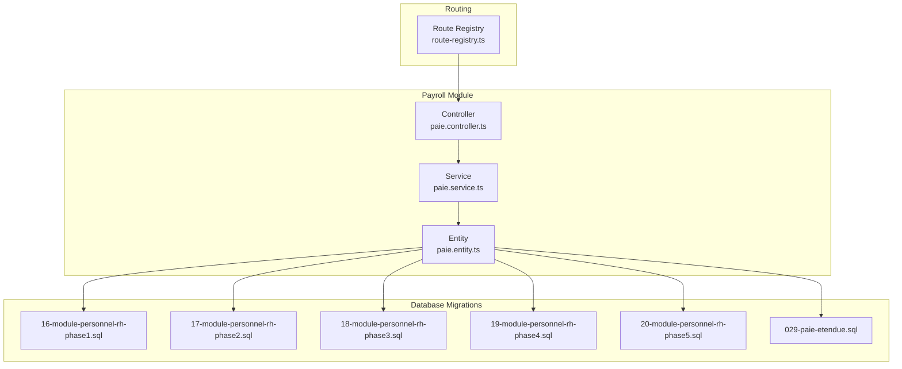
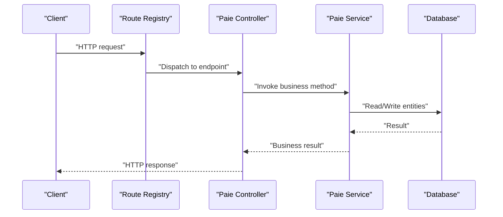
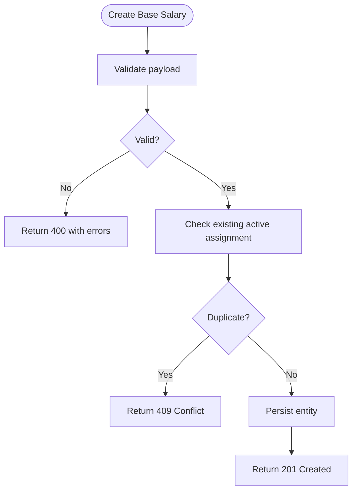
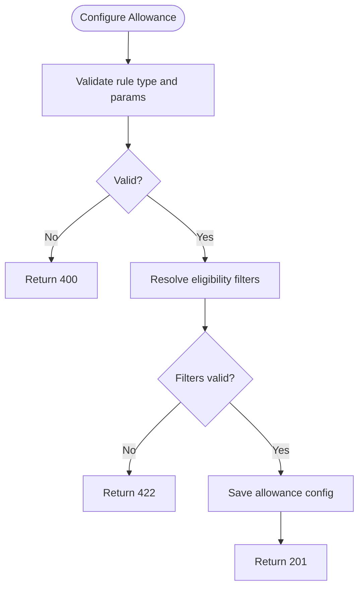
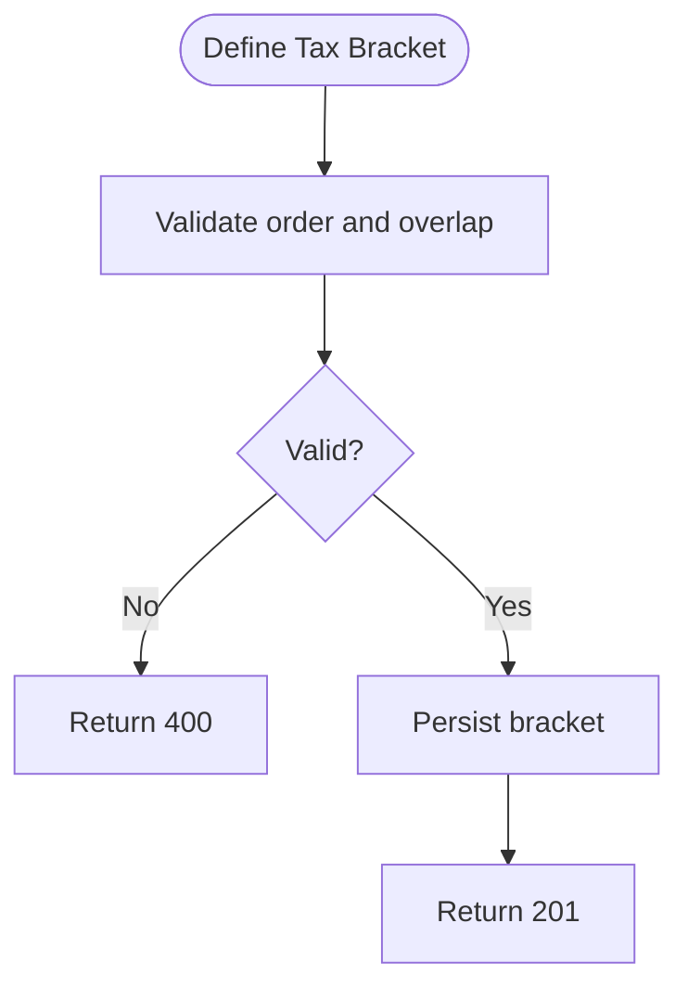
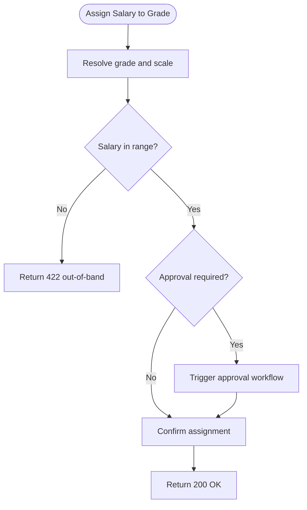
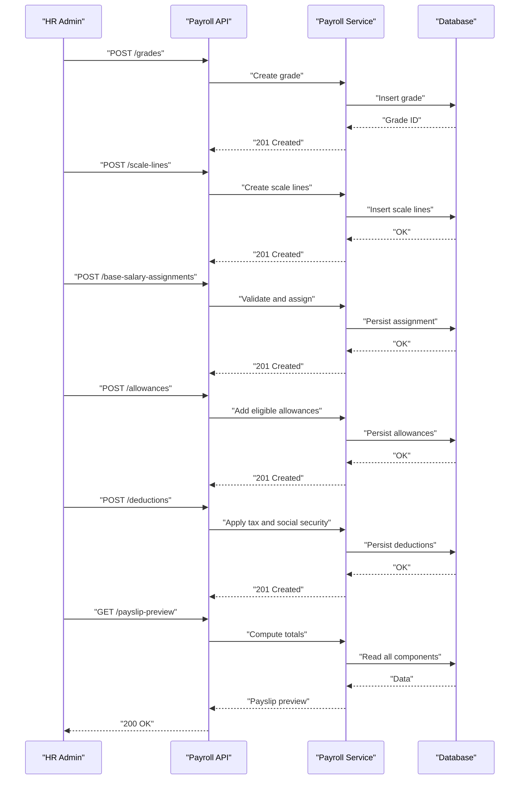
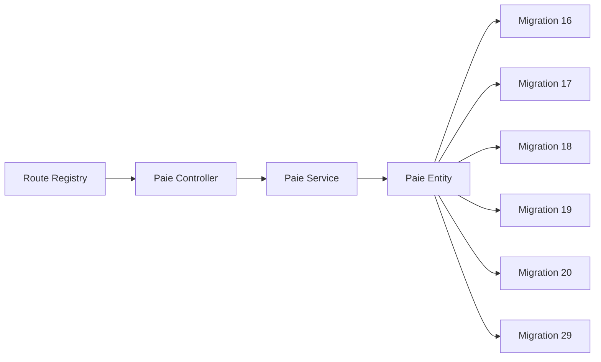

# Salary Structure Configuration API

<cite>
**Referenced Files in This Document**
- [029-paie-etendue.sql](file://backend/database/migrations/029-paie-etendue.sql)
- [16-module-personnel-rh-phase1.sql](file://backend/database/migrations/16-module-personnel-rh-phase1.sql)
- [17-module-personnel-rh-phase2.sql](file://backend/database/migrations/17-module-personnel-rh-phase2.sql)
- [18-module-personnel-rh-phase3.sql](file://backend/database/migrations/18-module-personnel-rh-phase3.sql)
- [19-module-personnel-rh-phase4.sql](file://backend/database/migrations/19-module-personnel-rh-phase4.sql)
- [20-module-personnel-rh-phase5.sql](file://backend/database/migrations/20-module-personnel-rh-phase5.sql)
- [paie.controller.ts](file://backend/src/modules/paie/controllers/paie.controller.ts)
- [paie.service.ts](file://backend/src/modules/paie/services/paie.service.ts)
- [paie.entity.ts](file://backend/src/modules/paie/entities/paie.entity.ts)
- [route-registry.ts](file://backend/src/routes/route-registry.ts)
</cite>

## Table of Contents
1. [Introduction](#introduction)
2. [Project Structure](#project-structure)
3. [Core Components](#core-components)
4. [Architecture Overview](#architecture-overview)
5. [Detailed Component Analysis](#detailed-component-analysis)
6. [Dependency Analysis](#dependency-analysis)
7. [Performance Considerations](#performance-considerations)
8. [Troubleshooting Guide](#troubleshooting-guide)
9. [Conclusion](#conclusion)
10. [Appendices](#appendices)

## Introduction
This document provides comprehensive API documentation for salary structure configuration endpoints within the payroll module. It covers base salary management, allowances and bonuses, deductions and retainages (taxes, social security, other withholdings), as well as salary grades, pay scales, and compensation bands. The guide includes validation rules, error handling patterns, and practical examples to help you set up compliant salary structures.

The backend is organized by modules with controllers, services, entities, and database migrations defining the data model and business logic. Routes are registered centrally and exposed via REST endpoints.

## Project Structure
The payroll-related functionality resides under the paie module and is backed by a series of database migrations that define tables for employees, positions, salary components, grades, and payslips. Controllers expose HTTP endpoints, while services implement calculation and validation logic. Entities map to database tables.

**Diagram sources**
- [paie.controller.ts](file://backend/src/modules/paie/controllers/paie.controller.ts)
- [paie.service.ts](file://backend/src/modules/paie/services/paie.service.ts)
- [paie.entity.ts](file://backend/src/modules/paie/entities/paie.entity.ts)
- [route-registry.ts](file://backend/src/routes/route-registry.ts)
- [16-module-personnel-rh-phase1.sql](file://backend/database/migrations/16-module-personnel-rh-phase1.sql)
- [17-module-personnel-rh-phase2.sql](file://backend/database/migrations/17-module-personnel-rh-phase2.sql)
- [18-module-personnel-rh-phase3.sql](file://backend/database/migrations/18-module-personnel-rh-phase3.sql)
- [19-module-personnel-rh-phase4.sql](file://backend/database/migrations/19-module-personnel-rh-phase4.sql)
- [20-module-personnel-rh-phase5.sql](file://backend/database/migrations/20-module-personnel-rh-phase5.sql)
- [029-paie-etendue.sql](file://backend/database/migrations/029-paie-etendue.sql)

**Section sources**
- [paie.controller.ts](file://backend/src/modules/paie/controllers/paie.controller.ts)
- [paie.service.ts](file://backend/src/modules/paie/services/paie.service.ts)
- [paie.entity.ts](file://backend/src/modules/paie/entities/paie.entity.ts)
- [route-registry.ts](file://backend/src/routes/route-registry.ts)
- [16-module-personnel-rh-phase1.sql](file://backend/database/migrations/16-module-personnel-rh-phase1.sql)
- [17-module-personnel-rh-phase2.sql](file://backend/database/migrations/17-module-personnel-rh-phase2.sql)
- [18-module-personnel-rh-phase3.sql](file://backend/database/migrations/18-module-personnel-rh-phase3.sql)
- [19-module-personnel-rh-phase4.sql](file://backend/database/migrations/19-module-personnel-rh-phase4.sql)
- [20-module-personnel-rh-phase5.sql](file://backend/database/migrations/20-module-personnel-rh-phase5.sql)
- [029-paie-etendue.sql](file://backend/database/migrations/029-paie-etendue.sql)

## Core Components
- Controller: Exposes REST endpoints for salary structure operations such as creating/modifying base salaries, configuring allowances/bonuses, managing deductions/retentions, and maintaining salary grades/pay scales.
- Service: Encapsulates business logic including validation of inputs, eligibility checks, calculation rules, and persistence.
- Entity: Maps to database tables representing core payroll concepts like employee, position, salary component, grade, scale, and payslip line items.
- Route Registry: Centralizes route registration and binds controller methods to HTTP paths.

Key responsibilities:
- Base salary management: CRUD for base salary definitions and assignments.
- Allowances and bonuses: Define types, calculation rules (fixed amount or percentage), and eligibility criteria (role, grade, tenure).
- Deductions and retainages: Configure tax brackets, social security contributions, and other withholdings; apply them during payroll runs.
- Salary grades and pay scales: Maintain hierarchical grades and associated minimum/maximum ranges; enforce band compliance.

**Section sources**
- [paie.controller.ts](file://backend/src/modules/paie/controllers/paie.controller.ts)
- [paie.service.ts](file://backend/src/modules/paie/services/paie.service.ts)
- [paie.entity.ts](file://backend/src/modules/paie/entities/paie.entity.ts)
- [route-registry.ts](file://backend/src/routes/route-registry.ts)

## Architecture Overview
The payroll API follows a layered architecture:
- HTTP layer (controller) validates requests and delegates to service.
- Business layer (service) enforces rules, computes values, and persists changes.
- Data layer (entity + migrations) defines schema and constraints.

**Diagram sources**
- [route-registry.ts](file://backend/src/routes/route-registry.ts)
- [paie.controller.ts](file://backend/src/modules/paie/controllers/paie.controller.ts)
- [paie.service.ts](file://backend/src/modules/paie/services/paie.service.ts)
- [paie.entity.ts](file://backend/src/modules/paie/entities/paie.entity.ts)

## Detailed Component Analysis

### Base Salary Management APIs
Purpose: Create, update, validate, and assign base salary components to employees or positions.

Typical endpoints:
- POST /api/v1/payroll/base-salaries
- PUT /api/v1/payroll/base-salaries/:id
- GET /api/v1/payroll/base-salaries
- DELETE /api/v1/payroll/base-salaries/:id
- POST /api/v1/payroll/base-salary-assignments

Request payload highlights:
- Employee or position reference
- Amount and currency
- Effective date and expiration date
- Status (draft, active, archived)

Validation rules:
- Amount must be positive and formatted correctly.
- Effective date must precede expiration date if both provided.
- Assignment must target an existing employee or position.
- Duplicate active assignment for the same effective period is rejected.

Error handling:
- 400 Bad Request for invalid payloads.
- 404 Not Found for missing references.
- 409 Conflict for duplicate active assignments.

Example flow:

**Diagram sources**
- [paie.controller.ts](file://backend/src/modules/paie/controllers/paie.controller.ts)
- [paie.service.ts](file://backend/src/modules/paie/services/paie.service.ts)
- [paie.entity.ts](file://backend/src/modules/paie/entities/paie.entity.ts)

**Section sources**
- [paie.controller.ts](file://backend/src/modules/paie/controllers/paie.controller.ts)
- [paie.service.ts](file://backend/src/modules/paie/services/paie.service.ts)
- [paie.entity.ts](file://backend/src/modules/paie/entities/paie.entity.ts)

### Allowance and Bonus Configuration APIs
Purpose: Define allowance and bonus types, calculation rules, and eligibility criteria.

Typical endpoints:
- POST /api/v1/payroll/allowances
- PUT /api/v1/payroll/allowances/:id
- GET /api/v1/payroll/allowances
- POST /api/v1/payroll/bonuses
- PUT /api/v1/payroll/bonuses/:id
- GET /api/v1/payroll/bonuses

Calculation rules:
- Fixed amount per period.
- Percentage of base salary or gross salary.
- Conditional multipliers based on role, grade, or performance.

Eligibility criteria:
- Role-based eligibility.
- Grade-based eligibility.
- Tenure thresholds.
- Attendance or performance conditions.

Validation rules:
- Rule type must be supported (fixed, percentage).
- Percentages must be between 0 and 100.
- Eligibility filters must reference valid enums or IDs.

Error handling:
- 400 for invalid rule parameters.
- 404 for missing eligibility references.
- 422 Unprocessable Entity for conflicting eligibility rules.

Example flow:

**Diagram sources**
- [paie.controller.ts](file://backend/src/modules/paie/controllers/paie.controller.ts)
- [paie.service.ts](file://backend/src/modules/paie/services/paie.service.ts)
- [paie.entity.ts](file://backend/src/modules/paie/entities/paie.entity.ts)

**Section sources**
- [paie.controller.ts](file://backend/src/modules/paie/controllers/paie.controller.ts)
- [paie.service.ts](file://backend/src/modules/paie/services/paie.service.ts)
- [paie.entity.ts](file://backend/src/modules/paie/entities/paie.entity.ts)

### Deduction and Retention Management APIs
Purpose: Manage taxes, social security, and other withholdings with configurable rates and brackets.

Typical endpoints:
- POST /api/v1/payroll/deductions
- PUT /api/v1/payroll/deductions/:id
- GET /api/v1/payroll/deductions
- POST /api/v1/payroll/retentions
- PUT /api/v1/payroll/retentions/:id
- GET /api/v1/payroll/retentions

Tax bracket configuration:
- Minimum and maximum taxable income thresholds.
- Flat rate or progressive rate per bracket.
- Exemptions and caps.

Social security configuration:
- Employer and employee contribution rates.
- Contribution bases and ceilings.

Validation rules:
- Brackets must be non-overlapping and ordered.
- Rates must be between 0 and 100.
- Ceilings must exceed floors where applicable.

Error handling:
- 400 for malformed brackets or rates.
- 409 for overlapping brackets.
- 422 for invalid contribution bases.

Example flow:

**Diagram sources**
- [paie.controller.ts](file://backend/src/modules/paie/controllers/paie.controller.ts)
- [paie.service.ts](file://backend/src/modules/paie/services/paie.service.ts)
- [paie.entity.ts](file://backend/src/modules/paie/entities/paie.entity.ts)

**Section sources**
- [paie.controller.ts](file://backend/src/modules/paie/controllers/paie.controller.ts)
- [paie.service.ts](file://backend/src/modules/paie/services/paie.service.ts)
- [paie.entity.ts](file://backend/src/modules/paie/entities/paie.entity.ts)

### Salary Grades, Pay Scales, and Compensation Bands
Purpose: Maintain hierarchical grades and associated pay ranges; enforce band compliance when assigning salaries.

Typical endpoints:
- POST /api/v1/payroll/grades
- PUT /api/v1/payroll/grades/:id
- GET /api/v1/payroll/grades
- POST /api/v1/payroll/scale-lines
- PUT /api/v1/payroll/scale-lines/:id
- GET /api/v1/payroll/scale-lines

Band enforcement:
- Base salary must fall within the grade’s min/max range.
- Exceptions require approval workflow (if implemented).

Validation rules:
- Min must be less than max.
- Scale lines must be contiguous and non-overlapping.
- Grade hierarchy must not contain cycles.

Error handling:
- 400 for invalid ranges.
- 409 for overlapping scale lines.
- 422 for cycle detection in hierarchy.

Example flow:

**Diagram sources**
- [paie.controller.ts](file://backend/src/modules/paie/controllers/paie.controller.ts)
- [paie.service.ts](file://backend/src/modules/paie/services/paie.service.ts)
- [paie.entity.ts](file://backend/src/modules/paie/entities/paie.entity.ts)

**Section sources**
- [paie.controller.ts](file://backend/src/modules/paie/controllers/paie.controller.ts)
- [paie.service.ts](file://backend/src/modules/paie/services/paie.service.ts)
- [paie.entity.ts](file://backend/src/modules/paie/entities/paie.entity.ts)

### End-to-End Salary Structure Setup Example
Scenario: Configure a complete salary structure for a new employee.

Steps:
1. Create or select a salary grade and ensure its pay scale is defined.
2. Assign a base salary within the grade’s band.
3. Add eligible allowances and bonuses based on role and tenure.
4. Apply applicable deductions and retentions according to jurisdiction rules.
5. Validate total net pay and persist the payroll record.

**Diagram sources**
- [paie.controller.ts](file://backend/src/modules/paie/controllers/paie.controller.ts)
- [paie.service.ts](file://backend/src/modules/paie/services/paie.service.ts)
- [paie.entity.ts](file://backend/src/modules/paie/entities/paie.entity.ts)

**Section sources**
- [paie.controller.ts](file://backend/src/modules/paie/controllers/paie.controller.ts)
- [paie.service.ts](file://backend/src/modules/paie/services/paie.service.ts)
- [paie.entity.ts](file://backend/src/modules/paie/entities/paie.entity.ts)

## Dependency Analysis
The payroll module depends on:
- Routing layer for endpoint exposure.
- Database migrations for schema definition and constraints.
- Shared constants and validators (if present) for common validations.

**Diagram sources**
- [route-registry.ts](file://backend/src/routes/route-registry.ts)
- [paie.controller.ts](file://backend/src/modules/paie/controllers/paie.controller.ts)
- [paie.service.ts](file://backend/src/modules/paie/services/paie.service.ts)
- [paie.entity.ts](file://backend/src/modules/paie/entities/paie.entity.ts)
- [16-module-personnel-rh-phase1.sql](file://backend/database/migrations/16-module-personnel-rh-phase1.sql)
- [17-module-personnel-rh-phase2.sql](file://backend/database/migrations/17-module-personnel-rh-phase2.sql)
- [18-module-personnel-rh-phase3.sql](file://backend/database/migrations/18-module-personnel-rh-phase3.sql)
- [19-module-personnel-rh-phase4.sql](file://backend/database/migrations/19-module-personnel-rh-phase4.sql)
- [20-module-personnel-rh-phase5.sql](file://backend/database/migrations/20-module-personnel-rh-phase5.sql)
- [029-paie-etendue.sql](file://backend/database/migrations/029-paie-etendue.sql)

**Section sources**
- [route-registry.ts](file://backend/src/routes/route-registry.ts)
- [paie.controller.ts](file://backend/src/modules/paie/controllers/paie.controller.ts)
- [paie.service.ts](file://backend/src/modules/paie/services/paie.service.ts)
- [paie.entity.ts](file://backend/src/modules/paie/entities/paie.entity.ts)
- [16-module-personnel-rh-phase1.sql](file://backend/database/migrations/16-module-personnel-rh-phase1.sql)
- [17-module-personnel-rh-phase2.sql](file://backend/database/migrations/17-module-personnel-rh-phase2.sql)
- [18-module-personnel-rh-phase3.sql](file://backend/database/migrations/18-module-personnel-rh-phase3.sql)
- [19-module-personnel-rh-phase4.sql](file://backend/database/migrations/19-module-personnel-rh-phase4.sql)
- [20-module-personnel-rh-phase5.sql](file://backend/database/migrations/20-module-personnel-rh-phase5.sql)
- [029-paie-etendue.sql](file://backend/database/migrations/029-paie-etendue.sql)

## Performance Considerations
- Indexing: Ensure foreign keys and frequently filtered fields (e.g., employee_id, grade_id, effective_date) are indexed.
- Batch operations: Use batch endpoints for bulk updates to reduce round trips.
- Caching: Cache static configurations like tax brackets and allowance rules where appropriate.
- Pagination: Implement pagination for list endpoints to avoid large payloads.
- Validation at edge: Perform lightweight validation in the controller before invoking service logic.

[No sources needed since this section provides general guidance]

## Troubleshooting Guide
Common issues and resolutions:
- Invalid payload: Review field types, ranges, and required attributes. Return detailed validation errors.
- Duplicate active assignment: Ensure effective periods do not overlap; archive previous assignments before creating new ones.
- Out-of-band salary: Adjust grade ranges or use exception workflow if allowed.
- Overlapping tax brackets: Reorder brackets and verify boundaries.
- Missing references: Verify employee, position, grade, and rule IDs exist before assignment.

Operational tips:
- Enable audit logs for critical payroll changes.
- Provide idempotency keys for create/update operations.
- Use consistent error codes and messages across endpoints.

**Section sources**
- [paie.controller.ts](file://backend/src/modules/paie/controllers/paie.controller.ts)
- [paie.service.ts](file://backend/src/modules/paie/services/paie.service.ts)

## Conclusion
The Salary Structure Configuration API provides robust capabilities to manage base salaries, allowances, bonuses, deductions, and retention rules, along with salary grades and pay scales. By following the validation rules and error handling patterns outlined here, you can build compliant and maintainable payroll systems. For implementation details, refer to the controller, service, entity, and migration files referenced throughout this document.

[No sources needed since this section summarizes without analyzing specific files]

## Appendices

### API Reference Summary
- Base Salaries
  - POST /api/v1/payroll/base-salaries
  - PUT /api/v1/payroll/base-salaries/:id
  - GET /api/v1/payroll/base-salaries
  - DELETE /api/v1/payroll/base-salaries/:id
  - POST /api/v1/payroll/base-salary-assignments
- Allowances and Bonuses
  - POST /api/v1/payroll/allowances
  - PUT /api/v1/payroll/allowances/:id
  - GET /api/v1/payroll/allowances
  - POST /api/v1/payroll/bonuses
  - PUT /api/v1/payroll/bonuses/:id
  - GET /api/v1/payroll/bonuses
- Deductions and Retentions
  - POST /api/v1/payroll/deductions
  - PUT /api/v1/payroll/deductions/:id
  - GET /api/v1/payroll/deductions
  - POST /api/v1/payroll/retentions
  - PUT /api/v1/payroll/retentions/:id
  - GET /api/v1/payroll/retentions
- Grades and Pay Scales
  - POST /api/v1/payroll/grades
  - PUT /api/v1/payroll/grades/:id
  - GET /api/v1/payroll/grades
  - POST /api/v1/payroll/scale-lines
  - PUT /api/v1/payroll/scale-lines/:id
  - GET /api/v1/payroll/scale-lines

[No sources needed since this section lists endpoints conceptually]