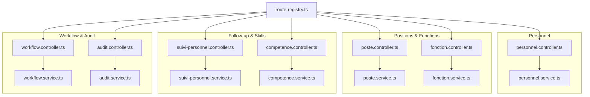
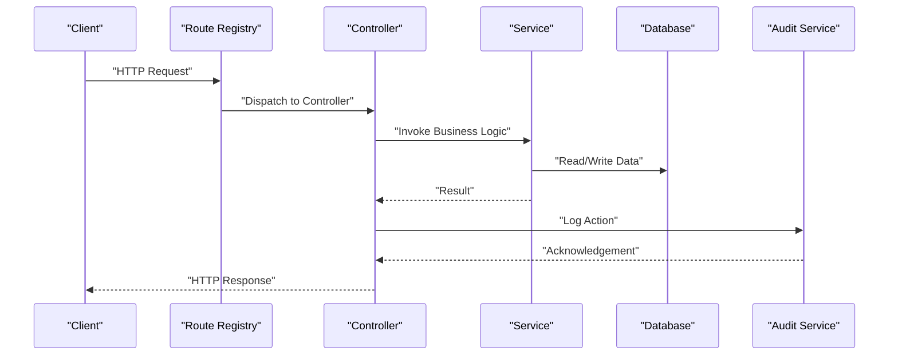
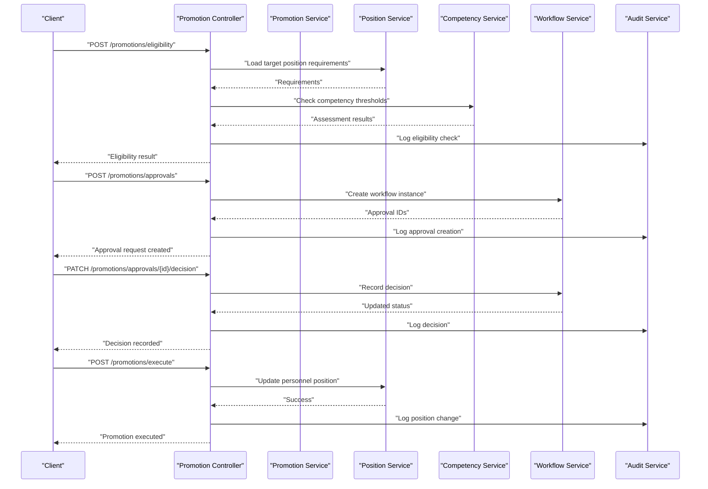
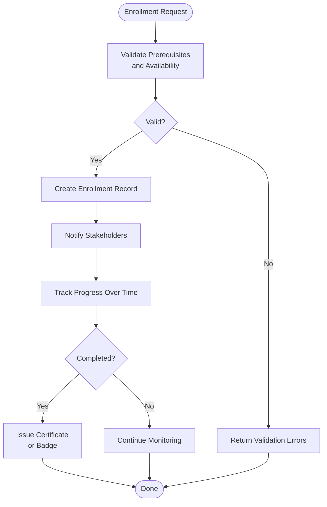
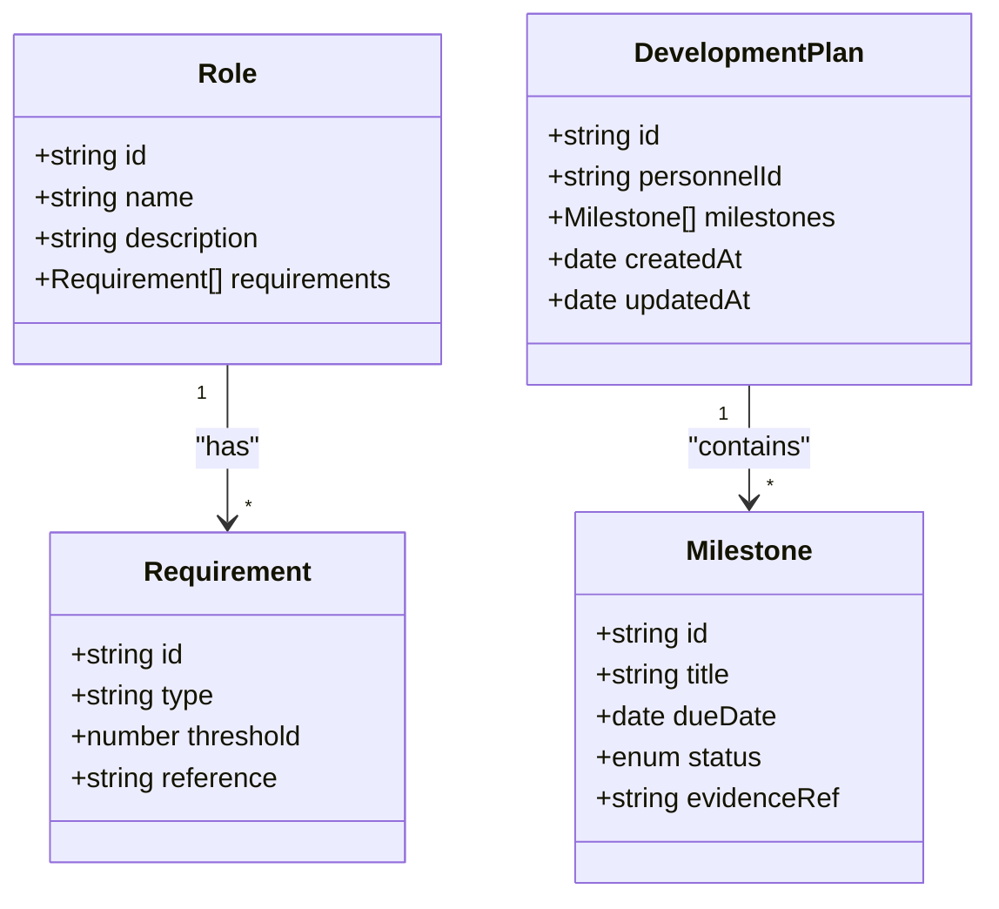
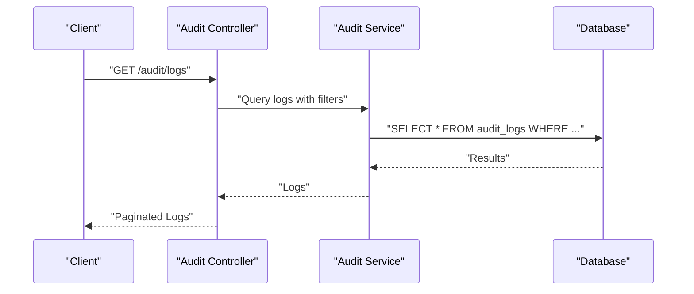
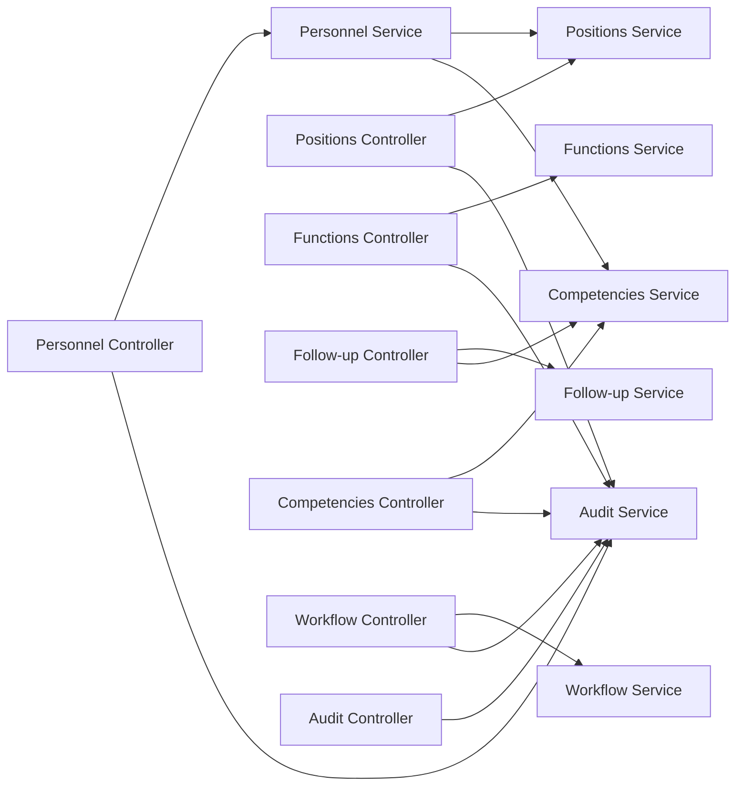

# Career Progression API

<cite>
**Referenced Files in This Document**
- [backend/src/modules/personnel/controllers/personnel.controller.ts](file://backend/src/modules/personnel/controllers/personnel.controller.ts)
- [backend/src/modules/personnel/services/personnel.service.ts](file://backend/src/modules/personnel/services/personnel.service.ts)
- [backend/src/modules/postes/controllers/poste.controller.ts](file://backend/src/modules/postes/controllers/poste.controller.ts)
- [backend/src/modules/postes/services/poste.service.ts](file://backend/src/modules/postes/services/poste.service.ts)
- [backend/src/modules/fonctions/controllers/fonction.controller.ts](file://backend/src/modules/fonctions/controllers/fonction.controller.ts)
- [backend/src/modules/fonctions/services/fonction.service.ts](file://backend/src/modules/fonctions/services/fonction.service.ts)
- [backend/src/modules/suivi-personnel/controllers/suivi-personnel.controller.ts](file://backend/src/modules/suivi-personnel/controllers/suivi-personnel.controller.ts)
- [backend/src/modules/suivi-personnel/services/suivi-personnel.service.ts](file://backend/src/modules/suivi-personnel/services/suivi-personnel.service.ts)
- [backend/src/modules/competences/controllers/competence.controller.ts](file://backend/src/modules/competences/controllers/competence.controller.ts)
- [backend/src/modules/competences/services/competence.service.ts](file://backend/src/modules/competences/services/competence.service.ts)
- [backend/src/modules/validation-workflow/controllers/workflow.controller.ts](file://backend/src/modules/validation-workflow/controllers/workflow.controller.ts)
- [backend/src/modules/validation-workflow/services/workflow.service.ts](file://backend/src/modules/validation-workflow/services/workflow.service.ts)
- [backend/src/modules/audit/controllers/audit.controller.ts](file://backend/src/modules/audit/controllers/audit.controller.ts)
- [backend/src/modules/audit/services/audit.service.ts](file://backend/src/modules/audit/services/audit.service.ts)
- [backend/src/routes/route-registry.ts](file://backend/src/routes/route-registry.ts)
- [backend/database/migrations/016-module-personnel-rh-phase1.sql](file://backend/database/migrations/016-module-personnel-rh-phase1.sql)
- [backend/database/migrations/017-module-personnel-rh-phase2.sql](file://backend/database/migrations/017-module-personnel-rh-phase2.sql)
- [backend/database/migrations/018-module-personnel-rh-phase3.sql](file://backend/database/migrations/018-module-personnel-rh-phase3.sql)
- [backend/database/migrations/019-module-personnel-rh-phase4.sql](file://backend/database/migrations/019-module-personnel-rh-phase4.sql)
- [backend/database/migrations/020-module-personnel-rh-phase5.sql](file://backend/database/migrations/020-module-personnel-rh-phase5.sql)
- [backend/database/migrations/021-module-personnel-rh-permissions-attribution.sql](file://backend/database/migrations/021-module-personnel-rh-permissions-attribution.sql)
- [backend/database/migrations/022-module-personnel-rh-complete.sql](file://backend/database/migrations/022-module-personnel-rh-complete.sql)
</cite>

## Table of Contents
1. [Introduction](#introduction)
2. [Project Structure](#project-structure)
3. [Core Components](#core-components)
4. [Architecture Overview](#architecture-overview)
5. [Detailed Component Analysis](#detailed-component-analysis)
6. [Dependency Analysis](#dependency-analysis)
7. [Performance Considerations](#performance-considerations)
8. [Troubleshooting Guide](#troubleshooting-guide)
9. [Conclusion](#conclusion)
10. [Appendices](#appendices)

## Introduction
This document provides comprehensive API documentation for eLISAschool’s career progression and development capabilities. It covers:
- Promotion workflow APIs: eligibility checks, approval processes, and position changes
- Skill development APIs: training program enrollment, certification tracking, and competency advancement
- Career path planning APIs: role mapping, progression requirements, and development plans
- Examples of promotion criteria, skill matrices, and career trajectory modeling with workflow orchestration and audit trail implementation

The goal is to enable integrators to implement end-to-end personnel lifecycle management including promotions, skills development, and career planning within the school organization context.

## Project Structure
Career progression features are implemented across several modules:
- Personnel module: core employee records and basic HR data
- Positions (postes) and Functions (fonctions): role definitions and hierarchies
- Follow-up (suivi-personnel): performance, training, certifications, and development plans
- Competencies (competences): skill definitions and assessments
- Validation Workflow: multi-step approvals and state transitions
- Audit: immutable logs for compliance and traceability
- Routes: registration of HTTP endpoints

**Diagram sources**
- [backend/src/routes/route-registry.ts](file://backend/src/routes/route-registry.ts)
- [backend/src/modules/personnel/controllers/personnel.controller.ts](file://backend/src/modules/personnel/controllers/personnel.controller.ts)
- [backend/src/modules/personnel/services/personnel.service.ts](file://backend/src/modules/personnel/services/personnel.service.ts)
- [backend/src/modules/postes/controllers/poste.controller.ts](file://backend/src/modules/postes/controllers/poste.controller.ts)
- [backend/src/modules/postes/services/poste.service.ts](file://backend/src/modules/postes/services/poste.service.ts)
- [backend/src/modules/fonctions/controllers/fonction.controller.ts](file://backend/src/modules/fonctions/controllers/fonction.controller.ts)
- [backend/src/modules/fonctions/services/fonction.service.ts](file://backend/src/modules/fonctions/services/fonction.service.ts)
- [backend/src/modules/suivi-personnel/controllers/suivi-personnel.controller.ts](file://backend/src/modules/suivi-personnel/controllers/suivi-personnel.controller.ts)
- [backend/src/modules/suivi-personnel/services/suivi-personnel.service.ts](file://backend/src/modules/suivi-personnel/services/suivi-personnel.service.ts)
- [backend/src/modules/competences/controllers/competence.controller.ts](file://backend/src/modules/competences/controllers/competence.controller.ts)
- [backend/src/modules/competences/services/competence.service.ts](file://backend/src/modules/competences/services/competence.service.ts)
- [backend/src/modules/validation-workflow/controllers/workflow.controller.ts](file://backend/src/modules/validation-workflow/controllers/workflow.controller.ts)
- [backend/src/modules/validation-workflow/services/workflow.service.ts](file://backend/src/modules/validation-workflow/services/workflow.service.ts)
- [backend/src/modules/audit/controllers/audit.controller.ts](file://backend/src/modules/audit/controllers/audit.controller.ts)
- [backend/src/modules/audit/services/audit.service.ts](file://backend/src/modules/audit/services/audit.service.ts)

**Section sources**
- [backend/src/routes/route-registry.ts](file://backend/src/routes/route-registry.ts)

## Core Components
- Promotion Eligibility: Evaluate if a personnel member meets criteria for a target position based on tenure, competencies, and prior roles.
- Approval Workflows: Multi-step validation with configurable steps, approvers, and conditions.
- Position Changes: Apply approved promotions or transfers, updating current role and effective dates.
- Training Enrollment: Register personnel into training programs and track progress.
- Certification Tracking: Record certifications, validity periods, and renewal reminders.
- Competency Advancement: Assess and update competency levels over time.
- Career Path Planning: Define role mappings, progression requirements, and personalized development plans.
- Audit Trail: Immutable logging of all critical actions for compliance and traceability.

**Section sources**
- [backend/src/modules/personnel/controllers/personnel.controller.ts](file://backend/src/modules/personnel/controllers/personnel.controller.ts)
- [backend/src/modules/personnel/services/personnel.service.ts](file://backend/src/modules/personnel/services/personnel.service.ts)
- [backend/src/modules/postes/controllers/poste.controller.ts](file://backend/src/modules/postes/controllers/poste.controller.ts)
- [backend/src/modules/postes/services/poste.service.ts](file://backend/src/modules/postes/services/poste.service.ts)
- [backend/src/modules/fonctions/controllers/fonction.controller.ts](file://backend/src/modules/fonctions/controllers/fonction.controller.ts)
- [backend/src/modules/fonctions/services/fonction.service.ts](file://backend/src/modules/fonctions/services/fonction.service.ts)
- [backend/src/modules/suivi-personnel/controllers/suivi-personnel.controller.ts](file://backend/src/modules/suivi-personnel/controllers/suivi-personnel.controller.ts)
- [backend/src/modules/suivi-personnel/services/suivi-personnel.service.ts](file://backend/src/modules/suivi-personnel/services/suivi-personnel.service.ts)
- [backend/src/modules/competences/controllers/competence.controller.ts](file://backend/src/modules/competences/controllers/competence.controller.ts)
- [backend/src/modules/competences/services/competence.service.ts](file://backend/src/modules/competences/services/competence.service.ts)
- [backend/src/modules/validation-workflow/controllers/workflow.controller.ts](file://backend/src/modules/validation-workflow/controllers/workflow.controller.ts)
- [backend/src/modules/validation-workflow/services/workflow.service.ts](file://backend/src/modules/validation-workflow/services/workflow.service.ts)
- [backend/src/modules/audit/controllers/audit.controller.ts](file://backend/src/modules/audit/controllers/audit.controller.ts)
- [backend/src/modules/audit/services/audit.service.ts](file://backend/src/modules/audit/services/audit.service.ts)

## Architecture Overview
The system follows a layered architecture:
- Controllers expose REST endpoints and validate requests
- Services encapsulate business logic and orchestrate cross-module operations
- Database migrations define entities and relationships for personnel, positions, functions, follow-ups, competencies, workflows, and audits
- Route registry centralizes endpoint registration

**Diagram sources**
- [backend/src/routes/route-registry.ts](file://backend/src/routes/route-registry.ts)
- [backend/src/modules/personnel/controllers/personnel.controller.ts](file://backend/src/modules/personnel/controllers/personnel.controller.ts)
- [backend/src/modules/personnel/services/personnel.service.ts](file://backend/src/modules/personnel/services/personnel.service.ts)
- [backend/src/modules/audit/controllers/audit.controller.ts](file://backend/src/modules/audit/controllers/audit.controller.ts)
- [backend/src/modules/audit/services/audit.service.ts](file://backend/src/modules/audit/services/audit.service.ts)

## Detailed Component Analysis

### Promotion Workflow APIs
Promotion workflow includes eligibility evaluation, multi-step approvals, and final position change execution.

Key endpoints:
- POST /api/promotions/eligibility: Check eligibility for a target position
- POST /api/promotions/approvals: Create an approval request
- PATCH /api/promotions/approvals/{id}/decision: Approve or reject an approval step
- POST /api/promotions/execute: Apply approved promotion to personnel

Request/response patterns:
- Eligibility check payload includes personnelId, targetPosteId, optional criteria overrides
- Approval creation payload includes promotionRequestId, approverIds, requiredSteps
- Decision payload includes decision (approve/reject), comments, evidence references
- Execute payload includes promotionRequestId, effectiveDate

Example promotion criteria:
- Minimum tenure in current role
- Required competency thresholds
- Prior successful completion of training programs
- No pending disciplinary actions

**Diagram sources**
- [backend/src/modules/personnel/controllers/personnel.controller.ts](file://backend/src/modules/personnel/controllers/personnel.controller.ts)
- [backend/src/modules/personnel/services/personnel.service.ts](file://backend/src/modules/personnel/services/personnel.service.ts)
- [backend/src/modules/postes/controllers/poste.controller.ts](file://backend/src/modules/postes/controllers/poste.controller.ts)
- [backend/src/modules/postes/services/poste.service.ts](file://backend/src/modules/postes/services/poste.service.ts)
- [backend/src/modules/competences/controllers/competence.controller.ts](file://backend/src/modules/competences/controllers/competence.controller.ts)
- [backend/src/modules/competences/services/competence.service.ts](file://backend/src/modules/competences/services/competence.service.ts)
- [backend/src/modules/validation-workflow/controllers/workflow.controller.ts](file://backend/src/modules/validation-workflow/controllers/workflow.controller.ts)
- [backend/src/modules/validation-workflow/services/workflow.service.ts](file://backend/src/modules/validation-workflow/services/workflow.service.ts)
- [backend/src/modules/audit/controllers/audit.controller.ts](file://backend/src/modules/audit/controllers/audit.controller.ts)
- [backend/src/modules/audit/services/audit.service.ts](file://backend/src/modules/audit/services/audit.service.ts)

**Section sources**
- [backend/src/modules/personnel/controllers/personnel.controller.ts](file://backend/src/modules/personnel/controllers/personnel.controller.ts)
- [backend/src/modules/personnel/services/personnel.service.ts](file://backend/src/modules/personnel/services/personnel.service.ts)
- [backend/src/modules/postes/controllers/poste.controller.ts](file://backend/src/modules/postes/controllers/poste.controller.ts)
- [backend/src/modules/postes/services/poste.service.ts](file://backend/src/modules/postes/services/poste.service.ts)
- [backend/src/modules/competences/controllers/competence.controller.ts](file://backend/src/modules/competences/controllers/competence.controller.ts)
- [backend/src/modules/competences/services/competence.service.ts](file://backend/src/modules/competences/services/competence.service.ts)
- [backend/src/modules/validation-workflow/controllers/workflow.controller.ts](file://backend/src/modules/validation-workflow/controllers/workflow.controller.ts)
- [backend/src/modules/validation-workflow/services/workflow.service.ts](file://backend/src/modules/validation-workflow/services/workflow.service.ts)
- [backend/src/modules/audit/controllers/audit.controller.ts](file://backend/src/modules/audit/controllers/audit.controller.ts)
- [backend/src/modules/audit/services/audit.service.ts](file://backend/src/modules/audit/services/audit.service.ts)

### Skill Development APIs
Skill development covers training enrollment, certification tracking, and competency advancement.

Key endpoints:
- POST /api/training/enrollments: Enroll personnel in training programs
- GET /api/training/enrollments/{id}: Retrieve enrollment details and progress
- PUT /api/training/enrollments/{id}/progress: Update progress or completion status
- POST /api/certifications: Record new certification
- GET /api/certifications?personnelId={id}: List certifications for a personnel
- PUT /api/certifications/{id}: Update certification details or renewals
- POST /api/competencies/assessments: Submit competency assessment
- GET /api/competencies/profiles/{personnelId}: Retrieve competency profile

Training program enrollment example:
- Payload includes personnelId, trainingProgramId, startDate, expectedEndDate
- System validates availability and prerequisites
- Enrollment record created with initial status “enrolled”

Certification tracking example:
- Payload includes personnelId, certificationName, issuingAuthority, issueDate, expiryDate
- System tracks validity and can trigger renewal reminders

Competency advancement example:
- Assessment payload includes personnelId, competencyId, level, evidenceReferences
- Profile aggregates latest assessments and trends

**Diagram sources**
- [backend/src/modules/suivi-personnel/controllers/suivi-personnel.controller.ts](file://backend/src/modules/suivi-personnel/controllers/suivi-personnel.controller.ts)
- [backend/src/modules/suivi-personnel/services/suivi-personnel.service.ts](file://backend/src/modules/suivi-personnel/services/suivi-personnel.service.ts)
- [backend/src/modules/competences/controllers/competence.controller.ts](file://backend/src/modules/competences/controllers/competence.controller.ts)
- [backend/src/modules/competences/services/competence.service.ts](file://backend/src/modules/competences/services/competence.service.ts)

**Section sources**
- [backend/src/modules/suivi-personnel/controllers/suivi-personnel.controller.ts](file://backend/src/modules/suivi-personnel/controllers/suivi-personnel.controller.ts)
- [backend/src/modules/suivi-personnel/services/suivi-personnel.service.ts](file://backend/src/modules/suivi-personnel/services/suivi-personnel.service.ts)
- [backend/src/modules/competences/controllers/competence.controller.ts](file://backend/src/modules/competences/controllers/competence.controller.ts)
- [backend/src/modules/competences/services/competence.service.ts](file://backend/src/modules/competences/services/competence.service.ts)

### Career Path Planning APIs
Career path planning defines role mappings, progression requirements, and development plans.

Key endpoints:
- GET /api/career-paths/roles: List available roles and hierarchies
- GET /api/career-paths/requirements/{roleId}: Get progression requirements for a role
- POST /api/career-paths/plans: Create a personalized development plan
- GET /api/career-paths/plans/{planId}: Retrieve plan details and milestones
- PUT /api/career-paths/plans/{planId}/milestones: Update milestone status

Role mapping example:
- Map current function to potential next roles based on competencies and experience
- Provide recommended training and certifications to bridge gaps

Development plan example:
- Plan includes milestones, deadlines, responsible parties, and resources
- Milestones can be linked to training enrollments and competency assessments

**Diagram sources**
- [backend/src/modules/fonctions/controllers/fonction.controller.ts](file://backend/src/modules/fonctions/controllers/fonction.controller.ts)
- [backend/src/modules/fonctions/services/fonction.service.ts](file://backend/src/modules/fonctions/services/fonction.service.ts)
- [backend/src/modules/suivi-personnel/controllers/suivi-personnel.controller.ts](file://backend/src/modules/suivi-personnel/controllers/suivi-personnel.controller.ts)
- [backend/src/modules/suivi-personnel/services/suivi-personnel.service.ts](file://backend/src/modules/suivi-personnel/services/suivi-personnel.service.ts)

**Section sources**
- [backend/src/modules/fonctions/controllers/fonction.controller.ts](file://backend/src/modules/fonctions/controllers/fonction.controller.ts)
- [backend/src/modules/fonctions/services/fonction.service.ts](file://backend/src/modules/fonctions/services/fonction.service.ts)
- [backend/src/modules/suivi-personnel/controllers/suivi-personnel.controller.ts](file://backend/src/modules/suivi-personnel/controllers/suivi-personnel.controller.ts)
- [backend/src/modules/suivi-personnel/services/suivi-personnel.service.ts](file://backend/src/modules/suivi-personnel/services/suivi-personnel.service.ts)

### Audit Trail Implementation
All critical actions are logged immutably for compliance and traceability.

Key endpoints:
- GET /api/audit/logs: Query audit logs with filters
- GET /api/audit/logs/{id}: Retrieve specific log entry
- POST /api/audit/manual: Create manual audit entries (for external events)

Audit log fields include:
- actorId, actionType, entityType, entityId, timestamp, metadata, ip, userAgent

**Diagram sources**
- [backend/src/modules/audit/controllers/audit.controller.ts](file://backend/src/modules/audit/controllers/audit.controller.ts)
- [backend/src/modules/audit/services/audit.service.ts](file://backend/src/modules/audit/services/audit.service.ts)

**Section sources**
- [backend/src/modules/audit/controllers/audit.controller.ts](file://backend/src/modules/audit/controllers/audit.controller.ts)
- [backend/src/modules/audit/services/audit.service.ts](file://backend/src/modules/audit/services/audit.service.ts)

## Dependency Analysis
Module dependencies and interactions:
- Controllers depend on services for business logic
- Services depend on database entities defined by migrations
- Cross-module calls occur when promotion requires competency checks and position updates
- Audit service is used across modules to log actions

**Diagram sources**
- [backend/src/modules/personnel/controllers/personnel.controller.ts](file://backend/src/modules/personnel/controllers/personnel.controller.ts)
- [backend/src/modules/personnel/services/personnel.service.ts](file://backend/src/modules/personnel/services/personnel.service.ts)
- [backend/src/modules/postes/controllers/poste.controller.ts](file://backend/src/modules/postes/controllers/poste.controller.ts)
- [backend/src/modules/postes/services/poste.service.ts](file://backend/src/modules/postes/services/poste.service.ts)
- [backend/src/modules/fonctions/controllers/fonction.controller.ts](file://backend/src/modules/fonctions/controllers/fonction.controller.ts)
- [backend/src/modules/fonctions/services/fonction.service.ts](file://backend/src/modules/fonctions/services/fonction.service.ts)
- [backend/src/modules/suivi-personnel/controllers/suivi-personnel.controller.ts](file://backend/src/modules/suivi-personnel/controllers/suivi-personnel.controller.ts)
- [backend/src/modules/suivi-personnel/services/suivi-personnel.service.ts](file://backend/src/modules/suivi-personnel/services/suivi-personnel.service.ts)
- [backend/src/modules/competences/controllers/competence.controller.ts](file://backend/src/modules/competences/controllers/competence.controller.ts)
- [backend/src/modules/competences/services/competence.service.ts](file://backend/src/modules/competences/services/competence.service.ts)
- [backend/src/modules/validation-workflow/controllers/workflow.controller.ts](file://backend/src/modules/validation-workflow/controllers/workflow.controller.ts)
- [backend/src/modules/validation-workflow/services/workflow.service.ts](file://backend/src/modules/validation-workflow/services/workflow.service.ts)
- [backend/src/modules/audit/controllers/audit.controller.ts](file://backend/src/modules/audit/controllers/audit.controller.ts)
- [backend/src/modules/audit/services/audit.service.ts](file://backend/src/modules/audit/services/audit.service.ts)

**Section sources**
- [backend/src/modules/personnel/controllers/personnel.controller.ts](file://backend/src/modules/personnel/controllers/personnel.controller.ts)
- [backend/src/modules/personnel/services/personnel.service.ts](file://backend/src/modules/personnel/services/personnel.service.ts)
- [backend/src/modules/postes/controllers/poste.controller.ts](file://backend/src/modules/postes/controllers/poste.controller.ts)
- [backend/src/modules/postes/services/poste.service.ts](file://backend/src/modules/postes/services/poste.service.ts)
- [backend/src/modules/fonctions/controllers/fonction.controller.ts](file://backend/src/modules/fonctions/controllers/fonction.controller.ts)
- [backend/src/modules/fonctions/services/fonction.service.ts](file://backend/src/modules/fonctions/services/fonction.service.ts)
- [backend/src/modules/suivi-personnel/controllers/suivi-personnel.controller.ts](file://backend/src/modules/suivi-personnel/controllers/suivi-personnel.controller.ts)
- [backend/src/modules/suivi-personnel/services/suivi-personnel.service.ts](file://backend/src/modules/suivi-personnel/services/suivi-personnel.service.ts)
- [backend/src/modules/competences/controllers/competence.controller.ts](file://backend/src/modules/competences/controllers/competence.controller.ts)
- [backend/src/modules/competences/services/competence.service.ts](file://backend/src/modules/competences/services/competence.service.ts)
- [backend/src/modules/validation-workflow/controllers/workflow.controller.ts](file://backend/src/modules/validation-workflow/controllers/workflow.controller.ts)
- [backend/src/modules/validation-workflow/services/workflow.service.ts](file://backend/src/modules/validation-workflow/services/workflow.service.ts)
- [backend/src/modules/audit/controllers/audit.controller.ts](file://backend/src/modules/audit/controllers/audit.controller.ts)
- [backend/src/modules/audit/services/audit.service.ts](file://backend/src/modules/audit/services/audit.service.ts)

## Performance Considerations
- Use pagination for large lists (e.g., audit logs, enrollments)
- Cache frequently accessed role and competency profiles where appropriate
- Batch operations for bulk training enrollments and certification updates
- Index key columns in database (e.g., personnelId, roleId, competencyId)
- Avoid deep nested queries; prefer joins and preloading related entities

[No sources needed since this section provides general guidance]

## Troubleshooting Guide
Common issues and resolutions:
- Permission errors: Ensure user has required permissions for promotion and audit actions
- Validation failures: Check prerequisite validations for training and competency assessments
- Workflow stuck: Review approval decisions and reassign approvers if necessary
- Audit gaps: Verify audit logging middleware is active and not suppressed by error handlers

**Section sources**
- [backend/src/modules/validation-workflow/controllers/workflow.controller.ts](file://backend/src/modules/validation-workflow/controllers/workflow.controller.ts)
- [backend/src/modules/validation-workflow/services/workflow.service.ts](file://backend/src/modules/validation-workflow/services/workflow.service.ts)
- [backend/src/modules/audit/controllers/audit.controller.ts](file://backend/src/modules/audit/controllers/audit.controller.ts)
- [backend/src/modules/audit/services/audit.service.ts](file://backend/src/modules/audit/services/audit.service.ts)

## Conclusion
The career progression and development APIs provide a robust foundation for managing personnel promotions, skills development, and career planning within eLISAschool. The modular design ensures clear separation of concerns, while the audit trail guarantees compliance and traceability. Integrators can leverage these endpoints to build comprehensive HR solutions tailored to educational institutions.

[No sources needed since this section summarizes without analyzing specific files]

## Appendices

### Database Schema References
The following migrations define core entities and relationships for personnel, positions, functions, follow-ups, competencies, workflows, and audits:

- [backend/database/migrations/016-module-personnel-rh-phase1.sql](file://backend/database/migrations/016-module-personnel-rh-phase1.sql)
- [backend/database/migrations/017-module-personnel-rh-phase2.sql](file://backend/database/migrations/017-module-personnel-rh-phase2.sql)
- [backend/database/migrations/018-module-personnel-rh-phase3.sql](file://backend/database/migrations/018-module-personnel-rh-phase3.sql)
- [backend/database/migrations/019-module-personnel-rh-phase4.sql](file://backend/database/migrations/019-module-personnel-rh-phase4.sql)
- [backend/database/migrations/020-module-personnel-rh-phase5.sql](file://backend/database/migrations/020-module-personnel-rh-phase5.sql)
- [backend/database/migrations/021-module-personnel-rh-permissions-attribution.sql](file://backend/database/migrations/021-module-personnel-rh-permissions-attribution.sql)
- [backend/database/migrations/022-module-personnel-rh-complete.sql](file://backend/database/migrations/022-module-personnel-rh-complete.sql)

**Section sources**
- [backend/database/migrations/016-module-personnel-rh-phase1.sql](file://backend/database/migrations/016-module-personnel-rh-phase1.sql)
- [backend/database/migrations/017-module-personnel-rh-phase2.sql](file://backend/database/migrations/017-module-personnel-rh-phase2.sql)
- [backend/database/migrations/018-module-personnel-rh-phase3.sql](file://backend/database/migrations/018-module-personnel-rh-phase3.sql)
- [backend/database/migrations/019-module-personnel-rh-phase4.sql](file://backend/database/migrations/019-module-personnel-rh-phase4.sql)
- [backend/database/migrations/020-module-personnel-rh-phase5.sql](file://backend/database/migrations/020-module-personnel-rh-phase5.sql)
- [backend/database/migrations/021-module-personnel-rh-permissions-attribution.sql](file://backend/database/migrations/021-module-personnel-rh-permissions-attribution.sql)
- [backend/database/migrations/022-module-personnel-rh-complete.sql](file://backend/database/migrations/022-module-personnel-rh-complete.sql)