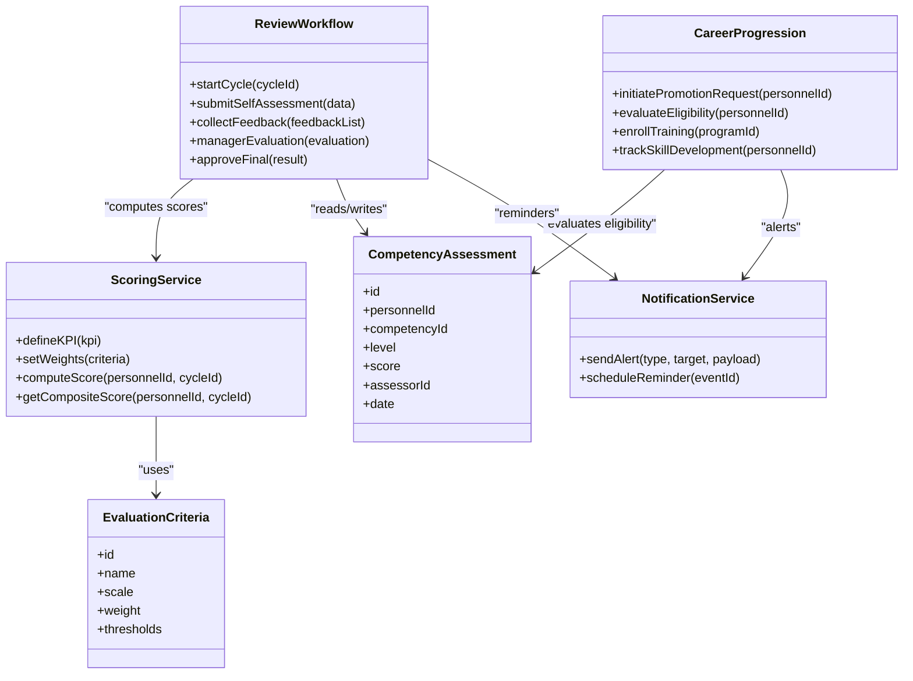
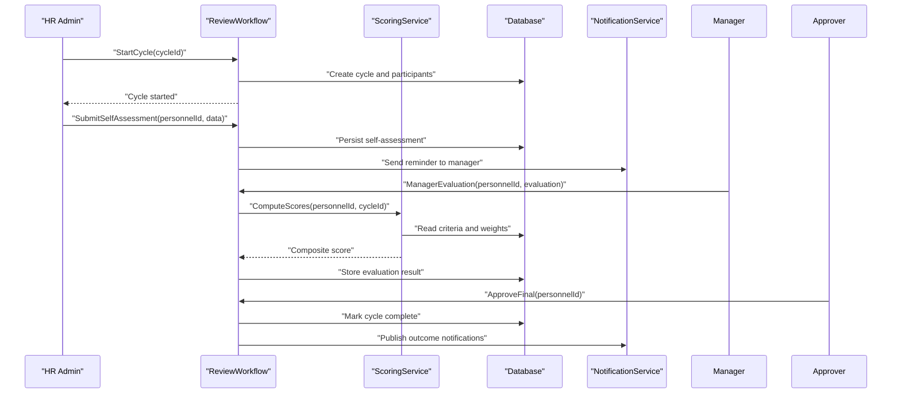
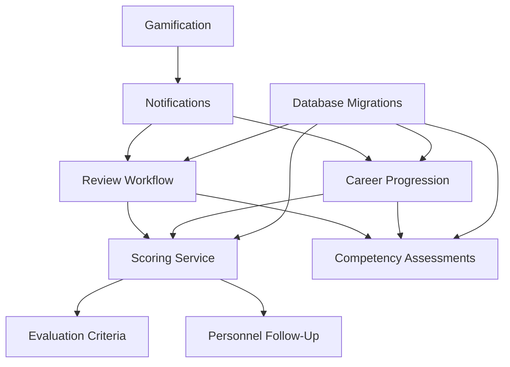
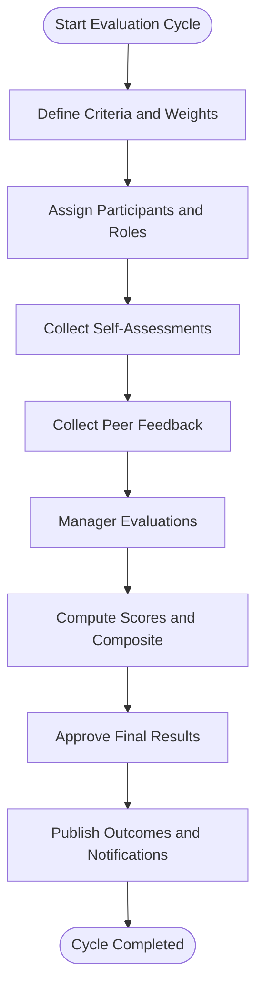

# Performance Evaluation API

<cite>
**Referenced Files in This Document**
- [backend/src/modules/scoring/](file://backend/src/modules/scoring)
- [backend/src/modules/suivi-personnel/](file://backend/src/modules/suivi-personnel)
- [backend/src/modules/competences/](file://backend/src/modules/competences)
- [backend/src/modules/recrutement/](file://backend/src/modules/recrutement)
- [backend/src/modules/validation-workflow/](file://backend/src/modules/validation-workflow)
- [backend/database/migrations/039-scoring-personnel.ts](file://backend/database/migrations/039-scoring-personnel.ts)
- [backend/database/migrations/062-creer-table-evaluations-competences.sql](file://backend/database/migrations/062-creer-table-evaluations-competences.sql)
- [backend/database/migrations/046-organisation-performance-avancee.sql](file://backend/database/migrations/046-organisation-performance-avancee.sql)
- [backend/database/migrations/016-module-personnel-rh-phase1.sql](file://backend/database/migrations/016-module-personnel-rh-phase1.sql)
- [backend/database/migrations/017-module-personnel-rh-phase2.sql](file://backend/database/migrations/017-module-personnel-rh-phase2.sql)
- [backend/database/migrations/018-module-personnel-rh-phase3.sql](file://backend/database/migrations/018-module-personnel-rh-phase3.sql)
- [backend/database/migrations/019-module-personnel-rh-phase4.sql](file://backend/database/migrations/019-module-personnel-rh-phase4.sql)
- [backend/database/migrations/020-module-personnel-rh-phase5.sql](file://backend/database/migrations/020-module-personnel-rh-phase5.sql)
- [backend/database/migrations/021-module-personnel-rh-permissions-attribution.sql](file://backend/database/migrations/021-module-personnel-rh-permissions-attribution.sql)
- [backend/database/migrations/022-module-personnel-rh-complete.sql](file://backend/database/migrations/022-module-personnel-rh-complete.sql)
- [backend/database/migrations/031-suivi-personnel.sql](file://backend/database/migrations/031-suivi-personnel.sql)
- [backend/database/migrations/073-competence-unique-composite.sql](file://backend/database/migrations/073-competence-unique-composite.sql)
- [backend/database/migrations/074-matiere-niveau-unique-composite.sql](file://backend/database/migrations/074-matiere-niveau-unique-composite.sql)
- [backend/database/migrations/075-module-groupes-etablissements.sql](file://backend/database/migrations/075-module-groupes-etablissements.sql)
- [backend/database/migrations/076-permissions-groupes-etablissements.sql](file://backend/database/migrations/076-permissions-groupes-etablissements.sql)
- [backend/database/migrations/077-update-permissions-groupes.sql](file://backend/database/migrations/077-update-permissions-groupes.sql)
- [backend/database/migrations/078-utilisateur-test-groupes.sql](file://backend/database/migrations/078-utilisateur-test-groupes.sql)
- [backend/database/migrations/079-add-roleId-utilisateur-etablissements.sql](file://backend/database/migrations/079-add-roleId-utilisateur-etablissements.sql)
- [backend/database/migrations/079-correction-permissions-groupes.sql](file://backend/database/migrations/079-correction-permissions-groupes.sql)
- [backend/database/migrations/080-preferences-utilisateur-multi-tenant.sql](file://backend/database/migrations/080-preferences-utilisateur-multi-tenant.sql)
- [backend/database/migrations/082-fix-contrainte-unique-preferences.sql](file://backend/database/migrations/082-fix-contrainte-unique-preferences.sql)
- [backend/database/migrations/083-fix-contrainte-unique-parametres.sql](file://backend/database/migrations/083-fix-contrainte-unique-parametres.sql)
- [backend/database/migrations/084-cleanup-classe-id-notes.sql](file://backend/database/migrations/084-cleanup-classe-id-notes.sql)
- [backend/database/migrations/085-periode-etablissement-id.sql](file://backend/database/migrations/085-periode-etablissement-id.sql)
- [backend/database/migrations/086-affectation-matiere-etablissement-id.sql](file://backend/database/migrations/086-affectation-matiere-etablissement-id.sql)
- [backend/database/migrations/087-affectation-matiere-verifications.sql](file://backend/database/migrations/087-affectation-matiere-verifications.sql)
- [backend/database/migrations/088-refactorisation-architecture-academique.sql](file://backend/database/migrations/088-refactorisation-architecture-academique.sql)
- [backend/database/migrations/089-finalisation-architecture-academique-v2.sql](file://backend/database/migrations/089-finalisation-architecture-academique-v2.sql)
- [backend/database/migrations/090-correction-migration-088-camelcase.sql](file://backend/database/migrations/090-correction-migration-088-camelcase.sql)
- [backend/database/migrations/091-peuplement-architecture-academique.sql](file://backend/database/migrations/091-peuplement-architecture-academique.sql)
- [backend/database/migrations/092-refactorisation-classeAnneeId.sql](file://backend/database/migrations/092-refactorisation-classeAnneeId.sql)
- [backend/database/migrations/099-add-monitoring-params.sql](file://backend/database/migrations/099-add-monitoring-params.sql)
- [backend/database/migrations/100-classes-salle-principale.sql](file://backend/database/migrations/100-classes-salle-principale.sql)
- [backend/database/migrations/101-normalisation-annee-scolaire-cloture.sql](file://backend/database/migrations/101-normalisation-annee-scolaire-cloture.sql)
- [backend/database/migrations/102-periodes-hierarchie.sql](file://backend/database/migrations/102-periodes-hierarchie.sql)
- [backend/database/migrations/103-templates-periode-personnalisables.sql](file://backend/database/migrations/103-templates-periode-personnalisables.sql)
- [backend/database/migrations/104-refonte-periodes-niveaux-configurables.sql](file://backend/database/migrations/104-refonte-periodes-niveaux-configurables.sql)
- [backend/database/migrations/105-migration-templates-v5.sql](file://backend/database/migrations/105-migration-templates-v5.sql)
- [backend/database/migrations/106-rename-sequence-to-evaluation.sql](file://backend/database/migrations/106-rename-sequence-to-evaluation.sql)
- [backend/database/migrations/107-cleanup-configuration-modules-actif.sql](file://backend/database/migrations/107-cleanup-configuration-modules-actif.sql)
- [backend/database/migrations/108-refactor-salle-principale.sql](file://backend/database/migrations/108-refactor-salle-principale.sql)
- [backend/scripts/run-scoring-migration.ts](file://backend/scripts/run-scoring-migration.ts)
- [backend/scripts/run-scoring-migration-v2.ts](file://backend/scripts/run-scoring-migration-v2.ts)
- [backend/docs/audit-trail.md](file://backend/docs/audit-trail.md)
- [backend/src/modules/notifications/](file://backend/src/modules/notifications)
- [backend/src/modules/gamification/](file://backend/src/modules/gamification)
</cite>

## Table of Contents
1. [Introduction](#introduction)
2. [Project Structure](#project-structure)
3. [Core Components](#core-components)
4. [Architecture Overview](#architecture-overview)
5. [Detailed Component Analysis](#detailed-component-analysis)
6. [Dependency Analysis](#dependency-analysis)
7. [Performance Considerations](#performance-considerations)
8. [Troubleshooting Guide](#troubleshooting-guide)
9. [Conclusion](#conclusion)
10. [Appendices](#appendices)

## Introduction
This document provides comprehensive API documentation for eLISAschool’s performance evaluation and career progression capabilities. It covers:
- Performance metrics APIs including KPI definitions, scoring systems, and evaluation criteria configuration
- Review workflow APIs for appraisals, feedback collection, manager evaluations, and self-assessments
- Career progression APIs for promotion workflows, skill development tracking, and training program management
- Competency assessment APIs, performance analytics, and career path planning tools
- Examples of evaluation cycles, scoring algorithms, automated alerts, data validation, and audit trail implementation

The goal is to enable developers and HR administrators to integrate with the system confidently and implement robust performance management processes.

## Project Structure
The performance and career progression features are implemented across several modules and database migrations:
- Scoring module: defines scoring models, weights, and calculation logic
- Personnel follow-up (suivi-personnel): tracks personnel progress, goals, and reviews
- Competencies module: manages competency definitions, levels, and assessments
- Recruitment module: supports promotion workflows and role transitions
- Validation workflow: orchestrates multi-step review and approval flows
- Notifications and gamification: provide automated alerts and engagement signals

```mermaid
graph TB
subgraph "Backend Modules"
SC["Scoring Module"]
SP["Suivi-Personnel Module"]
CP["Competences Module"]
RC["Recrutement Module"]
VW["Validation Workflow Module"]
NF["Notifications Module"]
GM["Gamification Module"]
end
subgraph "Database Migrations"
M16["Personnel RH Phase1"]
M17["Personnel RH Phase2"]
M18["Personnel RH Phase3"]
M19["Personnel RH Phase4"]
M20["Personnel RH Phase5"]
M21["Permissions Attribution"]
M22["RH Complete"]
M31["Suivi Personnel"]
M39["Scoring Personnel"]
M46["Organisation Performance Avancee"]
M62["Evaluations Competences"]
M73["Competence Unique Composite"]
M74["Matiere Niveau Unique Composite"]
end
SC --> M39
SC --> M46
SP --> M31
CP --> M62
CP --> M73
CP --> M74
RC --> M16
RC --> M17
RC --> M18
RC --> M19
RC --> M20
RC --> M21
RC --> M22
VW --> M21
NF --> M46
GM --> M46
```

**Diagram sources**
- [backend/database/migrations/039-scoring-personnel.ts](file://backend/database/migrations/039-scoring-personnel.ts)
- [backend/database/migrations/046-organisation-performance-avancee.sql](file://backend/database/migrations/046-organisation-performance-avancee.sql)
- [backend/database/migrations/062-creer-table-evaluations-competences.sql](file://backend/database/migrations/062-creer-table-evaluations-competences.sql)
- [backend/database/migrations/031-suivi-personnel.sql](file://backend/database/migrations/031-suivi-personnel.sql)
- [backend/database/migrations/016-module-personnel-rh-phase1.sql](file://backend/database/migrations/016-module-personnel-rh-phase1.sql)
- [backend/database/migrations/017-module-personnel-rh-phase2.sql](file://backend/database/migrations/017-module-personnel-rh-phase2.sql)
- [backend/database/migrations/018-module-personnel-rh-phase3.sql](file://backend/database/migrations/018-module-personnel-rh-phase3.sql)
- [backend/database/migrations/019-module-personnel-rh-phase4.sql](file://backend/database/migrations/019-module-personnel-rh-phase4.sql)
- [backend/database/migrations/020-module-personnel-rh-phase5.sql](file://backend/database/migrations/020-module-personnel-rh-phase5.sql)
- [backend/database/migrations/021-module-personnel-rh-permissions-attribution.sql](file://backend/database/migrations/021-module-personnel-rh-permissions-attribution.sql)
- [backend/database/migrations/022-module-personnel-rh-complete.sql](file://backend/database/migrations/022-module-personnel-rh-complete.sql)
- [backend/database/migrations/073-competence-unique-composite.sql](file://backend/database/migrations/073-competence-unique-composite.sql)
- [backend/database/migrations/074-matiere-niveau-unique-composite.sql](file://backend/database/migrations/074-matiere-niveau-unique-composite.sql)

**Section sources**
- [backend/src/modules/scoring/](file://backend/src/modules/scoring)
- [backend/src/modules/suivi-personnel/](file://backend/src/modules/suivi-personnel)
- [backend/src/modules/competences/](file://backend/src/modules/competences)
- [backend/src/modules/recrutement/](file://backend/src/modules/recrutement)
- [backend/src/modules/validation-workflow/](file://backend/src/modules/validation-workflow)
- [backend/database/migrations/039-scoring-personnel.ts](file://backend/database/migrations/039-scoring-personnel.ts)
- [backend/database/migrations/062-creer-table-evaluations-competences.sql](file://backend/database/migrations/062-creer-table-evaluations-competences.sql)
- [backend/database/migrations/046-organisation-performance-avancee.sql](file://backend/database/migrations/046-organisation-performance-avancee.sql)
- [backend/database/migrations/031-suivi-personnel.sql](file://backend/database/migrations/031-suivi-personnel.sql)
- [backend/database/migrations/016-module-personnel-rh-phase1.sql](file://backend/database/migrations/016-module-personnel-rh-phase1.sql)
- [backend/database/migrations/017-module-personnel-rh-phase2.sql](file://backend/database/migrations/017-module-personnel-rh-phase2.sql)
- [backend/database/migrations/018-module-personnel-rh-phase3.sql](file://backend/database/migrations/018-module-personnel-rh-phase3.sql)
- [backend/database/migrations/019-module-personnel-rh-phase4.sql](file://backend/database/migrations/019-module-personnel-rh-phase4.sql)
- [backend/database/migrations/020-module-personnel-rh-phase5.sql](file://backend/database/migrations/020-module-personnel-rh-phase5.sql)
- [backend/database/migrations/021-module-personnel-rh-permissions-attribution.sql](file://backend/database/migrations/021-module-personnel-rh-permissions-attribution.sql)
- [backend/database/migrations/022-module-personnel-rh-complete.sql](file://backend/database/migrations/022-module-personnel-rh-complete.sql)
- [backend/database/migrations/073-competence-unique-composite.sql](file://backend/database/migrations/073-competence-unique-composite.sql)
- [backend/database/migrations/074-matiere-niveau-unique-composite.sql](file://backend/database/migrations/074-matiere-niveau-unique-composite.sql)

## Core Components
- Scoring System: Defines KPIs, weights, thresholds, and scoring algorithms; computes composite scores for personnel evaluations.
- Evaluation Criteria Configuration: Allows defining criteria per role or department, with configurable scales and targets.
- Review Workflows: Multi-step appraisal process including self-assessment, peer feedback, manager evaluation, and final approval.
- Competency Assessments: Tracks competencies, proficiency levels, and assessment outcomes over time.
- Career Progression: Manages promotions, role transitions, and training program enrollments based on performance and competency results.
- Analytics and Alerts: Aggregates performance metrics, generates insights, and triggers automated notifications for milestones or risks.

Key responsibilities:
- Data integrity and validation for all inputs
- Audit logging for all changes
- Role-based access control for sensitive operations
- Configurable evaluation cycles and templates

**Section sources**
- [backend/src/modules/scoring/](file://backend/src/modules/scoring)
- [backend/src/modules/suivi-personnel/](file://backend/src/modules/suivi-personnel)
- [backend/src/modules/competences/](file://backend/src/modules/competences)
- [backend/src/modules/recrutement/](file://backend/src/modules/recrutement)
- [backend/src/modules/validation-workflow/](file://backend/src/modules/validation-workflow)
- [backend/database/migrations/039-scoring-personnel.ts](file://backend/database/migrations/039-scoring-personnel.ts)
- [backend/database/migrations/062-creer-table-evaluations-competences.sql](file://backend/database/migrations/062-creer-table-evaluations-competences.sql)
- [backend/database/migrations/046-organisation-performance-avancee.sql](file://backend/database/migrations/046-organisation-performance-avancee.sql)
- [backend/database/migrations/031-suivi-personnel.sql](file://backend/database/migrations/031-suivi-personnel.sql)

## Architecture Overview
The performance evaluation architecture integrates scoring, competencies, personnel tracking, and workflow orchestration. The following diagram maps core components and their interactions.

**Diagram sources**
- [backend/src/modules/scoring/](file://backend/src/modules/scoring)
- [backend/src/modules/competences/](file://backend/src/modules/competences)
- [backend/src/modules/validation-workflow/](file://backend/src/modules/validation-workflow)
- [backend/src/modules/recrutement/](file://backend/src/modules/recrutement)
- [backend/src/modules/notifications/](file://backend/src/modules/notifications)

## Detailed Component Analysis

### Performance Metrics and Scoring APIs
- Define KPIs: Create, update, and delete KPIs with descriptions, units, and targets.
- Configure Criteria: Set evaluation criteria per role/department, including scales, weights, and thresholds.
- Compute Scores: Calculate individual and composite scores for a given evaluation cycle.
- Retrieve Results: Fetch scored evaluations, breakdown by criteria, and historical trends.

Example endpoints (conceptual):
- POST /api/scoring/kpis
- PUT /api/scoring/criteria
- POST /api/scoring/compute
- GET /api/scoring/results?personnelId=&cycleId=

Data validation:
- Ensure weights sum to 1.0
- Validate scale ranges and threshold ordering
- Enforce tenant isolation for KPIs and criteria

Audit trail:
- Log all KPI and criteria changes with actor, timestamp, and diff

**Section sources**
- [backend/database/migrations/039-scoring-personnel.ts](file://backend/database/migrations/039-scoring-personnel.ts)
- [backend/database/migrations/046-organisation-performance-avancee.sql](file://backend/database/migrations/046-organisation-performance-avancee.sql)
- [backend/scripts/run-scoring-migration.ts](file://backend/scripts/run-scoring-migration.ts)
- [backend/scripts/run-scoring-migration-v2.ts](file://backend/scripts/run-scoring-migration-v2.ts)

### Review Workflow APIs
- Start Cycle: Initialize an evaluation cycle with participants and deadlines.
- Self-Assessment: Allow personnel to submit self-evaluations against criteria.
- Feedback Collection: Collect peer and stakeholder feedback with structured forms.
- Manager Evaluation: Managers review inputs, add comments, and propose scores.
- Final Approval: Authorized users approve final results and publish outcomes.

Sequence flow:

**Diagram sources**
- [backend/src/modules/validation-workflow/](file://backend/src/modules/validation-workflow)
- [backend/src/modules/scoring/](file://backend/src/modules/scoring)
- [backend/src/modules/notifications/](file://backend/src/modules/notifications)

**Section sources**
- [backend/src/modules/validation-workflow/](file://backend/src/modules/validation-workflow)
- [backend/src/modules/notifications/](file://backend/src/modules/notifications)
- [backend/database/migrations/031-suivi-personnel.sql](file://backend/database/migrations/031-suivi-personnel.sql)

### Competency Assessment APIs
- Manage Competencies: Define competencies, proficiency levels, and descriptors.
- Assess Competencies: Record assessments per personnel with assessor details and dates.
- Track Progress: Aggregate competency scores over time and compare against targets.
- Integrate with Reviews: Link competency assessments to evaluation cycles.

Endpoints (conceptual):
- POST /api/competencies
- PUT /api/competencies/{id}
- POST /api/competencies/assessments
- GET /api/competencies/progress?personnelId=

Validation:
- Ensure unique composite constraints for competencies
- Validate level progression rules

**Section sources**
- [backend/database/migrations/062-creer-table-evaluations-competences.sql](file://backend/database/migrations/062-creer-table-evaluations-competences.sql)
- [backend/database/migrations/073-competence-unique-composite.sql](file://backend/database/migrations/073-competence-unique-composite.sql)
- [backend/database/migrations/074-matiere-niveau-unique-composite.sql](file://backend/database/migrations/074-matiere-niveau-unique-composite.sql)

### Career Progression APIs
- Promotion Requests: Initiate and manage promotion workflows tied to performance and competency results.
- Eligibility Checks: Evaluate eligibility based on scoring thresholds and competency levels.
- Training Programs: Enroll personnel in training programs aligned to skill gaps.
- Skill Development Tracking: Monitor completion and impact of training on performance.

Endpoints (conceptual):
- POST /api/career/promotions
- GET /api/career/eligibility?personnelId=
- POST /api/career/training/enroll
- GET /api/career/training/progress?personnelId=

Integration points:
- Uses scoring results and competency assessments to determine eligibility
- Triggers notifications upon enrollment and completion

**Section sources**
- [backend/src/modules/recrutement/](file://backend/src/modules/recrutement)
- [backend/database/migrations/016-module-personnel-rh-phase1.sql](file://backend/database/migrations/016-module-personnel-rh-phase1.sql)
- [backend/database/migrations/017-module-personnel-rh-phase2.sql](file://backend/database/migrations/017-module-personnel-rh-phase2.sql)
- [backend/database/migrations/018-module-personnel-rh-phase3.sql](file://backend/database/migrations/018-module-personnel-rh-phase3.sql)
- [backend/database/migrations/019-module-personnel-rh-phase4.sql](file://backend/database/migrations/019-module-personnel-rh-phase4.sql)
- [backend/database/migrations/020-module-personnel-rh-phase5.sql](file://backend/database/migrations/020-module-personnel-rh-phase5.sql)
- [backend/database/migrations/021-module-personnel-rh-permissions-attribution.sql](file://backend/database/migrations/021-module-personnel-rh-permissions-attribution.sql)
- [backend/database/migrations/022-module-personnel-rh-complete.sql](file://backend/database/migrations/022-module-personnel-rh-complete.sql)

### Performance Analytics and Career Path Planning Tools
- Dashboards: Aggregate scores, competency trends, and review outcomes.
- Alerts: Automated notifications for upcoming deadlines, low scores, or high potential indicators.
- Career Paths: Suggest next roles based on performance and competency profiles.

Analytics endpoints (conceptal):
- GET /api/analytics/personnel/{id}/scores
- GET /api/analytics/team/{teamId}/trends
- GET /api/analytics/career/path?personnelId=

**Section sources**
- [backend/database/migrations/046-organisation-performance-avancee.sql](file://backend/database/migrations/046-organisation-performance-avancee.sql)
- [backend/src/modules/notifications/](file://backend/src/modules/notifications)
- [backend/src/modules/gamification/](file://backend/src/modules/gamification)

## Dependency Analysis
The performance evaluation system depends on multiple modules and migrations. The following diagram shows key dependencies and relationships.

**Diagram sources**
- [backend/src/modules/scoring/](file://backend/src/modules/scoring)
- [backend/src/modules/suivi-personnel/](file://backend/src/modules/suivi-personnel)
- [backend/src/modules/competences/](file://backend/src/modules/competences)
- [backend/src/modules/recrutement/](file://backend/src/modules/recrutement)
- [backend/src/modules/validation-workflow/](file://backend/src/modules/validation-workflow)
- [backend/src/modules/notifications/](file://backend/src/modules/notifications)
- [backend/src/modules/gamification/](file://backend/src/modules/gamification)
- [backend/database/migrations/039-scoring-personnel.ts](file://backend/database/migrations/039-scoring-personnel.ts)
- [backend/database/migrations/031-suivi-personnel.sql](file://backend/database/migrations/031-suivi-personnel.sql)
- [backend/database/migrations/062-creer-table-evaluations-competences.sql](file://backend/database/migrations/062-creer-table-evaluations-competences.sql)
- [backend/database/migrations/016-module-personnel-rh-phase1.sql](file://backend/database/migrations/016-module-personnel-rh-phase1.sql)
- [backend/database/migrations/022-module-personnel-rh-complete.sql](file://backend/database/migrations/022-module-personnel-rh-complete.sql)

**Section sources**
- [backend/src/modules/scoring/](file://backend/src/modules/scoring)
- [backend/src/modules/suivi-personnel/](file://backend/src/modules/suivi-personnel)
- [backend/src/modules/competences/](file://backend/src/modules/competences)
- [backend/src/modules/recrutement/](file://backend/src/modules/recrutement)
- [backend/src/modules/validation-workflow/](file://backend/src/modules/validation-workflow)
- [backend/src/modules/notifications/](file://backend/src/modules/notifications)
- [backend/src/modules/gamification/](file://backend/src/modules/gamification)
- [backend/database/migrations/039-scoring-personnel.ts](file://backend/database/migrations/039-scoring-personnel.ts)
- [backend/database/migrations/031-suivi-personnel.sql](file://backend/database/migrations/031-suivi-personnel.sql)
- [backend/database/migrations/062-creer-table-evaluations-competences.sql](file://backend/database/migrations/062-creer-table-evaluations-competences.sql)
- [backend/database/migrations/016-module-personnel-rh-phase1.sql](file://backend/database/migrations/016-module-personnel-rh-phase1.sql)
- [backend/database/migrations/022-module-personnel-rh-complete.sql](file://backend/database/migrations/022-module-personnel-rh-complete.sql)

## Performance Considerations
- Indexing: Ensure indexes on frequently queried fields such as personnelId, cycleId, and competencyId.
- Batch Operations: Use batch endpoints for bulk scoring computations and training enrollments.
- Caching: Cache static criteria and KPI configurations to reduce database load.
- Pagination: Implement pagination for large result sets in analytics dashboards.
- Concurrency: Apply optimistic locking for concurrent updates during review workflows.

[No sources needed since this section provides general guidance]

## Troubleshooting Guide
Common issues and resolutions:
- Weight Sum Validation: If weights do not sum to 1.0, reconfigure criteria before computing scores.
- Missing Assessor: Ensure assessors have required permissions and are assigned to the evaluation cycle.
- Cycle Deadlines: Check notification reminders and extend deadlines if necessary via admin controls.
- Audit Trail Gaps: Verify audit logging middleware is enabled and that all mutations are recorded.

Audit trail reference:
- See audit trail documentation for logging conventions and retention policies.

**Section sources**
- [backend/docs/audit-trail.md](file://backend/docs/audit-trail.md)

## Conclusion
The eLISAschool performance evaluation and career progression APIs provide a robust foundation for managing personnel performance, competency development, and career growth. By leveraging configurable scoring systems, structured review workflows, and integrated analytics, organizations can implement fair and transparent evaluation processes. Proper data validation, audit trails, and automated alerts ensure reliability and compliance.

[No sources needed since this section summarizes without analyzing specific files]

## Appendices

### Example Evaluation Cycle Flow

[No sources needed since this diagram shows conceptual workflow, not actual code structure]

### Scoring Algorithm Summary
- Inputs: Individual criterion scores, weights, thresholds
- Process: Weighted average computation, threshold checks, composite aggregation
- Outputs: Criterion-level scores, composite score, status flags (e.g., meets/exceeds expectations)

[No sources needed since this section provides general guidance]

### Data Validation Rules
- Weights must be positive and sum to 1.0
- Thresholds must be ordered and within scale bounds
- Assessor IDs must exist and have appropriate permissions
- Cycle dates must be valid and non-overlapping

[No sources needed since this section provides general guidance]