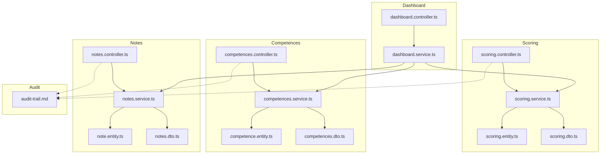
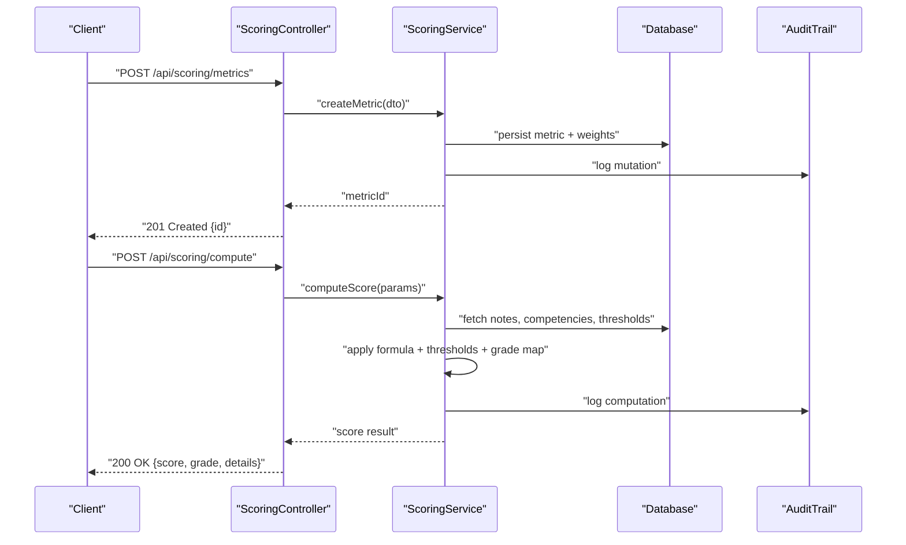
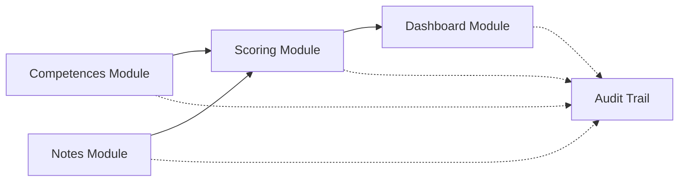

# Performance Metrics API

<cite>
**Referenced Files in This Document**
- [scoring module index](file://backend/src/modules/scoring/index.ts)
- [scoring controller](file://backend/src/modules/scoring/controllers/scoring.controller.ts)
- [scoring service](file://backend/src/modules/scoring/services/scoring.service.ts)
- [scoring entity](file://backend/src/modules/scoring/entities/scoring.entity.ts)
- [scoring DTOs](file://backend/src/modules/scoring/dto/scoring.dto.ts)
- [competences module index](file://backend/src/modules/competences/index.ts)
- [competences controller](file://backend/src/modules/competences/controllers/competences.controller.ts)
- [competences service](file://backend/src/modules/competences/services/competences.service.ts)
- [competences entity](file://backend/src/modules/competences/entities/competence.entity.ts)
- [competences DTOs](file://backend/src/modules/competences/dto/competences.dto.ts)
- [notes module index](file://backend/src/modules/notes/index.ts)
- [notes controller](file://backend/src/modules/notes/controllers/notes.controller.ts)
- [notes service](file://backend/src/modules/notes/services/notes.service.ts)
- [notes entity](file://backend/src/modules/notes/entities/note.entity.ts)
- [notes DTOs](file://backend/src/modules/notes/dto/notes.dto.ts)
- [dashboard module index](file://backend/src/modules/dashboard/index.ts)
- [dashboard controller](file://backend/src/modules/dashboard/controllers/dashboard.controller.ts)
- [dashboard service](file://backend/src/modules/dashboard/services/dashboard.service.ts)
- [audit trail documentation](file://backend/docs/audit-trail.md)
- [scoring migration script](file://backend/scripts/run-scoring-migration.ts)
- [scoring SQL migration](file://backend/database/migrations/039-scoring-personnel.ts)
</cite>

## Table of Contents
1. [Introduction](#introduction)
2. [Project Structure](#project-structure)
3. [Core Components](#core-components)
4. [Architecture Overview](#architecture-overview)
5. [Detailed Component Analysis](#detailed-component-analysis)
6. [Dependency Analysis](#dependency-analysis)
7. [Performance Considerations](#performance-considerations)
8. [Troubleshooting Guide](#troubleshooting-guide)
9. [Conclusion](#conclusion)
10. [Appendices](#appendices)

## Introduction
This document provides comprehensive API documentation for eLISAschool’s performance metrics and scoring system. It covers:
- KPI definition APIs: metric creation, weight assignment, evaluation criteria configuration
- Scoring algorithms APIs: automated calculations, threshold definitions, grade mappings
- Competency assessment APIs: skill evaluation, rating scales, assessment templates
- Examples of metric hierarchies, scoring formulas, and performance benchmarks
- Data validation and audit trail implementation

The goal is to enable developers and integrators to implement robust, auditable, and scalable performance measurement across students and personnel.

## Project Structure
The performance metrics and scoring functionality spans several modules:
- Scoring module: core scoring logic, thresholds, grade mappings, and automated calculation endpoints
- Competences module: competency definitions, rating scales, and assessment templates
- Notes module: academic scores that feed into scoring computations
- Dashboard module: aggregated metrics and performance summaries
- Audit trail: cross-cutting logging for all changes to metrics, weights, thresholds, and assessments

**Diagram sources**
- [scoring controller](file://backend/src/modules/scoring/controllers/scoring.controller.ts)
- [scoring service](file://backend/src/modules/scoring/services/scoring.service.ts)
- [scoring entity](file://backend/src/modules/scoring/entities/scoring.entity.ts)
- [scoring DTOs](file://backend/src/modules/scoring/dto/scoring.dto.ts)
- [competences controller](file://backend/src/modules/competences/controllers/competences.controller.ts)
- [competences service](file://backend/src/modules/competences/services/competences.service.ts)
- [competences entity](file://backend/src/modules/competences/entities/competence.entity.ts)
- [competences DTOs](file://backend/src/modules/competences/dto/competences.dto.ts)
- [notes controller](file://backend/src/modules/notes/controllers/notes.controller.ts)
- [notes service](file://backend/src/modules/notes/services/notes.service.ts)
- [notes entity](file://backend/src/modules/notes/entities/note.entity.ts)
- [notes DTOs](file://backend/src/modules/notes/dto/notes.dto.ts)
- [dashboard controller](file://backend/src/modules/dashboard/controllers/dashboard.controller.ts)
- [dashboard service](file://backend/src/modules/dashboard/services/dashboard.service.ts)
- [audit trail documentation](file://backend/docs/audit-trail.md)

**Section sources**
- [scoring module index](file://backend/src/modules/scoring/index.ts)
- [competences module index](file://backend/src/modules/competences/index.ts)
- [notes module index](file://backend/src/modules/notes/index.ts)
- [dashboard module index](file://backend/src/modules/dashboard/index.ts)

## Core Components
- Scoring Controller: exposes REST endpoints for metric definitions, weights, thresholds, grade mappings, and score computation
- Scoring Service: orchestrates business logic, validates inputs, computes weighted scores, applies thresholds, maps grades, and triggers audits
- Scoring Entity: persists metrics, weights, thresholds, grade mappings, and computed results
- Scoring DTOs: request/response schemas with validation rules
- Competences Controller/Service/Entity/DTOs: manage skills, rating scales, and assessment templates
- Notes Controller/Service/Entity/DTOs: store academic scores consumed by scoring computations
- Dashboard Controller/Service: aggregate and present performance metrics and benchmarks
- Audit Trail: records who changed what, when, and why for compliance and traceability

Key responsibilities:
- Metric lifecycle: create, update, delete, activate/deactivate
- Weight management: assign per-metric weights and validate totals
- Thresholds and grade mapping: define ranges and labels
- Automated scoring: compute composite scores from raw notes and competencies
- Benchmarks: compare against class/school/year-level baselines
- Auditing: log all mutations and critical reads

**Section sources**
- [scoring controller](file://backend/src/modules/scoring/controllers/scoring.controller.ts)
- [scoring service](file://backend/src/modules/scoring/services/scoring.service.ts)
- [scoring entity](file://backend/src/modules/scoring/entities/scoring.entity.ts)
- [scoring DTOs](file://backend/src/modules/scoring/dto/scoring.dto.ts)
- [competences controller](file://backend/src/modules/competences/controllers/competences.controller.ts)
- [competences service](file://backend/src/modules/competences/services/competences.service.ts)
- [competences entity](file://backend/src/modules/competences/entities/competence.entity.ts)
- [competences DTOs](file://backend/src/modules/competences/dto/competences.dto.ts)
- [notes controller](file://backend/src/modules/notes/controllers/notes.controller.ts)
- [notes service](file://backend/src/modules/notes/services/notes.service.ts)
- [notes entity](file://backend/src/modules/notes/entities/note.entity.ts)
- [notes DTOs](file://backend/src/modules/notes/dto/notes.dto.ts)
- [dashboard controller](file://backend/src/modules/dashboard/controllers/dashboard.controller.ts)
- [dashboard service](file://backend/src/modules/dashboard/services/dashboard.service.ts)
- [audit trail documentation](file://backend/docs/audit-trail.md)

## Architecture Overview
The scoring system follows a layered architecture:
- Controllers handle HTTP requests and responses
- Services encapsulate business logic and orchestrate data access
- Entities represent persistent models
- DTOs enforce input/output contracts
- Dashboard aggregates outputs for reporting
- Audit trail logs changes across modules

**Diagram sources**
- [scoring controller](file://backend/src/modules/scoring/controllers/scoring.controller.ts)
- [scoring service](file://backend/src/modules/scoring/services/scoring.service.ts)
- [audit trail documentation](file://backend/docs/audit-trail.md)

## Detailed Component Analysis

### KPI Definition APIs (Metrics, Weights, Evaluation Criteria)
Endpoints:
- Create metric: POST /api/scoring/metrics
- Update metric: PUT /api/scoring/metrics/:id
- Delete metric: DELETE /api/scoring/metrics/:id
- List metrics: GET /api/scoring/metrics
- Activate/deactivate: PATCH /api/scoring/metrics/:id/status
- Assign weights: POST /api/scoring/metrics/:id/weights
- Configure evaluation criteria: POST /api/scoring/metrics/:id/criteria

Request/Response patterns:
- Metric payload includes name, description, type, hierarchy path, parent_id, active flag
- Weight payload includes metric_id, weight_value, min/max bounds, validation rules
- Criteria payload includes dimension, rubric levels, descriptors, scoring method

Validation:
- Non-negative weights; sum constraints enforced at group level
- Unique metric identifiers within scope
- Hierarchy integrity checks (no cycles)
- Criteria must reference valid dimensions and levels

Audit:
- All mutations logged with actor, timestamp, before/after snapshots

Example scenarios:
- Hierarchical metrics: School -> Department -> Class -> Subject
- Weighted aggregation: subject_weight * subject_score + competence_weight * competence_score
- Evaluation criteria: multi-dimensional rubrics mapped to numeric bands

**Section sources**
- [scoring controller](file://backend/src/modules/scoring/controllers/scoring.controller.ts)
- [scoring service](file://backend/src/modules/scoring/services/scoring.service.ts)
- [scoring entity](file://backend/src/modules/scoring/entities/scoring.entity.ts)
- [scoring DTOs](file://backend/src/modules/scoring/dto/scoring.dto.ts)

### Scoring Algorithms APIs (Automated Calculations, Thresholds, Grade Mappings)
Endpoints:
- Compute score: POST /api/scoring/compute
- Define thresholds: POST /api/scoring/thresholds
- Update thresholds: PUT /api/scoring/thresholds/:id
- Define grade mapping: POST /api/scoring/grade-maps
- Update grade mapping: PUT /api/scoring/grade-maps/:id
- List thresholds/maps: GET /api/scoring/thresholds, GET /api/scoring/grade-maps

Computation flow:
- Gather inputs: raw notes, competency ratings, metric weights
- Normalize values to common scale
- Apply weighted formula
- Apply thresholds to determine pass/fail or tier
- Map final score to grade label

Thresholds and grade mapping:
- Thresholds define numeric ranges and outcomes
- Grade maps translate scores to labels (e.g., A/B/C/D/F)
- Configurable per institution, year, or cohort

Validation:
- Score range checks
- Threshold coverage completeness
- Grade map uniqueness and ordering

Audit:
- Computation runs logged with parameters and results for reproducibility

Example scenarios:
- Pass threshold: >= 10/20
- Tiered grading: Excellent (>=16), Good (>=12), Satisfactory (>=10), Fail (<10)
- Cohort-specific adjustments via dynamic thresholds

**Section sources**
- [scoring controller](file://backend/src/modules/scoring/controllers/scoring.controller.ts)
- [scoring service](file://backend/src/modules/scoring/services/scoring.service.ts)
- [scoring entity](file://backend/src/modules/scoring/entities/scoring.entity.ts)
- [scoring DTOs](file://backend/src/modules/scoring/dto/scoring.dto.ts)

### Competency Assessment APIs (Skill Evaluation, Rating Scales, Templates)
Endpoints:
- Create competency: POST /api/competences
- Update competency: PUT /api/competences/:id
- Delete competency: DELETE /api/competences/:id
- List competencies: GET /api/competences
- Create rating scale: POST /api/competences/rating-scales
- Update rating scale: PUT /api/competences/rating-scales/:id
- Create assessment template: POST /api/competences/templates
- Update template: PUT /api/competences/templates/:id
- Evaluate competency: POST /api/competences/evaluate

Rating scales:
- Numeric or descriptive scales
- Anchors and descriptors per level
- Optional weighting per scale item

Assessment templates:
- Predefined sets of competencies and scales
- Reusable across classes or cohorts
- Versioning support

Evaluation:
- Attach evaluations to entities (students/personnel)
- Aggregate by template and period
- Exportable reports

Validation:
- Scale consistency checks
- Template references integrity
- Evaluation date scoping

Audit:
- Evaluations and template changes tracked

Example scenarios:
- Soft skills rubric: communication, teamwork, problem-solving
- Technical skills scale: beginner to expert
- Periodic assessments aligned to school calendar

**Section sources**
- [competences controller](file://backend/src/modules/competences/controllers/competences.controller.ts)
- [competences service](file://backend/src/modules/competences/services/competences.service.ts)
- [competences entity](file://backend/src/modules/competences/entities/competence.entity.ts)
- [competences DTOs](file://backend/src/modules/competences/dto/competences.dto.ts)

### Academic Scores Integration (Notes)
Endpoints:
- Create note: POST /api/notes
- Update note: PUT /api/notes/:id
- Delete note: DELETE /api/notes/:id
- List notes: GET /api/notes
- Batch import: POST /api/notes/import

Data model:
- Student, subject, period, score, coefficient, comments
- Validation against allowed ranges and coefficients

Integration with scoring:
- Notes feed into metric computations
- Coefficients influence weighted averages
- Period alignment ensures correct time-bounded aggregations

Validation:
- Score bounds per subject
- Coefficient positivity
- Duplicate prevention

Audit:
- All note mutations recorded

Example scenarios:
- Term-based grading with multiple subjects
- Coefficient-weighted averages per trimester
- Cross-period trend analysis

**Section sources**
- [notes controller](file://backend/src/modules/notes/controllers/notes.controller.ts)
- [notes service](file://backend/src/modules/notes/services/notes.service.ts)
- [notes entity](file://backend/src/modules/notes/entities/note.entity.ts)
- [notes DTOs](file://backend/src/modules/notes/dto/notes.dto.ts)

### Aggregated Metrics and Benchmarks (Dashboard)
Endpoints:
- Get dashboard metrics: GET /api/dashboard/metrics
- Get benchmarks: GET /api/dashboard/benchmarks
- Refresh aggregation: POST /api/dashboard/refresh

Aggregation logic:
- Roll up scores by class, department, school
- Compare against historical baselines
- Surface top performers and improvement areas

Benchmarks:
- Year-over-year comparisons
- Cohort percentiles
- Custom targets

Validation:
- Time window correctness
- Data completeness checks

Audit:
- Aggregation runs logged

Example scenarios:
- School-wide average score trends
- Department performance rankings
- Early warning indicators for underperforming groups

**Section sources**
- [dashboard controller](file://backend/src/modules/dashboard/controllers/dashboard.controller.ts)
- [dashboard service](file://backend/src/modules/dashboard/services/dashboard.service.ts)

### Audit Trail Implementation
Cross-cutting concerns:
- Who performed the action
- What was changed (before/after)
- When it happened
- Why (optional reason field)
- Scope (tenant, entity, operation)

Operational guidance:
- Enable audit logging for all write operations
- Include correlation IDs for tracing
- Retain audit records per retention policy
- Provide query interfaces for compliance reviews

**Section sources**
- [audit trail documentation](file://backend/docs/audit-trail.md)

## Dependency Analysis
Component relationships:
- Scoring depends on Notes and Competences for input data
- Dashboard depends on Scoring, Competences, and Notes for aggregated views
- Audit trail is invoked by controllers/services across modules

**Diagram sources**
- [scoring service](file://backend/src/modules/scoring/services/scoring.service.ts)
- [notes service](file://backend/src/modules/notes/services/notes.service.ts)
- [competences service](file://backend/src/modules/competences/services/competences.service.ts)
- [dashboard service](file://backend/src/modules/dashboard/services/dashboard.service.ts)
- [audit trail documentation](file://backend/docs/audit-trail.md)

**Section sources**
- [scoring service](file://backend/src/modules/scoring/services/scoring.service.ts)
- [notes service](file://backend/src/modules/notes/services/notes.service.ts)
- [competences service](file://backend/src/modules/competences/services/competences.service.ts)
- [dashboard service](file://backend/src/modules/dashboard/services/dashboard.service.ts)
- [audit trail documentation](file://backend/docs/audit-trail.md)

## Performance Considerations
- Indexing: ensure indexes on foreign keys and frequently filtered fields (entity_id, period, tenant_id)
- Batching: prefer batch imports for notes and bulk updates for weights
- Caching: cache static configurations like grade maps and rating scales
- Pagination: paginate list endpoints to avoid large payloads
- Asynchronous jobs: offload heavy aggregations to background workers
- Query optimization: use selective projections and avoid N+1 queries

[No sources needed since this section provides general guidance]

## Troubleshooting Guide
Common issues:
- Invalid weight sums: verify total does not exceed configured limits
- Missing thresholds: ensure complete coverage for score ranges
- Circular metric hierarchies: detect and prevent cycles during creation/update
- Inconsistent periods: align notes and evaluations to valid academic periods
- Audit gaps: confirm audit logging middleware is enabled and permissions allow writes

Diagnostic steps:
- Validate DTOs against schema
- Check database constraints and indexes
- Review audit logs for recent mutations
- Reproduce computation with minimal dataset
- Inspect dashboard aggregation logs

**Section sources**
- [scoring service](file://backend/src/modules/scoring/services/scoring.service.ts)
- [audit trail documentation](file://backend/docs/audit-trail.md)

## Conclusion
The eLISAschool performance metrics and scoring system provides a flexible, auditable framework for defining KPIs, computing scores, and assessing competencies. By leveraging well-defined APIs, robust validation, and comprehensive audit trails, institutions can tailor their evaluation strategies while maintaining transparency and compliance.

[No sources needed since this section summarizes without analyzing specific files]

## Appendices

### Example: Metric Hierarchy and Scoring Formula
- Hierarchy example: School -> Department -> Class -> Subject
- Formula example: Composite = Σ(weight_i × normalized_score_i)
- Threshold example: Pass if Composite ≥ 10/20
- Grade mapping example: 16–20 = Excellent, 12–15.99 = Good, 10–11.99 = Satisfactory, <10 = Fail

[No sources needed since this section provides conceptual examples]

### Migration and Setup
- Run scoring migrations to initialize tables and seed defaults
- Verify audit trail configuration
- Test endpoints with sample payloads

**Section sources**
- [scoring migration script](file://backend/scripts/run-scoring-migration.ts)
- [scoring SQL migration](file://backend/database/migrations/039-scoring-personnel.ts)