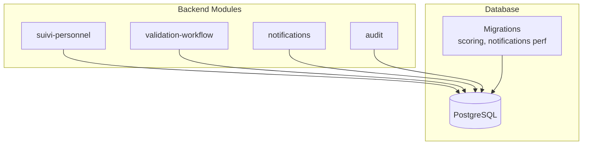
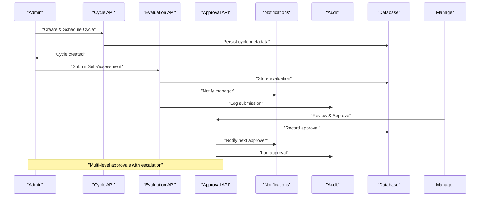
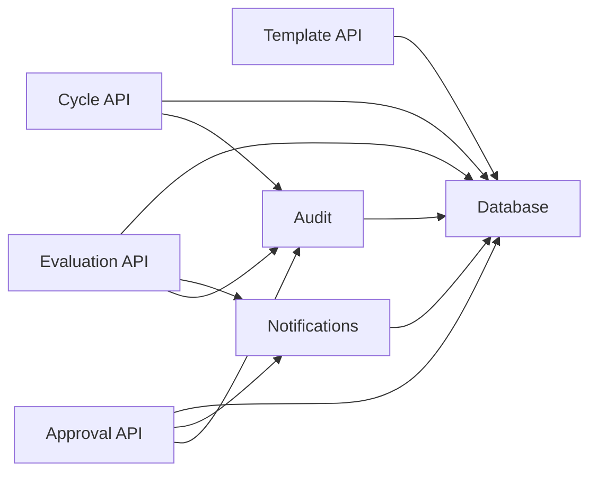

# Review Workflow API

<cite>
**Referenced Files in This Document**
- [backend/src/modules/suivi-personnel/](file://backend/src/modules/suivi-personnel)
- [backend/src/modules/validation-workflow/](file://backend/src/modules/validation-workflow)
- [backend/src/modules/notifications/](file://backend/src/modules/notifications)
- [backend/src/modules/audit/](file://backend/src/modules/audit)
- [backend/database/migrations/039-scoring-personnel.ts](file://backend/database/migrations/039-scoring-personnel.ts)
- [backend/database/migrations/048-notifications-performance-optimizations.sql](file://backend/database/migrations/048-notifications-performance-optimizations.sql)
- [backend/docs/audit-trail.md](file://backend/docs/audit-trail.md)
</cite>

## Table of Contents
1. [Introduction](#introduction)
2. [Project Structure](#project-structure)
3. [Core Components](#core-components)
4. [Architecture Overview](#architecture-overview)
5. [Detailed Component Analysis](#detailed-component-analysis)
6. [Dependency Analysis](#dependency-analysis)
7. [Performance Considerations](#performance-considerations)
8. [Troubleshooting Guide](#troubleshooting-guide)
9. [Conclusion](#conclusion)
10. [Appendices](#appendices)

## Introduction
This document provides comprehensive API documentation for eLISAschool’s performance review workflow. It covers:
- Review cycle APIs for scheduling, template management, and status tracking
- Evaluation submission APIs for manager reviews, self-assessments, peer feedback, and 360-degree evaluations
- Approval workflow APIs for validation, escalation, and final approvals
- Examples demonstrating multi-level approvals, automated notifications, state transitions, and audit trail integration

The goal is to enable developers and integrators to implement robust performance review processes with clear state management and full auditability.

## Project Structure
The performance review workflow spans several backend modules:
- suivi-personnel: Performance review lifecycle (cycles, templates, evaluations, statuses)
- validation-workflow: Multi-level approval orchestration and escalation
- notifications: Automated notifications triggered by workflow events
- audit: Audit trail persistence for compliance and traceability
- database migrations: Schema definitions and optimizations for performance-related features

**Diagram sources**
- [backend/src/modules/suivi-personnel/](file://backend/src/modules/suivi-personnel)
- [backend/src/modules/validation-workflow/](file://backend/src/modules/validation-workflow)
- [backend/src/modules/notifications/](file://backend/src/modules/notifications)
- [backend/src/modules/audit/](file://backend/src/modules/audit)
- [backend/database/migrations/039-scoring-personnel.ts](file://backend/database/migrations/039-scoring-personnel.ts)
- [backend/database/migrations/048-notifications-performance-optimizations.sql](file://backend/database/migrations/048-notifications-performance-optimizations.sql)

**Section sources**
- [backend/src/modules/suivi-personnel/](file://backend/src/modules/suivi-personnel)
- [backend/src/modules/validation-workflow/](file://backend/src/modules/validation-workflow)
- [backend/src/modules/notifications/](file://backend/src/modules/notifications)
- [backend/src/modules/audit/](file://backend/src/modules/audit)
- [backend/database/migrations/039-scoring-personnel.ts](file://backend/database/migrations/039-scoring-personnel.ts)
- [backend/database/migrations/048-notifications-performance-optimizations.sql](file://backend/database/migrations/048-notifications-performance-optimizations.sql)

## Core Components
- Review Cycle Management
  - Create, update, schedule, and close cycles
  - Assign participants and reviewers
  - Track cycle status and deadlines
- Template Management
  - Define evaluation criteria, weights, and scoring models
  - Support multiple evaluation types (self, manager, peer, 360)
- Evaluation Submission
  - Submit evaluations per participant and reviewer
  - Validate completeness and consistency
  - Compute scores based on templates
- Approval Workflow
  - Multi-level approvals with configurable chains
  - Escalation rules when approvers are unavailable or delayed
  - Final approval gating before publishing results
- Notifications
  - Automated triggers for due dates, escalations, approvals
  - Configurable channels and templates
- Audit Trail
  - Immutable records of all actions and state changes
  - Queryable history for compliance and reporting

**Section sources**
- [backend/src/modules/suivi-personnel/](file://backend/src/modules/suivi-personnel)
- [backend/src/modules/validation-workflow/](file://backend/src/modules/validation-workflow)
- [backend/src/modules/notifications/](file://backend/src/modules/notifications)
- [backend/src/modules/audit/](file://backend/src/modules/audit)

## Architecture Overview
The performance review workflow integrates four core subsystems:
- suivi-personnel orchestrates the lifecycle of cycles, templates, and evaluations
- validation-workflow manages approval chains and escalations
- notifications emits event-driven messages to stakeholders
- audit persists immutable logs for every significant action

**Diagram sources**
- [backend/src/modules/suivi-personnel/](file://backend/src/modules/suivi-personnel)
- [backend/src/modules/validation-workflow/](file://backend/src/modules/validation-workflow)
- [backend/src/modules/notifications/](file://backend/src/modules/notifications)
- [backend/src/modules/audit/](file://backend/src/modules/audit)

## Detailed Component Analysis

### Review Cycle APIs
Purpose: Manage the creation, scheduling, assignment, and closure of performance review cycles.

Key endpoints:
- POST /api/cycles: Create a new review cycle
- GET /api/cycles/{id}: Retrieve cycle details
- PUT /api/cycles/{id}: Update cycle settings
- PATCH /api/cycles/{id}/status: Transition cycle status (e.g., scheduled, active, closed)
- POST /api/cycles/{id}/assignees: Assign participants and reviewers
- GET /api/cycles/{id}/status: Get current status and timeline

State transitions:
- Draft → Scheduled → Active → Closed
- Each transition is validated and audited

Example flow:
- Admin creates a cycle with start/end dates and assigns managers and employees
- System notifies assignees and opens evaluation windows
- On closure, results become available for approvals

**Section sources**
- [backend/src/modules/suivi-personnel/](file://backend/src/modules/suivi-personnel)

### Template Management APIs
Purpose: Define reusable evaluation templates with criteria, weights, and scoring models.

Key endpoints:
- POST /api/templates: Create a template
- GET /api/templates/{id}: Retrieve template details
- PUT /api/templates/{id}: Update template
- DELETE /api/templates/{id}: Remove template (soft delete recommended)
- GET /api/templates: List templates with filters

Template attributes:
- Criteria list with descriptions and max scores
- Weighting rules and aggregation logic
- Supported evaluation types (self, manager, peer, 360)

Integration:
- Cycles reference a template ID to enforce consistent evaluation structures

**Section sources**
- [backend/src/modules/suivi-personnel/](file://backend/src/modules/suivi-personnel)

### Evaluation Submission APIs
Purpose: Allow participants and reviewers to submit evaluations against assigned cycles and templates.

Key endpoints:
- POST /api/evaluations/self: Submit self-assessment
- POST /api/evaluations/manager: Submit manager review
- POST /api/evaluations/peer: Submit peer feedback
- POST /api/evaluations/360: Submit 360-degree evaluation
- GET /api/evaluations/{id}: Retrieve evaluation details
- PUT /api/evaluations/{id}: Update evaluation (within allowed window)

Validation rules:
- Completeness checks against template criteria
- Score normalization and weight application
- Duplicate prevention per reviewer-participant pair

Scoring computation:
- Aggregates individual scores using template weights
- Produces composite score and breakdown per criterion

Notifications:
- Triggers upon submission to relevant stakeholders
- Reminders for overdue submissions

Audit:
- Logs submission author, timestamp, and changes

**Section sources**
- [backend/src/modules/suivi-personnel/](file://backend/src/modules/suivi-personnel)
- [backend/database/migrations/039-scoring-personnel.ts](file://backend/database/migrations/039-scoring-personnel.ts)

### Approval Workflow APIs
Purpose: Orchestrate multi-level approvals, handle escalations, and finalize review outcomes.

Key endpoints:
- POST /api/approvals/initiate: Start approval chain for a review
- GET /api/approvals/{id}: Get approval chain status
- POST /api/approvals/{id}/approve: Approve at current level
- POST /api/approvals/{id}/reject: Reject with comments
- POST /api/approvals/{id}/escalate: Escalate to higher authority
- GET /api/approvals/{id}/history: View approval history

Workflow states:
- Pending → Approved → Rejected → Escalated → Finalized
- Escalation rules trigger when approvers are inactive or exceed time limits

Finalization:
- After final approval, results are published and locked
- Notifications sent to all stakeholders

Audit:
- Every approval action is recorded with actor, decision, and rationale

**Section sources**
- [backend/src/modules/validation-workflow/](file://backend/src/modules/validation-workflow)

### Automated Notifications
Purpose: Send timely notifications for cycle events, evaluation deadlines, approvals, and escalations.

Key capabilities:
- Event-driven triggers from workflow state changes
- Configurable notification templates and channels
- Delivery status tracking and retry policies

Common triggers:
- Cycle scheduled/active/closed
- Evaluation due reminders
- Approval requests and decisions
- Escalation alerts

Optimization:
- Batched delivery and prioritization queues
- Performance indexes for high-volume scenarios

**Section sources**
- [backend/src/modules/notifications/](file://backend/src/modules/notifications)
- [backend/database/migrations/048-notifications-performance-optimizations.sql](file://backend/database/migrations/048-notifications-performance-optimizations.sql)

### Audit Trail Implementation
Purpose: Maintain an immutable record of all significant actions for compliance and auditing.

Features:
- Append-only log entries with actor, entity, action, timestamp, and context
- Queryable by entity type, user, date range, and action
- Integration points across cycles, evaluations, approvals, and notifications

Compliance:
- Supports regulatory requirements for personnel evaluation audits
- Enables forensic analysis of workflow deviations

**Section sources**
- [backend/src/modules/audit/](file://backend/src/modules/audit)
- [backend/docs/audit-trail.md](file://backend/docs/audit-trail.md)

## Dependency Analysis
The following diagram illustrates module dependencies and data flows:

**Diagram sources**
- [backend/src/modules/suivi-personnel/](file://backend/src/modules/suivi-personnel)
- [backend/src/modules/validation-workflow/](file://backend/src/modules/validation-workflow)
- [backend/src/modules/notifications/](file://backend/src/modules/notifications)
- [backend/src/modules/audit/](file://backend/src/modules/audit)

**Section sources**
- [backend/src/modules/suivi-personnel/](file://backend/src/modules/suivi-personnel)
- [backend/src/modules/validation-workflow/](file://backend/src/modules/validation-workflow)
- [backend/src/modules/notifications/](file://backend/src/modules/notifications)
- [backend/src/modules/audit/](file://backend/src/modules/audit)

## Performance Considerations
- Indexing strategies for frequent queries on cycles, evaluations, and approvals
- Batch processing for notifications to reduce database load
- Caching of template configurations to minimize repeated computations
- Pagination and filtering for large datasets in dashboards and reports
- Monitoring and alerting for long-running approval chains

[No sources needed since this section provides general guidance]

## Troubleshooting Guide
Common issues and resolutions:
- Missing permissions: Ensure RBAC roles include required permissions for each endpoint
- Validation errors: Verify template criteria match submitted evaluation fields
- Notification failures: Check delivery provider configuration and retry logs
- Audit gaps: Confirm audit middleware is enabled and write permissions exist
- Performance bottlenecks: Review database indexes and query plans for slow endpoints

**Section sources**
- [backend/docs/audit-trail.md](file://backend/docs/audit-trail.md)

## Conclusion
The eLISAschool performance review workflow provides a robust, auditable, and scalable system for managing employee evaluations. By integrating cycle management, template-driven evaluations, multi-level approvals, automated notifications, and comprehensive audit trails, it supports complex organizational needs while maintaining clarity and compliance.

[No sources needed since this section summarizes without analyzing specific files]

## Appendices

### Example Endpoints Summary
- Cycle Management
  - POST /api/cycles
  - GET /api/cycles/{id}
  - PUT /api/cycles/{id}
  - PATCH /api/cycles/{id}/status
  - POST /api/cycles/{id}/assignees
  - GET /api/cycles/{id}/status
- Template Management
  - POST /api/templates
  - GET /api/templates/{id}
  - PUT /api/templates/{id}
  - DELETE /api/templates/{id}
  - GET /api/templates
- Evaluation Submission
  - POST /api/evaluations/self
  - POST /api/evaluations/manager
  - POST /api/evaluations/peer
  - POST /api/evaluations/360
  - GET /api/evaluations/{id}
  - PUT /api/evaluations/{id}
- Approval Workflow
  - POST /api/approvals/initiate
  - GET /api/approvals/{id}
  - POST /api/approvals/{id}/approve
  - POST /api/approvals/{id}/reject
  - POST /api/approvals/{id}/escalate
  - GET /api/approvals/{id}/history

[No sources needed since this section lists endpoints conceptually]