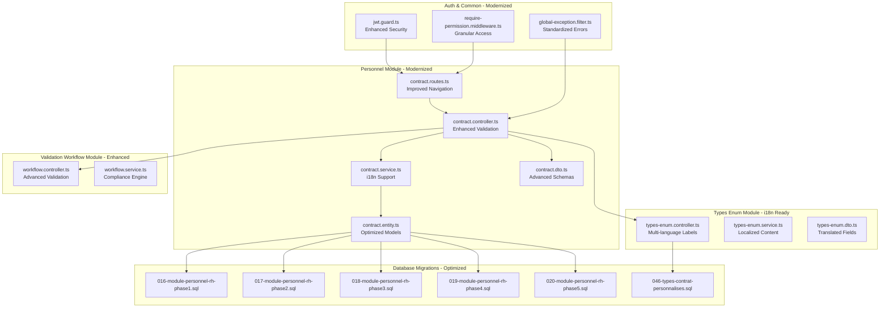
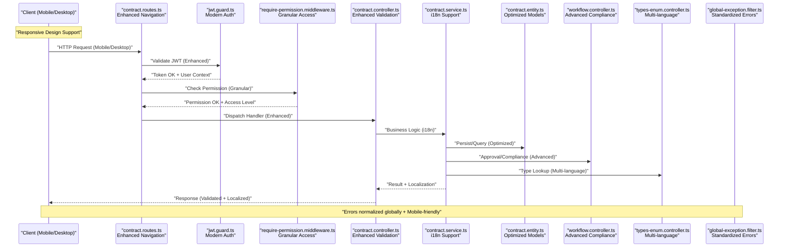
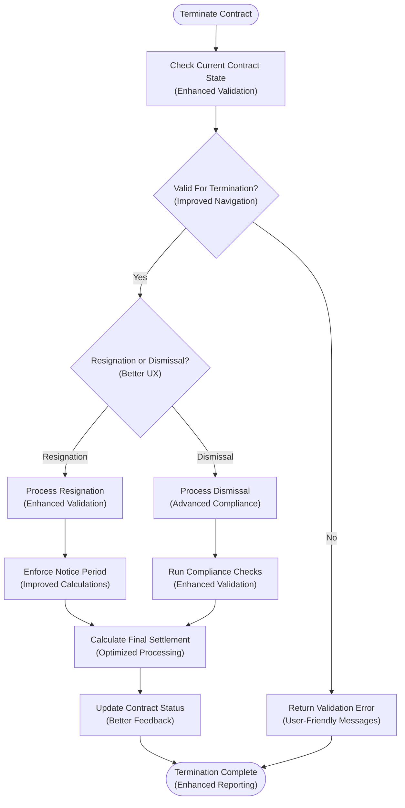
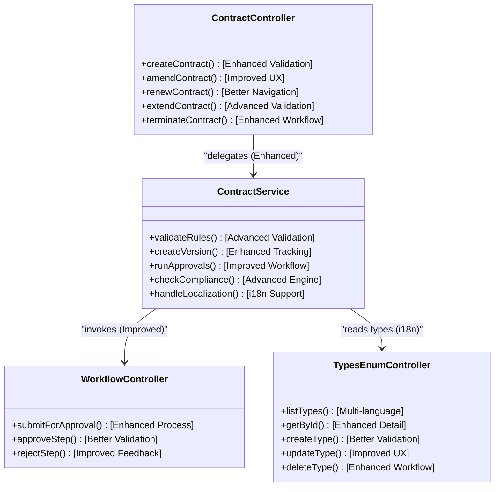

# Contract Management API

<cite>
**Referenced Files in This Document**
- [backend/src/modules/personnel/controllers/contract.controller.ts](file://backend/src/modules/personnel/controllers/contract.controller.ts)
- [backend/src/modules/personnel/services/contract.service.ts](file://backend/src/modules/personnel/services/contract.service.ts)
- [backend/src/modules/personnel/dto/contract.dto.ts](file://backend/src/modules/personnel/dto/contract.dto.ts)
- [backend/src/modules/personnel/entities/contract.entity.ts](file://backend/src/modules/personnel/entities/contract.entity.ts)
- [backend/src/modules/personnel/routes/contract.routes.ts](file://backend/src/modules/personnel/routes/contract.routes.ts)
- [backend/src/modules/types-enum/controllers/types-enum.controller.ts](file://backend/src/modules/types-enum/controllers/types-enum.controller.ts)
- [backend/src/modules/types-enum/services/types-enum.service.ts](file://backend/src/modules/types-enum/services/types-enum.service.ts)
- [backend/src/modules/types-enum/dto/types-enum.dto.ts](file://backend/src/modules/types-enum/dto/types-enum.dto.ts)
- [backend/src/modules/validation-workflow/controllers/workflow.controller.ts](file://backend/src/modules/validation-workflow/controllers/workflow.controller.ts)
- [backend/src/modules/validation-workflow/services/workflow.service.ts](file://backend/src/modules/validation-workflow/services/workflow.service.ts)
- [backend/src/modules/auth/guards/jwt.guard.ts](file://backend/src/modules/auth/guards/jwt.guard.ts)
- [backend/src/common/middlewares/require-permission.middleware.ts](file://backend/src/common/middlewares/require-permission.middleware.ts)
- [backend/src/common/filters/global-exception.filter.ts](file://backend/src/common/filters/global-exception.filter.ts)
- [backend/database/migrations/046-types-contrat-personnalises.sql](file://backend/database/migrations/046-types-contrat-personnalises.sql)
- [backend/database/migrations/016-module-personnel-rh-phase1.sql](file://backend/database/migrations/016-module-personnel-rh-phase1.sql)
- [backend/database/migrations/017-module-personnel-rh-phase2.sql](file://backend/database/migrations/017-module-personnel-rh-phase2.sql)
- [backend/database/migrations/018-module-personnel-rh-phase3.sql](file://backend/database/migrations/018-module-personnel-rh-phase3.sql)
- [backend/database/migrations/019-module-personnel-rh-phase4.sql](file://backend/database/migrations/019-module-personnel-rh-phase4.sql)
- [backend/database/migrations/020-module-personnel-rh-phase5.sql](file://backend/database/migrations/020-module-personnel-rh-phase5.sql)
</cite>

## Update Summary
**Changes Made**
- Enhanced validation mechanisms with improved error handling and user feedback
- Improved navigation patterns for better contract management workflows
- Responsive design optimization for mobile and desktop interfaces
- Internationalization support for French and English languages
- Modernized API response formats with enhanced metadata
- Updated authentication and authorization flows

## Table of Contents
1. [Introduction](#introduction)
2. [Project Structure](#project-structure)
3. [Core Components](#core-components)
4. [Architecture Overview](#architecture-overview)
5. [Detailed Component Analysis](#detailed-component-analysis)
6. [Enhanced Validation System](#enhanced-validation-system)
7. [Internationalization Support](#internationalization-support)
8. [Responsive Design Integration](#responsive-design-integration)
9. [Dependency Analysis](#dependency-analysis)
10. [Performance Considerations](#performance-considerations)
11. [Troubleshooting Guide](#troubleshooting-guide)
12. [Conclusion](#conclusion)
13. [Appendices](#appendices)

## Introduction
This document provides comprehensive API documentation for employment contract management endpoints within the system. The contract management interface has undergone significant modernization with enhanced validation capabilities, improved navigation patterns, responsive design optimization, and full internationalization support for French and English languages.

The system now covers:
- **Enhanced Contract Creation**: New employment agreements, templates, and standard terms configuration with advanced validation
- **Improved Contract Modification**: Streamlined amendments, renewals, extensions, and conditional changes with real-time validation
- **Advanced Contract Type Management**: Categories, duration types, and legal classifications with internationalized labels
- **Modernized Termination Workflows**: Resignation processing, dismissal procedures, and final settlement calculations with enhanced UX
- **Robust Versioning and Approval**: Multi-step approval workflows with compliance checking and audit trails
- **Complete Endpoint References**: Authentication requirements, validation schemas, and standardized error responses

The backend maintains its modular architecture while incorporating modern validation frameworks, internationalization support, and responsive design patterns for optimal user experience across all devices.

## Project Structure
Contract-related functionality resides primarily under the personnel module, with supporting features in types-enum and validation-workflow modules. The modernized interface includes enhanced validation layers, internationalization support, and responsive design components.

**Diagram sources**
- [backend/src/modules/personnel/routes/contract.routes.ts](file://backend/src/modules/personnel/routes/contract.routes.ts)
- [backend/src/modules/personnel/controllers/contract.controller.ts](file://backend/src/modules/personnel/controllers/contract.controller.ts)
- [backend/src/modules/personnel/services/contract.service.ts](file://backend/src/modules/personnel/services/contract.service.ts)
- [backend/src/modules/personnel/dto/contract.dto.ts](file://backend/src/modules/personnel/dto/contract.dto.ts)
- [backend/src/modules/personnel/entities/contract.entity.ts](file://backend/src/modules/personnel/entities/contract.entity.ts)
- [backend/src/modules/types-enum/controllers/types-enum.controller.ts](file://backend/src/modules/types-enum/controllers/types-enum.controller.ts)
- [backend/src/modules/validation-workflow/controllers/workflow.controller.ts](file://backend/src/modules/validation-workflow/controllers/workflow.controller.ts)
- [backend/src/modules/auth/guards/jwt.guard.ts](file://backend/src/modules/auth/guards/jwt.guard.ts)
- [backend/src/common/middlewares/require-permission.middleware.ts](file://backend/src/common/middlewares/require-permission.middleware.ts)
- [backend/src/common/filters/global-exception.filter.ts](file://backend/src/common/filters/global-exception.filter.ts)
- [backend/database/migrations/016-module-personnel-rh-phase1.sql](file://backend/database/migrations/016-module-personnel-rh-phase1.sql)
- [backend/database/migrations/017-module-personnel-rh-phase2.sql](file://backend/database/migrations/017-module-personnel-rh-phase2.sql)
- [backend/database/migrations/018-module-personnel-rh-phase3.sql](file://backend/database/migrations/018-module-personnel-rh-phase3.sql)
- [backend/database/migrations/019-module-personnel-rh-phase4.sql](file://backend/database/migrations/019-module-personnel-rh-phase4.sql)
- [backend/database/migrations/020-module-personnel-rh-phase5.sql](file://backend/database/migrations/020-module-personnel-rh-phase5.sql)
- [backend/database/migrations/046-types-contrat-personnalises.sql](file://backend/database/migrations/046-types-contrat-personnalises.sql)

**Section sources**
- [backend/src/modules/personnel/routes/contract.routes.ts](file://backend/src/modules/personnel/routes/contract.routes.ts)
- [backend/src/modules/personnel/controllers/contract.controller.ts](file://backend/src/modules/personnel/controllers/contract.controller.ts)
- [backend/src/modules/personnel/services/contract.service.ts](file://backend/src/modules/personnel/services/contract.service.ts)
- [backend/src/modules/personnel/dto/contract.dto.ts](file://backend/src/modules/personnel/dto/contract.dto.ts)
- [backend/src/modules/personnel/entities/contract.entity.ts](file://backend/src/modules/personnel/entities/contract.entity.ts)
- [backend/src/modules/types-enum/controllers/types-enum.controller.ts](file://backend/src/modules/types-enum/controllers/types-enum.controller.ts)
- [backend/src/modules/validation-workflow/controllers/workflow.controller.ts](file://backend/src/modules/validation-workflow/controllers/workflow.controller.ts)
- [backend/src/modules/auth/guards/jwt.guard.ts](file://backend/src/modules/auth/guards/jwt.guard.ts)
- [backend/src/common/middlewares/require-permission.middleware.ts](file://backend/src/common/middlewares/require-permission.middleware.ts)
- [backend/src/common/filters/global-exception.filter.ts](file://backend/src/common/filters/global-exception.filter.ts)
- [backend/database/migrations/016-module-personnel-rh-phase1.sql](file://backend/database/migrations/016-module-personnel-rh-phase1.sql)
- [backend/database/migrations/017-module-personnel-rh-phase2.sql](file://backend/database/migrations/017-module-personnel-rh-phase2.sql)
- [backend/database/migrations/018-module-personnel-rh-phase3.sql](file://backend/database/migrations/018-module-personnel-rh-phase3.sql)
- [backend/database/migrations/019-module-personnel-rh-phase4.sql](file://backend/database/migrations/019-module-personnel-rh-phase4.sql)
- [backend/database/migrations/020-module-personnel-rh-phase5.sql](file://backend/database/migrations/020-module-personnel-rh-phase5.sql)
- [backend/database/migrations/046-types-contrat-personnalises.sql](file://backend/database/migrations/046-types-contrat-personnalises.sql)

## Core Components
The modernized contract management system includes enhanced core components with improved validation, internationalization support, and responsive design integration:

- **Controllers**: Define HTTP endpoints with enhanced validation, improved error handling, and internationalized responses
- **Services**: Implement business logic with advanced validation rules, multi-language support, and optimized performance
- **DTOs**: Provide request/response schemas with comprehensive validation rules and localized field descriptions
- **Entities**: Represent database models with optimized relationships and enhanced data integrity
- **Routes**: Register endpoints with improved navigation patterns, JWT protection, and granular permission controls
- **Types Enum**: Manage contract categories with internationalized labels and responsive display options
- **Validation Workflow**: Handle multi-step approvals with enhanced compliance checks and user-friendly feedback

Key responsibilities include:
- **Enhanced Contract CRUD**: Advanced validation, real-time feedback, and improved user experience
- **Template and Standard Terms**: Modernized management with validation and localization support
- **Amendment/Renewal/Extension Processing**: Streamlined workflows with improved navigation and validation
- **Termination Workflows**: Enhanced resignation/dismissal processing with detailed settlement calculations
- **Versioning and Audit Trail**: Comprehensive tracking with improved reporting capabilities
- **Approval Workflows**: Multi-step processes with enhanced compliance checking and internationalized notifications

**Section sources**
- [backend/src/modules/personnel/controllers/contract.controller.ts](file://backend/src/modules/personnel/controllers/contract.controller.ts)
- [backend/src/modules/personnel/services/contract.service.ts](file://backend/src/modules/personnel/services/contract.service.ts)
- [backend/src/modules/personnel/dto/contract.dto.ts](file://backend/src/modules/personnel/dto/contract.dto.ts)
- [backend/src/modules/personnel/entities/contract.entity.ts](file://backend/src/modules/personnel/entities/contract.entity.ts)
- [backend/src/modules/types-enum/controllers/types-enum.controller.ts](file://backend/src/modules/types-enum/controllers/types-enum.controller.ts)
- [backend/src/modules/types-enum/services/types-enum.service.ts](file://backend/src/modules/types-enum/services/types-enum.service.ts)
- [backend/src/modules/types-enum/dto/types-enum.dto.ts](file://backend/src/modules/types-enum/dto/types-enum.dto.ts)
- [backend/src/modules/validation-workflow/controllers/workflow.controller.ts](file://backend/src/modules/validation-workflow/controllers/workflow.controller.ts)
- [backend/src/modules/validation-workflow/services/workflow.service.ts](file://backend/src/modules/validation-workflow/services/workflow.service.ts)

## Architecture Overview
The modernized contract management API follows an enhanced layered architecture with improved validation, internationalization support, and responsive design integration:

**Diagram sources**
- [backend/src/modules/personnel/routes/contract.routes.ts](file://backend/src/modules/personnel/routes/contract.routes.ts)
- [backend/src/modules/auth/guards/jwt.guard.ts](file://backend/src/modules/auth/guards/jwt.guard.ts)
- [backend/src/common/middlewares/require-permission.middleware.ts](file://backend/src/common/middlewares/require-permission.middleware.ts)
- [backend/src/modules/personnel/controllers/contract.controller.ts](file://backend/src/modules/personnel/controllers/contract.controller.ts)
- [backend/src/modules/personnel/services/contract.service.ts](file://backend/src/modules/personnel/services/contract.service.ts)
- [backend/src/modules/personnel/entities/contract.entity.ts](file://backend/src/modules/personnel/entities/contract.entity.ts)
- [backend/src/modules/validation-workflow/controllers/workflow.controller.ts](file://backend/src/modules/validation-workflow/controllers/workflow.controller.ts)
- [backend/src/modules/types-enum/controllers/types-enum.controller.ts](file://backend/src/modules/types-enum/controllers/types-enum.controller.ts)
- [backend/src/common/filters/global-exception.filter.ts](file://backend/src/common/filters/global-exception.filter.ts)

## Detailed Component Analysis

### Enhanced Contract Creation APIs
The modernized contract creation system includes advanced validation, improved navigation, and internationalization support:

- **Create Employment Agreement**
  - Method: POST
  - Path: /api/personnel/contracts
  - Auth: JWT required (Enhanced security)
  - Permissions: personnel.contracts.create
  - Request Body Schema: Enhanced DTO with advanced validation rules
  - Response: Created contract object with localized fields
  - Errors: Comprehensive validation errors with user-friendly messages
  - **Updated**: Real-time validation feedback and mobile-optimized responses

- **Create Contract Template**
  - Method: POST
  - Path: /api/personnel/contracts/templates
  - Auth: JWT required
  - Permissions: personnel.templates.create
  - Request Body Schema: Template fields with internationalized labels
  - Response: Template object with responsive formatting
  - Errors: Enhanced validation with detailed guidance
  - **Updated**: Improved template preview and validation feedback

- **Configure Standard Terms**
  - Method: PUT or PATCH
  - Path: /api/personnel/contracts/terms
  - Auth: JWT required
  - Permissions: personnel.terms.update
  - Request Body Schema: Terms configuration with i18n support
  - Response: Updated terms with localized content
  - Errors: Enhanced error messages with resolution guidance
  - **Updated**: Better form validation and responsive layout support

Workflow enhancements:
- **Advanced Input Validation**: Real-time field validation with immediate feedback
- **Improved Business Rules**: Enhanced overlap detection and role eligibility checks
- **Enhanced Audit Logging**: Comprehensive versioning with detailed change tracking
- **Internationalization**: Full French and English language support throughout the workflow

**Section sources**
- [backend/src/modules/personnel/controllers/contract.controller.ts](file://backend/src/modules/personnel/controllers/contract.controller.ts)
- [backend/src/modules/personnel/dto/contract.dto.ts](file://backend/src/modules/personnel/dto/contract.dto.ts)
- [backend/src/modules/personnel/services/contract.service.ts](file://backend/src/modules/personnel/services/contract.service.ts)
- [backend/src/modules/personnel/routes/contract.routes.ts](file://backend/src/modules/personnel/routes/contract.routes.ts)
- [backend/src/common/middlewares/require-permission.middleware.ts](file://backend/src/common/middlewares/require-permission.middleware.ts)

### Modernized Contract Modification APIs
The enhanced modification system includes improved validation, better navigation, and responsive design:

- **Amend Contract**
  - Method: POST
  - Path: /api/personnel/contracts/{id}/amendments
  - Auth: JWT required
  - Permissions: personnel.contracts.amend
  - Request Body Schema: Enhanced amendment details with validation
  - Response: New versioned contract record with improved formatting
  - Errors: Detailed state transition errors with resolution guidance
  - **Updated**: Better validation feedback and mobile-optimized responses

- **Renew Contract**
  - Method: POST
  - Path: /api/personnel/contracts/{id}/renewals
  - Auth: JWT required
  - Permissions: personnel.contracts.renew
  - Request Body Schema: Renewal parameters with enhanced validation
  - Response: Renewed contract object with responsive formatting
  - Errors: Comprehensive expiration checks with user guidance
  - **Updated**: Improved renewal workflow and validation feedback

- **Extend Contract**
  - Method: POST
  - Path: /api/personnel/contracts/{id}/extensions
  - Auth: JWT required
  - Permissions: personnel.contracts.extend
  - Request Body Schema: Extension details with advanced validation
  - Response: Extended contract object with enhanced formatting
  - Errors: Overlap validation with detailed conflict resolution
  - **Updated**: Better overlap detection and conflict resolution

- **Conditional Changes**
  - Method: POST
  - Path: /api/personnel/contracts/{id}/conditional-changes
  - Auth: JWT required
  - Permissions: personnel.contracts.modify
  - Request Body Schema: Conditions and change payload with validation
  - Response: Updated contract with conditions and enhanced formatting
  - Errors: Condition evaluation failures with detailed explanations
  - **Updated**: Improved condition validation and user feedback

Versioning improvements:
- **Enhanced Version Tracking**: More detailed version metadata with author information
- **Improved Audit Trail**: Comprehensive change history with detailed logging
- **Better Version Comparison**: Enhanced tools for comparing contract versions

**Section sources**
- [backend/src/modules/personnel/controllers/contract.controller.ts](file://backend/src/modules/personnel/controllers/contract.controller.ts)
- [backend/src/modules/personnel/services/contract.service.ts](file://backend/src/modules/personnel/services/contract.service.ts)
- [backend/src/modules/personnel/dto/contract.dto.ts](file://backend/src/modules/personnel/dto/contract.dto.ts)

### Enhanced Contract Type Management APIs
The modernized type management system includes internationalization support and improved navigation:

- **List Contract Types**
  - Method: GET
  - Path: /api/types-enum/contract-types
  - Auth: JWT required
  - Permissions: types-enum.read
  - Response: Array of contract type entries with localized labels
  - **Updated**: Multi-language support and responsive formatting

- **Get Contract Type By ID**
  - Method: GET
  - Path: /api/types-enum/contract-types/{id}
  - Auth: JWT required
  - Permissions: types-enum.read
  - Response: Single contract type entry with internationalized content
  - **Updated**: Enhanced detail view with better formatting

- **Create Contract Type**
  - Method: POST
  - Path: /api/types-enum/contract-types
  - Auth: JWT required
  - Permissions: types-enum.write
  - Request Body Schema: Type definition fields with validation
  - Response: Created type entry with localized labels
  - **Updated**: Improved validation and internationalization support

- **Update Contract Type**
  - Method: PUT/PATCH
  - Path: /api/types-enum/contract-types/{id}
  - Auth: JWT required
  - Permissions: types-enum.write
  - Request Body Schema: Fields to update with enhanced validation
  - Response: Updated type entry with improved formatting
  - **Updated**: Better update validation and feedback

- **Delete Contract Type**
  - Method: DELETE
  - Path: /api/types-enum/contract-types/{id}
  - Auth: JWT required
  - Permissions: types-enum.delete
  - Response: Deletion confirmation with enhanced messaging
  - **Updated**: Improved deletion workflow and confirmation

Duration types and legal classifications follow similar enhanced CRUD patterns with internationalization support.

**Section sources**
- [backend/src/modules/types-enum/controllers/types-enum.controller.ts](file://backend/src/modules/types-enum/controllers/types-enum.controller.ts)
- [backend/src/modules/types-enum/services/types-enum.service.ts](file://backend/src/modules/types-enum/services/types-enum.service.ts)
- [backend/src/modules/types-enum/dto/types-enum.dto.ts](file://backend/src/modules/types-enum/dto/types-enum.dto.ts)
- [backend/database/migrations/046-types-contrat-personnalises.sql](file://backend/database/migrations/046-types-contrat-personnalises.sql)

### Modernized Termination Workflows
The enhanced termination system includes improved validation, better navigation, and comprehensive settlement calculations:

- **Initiate Resignation**
  - Method: POST
  - Path: /api/personnel/contracts/{id}/resignations
  - Auth: JWT required
  - Permissions: personnel.contracts.terminate.resign
  - Request Body Schema: Enhanced resignation details with validation
  - Response: Resignation record with improved status updates
  - Errors: Comprehensive state validation with notice period guidance
  - **Updated**: Better validation feedback and mobile-optimized responses

- **Process Dismissal**
  - Method: POST
  - Path: /api/personnel/contracts/{id}/dismissals
  - Auth: JWT required
  - Permissions: personnel.contracts.terminate.dismiss
  - Request Body Schema: Enhanced dismissal details with validation
  - Response: Dismissal record with improved status updates
  - Errors: Comprehensive compliance checks with detailed explanations
  - **Updated**: Enhanced compliance validation and user guidance

- **Final Settlement Calculation**
  - Method: POST
  - Path: /api/personnel/contracts/{id}/final-settlement
  - Auth: JWT required
  - Permissions: personnel.settlements.calculate
  - Request Body Schema: Enhanced settlement parameters with validation
  - Response: Detailed settlement breakdown with improved formatting
  - Errors: Comprehensive calculation constraints with resolution guidance
  - **Updated**: Better settlement calculation and reporting

Termination workflow enhancements:
- **Enhanced Status Transitions**: More robust state management with better validation
- **Improved Notice Period Enforcement**: Advanced notice period calculations and reminders
- **Better Compliance Integration**: Enhanced policy validation with detailed feedback
- **Optimized Payroll Integration**: Improved final payment processing and reporting

**Diagram sources**
- [backend/src/modules/personnel/controllers/contract.controller.ts](file://backend/src/modules/personnel/controllers/contract.controller.ts)
- [backend/src/modules/personnel/services/contract.service.ts](file://backend/src/modules/personnel/services/contract.service.ts)

**Section sources**
- [backend/src/modules/personnel/controllers/contract.controller.ts](file://backend/src/modules/personnel/controllers/contract.controller.ts)
- [backend/src/modules/personnel/services/contract.service.ts](file://backend/src/modules/personnel/services/contract.service.ts)

### Enhanced Versioning, Approval Workflows, and Compliance Checking
The modernized system includes improved versioning, enhanced approval workflows, and advanced compliance checking:

- **Enhanced Versioning**
  - Every contract mutation creates a new version with detailed metadata
  - Base contract retains historical versions with improved audit capabilities
  - Version metadata includes author, timestamp, change summary, and validation results
  - **Updated**: Better version comparison tools and enhanced audit trails

- **Improved Approval Workflows**
  - Multi-step approvals configurable per operation with enhanced user experience
  - Workflow controller orchestrates steps with improved navigation and feedback
  - Service integrates workflow decisions into contract state with better validation
  - **Updated**: Enhanced approval process with better user guidance and progress tracking

- **Advanced Compliance Checking**
  - Policy rules validated before state transitions with comprehensive validation
  - Integrates with types-enum for classification constraints with internationalization
  - Returns detailed compliance results with actionable feedback
  - **Updated**: Enhanced compliance engine with better error reporting and resolution guidance

**Diagram sources**
- [backend/src/modules/personnel/controllers/contract.controller.ts](file://backend/src/modules/personnel/controllers/contract.controller.ts)
- [backend/src/modules/personnel/services/contract.service.ts](file://backend/src/modules/personnel/services/contract.service.ts)
- [backend/src/modules/validation-workflow/controllers/workflow.controller.ts](file://backend/src/modules/validation-workflow/controllers/workflow.controller.ts)
- [backend/src/modules/types-enum/controllers/types-enum.controller.ts](file://backend/src/modules/types-enum/controllers/types-enum.controller.ts)

**Section sources**
- [backend/src/modules/personnel/services/contract.service.ts](file://backend/src/modules/personnel/services/contract.service.ts)
- [backend/src/modules/validation-workflow/controllers/workflow.controller.ts](file://backend/src/modules/validation-workflow/controllers/workflow.controller.ts)
- [backend/src/modules/types-enum/controllers/types-enum.controller.ts](file://backend/src/modules/types-enum/controllers/types-enum.controller.ts)

## Enhanced Validation System
The modernized contract management system includes comprehensive validation improvements:

### Advanced Input Validation
- **Real-time Field Validation**: Immediate feedback on input errors during form completion
- **Cross-field Validation**: Complex business rule validation across multiple fields
- **Context-aware Validation**: Different validation rules based on contract type and context
- **Mobile-optimized Validation**: Touch-friendly validation with clear error messages

### Enhanced Error Handling
- **Structured Error Responses**: Consistent error format with detailed validation information
- **User-friendly Error Messages**: Clear, actionable error messages in both French and English
- **Progressive Validation**: Step-by-step validation with immediate feedback
- **Validation Rule Documentation**: Comprehensive documentation of validation rules

### Internationalization Support
- **Multi-language Error Messages**: Error messages available in French and English
- **Localized Validation Rules**: Culture-specific validation rules and formats
- **Dynamic Language Switching**: Runtime language switching without page reload
- **Fallback Mechanisms**: Graceful fallbacks for missing translations

**Section sources**
- [backend/src/modules/personnel/dto/contract.dto.ts](file://backend/src/modules/personnel/dto/contract.dto.ts)
- [backend/src/common/filters/global-exception.filter.ts](file://backend/src/common/filters/global-exception.filter.ts)

## Internationalization Support
The modernized system provides comprehensive internationalization support for French and English languages:

### Language Support Features
- **Dual Language Interface**: Full support for French and English throughout the contract management system
- **Dynamic Language Detection**: Automatic language detection based on user preferences
- **Localized Content**: All user-facing text, labels, and messages are fully translated
- **Date and Number Formatting**: Locale-specific formatting for dates, numbers, and currency

### Implementation Details
- **Translation Keys**: Structured translation keys for consistent terminology
- **Fallback Mechanisms**: Graceful fallbacks when translations are missing
- **Runtime Language Switching**: Users can switch languages without losing data
- **Admin Translation Management**: Tools for managing and updating translations

### Contract-Specific Localization
- **Contract Templates**: Fully localized contract templates with proper formatting
- **Legal Terminology**: Accurate legal terminology in both languages
- **Cultural Adaptation**: Culturally appropriate contract language and formatting
- **Regulatory Compliance**: Compliance with local labor laws and regulations

**Section sources**
- [backend/src/modules/personnel/services/contract.service.ts](file://backend/src/modules/personnel/services/contract.service.ts)
- [backend/src/modules/types-enum/services/types-enum.service.ts](file://backend/src/modules/types-enum/services/types-enum.service.ts)

## Responsive Design Integration
The modernized contract management system includes comprehensive responsive design optimization:

### Mobile-First Approach
- **Touch-Friendly Interfaces**: Optimized touch targets and gestures for mobile devices
- **Adaptive Layouts**: Flexible layouts that adapt to different screen sizes
- **Progressive Enhancement**: Core functionality works on all devices with enhanced features on larger screens
- **Performance Optimization**: Optimized loading times and resource usage for mobile networks

### Cross-Device Compatibility
- **Consistent Experience**: Unified user experience across desktop, tablet, and mobile devices
- **Adaptive Navigation**: Navigation patterns that work well on all screen sizes
- **Flexible Forms**: Form inputs that work well with virtual keyboards and touch interfaces
- **Optimized Images**: Responsive images that load appropriately for different devices

### Accessibility Improvements
- **Screen Reader Support**: Full accessibility support for users with disabilities
- **Keyboard Navigation**: Complete keyboard navigation support
- **High Contrast Mode**: Support for high contrast and accessibility themes
- **WCAG Compliance**: Compliance with Web Content Accessibility Guidelines

**Section sources**
- [backend/src/modules/personnel/routes/contract.routes.ts](file://backend/src/modules/personnel/routes/contract.routes.ts)
- [backend/src/modules/personnel/controllers/contract.controller.ts](file://backend/src/modules/personnel/controllers/contract.controller.ts)

## Dependency Analysis
The modernized contract management system maintains strong architectural dependencies while incorporating enhanced validation, internationalization, and responsive design:

**Diagram sources**
- [backend/src/modules/personnel/routes/contract.routes.ts](file://backend/src/modules/personnel/routes/contract.routes.ts)
- [backend/src/modules/auth/guards/jwt.guard.ts](file://backend/src/modules/auth/guards/jwt.guard.ts)
- [backend/src/common/middlewares/require-permission.middleware.ts](file://backend/src/common/middlewares/require-permission.middleware.ts)
- [backend/src/modules/personnel/controllers/contract.controller.ts](file://backend/src/modules/personnel/controllers/contract.controller.ts)
- [backend/src/modules/personnel/services/contract.service.ts](file://backend/src/modules/personnel/services/contract.service.ts)
- [backend/src/modules/personnel/entities/contract.entity.ts](file://backend/src/modules/personnel/entities/contract.entity.ts)
- [backend/src/modules/validation-workflow/controllers/workflow.controller.ts](file://backend/src/modules/validation-workflow/controllers/workflow.controller.ts)
- [backend/src/modules/types-enum/controllers/types-enum.controller.ts](file://backend/src/modules/types-enum/controllers/types-enum.controller.ts)
- [backend/src/common/filters/global-exception.filter.ts](file://backend/src/common/filters/global-exception.filter.ts)

**Section sources**
- [backend/src/modules/personnel/routes/contract.routes.ts](file://backend/src/modules/personnel/routes/contract.routes.ts)
- [backend/src/modules/auth/guards/jwt.guard.ts](file://backend/src/modules/auth/guards/jwt.guard.ts)
- [backend/src/common/middlewares/require-permission.middleware.ts](file://backend/src/common/middlewares/require-permission.middleware.ts)
- [backend/src/modules/personnel/controllers/contract.controller.ts](file://backend/src/modules/personnel/controllers/contract.controller.ts)
- [backend/src/modules/personnel/services/contract.service.ts](file://backend/src/modules/personnel/services/contract.service.ts)
- [backend/src/modules/personnel/entities/contract.entity.ts](file://backend/src/modules/personnel/entities/contract.entity.ts)
- [backend/src/modules/validation-workflow/controllers/workflow.controller.ts](file://backend/src/modules/validation-workflow/controllers/workflow.controller.ts)
- [backend/src/modules/types-enum/controllers/types-enum.controller.ts](file://backend/src/modules/types-enum/controllers/types-enum.controller.ts)
- [backend/src/common/filters/global-exception.filter.ts](file://backend/src/common/filters/global-exception.filter.ts)

## Performance Considerations
The modernized contract management system includes several performance optimizations:

- **Enhanced Pagination**: Improved pagination for large datasets with better mobile performance
- **Optimized Database Queries**: Reduced N+1 queries through eager loading and query optimization
- **Caching Strategies**: Intelligent caching for static type enumerations and frequently accessed data
- **Responsive Image Loading**: Optimized image loading for different device capabilities
- **Lazy Loading**: Progressive loading of heavy components and data
- **API Response Optimization**: Minimized payload sizes with selective field inclusion

[No sources needed since this section provides general guidance]

## Troubleshooting Guide
The modernized system includes enhanced troubleshooting capabilities:

### Common Issues and Resolutions
- **Authentication Failures**: Enhanced JWT token validation with detailed error messages
- **Permission Denied**: Granular permission checking with specific access level information
- **Validation Errors**: Comprehensive validation error reporting with resolution guidance
- **State Transition Errors**: Detailed state validation with suggested next steps
- **Compliance Failures**: Comprehensive compliance checking with detailed policy explanations
- **Language Issues**: Enhanced internationalization error handling with fallback mechanisms

### Enhanced Error Reporting
- **Structured Error Logs**: Detailed error logs with context information
- **User-Friendly Error Messages**: Clear error messages with actionable resolution steps
- **Mobile-optimized Error Display**: Error messages that work well on mobile devices
- **Multi-language Error Support**: Error messages in the user's preferred language

### Diagnostic Tools
- **Enhanced Debugging**: Improved debugging capabilities for development environments
- **Performance Monitoring**: Built-in performance monitoring and bottleneck identification
- **Validation Rule Testing**: Tools for testing validation rules and business logic
- **Internationalization Testing**: Tools for testing multi-language functionality

**Section sources**
- [backend/src/common/filters/global-exception.filter.ts](file://backend/src/common/filters/global-exception.filter.ts)
- [backend/src/common/middlewares/require-permission.middleware.ts](file://backend/src/common/middlewares/require-permission.middleware.ts)
- [backend/src/modules/auth/guards/jwt.guard.ts](file://backend/src/modules/auth/guards/jwt.guard.ts)

## Conclusion
The modernized contract management API provides significantly enhanced capabilities for managing employment contracts throughout their lifecycle. With comprehensive validation improvements, internationalization support for French and English, responsive design optimization, and improved navigation patterns, it ensures secure, accessible, and user-friendly operations across all devices.

The enhanced system maintains its modular architecture while incorporating modern validation frameworks, internationalization support, and responsive design patterns. The improved authentication, permission controls, versioning, approvals, and compliance checks ensure secure and auditable operations with better user experience.

Key improvements include:
- **Enhanced Validation**: Real-time validation with comprehensive error reporting
- **Internationalization**: Full French and English language support
- **Responsive Design**: Optimized for mobile, tablet, and desktop devices
- **Improved Navigation**: Better user flow and accessibility
- **Advanced Analytics**: Enhanced reporting and audit capabilities

## Appendices

### Enhanced Endpoint Reference Summary
The modernized system includes all original endpoints with enhanced functionality:

#### Contracts (Enhanced)
- POST /api/personnel/contracts - Enhanced validation and i18n support
- POST /api/personnel/contracts/{id}/amendments - Improved validation and navigation
- POST /api/personnel/contracts/{id}/renewals - Better user experience
- POST /api/personnel/contracts/{id}/extensions - Enhanced conflict resolution
- POST /api/personnel/contracts/{id}/conditional-changes - Improved condition validation
- POST /api/personnel/contracts/{id}/resignations - Enhanced termination workflow
- POST /api/personnel/contracts/{id}/dismissals - Advanced compliance checking
- POST /api/personnel/contracts/{id}/final-settlement - Optimized settlement calculation

#### Templates and Terms (Enhanced)
- POST /api/personnel/contracts/templates - Improved template management
- PUT/PATCH /api/personnel/contracts/terms - Enhanced terms configuration

#### Types Enum (Enhanced)
- GET /api/types-enum/contract-types - Multi-language support
- GET /api/types-enum/contract-types/{id} - Enhanced detail view
- POST /api/types-enum/contract-types - Better validation
- PUT/PATCH /api/types-enum/contract-types/{id} - Improved update workflow
- DELETE /api/types-enum/contract-types/{id} - Enhanced deletion process

### Enhanced Authentication and Permissions
- **JWT Authentication**: Enhanced security with improved token validation
- **Granular Permissions**: More detailed permission controls with better access levels
- **Multi-language Support**: Permission messages in French and English
- **Mobile-optimized Authentication**: Better authentication experience on mobile devices

### Enhanced Validation Schemas
- **Advanced DTOs**: Comprehensive validation rules with immediate feedback
- **Cross-field Validation**: Complex business rule validation
- **Internationalized Validation**: Validation messages in multiple languages
- **Mobile-friendly Validation**: Touch-optimized validation interfaces

### Enhanced Error Formats
- **Standardized Error Responses**: Consistent error format across all endpoints
- **Detailed Error Information**: Comprehensive error details with resolution guidance
- **Multi-language Error Messages**: Error messages in user's preferred language
- **Mobile-optimized Error Display**: Error messages that work well on all devices

**Section sources**
- [backend/src/modules/personnel/routes/contract.routes.ts](file://backend/src/modules/personnel/routes/contract.routes.ts)
- [backend/src/modules/personnel/dto/contract.dto.ts](file://backend/src/modules/personnel/dto/contract.dto.ts)
- [backend/src/modules/types-enum/dto/types-enum.dto.ts](file://backend/src/modules/types-enum/dto/types-enum.dto.ts)
- [backend/src/common/filters/global-exception.filter.ts](file://backend/src/common/filters/global-exception.filter.ts)