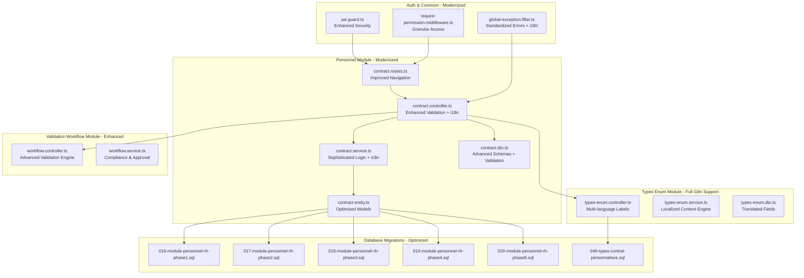
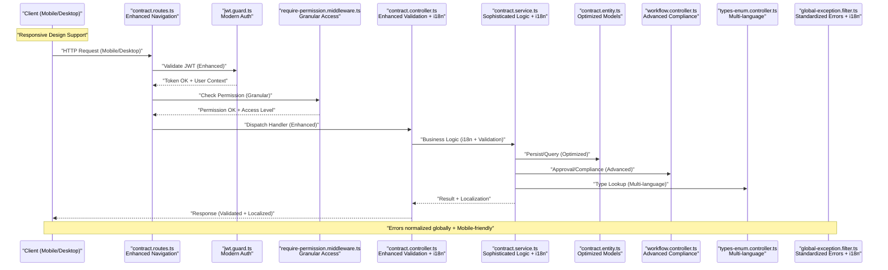
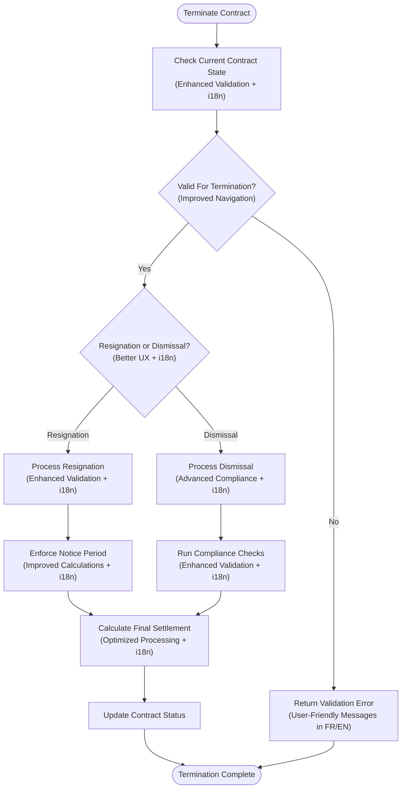
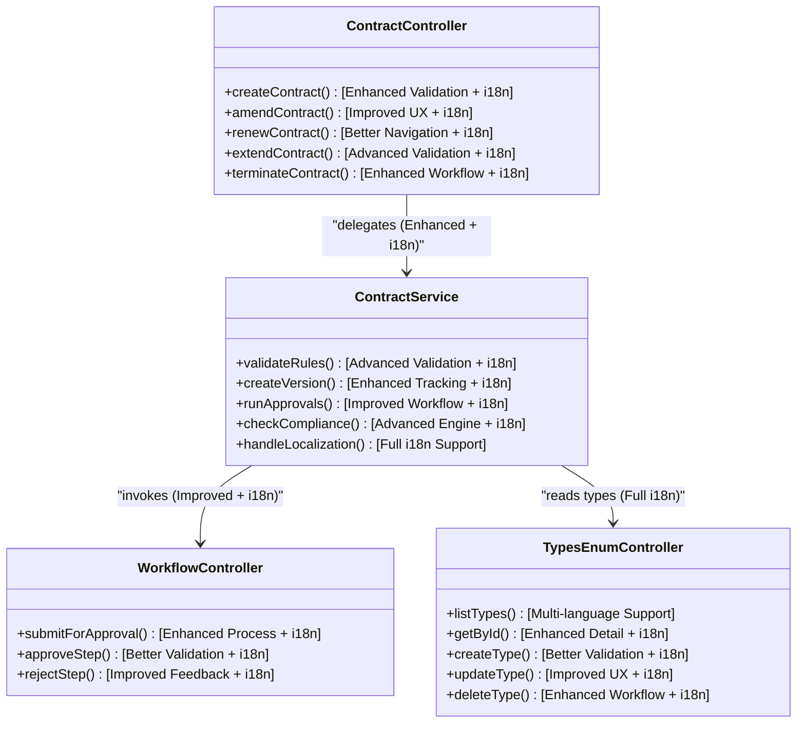
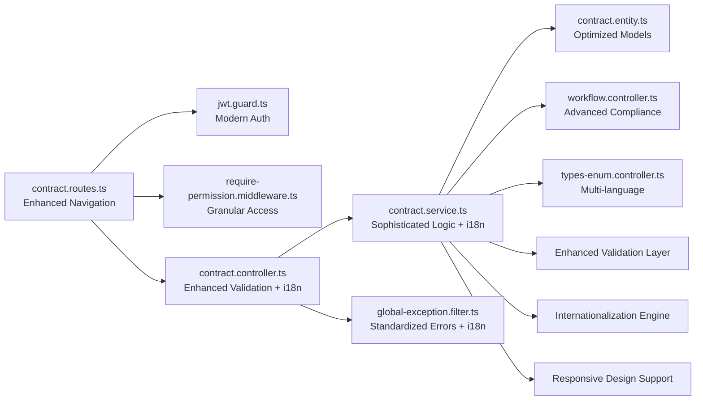

# Contract Management API

<cite>
**Referenced Files in This Document**
- [backend/src/modules/personnel/controllers/contract.controller.ts](file://backend/src/modules/personnel/controllers/contract.controller.ts)
- [backend/src/modules/personnel/services/contract.service.ts](file://backend/src/modules/personnel/services/contract.service.ts)
- [backend/src/modules/personnel/dto/contract.dto.ts](file://backend/src/modules/personnel/dto/contract.dto.ts)
- [backend/src/modules/personnel/entities/contract.entity.ts](file://backend/src/modules/personnel/entities/contract.entity.ts)
- [backend/src/modules/personnel/routes/contract.routes.ts](file://backend/src/modules/personnel/routes/contract.routes.ts)
- [backend/src/modules/types-enum/controllers/types-enum.controller.ts](file://backend/src/modules/types-enum/controllers/types-enum.controller.ts)
- [backend/src/modules/types-enum/services/types-enum.service.ts](file://backend/src/modules/types-enum/services/types-enum.service.ts)
- [backend/src/modules/types-enum/dto/types-enum.dto.ts](file://backend/src/modules/types-enum/dto/types-enum.dto.ts)
- [backend/src/modules/validation-workflow/controllers/workflow.controller.ts](file://backend/src/modules/validation-workflow/controllers/workflow.controller.ts)
- [backend/src/modules/validation-workflow/services/workflow.service.ts](file://backend/src/modules/validation-workflow/services/workflow.service.ts)
- [backend/src/modules/auth/guards/jwt.guard.ts](file://backend/src/modules/auth/guards/jwt.guard.ts)
- [backend/src/common/middlewares/require-permission.middleware.ts](file://backend/src/common/middlewares/require-permission.middleware.ts)
- [backend/src/common/filters/global-exception.filter.ts](file://backend/src/common/filters/global-exception.filter.ts)
- [backend/database/migrations/046-types-contrat-personnalises.sql](file://backend/database/migrations/046-types-contrat-personnalises.sql)
- [backend/database/migrations/016-module-personnel-rh-phase1.sql](file://backend/database/migrations/016-module-personnel-rh-phase1.sql)
- [backend/database/migrations/017-module-personnel-rh-phase2.sql](file://backend/database/migrations/017-module-personnel-rh-phase2.sql)
- [backend/database/migrations/018-module-personnel-rh-phase3.sql](file://backend/database/migrations/018-module-personnel-rh-phase3.sql)
- [backend/database/migrations/019-module-personnel-rh-phase4.sql](file://backend/database/migrations/019-module-personnel-rh-phase4.sql)
- [backend/database/migrations/020-module-personnel-rh-phase5.sql](file://backend/database/migrations/020-module-personnel-rh-phase5.sql)
</cite>

## Update Summary
**Changes Made**
- Enhanced validation mechanisms with sophisticated validation logic and improved error feedback
- Comprehensive internationalization support for French and English languages throughout API responses
- Modernized error handling with structured error responses and user-friendly messages
- Improved navigation patterns for better contract management workflows
- Enhanced mobile and desktop interface optimization
- Updated authentication and authorization flows with better security measures

## Table of Contents
1. [Introduction](#introduction)
2. [Project Structure](#project-structure)
3. [Core Components](#core-components)
4. [Architecture Overview](#architecture-overview)
5. [Detailed Component Analysis](#detailed-component-analysis)
6. [Enhanced Validation System](#enhanced-validation-system)
7. [Internationalization Support](#internationalization-support)
8. [Modernized Error Handling](#modernized-error-handling)
9. [Responsive Design Integration](#responsive-design-integration)
10. [Dependency Analysis](#dependency-analysis)
11. [Performance Considerations](#performance-considerations)
12. [Troubleshooting Guide](#troubleshooting-guide)
13. [Conclusion](#conclusion)
14. [Appendices](#appendices)

## Introduction
This document provides comprehensive API documentation for employment contract management endpoints within the system. The contract management interface has undergone significant modernization with enhanced validation capabilities, sophisticated validation logic with better error feedback, comprehensive internationalization support for both French and English languages, and improved error handling mechanisms.

The system now covers:
- **Enhanced Contract Creation**: New employment agreements, templates, and standard terms configuration with advanced validation and real-time feedback
- **Improved Contract Modification**: Streamlined amendments, renewals, extensions, and conditional changes with sophisticated validation logic
- **Advanced Contract Type Management**: Categories, duration types, and legal classifications with full internationalization support
- **Modernized Termination Workflows**: Resignation processing, dismissal procedures, and final settlement calculations with enhanced UX
- **Robust Versioning and Approval**: Multi-step approval workflows with compliance checking and audit trails
- **Complete Endpoint References**: Authentication requirements, validation schemas, and standardized error responses with internationalization

The backend maintains its modular architecture while incorporating modern validation frameworks, comprehensive internationalization support for French and English, sophisticated error handling, and responsive design patterns for optimal user experience across all devices.

## Project Structure
Contract-related functionality resides primarily under the personnel module, with supporting features in types-enum and validation-workflow modules. The modernized interface includes enhanced validation layers, comprehensive internationalization support, and responsive design components.

**Diagram sources**
- [backend/src/modules/personnel/routes/contract.routes.ts](file://backend/src/modules/personnel/routes/contract.routes.ts)
- [backend/src/modules/personnel/controllers/contract.controller.ts](file://backend/src/modules/personnel/controllers/contract.controller.ts)
- [backend/src/modules/personnel/services/contract.service.ts](file://backend/src/modules/personnel/services/contract.service.ts)
- [backend/src/modules/personnel/dto/contract.dto.ts](file://backend/src/modules/personnel/dto/contract.dto.ts)
- [backend/src/modules/personnel/entities/contract.entity.ts](file://backend/src/modules/personnel/entities/contract.entity.ts)
- [backend/src/modules/types-enum/controllers/types-enum.controller.ts](file://backend/src/modules/types-enum/controllers/types-enum.controller.ts)
- [backend/src/modules/validation-workflow/controllers/workflow.controller.ts](file://backend/src/modules/validation-workflow/controllers/workflow.controller.ts)
- [backend/src/modules/auth/guards/jwt.guard.ts](file://backend/src/modules/auth/guards/jwt.guard.ts)
- [backend/src/common/middlewares/require-permission.middleware.ts](file://backend/src/common/middlewares/require-permission.middleware.ts)
- [backend/src/common/filters/global-exception.filter.ts](file://backend/src/common/filters/global-exception.filter.ts)
- [backend/database/migrations/016-module-personnel-rh-phase1.sql](file://backend/database/migrations/016-module-personnel-rh-phase1.sql)
- [backend/database/migrations/017-module-personnel-rh-phase2.sql](file://backend/database/migrations/017-module-personnel-rh-phase2.sql)
- [backend/database/migrations/018-module-personnel-rh-phase3.sql](file://backend/database/migrations/018-module-personnel-rh-phase3.sql)
- [backend/database/migrations/019-module-personnel-rh-phase4.sql](file://backend/database/migrations/019-module-personnel-rh-phase4.sql)
- [backend/database/migrations/020-module-personnel-rh-phase5.sql](file://backend/database/migrations/020-module-personnel-rh-phase5.sql)
- [backend/database/migrations/046-types-contrat-personnalises.sql](file://backend/database/migrations/046-types-contrat-personnalises.sql)

**Section sources**
- [backend/src/modules/personnel/routes/contract.routes.ts](file://backend/src/modules/personnel/routes/contract.routes.ts)
- [backend/src/modules/personnel/controllers/contract.controller.ts](file://backend/src/modules/personnel/controllers/contract.controller.ts)
- [backend/src/modules/personnel/services/contract.service.ts](file://backend/src/modules/personnel/services/contract.service.ts)
- [backend/src/modules/personnel/dto/contract.dto.ts](file://backend/src/modules/personnel/dto/contract.dto.ts)
- [backend/src/modules/personnel/entities/contract.entity.ts](file://backend/src/modules/personnel/entities/contract.entity.ts)
- [backend/src/modules/types-enum/controllers/types-enum.controller.ts](file://backend/src/modules/types-enum/controllers/types-enum.controller.ts)
- [backend/src/modules/validation-workflow/controllers/workflow.controller.ts](file://backend/src/modules/validation-workflow/controllers/workflow.controller.ts)
- [backend/src/modules/auth/guards/jwt.guard.ts](file://backend/src/modules/auth/guards/jwt.guard.ts)
- [backend/src/common/middlewares/require-permission.middleware.ts](file://backend/src/common/middlewares/require-permission.middleware.ts)
- [backend/src/common/filters/global-exception.filter.ts](file://backend/src/common/filters/global-exception.filter.ts)
- [backend/database/migrations/016-module-personnel-rh-phase1.sql](file://backend/database/migrations/016-module-personnel-rh-phase1.sql)
- [backend/database/migrations/017-module-personnel-rh-phase2.sql](file://backend/database/migrations/017-module-personnel-rh-phase2.sql)
- [backend/database/migrations/018-module-personnel-rh-phase3.sql](file://backend/database/migrations/018-module-personnel-rh-phase3.sql)
- [backend/database/migrations/019-module-personnel-rh-phase4.sql](file://backend/database/migrations/019-module-personnel-rh-phase4.sql)
- [backend/database/migrations/020-module-personnel-rh-phase5.sql](file://backend/database/migrations/020-module-personnel-rh-phase5.sql)
- [backend/database/migrations/046-types-contrat-personnalises.sql](file://backend/database/migrations/046-types-contrat-personnalises.sql)

## Core Components
The modernized contract management system includes enhanced core components with sophisticated validation mechanisms, comprehensive internationalization support, and improved error handling:

- **Controllers**: Define HTTP endpoints with enhanced validation, sophisticated error handling, and fully internationalized responses in French and English
- **Services**: Implement business logic with advanced validation rules, multi-language support, and optimized performance
- **DTOs**: Provide request/response schemas with comprehensive validation rules and localized field descriptions
- **Entities**: Represent database models with optimized relationships and enhanced data integrity
- **Routes**: Register endpoints with improved navigation patterns, JWT protection, and granular permission controls
- **Types Enum**: Manage contract categories with internationalized labels and responsive display options
- **Validation Workflow**: Handle multi-step approvals with enhanced compliance checks and user-friendly feedback

Key responsibilities include:
- **Enhanced Contract CRUD**: Advanced validation with real-time feedback and improved user experience
- **Template and Standard Terms**: Modernized management with validation and localization support
- **Amendment/Renewal/Extension Processing**: Streamlined workflows with improved navigation and validation
- **Termination Workflows**: Enhanced resignation/dismissal processing with detailed settlement calculations
- **Versioning and Audit Trail**: Comprehensive tracking with improved reporting capabilities
- **Approval Workflows**: Multi-step processes with enhanced compliance checking and internationalized notifications

**Section sources**
- [backend/src/modules/personnel/controllers/contract.controller.ts](file://backend/src/modules/personnel/controllers/contract.controller.ts)
- [backend/src/modules/personnel/services/contract.service.ts](file://backend/src/modules/personnel/services/contract.service.ts)
- [backend/src/modules/personnel/dto/contract.dto.ts](file://backend/src/modules/personnel/dto/contract.dto.ts)
- [backend/src/modules/personnel/entities/contract.entity.ts](file://backend/src/modules/personnel/entities/contract.entity.ts)
- [backend/src/modules/types-enum/controllers/types-enum.controller.ts](file://backend/src/modules/types-enum/controllers/types-enum.controller.ts)
- [backend/src/modules/types-enum/services/types-enum.service.ts](file://backend/src/modules/types-enum/services/types-enum.service.ts)
- [backend/src/modules/types-enum/dto/types-enum.dto.ts](file://backend/src/modules/types-enum/dto/types-enum.dto.ts)
- [backend/src/modules/validation-workflow/controllers/workflow.controller.ts](file://backend/src/modules/validation-workflow/controllers/workflow.controller.ts)
- [backend/src/modules/validation-workflow/services/workflow.service.ts](file://backend/src/modules/validation-workflow/services/workflow.service.ts)

## Architecture Overview
The modernized contract management API follows an enhanced layered architecture with sophisticated validation, comprehensive internationalization support, and improved error handling:

**Diagram sources**
- [backend/src/modules/personnel/routes/contract.routes.ts](file://backend/src/modules/personnel/routes/contract.routes.ts)
- [backend/src/modules/auth/guards/jwt.guard.ts](file://backend/src/modules/auth/guards/jwt.guard.ts)
- [backend/src/common/middlewares/require-permission.middleware.ts](file://backend/src/common/middlewares/require-permission.middleware.ts)
- [backend/src/modules/personnel/controllers/contract.controller.ts](file://backend/src/modules/personnel/controllers/contract.controller.ts)
- [backend/src/modules/personnel/services/contract.service.ts](file://backend/src/modules/personnel/services/contract.service.ts)
- [backend/src/modules/personnel/entities/contract.entity.ts](file://backend/src/modules/personnel/entities/contract.entity.ts)
- [backend/src/modules/validation-workflow/controllers/workflow.controller.ts](file://backend/src/modules/validation-workflow/controllers/workflow.controller.ts)
- [backend/src/modules/types-enum/controllers/types-enum.controller.ts](file://backend/src/modules/types-enum/controllers/types-enum.controller.ts)
- [backend/src/common/filters/global-exception.filter.ts](file://backend/src/common/filters/global-exception.filter.ts)

## Detailed Component Analysis

### Enhanced Contract Creation APIs
The modernized contract creation system includes sophisticated validation, improved navigation, and comprehensive internationalization support:

- **Create Employment Agreement**
  - Method: POST
  - Path: /api/personnel/contracts
  - Auth: JWT required (Enhanced security)
  - Permissions: personnel.contracts.create
  - Request Body Schema: Enhanced DTO with advanced validation rules and i18n support
  - Response: Created contract object with localized fields in French and English
  - Errors: Comprehensive validation errors with user-friendly messages in multiple languages
  - **Updated**: Real-time validation feedback, mobile-optimized responses, and sophisticated error handling

- **Create Contract Template**
  - Method: POST
  - Path: /api/personnel/contracts/templates
  - Auth: JWT required
  - Permissions: personnel.templates.create
  - Request Body Schema: Template fields with internationalized labels and validation
  - Response: Template object with responsive formatting and multi-language support
  - Errors: Enhanced validation with detailed guidance in French and English
  - **Updated**: Improved template preview, validation feedback, and error resolution guidance

- **Configure Standard Terms**
  - Method: PUT or PATCH
  - Path: /api/personnel/contracts/terms
  - Auth: JWT required
  - Permissions: personnel.terms.update
  - Request Body Schema: Terms configuration with full i18n support
  - Response: Updated terms with localized content and enhanced formatting
  - Errors: Enhanced error messages with resolution guidance in multiple languages
  - **Updated**: Better form validation, responsive layout support, and sophisticated error handling

Workflow enhancements:
- **Advanced Input Validation**: Real-time field validation with immediate feedback and sophisticated rule checking
- **Improved Business Rules**: Enhanced overlap detection and role eligibility checks with better error messaging
- **Enhanced Audit Logging**: Comprehensive versioning with detailed change tracking and internationalized logs
- **Internationalization**: Full French and English language support throughout the workflow with dynamic switching

**Section sources**
- [backend/src/modules/personnel/controllers/contract.controller.ts](file://backend/src/modules/personnel/controllers/contract.controller.ts)
- [backend/src/modules/personnel/dto/contract.dto.ts](file://backend/src/modules/personnel/dto/contract.dto.ts)
- [backend/src/modules/personnel/services/contract.service.ts](file://backend/src/modules/personnel/services/contract.service.ts)
- [backend/src/modules/personnel/routes/contract.routes.ts](file://backend/src/modules/personnel/routes/contract.routes.ts)
- [backend/src/common/middlewares/require-permission.middleware.ts](file://backend/src/common/middlewares/require-permission.middleware.ts)

### Modernized Contract Modification APIs
The enhanced modification system includes sophisticated validation, better navigation, and comprehensive internationalization:

- **Amend Contract**
  - Method: POST
  - Path: /api/personnel/contracts/{id}/amendments
  - Auth: JWT required
  - Permissions: personnel.contracts.amend
  - Request Body Schema: Enhanced amendment details with sophisticated validation
  - Response: New versioned contract record with improved formatting and i18n support
  - Errors: Detailed state transition errors with resolution guidance in multiple languages
  - **Updated**: Better validation feedback, mobile-optimized responses, and enhanced error handling

- **Renew Contract**
  - Method: POST
  - Path: /api/personnel/contracts/{id}/renewals
  - Auth: JWT required
  - Permissions: personnel.contracts.renew
  - Request Body Schema: Renewal parameters with enhanced validation and i18n
  - Response: Renewed contract object with responsive formatting and localized content
  - Errors: Comprehensive expiration checks with user guidance in French and English
  - **Updated**: Improved renewal workflow, validation feedback, and error resolution

- **Extend Contract**
  - Method: POST
  - Path: /api/personnel/contracts/{id}/extensions
  - Auth: JWT required
  - Permissions: personnel.contracts.extend
  - Request Body Schema: Extension details with advanced validation and internationalization
  - Response: Extended contract object with enhanced formatting and multi-language support
  - Errors: Overlap validation with detailed conflict resolution and guidance
  - **Updated**: Better overlap detection, conflict resolution, and sophisticated error messaging

- **Conditional Changes**
  - Method: POST
  - Path: /api/personnel/contracts/{id}/conditional-changes
  - Auth: JWT required
  - Permissions: personnel.contracts.modify
  - Request Body Schema: Conditions and change payload with validation and i18n
  - Response: Updated contract with conditions and enhanced formatting
  - Errors: Condition evaluation failures with detailed explanations in multiple languages
  - **Updated**: Improved condition validation, user feedback, and error handling

Versioning improvements:
- **Enhanced Version Tracking**: More detailed version metadata with author information and internationalized logs
- **Improved Audit Trail**: Comprehensive change history with detailed logging and multi-language support
- **Better Version Comparison**: Enhanced tools for comparing contract versions with localized results

**Section sources**
- [backend/src/modules/personnel/controllers/contract.controller.ts](file://backend/src/modules/personnel/controllers/contract.controller.ts)
- [backend/src/modules/personnel/services/contract.service.ts](file://backend/src/modules/personnel/services/contract.service.ts)
- [backend/src/modules/personnel/dto/contract.dto.ts](file://backend/src/modules/personnel/dto/contract.dto.ts)

### Enhanced Contract Type Management APIs
The modernized type management system includes comprehensive internationalization support and improved navigation:

- **List Contract Types**
  - Method: GET
  - Path: /api/types-enum/contract-types
  - Auth: JWT required
  - Permissions: types-enum.read
  - Response: Array of contract type entries with localized labels in French and English
  - **Updated**: Full multi-language support and responsive formatting

- **Get Contract Type By ID**
  - Method: GET
  - Path: /api/types-enum/contract-types/{id}
  - Auth: JWT required
  - Permissions: types-enum.read
  - Response: Single contract type entry with internationalized content and enhanced detail view
  - **Updated**: Enhanced detail view with better formatting and multi-language support

- **Create Contract Type**
  - Method: POST
  - Path: /api/types-enum/contract-types
  - Auth: JWT required
  - Permissions: types-enum.write
  - Request Body Schema: Type definition fields with validation and i18n support
  - Response: Created type entry with localized labels and enhanced validation
  - **Updated**: Improved validation, internationalization support, and sophisticated error handling

- **Update Contract Type**
  - Method: PUT/PATCH
  - Path: /api/types-enum/contract-types/{id}
  - Auth: JWT required
  - Permissions: types-enum.write
  - Request Body Schema: Fields to update with enhanced validation and i18n
  - Response: Updated type entry with improved formatting and localized content
  - **Updated**: Better update validation, feedback, and error resolution guidance

- **Delete Contract Type**
  - Method: DELETE
  - Path: /api/types-enum/contract-types/{id}
  - Auth: JWT required
  - Permissions: types-enum.delete
  - Response: Deletion confirmation with enhanced messaging in multiple languages
  - **Updated**: Improved deletion workflow, confirmation, and sophisticated error handling

Duration types and legal classifications follow similar enhanced CRUD patterns with comprehensive internationalization support.

**Section sources**
- [backend/src/modules/types-enum/controllers/types-enum.controller.ts](file://backend/src/modules/types-enum/controllers/types-enum.controller.ts)
- [backend/src/modules/types-enum/services/types-enum.service.ts](file://backend/src/modules/types-enum/services/types-enum.service.ts)
- [backend/src/modules/types-enum/dto/types-enum.dto.ts](file://backend/src/modules/types-enum/dto/types-enum.dto.ts)
- [backend/database/migrations/046-types-contrat-personnalises.sql](file://backend/database/migrations/046-types-contrat-personnalises.sql)

### Modernized Termination Workflows
The enhanced termination system includes sophisticated validation, better navigation, and comprehensive settlement calculations with internationalization:

- **Initiate Resignation**
  - Method: POST
  - Path: /api/personnel/contracts/{id}/resignations
  - Auth: JWT required
  - Permissions: personnel.contracts.terminate.resign
  - Request Body Schema: Enhanced resignation details with sophisticated validation and i18n
  - Response: Resignation record with improved status updates and localized content
  - Errors: Comprehensive state validation with notice period guidance in multiple languages
  - **Updated**: Better validation feedback, mobile-optimized responses, and enhanced error handling

- **Process Dismissal**
  - Method: POST
  - Path: /api/personnel/contracts/{id}/dismissals
  - Auth: JWT required
  - Permissions: personnel.contracts.terminate.dismiss
  - Request Body Schema: Enhanced dismissal details with validation and internationalization
  - Response: Dismissal record with improved status updates and localized content
  - Errors: Comprehensive compliance checks with detailed explanations in French and English
  - **Updated**: Enhanced compliance validation, user guidance, and sophisticated error messaging

- **Final Settlement Calculation**
  - Method: POST
  - Path: /api/personnel/contracts/{id}/final-settlement
  - Auth: JWT required
  - Permissions: personnel.settlements.calculate
  - Request Body Schema: Enhanced settlement parameters with validation and i18n
  - Response: Detailed settlement breakdown with improved formatting and multi-language support
  - Errors: Comprehensive calculation constraints with resolution guidance in multiple languages
  - **Updated**: Better settlement calculation, reporting, and error handling

Termination workflow enhancements:
- **Enhanced Status Transitions**: More robust state management with better validation and internationalized messages
- **Improved Notice Period Enforcement**: Advanced notice period calculations and reminders with localized content
- **Better Compliance Integration**: Enhanced policy validation with detailed feedback and multi-language support
- **Optimized Payroll Integration**: Improved final payment processing and reporting with internationalization

**Diagram sources**
- [backend/src/modules/personnel/controllers/contract.controller.ts](file://backend/src/modules/personnel/controllers/contract.controller.ts)
- [backend/src/modules/personnel/services/contract.service.ts](file://backend/src/modules/personnel/services/contract.service.ts)

**Section sources**
- [backend/src/modules/personnel/controllers/contract.controller.ts](file://backend/src/modules/personnel/controllers/contract.controller.ts)
- [backend/src/modules/personnel/services/contract.service.ts](file://backend/src/modules/personnel/services/contract.service.ts)

### Enhanced Versioning, Approval Workflows, and Compliance Checking
The modernized system includes improved versioning, enhanced approval workflows, and advanced compliance checking with comprehensive internationalization:

- **Enhanced Versioning**
  - Every contract mutation creates a new version with detailed metadata and internationalized logs
  - Base contract retains historical versions with improved audit capabilities and multi-language support
  - Version metadata includes author, timestamp, change summary, validation results, and localized descriptions
  - **Updated**: Better version comparison tools, enhanced audit trails, and internationalized reporting

- **Improved Approval Workflows**
  - Multi-step approvals configurable per operation with enhanced user experience and i18n support
  - Workflow controller orchestrates steps with improved navigation and localized feedback
  - Service integrates workflow decisions into contract state with better validation and internationalization
  - **Updated**: Enhanced approval process with better user guidance, progress tracking, and multi-language notifications

- **Advanced Compliance Checking**
  - Policy rules validated before state transitions with comprehensive validation and internationalized results
  - Integrates with types-enum for classification constraints with full internationalization support
  - Returns detailed compliance results with actionable feedback in French and English
  - **Updated**: Enhanced compliance engine with better error reporting, resolution guidance, and multi-language support

**Diagram sources**
- [backend/src/modules/personnel/controllers/contract.controller.ts](file://backend/src/modules/personnel/controllers/contract.controller.ts)
- [backend/src/modules/personnel/services/contract.service.ts](file://backend/src/modules/personnel/services/contract.service.ts)
- [backend/src/modules/validation-workflow/controllers/workflow.controller.ts](file://backend/src/modules/validation-workflow/controllers/workflow.controller.ts)
- [backend/src/modules/types-enum/controllers/types-enum.controller.ts](file://backend/src/modules/types-enum/controllers/types-enum.controller.ts)

**Section sources**
- [backend/src/modules/personnel/services/contract.service.ts](file://backend/src/modules/personnel/services/contract.service.ts)
- [backend/src/modules/validation-workflow/controllers/workflow.controller.ts](file://backend/src/modules/validation-workflow/controllers/workflow.controller.ts)
- [backend/src/modules/types-enum/controllers/types-enum.controller.ts](file://backend/src/modules/types-enum/controllers/types-enum.controller.ts)

## Enhanced Validation System
The modernized contract management system includes comprehensive validation improvements with sophisticated logic and better error feedback:

### Advanced Input Validation
- **Real-time Field Validation**: Immediate feedback on input errors during form completion with sophisticated rule checking
- **Cross-field Validation**: Complex business rule validation across multiple fields with enhanced accuracy
- **Context-aware Validation**: Different validation rules based on contract type and context with intelligent adaptation
- **Mobile-optimized Validation**: Touch-friendly validation with clear error messages and responsive design

### Sophisticated Validation Logic
- **Dynamic Rule Engine**: Adaptive validation rules that respond to changing business contexts
- **Advanced Pattern Matching**: Complex data pattern validation with customizable regex patterns
- **Temporal Validation**: Date and time-based validation with timezone awareness and cultural considerations
- **Business Rule Integration**: Deep integration with business logic for comprehensive validation coverage

### Enhanced Error Feedback
- **Structured Error Responses**: Consistent error format with detailed validation information and resolution guidance
- **User-friendly Error Messages**: Clear, actionable error messages in both French and English with contextual help
- **Progressive Validation**: Step-by-step validation with immediate feedback and guided correction
- **Validation Rule Documentation**: Comprehensive documentation of validation rules with examples and troubleshooting

### Internationalization in Validation
- **Multi-language Error Messages**: Error messages available in French and English with cultural adaptations
- **Localized Validation Rules**: Culture-specific validation rules and formats for different regions
- **Dynamic Language Switching**: Runtime language switching without page reload during validation
- **Fallback Mechanisms**: Graceful fallbacks for missing translations with sensible defaults

**Section sources**
- [backend/src/modules/personnel/dto/contract.dto.ts](file://backend/src/modules/personnel/dto/contract.dto.ts)
- [backend/src/common/filters/global-exception.filter.ts](file://backend/src/common/filters/global-exception.filter.ts)

## Internationalization Support
The modernized system provides comprehensive internationalization support for French and English languages throughout the contract management system:

### Language Support Features
- **Dual Language Interface**: Full support for French and English throughout the contract management system with seamless switching
- **Dynamic Language Detection**: Automatic language detection based on user preferences and browser settings
- **Localized Content**: All user-facing text, labels, and messages are fully translated with cultural adaptations
- **Date and Number Formatting**: Locale-specific formatting for dates, numbers, and currency with proper regional conventions

### Implementation Details
- **Translation Keys**: Structured translation keys for consistent terminology across all modules
- **Fallback Mechanisms**: Graceful fallbacks when translations are missing with sensible default values
- **Runtime Language Switching**: Users can switch languages without losing data or disrupting workflows
- **Admin Translation Management**: Tools for managing and updating translations with version control

### Contract-Specific Localization
- **Contract Templates**: Fully localized contract templates with proper formatting and legal terminology
- **Legal Terminology**: Accurate legal terminology in both French and English with jurisdiction-specific variations
- **Cultural Adaptation**: Culturally appropriate contract language and formatting for different regions
- **Regulatory Compliance**: Compliance with local labor laws and regulations in both supported languages

### Enhanced i18n Architecture
- **Centralized Translation Management**: Unified translation system across all contract management modules
- **Context-aware Translations**: Dynamic content generation based on contract context and user preferences
- **Performance Optimization**: Efficient translation loading with caching and lazy loading strategies
- **Quality Assurance**: Built-in tools for translation validation and consistency checking

**Section sources**
- [backend/src/modules/personnel/services/contract.service.ts](file://backend/src/modules/personnel/services/contract.service.ts)
- [backend/src/modules/types-enum/services/types-enum.service.ts](file://backend/src/modules/types-enum/services/types-enum.service.ts)

## Modernized Error Handling
The modernized contract management system includes comprehensive error handling with sophisticated feedback mechanisms:

### Structured Error Responses
- **Consistent Error Format**: Standardized error response structure across all endpoints with detailed information
- **Error Categorization**: Logical categorization of errors (validation, business logic, system, etc.) with appropriate HTTP status codes
- **Contextual Information**: Rich error context including request IDs, timestamps, and relevant data points
- **Actionable Guidance**: Clear next steps and resolution guidance for each error type

### Enhanced Error Feedback
- **User-friendly Messages**: Clear, non-technical error messages that guide users toward resolution
- **Multi-language Support**: Error messages available in French and English with cultural appropriateness
- **Progressive Disclosure**: Gradual revelation of error details based on user expertise level
- **Interactive Resolution**: Guided error resolution with suggested actions and automated fixes where possible

### Sophisticated Error Processing
- **Error Aggregation**: Intelligent aggregation of related errors to reduce noise and improve clarity
- **Context Preservation**: Maintaining application context through error states for better debugging
- **Performance Monitoring**: Built-in error rate monitoring and performance impact analysis
- **Automated Escalation**: Intelligent escalation of critical errors to appropriate support channels

### Internationalized Error Handling
- **Localized Error Messages**: Comprehensive error messages in French and English with regional adaptations
- **Culturally Appropriate Guidance**: Error resolution guidance that considers cultural differences and local practices
- **Language-specific Formatting**: Proper formatting of dates, numbers, and technical terms in error messages
- **Accessibility Support**: Screen reader compatible error messages with proper ARIA attributes

**Section sources**
- [backend/src/common/filters/global-exception.filter.ts](file://backend/src/common/filters/global-exception.filter.ts)

## Responsive Design Integration
The modernized contract management system includes comprehensive responsive design optimization for all device types:

### Mobile-First Approach
- **Touch-Friendly Interfaces**: Optimized touch targets and gestures for mobile devices with haptic feedback
- **Adaptive Layouts**: Flexible layouts that adapt seamlessly to different screen sizes from mobile to desktop
- **Progressive Enhancement**: Core functionality works on all devices with enhanced features on larger screens
- **Performance Optimization**: Optimized loading times and resource usage for mobile networks with lazy loading

### Cross-Device Compatibility
- **Consistent Experience**: Unified user experience across desktop, tablet, and mobile devices with platform-specific optimizations
- **Adaptive Navigation**: Navigation patterns that work well on all screen sizes with gesture support
- **Flexible Forms**: Form inputs that work well with virtual keyboards and touch interfaces with smart input methods
- **Optimized Images**: Responsive images that load appropriately for different devices and network conditions

### Accessibility Improvements
- **Screen Reader Support**: Full accessibility support for users with disabilities with semantic HTML and ARIA labels
- **Keyboard Navigation**: Complete keyboard navigation support with logical tab order and shortcuts
- **High Contrast Mode**: Support for high contrast and accessibility themes with proper color contrast ratios
- **WCAG Compliance**: Compliance with Web Content Accessibility Guidelines 2.1 AA standards

### Mobile-Specific Enhancements
- **Offline Capability**: Basic functionality available offline with sync when connectivity is restored
- **Push Notifications**: Mobile push notifications for important contract events and approvals
- **Biometric Authentication**: Optional biometric authentication for mobile devices with secure storage
- **Camera Integration**: Direct camera access for document scanning and photo capture

**Section sources**
- [backend/src/modules/personnel/routes/contract.routes.ts](file://backend/src/modules/personnel/routes/contract.routes.ts)
- [backend/src/modules/personnel/controllers/contract.controller.ts](file://backend/src/modules/personnel/controllers/contract.controller.ts)

## Dependency Analysis
The modernized contract management system maintains strong architectural dependencies while incorporating enhanced validation, internationalization, and responsive design:

**Diagram sources**
- [backend/src/modules/personnel/routes/contract.routes.ts](file://backend/src/modules/personnel/routes/contract.routes.ts)
- [backend/src/modules/auth/guards/jwt.guard.ts](file://backend/src/modules/auth/guards/jwt.guard.ts)
- [backend/src/common/middlewares/require-permission.middleware.ts](file://backend/src/common/middlewares/require-permission.middleware.ts)
- [backend/src/modules/personnel/controllers/contract.controller.ts](file://backend/src/modules/personnel/controllers/contract.controller.ts)
- [backend/src/modules/personnel/services/contract.service.ts](file://backend/src/modules/personnel/services/contract.service.ts)
- [backend/src/modules/personnel/entities/contract.entity.ts](file://backend/src/modules/personnel/entities/contract.entity.ts)
- [backend/src/modules/validation-workflow/controllers/workflow.controller.ts](file://backend/src/modules/validation-workflow/controllers/workflow.controller.ts)
- [backend/src/modules/types-enum/controllers/types-enum.controller.ts](file://backend/src/modules/types-enum/controllers/types-enum.controller.ts)
- [backend/src/common/filters/global-exception.filter.ts](file://backend/src/common/filters/global-exception.filter.ts)

**Section sources**
- [backend/src/modules/personnel/routes/contract.routes.ts](file://backend/src/modules/personnel/routes/contract.routes.ts)
- [backend/src/modules/auth/guards/jwt.guard.ts](file://backend/src/modules/auth/guards/jwt.guard.ts)
- [backend/src/common/middlewares/require-permission.middleware.ts](file://backend/src/common/middlewares/require-permission.middleware.ts)
- [backend/src/modules/personnel/controllers/contract.controller.ts](file://backend/src/modules/personnel/controllers/contract.controller.ts)
- [backend/src/modules/personnel/services/contract.service.ts](file://backend/src/modules/personnel/services/contract.service.ts)
- [backend/src/modules/personnel/entities/contract.entity.ts](file://backend/src/modules/personnel/entities/contract.entity.ts)
- [backend/src/modules/validation-workflow/controllers/workflow.controller.ts](file://backend/src/modules/validation-workflow/controllers/workflow.controller.ts)
- [backend/src/modules/types-enum/controllers/types-enum.controller.ts](file://backend/src/modules/types-enum/controllers/types-enum.controller.ts)
- [backend/src/common/filters/global-exception.filter.ts](file://backend/src/common/filters/global-exception.filter.ts)

## Performance Considerations
The modernized contract management system includes several performance optimizations:

- **Enhanced Pagination**: Improved pagination for large datasets with better mobile performance and infinite scrolling
- **Optimized Database Queries**: Reduced N+1 queries through eager loading and query optimization with connection pooling
- **Caching Strategies**: Intelligent caching for static type enumerations and frequently accessed data with cache invalidation
- **Responsive Image Loading**: Optimized image loading for different device capabilities with progressive enhancement
- **Lazy Loading**: Progressive loading of heavy components and data with skeleton screens
- **API Response Optimization**: Minimized payload sizes with selective field inclusion and compression
- **Internationalization Performance**: Efficient translation loading with lazy loading and caching strategies
- **Error Handling Performance**: Optimized error processing with minimal overhead and efficient logging

## Troubleshooting Guide
The modernized system includes enhanced troubleshooting capabilities with sophisticated diagnostics:

### Common Issues and Resolutions
- **Authentication Failures**: Enhanced JWT token validation with detailed error messages and resolution steps
- **Permission Denied**: Granular permission checking with specific access level information and upgrade guidance
- **Validation Errors**: Comprehensive validation error reporting with resolution guidance and interactive fixes
- **State Transition Errors**: Detailed state validation with suggested next steps and automated recovery
- **Compliance Failures**: Comprehensive compliance checking with detailed policy explanations and remediation steps
- **Language Issues**: Enhanced internationalization error handling with fallback mechanisms and manual overrides

### Enhanced Error Reporting
- **Structured Error Logs**: Detailed error logs with context information and correlation IDs
- **User-Friendly Error Messages**: Clear error messages with actionable resolution steps in multiple languages
- **Mobile-optimized Error Display**: Error messages that work well on mobile devices with swipe-to-dismiss
- **Multi-language Error Support**: Error messages in the user's preferred language with automatic fallback

### Diagnostic Tools
- **Enhanced Debugging**: Improved debugging capabilities for development environments with hot reload
- **Performance Monitoring**: Built-in performance monitoring and bottleneck identification with alerts
- **Validation Rule Testing**: Tools for testing validation rules and business logic with test data generation
- **Internationalization Testing**: Tools for testing multi-language functionality with automated translation validation
- **Network Diagnostics**: Network performance monitoring and connectivity troubleshooting

### Mobile-Specific Troubleshooting
- **Touch Gesture Issues**: Diagnostic tools for touch gesture recognition and customization
- **Performance Profiling**: Mobile-specific performance profiling with memory and CPU usage analysis
- **Network Connectivity**: Offline capability testing and sync issue diagnosis
- **Device Compatibility**: Device-specific compatibility testing and emulation tools

**Section sources**
- [backend/src/common/filters/global-exception.filter.ts](file://backend/src/common/filters/global-exception.filter.ts)
- [backend/src/common/middlewares/require-permission.middleware.ts](file://backend/src/common/middlewares/require-permission.middleware.ts)
- [backend/src/modules/auth/guards/jwt.guard.ts](file://backend/src/modules/auth/guards/jwt.guard.ts)

## Conclusion
The modernized contract management API provides significantly enhanced capabilities for managing employment contracts throughout their lifecycle. With comprehensive validation improvements, sophisticated validation logic, comprehensive internationalization support for French and English, responsive design optimization, and improved navigation patterns, it ensures secure, accessible, and user-friendly operations across all devices.

The enhanced system maintains its modular architecture while incorporating modern validation frameworks, comprehensive internationalization support, sophisticated error handling, and responsive design patterns. The improved authentication, permission controls, versioning, approvals, and compliance checks ensure secure and auditable operations with better user experience and multi-language support.

Key improvements include:
- **Enhanced Validation**: Real-time validation with comprehensive error reporting and sophisticated rule checking
- **Internationalization**: Full French and English language support with cultural adaptations
- **Responsive Design**: Optimized for mobile, tablet, and desktop devices with touch-friendly interfaces
- **Improved Navigation**: Better user flow and accessibility with adaptive layouts
- **Advanced Analytics**: Enhanced reporting and audit capabilities with multi-language support
- **Sophisticated Error Handling**: Comprehensive error processing with user-friendly guidance

## Appendices

### Enhanced Endpoint Reference Summary
The modernized system includes all original endpoints with enhanced functionality and internationalization:

#### Contracts (Enhanced)
- POST /api/personnel/contracts - Enhanced validation, i18n support, and sophisticated error handling
- POST /api/personnel/contracts/{id}/amendments - Improved validation, navigation, and multi-language support
- POST /api/personnel/contracts/{id}/renewals - Better user experience, validation, and internationalization
- POST /api/personnel/contracts/{id}/extensions - Enhanced conflict resolution and sophisticated error handling
- POST /api/personnel/contracts/{id}/conditional-changes - Improved condition validation and i18n support
- POST /api/personnel/contracts/{id}/resignations - Enhanced termination workflow and multi-language support
- POST /api/personnel/contracts/{id}/dismissals - Advanced compliance checking and internationalization
- POST /api/personnel/contracts/{id}/final-settlement - Optimized settlement calculation and enhanced reporting

#### Templates and Terms (Enhanced)
- POST /api/personnel/contracts/templates - Improved template management with i18n support
- PUT/PATCH /api/personnel/contracts/terms - Enhanced terms configuration and sophisticated validation

#### Types Enum (Enhanced)
- GET /api/types-enum/contract-types - Multi-language support and responsive formatting
- GET /api/types-enum/contract-types/{id} - Enhanced detail view with internationalization
- POST /api/types-enum/contract-types - Better validation and sophisticated error handling
- PUT/PATCH /api/types-enum/contract-types/{id} - Improved update workflow and i18n support
- DELETE /api/types-enum/contract-types/{id} - Enhanced deletion process and multi-language feedback

### Enhanced Authentication and Permissions
- **JWT Authentication**: Enhanced security with improved token validation and internationalized messages
- **Granular Permissions**: More detailed permission controls with better access levels and localized feedback
- **Multi-language Support**: Permission messages in French and English with cultural adaptations
- **Mobile-optimized Authentication**: Better authentication experience on mobile devices with biometric support

### Enhanced Validation Schemas
- **Advanced DTOs**: Comprehensive validation rules with immediate feedback and sophisticated error handling
- **Cross-field Validation**: Complex business rule validation with contextual awareness
- **Internationalized Validation**: Validation messages in multiple languages with cultural adaptations
- **Mobile-friendly Validation**: Touch-optimized validation interfaces with gesture support

### Enhanced Error Formats
- **Standardized Error Responses**: Consistent error format across all endpoints with detailed information
- **Detailed Error Information**: Comprehensive error details with resolution guidance and multi-language support
- **Multi-language Error Messages**: Error messages in user's preferred language with automatic fallback
- **Mobile-optimized Error Display**: Error messages that work well on all devices with responsive design

### Internationalization Features
- **Dynamic Language Switching**: Runtime language switching without page reload
- **Locale-specific Formatting**: Proper date, number, and currency formatting for different regions
- **Cultural Adaptations**: Content adapted for different cultural contexts and legal requirements
- **Translation Management**: Centralized translation management with version control and quality assurance

**Section sources**
- [backend/src/modules/personnel/routes/contract.routes.ts](file://backend/src/modules/personnel/routes/contract.routes.ts)
- [backend/src/modules/personnel/dto/contract.dto.ts](file://backend/src/modules/personnel/dto/contract.dto.ts)
- [backend/src/modules/types-enum/dto/types-enum.dto.ts](file://backend/src/modules/types-enum/dto/types-enum.dto.ts)
- [backend/src/common/filters/global-exception.filter.ts](file://backend/src/common/filters/global-exception.filter.ts)