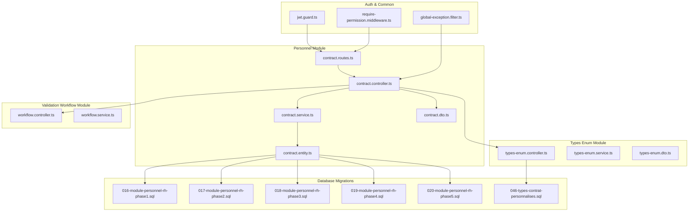
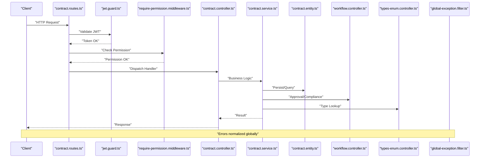
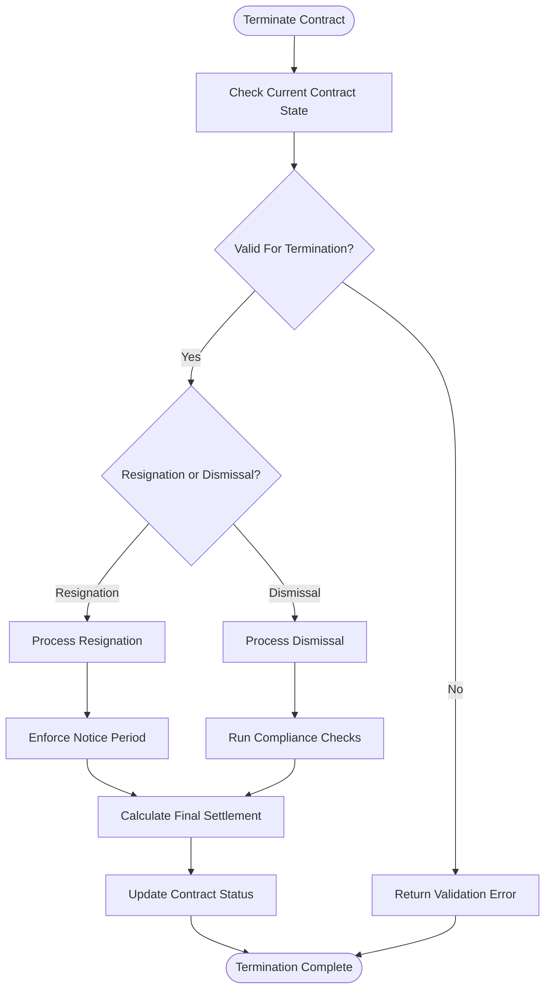
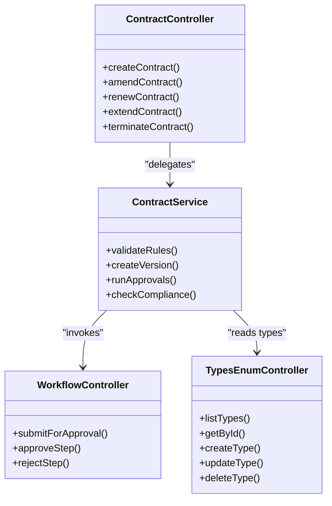
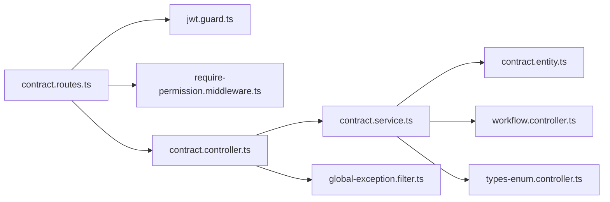

# Contract Management API

<cite>
**Referenced Files in This Document**
- [backend/src/modules/personnel/controllers/contract.controller.ts](file://backend/src/modules/personnel/controllers/contract.controller.ts)
- [backend/src/modules/personnel/services/contract.service.ts](file://backend/src/modules/personnel/services/contract.service.ts)
- [backend/src/modules/personnel/dto/contract.dto.ts](file://backend/src/modules/personnel/dto/contract.dto.ts)
- [backend/src/modules/personnel/entities/contract.entity.ts](file://backend/src/modules/personnel/entities/contract.entity.ts)
- [backend/src/modules/personnel/routes/contract.routes.ts](file://backend/src/modules/personnel/routes/contract.routes.ts)
- [backend/src/modules/types-enum/controllers/types-enum.controller.ts](file://backend/src/modules/types-enum/controllers/types-enum.controller.ts)
- [backend/src/modules/types-enum/services/types-enum.service.ts](file://backend/src/modules/types-enum/services/types-enum.service.ts)
- [backend/src/modules/types-enum/dto/types-enum.dto.ts](file://backend/src/modules/types-enum/dto/types-enum.dto.ts)
- [backend/src/modules/validation-workflow/controllers/workflow.controller.ts](file://backend/src/modules/validation-workflow/controllers/workflow.controller.ts)
- [backend/src/modules/validation-workflow/services/workflow.service.ts](file://backend/src/modules/validation-workflow/services/workflow.service.ts)
- [backend/src/modules/auth/guards/jwt.guard.ts](file://backend/src/modules/auth/guards/jwt.guard.ts)
- [backend/src/common/middlewares/require-permission.middleware.ts](file://backend/src/common/middlewares/require-permission.middleware.ts)
- [backend/src/common/filters/global-exception.filter.ts](file://backend/src/common/filters/global-exception.filter.ts)
- [backend/database/migrations/046-types-contrat-personnalises.sql](file://backend/database/migrations/046-types-contrat-personnalises.sql)
- [backend/database/migrations/016-module-personnel-rh-phase1.sql](file://backend/database/migrations/016-module-personnel-rh-phase1.sql)
- [backend/database/migrations/017-module-personnel-rh-phase2.sql](file://backend/database/migrations/017-module-personnel-rh-phase2.sql)
- [backend/database/migrations/018-module-personnel-rh-phase3.sql](file://backend/database/migrations/018-module-personnel-rh-phase3.sql)
- [backend/database/migrations/019-module-personnel-rh-phase4.sql](file://backend/database/migrations/019-module-personnel-rh-phase4.sql)
- [backend/database/migrations/020-module-personnel-rh-phase5.sql](file://backend/database/migrations/020-module-personnel-rh-phase5.sql)
</cite>

## Table of Contents
1. [Introduction](#introduction)
2. [Project Structure](#project-structure)
3. [Core Components](#core-components)
4. [Architecture Overview](#architecture-overview)
5. [Detailed Component Analysis](#detailed-component-analysis)
6. [Dependency Analysis](#dependency-analysis)
7. [Performance Considerations](#performance-considerations)
8. [Troubleshooting Guide](#troubleshooting-guide)
9. [Conclusion](#conclusion)
10. [Appendices](#appendices)

## Introduction
This document provides comprehensive API documentation for employment contract management endpoints within the system. It covers:
- Contract creation for new employment agreements, templates, and standard terms configuration
- Contract modification for amendments, renewals, extensions, and conditional changes
- Contract type management for categories, duration types, and legal classifications
- Termination workflows including resignation, dismissal, and final settlement calculations
- Versioning, approval workflows, and compliance checking mechanisms
- Complete endpoint references with authentication requirements, validation schemas, and error response formats

The backend is organized by feature modules with controllers, services, DTOs, entities, and routes. Authentication and authorization are enforced via JWT guard and permission middleware. A global exception filter standardizes error responses.

## Project Structure
Contract-related functionality resides primarily under the personnel module, with supporting features in types-enum and validation-workflow modules. Database schema definitions for contracts and related HR tables are provided through migrations.

**Diagram sources**
- [backend/src/modules/personnel/routes/contract.routes.ts](file://backend/src/modules/personnel/routes/contract.routes.ts)
- [backend/src/modules/personnel/controllers/contract.controller.ts](file://backend/src/modules/personnel/controllers/contract.controller.ts)
- [backend/src/modules/personnel/services/contract.service.ts](file://backend/src/modules/personnel/services/contract.service.ts)
- [backend/src/modules/personnel/dto/contract.dto.ts](file://backend/src/modules/personnel/dto/contract.dto.ts)
- [backend/src/modules/personnel/entities/contract.entity.ts](file://backend/src/modules/personnel/entities/contract.entity.ts)
- [backend/src/modules/types-enum/controllers/types-enum.controller.ts](file://backend/src/modules/types-enum/controllers/types-enum.controller.ts)
- [backend/src/modules/validation-workflow/controllers/workflow.controller.ts](file://backend/src/modules/validation-workflow/controllers/workflow.controller.ts)
- [backend/src/modules/auth/guards/jwt.guard.ts](file://backend/src/modules/auth/guards/jwt.guard.ts)
- [backend/src/common/middlewares/require-permission.middleware.ts](file://backend/src/common/middlewares/require-permission.middleware.ts)
- [backend/src/common/filters/global-exception.filter.ts](file://backend/src/common/filters/global-exception.filter.ts)
- [backend/database/migrations/016-module-personnel-rh-phase1.sql](file://backend/database/migrations/016-module-personnel-rh-phase1.sql)
- [backend/database/migrations/017-module-personnel-rh-phase2.sql](file://backend/database/migrations/017-module-personnel-rh-phase2.sql)
- [backend/database/migrations/018-module-personnel-rh-phase3.sql](file://backend/database/migrations/018-module-personnel-rh-phase3.sql)
- [backend/database/migrations/019-module-personnel-rh-phase4.sql](file://backend/database/migrations/019-module-personnel-rh-phase4.sql)
- [backend/database/migrations/020-module-personnel-rh-phase5.sql](file://backend/database/migrations/020-module-personnel-rh-phase5.sql)
- [backend/database/migrations/046-types-contrat-personnalises.sql](file://backend/database/migrations/046-types-contrat-personnalises.sql)

**Section sources**
- [backend/src/modules/personnel/routes/contract.routes.ts](file://backend/src/modules/personnel/routes/contract.routes.ts)
- [backend/src/modules/personnel/controllers/contract.controller.ts](file://backend/src/modules/personnel/controllers/contract.controller.ts)
- [backend/src/modules/personnel/services/contract.service.ts](file://backend/src/modules/personnel/services/contract.service.ts)
- [backend/src/modules/personnel/dto/contract.dto.ts](file://backend/src/modules/personnel/dto/contract.dto.ts)
- [backend/src/modules/personnel/entities/contract.entity.ts](file://backend/src/modules/personnel/entities/contract.entity.ts)
- [backend/src/modules/types-enum/controllers/types-enum.controller.ts](file://backend/src/modules/types-enum/controllers/types-enum.controller.ts)
- [backend/src/modules/validation-workflow/controllers/workflow.controller.ts](file://backend/src/modules/validation-workflow/controllers/workflow.controller.ts)
- [backend/src/modules/auth/guards/jwt.guard.ts](file://backend/src/modules/auth/guards/jwt.guard.ts)
- [backend/src/common/middlewares/require-permission.middleware.ts](file://backend/src/common/middlewares/require-permission.middleware.ts)
- [backend/src/common/filters/global-exception.filter.ts](file://backend/src/common/filters/global-exception.filter.ts)
- [backend/database/migrations/016-module-personnel-rh-phase1.sql](file://backend/database/migrations/016-module-personnel-rh-phase1.sql)
- [backend/database/migrations/017-module-personnel-rh-phase2.sql](file://backend/database/migrations/017-module-personnel-rh-phase2.sql)
- [backend/database/migrations/018-module-personnel-rh-phase3.sql](file://backend/database/migrations/018-module-personnel-rh-phase3.sql)
- [backend/database/migrations/019-module-personnel-rh-phase4.sql](file://backend/database/migrations/019-module-personnel-rh-phase4.sql)
- [backend/database/migrations/020-module-personnel-rh-phase5.sql](file://backend/database/migrations/020-module-personnel-rh-phase5.sql)
- [backend/database/migrations/046-types-contrat-personnalises.sql](file://backend/database/migrations/046-types-contrat-personnalises.sql)

## Core Components
- Controllers: Define HTTP endpoints for contracts, types, and workflow operations. They validate inputs using DTOs and orchestrate service calls.
- Services: Implement business logic for contract lifecycle (creation, amendment, renewal, extension, termination), versioning, approvals, and compliance checks.
- DTOs: Provide request/response schemas and validation rules for endpoints.
- Entities: Represent database models for contracts and related HR data.
- Routes: Register endpoints with guards and permission middleware.
- Types Enum: Manage contract categories, duration types, and legal classifications.
- Validation Workflow: Handle multi-step approvals and compliance checks.

Key responsibilities:
- Contract CRUD and lifecycle transitions
- Template and standard terms management
- Amendment/renewal/extension processing
- Resignation/dismissal and final settlement calculation
- Versioning and audit trail
- Approval workflows and compliance checks

**Section sources**
- [backend/src/modules/personnel/controllers/contract.controller.ts](file://backend/src/modules/personnel/controllers/contract.controller.ts)
- [backend/src/modules/personnel/services/contract.service.ts](file://backend/src/modules/personnel/services/contract.service.ts)
- [backend/src/modules/personnel/dto/contract.dto.ts](file://backend/src/modules/personnel/dto/contract.dto.ts)
- [backend/src/modules/personnel/entities/contract.entity.ts](file://backend/src/modules/personnel/entities/contract.entity.ts)
- [backend/src/modules/types-enum/controllers/types-enum.controller.ts](file://backend/src/modules/types-enum/controllers/types-enum.controller.ts)
- [backend/src/modules/types-enum/services/types-enum.service.ts](file://backend/src/modules/types-enum/services/types-enum.service.ts)
- [backend/src/modules/types-enum/dto/types-enum.dto.ts](file://backend/src/modules/types-enum/dto/types-enum.dto.ts)
- [backend/src/modules/validation-workflow/controllers/workflow.controller.ts](file://backend/src/modules/validation-workflow/controllers/workflow.controller.ts)
- [backend/src/modules/validation-workflow/services/workflow.service.ts](file://backend/src/modules/validation-workflow/services/workflow.service.ts)

## Architecture Overview
The contract management API follows a layered architecture:
- Routes register endpoints protected by JWT and permission middleware
- Controllers handle HTTP requests, validate payloads, and delegate to services
- Services implement business logic and interact with entities and external modules
- Global exception filter normalizes errors across all endpoints

**Diagram sources**
- [backend/src/modules/personnel/routes/contract.routes.ts](file://backend/src/modules/personnel/routes/contract.routes.ts)
- [backend/src/modules/auth/guards/jwt.guard.ts](file://backend/src/modules/auth/guards/jwt.guard.ts)
- [backend/src/common/middlewares/require-permission.middleware.ts](file://backend/src/common/middlewares/require-permission.middleware.ts)
- [backend/src/modules/personnel/controllers/contract.controller.ts](file://backend/src/modules/personnel/controllers/contract.controller.ts)
- [backend/src/modules/personnel/services/contract.service.ts](file://backend/src/modules/personnel/services/contract.service.ts)
- [backend/src/modules/personnel/entities/contract.entity.ts](file://backend/src/modules/personnel/entities/contract.entity.ts)
- [backend/src/modules/validation-workflow/controllers/workflow.controller.ts](file://backend/src/modules/validation-workflow/controllers/workflow.controller.ts)
- [backend/src/modules/types-enum/controllers/types-enum.controller.ts](file://backend/src/modules/types-enum/controllers/types-enum.controller.ts)
- [backend/src/common/filters/global-exception.filter.ts](file://backend/src/common/filters/global-exception.filter.ts)

## Detailed Component Analysis

### Contract Creation APIs
Endpoints support creating new employment agreements, contract templates, and standard terms configuration.

- Create Employment Agreement
  - Method: POST
  - Path: /api/personnel/contracts
  - Auth: JWT required
  - Permissions: personnel.contracts.create
  - Request Body Schema: Defined in contract DTO
  - Response: Created contract object
  - Errors: Validation errors, duplicate constraints, permission denied

- Create Contract Template
  - Method: POST
  - Path: /api/personnel/contracts/templates
  - Auth: JWT required
  - Permissions: personnel.templates.create
  - Request Body Schema: Template fields defined in DTO
  - Response: Template object
  - Errors: Validation errors, uniqueness constraints

- Configure Standard Terms
  - Method: PUT or PATCH
  - Path: /api/personnel/contracts/terms
  - Auth: JWT required
  - Permissions: personnel.terms.update
  - Request Body Schema: Terms configuration fields
  - Response: Updated terms
  - Errors: Validation errors, access denied

Workflow highlights:
- Input validation via DTOs
- Business rule checks (e.g., overlapping periods, role eligibility)
- Audit logging and versioning on create

**Section sources**
- [backend/src/modules/personnel/controllers/contract.controller.ts](file://backend/src/modules/personnel/controllers/contract.controller.ts)
- [backend/src/modules/personnel/dto/contract.dto.ts](file://backend/src/modules/personnel/dto/contract.dto.ts)
- [backend/src/modules/personnel/services/contract.service.ts](file://backend/src/modules/personnel/services/contract.service.ts)
- [backend/src/modules/personnel/routes/contract.routes.ts](file://backend/src/modules/personnel/routes/contract.routes.ts)
- [backend/src/common/middlewares/require-permission.middleware.ts](file://backend/src/common/middlewares/require-permission.middleware.ts)

### Contract Modification APIs
Endpoints manage amendments, renewals, extensions, and conditional changes.

- Amend Contract
  - Method: POST
  - Path: /api/personnel/contracts/{id}/amendments
  - Auth: JWT required
  - Permissions: personnel.contracts.amend
  - Request Body Schema: Amendment details
  - Response: New versioned contract record
  - Errors: Invalid state transition, missing prerequisites

- Renew Contract
  - Method: POST
  - Path: /api/personnel/contracts/{id}/renewals
  - Auth: JWT required
  - Permissions: personnel.contracts.renew
  - Request Body Schema: Renewal parameters
  - Response: Renewed contract object
  - Errors: Expiration checks, eligibility rules

- Extend Contract
  - Method: POST
  - Path: /api/personnel/contracts/{id}/extensions
  - Auth: JWT required
  - Permissions: personnel.contracts.extend
  - Request Body Schema: Extension details
  - Response: Extended contract object
  - Errors: Overlap validation, policy checks

- Conditional Changes
  - Method: POST
  - Path: /api/personnel/contracts/{id}/conditional-changes
  - Auth: JWT required
  - Permissions: personnel.contracts.modify
  - Request Body Schema: Conditions and change payload
  - Response: Updated contract with conditions
  - Errors: Condition evaluation failures

Versioning behavior:
- Each modification creates a new version linked to the base contract
- Previous versions remain immutable for audit purposes

**Section sources**
- [backend/src/modules/personnel/controllers/contract.controller.ts](file://backend/src/modules/personnel/controllers/contract.controller.ts)
- [backend/src/modules/personnel/services/contract.service.ts](file://backend/src/modules/personnel/services/contract.service.ts)
- [backend/src/modules/personnel/dto/contract.dto.ts](file://backend/src/modules/personnel/dto/contract.dto.ts)

### Contract Type Management APIs
Endpoints manage different employment categories, duration types, and legal classifications.

- List Contract Types
  - Method: GET
  - Path: /api/types-enum/contract-types
  - Auth: JWT required
  - Permissions: types-enum.read
  - Response: Array of contract type entries

- Get Contract Type By ID
  - Method: GET
  - Path: /api/types-enum/contract-types/{id}
  - Auth: JWT required
  - Permissions: types-enum.read
  - Response: Single contract type entry

- Create Contract Type
  - Method: POST
  - Path: /api/types-enum/contract-types
  - Auth: JWT required
  - Permissions: types-enum.write
  - Request Body Schema: Type definition fields
  - Response: Created type entry

- Update Contract Type
  - Method: PUT/PATCH
  - Path: /api/types-enum/contract-types/{id}
  - Auth: JWT required
  - Permissions: types-enum.write
  - Request Body Schema: Fields to update
  - Response: Updated type entry

- Delete Contract Type
  - Method: DELETE
  - Path: /api/types-enum/contract-types/{id}
  - Auth: JWT required
  - Permissions: types-enum.delete
  - Response: Deletion confirmation

Duration types and legal classifications follow similar CRUD patterns under the same controller.

**Section sources**
- [backend/src/modules/types-enum/controllers/types-enum.controller.ts](file://backend/src/modules/types-enum/controllers/types-enum.controller.ts)
- [backend/src/modules/types-enum/services/types-enum.service.ts](file://backend/src/modules/types-enum/services/types-enum.service.ts)
- [backend/src/modules/types-enum/dto/types-enum.dto.ts](file://backend/src/modules/types-enum/dto/types-enum.dto.ts)
- [backend/database/migrations/046-types-contrat-personnalises.sql](file://backend/database/migrations/046-types-contrat-personnalises.sql)

### Termination Workflows
Endpoints cover resignation processing, dismissal procedures, and final settlement calculations.

- Initiate Resignation
  - Method: POST
  - Path: /api/personnel/contracts/{id}/resignations
  - Auth: JWT required
  - Permissions: personnel.contracts.terminate.resign
  - Request Body Schema: Resignation details (effective date, reason)
  - Response: Resignation record and updated contract status
  - Errors: State validation, notice period checks

- Process Dismissal
  - Method: POST
  - Path: /api/personnel/contracts/{id}/dismissals
  - Auth: JWT required
  - Permissions: personnel.contracts.terminate.dismiss
  - Request Body Schema: Dismissal details (reason, effective date)
  - Response: Dismissal record and updated contract status
  - Errors: Compliance checks, policy validations

- Final Settlement Calculation
  - Method: POST
  - Path: /api/personnel/contracts/{id}/final-settlement
  - Auth: JWT required
  - Permissions: personnel.settlements.calculate
  - Request Body Schema: Settlement parameters (accrued benefits, deductions)
  - Response: Settlement breakdown and totals
  - Errors: Missing data, calculation constraints

Termination flow includes:
- Status transitions to terminated or pending termination
- Notice period enforcement
- Compliance checks against labor policies
- Integration with payroll for final payments

**Diagram sources**
- [backend/src/modules/personnel/controllers/contract.controller.ts](file://backend/src/modules/personnel/controllers/contract.controller.ts)
- [backend/src/modules/personnel/services/contract.service.ts](file://backend/src/modules/personnel/services/contract.service.ts)

**Section sources**
- [backend/src/modules/personnel/controllers/contract.controller.ts](file://backend/src/modules/personnel/controllers/contract.controller.ts)
- [backend/src/modules/personnel/services/contract.service.ts](file://backend/src/modules/personnel/services/contract.service.ts)

### Versioning, Approval Workflows, and Compliance Checking
- Versioning
  - Every contract mutation creates a new version
  - Base contract retains historical versions for audit
  - Version metadata includes author, timestamp, and change summary

- Approval Workflows
  - Multi-step approvals configurable per operation
  - Workflow controller orchestrates steps and transitions
  - Service integrates workflow decisions into contract state

- Compliance Checking
  - Policy rules validated before state transitions
  - Integrates with types-enum for classification constraints
  - Returns detailed compliance results for auditability

**Diagram sources**
- [backend/src/modules/personnel/controllers/contract.controller.ts](file://backend/src/modules/personnel/controllers/contract.controller.ts)
- [backend/src/modules/personnel/services/contract.service.ts](file://backend/src/modules/personnel/services/contract.service.ts)
- [backend/src/modules/validation-workflow/controllers/workflow.controller.ts](file://backend/src/modules/validation-workflow/controllers/workflow.controller.ts)
- [backend/src/modules/types-enum/controllers/types-enum.controller.ts](file://backend/src/modules/types-enum/controllers/types-enum.controller.ts)

**Section sources**
- [backend/src/modules/personnel/services/contract.service.ts](file://backend/src/modules/personnel/services/contract.service.ts)
- [backend/src/modules/validation-workflow/controllers/workflow.controller.ts](file://backend/src/modules/validation-workflow/controllers/workflow.controller.ts)
- [backend/src/modules/types-enum/controllers/types-enum.controller.ts](file://backend/src/modules/types-enum/controllers/types-enum.controller.ts)

## Dependency Analysis
- Controllers depend on services for business logic
- Services depend on entities for persistence and on other modules (workflow, types-enum)
- Routes apply JWT guard and permission middleware before reaching controllers
- Global exception filter centralizes error handling

**Diagram sources**
- [backend/src/modules/personnel/routes/contract.routes.ts](file://backend/src/modules/personnel/routes/contract.routes.ts)
- [backend/src/modules/auth/guards/jwt.guard.ts](file://backend/src/modules/auth/guards/jwt.guard.ts)
- [backend/src/common/middlewares/require-permission.middleware.ts](file://backend/src/common/middlewares/require-permission.middleware.ts)
- [backend/src/modules/personnel/controllers/contract.controller.ts](file://backend/src/modules/personnel/controllers/contract.controller.ts)
- [backend/src/modules/personnel/services/contract.service.ts](file://backend/src/modules/personnel/services/contract.service.ts)
- [backend/src/modules/personnel/entities/contract.entity.ts](file://backend/src/modules/personnel/entities/contract.entity.ts)
- [backend/src/modules/validation-workflow/controllers/workflow.controller.ts](file://backend/src/modules/validation-workflow/controllers/workflow.controller.ts)
- [backend/src/modules/types-enum/controllers/types-enum.controller.ts](file://backend/src/modules/types-enum/controllers/types-enum.controller.ts)
- [backend/src/common/filters/global-exception.filter.ts](file://backend/src/common/filters/global-exception.filter.ts)

**Section sources**
- [backend/src/modules/personnel/routes/contract.routes.ts](file://backend/src/modules/personnel/routes/contract.routes.ts)
- [backend/src/modules/auth/guards/jwt.guard.ts](file://backend/src/modules/auth/guards/jwt.guard.ts)
- [backend/src/common/middlewares/require-permission.middleware.ts](file://backend/src/common/middlewares/require-permission.middleware.ts)
- [backend/src/modules/personnel/controllers/contract.controller.ts](file://backend/src/modules/personnel/controllers/contract.controller.ts)
- [backend/src/modules/personnel/services/contract.service.ts](file://backend/src/modules/personnel/services/contract.service.ts)
- [backend/src/modules/personnel/entities/contract.entity.ts](file://backend/src/modules/personnel/entities/contract.entity.ts)
- [backend/src/modules/validation-workflow/controllers/workflow.controller.ts](file://backend/src/modules/validation-workflow/controllers/workflow.controller.ts)
- [backend/src/modules/types-enum/controllers/types-enum.controller.ts](file://backend/src/modules/types-enum/controllers/types-enum.controller.ts)
- [backend/src/common/filters/global-exception.filter.ts](file://backend/src/common/filters/global-exception.filter.ts)

## Performance Considerations
- Use pagination for list endpoints where applicable
- Index frequently queried fields in database (see migration indexes)
- Cache static type enumerations to reduce repeated lookups
- Batch operations for bulk updates when supported
- Avoid N+1 queries by eager loading related entities

[No sources needed since this section provides general guidance]

## Troubleshooting Guide
Common issues and resolutions:
- Authentication failures: Ensure valid JWT token is included in Authorization header
- Permission denied: Verify user has required permissions for the endpoint
- Validation errors: Check request body against DTO schemas
- State transition errors: Confirm current contract state allows requested operation
- Compliance failures: Review policy rules and type constraints

Error response format:
- Standardized structure returned by global exception filter
- Includes error code, message, and optional details

**Section sources**
- [backend/src/common/filters/global-exception.filter.ts](file://backend/src/common/filters/global-exception.filter.ts)
- [backend/src/common/middlewares/require-permission.middleware.ts](file://backend/src/common/middlewares/require-permission.middleware.ts)
- [backend/src/modules/auth/guards/jwt.guard.ts](file://backend/src/modules/auth/guards/jwt.guard.ts)

## Conclusion
The contract management API provides robust capabilities for managing employment contracts throughout their lifecycle. With strong authentication, permission controls, versioning, approvals, and compliance checks, it ensures secure and auditable operations. The modular architecture supports extensibility and maintainability.

[No sources needed since this section summarizes without analyzing specific files]

## Appendices

### Endpoint Reference Summary
- Contracts
  - POST /api/personnel/contracts
  - POST /api/personnel/contracts/{id}/amendments
  - POST /api/personnel/contracts/{id}/renewals
  - POST /api/personnel/contracts/{id}/extensions
  - POST /api/personnel/contracts/{id}/conditional-changes
  - POST /api/personnel/contracts/{id}/resignations
  - POST /api/personnel/contracts/{id}/dismissals
  - POST /api/personnel/contracts/{id}/final-settlement
- Templates and Terms
  - POST /api/personnel/contracts/templates
  - PUT/PATCH /api/personnel/contracts/terms
- Types Enum
  - GET /api/types-enum/contract-types
  - GET /api/types-enum/contract-types/{id}
  - POST /api/types-enum/contract-types
  - PUT/PATCH /api/types-enum/contract-types/{id}
  - DELETE /api/types-enum/contract-types/{id}

Authentication and permissions:
- All endpoints require JWT
- Specific permissions enforced via middleware

Validation schemas:
- Refer to DTOs for request/response structures

Error formats:
- Normalized by global exception filter

**Section sources**
- [backend/src/modules/personnel/routes/contract.routes.ts](file://backend/src/modules/personnel/routes/contract.routes.ts)
- [backend/src/modules/personnel/dto/contract.dto.ts](file://backend/src/modules/personnel/dto/contract.dto.ts)
- [backend/src/modules/types-enum/dto/types-enum.dto.ts](file://backend/src/modules/types-enum/dto/types-enum.dto.ts)
- [backend/src/common/filters/global-exception.filter.ts](file://backend/src/common/filters/global-exception.filter.ts)