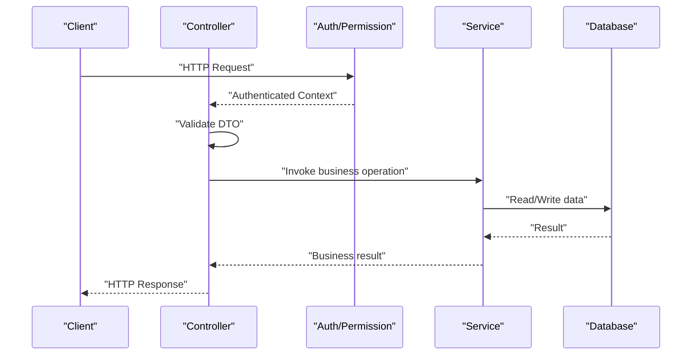
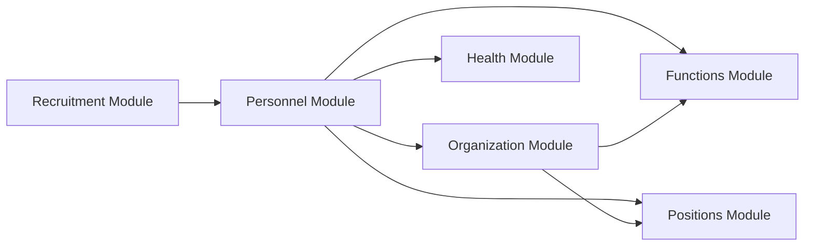

# Employee Lifecycle Management API

<cite>
**Referenced Files in This Document**
- [backend/src/modules/personnel/controllers/personnel.controller.ts](file://backend/src/modules/personnel/controllers/personnel.controller.ts)
- [backend/src/modules/personnel/services/personnel.service.ts](file://backend/src/modules/personnel/services/personnel.service.ts)
- [backend/src/modules/personnel/dto/personnel.dto.ts](file://backend/src/modules/personnel/dto/personnel.dto.ts)
- [backend/src/modules/personnel/entities/personnel.entity.ts](file://backend/src/modules/personnel/entities/personnel.entity.ts)
- [backend/src/modules/personnel/routes/personnel.routes.ts](file://backend/src/modules/personnel/routes/personnel.routes.ts)
- [backend/src/modules/recrutement/controllers/recruitment.controller.ts](file://backend/src/modules/recrutement/controllers/recruitment.controller.ts)
- [backend/src/modules/recrutement/services/recruitment.service.ts](file://backend/src/modules/recrutement/services/recruitment.service.ts)
- [backend/src/modules/recrutement/dto/recruitment.dto.ts](file://backend/src/modules/recrutement/dto/recruitment.dto.ts)
- [backend/src/modules/recrutement/entities/recruitment.entity.ts](file://backend/src/modules/recrutement/entities/recruitment.entity.ts)
- [backend/src/modules/sante/controllers/health.controller.ts](file://backend/src/modules/sante/controllers/health.controller.ts)
- [backend/src/modules/sante/services/health.service.ts](file://backend/src/modules/sante/services/health.service.ts)
- [backend/src/modules/sante/dto/health.dto.ts](file://backend/src/modules/sante/dto/health.dto.ts)
- [backend/src/modules/sante/entities/health.entity.ts](file://backend/src/modules/sante/entities/health.entity.ts)
- [backend/src/modules/fonctions/controllers/functions.controller.ts](file://backend/src/modules/fonctions/controllers/functions.controller.ts)
- [backend/src/modules/fonctions/services/functions.service.ts](file://backend/src/modules/fonctions/services/functions.service.ts)
- [backend/src/modules/fonctions/dto/functions.dto.ts](file://backend/src/modules/fonctions/dto/functions.dto.ts)
- [backend/src/modules/fonctions/entities/functions.entity.ts](file://backend/src/modules/fonctions/entities/functions.entity.ts)
- [backend/src/modules/postes/controllers/positions.controller.ts](file://backend/src/modules/postes/controllers/positions.controller.ts)
- [backend/src/modules/postes/services/positions.service.ts](file://backend/src/modules/postes/services/positions.service.ts)
- [backend/src/modules/postes/dto/positions.dto.ts](file://backend/src/modules/postes/dto/positions.dto.ts)
- [backend/src/modules/postes/entities/positions.entity.ts](file://backend/src/modules/postes/entities/positions.entity.ts)
- [backend/src/modules/organisation/controllers/organization.controller.ts](file://backend/src/modules/organisation/controllers/organization.controller.ts)
- [backend/src/modules/organisation/services/organization.service.ts](file://backend/src/modules/organisation/services/organization.service.ts)
- [backend/src/modules/organisation/dto/organization.dto.ts](file://backend/src/modules/organisation/dto/organization.dto.ts)
- [backend/src/modules/organisation/entities/organization.entity.ts](file://backend/src/modules/organisation/entities/organization.entity.ts)
- [backend/src/common/middlewares/auth.middleware.ts](file://backend/src/common/middlewares/auth.middleware.ts)
- [backend/src/common/middlewares/permission.middleware.ts](file://backend/src/common/middlewares/permission.middleware.ts)
- [backend/src/config/swagger.config.ts](file://backend/src/config/swagger.config.ts)
</cite>

## Table of Contents
1. [Introduction](#introduction)
2. [Project Structure](#project-structure)
3. [Core Components](#core-components)
4. [Architecture Overview](#architecture-overview)
5. [Detailed Component Analysis](#detailed-component-analysis)
6. [Dependency Analysis](#dependency-analysis)
7. [Performance Considerations](#performance-considerations)
8. [Troubleshooting Guide](#troubleshooting-guide)
9. [Conclusion](#conclusion)
10. [Appendices](#appendices)

## Introduction
This document provides comprehensive API documentation for employee lifecycle management endpoints. It covers:
- Employee profile management (personal information, contact details, emergency contacts, demographic data)
- Qualifications and certifications (academic credentials, professional certifications, training records, skill assessments)
- Document management (contracts, identification documents, medical certificates, performance reviews)
- Status transitions (department transfers, position changes, termination processes)
- Authentication, authorization, and data validation examples

The backend is organized by modules with controllers, services, DTOs, entities, and routes. Common middlewares handle authentication and permissions. Swagger configuration centralizes API documentation metadata.

## Project Structure
The employee lifecycle spans multiple modules:
- personnel: core employee profiles and personal data
- recrutement: recruitment pipeline leading to onboarding
- sante: health-related records and medical certificates
- fonctions: job functions and roles
- postes: positions and assignments
- organisation: departments and organizational structure
- common: shared middleware for auth and permissions
- config: swagger configuration for API docs

```mermaid
graph TB
subgraph "Personnel"
PCtrl["personnel.controller.ts"]
PSvc["personnel.service.ts"]
PDto["personnel.dto.ts"]
PEnt["personnel.entity.ts"]
end
subgraph "Recruitment"
RCtrl["recruitment.controller.ts"]
RSvc["recruitment.service.ts"]
RDto["recruitment.dto.ts"]
REnt["recruitment.entity.ts"]
end
subgraph "Health"
HCtrl["health.controller.ts"]
HSvc["health.service.ts"]
HDto["health.dto.ts"]
HEnt["health.entity.ts"]
end
subgraph "Functions"
FCtrl["functions.controller.ts"]
FSvc["functions.service.ts"]
FDto["functions.dto.ts"]
FEnt["functions.entity.ts"]
end
subgraph "Positions"
OCtrl["positions.controller.ts"]
OSvc["positions.service.ts"]
ODto["positions.dto.ts"]
OEnt["positions.entity.ts"]
end
subgraph "Organization"
OrgCtrl["organization.controller.ts"]
OrgSvc["organization.service.ts"]
OrgDto["organization.dto.ts"]
OrgEnt["organization.entity.ts"]
end
subgraph "Common"
AuthMW["auth.middleware.ts"]
PermMW["permission.middleware.ts"]
end
subgraph "Config"
SwCfg["swagger.config.ts"]
end
PCtrl --> PSvc
RCtrl --> RSvc
HCtrl --> HSvc
FCtrl --> FSvc
OCtrl --> OSvc
OrgCtrl --> OrgSvc
PCtrl --> AuthMW
PCtrl --> PermMW
RCtrl --> AuthMW
RCtrl --> PermMW
HCtrl --> AuthMW
HCtrl --> PermMW
FCtrl --> AuthMW
FCtrl --> PermMW
OCtrl --> AuthMW
OCtrl --> PermMW
OrgCtrl --> AuthMW
OrgCtrl --> PermMW
SwCfg -.-> PCtrl
SwCfg -.-> RCtrl
SwCfg -.-> HCtrl
SwCfg -.-> FCtrl
SwCfg -.-> OCtrl
SwCfg -.-> OrgCtrl
```

**Diagram sources**
- [backend/src/modules/personnel/controllers/personnel.controller.ts](file://backend/src/modules/personnel/controllers/personnel.controller.ts)
- [backend/src/modules/recrutement/controllers/recruitment.controller.ts](file://backend/src/modules/recrutement/controllers/recruitment.controller.ts)
- [backend/src/modules/sante/controllers/health.controller.ts](file://backend/src/modules/sante/controllers/health.controller.ts)
- [backend/src/modules/fonctions/controllers/functions.controller.ts](file://backend/src/modules/fonctions/controllers/functions.controller.ts)
- [backend/src/modules/postes/controllers/positions.controller.ts](file://backend/src/modules/postes/controllers/positions.controller.ts)
- [backend/src/modules/organisation/controllers/organization.controller.ts](file://backend/src/modules/organisation/controllers/organization.controller.ts)
- [backend/src/common/middlewares/auth.middleware.ts](file://backend/src/common/middlewares/auth.middleware.ts)
- [backend/src/common/middlewares/permission.middleware.ts](file://backend/src/common/middlewares/permission.middleware.ts)
- [backend/src/config/swagger.config.ts](file://backend/src/config/swagger.config.ts)

**Section sources**
- [backend/src/modules/personnel/controllers/personnel.controller.ts](file://backend/src/modules/personnel/controllers/personnel.controller.ts)
- [backend/src/modules/recrutement/controllers/recruitment.controller.ts](file://backend/src/modules/recrutement/controllers/recruitment.controller.ts)
- [backend/src/modules/sante/controllers/health.controller.ts](file://backend/src/modules/sante/controllers/health.controller.ts)
- [backend/src/modules/fonctions/controllers/functions.controller.ts](file://backend/src/modules/fonctions/controllers/functions.controller.ts)
- [backend/src/modules/postes/controllers/positions.controller.ts](file://backend/src/modules/postes/controllers/positions.controller.ts)
- [backend/src/modules/organisation/controllers/organization.controller.ts](file://backend/src/modules/organisation/controllers/organization.controller.ts)
- [backend/src/common/middlewares/auth.middleware.ts](file://backend/src/common/middlewares/auth.middleware.ts)
- [backend/src/common/middlewares/permission.middleware.ts](file://backend/src/common/middlewares/permission.middleware.ts)
- [backend/src/config/swagger.config.ts](file://backend/src/config/swagger.config.ts)

## Core Components
- Controllers expose REST endpoints for each domain area and orchestrate service calls.
- Services implement business logic, including validations, state transitions, and persistence.
- DTOs define request/response schemas and validation rules.
- Entities represent database models and relationships.
- Routes register endpoint paths and apply middleware.
- Middlewares enforce authentication and permission checks.
- Swagger config centralizes API metadata and security schemes.

Key responsibilities:
- Profile management: CRUD operations for personal info, contact details, emergency contacts, demographics.
- Qualifications/certifications: manage academic credentials, certifications, training records, skills.
- Documents: upload and manage contracts, IDs, medical certificates, performance reviews.
- Transitions: department transfer, position change, termination workflow.

**Section sources**
- [backend/src/modules/personnel/controllers/personnel.controller.ts](file://backend/src/modules/personnel/controllers/personnel.controller.ts)
- [backend/src/modules/personnel/services/personnel.service.ts](file://backend/src/modules/personnel/services/personnel.service.ts)
- [backend/src/modules/personnel/dto/personnel.dto.ts](file://backend/src/modules/personnel/dto/personnel.dto.ts)
- [backend/src/modules/personnel/entities/personnel.entity.ts](file://backend/src/modules/personnel/entities/personnel.entity.ts)
- [backend/src/modules/recrutement/controllers/recruitment.controller.ts](file://backend/src/modules/recrutement/controllers/recruitment.controller.ts)
- [backend/src/modules/recrutement/services/recruitment.service.ts](file://backend/src/modules/recrutement/services/recruitment.service.ts)
- [backend/src/modules/recrutement/dto/recruitment.dto.ts](file://backend/src/modules/recrutement/dto/recruitment.dto.ts)
- [backend/src/modules/recrutement/entities/recruitment.entity.ts](file://backend/src/modules/recrutement/entities/recruitment.entity.ts)
- [backend/src/modules/sante/controllers/health.controller.ts](file://backend/src/modules/sante/controllers/health.controller.ts)
- [backend/src/modules/sante/services/health.service.ts](file://backend/src/modules/sante/services/health.service.ts)
- [backend/src/modules/sante/dto/health.dto.ts](file://backend/src/modules/sante/dto/health.dto.ts)
- [backend/src/modules/sante/entities/health.entity.ts](file://backend/src/modules/sante/entities/health.entity.ts)
- [backend/src/modules/fonctions/controllers/functions.controller.ts](file://backend/src/modules/fonctions/controllers/functions.controller.ts)
- [backend/src/modules/fonctions/services/functions.service.ts](file://backend/src/modules/fonctions/services/functions.service.ts)
- [backend/src/modules/fonctions/dto/functions.dto.ts](file://backend/src/modules/fonctions/dto/functions.dto.ts)
- [backend/src/modules/fonctions/entities/functions.entity.ts](file://backend/src/modules/fonctions/entities/functions.entity.ts)
- [backend/src/modules/postes/controllers/positions.controller.ts](file://backend/src/modules/postes/controllers/positions.controller.ts)
- [backend/src/modules/postes/services/positions.service.ts](file://backend/src/modules/postes/services/positions.service.ts)
- [backend/src/modules/postes/dto/positions.dto.ts](file://backend/src/modules/postes/dto/positions.dto.ts)
- [backend/src/modules/postes/entities/positions.entity.ts](file://backend/src/modules/postes/entities/positions.entity.ts)
- [backend/src/modules/organisation/controllers/organization.controller.ts](file://backend/src/modules/organisation/controllers/organization.controller.ts)
- [backend/src/modules/organisation/services/organization.service.ts](file://backend/src/modules/organisation/services/organization.service.ts)
- [backend/src/modules/organisation/dto/organization.dto.ts](file://backend/src/modules/organisation/dto/organization.dto.ts)
- [backend/src/modules/organisation/entities/organization.entity.ts](file://backend/src/modules/organisation/entities/organization.entity.ts)
- [backend/src/common/middlewares/auth.middleware.ts](file://backend/src/common/middlewares/auth.middleware.ts)
- [backend/src/common/middlewares/permission.middleware.ts](file://backend/src/common/middlewares/permission.middleware.ts)
- [backend/src/config/swagger.config.ts](file://backend/src/config/swagger.config.ts)

## Architecture Overview
The API follows a layered architecture:
- HTTP layer: controllers receive requests, validate inputs via DTOs, call services, return responses.
- Business layer: services enforce rules, orchestrate cross-module operations, handle transitions.
- Data layer: entities map to database tables; repositories are invoked within services.
- Cross-cutting concerns: authentication and permission middlewares protect endpoints; swagger config documents APIs.

**Diagram sources**
- [backend/src/common/middlewares/auth.middleware.ts](file://backend/src/common/middlewares/auth.middleware.ts)
- [backend/src/common/middlewares/permission.middleware.ts](file://backend/src/common/middlewares/permission.middleware.ts)
- [backend/src/modules/personnel/controllers/personnel.controller.ts](file://backend/src/modules/personnel/controllers/personnel.controller.ts)
- [backend/src/modules/personnel/services/personnel.service.ts](file://backend/src/modules/personnel/services/personnel.service.ts)

## Detailed Component Analysis

### Employee Profile Management
Endpoints cover personal information updates, contact details, emergency contacts, and demographic data. Typical operations include:
- Get profile by ID
- Update personal information
- Update contact details
- Manage emergency contacts (create/update/delete)
- Update demographic fields

Authentication and authorization:
- Require valid token and appropriate role/permission scopes.
- Enforce tenant isolation where applicable.

Data validation:
- DTOs enforce required fields, formats, and constraints.
- Example validations: email format, phone number patterns, date ranges.

Example request/response patterns:
- PUT /api/personnel/:id/profile
- PATCH /api/personnel/:id/contact
- POST /api/personnel/:id/emergency-contact
- DELETE /api/personnel/:id/emergency-contact/:contactId
- PATCH /api/personnel/:id/demographics

Error handling:
- 400 for validation errors
- 401/403 for auth/permission failures
- 404 when entity not found
- 500 for server errors

**Section sources**
- [backend/src/modules/personnel/controllers/personnel.controller.ts](file://backend/src/modules/personnel/controllers/personnel.controller.ts)
- [backend/src/modules/personnel/services/personnel.service.ts](file://backend/src/modules/personnel/services/personnel.service.ts)
- [backend/src/modules/personnel/dto/personnel.dto.ts](file://backend/src/modules/personnel/dto/personnel.dto.ts)
- [backend/src/modules/personnel/entities/personnel.entity.ts](file://backend/src/modules/personnel/entities/personnel.entity.ts)
- [backend/src/common/middlewares/auth.middleware.ts](file://backend/src/common/middlewares/auth.middleware.ts)
- [backend/src/common/middlewares/permission.middleware.ts](file://backend/src/common/middlewares/permission.middleware.ts)

### Qualifications and Certifications
Endpoints manage academic credentials, professional certifications, training records, and skill assessments. Typical operations include:
- List qualifications for an employee
- Create/update qualification record
- Upload certification documents
- Record training completion
- Assess and update skills

Authentication and authorization:
- RBAC guards ensure only authorized HR or managers can modify records.

Data validation:
- Dates must be valid and non-future for past events.
- Required fields per credential type.

Example endpoints:
- GET /api/personnel/:id/qualifications
- POST /api/personnel/:id/qualifications
- PUT /api/personnel/:id/qualifications/:qualId
- POST /api/personnel/:id/training
- POST /api/personnel/:id/skill-assessment

**Section sources**
- [backend/src/modules/personnel/controllers/personnel.controller.ts](file://backend/src/modules/personnel/controllers/personnel.controller.ts)
- [backend/src/modules/personnel/services/personnel.service.ts](file://backend/src/modules/personnel/services/personnel.service.ts)
- [backend/src/modules/personnel/dto/personnel.dto.ts](file://backend/src/modules/personnel/dto/personnel.dto.ts)
- [backend/src/modules/personnel/entities/personnel.entity.ts](file://backend/src/modules/personnel/entities/personnel.entity.ts)

### Document Management
Endpoints support uploading and managing contract files, identification documents, medical certificates, and performance reviews. Typical operations include:
- Upload document with metadata
- Retrieve document list by employee
- Download specific document
- Delete archived document
- Link document to a record (e.g., contract to employment start)

Authentication and authorization:
- Secure file storage access; restrict sensitive documents to authorized roles.

Data validation:
- File size limits, allowed MIME types, and naming conventions enforced.

Example endpoints:
- POST /api/personnel/:id/documents
- GET /api/personnel/:id/documents
- GET /api/personnel/:id/documents/:docId
- DELETE /api/personnel/:id/documents/:docId

**Section sources**
- [backend/src/modules/personnel/controllers/personnel.controller.ts](file://backend/src/modules/personnel/controllers/personnel.controller.ts)
- [backend/src/modules/personnel/services/personnel.service.ts](file://backend/src/modules/personnel/services/personnel.service.ts)
- [backend/src/modules/personnel/dto/personnel.dto.ts](file://backend/src/modules/personnel/dto/personnel.dto.ts)
- [backend/src/modules/personnel/entities/personnel.entity.ts](file://backend/src/modules/personnel/entities/personnel.entity.ts)

### Health Records and Medical Certificates
Endpoints manage health-related records and medical certificates. Typical operations include:
- Create/update health record
- Upload medical certificate
- Query health status and restrictions
- Archive expired certificates

Authentication and authorization:
- Strict access control due to sensitive health data.

Data validation:
- Date validity, required attachments, and confidentiality flags.

Example endpoints:
- POST /api/personnel/:id/health
- PUT /api/personnel/:id/health/:healthId
- POST /api/personnel/:id/health/certificate
- GET /api/personnel/:id/health

**Section sources**
- [backend/src/modules/sante/controllers/health.controller.ts](file://backend/src/modules/sante/controllers/health.controller.ts)
- [backend/src/modules/sante/services/health.service.ts](file://backend/src/modules/sante/services/health.service.ts)
- [backend/src/modules/sante/dto/health.dto.ts](file://backend/src/modules/sante/dto/health.dto.ts)
- [backend/src/modules/sante/entities/health.entity.ts](file://backend/src/modules/sante/entities/health.entity.ts)
- [backend/src/common/middlewares/auth.middleware.ts](file://backend/src/common/middlewares/auth.middleware.ts)
- [backend/src/common/middlewares/permission.middleware.ts](file://backend/src/common/middlewares/permission.middleware.ts)

### Job Functions and Positions
Endpoints manage job functions and positions, enabling department transfers and position changes. Typical operations include:
- List available functions and positions
- Assign function to employee
- Transfer employee to new department
- Change position with effective dates
- Terminate assignment with end date and reason

Authentication and authorization:
- HR and managers with relevant scopes can perform assignments and transfers.

Data validation:
- Effective dates must be valid and non-conflicting.
- Department and position existence checks.

Example endpoints:
- GET /api/functions
- GET /api/positions
- POST /api/personnel/:id/function
- POST /api/personnel/:id/transfer
- POST /api/personnel/:id/position-change
- POST /api/personnel/:id/termination

**Section sources**
- [backend/src/modules/fonctions/controllers/functions.controller.ts](file://backend/src/modules/fonctions/controllers/functions.controller.ts)
- [backend/src/modules/fonctions/services/functions.service.ts](file://backend/src/modules/fonctions/services/functions.service.ts)
- [backend/src/modules/fonctions/dto/functions.dto.ts](file://backend/src/modules/fonctions/dto/functions.dto.ts)
- [backend/src/modules/fonctions/entities/functions.entity.ts](file://backend/src/modules/fonctions/entities/functions.entity.ts)
- [backend/src/modules/postes/controllers/positions.controller.ts](file://backend/src/modules/postes/controllers/positions.controller.ts)
- [backend/src/modules/postes/services/positions.service.ts](file://backend/src/modules/postes/services/positions.service.ts)
- [backend/src/modules/postes/dto/positions.dto.ts](file://backend/src/modules/postes/dto/positions.dto.ts)
- [backend/src/modules/postes/entities/positions.entity.ts](file://backend/src/modules/postes/entities/positions.entity.ts)
- [backend/src/modules/organisation/controllers/organization.controller.ts](file://backend/src/modules/organisation/controllers/organization.controller.ts)
- [backend/src/modules/organisation/services/organization.service.ts](file://backend/src/modules/organisation/services/organization.service.ts)
- [backend/src/modules/organisation/dto/organization.dto.ts](file://backend/src/modules/organisation/dto/organization.dto.ts)
- [backend/src/modules/organisation/entities/organization.entity.ts](file://backend/src/modules/organisation/entities/organization.entity.ts)
- [backend/src/common/middlewares/auth.middleware.ts](file://backend/src/common/middlewares/auth.middleware.ts)
- [backend/src/common/middlewares/permission.middleware.ts](file://backend/src/common/middlewares/permission.middleware.ts)

### Recruitment Pipeline to Onboarding
Endpoints cover the recruitment process that leads to employee creation and onboarding. Typical operations include:
- Create candidate profile
- Schedule interviews
- Approve offer
- Convert candidate to employee
- Initialize onboarding tasks

Authentication and authorization:
- Recruiters and hiring managers have scoped access.

Data validation:
- Candidate fields, interview dates, offer terms validated.

Example endpoints:
- POST /api/recruitment/candidates
- POST /api/recruitment/interviews
- POST /api/recruitment/offers
- POST /api/recruitment/onboard

**Section sources**
- [backend/src/modules/recrutement/controllers/recruitment.controller.ts](file://backend/src/modules/recrutement/controllers/recruitment.controller.ts)
- [backend/src/modules/recrutement/services/recruitment.service.ts](file://backend/src/modules/recrutement/services/recruitment.service.ts)
- [backend/src/modules/recrutement/dto/recruitment.dto.ts](file://backend/src/modules/recrutement/dto/recruitment.dto.ts)
- [backend/src/modules/recrutement/entities/recruitment.entity.ts](file://backend/src/modules/recrutement/entities/recruitment.entity.ts)
- [backend/src/common/middlewares/auth.middleware.ts](file://backend/src/common/middlewares/auth.middleware.ts)
- [backend/src/common/middlewares/permission.middleware.ts](file://backend/src/common/middlewares/permission.middleware.ts)

### Authentication and Authorization
All protected endpoints require:
- Valid JWT token in Authorization header
- Role/permission checks enforced by middleware
- Tenant scoping where applicable

Security scheme:
- Bearer token authentication
- Permission-based access control

Swagger integration:
- Security definitions configured centrally for consistent API docs.

**Section sources**
- [backend/src/common/middlewares/auth.middleware.ts](file://backend/src/common/middlewares/auth.middleware.ts)
- [backend/src/common/middlewares/permission.middleware.ts](file://backend/src/common/middlewares/permission.middleware.ts)
- [backend/src/config/swagger.config.ts](file://backend/src/config/swagger.config.ts)

### Data Validation Examples
DTOs define validation rules such as:
- Required fields and types
- Email and phone formats
- Date range constraints
- Enumerations for statuses and categories

Validation outcomes:
- 400 Bad Request with detailed field errors
- Prevent invalid state transitions

**Section sources**
- [backend/src/modules/personnel/dto/personnel.dto.ts](file://backend/src/modules/personnel/dto/personnel.dto.ts)
- [backend/src/modules/recrutement/dto/recruitment.dto.ts](file://backend/src/modules/recrutement/dto/recruitment.dto.ts)
- [backend/src/modules/sante/dto/health.dto.ts](file://backend/src/modules/sante/dto/health.dto.ts)
- [backend/src/modules/fonctions/dto/functions.dto.ts](file://backend/src/modules/fonctions/dto/functions.dto.ts)
- [backend/src/modules/postes/dto/positions.dto.ts](file://backend/src/modules/postes/dto/positions.dto.ts)
- [backend/src/modules/organisation/dto/organization.dto.ts](file://backend/src/modules/organisation/dto/organization.dto.ts)

## Dependency Analysis
Module interactions:
- Personnel depends on organization for department context and on functions/positions for role mapping.
- Recruitment feeds into personnel on successful onboarding.
- Health records are linked to personnel profiles.
- Organization provides departments and structural hierarchy used by functions and positions.

**Diagram sources**
- [backend/src/modules/recrutement/controllers/recruitment.controller.ts](file://backend/src/modules/recrutement/controllers/recruitment.controller.ts)
- [backend/src/modules/personnel/controllers/personnel.controller.ts](file://backend/src/modules/personnel/controllers/personnel.controller.ts)
- [backend/src/modules/organisation/controllers/organization.controller.ts](file://backend/src/modules/organisation/controllers/organization.controller.ts)
- [backend/src/modules/fonctions/controllers/functions.controller.ts](file://backend/src/modules/fonctions/controllers/functions.controller.ts)
- [backend/src/modules/postes/controllers/positions.controller.ts](file://backend/src/modules/postes/controllers/positions.controller.ts)
- [backend/src/modules/sante/controllers/health.controller.ts](file://backend/src/modules/sante/controllers/health.controller.ts)

**Section sources**
- [backend/src/modules/recrutement/controllers/recruitment.controller.ts](file://backend/src/modules/recrutement/controllers/recruitment.controller.ts)
- [backend/src/modules/personnel/controllers/personnel.controller.ts](file://backend/src/modules/personnel/controllers/personnel.controller.ts)
- [backend/src/modules/organisation/controllers/organization.controller.ts](file://backend/src/modules/organisation/controllers/organization.controller.ts)
- [backend/src/modules/fonctions/controllers/functions.controller.ts](file://backend/src/modules/fonctions/controllers/functions.controller.ts)
- [backend/src/modules/postes/controllers/positions.controller.ts](file://backend/src/modules/postes/controllers/positions.controller.ts)
- [backend/src/modules/sante/controllers/health.controller.ts](file://backend/src/modules/sante/controllers/health.controller.ts)

## Performance Considerations
- Use pagination and filtering for large lists (profiles, documents, qualifications).
- Cache frequently accessed reference data (functions, positions, departments).
- Optimize queries with indexes on foreign keys and commonly filtered fields.
- Stream large document downloads and limit concurrent uploads.
- Avoid N+1 queries by batching reads in services.

[No sources needed since this section provides general guidance]

## Troubleshooting Guide
Common issues and resolutions:
- 401 Unauthorized: Ensure bearer token is present and valid; check expiration and issuer.
- 403 Forbidden: Verify user has required permissions; confirm tenant scope.
- 400 Bad Request: Inspect DTO validation errors; correct field formats and required values.
- 404 Not Found: Confirm resource IDs exist and belong to the current tenant.
- 500 Server Error: Check service logs for exceptions; validate database connectivity.

Operational tips:
- Enable request tracing for slow endpoints.
- Validate environment variables for JWT secrets and database connections.
- Review migration status if schema mismatches occur.

**Section sources**
- [backend/src/common/middlewares/auth.middleware.ts](file://backend/src/common/middlewares/auth.middleware.ts)
- [backend/src/common/middlewares/permission.middleware.ts](file://backend/src/common/middlewares/permission.middleware.ts)

## Conclusion
The Employee Lifecycle Management API provides a robust set of endpoints covering profile management, qualifications, documents, health records, and transitions across functions and positions. Strong authentication and authorization mechanisms protect sensitive data, while DTO-driven validation ensures data integrity. The modular architecture supports clear separation of concerns and facilitates future enhancements.

[No sources needed since this section summarizes without analyzing specific files]

## Appendices

### Endpoint Reference Summary
- Profile Management
  - GET /api/personnel/:id/profile
  - PUT /api/personnel/:id/profile
  - PATCH /api/personnel/:id/contact
  - POST /api/personnel/:id/emergency-contact
  - DELETE /api/personnel/:id/emergency-contact/:contactId
  - PATCH /api/personnel/:id/demographics
- Qualifications and Certifications
  - GET /api/personnel/:id/qualifications
  - POST /api/personnel/:id/qualifications
  - PUT /api/personnel/:id/qualifications/:qualId
  - POST /api/personnel/:id/training
  - POST /api/personnel/:id/skill-assessment
- Document Management
  - POST /api/personnel/:id/documents
  - GET /api/personnel/:id/documents
  - GET /api/personnel/:id/documents/:docId
  - DELETE /api/personnel/:id/documents/:docId
- Health Records
  - POST /api/personnel/:id/health
  - PUT /api/personnel/:id/health/:healthId
  - POST /api/personnel/:id/health/certificate
  - GET /api/personnel/:id/health
- Functions and Positions
  - GET /api/functions
  - GET /api/positions
  - POST /api/personnel/:id/function
  - POST /api/personnel/:id/transfer
  - POST /api/personnel/:id/position-change
  - POST /api/personnel/:id/termination
- Recruitment to Onboarding
  - POST /api/recruitment/candidates
  - POST /api/recruitment/interviews
  - POST /api/recruitment/offers
  - POST /api/recruitment/onboard

[No sources needed since this section aggregates previously analyzed endpoints]