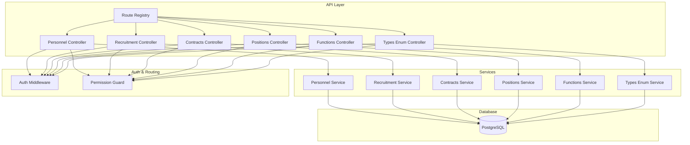
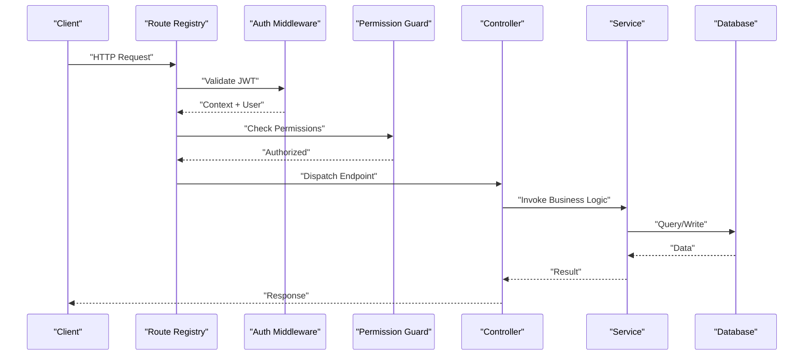
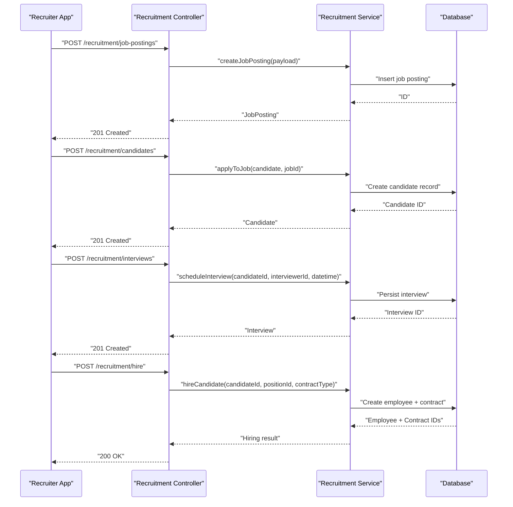
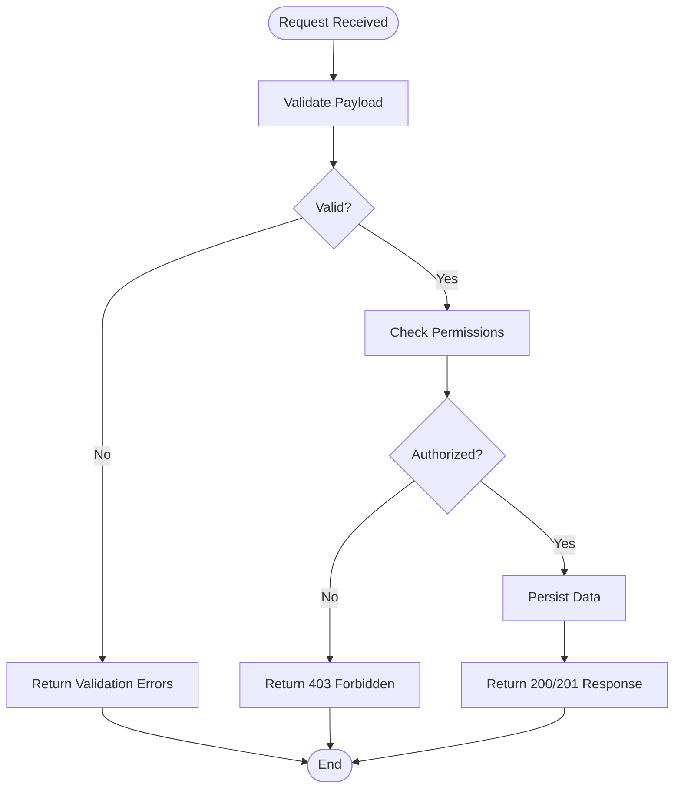
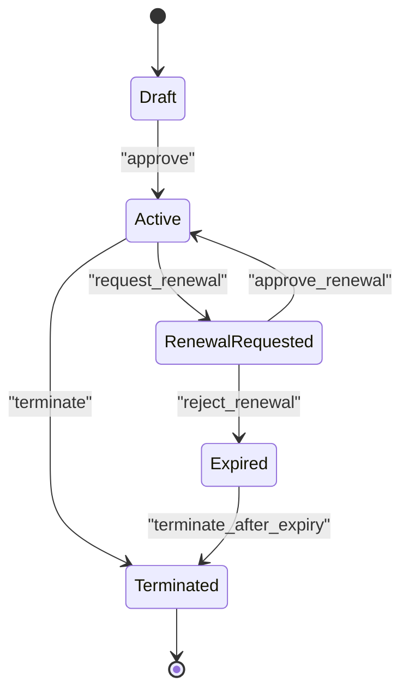
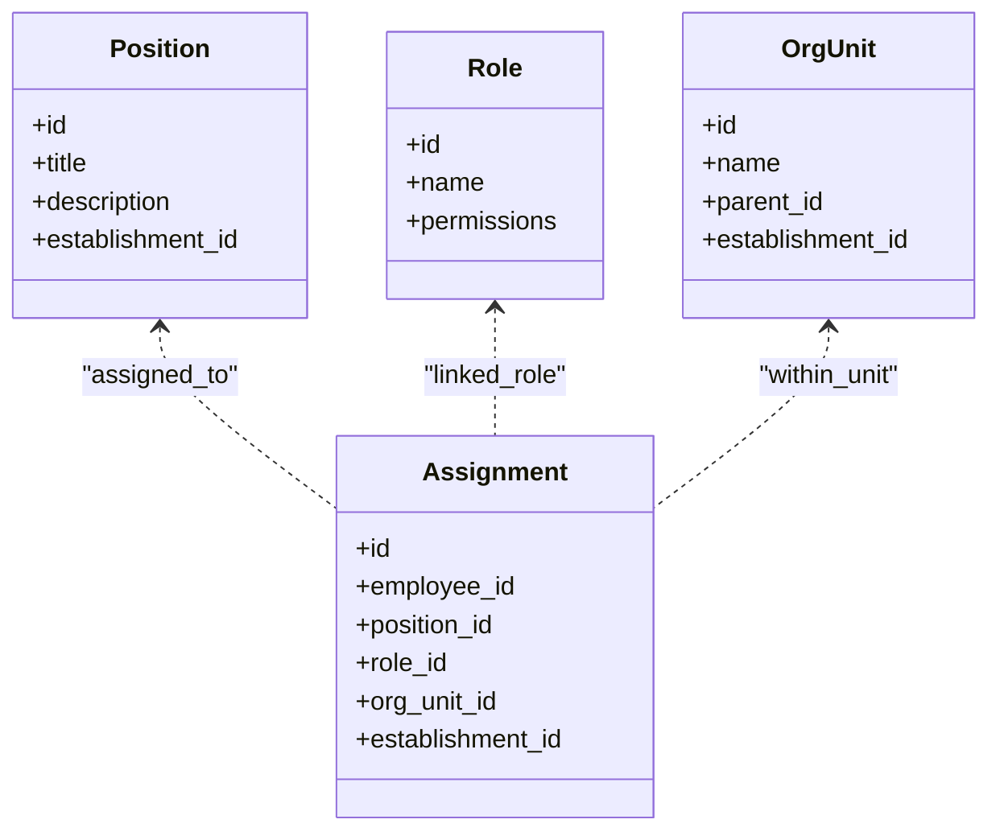
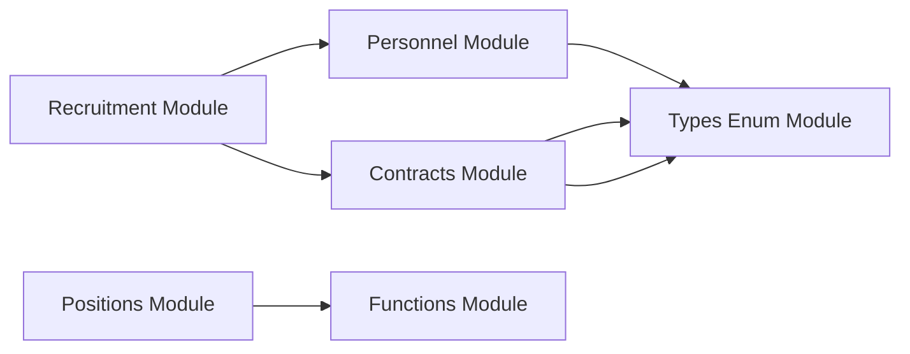

# Personnel Administration API

<cite>
**Referenced Files in This Document**
- [backend/src/modules/personnel/controllers/personnel.controller.ts](file://backend/src/modules/personnel/controllers/personnel.controller.ts)
- [backend/src/modules/personnel/services/personnel.service.ts](file://backend/src/modules/personnel/services/personnel.service.ts)
- [backend/src/modules/recrutement/controllers/recrutement.controller.ts](file://backend/src/modules/recrutement/controllers/recrutement.controller.ts)
- [backend/src/modules/recrutement/services/recrutement.service.ts](file://backend/src/modules/recrutement/services/recrutement.service.ts)
- [backend/src/modules/postes/controllers/poste.controller.ts](file://backend/src/modules/postes/controllers/poste.controller.ts)
- [backend/src/modules/postes/services/poste.service.ts](file://backend/src/modules/postes/services/poste.service.ts)
- [backend/src/modules/fonctions/controllers/fonction.controller.ts](file://backend/src/modules/fonctions/controllers/fonction.controller.ts)
- [backend/src/modules/fonctions/services/fonction.service.ts](file://backend/src/modules/fonctions/services/fonction.service.ts)
- [backend/src/modules/contrats/controllers/contrat.controller.ts](file://backend/src/modules/contrats/controllers/contrat.controller.ts)
- [backend/src/modules/contrats/services/contrat.service.ts](file://backend/src/modules/contrats/services/contrat.service.ts)
- [backend/src/modules/types-enum/controllers/types-enum.controller.ts](file://backend/src/modules/types-enum/controllers/types-enum.controller.ts)
- [backend/src/modules/types-enum/services/types-enum.service.ts](file://backend/src/modules/types-enum/services/types-enum.service.ts)
- [backend/src/modules/auth/guards/require-permission.guard.ts](file://backend/src/modules/auth/guards/require-permission.guard.ts)
- [backend/src/common/middlewares/auth.middleware.ts](file://backend/src/common/middlewares/auth.middleware.ts)
- [backend/src/routes/route-registry.ts](file://backend/src/routes/route-registry.ts)
- [backend/database/migrations/045-module-recrutement.sql](file://backend/database/migrations/045-module-recrutement.sql)
- [backend/database/migrations/016-module-personnel-rh-phase1.sql](file://backend/database/migrations/016-module-personnel-rh-phase1.sql)
- [backend/database/migrations/017-module-personnel-rh-phase2.sql] (file://backend/database/migrations/017-module-personnel-rh-phase2.sql)
- [backend/database/migrations/018-module-personnel-rh-phase3.sql](file://backend/database/migrations/018-module-personnel-rh-phase3.sql)
- [backend/database/migrations/019-module-personnel-rh-phase4.sql](file://backend/database/migrations/019-module-personnel-rh-phase4.sql)
- [backend/database/migrations/020-module-personnel-rh-phase5.sql](file://backend/database/migrations/020-module-personnel-rh-phase5.sql)
- [backend/database/migrations/046-types-contrat-personnalises.sql](file://backend/database/migrations/046-types-contrat-personnalises.sql)
</cite>

## Table of Contents
1. [Introduction](#introduction)
2. [Project Structure](#project-structure)
3. [Core Components](#core-components)
4. [Architecture Overview](#architecture-overview)
5. [Detailed Component Analysis](#detailed-component-analysis)
6. [Dependency Analysis](#dependency-analysis)
7. [Performance Considerations](#performance-considerations)
8. [Troubleshooting Guide](#troubleshooting-guide)
9. [Conclusion](#conclusion)
10. [Appendices](#appendices)

## Introduction
This document provides comprehensive API documentation for eLISAschool’s personnel administration endpoints. It covers:
- Staff recruitment workflow APIs: job postings, candidate management, interview scheduling, and hiring processes
- Employee profile management APIs: personal information, qualifications, certifications, and documents
- Contract management APIs: employment contracts, contract types, renewal workflows, and termination processes
- Position and role management APIs: positions, roles, organizational structure relationships, and employee hierarchy

It includes authentication requirements, request/response examples, error handling patterns, and diagrams to help both technical and non-technical users integrate with the system effectively.

## Project Structure
The personnel administration functionality is implemented across several modules:
- Recruitment module: manages job postings, candidates, interviews, and hiring transitions
- Personnel module: manages employee profiles, qualifications, certifications, and documents
- Contracts module: manages contracts, contract types, renewals, and terminations
- Positions and Functions modules: manage positions, roles, and organizational relationships
- Types Enum module: provides shared enumerations used across modules
- Auth and routing: provide authentication middleware and route registration

**Diagram sources**
- [backend/src/routes/route-registry.ts](file://backend/src/routes/route-registry.ts)
- [backend/src/modules/personnel/controllers/personnel.controller.ts](file://backend/src/modules/personnel/controllers/personnel.controller.ts)
- [backend/src/modules/recrutement/controllers/recrutement.controller.ts](file://backend/src/modules/recrutement/controllers/recrutement.controller.ts)
- [backend/src/modules/contrats/controllers/contrat.controller.ts](file://backend/src/modules/contrats/controllers/contrat.controller.ts)
- [backend/src/modules/postes/controllers/poste.controller.ts](file://backend/src/modules/postes/controllers/poste.controller.ts)
- [backend/src/modules/fonctions/controllers/fonction.controller.ts](file://backend/src/modules/fonctions/controllers/fonction.controller.ts)
- [backend/src/modules/types-enum/controllers/types-enum.controller.ts](file://backend/src/modules/types-enum/controllers/types-enum.controller.ts)
- [backend/src/common/middlewares/auth.middleware.ts](file://backend/src/common/middlewares/auth.middleware.ts)
- [backend/src/modules/auth/guards/require-permission.guard.ts](file://backend/src/modules/auth/guards/require-permission.guard.ts)

**Section sources**
- [backend/src/routes/route-registry.ts](file://backend/src/routes/route-registry.ts)
- [backend/src/common/middlewares/auth.middleware.ts](file://backend/src/common/middlewares/auth.middleware.ts)
- [backend/src/modules/auth/guards/require-permission.guard.ts](file://backend/src/modules/auth/guards/require-permission.guard.ts)

## Core Components
- Authentication and Authorization
  - JWT-based authentication via middleware
  - Permission-based authorization guard enforcing RBAC permissions
- Controllers
  - Personnel controller: CRUD and lifecycle operations for employees
  - Recruitment controller: job postings, candidates, interviews, hiring
  - Contracts controller: contracts, types, renewals, terminations
  - Positions controller: positions and role definitions
  - Functions controller: functional roles and organizational mapping
  - Types enum controller: shared enums for statuses and types
- Services
  - Business logic encapsulation for each domain
  - Data access orchestration and validation
- Database
  - Migrations define schema for personnel, recruitment, contracts, positions, functions, and enums

Key responsibilities:
- Enforce multi-tenant isolation by establishment context
- Validate inputs and return standardized errors
- Provide pagination and filtering where applicable
- Support file/document uploads for certifications and documents

**Section sources**
- [backend/src/modules/personnel/controllers/personnel.controller.ts](file://backend/src/modules/personnel/controllers/personnel.controller.ts)
- [backend/src/modules/recrutement/controllers/recrutement.controller.ts](file://backend/src/modules/recrutement/controllers/recrutement.controller.ts)
- [backend/src/modules/contrats/controllers/contrat.controller.ts](file://backend/src/modules/contrats/controllers/contrat.controller.ts)
- [backend/src/modules/postes/controllers/poste.controller.ts](file://backend/src/modules/postes/controllers/poste.controller.ts)
- [backend/src/modules/fonctions/controllers/fonction.controller.ts](file://backend/src/modules/fonctions/controllers/fonction.controller.ts)
- [backend/src/modules/types-enum/controllers/types-enum.controller.ts](file://backend/src/modules/types-enum/controllers/types-enum.controller.ts)
- [backend/src/common/middlewares/auth.middleware.ts](file://backend/src/common/middlewares/auth.middleware.ts)
- [backend/src/modules/auth/guards/require-permission.guard.ts](file://backend/src/modules/auth/guards/require-permission.guard.ts)

## Architecture Overview
The API follows a layered architecture:
- HTTP layer: controllers handle requests, validate payloads, and respond
- Business layer: services implement domain logic and orchestrate data access
- Persistence layer: database migrations define entities and relationships
- Security layer: auth middleware validates tokens; permission guard enforces RBAC

**Diagram sources**
- [backend/src/routes/route-registry.ts](file://backend/src/routes/route-registry.ts)
- [backend/src/common/middlewares/auth.middleware.ts](file://backend/src/common/middlewares/auth.middleware.ts)
- [backend/src/modules/auth/guards/require-permission.guard.ts](file://backend/src/modules/auth/guards/require-permission.guard.ts)

## Detailed Component Analysis

### Recruitment Workflow APIs
Covers job posting creation, candidate application, interview scheduling, and hiring conversion to employee.

- Endpoints overview
  - Job postings: create, list, update, delete, get details
  - Candidates: apply, list, update status, view details
  - Interviews: schedule, update, cancel, list
  - Hiring: convert candidate to employee, set initial contract

- Authentication and permissions
  - Requires valid JWT token
  - Requires specific permissions for each operation (e.g., recruit.post.create, recruit.candidate.update)

- Request/response patterns
  - Standardized JSON responses with success flag, data payload, and error details
  - Pagination parameters for list endpoints
  - File upload support for attachments (CVs, cover letters)

- Error handling
  - Validation errors with field-level messages
  - Conflict errors for duplicate applications or overlapping interviews
  - Not found for missing resources
  - Forbidden for insufficient permissions

**Diagram sources**
- [backend/src/modules/recrutement/controllers/recrutement.controller.ts](file://backend/src/modules/recrutement/controllers/recrutement.controller.ts)
- [backend/src/modules/recrutement/services/recrutement.service.ts](file://backend/src/modules/recrutement/services/recrutement.service.ts)
- [backend/database/migrations/045-module-recrutement.sql](file://backend/database/migrations/045-module-recrutement.sql)

**Section sources**
- [backend/src/modules/recrutement/controllers/recrutement.controller.ts](file://backend/src/modules/recrutement/controllers/recrutement.controller.ts)
- [backend/src/modules/recrutement/services/recrutement.service.ts](file://backend/src/modules/recrutement/services/recrutement.service.ts)
- [backend/database/migrations/045-module-recrutement.sql](file://backend/database/migrations/045-module-recrutement.sql)

### Employee Profile Management APIs
Covers personal information, qualifications, certifications, and document handling.

- Endpoints overview
  - Employees: create, read, update, delete, search, list with filters
  - Qualifications: add/update/remove qualifications linked to employee
  - Certifications: attach/manage certifications with validity dates
  - Documents: upload, list, download, delete employee documents

- Authentication and permissions
  - Requires valid JWT token
  - Role-based permissions (e.g., personnel.employee.read, personnel.document.upload)

- Request/response patterns
  - Structured payloads for personal info and metadata
  - Pagination and sorting for lists
  - File upload/download endpoints with secure links

- Error handling
  - Validation errors for required fields
  - Duplicate constraint violations
  - Access denied for unauthorized operations

**Diagram sources**
- [backend/src/modules/personnel/controllers/personnel.controller.ts](file://backend/src/modules/personnel/controllers/personnel.controller.ts)
- [backend/src/modules/personnel/services/personnel.service.ts](file://backend/src/modules/personnel/services/personnel.service.ts)
- [backend/database/migrations/016-module-personnel-rh-phase1.sql](file://backend/database/migrations/016-module-personnel-rh-phase1.sql)
- [backend/database/migrations/017-module-personnel-rh-phase2.sql](file://backend/database/migrations/017-module-personnel-rh-phase2.sql)
- [backend/database/migrations/018-module-personnel-rh-phase3.sql](file://backend/database/migrations/018-module-personnel-rh-phase3.sql)
- [backend/database/migrations/019-module-personnel-rh-phase4.sql](file://backend/database/migrations/019-module-personnel-rh-phase4.sql)
- [backend/database/migrations/020-module-personnel-rh-phase5.sql](file://backend/database/migrations/020-module-personnel-rh-phase5.sql)

**Section sources**
- [backend/src/modules/personnel/controllers/personnel.controller.ts](file://backend/src/modules/personnel/controllers/personnel.controller.ts)
- [backend/src/modules/personnel/services/personnel.service.ts](file://backend/src/modules/personnel/services/personnel.service.ts)
- [backend/database/migrations/016-module-personnel-rh-phase1.sql](file://backend/database/migrations/016-module-personnel-rh-phase1.sql)
- [backend/database/migrations/017-module-personnel-rh-phase2.sql](file://backend/database/migrations/017-module-personnel-rh-phase2.sql)
- [backend/database/migrations/018-module-personnel-rh-phase3.sql](file://backend/database/migrations/018-module-personnel-rh-phase3.sql)
- [backend/database/migrations/019-module-personnel-rh-phase4.sql](file://backend/database/migrations/019-module-personnel-rh-phase4.sql)
- [backend/database/migrations/020-module-personnel-rh-phase5.sql](file://backend/database/migrations/020-module-personnel-rh-phase5.sql)

### Contract Management APIs
Covers employment contracts, contract types, renewal workflows, and termination processes.

- Endpoints overview
  - Contracts: create, read, update, terminate, list
  - Contract types: manage predefined and custom types
  - Renewals: initiate renewal, approve/reject, extend dates
  - Terminations: record termination reason, effective date, final settlement references

- Authentication and permissions
  - Requires valid JWT token
  - Permissions such as contracts.contract.write, contracts.renewal.approve

- Request/response patterns
  - Structured contract objects with start/end dates, type, status
  - Renewal workflow state transitions
  - Termination records with audit trail fields

- Error handling
  - Overlap detection for active contracts
  - Invalid state transitions (e.g., terminating an already terminated contract)
  - Missing required fields for renewal approvals

**Diagram sources**
- [backend/src/modules/contrats/controllers/contrat.controller.ts](file://backend/src/modules/contrats/controllers/contrat.controller.ts)
- [backend/src/modules/contrats/services/contrat.service.ts](file://backend/src/modules/contrats/services/contrat.service.ts)
- [backend/database/migrations/046-types-contrat-personnalises.sql](file://backend/database/migrations/046-types-contrat-personnalises.sql)

**Section sources**
- [backend/src/modules/contrats/controllers/contrat.controller.ts](file://backend/src/modules/contrats/controllers/contrat.controller.ts)
- [backend/src/modules/contrats/services/contrat.service.ts](file://backend/src/modules/contrats/services/contrat.service.ts)
- [backend/database/migrations/046-types-contrat-personnalises.sql](file://backend/database/migrations/046-types-contrat-personnalises.sql)

### Position and Role Management APIs
Covers positions, roles, organizational structure relationships, and employee hierarchy.

- Endpoints overview
  - Positions: create, read, update, delete, assign to employees
  - Roles: define roles and permissions mapping
  - Organizational units: manage departments/classes and their hierarchy
  - Assignments: link employees to positions and roles within establishments

- Authentication and permissions
  - Requires valid JWT token
  - Permissions like organization.position.manage, organization.role.assign

- Request/response patterns
  - Hierarchical structures for organizational units
  - Assignment records linking employee, position, role, and establishment
  - Filtering by establishment and unit

- Error handling
  - Circular hierarchy prevention
  - Duplicate assignment constraints
  - Unauthorized cross-establishment access

**Diagram sources**
- [backend/src/modules/postes/controllers/poste.controller.ts](file://backend/src/modules/postes/controllers/poste.controller.ts)
- [backend/src/modules/postes/services/poste.service.ts](file://backend/src/modules/postes/services/poste.service.ts)
- [backend/src/modules/fonctions/controllers/fonction.controller.ts](file://backend/src/modules/fonctions/controllers/fonction.controller.ts)
- [backend/src/modules/fonctions/services/fonction.service.ts](file://backend/src/modules/fonctions/services/fonction.service.ts)

**Section sources**
- [backend/src/modules/postes/controllers/poste.controller.ts](file://backend/src/modules/postes/controllers/poste.controller.ts)
- [backend/src/modules/postes/services/poste.service.ts](file://backend/src/modules/postes/services/poste.service.ts)
- [backend/src/modules/fonctions/controllers/fonction.controller.ts](file://backend/src/modules/fonctions/controllers/fonction.controller.ts)
- [backend/src/modules/fonctions/services/fonction.service.ts](file://backend/src/modules/fonctions/services/fonction.service.ts)

### Shared Enums and Types
Provides shared enumerations for statuses, types, and options used across modules.

- Endpoints overview
  - List available enums (e.g., contract types, interview statuses, qualification levels)
  - Filterable by category and establishment-specific overrides

- Authentication and permissions
  - Read-only access typically allowed with basic personnel permissions

- Request/response patterns
  - Simple key-value pairs with labels and codes
  - Establishment-scoped values when applicable

**Section sources**
- [backend/src/modules/types-enum/controllers/types-enum.controller.ts](file://backend/src/modules/types-enum/controllers/types-enum.controller.ts)
- [backend/src/modules/types-enum/services/types-enum.service.ts](file://backend/src/modules/types-enum/services/types-enum.service.ts)

## Dependency Analysis
- Module coupling
  - Recruitment depends on Personnel and Contracts for hiring conversions
  - Contracts depend on Types Enum for contract types
  - Positions and Functions interact with Organization units and assignments
- External dependencies
  - PostgreSQL for persistence
  - JWT library for authentication
  - RBAC system for permissions

**Diagram sources**
- [backend/src/modules/recrutement/controllers/recrutement.controller.ts](file://backend/src/modules/recrutement/controllers/recrutement.controller.ts)
- [backend/src/modules/personnel/controllers/personnel.controller.ts](file://backend/src/modules/personnel/controllers/personnel.controller.ts)
- [backend/src/modules/contrats/controllers/contrat.controller.ts](file://backend/src/modules/contrats/controllers/contrat.controller.ts)
- [backend/src/modules/types-enum/controllers/types-enum.controller.ts](file://backend/src/modules/types-enum/controllers/types-enum.controller.ts)
- [backend/src/modules/postes/controllers/poste.controller.ts](file://backend/src/modules/postes/controllers/poste.controller.ts)
- [backend/src/modules/fonctions/controllers/fonction.controller.ts](file://backend/src/modules/fonctions/controllers/fonction.controller.ts)

**Section sources**
- [backend/src/modules/recrutement/controllers/recrutement.controller.ts](file://backend/src/modules/recrutement/controllers/recrutement.controller.ts)
- [backend/src/modules/personnel/controllers/personnel.controller.ts](file://backend/src/modules/personnel/controllers/personnel.controller.ts)
- [backend/src/modules/contrats/controllers/contrat.controller.ts](file://backend/src/modules/contrats/controllers/contrat.controller.ts)
- [backend/src/modules/types-enum/controllers/types-enum.controller.ts](file://backend/src/modules/types-enum/controllers/types-enum.controller.ts)
- [backend/src/modules/postes/controllers/poste.controller.ts](file://backend/src/modules/postes/controllers/poste.controller.ts)
- [backend/src/modules/fonctions/controllers/fonction.controller.ts](file://backend/src/modules/fonctions/controllers/fonction.controller.ts)

## Performance Considerations
- Use pagination and filtering for large datasets (employees, candidates, contracts)
- Index frequently queried columns (establishment_id, status, dates)
- Avoid N+1 queries by batching reads in services
- Cache static enums and configuration where appropriate
- Optimize file uploads with streaming and size limits

[No sources needed since this section provides general guidance]

## Troubleshooting Guide
Common issues and resolutions:
- Authentication failures
  - Ensure JWT token is present and not expired
  - Verify establishment context is correctly set
- Permission denied
  - Confirm user has required permissions for the endpoint
  - Check RBAC configuration and role assignments
- Validation errors
  - Review request payload for missing or invalid fields
  - Check enum values and constraints
- Conflicts
  - Duplicate applications or overlapping contracts detected
  - Resolve by updating existing records or adjusting dates
- Not found
  - Resource identifiers may be incorrect or deleted
  - Verify existence before updates/deletes

Operational checks:
- Inspect logs for stack traces and error codes
- Validate database connectivity and migration status
- Test endpoints with minimal payloads to isolate issues

**Section sources**
- [backend/src/common/middlewares/auth.middleware.ts](file://backend/src/common/middlewares/auth.middleware.ts)
- [backend/src/modules/auth/guards/require-permission.guard.ts](file://backend/src/modules/auth/guards/require-permission.guard.ts)

## Conclusion
The personnel administration APIs provide a robust foundation for managing recruitment, employee profiles, contracts, and organizational structures. With clear authentication and authorization mechanisms, structured request/response patterns, and comprehensive error handling, these endpoints enable efficient integration for HR workflows. Follow the guidelines and diagrams to implement reliable integrations and troubleshoot effectively.

[No sources needed since this section summarizes without analyzing specific files]

## Appendices

### Authentication Requirements
- Header: Authorization: Bearer <JWT_TOKEN>
- Context: establishment_id included in authenticated context
- Permissions: required per endpoint (e.g., recruit.*, personnel.*, contracts.*, organization.*)

**Section sources**
- [backend/src/common/middlewares/auth.middleware.ts](file://backend/src/common/middlewares/auth.middleware.ts)
- [backend/src/modules/auth/guards/require-permission.guard.ts](file://backend/src/modules/auth/guards/require-permission.guard.ts)

### Error Handling Patterns
- 400 Bad Request: validation errors with field details
- 401 Unauthorized: missing or invalid token
- 403 Forbidden: insufficient permissions
- 404 Not Found: resource does not exist
- 409 Conflict: duplicate or overlapping records
- 500 Internal Server Error: unexpected server issues

**Section sources**
- [backend/src/common/middlewares/auth.middleware.ts](file://backend/src/common/middlewares/auth.middleware.ts)
- [backend/src/modules/auth/guards/require-permission.guard.ts](file://backend/src/modules/auth/guards/require-permission.guard.ts)

### Example Requests and Responses
- Create job posting
  - Method: POST
  - Path: /recruitment/job-postings
  - Body: title, description, establishment_id, requirements
  - Response: 201 Created with job posting object
- Apply as candidate
  - Method: POST
  - Path: /recruitment/candidates
  - Body: candidate_info, job_posting_id, attachments
  - Response: 201 Created with candidate object
- Schedule interview
  - Method: POST
  - Path: /recruitment/interviews
  - Body: candidate_id, interviewer_id, scheduled_at, notes
  - Response: 201 Created with interview object
- Hire candidate
  - Method: POST
  - Path: /recruitment/hire
  - Body: candidate_id, position_id, contract_type_id
  - Response: 200 OK with employee and contract IDs
- Update employee profile
  - Method: PUT
  - Path: /personnel/employees/:id
  - Body: personal_info, contact_details
  - Response: 200 OK with updated employee object
- Upload certification
  - Method: POST
  - Path: /personnel/employees/:id/certifications
  - Body: name, issuer, issue_date, expiry_date, file
  - Response: 201 Created with certification object
- Create contract
  - Method: POST
  - Path: /contracts/contracts
  - Body: employee_id, type_id, start_date, end_date
  - Response: 201 Created with contract object
- Approve renewal
  - Method: POST
  - Path: /contracts/contracts/:id/renew
  - Body: new_end_date, justification
  - Response: 200 OK with updated contract
- Terminate contract
  - Method: POST
  - Path: /contracts/contracts/:id/terminate
  - Body: termination_date, reason
  - Response: 200 OK with terminated contract

[No sources needed since this section provides example patterns without analyzing specific files]