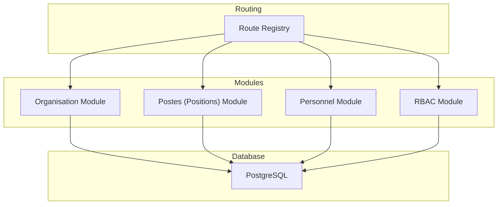
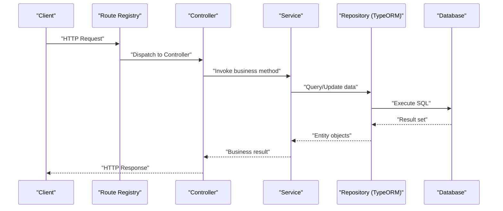
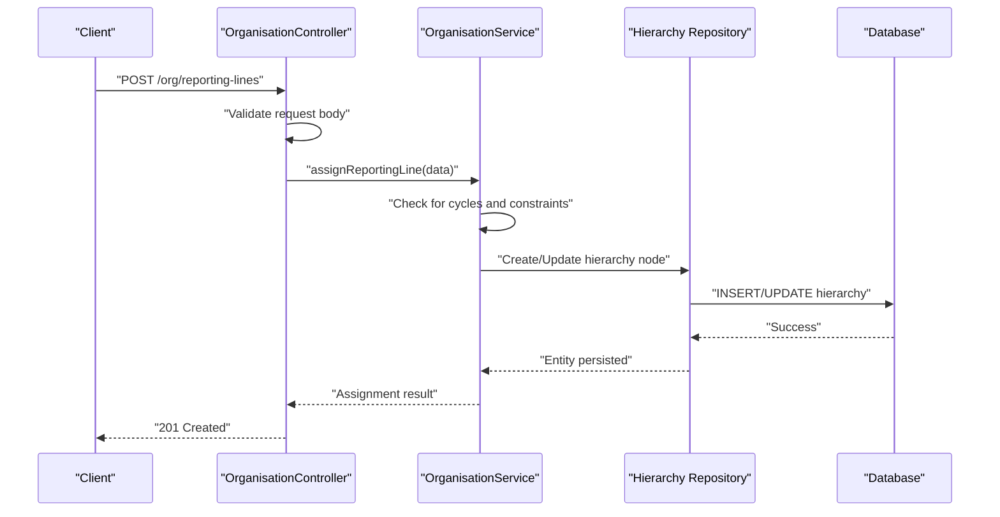
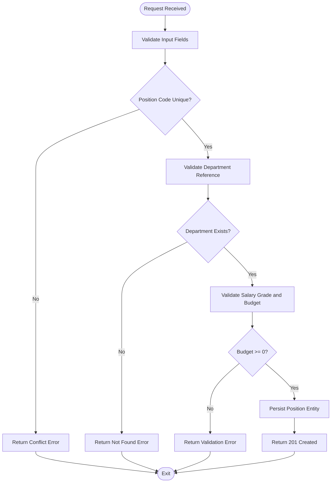
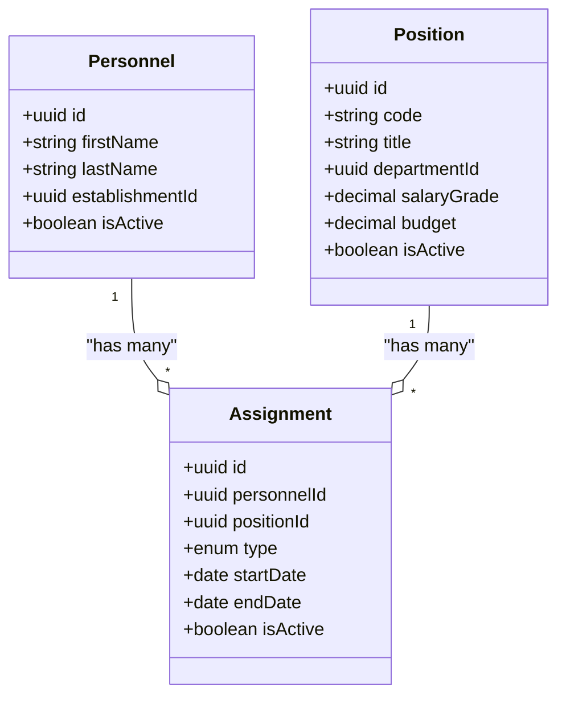
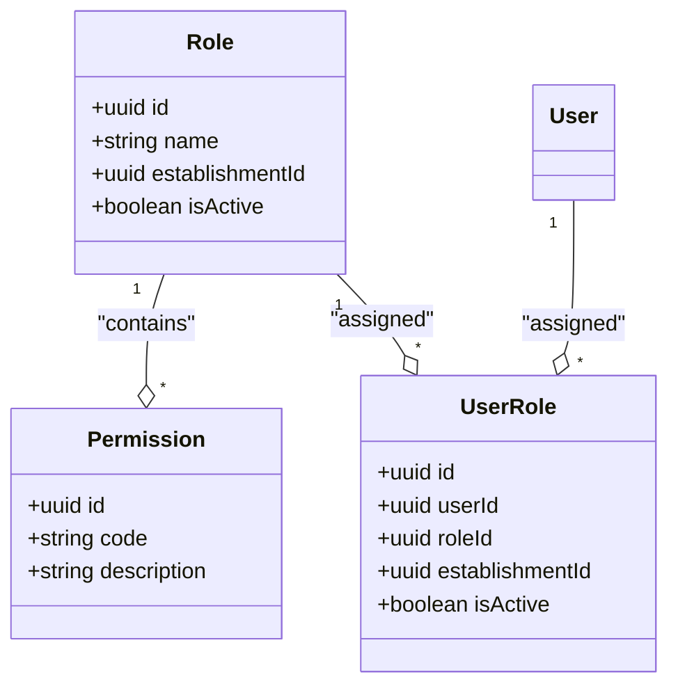
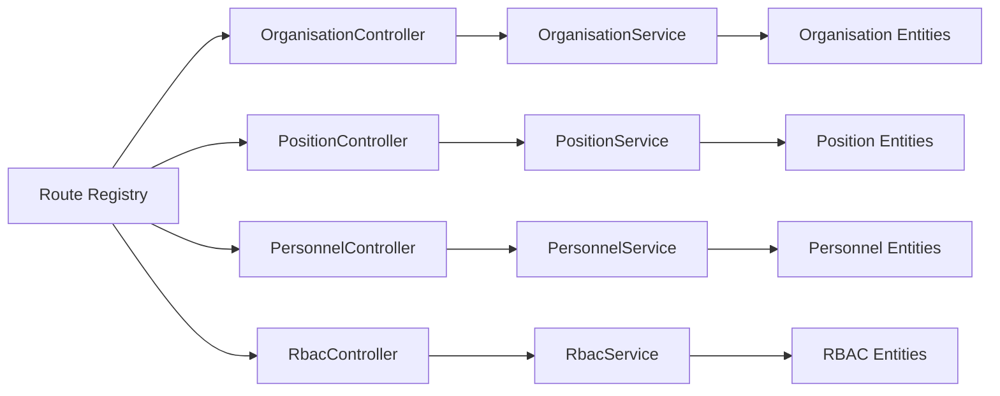

# Position & Role Management API

<cite>
**Referenced Files in This Document**
- [backend/src/modules/postes/index.ts](file://backend/src/modules/postes/index.ts)
- [backend/src/modules/postes/controllers/position.controller.ts](file://backend/src/modules/postes/controllers/position.controller.ts)
- [backend/src/modules/postes/services/position.service.ts](file://backend/src/modules/postes/services/position.service.ts)
- [backend/src/modules/postes/entities/position.entity.ts](file://backend/src/modules/postes/entities/position.entity.ts)
- [backend/src/modules/personnel/index.ts](file://backend/src/modules/personnel/index.ts)
- [backend/src/modules/personnel/controllers/personnel.controller.ts](file://backend/src/modules/personnel/controllers/personnel.controller.ts)
- [backend/src/modules/personnel/services/personnel.service.ts](file://backend/src/modules/personnel/services/personnel.service.ts)
- [backend/src/modules/personnel/entities/personnel.entity.ts](file://backend/src/modules/personnel/entities/personnel.entity.ts)
- [backend/src/modules/rbac/index.ts](file://backend/src/modules/rbac/index.ts)
- [backend/src/modules/rbac/controllers/rbac.controller.ts](file://backend/src/modules/rbac/controllers/rbac.controller.ts)
- [backend/src/modules/rbac/services/rbac.service.ts](file://backend/src/modules/rbac/services/rbac.service.ts)
- [backend/src/modules/rbac/entities/role.entity.ts](file://backend/src/modules/rbac/entities/role.entity.ts)
- [backend/src/modules/rbac/entities/permission.entity.ts](file://backend/src/modules/rbac/entities/permission.entity.ts)
- [backend/src/modules/rbac/entities/user_role.entity.ts](file://backend/src/modules/rbac/entities/user_role.entity.ts)
- [backend/src/modules/organisation/index.ts](file://backend/src/modules/organisation/index.ts)
- [backend/src/modules/organisation/controllers/organisation.controller.ts](file://backend/src/modules/organisation/controllers/organisation.controller.ts)
- [backend/src/modules/organisation/services/organisation.service.ts](file://backend/src/modules/organisation/services/organisation.service.ts)
- [backend/src/modules/organisation/entities/department.entity.ts](file://backend/src/modules/organisation/entities/department.entity.ts)
- [backend/src/modules/organisation/entities/hierarchy.entity.ts](file://backend/src/modules/organisation/entities/hierarchy.entity.ts)
- [backend/src/routes/route-registry.ts](file://backend/src/routes/route-registry.ts)
- [backend/database/migrations/016-module-personnel-rh-phase1.sql](file://backend/database/migrations/016-module-personnel-rh-phase1.sql)
- [backend/database/migrations/017-module-personnel-rh-phase2.sql](file://backend/database/migrations/017-module-personnel-rh-phase2.sql)
- [backend/database/migrations/018-module-personnel-rh-phase3.sql](file://backend/database/migrations/018-module-personnel-rh-phase3.sql)
- [backend/database/migrations/019-module-personnel-rh-phase4.sql](file://backend/database/migrations/019-module-personnel-rh-phase4.sql)
- [backend/database/migrations/020-module-personnel-rh-phase5.sql](file://backend/database/migrations/020-module-personnel-rh-phase5.sql)
- [backend/database/migrations/021-module-personnel-rh-permissions-attribution.sql](file://backend/database/migrations/021-module-personnel-rh-permissions-attribution.sql)
- [backend/database/migrations/022-module-personnel-rh-complete.sql](file://backend/database/migrations/022-module-personnel-rh-complete.sql)
- [backend/database/migrations/044-module-organisation.sql](file://backend/database/migrations/044-module-organisation.sql)
- [backend/database/migrations/045-organisation-optimisations.sql](file://backend/database/migrations/045-organisation-optimisations.sql)
- [backend/database/migrations/046-organisation-performance-avancee.sql](file://backend/database/migrations/046-organisation-performance-avancee.sql)
- [backend/database/migrations/migrate-rbac-v3.sql](file://backend/database/migrations/migrate-rbac-v3.sql)
</cite>

## Table of Contents
1. [Introduction](#introduction)
2. [Project Structure](#project-structure)
3. [Core Components](#core-components)
4. [Architecture Overview](#architecture-overview)
5. [Detailed Component Analysis](#detailed-component-analysis)
6. [Dependency Analysis](#dependency-analysis)
7. [Performance Considerations](#performance-considerations)
8. [Troubleshooting Guide](#troubleshooting-guide)
9. [Conclusion](#conclusion)
10. [Appendices](#appendices)

## Introduction
This document provides comprehensive API documentation for position and role management endpoints, including organizational structure APIs for hierarchy definition, reporting relationships, and departmental organization; position management APIs for job descriptions, responsibilities, qualifications, and salary grades; role assignment APIs for employee-position mapping, temporary assignments, and dual roles; position budgeting and headcount management; and organizational planning features. It also documents role-based permissions inheritance, access control matrices, and security implications with detailed authentication and authorization checks and data integrity constraints.

## Project Structure
The backend implements a modular architecture where each functional area is encapsulated in its own module under src/modules. The relevant modules for this documentation are:
- Organisation: Organizational units, hierarchy, and reporting relationships
- Postes (Positions): Position definitions, job descriptions, responsibilities, qualifications, and salary grades
- Personnel: Employee records and their mappings to positions
- RBAC: Roles, permissions, and user-role assignments

Routes are registered centrally and expose REST endpoints for clients.

**Diagram sources**
- [backend/src/routes/route-registry.ts](file://backend/src/routes/route-registry.ts)
- [backend/src/modules/organisation/index.ts](file://backend/src/modules/organisation/index.ts)
- [backend/src/modules/postes/index.ts](file://backend/src/modules/postes/index.ts)
- [backend/src/modules/personnel/index.ts](file://backend/src/modules/personnel/index.ts)
- [backend/src/modules/rbac/index.ts](file://backend/src/modules/rbac/index.ts)

**Section sources**
- [backend/src/routes/route-registry.ts](file://backend/src/routes/route-registry.ts)
- [backend/src/modules/organisation/index.ts](file://backend/src/modules/organisation/index.ts)
- [backend/src/modules/postes/index.ts](file://backend/src/modules/postes/index.ts)
- [backend/src/modules/personnel/index.ts](file://backend/src/modules/personnel/index.ts)
- [backend/src/modules/rbac/index.ts](file://backend/src/modules/rbac/index.ts)

## Core Components
- Organisation Controller and Service: Provide endpoints for departments, hierarchy nodes, and reporting lines.
- Positions Controller and Service: Manage position definitions, job descriptions, responsibilities, qualifications, and salary grades.
- Personnel Controller and Service: Handle employee records and their mappings to positions, including temporary assignments and dual roles.
- RBAC Controller and Service: Manage roles, permissions, and user-role assignments, enabling permission inheritance and access control.

Key responsibilities:
- Data validation and business rule enforcement
- Authorization checks using RBAC
- Database operations via TypeORM entities
- Consistent error responses and audit trails

**Section sources**
- [backend/src/modules/organisation/controllers/organisation.controller.ts](file://backend/src/modules/organisation/controllers/organisation.controller.ts)
- [backend/src/modules/organisation/services/organisation.service.ts](file://backend/src/modules/organisation/services/organisation.service.ts)
- [backend/src/modules/postes/controllers/position.controller.ts](file://backend/src/modules/postes/controllers/position.controller.ts)
- [backend/src/modules/postes/services/position.service.ts](file://backend/src/modules/postes/services/position.service.ts)
- [backend/src/modules/personnel/controllers/personnel.controller.ts](file://backend/src/modules/personnel/controllers/personnel.controller.ts)
- [backend/src/modules/personnel/services/personnel.service.ts](file://backend/src/modules/personnel/services/personnel.service.ts)
- [backend/src/modules/rbac/controllers/rbac.controller.ts](file://backend/src/modules/rbac/controllers/rbac.controller.ts)
- [backend/src/modules/rbac/services/rbac.service.ts](file://backend/src/modules/rbac/services/rbac.service.ts)

## Architecture Overview
The system follows a layered architecture:
- Controllers handle HTTP requests, validate inputs, and delegate to services
- Services implement business logic, enforce rules, and interact with repositories
- Entities represent database tables and relationships
- Route registry wires controllers to routes
- RBAC middleware enforces authorization based on roles and permissions

**Diagram sources**
- [backend/src/routes/route-registry.ts](file://backend/src/routes/route-registry.ts)
- [backend/src/modules/postes/controllers/position.controller.ts](file://backend/src/modules/postes/controllers/position.controller.ts)
- [backend/src/modules/postes/services/position.service.ts](file://backend/src/modules/postes/services/position.service.ts)
- [backend/src/modules/postes/entities/position.entity.ts](file://backend/src/modules/postes/entities/position.entity.ts)

## Detailed Component Analysis

### Organisational Structure APIs
Endpoints for defining departments, hierarchy nodes, and reporting relationships. Typical operations include:
- Create, update, delete departments
- Define hierarchy levels and parent-child relationships
- Assign reporting lines between positions or departments
- Query organizational charts and reporting trees

Security and authorization:
- Require authenticated session
- Enforce role-based permissions such as org.admin or org.manager
- Validate multi-tenant isolation by establishment context

Data integrity constraints:
- Prevent circular hierarchies
- Ensure unique department identifiers per establishment
- Enforce referential integrity for parent-child relationships

**Section sources**
- [backend/src/modules/organisation/controllers/organisation.controller.ts](file://backend/src/modules/organisation/controllers/organisation.controller.ts)
- [backend/src/modules/organisation/services/organisation.service.ts](file://backend/src/modules/organisation/services/organisation.service.ts)
- [backend/src/modules/organisation/entities/department.entity.ts](file://backend/src/modules/organisation/entities/department.entity.ts)
- [backend/src/modules/organisation/entities/hierarchy.entity.ts](file://backend/src/modules/organisation/entities/hierarchy.entity.ts)
- [backend/database/migrations/044-module-organisation.sql](file://backend/database/migrations/044-module-organisation.sql)
- [backend/database/migrations/045-organisation-optimisations.sql](file://backend/database/migrations/045-organisation-optimisations.sql)
- [backend/database/migrations/046-organisation-performance-avancee.sql](file://backend/database/migrations/046-organisation-performance-avancee.sql)

#### Sequence Diagram: Reporting Relationship Assignment

**Diagram sources**
- [backend/src/modules/organisation/controllers/organisation.controller.ts](file://backend/src/modules/organisation/controllers/organisation.controller.ts)
- [backend/src/modules/organisation/services/organisation.service.ts](file://backend/src/modules/organisation/services/organisation.service.ts)
- [backend/src/modules/organisation/entities/hierarchy.entity.ts](file://backend/src/modules/organisation/entities/hierarchy.entity.ts)

### Position Management APIs
Endpoints for managing positions, including job descriptions, responsibilities, qualifications, and salary grades. Typical operations include:
- Create, update, deactivate positions
- Attach job descriptions and responsibilities
- Define qualification requirements
- Set salary grades and budgets
- Query positions by department or hierarchy level

Security and authorization:
- Require authenticated session
- Enforce role-based permissions such as hr.position.admin or hr.position.editor
- Validate establishment scoping

Data integrity constraints:
- Unique position codes per establishment
- Valid references to departments and salary grades
- Budget and headcount consistency checks

**Section sources**
- [backend/src/modules/postes/controllers/position.controller.ts](file://backend/src/modules/postes/controllers/position.controller.ts)
- [backend/src/modules/postes/services/position.service.ts](file://backend/src/modules/postes/services/position.service.ts)
- [backend/src/modules/postes/entities/position.entity.ts](file://backend/src/modules/postes/entities/position.entity.ts)
- [backend/database/migrations/016-module-personnel-rh-phase1.sql](file://backend/database/migrations/016-module-personnel-rh-phase1.sql)
- [backend/database/migrations/017-module-personnel-rh-phase2.sql](file://backend/database/migrations/017-module-personnel-rh-phase2.sql)
- [backend/database/migrations/018-module-personnel-rh-phase3.sql](file://backend/database/migrations/018-module-personnel-rh-phase3.sql)
- [backend/database/migrations/019-module-personnel-rh-phase4.sql](file://backend/database/migrations/019-module-personnel-rh-phase4.sql)
- [backend/database/migrations/020-module-personnel-rh-phase5.sql](file://backend/database/migrations/020-module-personnel-rh-phase5.sql)

#### Flowchart: Position Creation and Validation

**Diagram sources**
- [backend/src/modules/postes/controllers/position.controller.ts](file://backend/src/modules/postes/controllers/position.controller.ts)
- [backend/src/modules/postes/services/position.service.ts](file://backend/src/modules/postes/services/position.service.ts)
- [backend/src/modules/postes/entities/position.entity.ts](file://backend/src/modules/postes/entities/position.entity.ts)

### Role Assignment and Employee-Position Mapping
Endpoints for assigning employees to positions, supporting temporary assignments and dual roles. Typical operations include:
- Map an employee to one or multiple positions
- Define assignment type (permanent, temporary)
- Set effective dates and end dates for temporary assignments
- Query active assignments and historical mappings

Security and authorization:
- Require authenticated session
- Enforce role-based permissions such as hr.assignment.admin or hr.assignment.editor
- Validate establishment scoping and prevent cross-establishment assignments

Data integrity constraints:
- Ensure employee exists within the same establishment
- Prevent overlapping temporary assignments unless explicitly allowed
- Maintain referential integrity with position and personnel entities

**Section sources**
- [backend/src/modules/personnel/controllers/personnel.controller.ts](file://backend/src/modules/personnel/controllers/personnel.controller.ts)
- [backend/src/modules/personnel/services/personnel.service.ts](file://backend/src/modules/personnel/services/personnel.service.ts)
- [backend/src/modules/personnel/entities/personnel.entity.ts](file://backend/src/modules/personnel/entities/personnel.entity.ts)
- [backend/database/migrations/021-module-personnel-rh-permissions-attribution.sql](file://backend/database/migrations/021-module-personnel-rh-permissions-attribution.sql)
- [backend/database/migrations/022-module-personnel-rh-complete.sql](file://backend/database/migrations/022-module-personnel-rh-complete.sql)

#### Class Diagram: Personnel and Position Entities

**Diagram sources**
- [backend/src/modules/personnel/entities/personnel.entity.ts](file://backend/src/modules/personnel/entities/personnel.entity.ts)
- [backend/src/modules/postes/entities/position.entity.ts](file://backend/src/modules/postes/entities/position.entity.ts)

### Position Budgeting and Headcount Management
Features for tracking position budgets and headcount planning:
- Aggregate headcount by department and position
- Monitor budget utilization against planned allocations
- Generate reports for organizational planning and forecasting

Security and authorization:
- Require authenticated session
- Enforce role-based permissions such as hr.budget.admin or hr.planning.viewer
- Validate establishment scoping for financial data

Data integrity constraints:
- Ensure budget figures are non-negative
- Maintain consistent aggregation across hierarchical structures

**Section sources**
- [backend/src/modules/postes/services/position.service.ts](file://backend/src/modules/postes/services/position.service.ts)
- [backend/src/modules/organisation/services/organisation.service.ts](file://backend/src/modules/organisation/services/organisation.service.ts)

### Role-Based Permissions Inheritance and Access Control
RBAC model supports roles, permissions, and user-role assignments with inheritance:
- Roles define sets of permissions
- Users can be assigned multiple roles
- Permissions can be inherited through role hierarchies
- Access control matrices map roles to resource actions

Security and authorization:
- All protected endpoints require valid authentication token
- Authorization checks verify required permissions before processing requests
- Multi-tenant isolation ensures users only access data within their establishment scope

Data integrity constraints:
- Unique role names per establishment
- Permission codes must be well-formed and referenced consistently
- User-role assignments validated against existing roles and users

**Section sources**
- [backend/src/modules/rbac/controllers/rbac.controller.ts](file://backend/src/modules/rbac/controllers/rbac.controller.ts)
- [backend/src/modules/rbac/services/rbac.service.ts](file://backend/src/modules/rbac/services/rbac.service.ts)
- [backend/src/modules/rbac/entities/role.entity.ts](file://backend/src/modules/rbac/entities/role.entity.ts)
- [backend/src/modules/rbac/entities/permission.entity.ts](file://backend/src/modules/rbac/entities/permission.entity.ts)
- [backend/src/modules/rbac/entities/user_role.entity.ts](file://backend/src/modules/rbac/entities/user_role.entity.ts)
- [backend/database/migrations/migrate-rbac-v3.sql](file://backend/database/migrations/migrate-rbac-v3.sql)

#### Class Diagram: RBAC Model

**Diagram sources**
- [backend/src/modules/rbac/entities/role.entity.ts](file://backend/src/modules/rbac/entities/role.entity.ts)
- [backend/src/modules/rbac/entities/permission.entity.ts](file://backend/src/modules/rbac/entities/permission.entity.ts)
- [backend/src/modules/rbac/entities/user_role.entity.ts](file://backend/src/modules/rbac/entities/user_role.entity.ts)

## Dependency Analysis
Module dependencies and interactions:
- Controllers depend on services for business logic
- Services depend on repositories and entities for data access
- RBAC service is used by controllers to enforce authorization
- Organisation and Postes modules may reference Personnel for assignment-related queries

**Diagram sources**
- [backend/src/routes/route-registry.ts](file://backend/src/routes/route-registry.ts)
- [backend/src/modules/organisation/controllers/organisation.controller.ts](file://backend/src/modules/organisation/controllers/organisation.controller.ts)
- [backend/src/modules/postes/controllers/position.controller.ts](file://backend/src/modules/postes/controllers/position.controller.ts)
- [backend/src/modules/personnel/controllers/personnel.controller.ts](file://backend/src/modules/personnel/controllers/personnel.controller.ts)
- [backend/src/modules/rbac/controllers/rbac.controller.ts](file://backend/src/modules/rbac/controllers/rbac.controller.ts)

**Section sources**
- [backend/src/routes/route-registry.ts](file://backend/src/routes/route-registry.ts)
- [backend/src/modules/organisation/controllers/organisation.controller.ts](file://backend/src/modules/organisation/controllers/organisation.controller.ts)
- [backend/src/modules/postes/controllers/position.controller.ts](file://backend/src/modules/postes/controllers/position.controller.ts)
- [backend/src/modules/personnel/controllers/personnel.controller.ts](file://backend/src/modules/personnel/controllers/personnel.controller.ts)
- [backend/src/modules/rbac/controllers/rbac.controller.ts](file://backend/src/modules/rbac/controllers/rbac.controller.ts)

## Performance Considerations
- Use pagination for large lists of positions, personnel, and assignments
- Index frequently queried fields such as establishmentId, departmentId, and positionCode
- Avoid N+1 queries by eager loading related entities when necessary
- Cache organizational charts and role-permission matrices for read-heavy scenarios
- Monitor database performance with slow query logs and optimize heavy aggregations

[No sources needed since this section provides general guidance]

## Troubleshooting Guide
Common issues and resolutions:
- Authentication failures: Verify JWT token validity and expiration handling
- Authorization errors: Confirm user has required permissions for the requested action
- Circular hierarchy detection: Ensure no loops exist when assigning reporting lines
- Duplicate position codes: Check uniqueness constraints per establishment
- Overlapping assignments: Validate date ranges for temporary assignments
- Multi-tenant violations: Ensure all queries are scoped to the current establishment

**Section sources**
- [backend/src/modules/organisation/services/organisation.service.ts](file://backend/src/modules/organisation/services/organisation.service.ts)
- [backend/src/modules/postes/services/position.service.ts](file://backend/src/modules/postes/services/position.service.ts)
- [backend/src/modules/personnel/services/personnel.service.ts](file://backend/src/modules/personnel/services/personnel.service.ts)
- [backend/src/modules/rbac/services/rbac.service.ts](file://backend/src/modules/rbac/services/rbac.service.ts)

## Conclusion
The Position & Role Management API provides robust capabilities for organizing staff, defining positions, assigning roles, and enforcing security policies. By leveraging RBAC, clear data models, and well-defined endpoints, the system supports complex organizational structures while maintaining data integrity and performance.

[No sources needed since this section summarizes without analyzing specific files]

## Appendices

### API Endpoint Summary
- Organisation: Departments, hierarchy, reporting lines
- Positions: Job descriptions, responsibilities, qualifications, salary grades
- Personnel: Employee records, position assignments, temporary/dual roles
- RBAC: Roles, permissions, user-role assignments

For exact endpoint paths and request/response schemas, consult the route registry and controller implementations.

**Section sources**
- [backend/src/routes/route-registry.ts](file://backend/src/routes/route-registry.ts)
- [backend/src/modules/organisation/controllers/organisation.controller.ts](file://backend/src/modules/organisation/controllers/organisation.controller.ts)
- [backend/src/modules/postes/controllers/position.controller.ts](file://backend/src/modules/postes/controllers/position.controller.ts)
- [backend/src/modules/personnel/controllers/personnel.controller.ts](file://backend/src/modules/personnel/controllers/personnel.controller.ts)
- [backend/src/modules/rbac/controllers/rbac.controller.ts](file://backend/src/modules/rbac/controllers/rbac.controller.ts)