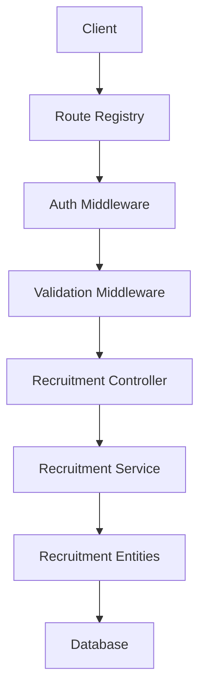
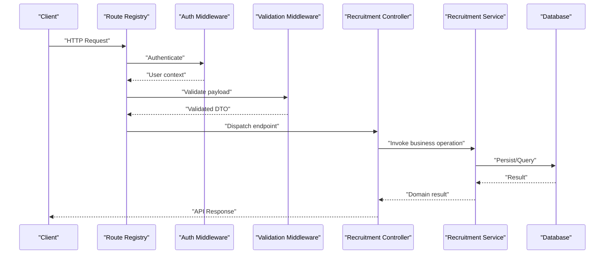
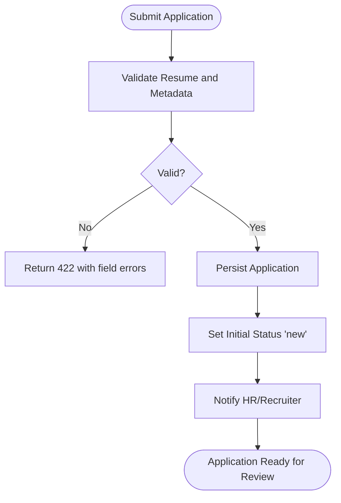
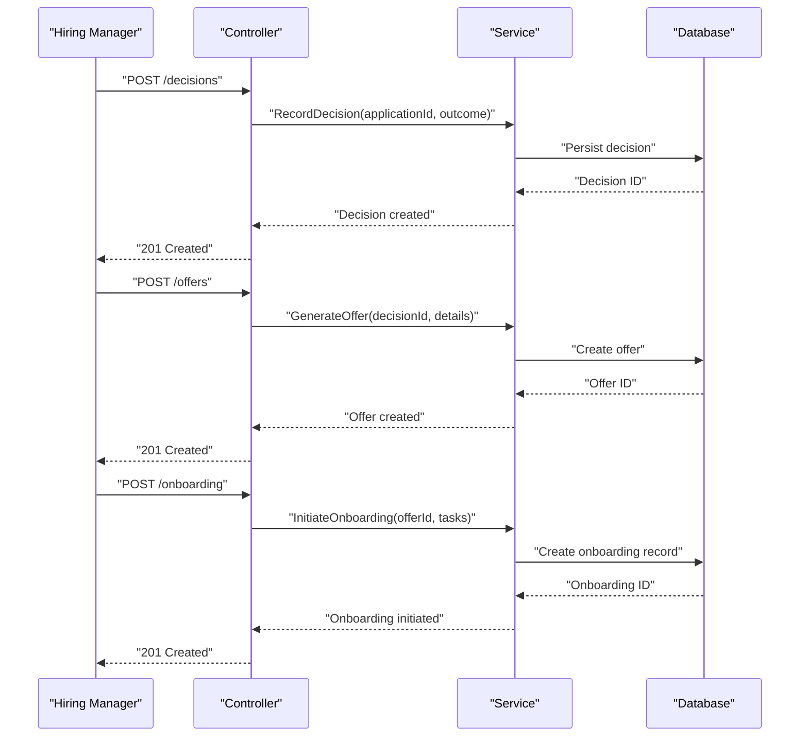
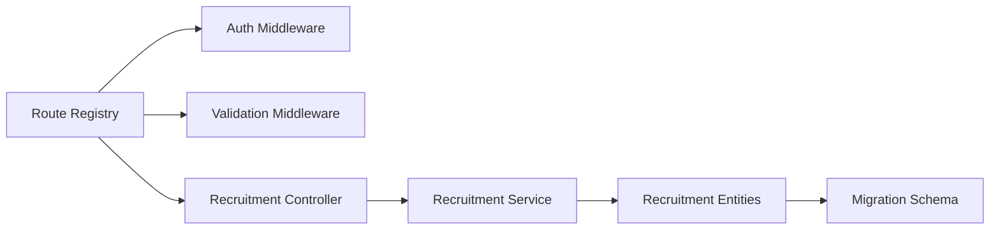

# Recruitment Workflow API

<cite>
**Referenced Files in This Document**
- [045-module-recrutement.sql](file://backend/database/migrations/045-module-recrutement.sql)
- [recruitment.controller.ts](file://backend/src/modules/recrutement/controllers/recruitment.controller.ts)
- [recruitment.service.ts](file://backend/src/modules/recrutement/services/recruitment.service.ts)
- [recruitment.entity.ts](file://backend/src/modules/recrutement/entities/recruitment.entity.ts)
- [route-registry.ts](file://backend/src/routes/route-registry.ts)
- [auth.middleware.ts](file://backend/src/common/middlewares/auth.middleware.ts)
- [validation.middleware.ts](file://backend/src/common/middlewares/validation.middleware.ts)
- [error.handler.ts](file://backend/src/common/filters/error.handler.ts)
</cite>

## Table of Contents
1. [Introduction](#introduction)
2. [Project Structure](#project-structure)
3. [Core Components](#core-components)
4. [Architecture Overview](#architecture-overview)
5. [Detailed Component Analysis](#detailed-component-analysis)
6. [Dependency Analysis](#dependency-analysis)
7. [Performance Considerations](#performance-considerations)
8. [Troubleshooting Guide](#troubleshooting-guide)
9. [Conclusion](#conclusion)

## Introduction
This document provides comprehensive API documentation for eLISAschool’s recruitment workflow. It covers:
- Job posting management (create, modify, publish)
- Candidate application processing (resume submission, tracking, status management)
- Interview scheduling (calendar integration, participant coordination, feedback collection)
- Hiring decision workflows (offer letter generation, onboarding initiation)

It includes authentication requirements, validation rules, request/response examples, and error handling patterns specific to recruitment operations.

## Project Structure
The recruitment module is implemented under the backend modules directory with a standard layered architecture: controllers handle HTTP endpoints, services encapsulate business logic, and entities define data models. Routes are registered centrally, and cross-cutting concerns like authentication, validation, and error handling are applied via middlewares and filters.

**Diagram sources**
- [route-registry.ts](file://backend/src/routes/route-registry.ts)
- [auth.middleware.ts](file://backend/src/common/middlewares/auth.middleware.ts)
- [validation.middleware.ts](file://backend/src/common/middlewares/validation.middleware.ts)
- [recruitment.controller.ts](file://backend/src/modules/recrutement/controllers/recruitment.controller.ts)
- [recruitment.service.ts](file://backend/src/modules/recrutement/services/recruitment.service.ts)
- [recruitment.entity.ts](file://backend/src/modules/recrutement/entities/recruitment.entity.ts)

**Section sources**
- [route-registry.ts](file://backend/src/routes/route-registry.ts)
- [auth.middleware.ts](file://backend/src/common/middlewares/auth.middleware.ts)
- [validation.middleware.ts](file://backend/src/common/middlewares/validation.middleware.ts)
- [recruitment.controller.ts](file://backend/src/modules/recrutement/controllers/recruitment.controller.ts)
- [recruitment.service.ts](file://backend/src/modules/recrutement/services/recruitment.service.ts)
- [recruitment.entity.ts](file://backend/src/modules/recrutement/entities/recruitment.entity.ts)

## Core Components
- Controllers: Expose REST endpoints for job postings, applications, interviews, hiring decisions, offers, and onboarding.
- Services: Implement business rules, orchestrate multi-step workflows, and interact with persistence.
- Entities: Define database schema for recruitment objects such as positions, applications, interviews, decisions, offers, and onboarding records.
- Middlewares: Enforce authentication and validate payloads before reaching controllers.
- Error Handling: Centralized filter returns consistent error responses.

Key responsibilities:
- Job Posting Management: Create, update, publish/unpublish positions; manage metadata and visibility.
- Application Processing: Accept resumes, track lifecycle, transition statuses, and store attachments.
- Interview Scheduling: Coordinate participants, integrate with calendars, collect feedback.
- Hiring Decisions: Record evaluations, approvals, and outcomes.
- Offers and Onboarding: Generate offer letters and initiate onboarding tasks.

**Section sources**
- [recruitment.controller.ts](file://backend/src/modules/recrutement/controllers/recruitment.controller.ts)
- [recruitment.service.ts](file://backend/src/modules/recrutement/services/recruitment.service.ts)
- [recruitment.entity.ts](file://backend/src/modules/recrutement/entities/recruitment.entity.ts)
- [auth.middleware.ts](file://backend/src/common/middlewares/auth.middleware.ts)
- [validation.middleware.ts](file://backend/src/common/middlewares/validation.middleware.ts)
- [error.handler.ts](file://backend/src/common/filters/error.handler.ts)

## Architecture Overview
The recruitment API follows a layered design with clear separation of concerns. Authentication and validation are enforced globally before requests reach the controller layer. The service layer coordinates domain logic and persists data through entities mapped to the database.

**Diagram sources**
- [route-registry.ts](file://backend/src/routes/route-registry.ts)
- [auth.middleware.ts](file://backend/src/common/middlewares/auth.middleware.ts)
- [validation.middleware.ts](file://backend/src/common/middlewares/validation.middleware.ts)
- [recruitment.controller.ts](file://backend/src/modules/recrutement/controllers/recruitment.controller.ts)
- [recruitment.service.ts](file://backend/src/modules/recrutement/services/recruitment.service.ts)
- [recruitment.entity.ts](file://backend/src/modules/recrutement/entities/recruitment.entity.ts)

## Detailed Component Analysis

### Job Posting Management APIs
Endpoints:
- POST /api/recruitment/positions: Create a new position
- PUT /api/recruitment/positions/:id: Update an existing position
- PATCH /api/recruitment/positions/:id/publish: Publish or unpublish a position
- GET /api/recruitment/positions: List positions with filters
- GET /api/recruitment/positions/:id: Retrieve a single position

Authentication:
- Requires valid JWT token with appropriate permissions.
- Authorization checks ensure only authorized roles can create/update/publish positions.

Validation Rules:
- Title, description, department, location, employment type, and status fields are validated.
- Dates must be logically ordered (start date before end date if applicable).
- Required attachments (e.g., job description file) must meet size and format constraints.

Request Examples:
- Create Position
  - Method: POST
  - Path: /api/recruitment/positions
  - Headers: Authorization: Bearer <token>, Content-Type: multipart/form-data
  - Body: FormData with JSON part containing position details and optional files
- Update Position
  - Method: PUT
  - Path: /api/recruitment/positions/:id
  - Headers: Authorization: Bearer <token>, Content-Type: application/json
  - Body: JSON object with updated fields
- Publish/Unpublish
  - Method: PATCH
  - Path: /api/recruitment/positions/:id/publish
  - Headers: Authorization: Bearer <token>, Content-Type: application/json
  - Body: { "published": true }

Response Examples:
- Success: 201 Created or 200 OK with position entity
- Validation Error: 422 Unprocessable Entity with field-level errors
- Unauthorized: 401 Unauthorized
- Forbidden: 403 Forbidden
- Not Found: 404 Not Found

Error Handling Patterns:
- Consistent error envelope with code, message, and details
- Field-specific validation messages for client-side correction

**Section sources**
- [recruitment.controller.ts](file://backend/src/modules/recrutement/controllers/recruitment.controller.ts)
- [recruitment.service.ts](file://backend/src/modules/recrutement/services/recruitment.service.ts)
- [recruitment.entity.ts](file://backend/src/modules/recrutement/entities/recruitment.entity.ts)
- [auth.middleware.ts](file://backend/src/common/middlewares/auth.middleware.ts)
- [validation.middleware.ts](file://backend/src/common/middlewares/validation.middleware.ts)
- [error.handler.ts](file://backend/src/common/filters/error.handler.ts)

### Candidate Application Processing APIs
Endpoints:
- POST /api/recruitment/applications: Submit a new application with resume
- GET /api/recruitment/applications: List applications with filters (positionId, status, candidateId)
- GET /api/recruitment/applications/:id: Retrieve application details
- PUT /api/recruitment/applications/:id/status: Update application status
- DELETE /api/recruitment/applications/:id: Withdraw or delete application

Authentication:
- Candidates submit applications using their own tokens.
- HR/Admin users require elevated permissions to view/update all applications.

Validation Rules:
- Resume file required; supported formats include PDF, DOCX; max size enforced.
- Status transitions are constrained by workflow (e.g., New -> Under Review -> Interview -> Decision).
- Duplicate applications per position may be prevented.

Request Examples:
- Submit Application
  - Method: POST
  - Path: /api/recruitment/applications
  - Headers: Authorization: Bearer <token>, Content-Type: multipart/form-data
  - Body: FormData with resume file and optional cover letter
- Update Status
  - Method: PUT
  - Path: /api/recruitment/applications/:id/status
  - Headers: Authorization: Bearer <token>, Content-Type: application/json
  - Body: { "status": "under_review" }

Response Examples:
- Success: 201 Created or 200 OK with application entity
- Conflict: 409 Conflict for duplicate submissions
- Validation Error: 422 Unprocessable Entity
- Unauthorized/Forbidden: 401/403
- Not Found: 404

Workflow Flowchart:

**Diagram sources**
- [recruitment.controller.ts](file://backend/src/modules/recrutement/controllers/recruitment.controller.ts)
- [recruitment.service.ts](file://backend/src/modules/recrutement/services/recruitment.service.ts)
- [recruitment.entity.ts](file://backend/src/modules/recrutement/entities/recruitment.entity.ts)

**Section sources**
- [recruitment.controller.ts](file://backend/src/modules/recrutement/controllers/recruitment.controller.ts)
- [recruitment.service.ts](file://backend/src/modules/recrutement/services/recruitment.service.ts)
- [recruitment.entity.ts](file://backend/src/modules/recrutement/entities/recruitment.entity.ts)
- [auth.middleware.ts](file://backend/src/common/middlewares/auth.middleware.ts)
- [validation.middleware.ts](file://backend/src/common/middlewares/validation.middleware.ts)
- [error.handler.ts](file://backend/src/common/filters/error.handler.ts)

### Interview Scheduling APIs
Endpoints:
- POST /api/recruitment/interviews: Schedule an interview
- GET /api/recruitment/interviews: List interviews with filters (applicationId, interviewerId, date range)
- GET /api/recruitment/interviews/:id: Retrieve interview details
- PUT /api/recruitment/interviews/:id: Update schedule or participants
- DELETE /api/recruitment/interviews/:id: Cancel interview
- POST /api/recruitment/interviews/:id/feedback: Submit feedback

Authentication:
- Candidates can view their scheduled interviews.
- Interviewers and HR/Admin can schedule/update/cancel interviews.

Validation Rules:
- Date/time must be in the future and not conflicting with existing schedules.
- Participants list must include at least one interviewer and the candidate.
- Feedback requires rating and comments within allowed ranges.

Request Examples:
- Schedule Interview
  - Method: POST
  - Path: /api/recruitment/interviews
  - Headers: Authorization: Bearer <token>, Content-Type: application/json
  - Body: { "applicationId": "...", "scheduledAt": "ISO datetime", "participants": ["candidateId", "interviewerId"], "locationOrLink": "..." }
- Submit Feedback
  - Method: POST
  - Path: /api/recruitment/interviews/:id/feedback
  - Headers: Authorization: Bearer <token>, Content-Type: application/json
  - Body: { "rating": 4, "comments": "Strong technical skills" }

Response Examples:
- Success: 201 Created or 200 OK with interview entity
- Conflict: 409 Conflict for scheduling conflicts
- Validation Error: 422 Unprocessable Entity
- Unauthorized/Forbidden: 401/403
- Not Found: 404

Calendar Integration Notes:
- Calendar invites are generated upon successful scheduling.
- Updates propagate to calendar events automatically.

**Section sources**
- [recruitment.controller.ts](file://backend/src/modules/recrutement/controllers/recruitment.controller.ts)
- [recruitment.service.ts](file://backend/src/modules/recrutement/services/recruitment.service.ts)
- [recruitment.entity.ts](file://backend/src/modules/recrutement/entities/recruitment.entity.ts)
- [auth.middleware.ts](file://backend/src/common/middlewares/auth.middleware.ts)
- [validation.middleware.ts](file://backend/src/common/middlewares/validation.middleware.ts)
- [error.handler.ts](file://backend/src/common/filters/error.handler.ts)

### Hiring Decision Workflows, Offer Letter Generation, and Onboarding Initiation
Endpoints:
- POST /api/recruitment/decisions: Record hiring decision
- GET /api/recruitment/decisions: List decisions with filters
- GET /api/recruitment/decisions/:id: Retrieve decision details
- POST /api/recruitment/offers: Generate and send offer letter
- GET /api/recruitment/offers: List offers
- GET /api/recruitment/offers/:id: Retrieve offer details
- POST /api/recruitment/onboarding: Initiate onboarding process
- GET /api/recruitment/onboarding: List onboarding records
- GET /api/recruitment/onboarding/:id: Retrieve onboarding details

Authentication:
- Hiring managers and HR/Admin can record decisions and generate offers.
- Candidates can view their offers and onboarding status.

Validation Rules:
- Decision must reference a valid application and include outcome (hire/reject/hold).
- Offer letter requires compensation details, start date, and terms acceptance flag.
- Onboarding initiation requires selected offer and assigns initial tasks.

Request Examples:
- Record Decision
  - Method: POST
  - Path: /api/recruitment/decisions
  - Headers: Authorization: Bearer <token>, Content-Type: application/json
  - Body: { "applicationId": "...", "outcome": "hire", "notes": "..." }
- Generate Offer
  - Method: POST
  - Path: /api/recruitment/offers
  - Headers: Authorization: Bearer <token>, Content-Type: application/json
  - Body: { "decisionId": "...", "compensation": { "salary": 50000, "currency": "USD" }, "startDate": "ISO datetime", "termsAccepted": false }
- Initiate Onboarding
  - Method: POST
  - Path: /api/recruitment/onboarding
  - Headers: Authorization: Bearer <token>, Content-Type: application/json
  - Body: { "offerId": "...", "tasks": ["complete_form_1", "setup_email"] }

Response Examples:
- Success: 201 Created or 200 OK with entity
- Validation Error: 422 Unprocessable Entity
- Unauthorized/Forbidden: 401/403
- Not Found: 404

Sequence Diagram: Hiring Decision to Onboarding

**Diagram sources**
- [recruitment.controller.ts](file://backend/src/modules/recrutement/controllers/recruitment.controller.ts)
- [recruitment.service.ts](file://backend/src/modules/recrutement/services/recruitment.service.ts)
- [recruitment.entity.ts](file://backend/src/modules/recrutement/entities/recruitment.entity.ts)

**Section sources**
- [recruitment.controller.ts](file://backend/src/modules/recrutement/controllers/recruitment.controller.ts)
- [recruitment.service.ts](file://backend/src/modules/recrutement/services/recruitment.service.ts)
- [recruitment.entity.ts](file://backend/src/modules/recrutement/entities/recruitment.entity.ts)
- [auth.middleware.ts](file://backend/src/common/middlewares/auth.middleware.ts)
- [validation.middleware.ts](file://backend/src/common/middlewares/validation.middleware.ts)
- [error.handler.ts](file://backend/src/common/filters/error.handler.ts)

## Dependency Analysis
The recruitment module depends on shared middlewares for authentication and validation, central route registration, and centralized error handling. Entities map to database tables defined in migrations.

**Diagram sources**
- [route-registry.ts](file://backend/src/routes/route-registry.ts)
- [auth.middleware.ts](file://backend/src/common/middlewares/auth.middleware.ts)
- [validation.middleware.ts](file://backend/src/common/middlewares/validation.middleware.ts)
- [recruitment.controller.ts](file://backend/src/modules/recrutement/controllers/recruitment.controller.ts)
- [recruitment.service.ts](file://backend/src/modules/recrutement/services/recruitment.service.ts)
- [recruitment.entity.ts](file://backend/src/modules/recrutement/entities/recruitment.entity.ts)
- [045-module-recrutement.sql](file://backend/database/migrations/045-module-recrutement.sql)

**Section sources**
- [route-registry.ts](file://backend/src/routes/route-registry.ts)
- [auth.middleware.ts](file://backend/src/common/middlewares/auth.middleware.ts)
- [validation.middleware.ts](file://backend/src/common/middlewares/validation.middleware.ts)
- [recruitment.controller.ts](file://backend/src/modules/recrutement/controllers/recruitment.controller.ts)
- [recruitment.service.ts](file://backend/src/modules/recrutement/services/recruitment.service.ts)
- [recruitment.entity.ts](file://backend/src/modules/recrutement/entities/recruitment.entity.ts)
- [045-module-recrutement.sql](file://backend/database/migrations/045-module-recrutement.sql)

## Performance Considerations
- Pagination and filtering for listing endpoints to reduce payload sizes.
- Indexing on frequently queried fields (e.g., positionId, applicationId, status).
- Efficient file upload handling with streaming and size limits.
- Avoid N+1 queries by eager loading related entities where necessary.

[No sources needed since this section provides general guidance]

## Troubleshooting Guide
Common issues and resolutions:
- 401 Unauthorized: Ensure JWT token is present and valid; check expiration and issuer.
- 403 Forbidden: Verify user has required permissions for the requested action.
- 422 Unprocessable Entity: Inspect validation errors in response body; correct field values and constraints.
- 404 Not Found: Confirm resource IDs exist and belong to the current tenant.
- 409 Conflict: Resolve duplicates or scheduling conflicts; adjust inputs accordingly.

Error Response Format:
- Standard envelope with code, message, and details for structured client handling.

**Section sources**
- [error.handler.ts](file://backend/src/common/filters/error.handler.ts)
- [auth.middleware.ts](file://backend/src/common/middlewares/auth.middleware.ts)
- [validation.middleware.ts](file://backend/src/common/middlewares/validation.middleware.ts)

## Conclusion
The recruitment workflow API provides a robust, secure, and extensible foundation for managing job postings, applications, interviews, hiring decisions, offers, and onboarding. With clear authentication, validation, and error handling, it supports efficient recruitment processes across eLISAschool’s multi-tenant environment.

[No sources needed since this section summarizes without analyzing specific files]