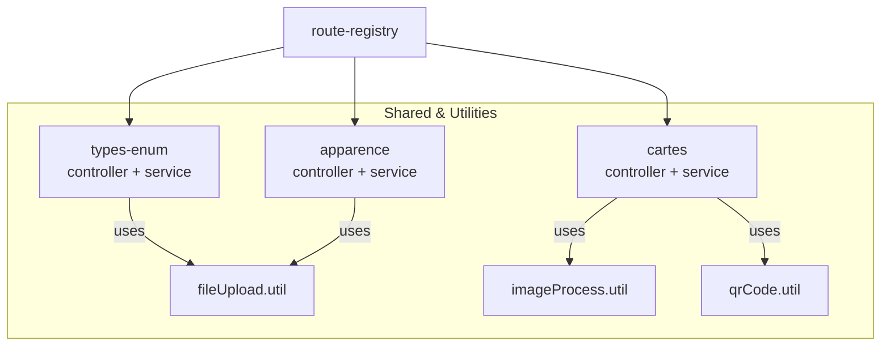
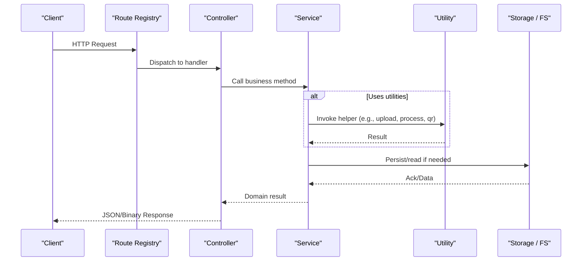
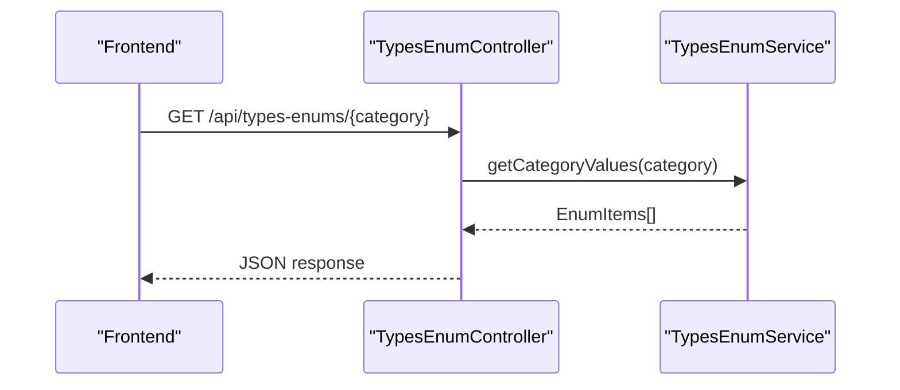
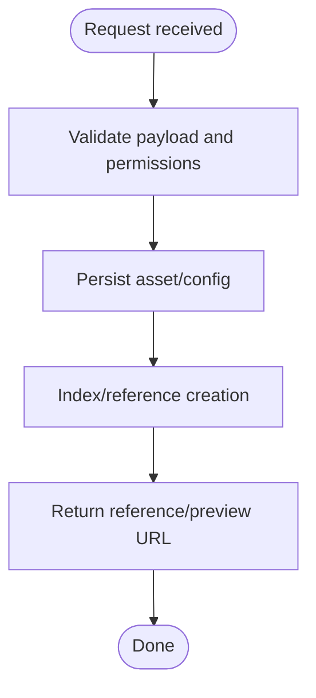
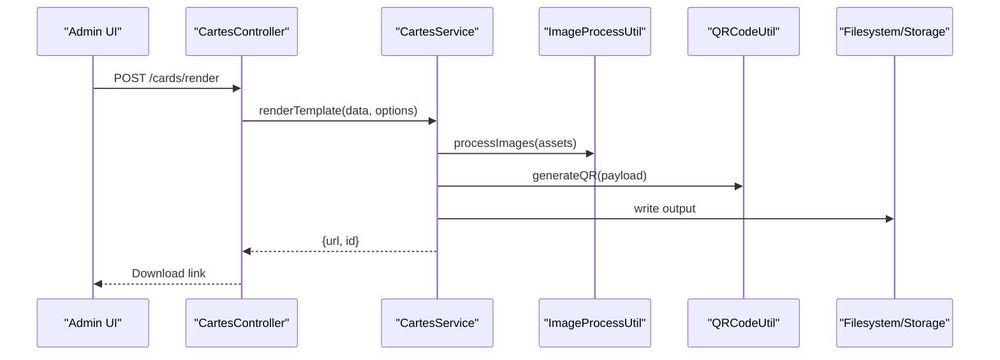
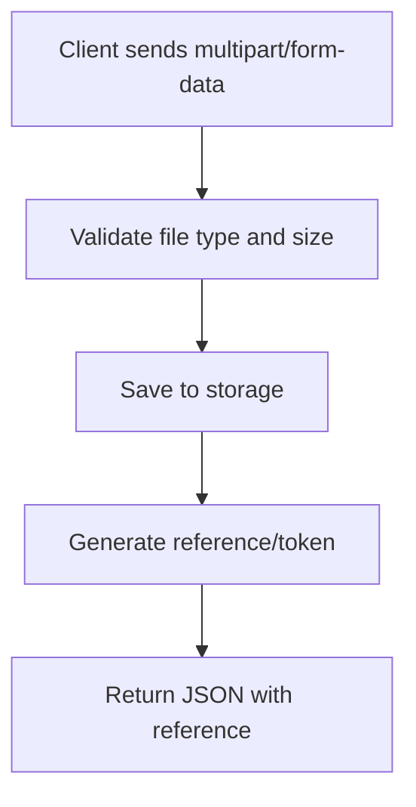
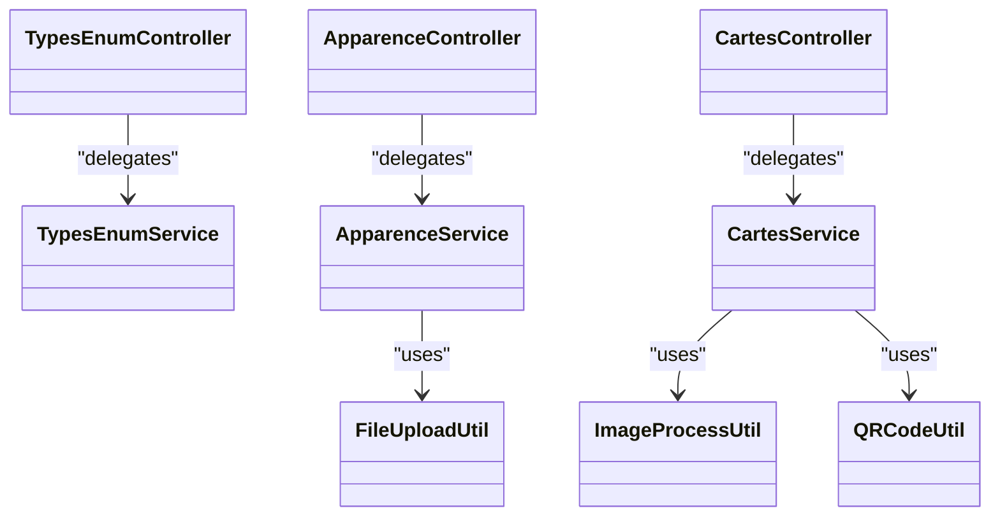

# Shared & Utility APIs

<cite>
**Referenced Files in This Document**
- [backend/src/modules/types-enum/controllers/typesEnum.controller.ts](file://backend/src/modules/types-enum/controllers/typesEnum.controller.ts)
- [backend/src/modules/types-enum/services/typesEnum.service.ts](file://backend/src/modules/types-enum/services/typesEnum.service.ts)
- [backend/src/modules/apparence/controllers/apparence.controller.ts](file://backend/src/modules/apparence/controllers/apparence.controller.ts)
- [backend/src/modules/apparence/services/apparence.service.ts](file://backend/src/modules/apparence/services/apparence.service.ts)
- [backend/src/modules/cartes/controllers/cartes.controller.ts](file://backend/src/modules/cartes/controllers/cartes.controller.ts)
- [backend/src/modules/cartes/services/cartes.service.ts](file://backend/src/modules/cartes/services/cartes.service.ts)
- [backend/src/common/utils/fileUpload.util.ts](file://backend/src/common/utils/fileUpload.util.ts)
- [backend/src/common/utils/imageProcess.util.ts](file://backend/src/common/utils/imageProcess.util.ts)
- [backend/src/common/utils/qrCode.util.ts](file://backend/src/common/utils/qrCode.util.ts)
- [backend/src/routes/route-registry.ts](file://backend/src/routes/route-registry.ts)
</cite>

## Table of Contents
1. [Introduction](#introduction)
2. [Project Structure](#project-structure)
3. [Core Components](#core-components)
4. [Architecture Overview](#architecture-overview)
5. [Detailed Component Analysis](#detailed-component-analysis)
6. [Dependency Analysis](#dependency-analysis)
7. [Performance Considerations](#performance-considerations)
8. [Troubleshooting Guide](#troubleshooting-guide)
9. [Conclusion](#conclusion)

## Introduction
This document provides comprehensive API documentation for eLISAschool’s shared and utility endpoints, focusing on:
- Type enumeration APIs for system-wide enums, constants, and reference data
- Appearance customization APIs for themes, branding, and visual configuration
- Card generation APIs for ID cards, certificates, and document templates
- Utility APIs for file uploads, image processing, QR code generation, and common system functions

It also includes integration patterns and examples to help modules reuse shared functionality consistently across the platform.

## Project Structure
The shared and utility capabilities are implemented as modular services with dedicated controllers and utilities:
- types-enum module exposes enumerations and reference data
- apparence module manages appearance settings (themes, branding, visuals)
- cartes module handles card and template generation
- common utilities provide reusable helpers for files, images, and QR codes
- route registry wires controllers into the application router

**Diagram sources**
- [backend/src/routes/route-registry.ts](file://backend/src/routes/route-registry.ts)
- [backend/src/modules/types-enum/controllers/typesEnum.controller.ts](file://backend/src/modules/types-enum/controllers/typesEnum.controller.ts)
- [backend/src/modules/types-enum/services/typesEnum.service.ts](file://backend/src/modules/types-enum/services/typesEnum.service.ts)
- [backend/src/modules/apparence/controllers/apparence.controller.ts](file://backend/src/modules/apparence/controllers/apparence.controller.ts)
- [backend/src/modules/apparence/services/apparence.service.ts](file://backend/src/modules/apparence/services/apparence.service.ts)
- [backend/src/modules/cartes/controllers/cartes.controller.ts](file://backend/src/modules/cartes/controllers/cartes.controller.ts)
- [backend/src/modules/cartes/services/cartes.service.ts](file://backend/src/modules/cartes/services/cartes.service.ts)
- [backend/src/common/utils/fileUpload.util.ts](file://backend/src/common/utils/fileUpload.util.ts)
- [backend/src/common/utils/imageProcess.util.ts](file://backend/src/common/utils/imageProcess.util.ts)
- [backend/src/common/utils/qrCode.util.ts](file://backend/src/common/utils/qrCode.util.ts)

**Section sources**
- [backend/src/routes/route-registry.ts](file://backend/src/routes/route-registry.ts)

## Core Components
- Type Enumeration APIs
  - Purpose: Provide a single source of truth for enums, constants, and reference lists used across modules.
  - Typical operations: list all enum categories, fetch values by category, resolve display labels.
  - Consumers: UI components, validation layers, reporting modules.

- Appearance Customization APIs
  - Purpose: Manage theme definitions, branding assets, and visual configuration at tenant or global scope.
  - Typical operations: get current appearance config, update theme colors, upload logo, preview changes.
  - Consumers: Frontend theming engine, branding overlays, print templates.

- Card Generation APIs
  - Purpose: Generate ID cards, certificates, and other templated documents.
  - Typical operations: render template with data, export to PDF/PNG, batch generate, download assets.
  - Consumers: Administration dashboards, printing workflows, student portals.

- Utility APIs
  - File Uploads: Accept multipart/form-data, validate size/type, persist securely, return references.
  - Image Processing: Resize, crop, watermark, format conversion, thumbnail generation.
  - QR Code Generation: Encode payloads (URLs, IDs), produce PNG/SVG, embed into templates.
  - Common Functions: Health checks, version info, feature flags, rate-limit status.

Integration patterns:
- Controllers delegate to services; services orchestrate business logic and call utilities.
- Route registry centralizes endpoint registration for consistent URL prefixes and middleware composition.
- Shared utilities are pure or stateless where possible to maximize reusability.

**Section sources**
- [backend/src/modules/types-enum/controllers/typesEnum.controller.ts](file://backend/src/modules/types-enum/controllers/typesEnum.controller.ts)
- [backend/src/modules/types-enum/services/typesEnum.service.ts](file://backend/src/modules/types-enum/services/typesEnum.service.ts)
- [backend/src/modules/apparence/controllers/apparence.controller.ts](file://backend/src/modules/apparence/controllers/apparence.controller.ts)
- [backend/src/modules/apparence/services/apparence.service.ts](file://backend/src/modules/apparence/services/apparence.service.ts)
- [backend/src/modules/cartes/controllers/cartes.controller.ts](file://backend/src/modules/cartes/controllers/cartes.controller.ts)
- [backend/src/modules/cartes/services/cartes.service.ts](file://backend/src/modules/cartes/services/cartes.service.ts)
- [backend/src/common/utils/fileUpload.util.ts](file://backend/src/common/utils/fileUpload.util.ts)
- [backend/src/common/utils/imageProcess.util.ts](file://backend/src/common/utils/imageProcess.util.ts)
- [backend/src/common/utils/qrCode.util.ts](file://backend/src/common/utils/qrCode.util.ts)

## Architecture Overview
High-level flow from client request to response for shared and utility endpoints:

**Diagram sources**
- [backend/src/routes/route-registry.ts](file://backend/src/routes/route-registry.ts)
- [backend/src/modules/types-enum/controllers/typesEnum.controller.ts](file://backend/src/modules/types-enum/controllers/typesEnum.controller.ts)
- [backend/src/modules/types-enum/services/typesEnum.service.ts](file://backend/src/modules/types-enum/services/typesEnum.service.ts)
- [backend/src/modules/apparence/controllers/apparence.controller.ts](file://backend/src/modules/apparence/controllers/apparence.controller.ts)
- [backend/src/modules/apparence/services/apparence.service.ts](file://backend/src/modules/apparence/services/apparence.service.ts)
- [backend/src/modules/cartes/controllers/cartes.controller.ts](file://backend/src/modules/cartes/controllers/cartes.controller.ts)
- [backend/src/modules/cartes/services/cartes.service.ts](file://backend/src/modules/cartes/services/cartes.service.ts)
- [backend/src/common/utils/fileUpload.util.ts](file://backend/src/common/utils/fileUpload.util.ts)
- [backend/src/common/utils/imageProcess.util.ts](file://backend/src/common/utils/imageProcess.util.ts)
- [backend/src/common/utils/qrCode.util.ts](file://backend/src/common/utils/qrCode.util.ts)

## Detailed Component Analysis

### Type Enumeration APIs
Responsibilities:
- Expose stable enum categories and their values
- Provide label resolution and fallbacks
- Support filtering by scope (global vs tenant) when applicable

Key endpoints (conceptual):
- GET /api/types-enums/categories
- GET /api/types-enums/{category}
- GET /api/types-enums/{category}/labels

Typical response shape:
- { category, items: [{ key, label, metadata? }] }

Integration example:
- Frontend loads categories once and caches per session
- Validation layer uses keys to enforce allowed values

**Diagram sources**
- [backend/src/modules/types-enum/controllers/typesEnum.controller.ts](file://backend/src/modules/types-enum/controllers/typesEnum.controller.ts)
- [backend/src/modules/types-enum/services/typesEnum.service.ts](file://backend/src/modules/types-enum/services/typesEnum.service.ts)

**Section sources**
- [backend/src/modules/types-enum/controllers/typesEnum.controller.ts](file://backend/src/modules/types-enum/controllers/typesEnum.controller.ts)
- [backend/src/modules/types-enum/services/typesEnum.service.ts](file://backend/src/modules/types-enum/services/typesEnum.service.ts)

### Appearance Customization APIs
Responsibilities:
- Retrieve and update appearance settings (theme, colors, logos, backgrounds)
- Validate asset formats and sizes
- Return preview URLs or tokens for secure access

Key endpoints (conceptual):
- GET /api/appearance/current
- PUT /api/appearance/theme
- POST /api/appearance/logo
- GET /api/appearance/assets/{id}

Processing flow:
- Upload -> validate -> store -> index -> return reference
- Update -> merge with existing config -> persist -> invalidate cache if needed

**Diagram sources**
- [backend/src/modules/apparence/controllers/apparence.controller.ts](file://backend/src/modules/apparence/controllers/apparence.controller.ts)
- [backend/src/modules/apparence/services/apparence.service.ts](file://backend/src/modules/apparence/services/apparence.service.ts)
- [backend/src/common/utils/fileUpload.util.ts](file://backend/src/common/utils/fileUpload.util.ts)

**Section sources**
- [backend/src/modules/apparence/controllers/apparence.controller.ts](file://backend/src/modules/apparence/controllers/apparence.controller.ts)
- [backend/src/modules/apparence/services/apparence.service.ts](file://backend/src/modules/apparence/services/apparence.service.ts)
- [backend/src/common/utils/fileUpload.util.ts](file://backend/src/common/utils/fileUpload.util.ts)

### Card Generation APIs
Responsibilities:
- Render templates with dynamic data
- Export to PDF/PNG
- Batch generation for multiple records
- Embed generated QR codes and images

Key endpoints (conceptual):
- POST /api/cards/render
- POST /api/cards/export/pdf
- POST /api/cards/batch
- GET /api/cards/templates
- POST /api/cards/qrcode

Data flow:
- Input payload (templateId, variables, options)
- Resolve template and assets
- Merge data and render
- Produce output stream or file reference

**Diagram sources**
- [backend/src/modules/cartes/controllers/cartes.controller.ts](file://backend/src/modules/cartes/controllers/cartes.controller.ts)
- [backend/src/modules/cartes/services/cartes.service.ts](file://backend/src/modules/cartes/services/cartes.service.ts)
- [backend/src/common/utils/imageProcess.util.ts](file://backend/src/common/utils/imageProcess.util.ts)
- [backend/src/common/utils/qrCode.util.ts](file://backend/src/common/utils/qrCode.util.ts)

**Section sources**
- [backend/src/modules/cartes/controllers/cartes.controller.ts](file://backend/src/modules/cartes/controllers/cartes.controller.ts)
- [backend/src/modules/cartes/services/cartes.service.ts](file://backend/src/modules/cartes/services/cartes.service.ts)
- [backend/src/common/utils/imageProcess.util.ts](file://backend/src/common/utils/imageProcess.util.ts)
- [backend/src/common/utils/qrCode.util.ts](file://backend/src/common/utils/qrCode.util.ts)

### Utility APIs
- File Uploads
  - Accept multipart/form-data
  - Validate type, size, and content
  - Persist and return safe references
  - Endpoint pattern: POST /api/util/files/upload

- Image Processing
  - Resize, crop, convert, watermark
  - Endpoint pattern: POST /api/util/images/process

- QR Code Generation
  - Encode text/URL/JSON
  - Output PNG/SVG
  - Endpoint pattern: POST /api/util/qrcode

- Common System Functions
  - Health check, version, feature flags
  - Endpoint patterns: GET /api/util/health, GET /api/util/version

**Diagram sources**
- [backend/src/common/utils/fileUpload.util.ts](file://backend/src/common/utils/fileUpload.util.ts)
- [backend/src/common/utils/imageProcess.util.ts](file://backend/src/common/utils/imageProcess.util.ts)
- [backend/src/common/utils/qrCode.util.ts](file://backend/src/common/utils/qrCode.util.ts)

**Section sources**
- [backend/src/common/utils/fileUpload.util.ts](file://backend/src/common/utils/fileUpload.util.ts)
- [backend/src/common/utils/imageProcess.util.ts](file://backend/src/common/utils/imageProcess.util.ts)
- [backend/src/common/utils/qrCode.util.ts](file://backend/src/common/utils/qrCode.util.ts)

## Dependency Analysis
Relationships between controllers, services, and utilities:

**Diagram sources**
- [backend/src/modules/types-enum/controllers/typesEnum.controller.ts](file://backend/src/modules/types-enum/controllers/typesEnum.controller.ts)
- [backend/src/modules/types-enum/services/typesEnum.service.ts](file://backend/src/modules/types-enum/services/typesEnum.service.ts)
- [backend/src/modules/apparence/controllers/apparence.controller.ts](file://backend/src/modules/apparence/controllers/apparence.controller.ts)
- [backend/src/modules/apparence/services/apparence.service.ts](file://backend/src/modules/apparence/services/apparence.service.ts)
- [backend/src/modules/cartes/controllers/cartes.controller.ts](file://backend/src/modules/cartes/controllers/cartes.controller.ts)
- [backend/src/modules/cartes/services/cartes.service.ts](file://backend/src/modules/cartes/services/cartes.service.ts)
- [backend/src/common/utils/fileUpload.util.ts](file://backend/src/common/utils/fileUpload.util.ts)
- [backend/src/common/utils/imageProcess.util.ts](file://backend/src/common/utils/imageProcess.util.ts)
- [backend/src/common/utils/qrCode.util.ts](file://backend/src/common/utils/qrCode.util.ts)

**Section sources**
- [backend/src/routes/route-registry.ts](file://backend/src/routes/route-registry.ts)

## Performance Considerations
- Cache enum responses at the edge or client side; they change infrequently.
- Use streaming for large exports (PDF/PNG) to reduce memory pressure.
- Limit concurrent image processing jobs; consider a queue for heavy tasks.
- Apply compression for generated assets and leverage CDN caching for static branding assets.
- Validate inputs early to fail fast and avoid unnecessary I/O.

## Troubleshooting Guide
Common issues and resolutions:
- Invalid file type or oversized uploads
  - Ensure whitelist of allowed MIME types and enforce max size limits
  - Return clear error messages with supported formats
- Missing or invalid template variables
  - Validate required fields before rendering
  - Provide a dry-run mode to preview errors
- QR code generation failures
  - Validate input length and encoding
  - Fallback to smaller QR density or truncated payload
- Appearance asset not found
  - Verify storage paths and permissions
  - Regenerate references after migration or restore

Operational tips:
- Log request IDs and trace through controller -> service -> utility calls
- Add health checks for external dependencies (storage, printers)
- Monitor disk usage and set retention policies for temporary assets

**Section sources**
- [backend/src/common/utils/fileUpload.util.ts](file://backend/src/common/utils/fileUpload.util.ts)
- [backend/src/common/utils/imageProcess.util.ts](file://backend/src/common/utils/imageProcess.util.ts)
- [backend/src/common/utils/qrCode.util.ts](file://backend/src/common/utils/qrCode.util.ts)

## Conclusion
The shared and utility APIs provide foundational capabilities that standardize how eLISAschool handles enumerations, appearance customization, card generation, and common utilities. By following the documented patterns and leveraging the provided utilities, modules can integrate consistently, maintain high quality, and scale efficiently.