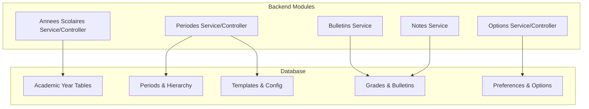
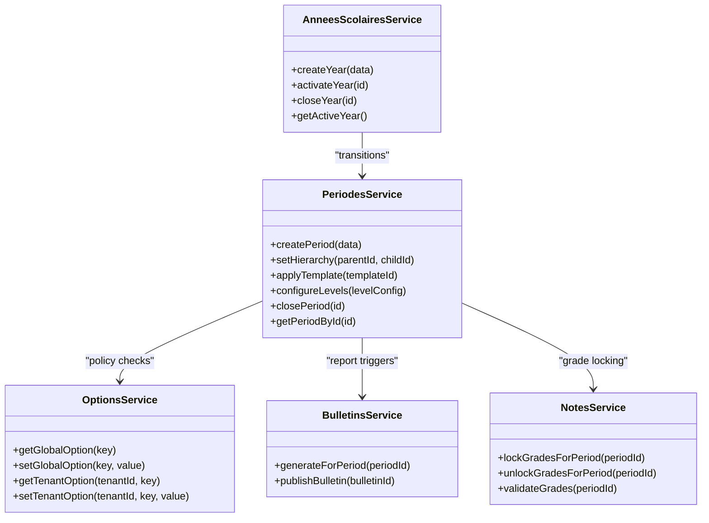
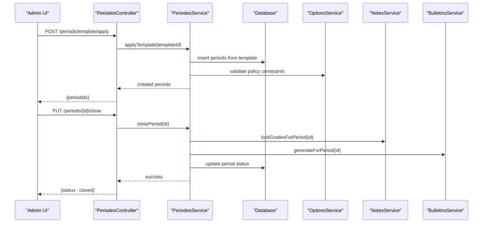
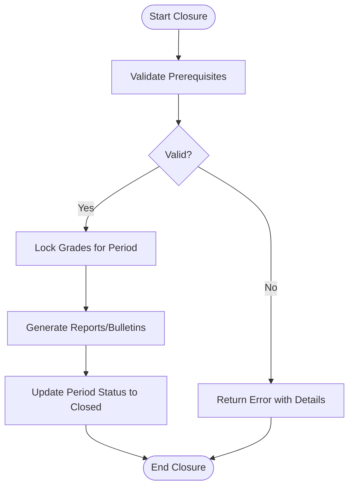
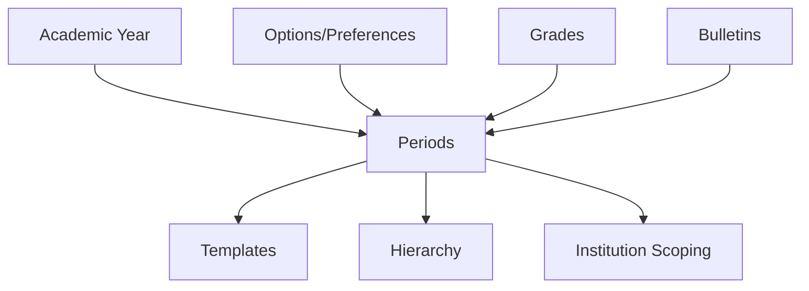

# Academic Calendar & Periods

<cite>
**Referenced Files in This Document**
- [035-contexte-africain-periodes.sql](file://backend/database/migrations/035-contexte-africain-periodes.sql)
- [035b-migration-donnees-periodes.sql](file://backend/database/migrations/035b-migration-donnees-periodes.sql)
- [102-periodes-hierarchie.sql](file://backend/database/migrations/102-periodes-hierarchie.sql)
- [103-templates-periode-personnalisables.sql](file://backend/database/migrations/103-templates-periode-personnalisables.sql)
- [104-refonte-periodes-niveaux-configurables.sql](file://backend/database/migrations/104-refonte-periodes-niveaux-configurables.sql)
- [105-migration-templates-v5.sql](file://backend/database/migrations/105-migration-templates-v5.sql)
- [101-normalisation-annee-scolaire-cloture.sql](file://backend/database/migrations/101-normalisation-annee-scolaire-cloture.sql)
- [088-refactorisation-architecture-academique.sql](file://backend/database/migrations/088-refactorisation-architecture-academique.sql)
- [089-finalisation-architecture-academique-v2.sql](file://backend/database/migrations/089-finalisation-architecture-academique-v2.sql)
- [090-correction-migration-088-camelcase.sql](file://backend/database/migrations/090-correction-migration-088-camelcase.sql)
- [091-peuplement-architecture-academique.sql](file://backend/database/migrations/091-peuplement-architecture-academique.sql)
- [092-refactorisation-classeAnneeId.sql](file://backend/database/migrations/092-refactorisation-classeAnneeId.sql)
- [058-multi-tenant-structure-academique.sql](file://backend/database/migrations/058-multi-tenant-structure-academique.sql)
- [085-periode-etablissement-id.sql](file://backend/database/migrations/085-periode-etablissement-id.sql)
- [058-unifier-periode-cloturee-statut.sql](file://backend/database/migrations/058-unifier-periode-cloturee-statut.sql)
- [061-creer-table-bulletins-matieres.sql](file://backend/database/migrations/061-creer-table-bulletins-matieres.sql)
- [062-creer-table-evaluations-competences.sql](file://backend/database/migrations/062-creer-table-evaluations-competences.sql)
- [044-module-organisation.sql](file://backend/database/migrations/044-module-organisation.sql)
- [046-preferences-utilisateur-et-config.sql](file://backend/database/migrations/046-preferences-utilisateur-et-config.sql)
- [080-preferences-utilisateur-multi-tenant.sql](file://backend/database/migrations/080-preferences-utilisateur-multi-tenant.sql)
- [082-fix-contrainte-unique-preferences.sql](file://backend/database/migrations/082-fix-contrainte-unique-preferences.sql)
- [083-fix-contrainte-unique-parametres.sql](file://backend/database/migrations/083-fix-contrainte-unique-parametres.sql)
- [044-preferences-globales.sql](file://backend/database/migrations/044-preferences-globales.sql)
- [045-preferences-role.sql](file://backend/database/migrations/045-preferences-role.sql)
- [046-dashboard-config.sql](file://backend/database/migrations/046-dashboard-config.sql)
- [034-annee-scolaire-suivi.sql](file://backend/database/migrations/034-annee-scolaire-suivi.sql)
- [053-structure-academique-complete.sql](file://backend/database/migrations/053-structure-academique-complete.sql)
- [054-refonte-structure-academique-v2.sql](file://backend/database/migrations/054-refonte-structure-academique-v2.sql)
- [055-structure-academique-ameliorations.sql](file://backend/database/migrations/055-structure-academique-ameliorations.sql)
- [056-suppression-cycle-scolaire.sql](file://backend/database/migrations/056-suppression-cycle-scolaire.sql)
- [057-supprimer-niveau-filiere-id.sql](file://backend/database/migrations/057-supprimer-niveau-filiere-id.sql)
- [059-ajouter-matiere-sous-systeme.sql](file://backend/database/migrations/059-ajouter-matiere-sous-systeme.sql)
- [059-multi-tenant-matiere.sql](file://backend/database/migrations/059-multi-tenant-matiere.sql)
- [060-ajouter-affectation-matiere-coefficient.sql](file://backend/database/migrations/060-ajouter-affectation-matiere-coefficient.sql)
- [063-creer-module-emploi-du-temps.sql](file://backend/database/migrations/063-creer-module-emploi-du-temps.sql)
- [064-validateur-sous-systeme.sql](file://backend/database/migrations/064-validateur-sous-systeme.sql)
- [065-templates-emploi-du-temps.sql](file://backend/database/migrations/065-templates-emploi-du-temps.sql)
- [072-scoping-cycles-niveaux.sql](file://backend/database/migrations/072-scoping-cycles-niveaux.sql)
- [073-competence-unique-composite.sql](file://backend/database/migrations/073-competence-unique-composite.sql)
- [074-matiere-niveau-unique-composite.sql](file://backend/database/migrations/074-matiere-niveau-unique-composite.sql)
- [075-module-groupes-etablissements.sql](file://backend/database/migrations/075-module-groupes-etablissements.sql)
- [076-permissions-groupes-etablissements.sql](file://backend/database/migrations/076-permissions-groupes-etablissements.sql)
- [077-update-permissions-groupes.sql](file://backend/database/migrations/077-update-permissions-groupes.sql)
- [078-utilisateur-test-groupes.sql](file://backend/database/migrations/078-utilisateur-test-groupes.sql)
- [079-add-roleId-utilisateur-etablissements.sql](file://backend/database/migrations/079-add-roleId-utilisateur-etablissements.sql)
- [079-correction-permissions-groupes.sql](file://backend/database/migrations/079-correction-permissions-groupes.sql)
- [081-module-apparence-fonds.sql](file://backend/database/migrations/081-module-apparence-fonds.sql)
- [084-cleanup-classe-id-notes.sql](file://backend/database/migrations/084-cleanup-classe-id-notes.sql)
- [086-affectation-matiere-etablissement-id.sql](file://backend/database/migrations/086-affectation-matiere-etablissement-id.sql)
- [087-affectation-matiere-verifications.sql](file://backend/database/migrations/087-affectation-matiere-verifications.sql)
- [099-add-monitoring-params.sql](file://backend/database/migrations/099-add-monitoring-params.sql)
- [100-classes-salle-principale.sql](file://backend/database/migrations/100-classes-salle-principale.sql)
- [106-rename-sequence-to-evaluation.sql](file://backend/database/migrations/106-rename-sequence-to-evaluation.sql)
- [107-cleanup-configuration-modules-actif.sql](file://backend/database/migrations/107-cleanup-configuration-modules-actif.sql)
- [108-refactor-salle-principale.sql](file://backend/database/migrations/108-refactor-salle-principale.sql)
- [annees_scolaires.service.ts](file://backend/src/modules/annees-scolaires/services/annees_scolaires.service.ts)
- [annees_scolaires.controller.ts](file://backend/src/modules/annees-scolaires/controllers/annees_scolaires.controller.ts)
- [periodes.service.ts](file://backend/src/modules/periodes/services/periodes.service.ts)
- [periodes.controller.ts](file://backend/src/modules/periodes/controllers/periodes.controller.ts)
- [options.service.ts](file://backend/src/modules/options/services/options.service.ts)
- [options.controller.ts](file://backend/src/modules/options/controllers/options.controller.ts)
- [bulletins.service.ts](file://backend/src/modules/bulletins/services/bulletins.service.ts)
- [notes.service.ts](file://backend/src/modules/notes/services/notes.service.ts)
</cite>

## Table of Contents
1. Introduction
2. Project Structure
3. Core Components
4. Architecture Overview
5. Detailed Component Analysis
6. Dependency Analysis
7. Performance Considerations
8. Troubleshooting Guide
9. Conclusion
10. Appendices

## Introduction
This document explains eLISAschool’s Academic Calendar and Periods system, focusing on academic year management, period configuration (trimesters, semesters, custom periods), holiday configuration with regional and institution-specific calendars, the period closure workflow including grade locking and report generation triggers, and option management for academic policies and institutional preferences. It provides practical examples for calendar setup, period transitions, and policy enforcement patterns.

## Project Structure
The Academic Calendar and Periods functionality spans database migrations, backend modules, and shared configuration:
- Database layer: Migrations define academic years, periods, hierarchies, templates, closures, and related tables.
- Backend modules: Controllers and services implement APIs and business logic for academic years, periods, options, grading, and bulletins.
- Configuration: Global and tenant-level preferences control behavior such as region, grading scales, and reporting rules.

[No sources needed since this diagram shows conceptual structure]

## Core Components
- Academic Year Management: Defines start/end dates, active status, and lifecycle hooks for transitions.
- Period Management: Supports trimesters, semesters, and custom periods with hierarchical relationships and configurable levels.
- Holiday Configuration: Regional calendars and institution-specific holidays integrated into period planning.
- Period Closure Workflow: Grade locking, validation checks, and triggers to generate reports/bulletins.
- Option Management: Institutional preferences and academic policies controlling behavior across modules.

Key implementation references:
- Academic year lifecycle and closure normalization
- Period hierarchy, templates, and level configuration
- Preferences and options for policies and regional settings
- Integration points with grades and bulletin generation

**Section sources**
- [101-normalisation-annee-scolaire-cloture.sql](file://backend/database/migrations/101-normalisation-annee-scolaire-cloture.sql)
- [102-periodes-hierarchie.sql](file://backend/database/migrations/102-periodes-hierarchie.sql)
- [103-templates-periode-personnalisables.sql](file://backend/database/migrations/103-templates-periode-personnalisables.sql)
- [104-refonte-periodes-niveaux-configurables.sql](file://backend/database/migrations/104-refonte-periodes-niveaux-configurables.sql)
- [044-preferences-globales.sql](file://backend/database/migrations/044-preferences-globales.sql)
- [046-preferences-utilisateur-et-config.sql](file://backend/database/migrations/046-preferences-utilisateur-et-config.sql)
- [080-preferences-utilisateur-multi-tenant.sql](file://backend/database/migrations/080-preferences-utilisateur-multi-tenant.sql)
- [082-fix-contrainte-unique-preferences.sql](file://backend/database/migrations/082-fix-contrainte-unique-preferences.sql)
- [083-fix-contrainte-unique-parametres.sql](file://backend/database/migrations/083-fix-contrainte-unique-parametres.sql)
- [045-preferences-role.sql](file://backend/database/migrations/045-preferences-role.sql)
- [046-dashboard-config.sql](file://backend/database/migrations/046-dashboard-config.sql)
- [035-contexte-africain-periodes.sql](file://backend/database/migrations/035-contexte-africain-periodes.sql)
- [035b-migration-donnees-periodes.sql](file://backend/database/migrations/035b-migration-donnees-periodes.sql)
- [085-periode-etablissement-id.sql](file://backend/database/migrations/085-periode-etablissement-id.sql)
- [058-unifier-periode-cloturee-statut.sql](file://backend/database/migrations/058-unifier-periode-cloturee-statut.sql)
- [061-creer-table-bulletins-matieres.sql](file://backend/database/migrations/061-creer-table-bulletins-matieres.sql)
- [062-creer-table-evaluations-competences.sql](file://backend/database/migrations/062-creer-table-evaluations-competences.sql)
- [annees_scolaires.service.ts](file://backend/src/modules/annees-scolaires/services/annees_scolaires.service.ts)
- [annees_scolaires.controller.ts](file://backend/src/modules/annees-scolaires/controllers/annees_scolaires.controller.ts)
- [periodes.service.ts](file://backend/src/modules/periodes/services/periodes.service.ts)
- [periodes.controller.ts](file://backend/src/modules/periodes/controllers/periodes.controller.ts)
- [options.service.ts](file://backend/src/modules/options/services/options.service.ts)
- [options.controller.ts](file://backend/src/modules/options/controllers/options.controller.ts)
- [bulletins.service.ts](file://backend/src/modules/bulletins/services/bulletins.service.ts)
- [notes.service.ts](file://backend/src/modules/notes/services/notes.service.ts)

## Architecture Overview
The system is organized around three pillars:
- Academic Year: Lifecycle and closure state management.
- Periods: Hierarchical structures (semesters/trimesters/custom) with templates and level-based configuration.
- Options/Preferences: Institutional policies and regional settings that influence behavior.

**Diagram sources**
- [annees_scolaires.service.ts](file://backend/src/modules/annees-scolaires/services/annees_scolaires.service.ts)
- [periodes.service.ts](file://backend/src/modules/periodes/services/periodes.service.ts)
- [options.service.ts](file://backend/src/modules/options/services/options.service.ts)
- [bulletins.service.ts](file://backend/src/modules/bulletins/services/bulletins.service.ts)
- [notes.service.ts](file://backend/src/modules/notes/services/notes.service.ts)

## Detailed Component Analysis

### Academic Year Management
- Purpose: Define the academic year boundaries, activate/deactivate years, and manage closure states.
- Key behaviors:
  - Enforce single active year per institution.
  - Normalize closure states and ensure consistent transitions.
  - Provide lifecycle hooks for downstream processes (periods, grades, reports).

Practical example:
- Create a new academic year with start/end dates.
- Activate it when ready; deactivate previous year.
- Close the year after all periods are finalized and reports generated.

**Section sources**
- [101-normalisation-annee-scolaire-cloture.sql](file://backend/database/migrations/101-normalisation-annee-scolaire-cloture.sql)
- [034-annee-scolaire-suivi.sql](file://backend/database/migrations/034-annee-scolaire-suivi.sql)
- [053-structure-academique-complete.sql](file://backend/database/migrations/053-structure-academique-complete.sql)
- [054-refonte-structure-academique-v2.sql](file://backend/database/migrations/054-refonte-structure-academique-v2.sql)
- [055-structure-academique-ameliorations.sql](file://backend/database/migrations/055-structure-academique-ameliorations.sql)
- [056-suppression-cycle-scolaire.sql](file://backend/database/migrations/056-suppression-cycle-scolaire.sql)
- [057-supprimer-niveau-filiere-id.sql](file://backend/database/migrations/057-supprimer-niveau-filiere-id.sql)
- [088-refactorisation-architecture-academique.sql](file://backend/database/migrations/088-refactorisation-architecture-academique.sql)
- [089-finalisation-architecture-academique-v2.sql](file://backend/database/migrations/089-finalisation-architecture-academique-v2.sql)
- [090-correction-migration-088-camelcase.sql](file://backend/database/migrations/090-correction-migration-088-camelcase.sql)
- [091-peuplement-architecture-academique.sql](file://backend/database/migrations/091-peuplement-architecture-academique.sql)
- [092-refactorisation-classeAnneeId.sql](file://backend/database/migrations/092-refactorisation-classeAnneeId.sql)
- [annees_scolaires.service.ts](file://backend/src/modules/annees-scolaires/services/annees_scolaires.service.ts)
- [annees_scolaires.controller.ts](file://backend/src/modules/annees-scolaires/controllers/annees_scolaires.controller.ts)

### Period Management System
- Purpose: Configure and manage academic periods (trimesters, semesters, custom) with hierarchical relationships and templates.
- Key capabilities:
  - Hierarchical organization: parent-child relationships between periods.
  - Templates: reusable period configurations for quick setup.
  - Level configuration: adapt periods to different educational levels.
  - Institution scoping: associate periods with specific institutions.

Practical example:
- Apply a “Trimester” template to create three periods within an academic year.
- Adjust period lengths based on regional calendars.
- Customize period names and labels per institution.

**Diagram sources**
- [periodes.controller.ts](file://backend/src/modules/periodes/controllers/periodes.controller.ts)
- [periodes.service.ts](file://backend/src/modules/periodes/services/periodes.service.ts)
- [options.service.ts](file://backend/src/modules/options/services/options.service.ts)
- [notes.service.ts](file://backend/src/modules/notes/services/notes.service.ts)
- [bulletins.service.ts](file://backend/src/modules/bulletins/services/bulletins.service.ts)

**Section sources**
- [102-periodes-hierarchie.sql](file://backend/database/migrations/102-periodes-hierarchie.sql)
- [103-templates-periode-personnalisables.sql](file://backend/database/migrations/103-templates-periode-personnalisables.sql)
- [104-refonte-periodes-niveaux-configurables.sql](file://backend/database/migrations/104-refonte-periodes-niveaux-configurables.sql)
- [105-migration-templates-v5.sql](file://backend/database/migrations/105-migration-templates-v5.sql)
- [035-contexte-africain-periodes.sql](file://backend/database/migrations/035-contexte-africain-periodes.sql)
- [035b-migration-donnees-periodes.sql](file://backend/database/migrations/035b-migration-donnees-periodes.sql)
- [085-periode-etablissement-id.sql](file://backend/database/migrations/085-periode-etablissement-id.sql)
- [058-unifier-periode-cloturee-statut.sql](file://backend/database/migrations/058-unifier-periode-cloturee-statut.sql)
- [periodes.service.ts](file://backend/src/modules/periodes/services/periodes.service.ts)
- [periodes.controller.ts](file://backend/src/modules/periodes/controllers/periodes.controller.ts)

### Holiday Configuration (Regional & Institution-Specific)
- Purpose: Integrate regional calendars and institution-specific holidays into period planning.
- Key aspects:
  - Regional context support for African contexts and beyond.
  - Data migration utilities to seed or adjust holiday data.
  - Association of holidays with institutions for localized calendars.

Practical example:
- Load regional holiday sets for a country.
- Override or extend holidays at the institution level.
- Use holidays to compute effective working days within periods.

**Section sources**
- [035-contexte-africain-periodes.sql](file://backend/database/migrations/035-contexte-africain-periodes.sql)
- [035b-migration-donnees-periodes.sql](file://backend/database/migrations/035b-migration-donnees-periodes.sql)
- [085-periode-etablissement-id.sql](file://backend/database/migrations/085-periode-etablissement-id.sql)

### Period Closure Workflow (Grade Locking & Report Generation)
- Purpose: Ensure data integrity during period transitions by locking grades and generating reports.
- Workflow steps:
  - Validate prerequisites (no open assessments, required fields complete).
  - Lock grades for the period to prevent further edits.
  - Generate bulletins/reports for students and subjects.
  - Update period status to closed and propagate to academic year if applicable.

**Diagram sources**
- [058-unifier-periode-cloturee-statut.sql](file://backend/database/migrations/058-unifier-periode-cloturee-statut.sql)
- [061-creer-table-bulletins-matieres.sql](file://backend/database/migrations/061-creer-table-bulletins-matieres.sql)
- [062-creer-table-evaluations-competences.sql](file://backend/database/migrations/062-creer-table-evaluations-competences.sql)
- [periodes.service.ts](file://backend/src/modules/periodes/services/periodes.service.ts)
- [notes.service.ts](file://backend/src/modules/notes/services/notes.service.ts)
- [bulletins.service.ts](file://backend/src/modules/bulletins/services/bulletins.service.ts)

**Section sources**
- [058-unifier-periode-cloturee-statut.sql](file://backend/database/migrations/058-unifier-periode-cloturee-statut.sql)
- [061-creer-table-bulletins-matieres.sql](file://backend/database/migrations/061-creer-table-bulletins-matieres.sql)
- [062-creer-table-evaluations-competences.sql](file://backend/database/migrations/062-creer-table-evaluations-competences.sql)
- [periodes.service.ts](file://backend/src/modules/periodes/services/periodes.service.ts)
- [notes.service.ts](file://backend/src/modules/notes/services/notes.service.ts)
- [bulletins.service.ts](file://backend/src/modules/bulletins/services/bulletins.service.ts)

### Option Management (Academic Policies & Institutional Preferences)
- Purpose: Centralize academic policies and institutional preferences that affect calendar and period behavior.
- Scope:
  - Global options (system-wide defaults).
  - Tenant/institution options (overrides per school).
  - Role-based preferences (user interface and feature toggles).
  - Dashboard configuration (display and analytics settings).

Practical example:
- Set default grading scale and pass thresholds globally.
- Override grading scale per institution.
- Enable/disable advanced features like competency evaluations.

**Section sources**
- [044-preferences-globales.sql](file://backend/database/migrations/044-preferences-globales.sql)
- [046-preferences-utilisateur-et-config.sql](file://backend/database/migrations/046-preferences-utilisateur-et-config.sql)
- [080-preferences-utilisateur-multi-tenant.sql](file://backend/database/migrations/080-preferences-utilisateur-multi-tenant.sql)
- [082-fix-contrainte-unique-preferences.sql](file://backend/database/migrations/082-fix-contrainte-unique-preferences.sql)
- [083-fix-contrainte-unique-parametres.sql](file://backend/database/migrations/083-fix-contrainte-unique-parametres.sql)
- [045-preferences-role.sql](file://backend/database/migrations/045-preferences-role.sql)
- [046-dashboard-config.sql](file://backend/database/migrations/046-dashboard-config.sql)
- [options.service.ts](file://backend/src/modules/options/services/options.service.ts)
- [options.controller.ts](file://backend/src/modules/options/controllers/options.controller.ts)

### Practical Examples

#### Calendar Setup
- Define academic year with clear start/end dates.
- Apply a period template (e.g., Trimester) to auto-create periods.
- Adjust period boundaries using regional holiday data.

References:
- [101-normalisation-annee-scolaire-cloture.sql](file://backend/database/migrations/101-normalisation-annee-scolaire-cloture.sql)
- [103-templates-periode-personnalisables.sql](file://backend/database/migrations/103-templates-periode-personnalisables.sql)
- [035-contexte-africain-periodes.sql](file://backend/database/migrations/035-contexte-africain-periodes.sql)

#### Period Transitions
- Transition from one period to another by closing the current period.
- Ensure grades are locked and reports generated before moving forward.
- Propagate closure to academic year if final period.

References:
- [058-unifier-periode-cloturee-statut.sql](file://backend/database/migrations/058-unifier-periode-cloturee-statut.sql)
- [061-creer-table-bulletins-matieres.sql](file://backend/database/migrations/061-creer-table-bulletins-matieres.sql)
- [periodes.service.ts](file://backend/src/modules/periodes/services/periodes.service.ts)
- [notes.service.ts](file://backend/src/modules/notes/services/notes.service.ts)
- [bulletins.service.ts](file://backend/src/modules/bulletins/services/bulletins.service.ts)

#### Policy Enforcement Patterns
- Use global options to set baseline policies (grading scales, evaluation types).
- Allow institution overrides for local requirements.
- Enforce role-based access to sensitive operations (closing periods, editing grades).

References:
- [044-preferences-globales.sql](file://backend/database/migrations/044-preferences-globales.sql)
- [080-preferences-utilisateur-multi-tenant.sql](file://backend/database/migrations/080-preferences-utilisateur-multi-tenant.sql)
- [045-preferences-role.sql](file://backend/database/migrations/045-preferences-role.sql)
- [options.service.ts](file://backend/src/modules/options/services/options.service.ts)

## Dependency Analysis
The Academic Calendar and Periods system depends on multiple modules and tables:
- Academic Year depends on period definitions and closure states.
- Periods depend on templates, hierarchy, and institution scoping.
- Options/Preferences influence behavior across modules.
- Grades and Bulletins integrate with period closure workflows.

**Diagram sources**
- [102-periodes-hierarchie.sql](file://backend/database/migrations/102-periodes-hierarchie.sql)
- [103-templates-periode-personnalisables.sql](file://backend/database/migrations/103-templates-periode-personnalisables.sql)
- [085-periode-etablissement-id.sql](file://backend/database/migrations/085-periode-etablissement-id.sql)
- [061-creer-table-bulletins-matieres.sql](file://backend/database/migrations/061-creer-table-bulletins-matieres.sql)
- [062-creer-table-evaluations-competences.sql](file://backend/database/migrations/062-creer-table-evaluations-competences.sql)

**Section sources**
- [102-periodes-hierarchie.sql](file://backend/database/migrations/102-periodes-hierarchie.sql)
- [103-templates-periode-personnalisables.sql](file://backend/database/migrations/103-templates-periode-personnalisables.sql)
- [085-periode-etablissement-id.sql](file://backend/database/migrations/085-periode-etablissement-id.sql)
- [061-creer-table-bulletins-matieres.sql](file://backend/database/migrations/061-creer-table-bulletins-matieres.sql)
- [062-creer-table-evaluations-competences.sql](file://backend/database/migrations/062-creer-table-evaluations-competences.sql)

## Performance Considerations
- Indexing: Ensure indexes on foreign keys and frequently queried columns (e.g., period IDs, institution IDs).
- Batch Operations: Use batch inserts for applying templates and seeding holiday data.
- Caching: Cache global options and templates to reduce database load.
- Validation Efficiency: Perform prerequisite checks early to avoid expensive operations.

[No sources needed since this section provides general guidance]

## Troubleshooting Guide
Common issues and resolutions:
- Period closure fails due to open assessments:
  - Check for pending evaluations and complete them before closing.
  - Review validation errors returned by the service.
- Grade locking conflicts:
  - Ensure no concurrent edits are happening; enforce transactional locks.
- Report generation failures:
  - Verify required data completeness (grades, competencies).
  - Inspect bulletin templates and subject mappings.

Operational references:
- [058-unifier-periode-cloturee-statut.sql](file://backend/database/migrations/058-unifier-periode-cloturee-statut.sql)
- [061-creer-table-bulletins-matieres.sql](file://backend/database/migrations/061-creer-table-bulletins-matieres.sql)
- [062-creer-table-evaluations-competences.sql](file://backend/database/migrations/062-creer-table-evaluations-competences.sql)
- [periodes.service.ts](file://backend/src/modules/periodes/services/periodes.service.ts)
- [notes.service.ts](file://backend/src/modules/notes/services/notes.service.ts)
- [bulletins.service.ts](file://backend/src/modules/bulletins/services/bulletins.service.ts)

**Section sources**
- [058-unifier-periode-cloturee-statut.sql](file://backend/database/migrations/058-unifier-periode-cloturee-statut.sql)
- [061-creer-table-bulletins-matieres.sql](file://backend/database/migrations/061-creer-table-bulletins-matieres.sql)
- [062-creer-table-evaluations-competences.sql](file://backend/database/migrations/062-creer-table-evaluations-competences.sql)
- [periodes.service.ts](file://backend/src/modules/periodes/services/periodes.service.ts)
- [notes.service.ts](file://backend/src/modules/notes/services/notes.service.ts)
- [bulletins.service.ts](file://backend/src/modules/bulletins/services/bulletins.service.ts)

## Conclusion
eLISAschool’s Academic Calendar and Periods system provides robust support for managing academic years, configuring periods (including trimesters, semesters, and custom periods), integrating regional and institution-specific holidays, enforcing closure workflows with grade locking and report generation, and centralizing academic policies through options and preferences. The architecture ensures scalability, configurability, and consistency across institutions while supporting diverse educational contexts.

[No sources needed since this section summarizes without analyzing specific files]

## Appendices

### Migration Timeline Highlights
- Academic year normalization and closure handling
- Period hierarchy and templates introduction
- Level configuration and multi-tenant support
- Preferences and options consolidation
- Bulletin and evaluation table creation

**Section sources**
- [101-normalisation-annee-scolaire-cloture.sql](file://backend/database/migrations/101-normalisation-annee-scolaire-cloture.sql)
- [102-periodes-hierarchie.sql](file://backend/database/migrations/102-periodes-hierarchie.sql)
- [103-templates-periode-personnalisables.sql](file://backend/database/migrations/103-templates-periode-personnalisables.sql)
- [104-refonte-periodes-niveaux-configurables.sql](file://backend/database/migrations/104-refonte-periodes-niveaux-configurables.sql)
- [044-preferences-globales.sql](file://backend/database/migrations/044-preferences-globales.sql)
- [046-preferences-utilisateur-et-config.sql](file://backend/database/migrations/046-preferences-utilisateur-et-config.sql)
- [080-preferences-utilisateur-multi-tenant.sql](file://backend/database/migrations/080-preferences-utilisateur-multi-tenant.sql)
- [061-creer-table-bulletins-matieres.sql](file://backend/database/migrations/061-creer-table-bulletins-matieres.sql)
- [062-creer-table-evaluations-competences.sql](file://backend/database/migrations/062-creer-table-evaluations-competences.sql)