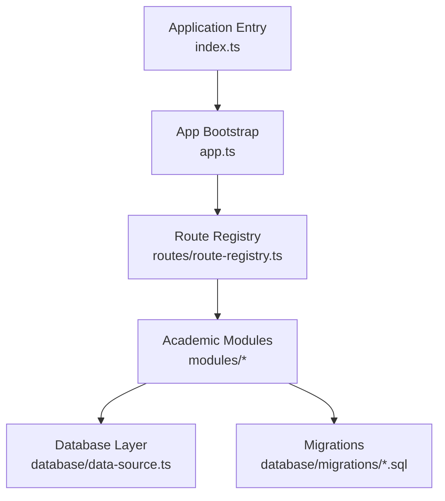
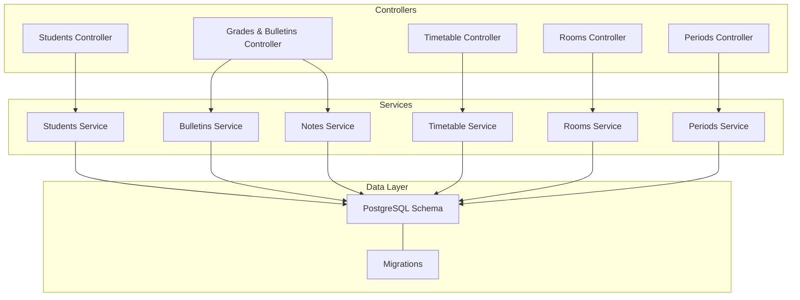
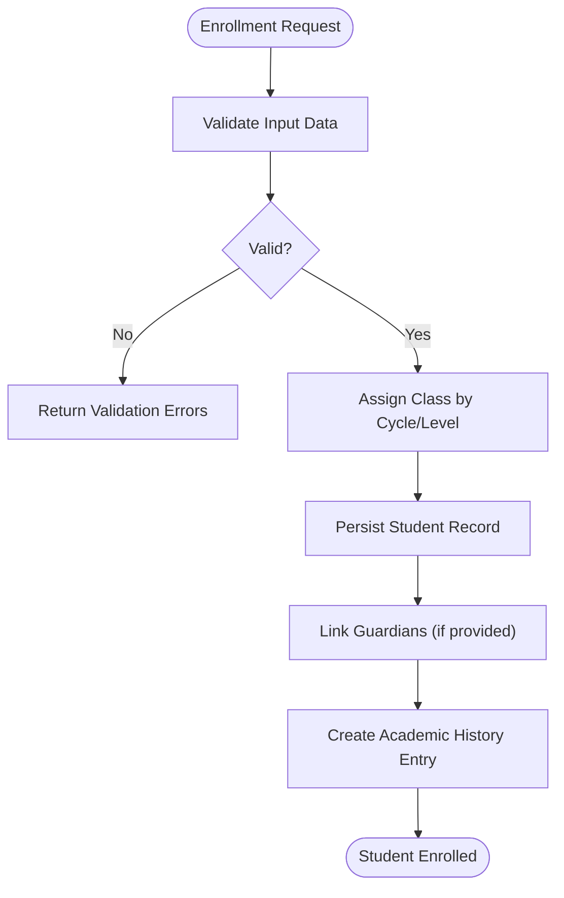
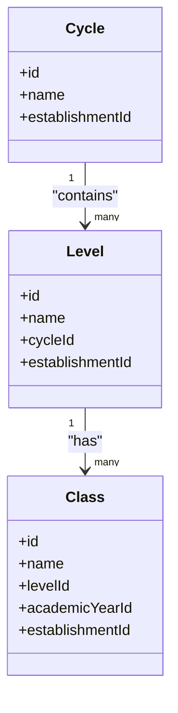
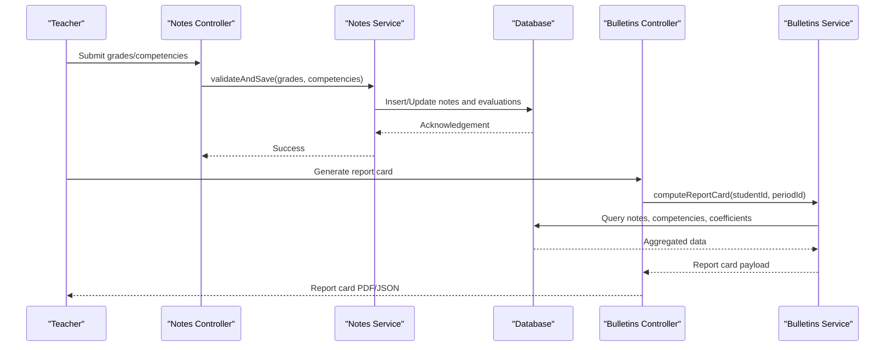
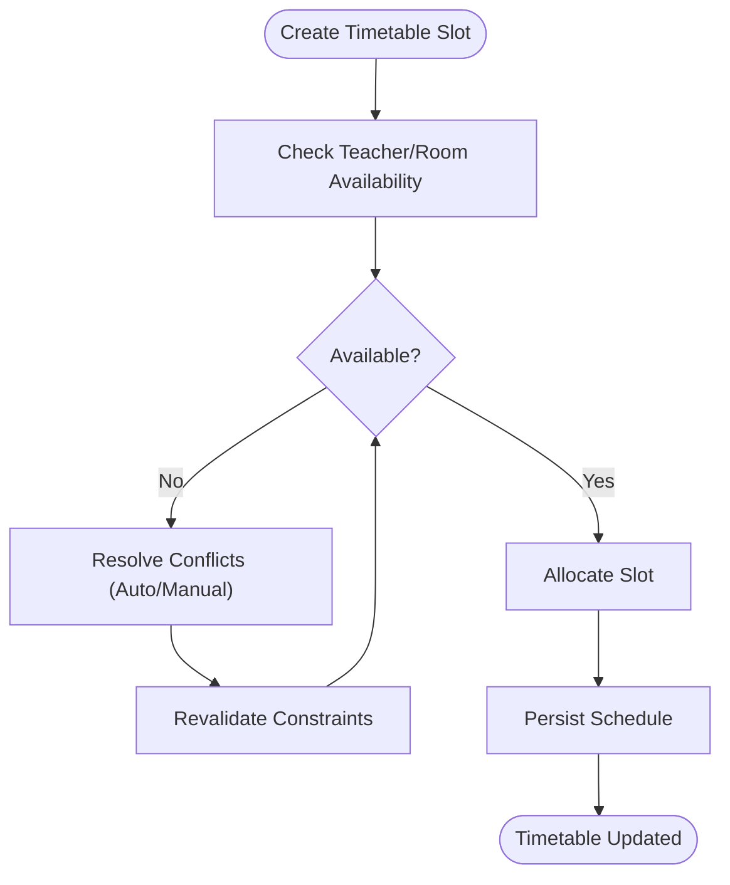
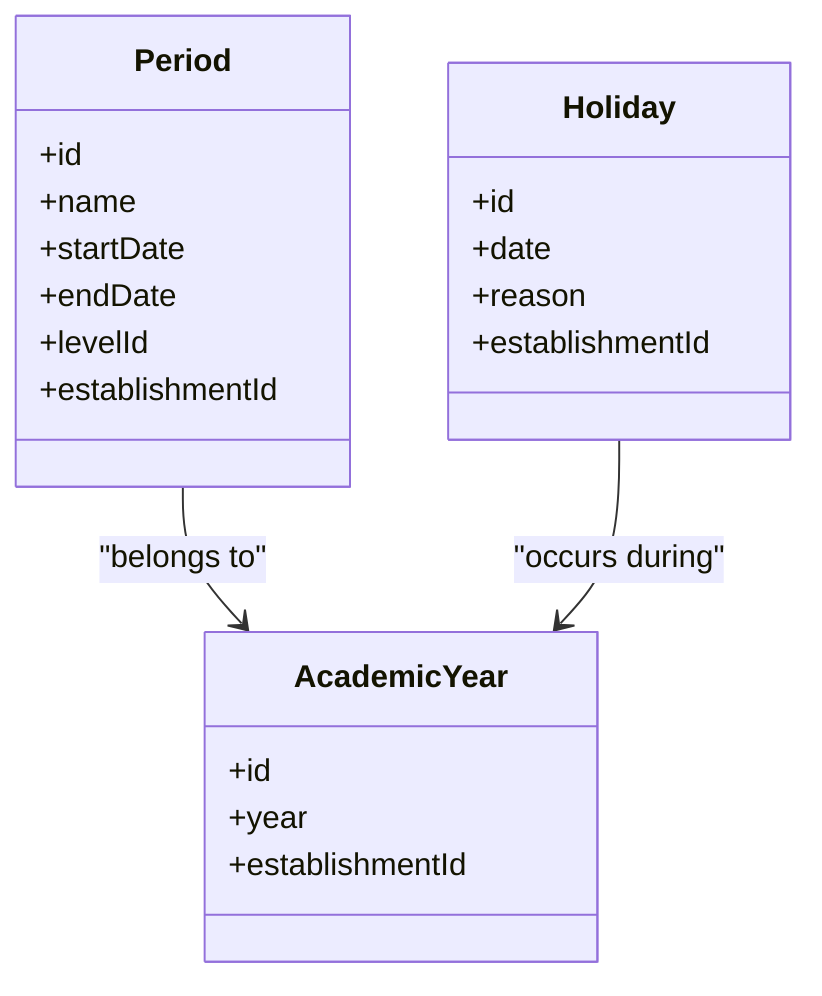
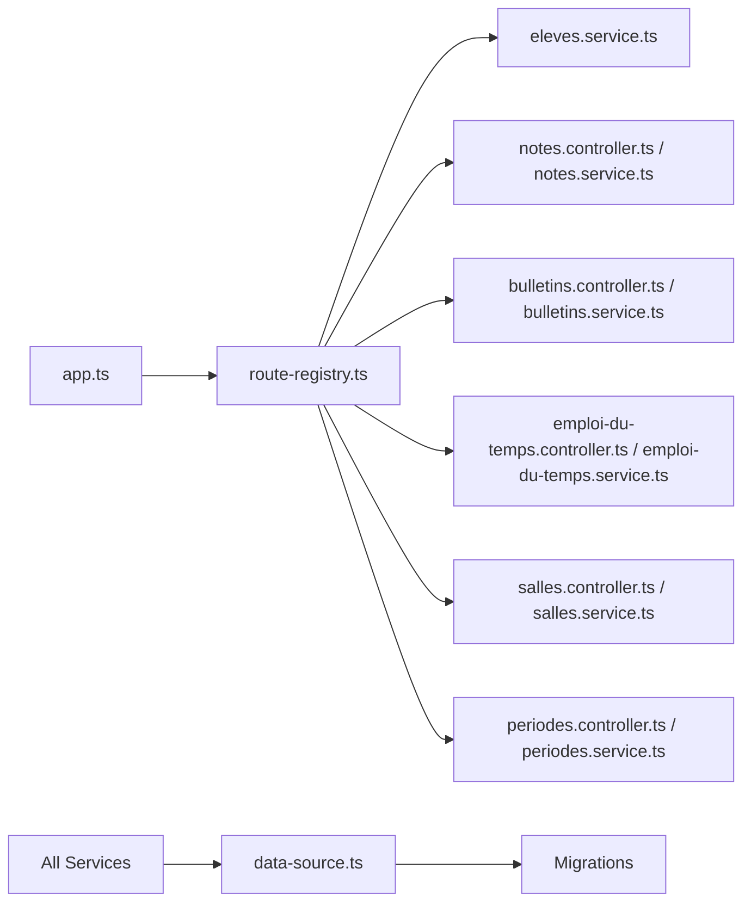

# Academic Management System

<cite>
**Referenced Files in This Document**
- [app.ts](file://backend/src/app.ts)
- [index.ts](file://backend/src/index.ts)
- [route-registry.ts](file://backend/src/routes/route-registry.ts)
- [data-source.ts](file://backend/src/database/data-source.ts)
- [043-structure-academique-v4.sql](file://backend/database/migrations/043-structure-academique-v4.sql)
- [053-structure-academique-complete.sql](file://backend/database/migrations/053-structure-academique-complete.sql)
- [054-refonte-structure-academique-v2.sql](file://backend/database/migrations/054-refonte-structure-academique-v2.sql)
- [058-multi-tenant-structure-academique.sql](file://backend/database/migrations/058-multi-tenant-structure-academique.sql)
- [061-creer-table-bulletins-matieres.sql](file://backend/database/migrations/061-creer-table-bulletins-matieres.sql)
- [062-creer-table-evaluations-competences.sql](file://backend/database/migrations/062-creer-table-evaluations-competences.sql)
- [063-creer-module-emploi-du-temps.sql](file://backend/database/migrations/063-creer-module-emploi-du-temps.sql)
- [070-module-salles.sql](file://backend/database/migrations/070-module-salles.sql)
- [102-periodes-hierarchie.sql](file://backend/database/migrations/102-periodes-hierarchie.sql)
- [104-refonte-periodes-niveaux-configurables.sql](file://backend/database/migrations/104-refonte-periodes-niveaux-configurables.sql)
- [eleves.service.ts](file://backend/src/modules/eleves/services/eleves.service.ts)
- [bulletins.controller.ts](file://backend/src/modules/bulletins/controllers/bulletins.controller.ts)
- [bulletins.service.ts](file://backend/src/modules/bulletins/services/bulletins.service.ts)
- [notes.controller.ts](file://backend/src/modules/notes/controllers/notes.controller.ts)
- [notes.service.ts](file://backend/src/modules/notes/services/notes.service.ts)
- [emploi-du-temps.controller.ts](file://backend/src/modules/emploi-du-temps/controllers/emploi-du-temps.controller.ts)
- [emploi-du-temps.service.ts](file://backend/src/modules/emploi-du-temps/services/emploi-du-temps.service.ts)
- [salles.controller.ts](file://backend/src/modules/salles/controllers/salles.controller.ts)
- [salles.service.ts](file://backend/src/modules/salles/services/salles.service.ts)
- [periodes.controller.ts](file://backend/src/modules/periodes/controllers/periodes.controller.ts)
- [periodes.service.ts](file://backend/src/modules/periodes/services/periodes.service.ts)
</cite>

## Table of Contents
1. [Introduction](#introduction)
2. [Project Structure](#project-structure)
3. [Core Components](#core-components)
4. [Architecture Overview](#architecture-overview)
5. [Detailed Component Analysis](#detailed-component-analysis)
6. [Dependency Analysis](#dependency-analysis)
7. [Performance Considerations](#performance-considerations)
8. [Troubleshooting Guide](#troubleshooting-guide)
9. [Conclusion](#conclusion)
10. [Appendices](#appendices)

## Introduction
This document provides comprehensive documentation for eLISAschool’s academic management system, focusing on student information, class scheduling, grade processing, and academic calendar management. It explains the complete student lifecycle from enrollment through graduation, including profile management and academic history tracking. It details the class structure hierarchy with cycles, levels, and classes; the competency-based assessment system; grade calculation rules; report card generation; timetable creation; room allocation; conflict resolution; and the academic calendar system with period management and holiday configuration. Practical examples of common workflows and integration patterns are included, along with data validation, business rules, and performance optimization strategies for large student populations.

## Project Structure
The backend is organized as a modular NestJS application with feature modules under src/modules, database migrations under database/migrations, and shared utilities under src/common. The application bootstraps via index.ts, configures dependencies in app.ts, and registers routes using a central registry.

**Diagram sources**
- [index.ts:1-50](file://backend/src/index.ts#L1-L50)
- [app.ts:1-120](file://backend/src/app.ts#L1-L120)
- [route-registry.ts:1-200](file://backend/src/routes/route-registry.ts#L1-L200)
- [data-source.ts:1-120](file://backend/src/database/data-source.ts#L1-L120)

**Section sources**
- [index.ts:1-50](file://backend/src/index.ts#L1-L50)
- [app.ts:1-120](file://backend/src/app.ts#L1-L120)
- [route-registry.ts:1-200](file://backend/src/routes/route-registry.ts#L1-L200)
- [data-source.ts:1-120](file://backend/src/database/data-source.ts#L1-L120)

## Core Components
- Student Information Management: Enrollment, profile updates, guardian linkage, and academic history tracking.
- Class Structure Hierarchy: Cycles, Levels, Classes, and multi-tenant scoping.
- Assessment and Grades: Competency evaluations, grading scales, weighted calculations, and report cards.
- Timetable and Room Allocation: Weekly schedules, teacher/classroom constraints, and conflict detection.
- Academic Calendar: Periods, holidays, and configurable term structures per level.

Key implementation paths:
- Students: [eleves.service.ts](file://backend/src/modules/eleves/services/eleves.service.ts)
- Grading and Report Cards: [bulletins.controller.ts](file://backend/src/modules/bulletins/controllers/bulletins.controller.ts), [bulletins.service.ts](file://backend/src/modules/bulletins/services/bulletins.service.ts), [notes.controller.ts](file://backend/src/modules/notes/controllers/notes.controller.ts), [notes.service.ts](file://backend/src/modules/notes/services/notes.service.ts)
- Timetable and Rooms: [emploi-du-temps.controller.ts](file://backend/src/modules/emploi-du-temps/controllers/emploi-du-temps.controller.ts), [emploi-du-temps.service.ts](file://backend/src/modules/emploi-du-temps/services/emploi-du-temps.service.ts), [salles.controller.ts](file://backend/src/modules/salles/controllers/salles.controller.ts), [salles.service.ts](file://backend/src/modules/salles/services/salles.service.ts)
- Academic Calendar: [periodes.controller.ts](file://backend/src/modules/periodes/controllers/periodes.controller.ts), [periodes.service.ts](file://backend/src/modules/periodes/services/periodes.service.ts)

**Section sources**
- [eleves.service.ts:1-200](file://backend/src/modules/eleves/services/eleves.service.ts#L1-L200)
- [bulletins.controller.ts:1-120](file://backend/src/modules/bulletins/controllers/bulletins.controller.ts#L1-L120)
- [bulletins.service.ts:1-200](file://backend/src/modules/bulletins/services/bulletins.service.ts#L1-L200)
- [notes.controller.ts:1-120](file://backend/src/modules/notes/controllers/notes.controller.ts#L1-L120)
- [notes.service.ts:1-200](file://backend/src/modules/notes/services/notes.service.ts#L1-L200)
- [emploi-du-temps.controller.ts:1-120](file://backend/src/modules/emploi-du-temps/controllers/emploi-du-temps.controller.ts#L1-L120)
- [emploi-du-temps.service.ts:1-200](file://backend/src/modules/emploi-du-temps/services/emploi-du-temps.service.ts#L1-L200)
- [salles.controller.ts:1-120](file://backend/src/modules/salles/controllers/salles.controller.ts#L1-L120)
- [salles.service.ts:1-200](file://backend/src/modules/salles/services/salles.service.ts#L1-L200)
- [periodes.controller.ts:1-120](file://backend/src/modules/periodes/controllers/periodes.controller.ts#L1-L120)
- [periodes.service.ts:1-200](file://backend/src/modules/periodes/services/periodes.service.ts#L1-L200)

## Architecture Overview
The academic subsystem follows a layered architecture: controllers expose REST endpoints, services implement business logic, and repositories access the relational schema defined by migrations. Multi-tenancy ensures isolation across establishments.

**Diagram sources**
- [bulletins.controller.ts:1-120](file://backend/src/modules/bulletins/controllers/bulletins.controller.ts#L1-L120)
- [bulletins.service.ts:1-200](file://backend/src/modules/bulletins/services/bulletins.service.ts#L1-L200)
- [notes.controller.ts:1-120](file://backend/src/modules/notes/controllers/notes.controller.ts#L1-L120)
- [notes.service.ts:1-200](file://backend/src/modules/notes/services/notes.service.ts#L1-L200)
- [emploi-du-temps.controller.ts:1-120](file://backend/src/modules/emploi-du-temps/controllers/emploi-du-temps.controller.ts#L1-L120)
- [emploi-du-temps.service.ts:1-200](file://backend/src/modules/emploi-du-temps/services/emploi-du-temps.service.ts#L1-L200)
- [salles.controller.ts:1-120](file://backend/src/modules/salles/controllers/salles.controller.ts#L1-L120)
- [salles.service.ts:1-200](file://backend/src/modules/salles/services/salles.service.ts#L1-L200)
- [periodes.controller.ts:1-120](file://backend/src/modules/periodes/controllers/periodes.controller.ts#L1-L120)
- [periodes.service.ts:1-200](file://backend/src/modules/periodes/services/periodes.service.ts#L1-L200)
- [data-source.ts:1-120](file://backend/src/database/data-source.ts#L1-L120)

## Detailed Component Analysis

### Student Lifecycle and Profile Management
- Enrollment: Create student profiles, link to establishment and academic year, assign to initial class based on cycle/level.
- Profile Updates: Maintain personal data, guardians, medical records, and contact info.
- Academic History: Track enrollments, class changes, promotions, and graduations.
- Validation: Enforce uniqueness of identifiers, required fields, and referential integrity with classes and years.

**Diagram sources**
- [eleves.service.ts:1-200](file://backend/src/modules/eleves/services/eleves.service.ts#L1-L200)

**Section sources**
- [eleves.service.ts:1-200](file://backend/src/modules/eleves/services/eleves.service.ts#L1-L200)

### Class Structure Hierarchy: Cycles, Levels, Classes
- Cycles group educational stages (e.g., primary, secondary).
- Levels define specific grades within cycles.
- Classes represent actual teaching groups within a level and academic year.
- Multi-tenant scoping ensures each establishment has independent hierarchies.

**Diagram sources**
- [043-structure-academique-v4.sql:1-200](file://backend/database/migrations/043-structure-academique-v4.sql#L1-L200)
- [053-structure-academique-complete.sql:1-200](file://backend/database/migrations/053-structure-academique-complete.sql#L1-L200)
- [054-refonte-structure-academique-v2.sql:1-200](file://backend/database/migrations/054-refonte-structure-academique-v2.sql#L1-L200)
- [058-multi-tenant-structure-academique.sql:1-200](file://backend/database/migrations/058-multi-tenant-structure-academique.sql#L1-L200)

**Section sources**
- [043-structure-academique-v4.sql:1-200](file://backend/database/migrations/043-structure-academique-v4.sql#L1-L200)
- [053-structure-academique-complete.sql:1-200](file://backend/database/migrations/053-structure-academique-complete.sql#L1-L200)
- [054-refonte-structure-academique-v2.sql:1-200](file://backend/database/migrations/054-refonte-structure-academique-v2.sql#L1-L200)
- [058-multi-tenant-structure-academique.sql:1-200](file://backend/database/migrations/058-multi-tenant-structure-academique.sql#L1-L200)

### Competency-Based Assessment and Grade Processing
- Competencies: Define measurable skills per subject and level.
- Evaluations: Assess students against competencies with scores or descriptors.
- Notes: Traditional numeric grades linked to subjects, periods, and coefficients.
- Bulletins: Aggregate notes and competencies into report cards with calculated averages and remarks.

**Diagram sources**
- [notes.controller.ts:1-120](file://backend/src/modules/notes/controllers/notes.controller.ts#L1-L120)
- [notes.service.ts:1-200](file://backend/src/modules/notes/services/notes.service.ts#L1-L200)
- [bulletins.controller.ts:1-120](file://backend/src/modules/bulletins/controllers/bulletins.controller.ts#L1-L120)
- [bulletins.service.ts:1-200](file://backend/src/modules/bulletins/services/bulletins.service.ts#L1-L200)

**Section sources**
- [notes.controller.ts:1-120](file://backend/src/modules/notes/controllers/notes.controller.ts#L1-L120)
- [notes.service.ts:1-200](file://backend/src/modules/notes/services/notes.service.ts#L1-L200)
- [bulletins.controller.ts:1-120](file://backend/src/modules/bulletins/controllers/bulletins.controller.ts#L1-L120)
- [bulletins.service.ts:1-200](file://backend/src/modules/bulletins/services/bulletins.service.ts#L1-L200)
- [061-creer-table-bulletins-matieres.sql:1-200](file://backend/database/migrations/061-creer-table-bulletins-matieres.sql#L1-L200)
- [062-creer-table-evaluations-competences.sql:1-200](file://backend/database/migrations/062-creer-table-evaluations-competences.sql#L1-L200)

### Timetable Creation, Room Allocation, and Conflict Resolution
- Timetable: Assign teachers, classes, and rooms to time slots across the week.
- Constraints: Teacher availability, classroom capacity, subject requirements.
- Conflict Detection: Prevent double-booking of teachers and rooms; resolve overlaps automatically or flag for manual review.

**Diagram sources**
- [emploi-du-temps.controller.ts:1-120](file://backend/src/modules/emploi-du-temps/controllers/emploi-du-temps.controller.ts#L1-L120)
- [emploi-du-temps.service.ts:1-200](file://backend/src/modules/emploi-du-temps/services/emploi-du-temps.service.ts#L1-L200)
- [salles.controller.ts:1-120](file://backend/src/modules/salles/controllers/salles.controller.ts#L1-L120)
- [salles.service.ts:1-200](file://backend/src/modules/salles/services/salles.service.ts#L1-L200)
- [063-creer-module-emploi-du-temps.sql:1-200](file://backend/database/migrations/063-creer-module-emploi-du-temps.sql#L1-L200)
- [070-module-salles.sql:1-200](file://backend/database/migrations/070-module-salles.sql#L1-L200)

**Section sources**
- [emploi-du-temps.controller.ts:1-120](file://backend/src/modules/emploi-du-temps/controllers/emploi-du-temps.controller.ts#L1-L120)
- [emploi-du-temps.service.ts:1-200](file://backend/src/modules/emploi-du-temps/services/emploi-du-temps.service.ts#L1-L200)
- [salles.controller.ts:1-120](file://backend/src/modules/salles/controllers/salles.controller.ts#L1-L120)
- [salles.service.ts:1-200](file://backend/src/modules/salles/services/salles.service.ts#L1-L200)
- [063-creer-module-emploi-du-temps.sql:1-200](file://backend/database/migrations/063-creer-module-emploi-du-temps.sql#L1-L200)
- [070-module-salles.sql:1-200](file://backend/database/migrations/070-module-salles.sql#L1-L200)

### Academic Calendar: Periods and Holidays
- Periods: Define terms, trimesters, or semesters with start/end dates.
- Hierarchical Periods: Support nested periods for reporting and grading windows.
- Configurable Structures: Allow per-level customization of period templates.
- Holidays: Mark non-teaching days affecting schedule and deadlines.

**Diagram sources**
- [102-periodes-hierarchie.sql:1-200](file://backend/database/migrations/102-periodes-hierarchie.sql#L1-L200)
- [104-refonte-periodes-niveaux-configurables.sql:1-200](file://backend/database/migrations/104-refonte-periodes-niveaux-configurables.sql#L1-L200)
- [periodes.controller.ts:1-120](file://backend/src/modules/periodes/controllers/periodes.controller.ts#L1-L120)
- [periodes.service.ts:1-200](file://backend/src/modules/periodes/services/periodes.service.ts#L1-L200)

**Section sources**
- [102-periodes-hierarchie.sql:1-200](file://backend/database/migrations/102-periodes-hierarchie.sql#L1-L200)
- [104-refonte-periodes-niveaux-configurables.sql:1-200](file://backend/database/migrations/104-refonte-periodes-niveaux-configurables.sql#L1-L200)
- [periodes.controller.ts:1-120](file://backend/src/modules/periodes/controllers/periodes.controller.ts#L1-L120)
- [periodes.service.ts:1-200](file://backend/src/modules/periodes/services/periodes.service.ts#L1-L200)

### Practical Workflows and Integration Patterns
- Enrollment Workflow:
  - Validate student data and prerequisites.
  - Assign class based on cycle/level mapping.
  - Create academic history entry and notify stakeholders.
- Grading Workflow:
  - Teachers submit notes and competency evaluations.
  - System validates ranges and coefficients.
  - Bulletins service computes averages and generates report cards.
- Timetabling Workflow:
  - Admins create weekly templates.
  - Service checks constraints and resolves conflicts.
  - Finalized schedule published to teachers and classrooms.

Integration patterns:
- Event-driven notifications for enrollment and grade publication.
- Batch processing for bulk timetable generation and report card printing.
- API composition for cross-module queries (students, classes, periods).

[No sources needed since this section aggregates previously analyzed components]

## Dependency Analysis
The academic modules depend on shared infrastructure (routing, database connection) and on each other indirectly via the database schema. Controllers rely on services; services interact with entities defined by migrations.

**Diagram sources**
- [app.ts:1-120](file://backend/src/app.ts#L1-L120)
- [route-registry.ts:1-200](file://backend/src/routes/route-registry.ts#L1-L200)
- [data-source.ts:1-120](file://backend/src/database/data-source.ts#L1-L120)

**Section sources**
- [app.ts:1-120](file://backend/src/app.ts#L1-L120)
- [route-registry.ts:1-200](file://backend/src/routes/route-registry.ts#L1-L200)
- [data-source.ts:1-120](file://backend/src/database/data-source.ts#L1-L120)

## Performance Considerations
- Indexing: Ensure indexes on foreign keys (student-class, class-period, teacher-room) and frequently filtered columns (establishmentId, academicYearId).
- Pagination: Use server-side pagination for large lists (students, timetables, reports).
- Caching: Cache static references (cycles, levels, rooms) and computed report summaries where appropriate.
- Batch Operations: Process bulk enrollments and timetable assignments in transactions to reduce round-trips.
- Query Optimization: Avoid N+1 queries by joining related tables or using batched selects.

[No sources needed since this section provides general guidance]

## Troubleshooting Guide
Common issues and resolutions:
- Duplicate student identifiers: Validate uniqueness at controller/service layer and enforce database constraints.
- Timetable conflicts: Implement pre-save conflict checks and provide conflict reports for manual resolution.
- Grade range violations: Enforce min/max bounds and coefficient consistency before persisting.
- Period overlap: Validate non-overlapping periods per level and establishment.
- Multi-tenant leakage: Ensure all queries scope by establishmentId and use middleware guards.

Operational tips:
- Enable detailed logging around critical operations (enrollment, grading, scheduling).
- Use migration rollback scripts when schema changes cause inconsistencies.
- Monitor slow queries and adjust indexes accordingly.

[No sources needed since this section provides general guidance]

## Conclusion
eLISAschool’s academic management system provides a robust foundation for managing student lifecycles, class hierarchies, assessments, timetables, and academic calendars. Its modular architecture, clear separation of concerns, and strong database schema design support scalability and maintainability. By adhering to the documented workflows, validation rules, and performance practices, institutions can efficiently operate large student populations while ensuring data integrity and user experience.

[No sources needed since this section summarizes without analyzing specific files]

## Appendices
- Migration References:
  - Academic structure: [043-structure-academique-v4.sql](file://backend/database/migrations/043-structure-academique-v4.sql), [053-structure-academique-complete.sql](file://backend/database/migrations/053-structure-academique-complete.sql), [054-refonte-structure-academique-v2.sql](file://backend/database/migrations/054-refonte-structure-academique-v2.sql), [058-multi-tenant-structure-academique.sql](file://backend/database/migrations/058-multi-tenant-structure-academique.sql)
  - Grading and competencies: [061-creer-table-bulletins-matieres.sql](file://backend/database/migrations/061-creer-table-bulletins-matieres.sql), [062-creer-table-evaluations-competences.sql](file://backend/database/migrations/062-creer-table-evaluations-competences.sql)
  - Timetable and rooms: [063-creer-module-emploi-du-temps.sql](file://backend/database/migrations/063-creer-module-emploi-du-temps.sql), [070-module-salles.sql](file://backend/database/migrations/070-module-salles.sql)
  - Periods and calendar: [102-periodes-hierarchie.sql](file://backend/database/migrations/102-periodes-hierarchie.sql), [104-refonte-periodes-niveaux-configurables.sql](file://backend/database/migrations/104-refonte-periodes-niveaux-configurables.sql)