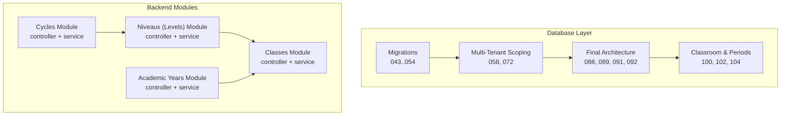
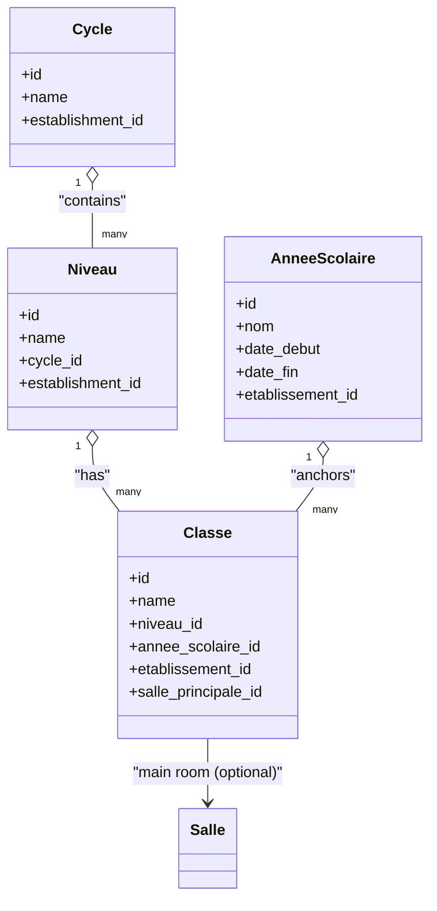
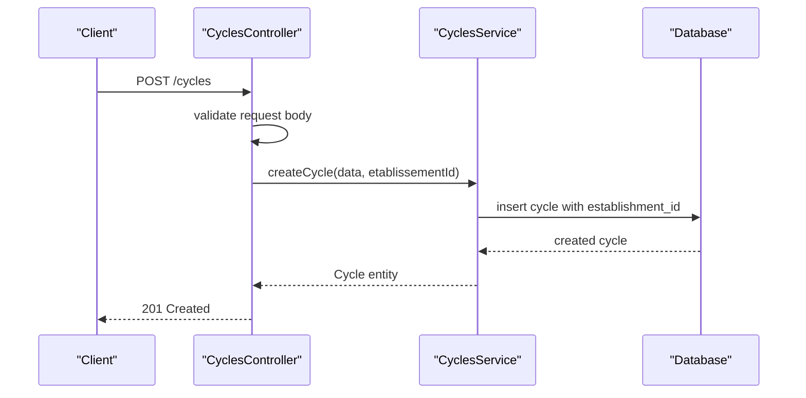
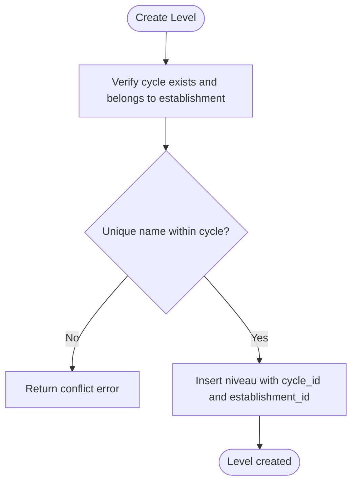
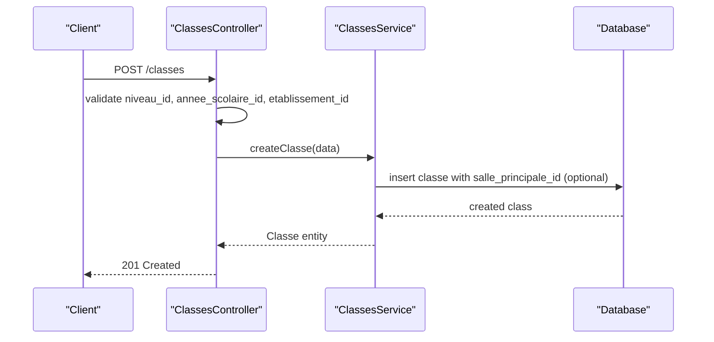
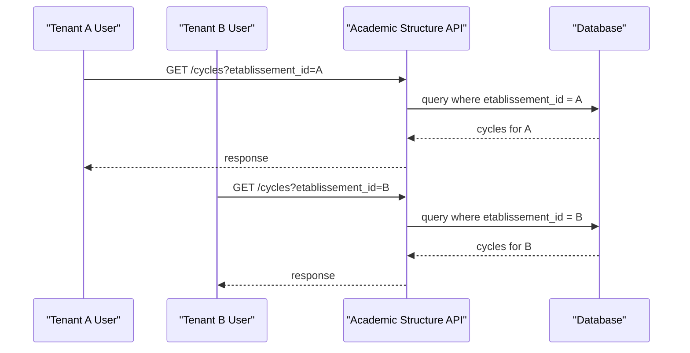
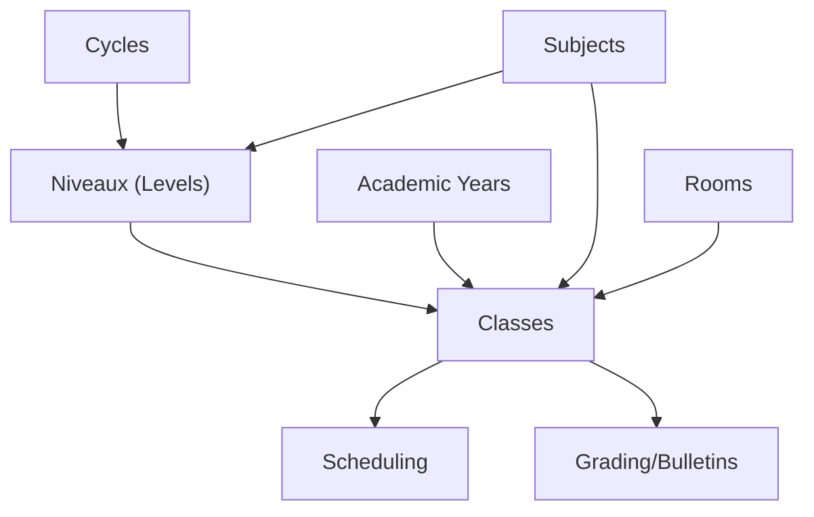

# Academic Structure Management

<cite>
**Referenced Files in This Document**
- [043-structure-academique-v4.sql](file://backend/database/migrations/043-structure-academique-v4.sql)
- [053-structure-academique-complete.sql](file://backend/database/migrations/053-structure-academique-complete.sql)
- [054-refonte-structure-academique-v2.sql](file://backend/database/migrations/054-refonte-structure-academique-v2.sql)
- [058-multi-tenant-structure-academique.sql](file://backend/database/migrations/058-multi-tenant-structure-academique.sql)
- [072-scoping-cycles-niveaux.sql](file://backend/database/migrations/072-scoping-cycles-niveaux.sql)
- [088-refactorisation-architecture-academique.sql](file://backend/database/migrations/088-refactorisation-architecture-academique.sql)
- [089-finalisation-architecture-academique-v2.sql](file://backend/database/migrations/089-finalisation-architecture-academique-v2.sql)
- [091-peuplement-architecture-academique.sql](file://backend/database/migrations/091-peuplement-architecture-academique.sql)
- [092-refactorisation-classeAnneeId.sql](file://backend/database/migrations/092-refactorisation-classeAnneeId.sql)
- [100-classes-salle-principale.sql](file://backend/database/migrations/100-classes-salle-principale.sql)
- [102-periodes-hierarchie.sql](file://backend/database/migrations/102-periodes-hierarchie.sql)
- [104-refonte-periodes-niveaux-configurables.sql](file://backend/database/migrations/104-refonte-periodes-niveaux-configurables.sql)
- [cycles.controller.ts](file://backend/src/modules/cycles/cycles.controller.ts)
- [cycles.service.ts](file://backend/src/modules/cycles/cycles.service.ts)
- [niveaux.controller.ts](file://backend/src/modules/niveaux/niveaux.controller.ts)
- [niveaux.service.ts](file://backend/src/modules/niveaux/niveaux.service.ts)
- [classes.controller.ts](file://backend/src/modules/classes/classes.controller.ts)
- [classes.service.ts](file://backend/src/modules/classes/classes.service.ts)
- [annees-scolaires.controller.ts](file://backend/src/modules/annees-scolaires/annees-scolaires.controller.ts)
- [annees-scolaires.service.ts](file://backend/src/modules/annees-scolaires/annees-scolaires.service.ts)
- [emploi-du-temps.controller.ts](file://backend/src/modules/emploi-du-temps/emploi-du-temps.controller.ts)
- [bulletins.controller.ts](file://backend/src/modules/bulletins/bulletins.controller.ts)
- [matieres.controller.ts](file://backend/src/modules/matieres/matieres.controller.ts)
- [eleves.controller.ts](file://backend/src/modules/eleves/eleves.controller.ts)
- [multi-tenant-isolation.test.ts](file://backend/test/multi-tenant-isolation.test.ts)
</cite>

## Table of Contents
1. [Introduction](#introduction)
2. [Project Structure](#project-structure)
3. [Core Components](#core-components)
4. [Architecture Overview](#architecture-overview)
5. [Detailed Component Analysis](#detailed-component-analysis)
6. [Dependency Analysis](#dependency-analysis)
7. [Performance Considerations](#performance-considerations)
8. [Troubleshooting Guide](#troubleshooting-guide)
9. [Conclusion](#conclusion)
10. [Appendices](#appendices)

## Introduction
This document explains eLISAschool’s Academic Structure Management system, focusing on how educational institutions are modeled as a hierarchy of cycles (primary, secondary), levels (grade levels), and classes within each level. It also documents the relationship between academic structures and multi-tenant architecture, the creation and management of academic years, class composition, student enrollment workflows, integration with curriculum systems, and downstream effects on scheduling and grading. Practical examples include structure configuration patterns, hierarchy validation rules, and data migration strategies used to evolve the schema safely.

## Project Structure
The academic structure is implemented across database migrations and backend modules:
- Database layer: A series of migrations define and refine the entities for cycles, levels, classes, and their relationships, including scoping to establishments and academic years.
- Backend modules: Controllers and services expose APIs for creating and managing cycles, levels, classes, and academic years, enforcing multi-tenant isolation and business rules.

**Diagram sources**
- [043-structure-academique-v4.sql](file://backend/database/migrations/043-structure-academique-v4.sql)
- [053-structure-academique-complete.sql](file://backend/database/migrations/053-structure-academique-complete.sql)
- [054-refonte-structure-academique-v2.sql](file://backend/database/migrations/054-refonte-structure-academique-v2.sql)
- [058-multi-tenant-structure-academique.sql](file://backend/database/migrations/058-multi-tenant-structure-academique.sql)
- [072-scoping-cycles-niveaux.sql](file://backend/database/migrations/072-scoping-cycles-niveaux.sql)
- [088-refactorisation-architecture-academique.sql](file://backend/database/migrations/088-refactorisation-architecture-academique.sql)
- [089-finalisation-architecture-academique-v2.sql](file://backend/database/migrations/089-finalisation-architecture-academique-v2.sql)
- [091-peuplement-architecture-academique.sql](file://backend/database/migrations/091-peuplement-architecture-academique.sql)
- [092-refactorisation-classeAnneeId.sql](file://backend/database/migrations/092-refactorisation-classeAnneeId.sql)
- [100-classes-salle-principale.sql](file://backend/database/migrations/100-classes-salle-principale.sql)
- [102-periodes-hierarchie.sql](file://backend/database/migrations/102-periodes-hierarchie.sql)
- [104-refonte-periodes-niveaux-configurables.sql](file://backend/database/migrations/104-refonte-periodes-niveaux-configurables.sql)

**Section sources**
- [043-structure-academique-v4.sql](file://backend/database/migrations/043-structure-academique-v4.sql)
- [053-structure-academique-complete.sql](file://backend/database/migrations/053-structure-academique-complete.sql)
- [054-refonte-structure-academique-v2.sql](file://backend/database/migrations/054-refonte-structure-academique-v2.sql)
- [058-multi-tenant-structure-academique.sql](file://backend/database/migrations/058-multi-tenant-structure-academique.sql)
- [072-scoping-cycles-niveaux.sql](file://backend/database/migrations/072-scoping-cycles-niveaux.sql)
- [088-refactorisation-architecture-academique.sql](file://backend/database/migrations/088-refactorisation-architecture-academique.sql)
- [089-finalisation-architecture-academique-v2.sql](file://backend/database/migrations/089-finalisation-architecture-academique-v2.sql)
- [091-peuplement-architecture-academique.sql](file://backend/database/migrations/091-peuplement-architecture-academique.sql)
- [092-refactorisation-classeAnneeId.sql](file://backend/database/migrations/092-refactorisation-classeAnneeId.sql)
- [100-classes-salle-principale.sql](file://backend/database/migrations/100-classes-salle-principale.sql)
- [102-periodes-hierarchie.sql](file://backend/database/migrations/102-periodes-hierarchie.sql)
- [104-refonte-periodes-niveaux-configurables.sql](file://backend/database/migrations/104-refonte-periodes-niveaux-configurables.sql)

## Core Components
- Cycles: Top-level educational phases (e.g., primary, secondary). Each cycle belongs to an establishment and may be scoped per tenant context.
- Levels (Niveaux): Grade levels within a cycle (e.g., grade 1, grade 2). Levels reference their parent cycle and are scoped to the establishment.
- Classes: Concrete class instances within a level, typically associated with an academic year and optionally a main classroom.
- Academic Years: Time periods that anchor class composition and enrollment; classes link to an academic year.

Key responsibilities:
- Enforce hierarchical integrity (cycle → level → class).
- Ensure multi-tenant isolation by scoping all entities to an establishment.
- Provide APIs for CRUD operations and validations.

**Section sources**
- [cycles.controller.ts](file://backend/src/modules/cycles/cycles.controller.ts)
- [cycles.service.ts](file://backend/src/modules/cycles/cycles.service.ts)
- [niveaux.controller.ts](file://backend/src/modules/niveaux/niveaux.controller.ts)
- [niveaux.service.ts](file://backend/src/modules/niveaux/niveaux.service.ts)
- [classes.controller.ts](file://backend/src/modules/classes/classes.controller.ts)
- [classes.service.ts](file://backend/src/modules/classes/classes.service.ts)
- [annees-scolaires.controller.ts](file://backend/src/modules/annees-scolaires/annees-scolaires.controller.ts)
- [annees-scolaires.service.ts](file://backend/src/modules/annees-scolaires/annees-scolaires.service.ts)

## Architecture Overview
The academic structure follows a strict hierarchy and multi-tenant scoping model:
- Establishment (tenant) owns cycles, levels, classes, and academic years.
- Cycle contains multiple levels; each level contains multiple classes.
- Class references an academic year and can be linked to a main room.
- Downstream modules (scheduling, grading, curriculum) depend on this hierarchy.

**Diagram sources**
- [053-structure-academique-complete.sql](file://backend/database/migrations/053-structure-academique-complete.sql)
- [058-multi-tenant-structure-academique.sql](file://backend/database/migrations/058-multi-tenant-structure-academique.sql)
- [088-refactorisation-architecture-academique.sql](file://backend/database/migrations/088-refactorisation-architecture-academique.sql)
- [089-finalisation-architecture-academique-v2.sql](file://backend/database/migrations/089-finalisation-architecture-academique-v2.sql)
- [100-classes-salle-principale.sql](file://backend/database/migrations/100-classes-salle-principale.sql)

## Detailed Component Analysis

### Cycles Module
Responsibilities:
- Create, update, list, and delete cycles within an establishment.
- Validate uniqueness of cycle names per establishment.
- Enforce multi-tenant scoping so users cannot access another establishment’s cycles.

API workflow example:

**Diagram sources**
- [cycles.controller.ts](file://backend/src/modules/cycles/cycles.controller.ts)
- [cycles.service.ts](file://backend/src/modules/cycles/cycles.service.ts)

**Section sources**
- [cycles.controller.ts](file://backend/src/modules/cycles/cycles.controller.ts)
- [cycles.service.ts](file://backend/src/modules/cycles/cycles.service.ts)
- [043-structure-academique-v4.sql](file://backend/database/migrations/043-structure-academique-v4.sql)
- [053-structure-academique-complete.sql](file://backend/database/migrations/053-structure-academique-complete.sql)

### Niveaux (Levels) Module
Responsibilities:
- Manage levels within a specific cycle and establishment.
- Prevent duplicate level names within the same cycle and establishment.
- Maintain referential integrity to cycles.

Validation flow:

**Diagram sources**
- [niveaux.controller.ts](file://backend/src/modules/niveaux/niveaux.controller.ts)
- [niveaux.service.ts](file://backend/src/modules/niveaux/niveaux.service.ts)
- [053-structure-academique-complete.sql](file://backend/database/migrations/053-structure-academique-complete.sql)
- [072-scoping-cycles-niveaux.sql](file://backend/database/migrations/072-scoping-cycles-niveaux.sql)

**Section sources**
- [niveaux.controller.ts](file://backend/src/modules/niveaux/niveaux.controller.ts)
- [niveaux.service.ts](file://backend/src/modules/niveaux/niveaux.service.ts)
- [053-structure-academique-complete.sql](file://backend/database/migrations/053-structure-academique-complete.sql)
- [072-scoping-cycles-niveaux.sql](file://backend/database/migrations/072-scoping-cycles-niveaux.sql)

### Classes Module
Responsibilities:
- Create classes under a level and associate them with an academic year.
- Optionally assign a main classroom to a class.
- Enforce multi-tenant scoping and ensure valid references to niveau and annee_scolaire.

Class creation sequence:

**Diagram sources**
- [classes.controller.ts](file://backend/src/modules/classes/classes.controller.ts)
- [classes.service.ts](file://backend/src/modules/classes/classes.service.ts)
- [092-refactorisation-classeAnneeId.sql](file://backend/database/migrations/092-refactorisation-classeAnneeId.sql)
- [100-classes-salle-principale.sql](file://backend/database/migrations/100-classes-salle-principale.sql)

**Section sources**
- [classes.controller.ts](file://backend/src/modules/classes/classes.controller.ts)
- [classes.service.ts](file://backend/src/modules/classes/classes.service.ts)
- [092-refactorisation-classeAnneeId.sql](file://backend/database/migrations/092-refactorisation-classeAnneeId.sql)
- [100-classes-salle-principale.sql](file://backend/database/migrations/100-classes-salle-principale.sql)

### Academic Years Module
Responsibilities:
- Define academic year boundaries (start/end dates) per establishment.
- Anchor class composition and enrollment to a specific academic year.
- Support periodization and reporting tied to academic years.

Integration points:
- Classes reference an academic year.
- Scheduling and grading modules use academic year context to scope timetables and evaluations.

**Section sources**
- [annees-scolaires.controller.ts](file://backend/src/modules/annees-scolaires/annees-scolaires.controller.ts)
- [annees-scolaires.service.ts](file://backend/src/modules/annees-scolaires/annees-scolaires.service.ts)
- [091-peuplement-architecture-academique.sql](file://backend/database/migrations/091-peuplement-architecture-academique.sql)

### Multi-Tenant Isolation
All academic structure entities are scoped to an establishment. Access control ensures users operate only within their assigned establishment context. Tests verify isolation behavior.

Isolation verification:

**Diagram sources**
- [058-multi-tenant-structure-academique.sql](file://backend/database/migrations/058-multi-tenant-structure-academique.sql)
- [multi-tenant-isolation.test.ts](file://backend/test/multi-tenant-isolation.test.ts)

**Section sources**
- [058-multi-tenant-structure-academique.sql](file://backend/database/migrations/058-multi-tenant-structure-academique.sql)
- [multi-tenant-isolation.test.ts](file://backend/test/multi-tenant-isolation.test.ts)

### Curriculum Integration
Curriculum elements such as subjects (matières) are often assigned to levels or classes and may carry coefficients. The academic structure provides the target scope for these assignments.

Integration pattern:
- Subjects are associated with levels or classes within a specific establishment and academic year.
- Coefficients and evaluation templates can be configured at the subject-class or subject-level boundary.

**Section sources**
- [matieres.controller.ts](file://backend/src/modules/matieres/matieres.controller.ts)
- [059-ajouter-matiere-sous-systeme.sql](file://backend/database/migrations/059-ajouter-matiere-sous-systeme.sql)
- [060-ajouter-affectation-matiere-coefficient.sql](file://backend/database/migrations/060-ajouter-affectation-matiere-coefficient.sql)

### Scheduling Impact
Timetabling depends on classes, rooms, and academic years. The academic structure defines the containers (classes) and anchors (academic years) for scheduling.

Scheduling dependencies:
- Classes have optional main rooms.
- Timetable entries are created per class and academic year.

**Section sources**
- [emploi-du-temps.controller.ts](file://backend/src/modules/emploi-du-temps/emploi-du-temps.controller.ts)
- [100-classes-salle-principale.sql](file://backend/database/migrations/100-classes-salle-principale.sql)

### Grading Impact
Grades and evaluations are organized by academic year and class. The academic structure determines which students belong to which classes during a given academic year.

Grading dependencies:
- Evaluations and bulletins reference classes and academic years.
- Student enrollments tie individuals to classes within an academic year.

**Section sources**
- [bulletins.controller.ts](file://backend/src/modules/bulletins/bulletins.controller.ts)
- [eleves.controller.ts](file://backend/src/modules/eleves/eleves.controller.ts)
- [061-creer-table-bulletins-matieres.sql](file://backend/database/migrations/061-creer-table-bulletins-matieres.sql)
- [062-creer-table-evaluations-competences.sql](file://backend/database/migrations/062-creer-table-evaluations-competences.sql)

## Dependency Analysis
The academic structure forms the backbone for other modules:
- Cycles → Levels → Classes form the core hierarchy.
- Academic years anchor classes and drive scheduling and grading.
- Rooms integrate with classes for timetabling.
- Subjects integrate with levels/classes for curriculum and coefficients.

**Diagram sources**
- [053-structure-academique-complete.sql](file://backend/database/migrations/053-structure-academique-complete.sql)
- [088-refactorisation-architecture-academique.sql](file://backend/database/migrations/088-refactorisation-architecture-academique.sql)
- [089-finalisation-architecture-academique-v2.sql](file://backend/database/migrations/089-finalisation-architecture-academique-v2.sql)
- [100-classes-salle-principale.sql](file://backend/database/migrations/100-classes-salle-principale.sql)

**Section sources**
- [053-structure-academique-complete.sql](file://backend/database/migrations/053-structure-academique-complete.sql)
- [088-refactorisation-architecture-academique.sql](file://backend/database/migrations/088-refactorisation-architecture-academique.sql)
- [089-finalisation-architecture-academique-v2.sql](file://backend/database/migrations/089-finalisation-architecture-academique-v2.sql)
- [100-classes-salle-principale.sql](file://backend/database/migrations/100-classes-salle-principale.sql)

## Performance Considerations
- Use indexes on foreign keys (establishment_id, cycle_id, niveau_id, annee_scolaire_id) to optimize queries across tenants and hierarchies.
- Avoid deep joins when listing large datasets; prefer pagination and selective field retrieval.
- Cache frequently accessed static configurations (e.g., cycle and level catalogs) per establishment.
- Batch operations for bulk class composition updates to reduce transaction overhead.

[No sources needed since this section provides general guidance]

## Troubleshooting Guide
Common issues and resolutions:
- Multi-tenant access errors: Ensure requests include the correct establishment context and that user roles permit access to the specified establishment.
- Hierarchy validation failures: Verify that cycle and niveau references exist and belong to the same establishment.
- Class creation conflicts: Confirm unique class names within a level and academic year, and check that referenced niveau and annee_scolaire are valid.
- Room assignment problems: Ensure the main room exists and is available for the class’s schedule.

Operational checks:
- Review migration logs for failed steps (e.g., scoping changes, refactoring).
- Validate constraints via tests covering multi-tenant isolation and hierarchy integrity.

**Section sources**
- [058-multi-tenant-structure-academique.sql](file://backend/database/migrations/058-multi-tenant-structure-academique.sql)
- [072-scoping-cycles-niveaux.sql](file://backend/database/migrations/072-scoping-cycles-niveaux.sql)
- [088-refactorisation-architecture-academique.sql](file://backend/database/migrations/088-refactorisation-architecture-academique.sql)
- [089-finalisation-architecture-academique-v2.sql](file://backend/database/migrations/089-finalisation-architecture-academique-v2.sql)
- [092-refactorisation-classeAnneeId.sql](file://backend/database/migrations/092-refactorisation-classeAnneeId.sql)
- [multi-tenant-isolation.test.ts](file://backend/test/multi-tenant-isolation.test.ts)

## Conclusion
eLISAschool’s Academic Structure Management provides a robust, multi-tenant-aware hierarchy of cycles, levels, and classes anchored by academic years. This foundation enables reliable curriculum assignment, scheduling, and grading while ensuring data isolation across establishments. The migration history demonstrates careful evolution toward a final architecture that balances flexibility, performance, and maintainability.

[No sources needed since this section summarizes without analyzing specific files]

## Appendices

### Practical Examples

- Structure Configuration Example:
  - Create a cycle “Primary” for establishment A.
  - Add levels “Grade 1”, “Grade 2”, “Grade 3” under “Primary”.
  - For academic year 2025–2026, create classes “6A”, “6B” under “Grade 6” and assign a main room.

- Hierarchy Validation Example:
  - Attempting to create a level under a non-existent cycle returns a validation error.
  - Duplicate level names within the same cycle and establishment are rejected.

- Data Migration Patterns:
  - Introduce new columns gradually using additive migrations before enforcing constraints.
  - Refactor identifiers (e.g., classe_annee_id) in dedicated migrations to minimize downtime.
  - Populate seed data after structural migrations to bootstrap test environments.

**Section sources**
- [053-structure-academique-complete.sql](file://backend/database/migrations/053-structure-academique-complete.sql)
- [054-refonte-structure-academique-v2.sql](file://backend/database/migrations/054-refonte-structure-academique-v2.sql)
- [088-refactorisation-architecture-academique.sql](file://backend/database/migrations/088-refactorisation-architecture-academique.sql)
- [089-finalisation-architecture-academique-v2.sql](file://backend/database/migrations/089-finalisation-architecture-academique-v2.sql)
- [091-peuplement-architecture-academique.sql](file://backend/database/migrations/091-peuplement-architecture-academique.sql)
- [092-refactorisation-classeAnneeId.sql](file://backend/database/migrations/092-refactorisation-classeAnneeId.sql)