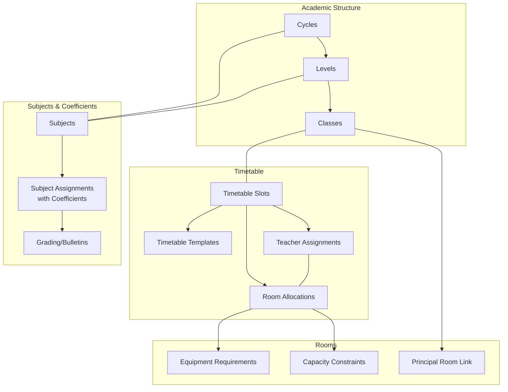
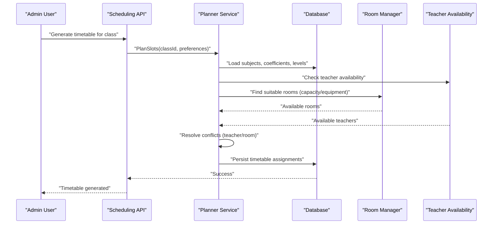
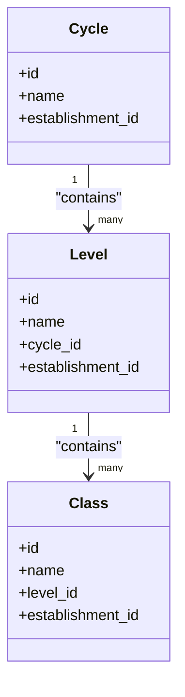
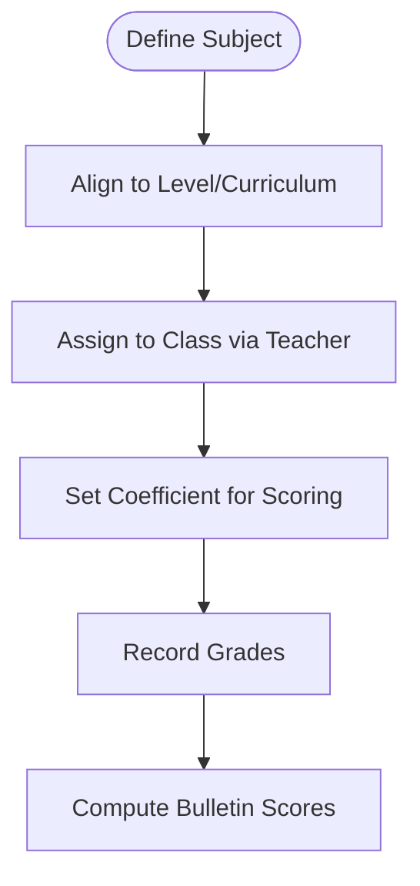
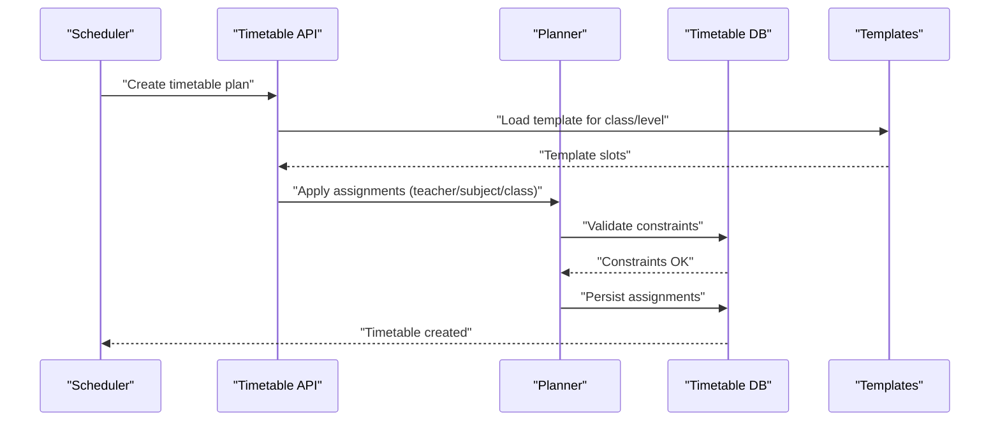
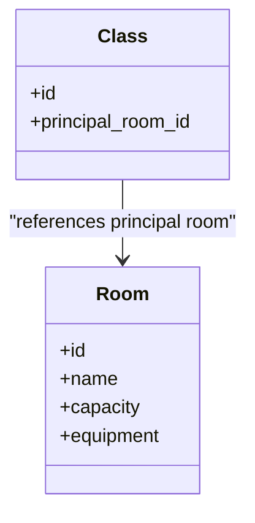
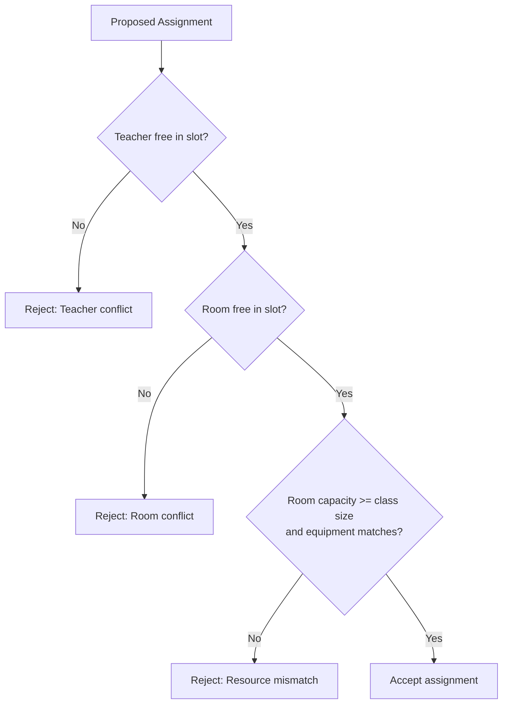
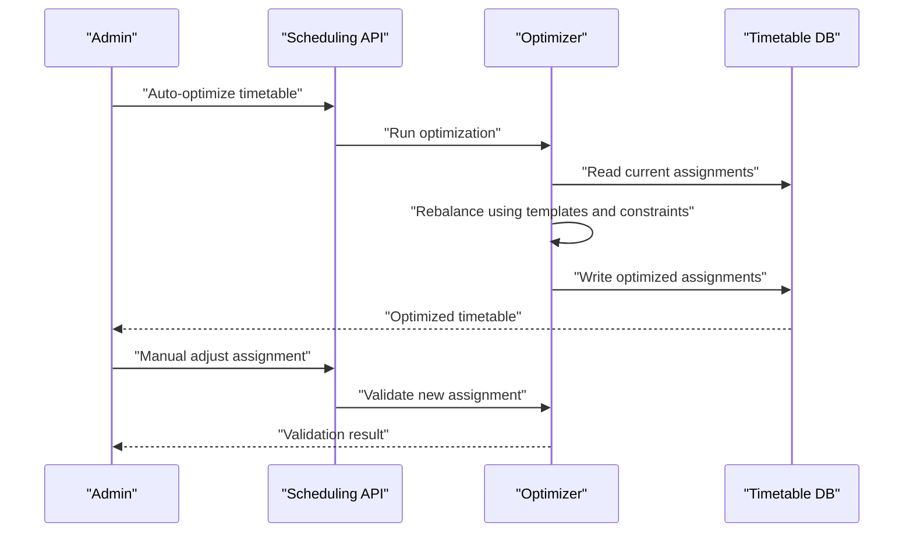
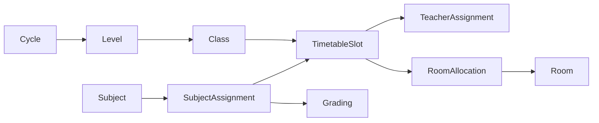

# Class & Schedule Management

<cite>
**Referenced Files in This Document**
- [063-creer-module-emploi-du-temps.sql](file://backend/database/migrations/063-creer-module-emploi-du-temps.sql)
- [065-creer-templates-emploi-du-temps.sql](file://backend/database/migrations/065-creer-templates-emploi-du-temps.sql)
- [070-module-salles.sql](file://backend/database/migrations/070-module-salles.sql)
- [100-classes-salle-principale.sql](file://backend/database/migrations/100-classes-salle-principale.sql)
- [088-refactorisation-architecture-academique.sql](file://backend/database/migrations/088-refactorisation-architecture-academique.sql)
- [089-finalisation-architecture-academique-v2.sql](file://backend/database/migrations/089-finalisation-architecture-academique-v2.sql)
- [090-correction-migration-088-camelcase.sql](file://backend/database/migrations/090-correction-migration-088-camelcase.sql)
- [091-peuplement-architecture-academique.sql](file://backend/database/migrations/091-peuplement-architecture-academique.sql)
- [092-refactorisation-classeAnneeId.sql](file://backend/database/migrations/092-refactorisation-classeAnneeId.sql)
- [059-ajouter-affectation-matiere-coefficient.sql](file://backend/database/migrations/059-ajouter-affectation-matiere-coefficient.sql)
- [060-ajouter-affectation-matiere-coefficient.sql](file://backend/database/migrations/060-ajouter-affectation-matiere-coefficient.sql)
- [061-creer-table-bulletins-matieres.sql](file://backend/database/migrations/061-creer-table-bulletins-matieres.sql)
- [044-module-organisation.sql](file://backend/database/migrations/044-module-organisation.sql)
- [045-organisation-optimisations.sql](file://backend/database/migrations/045-organisation-optimisations.sql)
- [046-organisation-performance-avancee.sql](file://backend/database/migrations/046-organisation-performance-avancee.sql)
- [053-structure-academique-complete.sql](file://backend/database/migrations/053-structure-academique-complete.sql)
- [054-refonte-structure-academique-v2.sql](file://backend/database/migrations/054-refonte-structure-academique-v2.sql)
- [055-structure-academique-ameliorations.sql](file://backend/database/migrations/055-structure-academique-ameliorations.sql)
- [056-suppression-cycle-scolaire.sql](file://backend/database/migrations/056-suppression-cycle-scolaire.sql)
- [057-supprimer-niveau-filiere-id.sql](file://backend/database/migrations/057-supprimer-niveau-filiere-id.sql)
- [058-multi-tenant-structure-academique.sql](file://backend/database/migrations/058-multi-tenant-structure-academique.sql)
- [072-scoping-cycles-niveaux.sql](file://backend/database/migrations/072-scoping-cycles-niveaux.sql)
- [074-matiere-niveau-unique-composite.sql](file://backend/database/migrations/074-matiere-niveau-unique-composite.sql)
- [086-affectation-matiere-etablissement-id.sql](file://backend/database/migrations/086-affectation-matiere-etablissement-id.sql)
- [087-affectation-matiere-verifications.sql](file://backend/database/migrations/087-affectation-matiere-verifications.sql)
- [084-cleanup-classe-id-notes.sql](file://backend/database/migrations/084-cleanup-classe-id-notes.sql)
- [050-multi-tenant-v3-max-etablissements.sql](file://backend/database/migrations/050-multi-tenant-v3-max-etablissements.sql)
- [051-champs-preinscription-enrichis.sql](file://backend/database/migrations/051-champs-preinscription-enrichis.sql)
- [052-approche-hybride-parents.sql](file://backend/database/migrations/052-approche-hybride-parents.sql)
- [054-structure-academique-complete-fr-en.sql](file://backend/database/migrations/054-structure-academique-complete-fr-en.sql)
- [056-refactor-note-enseignant-membre-personnel.sql](file://backend/database/migrations/056-refactor-note-enseignant-membre-personnel.sql)
- [058-unifier-periode-cloturee-statut.sql](file://backend/database/migrations/058-unifier-periode-cloturee-statut.sql)
- [059-multi-tenant-matiere.sql](file://backend/database/migrations/059-multi-tenant-matiere.sql)
- [062-creer-table-evaluations-competences.sql](file://backend/database/migrations/062-creer-table-evaluations-competences.sql)
- [064-validateur-sous-systeme.sql](file://backend/database/migrations/064-validateur-sous-systeme.sql)
- [069-fix-super-admin-permissions.sql](file://backend/database/migrations/069-fix-super-admin-permissions.sql)
- [070-fix-super-admin-all-perrmission.sql](file://backend/database/migrations/070-fix-super-admin-all-perrmission.sql)
- [073-competence-unique-composite.sql](file://backend/database/migrations/073-competence-unique-composite.sql)
- [075-module-groupes-etablissements.sql](file://backend/database/migrations/075-module-groupes-etablissements.sql)
- [076-permissions-groupes-etablissements.sql](file://backend/database/migrations/076-permissions-groupes-etablissements.sql)
- [077-update-permissions-groupes.sql](file://backend/database/migrations/077-update-permissions-groupes.sql)
- [078-utilisateur-test-groupes.sql](file://backend/database/migrations/078-utilisateur-test-groupes.sql)
- [079-add-roleId-utilisateur-etablissements.sql](file://backend/database/migrations/079-add-roleId-utilisateur-etablissements.sql)
- [079-correction-permissions-groupes.sql](file://backend/database/migrations/079-correction-permissions-groupes.sql)
- [080-preferences-utilisateur-multi-tenant.sql](file://backend/database/migrations/080-preferences-utilisateur-multi-tenant.sql)
- [081-module-apparence-fonds.sql](file://backend/database/migrations/081-module-apparence-fonds.sql)
- [082-fix-contrainte-unique-preferences.sql](file://backend/database/migrations/082-fix-contrainte-unique-preferences.sql)
- [083-fix-contrainte-unique-parametres.sql](file://backend/database/migrations/083-fix-contrainte-unique-parametres.sql)
- [085-periode-etablissement-id.sql](file://backend/database/migrations/085-periode-etablissement-id.sql)
- [088-refactorisation-architecture-academique.sql](file://backend/database/migrations/088-refactorisation-architecture-academique.sql)
- [089-finalisation-architecture-academique-v2.sql](file://backend/database/migrations/089-finalisation-architecture-academique-v2.sql)
- [090-correction-migration-088-camelcase.sql](file://backend/database/migrations/090-correction-migration-088-camelcase.sql)
- [091-peuplement-architecture-academique.sql](file://backend/database/migrations/091-peuplement-architecture-academique.sql)
- [092-refactorisation-classeAnneeId.sql](file://backend/database/migrations/092-refactorisation-classeAnneeId.sql)
- [099-add-monitoring-params.sql](file://backend/database/migrations/099-add-monitoring-params.sql)
- [101-normalisation-annee-scolaire-cloture.sql](file://backend/database/migrations/101-normalisation-annee-scolaire-cloture.sql)
- [102-periodes-hierarchie.sql](file://backend/database/migrations/102-periodes-hierarchie.sql)
- [103-templates-periode-personnalisables.sql](file://backend/database/migrations/103-templates-periode-personnalisables.sql)
- [104-refonte-periodes-niveaux-configurables.sql](file://backend/database/migrations/104-refonte-periodes-niveaux-configurables.sql)
- [105-migration-templates-v5.sql](file://backend/database/migrations/105-migration-templates-v5.sql)
- [106-rename-sequence-to-evaluation.sql](file://backend/database/migrations/106-rename-sequence-to-evaluation.sql)
- [107-cleanup-configuration-modules-actif.sql](file://backend/database/migrations/107-cleanup-configuration-modules-actif.sql)
- [108-refactor-salle-principale.sql](file://backend/database/migrations/108-refactor-salle-principale.sql)
</cite>

## Table of Contents
1. Introduction
2. Project Structure
3. Core Components
4. Architecture Overview
5. Detailed Component Analysis
6. Dependency Analysis
7. Performance Considerations
8. Troubleshooting Guide
9. Conclusion

## Introduction
This document explains the Class and Schedule Management system within eLISAschool, focusing on:
- Academic structure hierarchy (cycles, levels, classes)
- Subject management with curriculum alignment and coefficient calculations
- Timetable creation including teacher assignments, room allocation, and conflict resolution
- Scheduling engine capabilities for automatic optimization and manual adjustments
- Room management with capacity constraints and equipment requirements
- Practical examples for schedule generation, conflict detection, and resource allocation

The content is grounded in the database schema migrations that define entities, relationships, and constraints used by the scheduling and academic modules.

## Project Structure
The Class and Schedule Management functionality spans multiple modules and migrations:
- Academic structure: cycles, levels, classes, and their multi-tenant scoping
- Subjects and coefficients: subject definitions, curriculum alignment, and scoring weights
- Timetable module: timetable slots, templates, and assignment rules
- Rooms module: rooms, capacities, equipment, and principal room linkage to classes
- Organization and performance: indexes and optimizations supporting large timetables

**Diagram sources**
- [088-refactorisation-architecture-academique.sql](file://backend/database/migrations/088-refactorisation-architecture-academique.sql)
- [089-finalisation-architecture-academique-v2.sql](file://backend/database/migrations/089-finalisation-architecture-academique-v2.sql)
- [059-ajouter-affectation-matiere-coefficient.sql](file://backend/database/migrations/059-ajouter-affectation-matiere-coefficient.sql)
- [060-ajouter-affectation-matiere-coefficient.sql](file://backend/database/migrations/060-ajouter-affectation-matiere-coefficient.sql)
- [061-creer-table-bulletins-matieres.sql](file://backend/database/migrations/061-creer-table-bulletins-matieres.sql)
- [063-creer-module-emploi-du-temps.sql](file://backend/database/migrations/063-creer-module-emploi-du-temps.sql)
- [065-creer-templates-emploi-du-temps.sql](file://backend/database/migrations/065-creer-templates-emploi-du-temps.sql)
- [070-module-salles.sql](file://backend/database/migrations/070-module-salles.sql)
- [100-classes-salle-principale.sql](file://backend/database/migrations/100-classes-salle-principale.sql)

**Section sources**
- [088-refactorisation-architecture-academique.sql](file://backend/database/migrations/088-refactorisation-architecture-academique.sql)
- [089-finalisation-architecture-academique-v2.sql](file://backend/database/migrations/089-finalisation-architecture-academique-v2.sql)
- [063-creer-module-emploi-du-temps.sql](file://backend/database/migrations/063-creer-module-emploi-du-temps.sql)
- [070-module-salles.sql](file://backend/database/migrations/070-module-salles.sql)
- [100-classes-salle-principale.sql](file://backend/database/migrations/100-classes-salle-principale.sql)

## Core Components
- Academic Hierarchy
  - Cycles group Levels; Levels contain Classes. Multi-tenant scoping ensures isolation per establishment.
  - Key references: cycle-level and level-class relationships, plus establishment scoping.
- Subjects and Curriculum Alignment
  - Subjects are defined and can be scoped to levels or curricula. Coefficients are attached to subject assignments for grading impact.
- Timetable Creation
  - Timetable slots represent time periods. Assignments link teachers, subjects, and classes. Templates provide reusable patterns.
- Room Management
  - Rooms have capacity and equipment attributes. Classes may reference a principal room.
- Conflict Resolution
  - Constraints prevent double-booking of teachers and rooms within the same slot. Composite unique constraints enforce uniqueness across key dimensions.

**Section sources**
- [088-refactorisation-architecture-academique.sql](file://backend/database/migrations/088-refactorisation-architecture-academique.sql)
- [089-finalisation-architecture-academique-v2.sql](file://backend/database/migrations/089-finalisation-architecture-academique-v2.sql)
- [059-ajouter-affectation-matiere-coefficient.sql](file://backend/database/migrations/059-ajouter-affectation-matiere-coefficient.sql)
- [060-ajouter-affectation-matiere-coefficient.sql](file://backend/database/migrations/060-ajouter-affectation-matiere-coefficient.sql)
- [063-creer-module-emploi-du-temps.sql](file://backend/database/migrations/063-creer-module-emploi-du-temps.sql)
- [070-module-salles.sql](file://backend/database/migrations/070-module-salles.sql)
- [100-classes-salle-principale.sql](file://backend/database/migrations/100-classes-salle-principale.sql)

## Architecture Overview
The system integrates academic structure, subjects, timetables, and rooms under multi-tenant constraints. Timetable generation uses template-driven planning with constraint checks for teacher availability, room capacity, and equipment compatibility.

**Diagram sources**
- [063-creer-module-emploi-du-temps.sql](file://backend/database/migrations/063-creer-module-emploi-du-temps.sql)
- [065-creer-templates-emploi-du-temps.sql](file://backend/database/migrations/065-creer-templates-emploi-du-temps.sql)
- [070-module-salles.sql](file://backend/database/migrations/070-module-salles.sql)
- [088-refactorisation-architecture-academique.sql](file://backend/database/migrations/088-refactorisation-architecture-academique.sql)

## Detailed Component Analysis

### Academic Structure Hierarchy
- Cycles encapsulate Levels; Levels encapsulate Classes.
- Multi-tenant scoping ensures each establishment has isolated hierarchies.
- Composite constraints ensure unique naming and valid parent-child relationships.

**Diagram sources**
- [088-refactorisation-architecture-academique.sql](file://backend/database/migrations/088-refactorisation-architecture-academique.sql)
- [089-finalisation-architecture-academique-v2.sql](file://backend/database/migrations/089-finalisation-architecture-academique-v2.sql)
- [058-multi-tenant-structure-academique.sql](file://backend/database/migrations/058-multi-tenant-structure-academique.sql)
- [072-scoping-cycles-niveaux.sql](file://backend/database/migrations/072-scoping-cycles-niveaux.sql)

**Section sources**
- [088-refactorisation-architecture-academique.sql](file://backend/database/migrations/088-refactorisation-architecture-academique.sql)
- [089-finalisation-architecture-academique-v2.sql](file://backend/database/migrations/089-finalisation-architecture-academique-v2.sql)
- [058-multi-tenant-structure-academique.sql](file://backend/database/migrations/058-multi-tenant-structure-academique.sql)
- [072-scoping-cycles-niveaux.sql](file://backend/database/migrations/072-scoping-cycles-niveaux.sql)

### Subject Management and Coefficients
- Subjects are defined and can be aligned to levels or curricula.
- Coefficients are attached to subject assignments to influence grading outcomes.
- Bulletins integrate subject scores and coefficients for final reports.

**Diagram sources**
- [059-ajouter-affectation-matiere-coefficient.sql](file://backend/database/migrations/059-ajouter-affectation-matiere-coefficient.sql)
- [060-ajouter-affectation-matiere-coefficient.sql](file://backend/database/migrations/060-ajouter-affectation-matiere-coefficient.sql)
- [061-creer-table-bulletins-matieres.sql](file://backend/database/migrations/061-creer-table-bulletins-matieres.sql)
- [074-matiere-niveau-unique-composite.sql](file://backend/database/migrations/074-matiere-niveau-unique-composite.sql)

**Section sources**
- [059-ajouter-affectation-matiere-coefficient.sql](file://backend/database/migrations/059-ajouter-affectation-matiere-coefficient.sql)
- [060-ajouter-affectation-matiere-coefficient.sql](file://backend/database/migrations/060-ajouter-affectation-matiere-coefficient.sql)
- [061-creer-table-bulletins-matieres.sql](file://backend/database/migrations/061-creer-table-bulletins-matieres.sql)
- [074-matiere-niveau-unique-composite.sql](file://backend/database/migrations/074-matiere-niveau-unique-composite.sql)

### Timetable Creation System
- Timetable slots represent discrete teaching periods.
- Assignments connect teachers, subjects, and classes into slots.
- Templates provide predefined patterns to accelerate planning.

**Diagram sources**
- [063-creer-module-emploi-du-temps.sql](file://backend/database/migrations/063-creer-module-emploi-du-temps.sql)
- [065-creer-templates-emploi-du-temps.sql](file://backend/database/migrations/065-creer-templates-emploi-du-temps.sql)

**Section sources**
- [063-creer-module-emploi-du-temps.sql](file://backend/database/migrations/063-creer-module-emploi-du-temps.sql)
- [065-creer-templates-emploi-du-temps.sql](file://backend/database/migrations/065-creer-templates-emploi-du-temps.sql)

### Room Management and Capacity Constraints
- Rooms store capacity and equipment attributes.
- Classes may reference a principal room for default allocation.
- Timetable assignments must respect room capacity and equipment needs.

**Diagram sources**
- [070-module-salles.sql](file://backend/database/migrations/070-module-salles.sql)
- [100-classes-salle-principale.sql](file://backend/database/migrations/100-classes-salle-principale.sql)
- [108-refactor-salle-principale.sql](file://backend/database/migrations/108-refactor-salle-principale.sql)

**Section sources**
- [070-module-salles.sql](file://backend/database/migrations/070-module-salles.sql)
- [100-classes-salle-principale.sql](file://backend/database/migrations/100-classes-salle-principale.sql)
- [108-refactor-salle-principale.sql](file://backend/database/migrations/108-refactor-salle-principale.sql)

### Conflict Resolution Algorithms
- Teacher conflicts: Ensure a teacher is not assigned to more than one class in the same slot.
- Room conflicts: Ensure a room is not double-booked in the same slot.
- Equipment/capacity validation: Ensure room capacity meets class size and required equipment is available.

**Diagram sources**
- [063-creer-module-emploi-du-temps.sql](file://backend/database/migrations/063-creer-module-emploi-du-temps.sql)
- [070-module-salles.sql](file://backend/database/migrations/070-module-salles.sql)

**Section sources**
- [063-creer-module-emploi-du-temps.sql](file://backend/database/migrations/063-creer-module-emploi-du-temps.sql)
- [070-module-salles.sql](file://backend/database/migrations/070-module-salles.sql)

### Automatic Optimization and Manual Adjustments
- Automatic optimization leverages templates and constraint checks to propose feasible schedules.
- Manual adjustments allow administrators to override specific assignments while re-validating constraints.

**Diagram sources**
- [063-creer-module-emploi-du-temps.sql](file://backend/database/migrations/063-creer-module-emploi-du-temps.sql)
- [065-creer-templates-emploi-du-temps.sql](file://backend/database/migrations/065-creer-templates-emploi-du-temps.sql)

**Section sources**
- [063-creer-module-emploi-du-temps.sql](file://backend/database/migrations/063-creer-module-emploi-du-temps.sql)
- [065-creer-templates-emploi-du-temps.sql](file://backend/database/migrations/065-creer-templates-emploi-du-temps.sql)

### Practical Examples
- Schedule Generation
  - Use templates to predefine weekly patterns for a level, then apply to classes.
  - Validate teacher availability and room capacity before persisting.
- Conflict Detection
  - Detect teacher double-booking and room overuse during proposed changes.
  - Report mismatches in equipment or capacity for immediate correction.
- Resource Allocation Patterns
  - Prefer principal rooms for classes when available.
  - Allocate specialized rooms based on equipment tags.

[No sources needed since this section provides general guidance]

## Dependency Analysis
The following diagram shows how academic structure, subjects, timetables, and rooms depend on each other through foreign keys and constraints.

**Diagram sources**
- [088-refactorisation-architecture-academique.sql](file://backend/database/migrations/088-refactorisation-architecture-academique.sql)
- [089-finalisation-architecture-academique-v2.sql](file://backend/database/migrations/089-finalisation-architecture-academique-v2.sql)
- [063-creer-module-emploi-du-temps.sql](file://backend/database/migrations/063-creer-module-emploi-du-temps.sql)
- [070-module-salles.sql](file://backend/database/migrations/070-module-salles.sql)
- [059-ajouter-affectation-matiere-coefficient.sql](file://backend/database/migrations/059-ajouter-affectation-matiere-coefficient.sql)
- [061-creer-table-bulletins-matieres.sql](file://backend/database/migrations/061-creer-table-bulletins-matieres.sql)

**Section sources**
- [088-refactorisation-architecture-academique.sql](file://backend/database/migrations/088-refactorisation-architecture-academique.sql)
- [089-finalisation-architecture-academique-v2.sql](file://backend/database/migrations/089-finalisation-architecture-academique-v2.sql)
- [063-creer-module-emploi-du-temps.sql](file://backend/database/migrations/063-creer-module-emploi-du-temps.sql)
- [070-module-salles.sql](file://backend/database/migrations/070-module-salles.sql)
- [059-ajouter-affectation-matiere-coefficient.sql](file://backend/database/migrations/059-ajouter-affectation-matiere-coefficient.sql)
- [061-creer-table-bulletins-matieres.sql](file://backend/database/migrations/061-creer-table-bulletins-matieres.sql)

## Performance Considerations
- Indexes and composite constraints improve query performance for timetable lookups and conflict checks.
- Multi-tenant scoping reduces cross-establishment noise and improves data locality.
- Template-based planning minimizes repeated computation by reusing proven patterns.

**Section sources**
- [044-module-organisation.sql](file://backend/database/migrations/044-module-organisation.sql)
- [045-organisation-optimisations.sql](file://backend/database/migrations/045-organisation-optimisations.sql)
- [046-organisation-performance-avancee.sql](file://backend/database/migrations/046-organisation-performance-avancee.sql)

## Troubleshooting Guide
Common issues and resolutions:
- Double-booking errors
  - Check teacher and room availability in the targeted slot.
  - Review composite unique constraints to identify conflicting records.
- Room capacity mismatches
  - Verify room capacity against class size and equipment requirements.
- Principal room inconsistencies
  - Ensure the class’s principal room exists and is valid for the establishment.
- Multi-tenant scope violations
  - Confirm all entities are scoped to the correct establishment ID.

**Section sources**
- [063-creer-module-emploi-du-temps.sql](file://backend/database/migrations/063-creer-module-emploi-du-temps.sql)
- [070-module-salles.sql](file://backend/database/migrations/070-module-salles.sql)
- [100-classes-salle-principale.sql](file://backend/database/migrations/100-classes-salle-principale.sql)
- [058-multi-tenant-structure-academique.sql](file://backend/database/migrations/058-multi-tenant-structure-academique.sql)

## Conclusion
The Class and Schedule Management system integrates academic hierarchy, subject coefficients, timetable planning, and room resources under robust constraints. The migration-backed schema enforces consistency, supports multi-tenant operations, and enables both automated optimization and manual adjustments. By leveraging templates and validated constraints, institutions can generate reliable timetables while maintaining resource efficiency and pedagogical coherence.