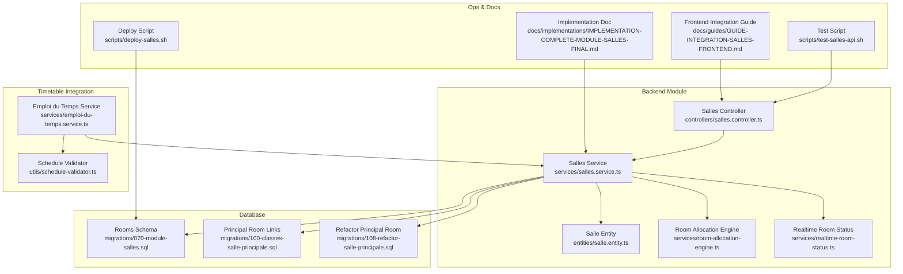
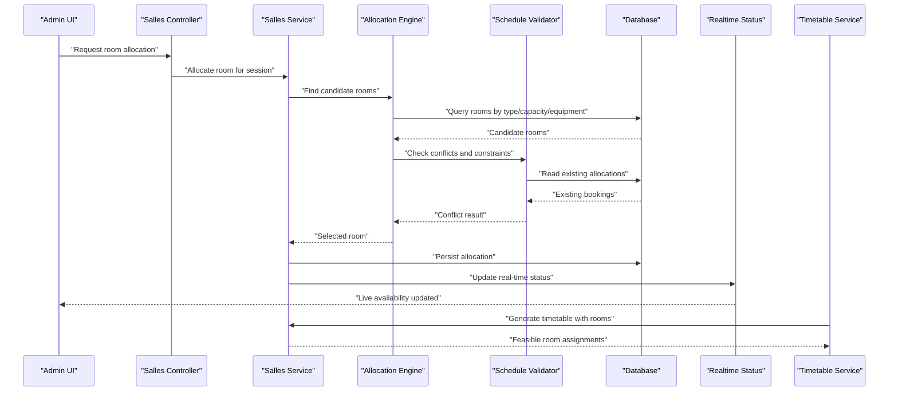
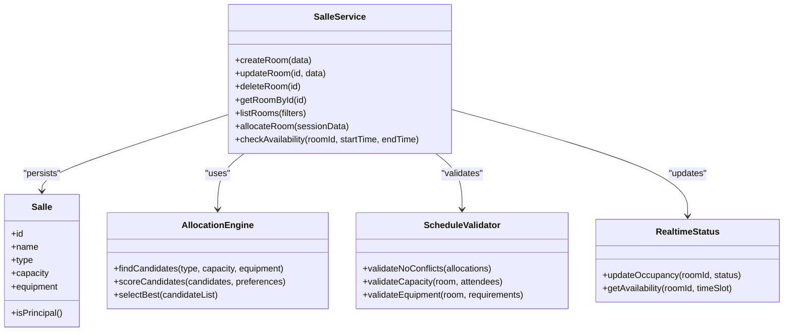
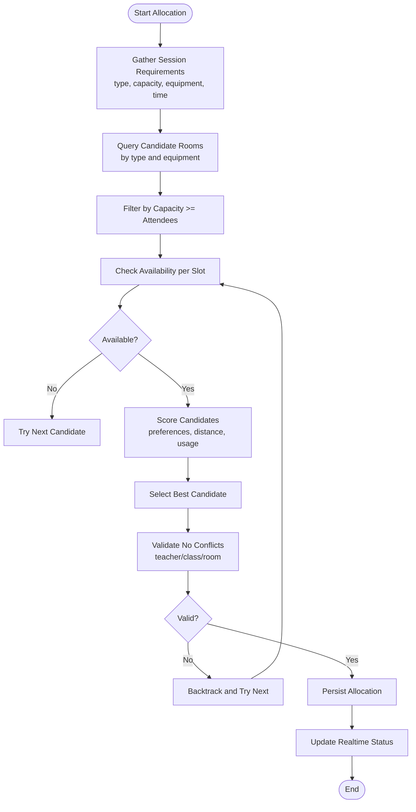
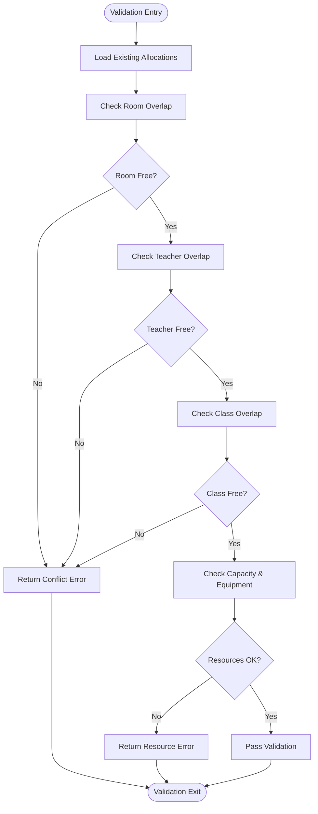
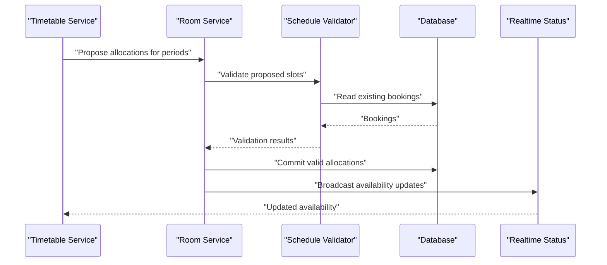
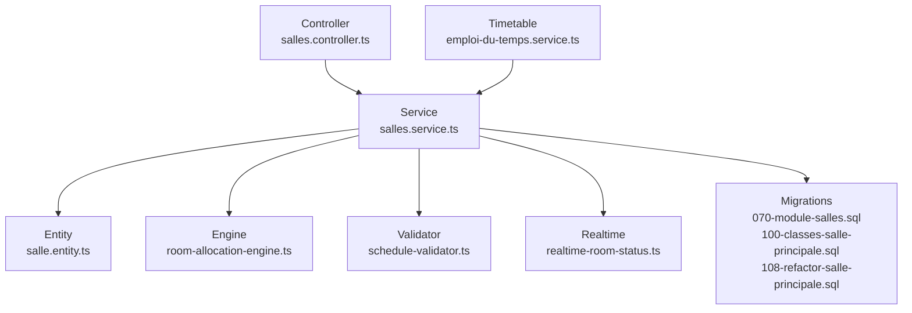

# Room Allocation & Resource Management

<cite>
**Referenced Files in This Document**
- [070-module-salles.sql](file://backend/database/migrations/070-module-salles.sql)
- [100-classes-salle-principale.sql](file://backend/database/migrations/100-classes-salle-principale.sql)
- [108-refactor-salle-principale.sql](file://backend/database/migrations/108-refactor-salle-principale.sql)
- [salles.module.ts](file://backend/src/modules/salles/salles.module.ts)
- [salles.controller.ts](file://backend/src/modules/salles/controllers/salles.controller.ts)
- [salles.service.ts](file://backend/src/modules/salles/services/salles.service.ts)
- [salle.entity.ts](file://backend/src/modules/salles/entities/salle.entity.ts)
- [emploi-du-temps.service.ts](file://backend/src/modules/emploi-du-temps/services/emploi-du-temps.service.ts)
- [schedule-validator.ts](file://backend/src/modules/emploi-du-temps/utils/schedule-validator.ts)
- [realtime-room-status.ts](file://backend/src/modules/salles/services/realtime-room-status.ts)
- [room-allocation-engine.ts](file://backend/src/modules/salles/services/room-allocation-engine.ts)
- [test-salles-api.sh](file://scripts/test-salles-api.sh)
- [deploy-salles.sh](file://scripts/deploy-salles.sh)
- [GUIDE-INTEGRATION-SALLES-FRONTEND.md](file://docs/guides/GUIDE-INTEGRATION-SALLES-FRONTEND.md)
- [IMPLEMENTATION-COMPLETE-MODULE-SALLES-FINAL.md](file://docs/implementations/IMPLEMENTATION-COMPLETE-MODULE-SALLES-FINAL.md)
</cite>

## Table of Contents
1. [Introduction](#introduction)
2. [Project Structure](#project-structure)
3. [Core Components](#core-components)
4. [Architecture Overview](#architecture-overview)
5. [Detailed Component Analysis](#detailed-component-analysis)
6. [Dependency Analysis](#dependency-analysis)
7. [Performance Considerations](#performance-considerations)
8. [Troubleshooting Guide](#troubleshooting-guide)
9. [Conclusion](#conclusion)
10. [Appendices](#appendices)

## Introduction
This document explains the Room Allocation and Resource Management system within eLISAschool. It covers room classification, capacity management, equipment specifications, allocation algorithms with conflict prevention, validation for schedule conflicts and resource availability, practical setup examples, integration with timetable generation, and real-time availability tracking. The goal is to provide both technical depth and accessible guidance for administrators and developers.

## Project Structure
The room management functionality is implemented as a dedicated module with database migrations, entities, services, controllers, and utilities. Key areas include:
- Database schema for rooms, capacities, and equipment
- Entity definitions and relationships
- Services implementing allocation logic and validations
- Controllers exposing APIs for CRUD and scheduling operations
- Utilities for conflict detection and optimization
- Real-time status tracking for live availability
- Frontend integration guide and deployment scripts

**Diagram sources**
- [070-module-salles.sql](file://backend/database/migrations/070-module-salles.sql)
- [100-classes-salle-principale.sql](file://backend/database/migrations/100-classes-salle-principale.sql)
- [108-refactor-salle-principale.sql](file://backend/database/migrations/108-refactor-salle-principale.sql)
- [salle.entity.ts](file://backend/src/modules/salles/entities/salle.entity.ts)
- [salles.service.ts](file://backend/src/modules/salles/services/salles.service.ts)
- [salles.controller.ts](file://backend/src/modules/salles/controllers/salles.controller.ts)
- [room-allocation-engine.ts](file://backend/src/modules/salles/services/room-allocation-engine.ts)
- [realtime-room-status.ts](file://backend/src/modules/salles/services/realtime-room-status.ts)
- [emploi-du-temps.service.ts](file://backend/src/modules/emploi-du-temps/services/emploi-du-temps.service.ts)
- [schedule-validator.ts](file://backend/src/modules/emploi-du-temps/utils/schedule-validator.ts)
- [test-salles-api.sh](file://scripts/test-salles-api.sh)
- [deploy-salles.sh](file://scripts/deploy-salles.sh)
- [GUIDE-INTEGRATION-SALLES-FRONTEND.md](file://docs/guides/GUIDE-INTEGRATION-SALLES-FRONTEND.md)
- [IMPLEMENTATION-COMPLETE-MODULE-SALLES-FINAL.md](file://docs/implementations/IMPLEMENTATION-COMPLETE-MODULE-SALLES-FINAL.md)

**Section sources**
- [070-module-salles.sql](file://backend/database/migrations/070-module-salles.sql)
- [100-classes-salle-principale.sql](file://backend/database/migrations/100-classes-salle-principale.sql)
- [108-refactor-salle-principale.sql](file://backend/database/migrations/108-refactor-salle-principale.sql)
- [salle.entity.ts](file://backend/src/modules/salles/entities/salle.entity.ts)
- [salles.service.ts](file://backend/src/modules/salles/services/salles.service.ts)
- [salles.controller.ts](file://backend/src/modules/salles/controllers/salles.controller.ts)
- [room-allocation-engine.ts](file://backend/src/modules/salles/services/room-allocation-engine.ts)
- [realtime-room-status.ts](file://backend/src/modules/salles/services/realtime-room-status.ts)
- [emploi-du-temps.service.ts](file://backend/src/modules/emploi-du-temps/services/emploi-du-temps.service.ts)
- [schedule-validator.ts](file://backend/src/modules/emploi-du-temps/utils/schedule-validator.ts)
- [test-salles-api.sh](file://scripts/test-salles-api.sh)
- [deploy-salles.sh](file://scripts/deploy-salles.sh)
- [GUIDE-INTEGRATION-SALLES-FRONTEND.md](file://docs/guides/GUIDE-INTEGRATION-SALLES-FRONTEND.md)
- [IMPLEMENTATION-COMPLETE-MODULE-SALLES-FINAL.md](file://docs/implementations/IMPLEMENTATION-COMPLETE-MODULE-SALLES-FINAL.md)

## Core Components
- Room Classification and Equipment
  - Rooms are classified by type (e.g., classroom, lab, auditorium) and equipped with features such as projectors, computers, or specialized tools. Capacity constraints ensure that scheduled sessions fit within room limits.
  - Data model includes identifiers, names, types, capacities, and equipment lists. Relationships link rooms to classes and principal assignments where applicable.

- Allocation Engine
  - Implements rules-based selection of suitable rooms considering type compatibility, capacity, equipment requirements, and time slot availability.
  - Applies conflict prevention by checking existing allocations and ensuring no double-booking.

- Validation System
  - Validates schedule conflicts across teachers, classes, and rooms.
  - Verifies resource availability including equipment and capacity constraints before finalizing allocations.

- Real-Time Availability Tracking
  - Maintains current room occupancy and availability state for live dashboards and dynamic reassignment.

- Timetable Integration
  - Coordinates with timetable generation to propose optimal room assignments and validate feasibility against global constraints.

**Section sources**
- [salle.entity.ts](file://backend/src/modules/salles/entities/salle.entity.ts)
- [salles.service.ts](file://backend/src/modules/salles/services/salles.service.ts)
- [room-allocation-engine.ts](file://backend/src/modules/salles/services/room-allocation-engine.ts)
- [schedule-validator.ts](file://backend/src/modules/emploi-du-temps/utils/schedule-validator.ts)
- [realtime-room-status.ts](file://backend/src/modules/salles/services/realtime-room-status.ts)
- [emploi-du-temps.service.ts](file://backend/src/modules/emploi-du-temps/services/emploi-du-temps.service.ts)

## Architecture Overview
The system follows a modular architecture:
- Controllers expose REST endpoints for room management and allocation requests.
- Services orchestrate business logic, invoking the allocation engine and validators.
- Entities map to database tables defined by migrations.
- Timetable service integrates with the room module to generate feasible schedules.
- Real-time status service updates live availability for UI and operational dashboards.

**Diagram sources**
- [salles.controller.ts](file://backend/src/modules/salles/controllers/salles.controller.ts)
- [salles.service.ts](file://backend/src/modules/salles/services/salles.service.ts)
- [room-allocation-engine.ts](file://backend/src/modules/salles/services/room-allocation-engine.ts)
- [schedule-validator.ts](file://backend/src/modules/emploi-du-temps/utils/schedule-validator.ts)
- [realtime-room-status.ts](file://backend/src/modules/salles/services/realtime-room-status.ts)
- [emploi-du-temps.service.ts](file://backend/src/modules/emploi-du-temps/services/emploi-du-temps.service.ts)

## Detailed Component Analysis

### Room Classification and Capacity Management
- Classifications:
  - Room types define functional categories (classroom, lab, auditorium).
  - Equipment attributes specify available resources (projector, computers, lab benches).
- Capacity Constraints:
  - Each room has a maximum capacity; allocations must not exceed this limit.
  - Principal room links associate specific classes with preferred rooms.

**Diagram sources**
- [salle.entity.ts](file://backend/src/modules/salles/entities/salle.entity.ts)
- [salles.service.ts](file://backend/src/modules/salles/services/salles.service.ts)
- [room-allocation-engine.ts](file://backend/src/modules/salles/services/room-allocation-engine.ts)
- [schedule-validator.ts](file://backend/src/modules/emploi-du-temps/utils/schedule-validator.ts)
- [realtime-room-status.ts](file://backend/src/modules/salles/services/realtime-room-status.ts)

**Section sources**
- [salle.entity.ts](file://backend/src/modules/salles/entities/salle.entity.ts)
- [salles.service.ts](file://backend/src/modules/salles/services/salles.service.ts)
- [room-allocation-engine.ts](file://backend/src/modules/salles/services/room-allocation-engine.ts)
- [schedule-validator.ts](file://backend/src/modules/emploi-du-temps/utils/schedule-validator.ts)
- [realtime-room-status.ts](file://backend/src/modules/salles/services/realtime-room-status.ts)

### Room Allocation Algorithm
The allocation algorithm selects the best room based on:
- Type compatibility with the requested session
- Capacity meeting attendee count
- Equipment matching requirements
- Time slot availability without conflicts
- Preference scoring for optimal utilization

**Diagram sources**
- [room-allocation-engine.ts](file://backend/src/modules/salles/services/room-allocation-engine.ts)
- [schedule-validator.ts](file://backend/src/modules/emploi-du-temps/utils/schedule-validator.ts)
- [realtime-room-status.ts](file://backend/src/modules/salles/services/realtime-room-status.ts)

**Section sources**
- [room-allocation-engine.ts](file://backend/src/modules/salles/services/room-allocation-engine.ts)
- [schedule-validator.ts](file://backend/src/modules/emploi-du-temps/utils/schedule-validator.ts)
- [realtime-room-status.ts](file://backend/src/modules/salles/services/realtime-room-status.ts)

### Validation System for Schedule Conflicts and Resource Availability
- Conflict Prevention:
  - Ensures no overlapping bookings for the same room, teacher, or class during the requested time window.
- Resource Checks:
  - Validates capacity and equipment availability before confirming allocations.
- Global Constraints:
  - Integrates with timetable generation to respect broader scheduling policies.

**Diagram sources**
- [schedule-validator.ts](file://backend/src/modules/emploi-du-temps/utils/schedule-validator.ts)
- [salles.service.ts](file://backend/src/modules/salles/services/salles.service.ts)

**Section sources**
- [schedule-validator.ts](file://backend/src/modules/emploi-du-temps/utils/schedule-validator.ts)
- [salles.service.ts](file://backend/src/modules/salles/services/salles.service.ts)

### Practical Examples
- Room Setup:
  - Create rooms with appropriate type, capacity, and equipment via admin interface or API.
  - Link principal rooms to classes for preferred assignments.
- Allocation Rules Configuration:
  - Define preference weights for room types, equipment priority, and capacity margins.
  - Configure conflict resolution strategies (e.g., prefer least-used rooms, minimize travel distance).
- Conflict Resolution Strategies:
  - Automatic backtracking when conflicts occur.
  - Manual override with justification logged for auditability.

[No sources needed since this section provides general guidance]

### Integration with Timetable Generation and Real-Time Availability
- Timetable Generation:
  - The timetable service requests feasible room assignments from the room module, respecting constraints and preferences.
  - Allocations are validated globally to avoid cross-resource conflicts.
- Real-Time Availability:
  - Updates occupancy states immediately upon allocation changes.
  - Exposes live availability queries for dashboards and dynamic rescheduling.

**Diagram sources**
- [emploi-du-temps.service.ts](file://backend/src/modules/emploi-du-temps/services/emploi-du-temps.service.ts)
- [salles.service.ts](file://backend/src/modules/salles/services/salles.service.ts)
- [schedule-validator.ts](file://backend/src/modules/emploi-du-temps/utils/schedule-validator.ts)
- [realtime-room-status.ts](file://backend/src/modules/salles/services/realtime-room-status.ts)

**Section sources**
- [emploi-du-temps.service.ts](file://backend/src/modules/emploi-du-temps/services/emploi-du-temps.service.ts)
- [salles.service.ts](file://backend/src/modules/salles/services/salles.service.ts)
- [schedule-validator.ts](file://backend/src/modules/emploi-du-temps/utils/schedule-validator.ts)
- [realtime-room-status.ts](file://backend/src/modules/salles/services/realtime-room-status.ts)

## Dependency Analysis
The room module depends on:
- Database migrations defining schemas and relationships
- Entity models mapping to tables
- Services orchestrating allocation and validation
- Timetable service integrating for schedule generation
- Real-time status service for live updates

**Diagram sources**
- [070-module-salles.sql](file://backend/database/migrations/070-module-salles.sql)
- [100-classes-salle-principale.sql](file://backend/database/migrations/100-classes-salle-principale.sql)
- [108-refactor-salle-principale.sql](file://backend/database/migrations/108-refactor-salle-principale.sql)
- [salle.entity.ts](file://backend/src/modules/salles/entities/salle.entity.ts)
- [salles.service.ts](file://backend/src/modules/salles/services/salles.service.ts)
- [salles.controller.ts](file://backend/src/modules/salles/controllers/salles.controller.ts)
- [room-allocation-engine.ts](file://backend/src/modules/salles/services/room-allocation-engine.ts)
- [schedule-validator.ts](file://backend/src/modules/emploi-du-temps/utils/schedule-validator.ts)
- [realtime-room-status.ts](file://backend/src/modules/salles/services/realtime-room-status.ts)
- [emploi-du-temps.service.ts](file://backend/src/modules/emploi-du-temps/services/emploi-du-temps.service.ts)

**Section sources**
- [070-module-salles.sql](file://backend/database/migrations/070-module-salles.sql)
- [100-classes-salle-principale.sql](file://backend/database/migrations/100-classes-salle-principale.sql)
- [108-refactor-salle-principale.sql](file://backend/database/migrations/108-refactor-salle-principale.sql)
- [salle.entity.ts](file://backend/src/modules/salles/entities/salle.entity.ts)
- [salles.service.ts](file://backend/src/modules/salles/services/salles.service.ts)
- [salles.controller.ts](file://backend/src/modules/salles/controllers/salles.controller.ts)
- [room-allocation-engine.ts](file://backend/src/modules/salles/services/room-allocation-engine.ts)
- [schedule-validator.ts](file://backend/src/modules/emploi-du-temps/utils/schedule-validator.ts)
- [realtime-room-status.ts](file://backend/src/modules/salles/services/realtime-room-status.ts)
- [emploi-du-temps.service.ts](file://backend/src/modules/emploi-du-temps/services/emploi-du-temps.service.ts)

## Performance Considerations
- Indexing:
  - Ensure indexes on frequently queried fields such as room type, capacity, and time slots.
- Caching:
  - Cache availability snapshots for short intervals to reduce database load during peak scheduling.
- Batch Operations:
  - Use batched writes for bulk allocations to minimize transaction overhead.
- Concurrency:
  - Apply optimistic locking or distributed locks to prevent race conditions during concurrent allocations.

[No sources needed since this section provides general guidance]

## Troubleshooting Guide
Common issues and resolutions:
- Allocation Failures:
  - Verify capacity and equipment match requirements.
  - Inspect conflict logs for overlapping bookings.
- Real-Time Status Staleness:
  - Confirm updates are persisted and broadcast correctly.
- Timetable Integration Errors:
  - Validate global constraints and ensure timetable service receives correct room availability.

Operational checks:
- Run test scripts to validate API endpoints and allocation flows.
- Review deployment scripts to ensure migrations are applied and services are healthy.

**Section sources**
- [test-salles-api.sh](file://scripts/test-salles-api.sh)
- [deploy-salles.sh](file://scripts/deploy-salles.sh)

## Conclusion
The Room Allocation and Resource Management system provides robust classification, capacity control, and equipment specification support. Its allocation engine prevents conflicts, enforces constraints, and optimizes resource usage. Integrated with timetable generation and real-time availability tracking, it ensures efficient and reliable scheduling across the institution.

[No sources needed since this section summarizes without analyzing specific files]

## Appendices
- Frontend Integration:
  - Refer to the frontend integration guide for UI components and API usage patterns.
- Implementation Summary:
  - Consult the implementation document for detailed feature coverage and configuration options.

**Section sources**
- [GUIDE-INTEGRATION-SALLES-FRONTEND.md](file://docs/guides/GUIDE-INTEGRATION-SALLES-FRONTEND.md)
- [IMPLEMENTATION-COMPLETE-MODULE-SALLES-FINAL.md](file://docs/implementations/IMPLEMENTATION-COMPLETE-MODULE-SALLES-FINAL.md)