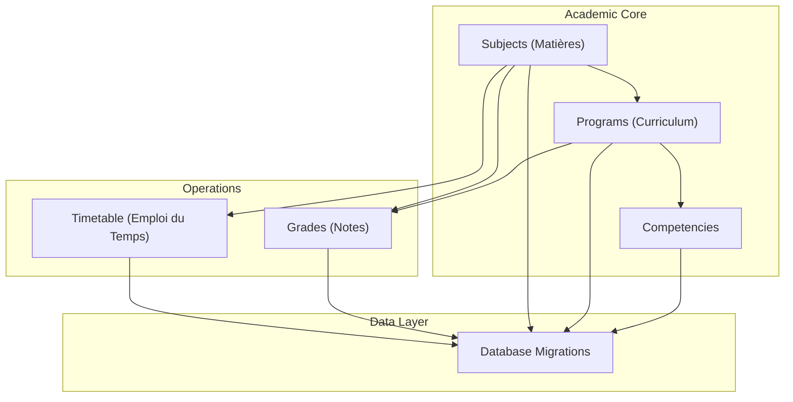
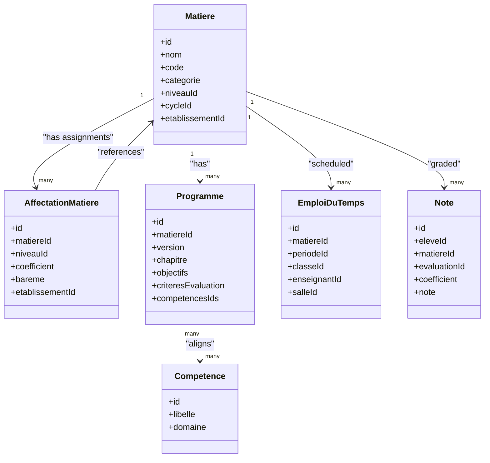
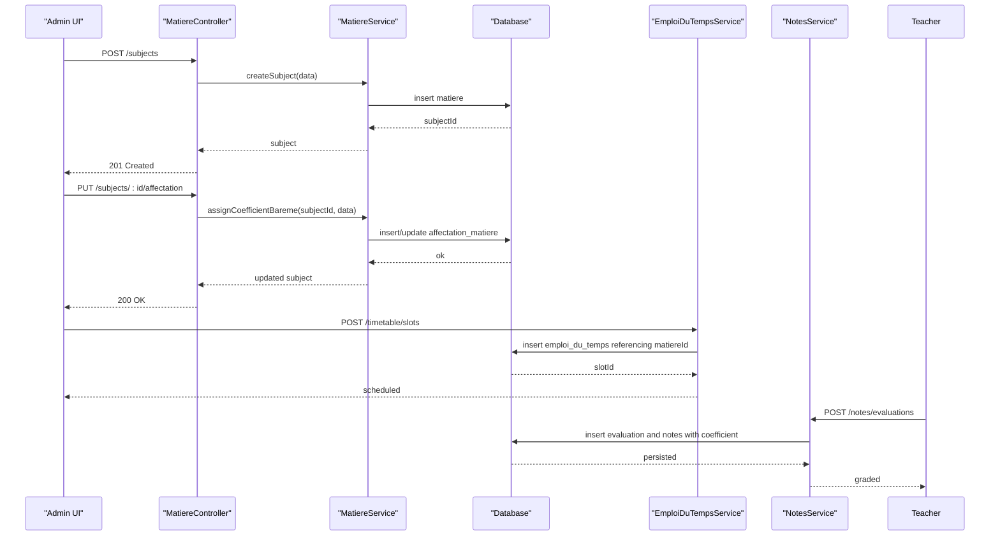
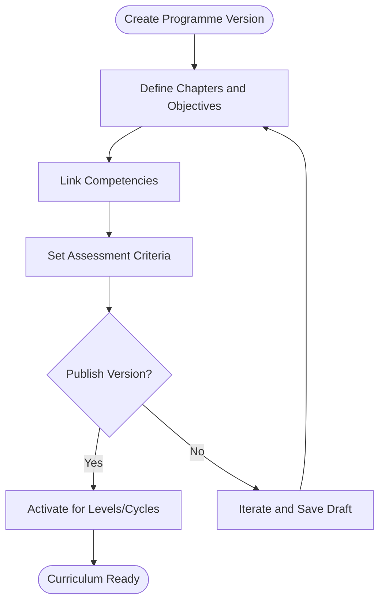
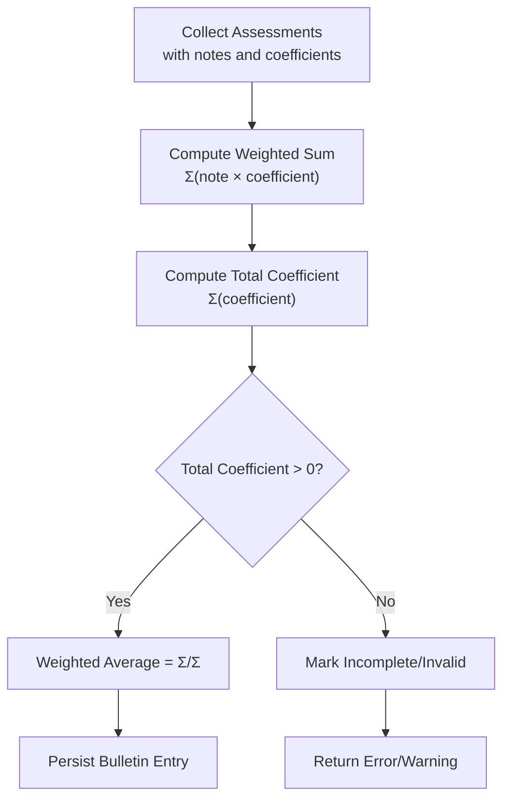
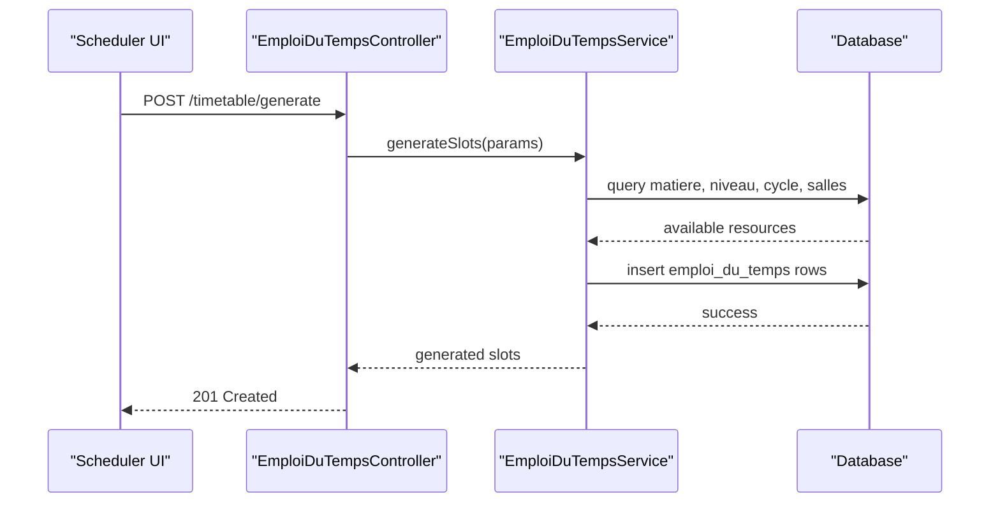
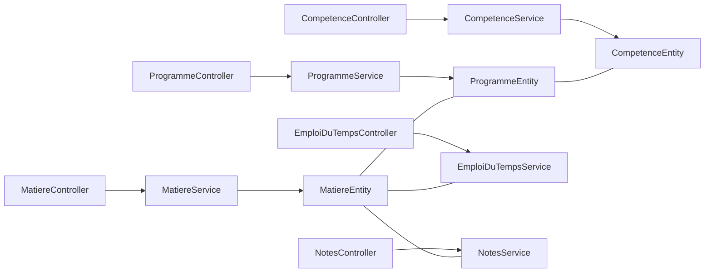

# Subject & Curriculum Management

<cite>
**Referenced Files in This Document**
- [059-ajouter-matiere-sous-systeme.sql](file://backend/database/migrations/059-ajouter-matiere-sous-systeme.sql)
- [060-ajouter-affectation-matiere-coefficient.sql](file://backend/database/migrations/060-ajouter-affectation-matiere-coefficient.sql)
- [061-creer-table-bulletins-matieres.sql](file://backend/database/migrations/061-creer-table-bulletins-matieres.sql)
- [062-creer-table-evaluations-competences.sql](file://backend/database/migrations/062-creer-table-evaluations-competences.sql)
- [063-creer-module-emploi-du-temps.sql](file://backend/database/migrations/063-creer-module-emploi-du-temps.sql)
- [088-refactorisation-architecture-academique.sql](file://backend/database/migrations/088-refactorisation-architecture-academique.sql)
- [089-finalisation-architecture-academique-v2.sql](file://backend/database/migrations/089-finalisation-architecture-academique-v2.sql)
- [090-correction-migration-088-camelcase.sql](file://backend/database/migrations/090-correction-migration-088-camelcase.sql)
- [091-peuplement-architecture-academique.sql](file://backend/database/migrations/091-peuplement-architecture-academique.sql)
- [115-supprimer-config-matiere-classe.sql](file://backend/database/migrations/115-supprimer-config-matiere-classe.sql)
- [matiere.controller.ts](file://backend/src/modules/matieres/controllers/matiere.controller.ts)
- [matiere.service.ts](file://backend/src/modules/matieres/services/matiere.service.ts)
- [matiere.entity.ts](file://backend/src/modules/matieres/entities/matiere.entity.ts)
- [programme.controller.ts](file://backend/src/modules/programmes/controllers/programme.controller.ts)
- [programme.service.ts](file://backend/src/modules/programmes/services/programme.service.ts)
- [programme.entity.ts](file://backend/src/modules/programmes/entities/programme.entity.ts)
- [competence.controller.ts](file://backend/src/modules/competences/controllers/competence.controller.ts)
- [competence.service.ts](file://backend/src/modules/competences/services/competence.service.ts)
- [competence.entity.ts](file://backend/src/modules/competences/entities/competence.entity.ts)
- [emploi-du-temps.controller.ts](file://backend/src/modules/emploi-du-temps/controllers/emploi-du-temps.controller.ts)
- [emploi-du-temps.service.ts](file://backend/src/modules/emploi-du-temps/services/emploi-du-temps.service.ts)
- [notes.controller.ts](file://backend/src/modules/notes/controllers/notes.controller.ts)
- [notes.service.ts](file://backend/src/modules/notes/services/notes.service.ts)
</cite>

## Update Summary
**Changes Made**
- Updated subject management consolidation by removing ConfigurationMatiereClasse entity
- Enhanced AffectationMatiere for coefficient/bareme assignments
- Simplified matieres.controller.ts and matieres.service.ts architecture
- Added documentation for the new simplified subject assignment workflow

## Table of Contents
1. [Introduction](#introduction)
2. [Project Structure](#project-structure)
3. [Core Components](#core-components)
4. [Architecture Overview](#architecture-overview)
5. [Detailed Component Analysis](#detailed-component-analysis)
6. [Dependency Analysis](#dependency-analysis)
7. [Performance Considerations](#performance-considerations)
8. [Troubleshooting Guide](#troubleshooting-guide)
9. [Conclusion](#conclusion)
10. [Appendices](#appendices)

## Introduction
This document explains eLISAschool's Subject and Curriculum Management system, focusing on:
- Subject creation, categorization, and assignment to academic levels and cycles
- **Updated**: Simplified subject management with consolidated entity structure
- Curriculum alignment with competency frameworks
- Coefficient-based grade weighting and report card integration
- Program structure including chapters, learning objectives, and assessment criteria
- Practical examples for subject lifecycle management, curriculum versioning, and cross-referencing subjects and competencies
- Integration points with timetable generation and grade calculation systems

The content is grounded in the repository's database migrations and module implementations for subjects (matières), programs (curriculum), competencies, timetables, and grading, reflecting the recent consolidation of subject management entities.

## Project Structure
The Subject and Curriculum Management spans several modules and their corresponding database migrations:
- Subjects (matières): entities, services, controllers - **Updated**: Simplified architecture after ConfigurationMatiereClasse removal
- Programs (curriculum): entities, services, controllers
- Competencies: entities, services, controllers
- Timetable (emploi du temps): service/controller
- Grades (notes): service/controller
- Academic architecture refactoring migrations that unify subjects, levels, cycles, and program structures

[No sources needed since this diagram shows conceptual workflow, not actual code structure]

## Core Components
- Subject (Matière)
  - Represents a teachable subject within an establishment
  - Supports categorization and association to academic levels and cycles
  - **Updated**: Now uses simplified AffectationMatiere for coefficient/bareme assignments instead of separate ConfigurationMatiereClasse entity
  - Used by timetable scheduling and grading workflows
- Program (Curriculum)
  - Defines structured curriculum content per subject
  - Organized into chapters and learning objectives
  - Includes assessment criteria and links to competencies
- Competency
  - Describes measurable outcomes aligned to curriculum
  - Cross-referenced by programs and evaluations
- Timetable (Emploi du Temps)
  - Schedules subjects across periods and classes
  - Consumes subject definitions and availability constraints
- Grades (Notes)
  - Records assessments and computes weighted grades using coefficients
  - Integrates with report cards and bulletin tables

Key implementation references:
- Subject entity and CRUD operations: [matiere.entity.ts](file://backend/src/modules/matieres/entities/matiere.entity.ts), [matiere.service.ts](file://backend/src/modules/matieres/services/matiere.service.ts), [matiere.controller.ts](file://backend/src/modules/matieres/controllers/matiere.controller.ts)
- Program entity and CRUD operations: [programme.entity.ts](file://backend/src/modules/programmes/entities/programme.entity.ts), [programme.service.ts](file://backend/src/modules/programmes/services/programme.service.ts), [programme.controller.ts](file://backend/src/modules/programmes/controllers/programme.controller.ts)
- Competency entity and CRUD operations: [competence.entity.ts](file://backend/src/modules/competences/entities/competence.entity.ts), [competence.service.ts](file://backend/src/modules/competences/services/competence.service.ts), [competence.controller.ts](file://backend/src/modules/competences/controllers/competence.controller.ts)
- Timetable integration: [emploi-du-temps.service.ts](file://backend/src/modules/emploi-du-temps/services/emploi-du-temps.service.ts), [emploi-du-temps.controller.ts](file://backend/src/modules/emploi-du-temps/controllers/emploi-du-temps.controller.ts)
- Grading integration: [notes.service.ts](file://backend/src/modules/notes/services/notes.service.ts), [notes.controller.ts](file://backend/src/modules/notes/controllers/notes.controller.ts)

**Section sources**
- [matiere.entity.ts](file://backend/src/modules/matieres/entities/matiere.entity.ts)
- [matiere.service.ts](file://backend/src/modules/matieres/services/matiere.service.ts)
- [matiere.controller.ts](file://backend/src/modules/matieres/controllers/matiere.controller.ts)
- [programme.entity.ts](file://backend/src/modules/programmes/entities/programme.entity.ts)
- [programme.service.ts](file://backend/src/modules/programmes/services/programme.service.ts)
- [programme.controller.ts](file://backend/src/modules/programmes/controllers/programme.controller.ts)
- [competence.entity.ts](file://backend/src/modules/competences/entities/competence.entity.ts)
- [competence.service.ts](file://backend/src/modules/competences/services/competence.service.ts)
- [competence.controller.ts](file://backend/src/modules/competences/controllers/competence.controller.ts)
- [emploi-du-temps.service.ts](file://backend/src/modules/emploi-du-temps/services/emploi-du-temps.service.ts)
- [emploi-du-temps.controller.ts](file://backend/src/modules/emploi-du-temps/controllers/emploi-du-temps.controller.ts)
- [notes.service.ts](file://backend/src/modules/notes/services/notes.service.ts)
- [notes.controller.ts](file://backend/src/modules/notes/controllers/notes.controller.ts)

## Architecture Overview
The system models subjects as first-class entities linked to academic levels and cycles, while programs define curriculum structure and align with competencies. **Updated**: The recent consolidation removed the ConfigurationMatiereClasse entity, simplifying the architecture by moving coefficient and bareme assignments directly to AffectationMatiere. Timetable and grading subsystems consume these definitions to schedule instruction and compute weighted results.

**Diagram sources**
- [matiere.entity.ts](file://backend/src/modules/matieres/entities/matiere.entity.ts)
- [programme.entity.ts](file://backend/src/modules/programmes/entities/programme.entity.ts)
- [competence.entity.ts](file://backend/src/modules/competences/entities/competence.entity.ts)
- [emploi-du-temps.service.ts](file://backend/src/modules/emploi-du-temps/services/emploi-du-temps.service.ts)
- [notes.service.ts](file://backend/src/modules/notes/services/notes.service.ts)

## Detailed Component Analysis

### Subject Lifecycle Management
End-to-end flow for creating, assigning, and retiring a subject:
- Create subject with category and academic associations
- **Updated**: Assign coefficients and bareme through simplified AffectationMatiere instead of separate configuration entity
- Schedule via timetable
- Record assessments and compute weighted grades
- Archive or deactivate when no longer used

**Diagram sources**
- [matiere.controller.ts](file://backend/src/modules/matieres/controllers/matiere.controller.ts)
- [matiere.service.ts](file://backend/src/modules/matieres/services/matiere.service.ts)
- [emploi-du-temps.service.ts](file://backend/src/modules/emploi-du-temps/services/emploi-du-temps.service.ts)
- [notes.service.ts](file://backend/src/modules/notes/services/notes.service.ts)

**Section sources**
- [matiere.controller.ts](file://backend/src/modules/matieres/controllers/matiere.controller.ts)
- [matiere.service.ts](file://backend/src/modules/matieres/services/matiere.service.ts)
- [emploi-du-temps.service.ts](file://backend/src/modules/emploi-du-temps/services/emploi-du-temps.service.ts)
- [notes.service.ts](file://backend/src/modules/notes/services/notes.service.ts)

### Curriculum Versioning and Alignment with Competencies
Curriculum versioning ensures traceability and controlled evolution:
- Each programme has a version identifier
- Chapters and learning objectives are defined per version
- Assessment criteria are attached to programme versions
- Competencies are cross-referenced to ensure alignment

**Diagram sources**
- [programme.entity.ts](file://backend/src/modules/programmes/entities/programme.entity.ts)
- [programme.service.ts](file://backend/src/modules/programmes/services/programme.service.ts)
- [programme.controller.ts](file://backend/src/modules/programmes/controllers/programme.controller.ts)
- [competence.entity.ts](file://backend/src/modules/competences/entities/competence.entity.ts)

**Section sources**
- [programme.entity.ts](file://backend/src/modules/programmes/entities/programme.entity.ts)
- [programme.service.ts](file://backend/src/modules/programmes/services/programme.service.ts)
- [programme.controller.ts](file://backend/src/modules/programmes/controllers/programme.controller.ts)
- [competence.entity.ts](file://backend/src/modules/competences/entities/competence.entity.ts)

### Coefficient Calculations for Grade Weighting
Grade weighting uses coefficients associated with assessments and subjects:
- **Updated**: Coefficients are now managed through AffectationMatiere entity, consolidating subject-level weight assignments
- Weighted averages are computed by summing (note × coefficient) divided by total coefficient
- Bulletin tables aggregate final results per subject and period

**Diagram sources**
- [060-ajouter-affectation-matiere-coefficient.sql](file://backend/database/migrations/060-ajouter-affectation-matiere-coefficient.sql)
- [061-creer-table-bulletins-matieres.sql](file://backend/database/migrations/061-creer-table-bulletins-matieres.sql)
- [notes.service.ts](file://backend/src/modules/notes/services/notes.service.ts)

**Section sources**
- [060-ajouter-affectation-matiere-coefficient.sql](file://backend/database/migrations/060-ajouter-affectation-matiere-coefficient.sql)
- [061-creer-table-bulletins-matieres.sql](file://backend/database/migrations/061-creer-table-bulletins-matieres.sql)
- [notes.service.ts](file://backend/src/modules/notes/services/notes.service.ts)

### Timetable Integration
Timetable generation consumes subject definitions and schedules them across periods and classes:
- Subjects must exist and be assigned to appropriate levels/cycles
- Slots reference matiereId, periodeId, classeId, enseignantId, salleId
- Validation prevents conflicts and enforces capacity constraints

**Diagram sources**
- [emploi-du-temps.controller.ts](file://backend/src/modules/emploi-du-temps/controllers/emploi-du-temps.controller.ts)
- [emploi-du-temps.service.ts](file://backend/src/modules/emploi-du-temps/services/emploi-du-temps.service.ts)
- [063-creer-module-emploi-du-temps.sql](file://backend/database/migrations/063-creer-module-emploi-du-temps.sql)

**Section sources**
- [emploi-du-temps.controller.ts](file://backend/src/modules/emploi-du-temps/controllers/emploi-du-temps.controller.ts)
- [emploi-du-temps.service.ts](file://backend/src/modules/emploi-du-temps/services/emploi-du-temps.service.ts)
- [063-creer-module-emploi-du-temps.sql](file://backend/database/migrations/063-creer-module-emploi-du-temps.sql)

### Practical Examples

#### Example: Subject Creation and Assignment
- Create a new subject with category and code
- **Updated**: Assign coefficients and bareme through simplified AffectationMatiere endpoint
- Verify availability for timetable scheduling

References:
- [matiere.controller.ts](file://backend/src/modules/matieres/controllers/matiere.controller.ts)
- [matiere.service.ts](file://backend/src/modules/matieres/services/matiere.service.ts)
- [matiere.entity.ts](file://backend/src/modules/matieres/entities/matiere.entity.ts)

#### Example: Curriculum Versioning
- Create a new programme version for a subject
- Add chapters and learning objectives
- Link relevant competencies
- Publish the version for use in teaching and assessment

References:
- [programme.controller.ts](file://backend/src/modules/programmes/controllers/programme.controller.ts)
- [programme.service.ts](file://backend/src/modules/programmes/services/programme.service.ts)
- [programme.entity.ts](file://backend/src/modules/programmes/entities/programme.entity.ts)
- [competence.controller.ts](file://backend/src/modules/competences/controllers/competence.controller.ts)
- [competence.service.ts](file://backend/src/modules/competences/services/competence.service.ts)
- [competence.entity.ts](file://backend/src/modules/competences/entities/competence.entity.ts)

#### Example: Cross-Referencing Subjects and Competencies
- Map programme entries to multiple competencies
- Ensure each chapter/objective references at least one competency
- Use competency IDs to filter curriculum by domain

References:
- [programme.entity.ts](file://backend/src/modules/programmes/entities/programme.entity.ts)
- [competence.entity.ts](file://backend/src/modules/competences/entities/competence.entity.ts)

#### Example: Timetable Generation Using Subjects
- Generate timetable slots based on subject availability
- Validate against room and teacher constraints
- Persist slots and notify stakeholders

References:
- [emploi-du-temps.controller.ts](file://backend/src/modules/emploi-du-temps/controllers/emploi-du-temps.controller.ts)
- [emploi-du-temps.service.ts](file://backend/src/modules/emploi-du-temps/services/emploi-du-temps.service.ts)
- [063-creer-module-emploi-du-temps.sql](file://backend/database/migrations/063-creer-module-emploi-du-temps.sql)

#### Example: Grade Calculation with Coefficients
- Record assessments with notes and coefficients
- Compute weighted averages per subject and period
- Populate bulletin tables for reporting

References:
- [notes.controller.ts](file://backend/src/modules/notes/controllers/notes.controller.ts)
- [notes.service.ts](file://backend/src/modules/notes/services/notes.service.ts)
- [060-ajouter-affectation-matiere-coefficient.sql](file://backend/database/migrations/060-ajouter-affectation-matiere-coefficient.sql)
- [061-creer-table-bulletins-matieres.sql](file://backend/database/migrations/061-creer-table-bulletins-matieres.sql)

## Dependency Analysis
The following diagram maps key dependencies between modules and data layers:

**Diagram sources**
- [matiere.controller.ts](file://backend/src/modules/matieres/controllers/matiere.controller.ts)
- [matiere.service.ts](file://backend/src/modules/matieres/services/matiere.service.ts)
- [matiere.entity.ts](file://backend/src/modules/matieres/entities/matiere.entity.ts)
- [programme.controller.ts](file://backend/src/modules/programmes/controllers/programme.controller.ts)
- [programme.service.ts](file://backend/src/modules/programmes/services/programme.service.ts)
- [programme.entity.ts](file://backend/src/modules/programmes/entities/programme.entity.ts)
- [competence.controller.ts](file://backend/src/modules/competences/controllers/competence.controller.ts)
- [competence.service.ts](file://backend/src/modules/competences/services/competence.service.ts)
- [competence.entity.ts](file://backend/src/modules/competences/entities/competence.entity.ts)
- [emploi-du-temps.controller.ts](file://backend/src/modules/emploi-du-temps/controllers/emploi-du-temps.controller.ts)
- [emploi-du-temps.service.ts](file://backend/src/modules/emploi-du-temps/services/emploi-du-temps.service.ts)
- [notes.controller.ts](file://backend/src/modules/notes/controllers/notes.controller.ts)
- [notes.service.ts](file://backend/src/modules/notes/services/notes.service.ts)

**Section sources**
- [matiere.controller.ts](file://backend/src/modules/matieres/controllers/matiere.controller.ts)
- [programme.controller.ts](file://backend/src/modules/programmes/controllers/programme.controller.ts)
- [competence.controller.ts](file://backend/src/modules/competences/controllers/competence.controller.ts)
- [emploi-du-temps.controller.ts](file://backend/src/modules/emploi-du-temps/controllers/emploi-du-temps.controller.ts)
- [notes.controller.ts](file://backend/src/modules/notes/controllers/notes.controller.ts)

## Performance Considerations
- Indexing: Ensure indexes on foreign keys linking subjects to levels/cycles and programmes to subjects improve query performance for scheduling and reporting.
- **Updated**: Simplified entity structure reduces database joins and improves query performance for subject assignments.
- Batch operations: When generating timetables or computing grades, prefer batch inserts and updates to reduce transaction overhead.
- Pagination: For large lists of subjects or programmes, implement pagination to avoid heavy payloads.
- Caching: Cache frequently accessed subject catalogs and competency lists where appropriate.

[No sources needed since this section provides general guidance]

## Troubleshooting Guide
Common issues and resolutions:
- Missing subject assignments to levels/cycles prevent timetable generation; verify subject metadata before scheduling.
- Invalid coefficients (zero or negative) cause grade computation errors; validate inputs before persisting assessments.
- **Updated**: After ConfigurationMatiereClasse removal, ensure all subject assignments use the new AffectationMatiere structure.
- Programme version conflicts: ensure unique version identifiers per subject and maintain backward compatibility when publishing updates.
- Timetable conflicts: check for overlapping slots and resource constraints; resolve by adjusting periods or rooms.

Operational references:
- Subject CRUD endpoints: [matiere.controller.ts](file://backend/src/modules/matieres/controllers/matiere.controller.ts)
- Programme CRUD endpoints: [programme.controller.ts](file://backend/src/modules/programmes/controllers/programme.controller.ts)
- Timetable generation: [emploi-du-temps.controller.ts](file://backend/src/modules/emploi-du-temps/controllers/emploi-du-temps.controller.ts)
- Grading endpoints: [notes.controller.ts](file://backend/src/modules/notes/controllers/notes.controller.ts)

**Section sources**
- [matiere.controller.ts](file://backend/src/modules/matieres/controllers/matiere.controller.ts)
- [programme.controller.ts](file://backend/src/modules/programmes/controllers/programme.controller.ts)
- [emploi-du-temps.controller.ts](file://backend/src/modules/emploi-du-temps/controllers/emploi-du-temps.controller.ts)
- [notes.controller.ts](file://backend/src/modules/notes/controllers/notes.controller.ts)

## Conclusion
eLISAschool's Subject and Curriculum Management system provides a robust foundation for organizing academic content, aligning it with competency frameworks, and integrating with scheduling and grading workflows. **Updated**: The recent consolidation of subject management entities has simplified the architecture by removing ConfigurationMatiereClasse and enhancing AffectationMatiere for coefficient/bareme assignments, resulting in improved performance and maintainability. The design emphasizes clear versioning, cross-referencing, and coefficient-based weighting to support accurate reporting and effective instructional planning.

[No sources needed since this section summarizes without analyzing specific files]

## Appendices

### Database Schema Highlights
- Subject model enhancements and under-system tagging: [059-ajouter-matiere-sous-systeme.sql](file://backend/database/migrations/059-ajouter-matiere-sous-systeme.sql)
- Coefficient assignment for subjects: [060-ajouter-affectation-matiere-coefficient.sql](file://backend/database/migrations/060-ajouter-affectation-matiere-coefficient.sql)
- Bulletin tables for subjects: [061-creer-table-bulletins-matieres.sql](file://backend/database/migrations/061-creer-table-bulletins-matieres.sql)
- Competency evaluations table: [062-creer-table-evaluations-competences.sql](file://backend/database/migrations/062-creer-table-evaluations-competences.sql)
- Timetable module creation: [063-creer-module-emploi-du-temps.sql](file://backend/database/migrations/063-creer-module-emploi-du-temps.sql)
- Academic architecture refactoring and finalization: [088-refactorisation-architecture-academique.sql](file://backend/database/migrations/088-refactorisation-architecture-academique.sql), [089-finalisation-architecture-academique-v2.sql](file://backend/database/migrations/089-finalisation-architecture-academique-v2.sql)
- CamelCase corrections and population scripts: [090-correction-migration-088-camelcase.sql](file://backend/database/migrations/090-correction-migration-088-camelcase.sql), [091-peuplement-architecture-academique.sql](file://backend/database/migrations/091-peuplement-architecture-academique.sql)
- **Updated**: ConfigurationMatiereClasse entity removal: [115-supprimer-config-matiere-classe.sql](file://backend/database/migrations/115-supprimer-config-matiere-classe.sql)

**Section sources**
- [059-ajouter-matiere-sous-systeme.sql](file://backend/database/migrations/059-ajouter-matiere-sous-systeme.sql)
- [060-ajouter-affectation-matiere-coefficient.sql](file://backend/database/migrations/060-ajouter-affectation-matiere-coefficient.sql)
- [061-creer-table-bulletins-matieres.sql](file://backend/database/migrations/061-creer-table-bulletins-matieres.sql)
- [062-creer-table-evaluations-competences.sql](file://backend/database/migrations/062-creer-table-evaluations-competences.sql)
- [063-creer-module-emploi-du-temps.sql](file://backend/database/migrations/063-creer-module-emploi-du-temps.sql)
- [088-refactorisation-architecture-academique.sql](file://backend/database/migrations/088-refactorisation-architecture-academique.sql)
- [089-finalisation-architecture-academique-v2.sql](file://backend/database/migrations/089-finalisation-architecture-academique-v2.sql)
- [090-correction-migration-088-camelcase.sql](file://backend/database/migrations/090-correction-migration-088-camelcase.sql)
- [091-peuplement-architecture-academique.sql](file://backend/database/migrations/091-peuplement-architecture-academique.sql)
- [115-supprimer-config-matiere-classe.sql](file://backend/database/migrations/115-supprimer-config-matiere-classe.sql)