# Timetable Creation & Scheduling

<cite>
**Referenced Files in This Document**
- [063-creer-module-emploi-du-temps.sql](file://backend/database/migrations/063-creer-module-emploi-du-temps.sql)
- [065-creer-templates-emploi-du-temps.sql](file://backend/database/migrations/065-creer-templates-emploi-du-temps.sql)
- [103-templates-periode-personnalisables.sql](file://backend/database/migrations/103-templates-periode-personnalisables.sql)
- [104-refonte-periodes-niveaux-configurables.sql](file://backend/database/migrations/104-refonte-periodes-niveaux-configurables.sql)
- [105-migration-templates-v5.sql](file://backend/database/migrations/105-migration-templates-v5.sql)
- [070-module-salles.sql](file://backend/database/migrations/070-module-salles.sql)
- [088-refactorisation-architecture-academique.sql](file://backend/database/migrations/088-refactorisation-architecture-academique.sql)
- [089-finalisation-architecture-academique-v2.sql](file://backend/database/migrations/089-finalisation-architecture-academique-v2.sql)
- [091-peuplement-architecture-academique.sql](file://backend/database/migrations/091-peuplement-architecture-academique.sql)
- [092-refactorisation-classeAnneeId.sql](file://backend/database/migrations/092-refactorisation-classeAnneeId.sql)
- [100-classes-salle-principale.sql](file://backend/database/migrations/100-classes-salle-principale.sql)
- [101-normalisation-annee-scolaire-cloture.sql](file://backend/database/migrations/101-normalisation-annee-scolaire-cloture.sql)
- [102-periodes-hierarchie.sql](file://backend/database/migrations/102-periodes-hierarchie.sql)
- [044-module-organisation.sql](file://backend/database/migrations/044-module-organisation.sql)
- [045-organisation-optimisations.sql](file://backend/database/migrations/045-organisation-optimisations.sql)
- [046-organisation-performance-avancee.sql](file://backend/database/migrations/046-organisation-performance-avancee.sql)
- [047-notifications-ameliorations.sql](file://backend/database/migrations/047-notifications-ameliorations.sql)
- [048-notifications-performance-optimizations.sql](file://backend/database/migrations/048-notifications-performance-optimizations.sql)
- [049-ameliorations-inscription-finances.sql](file://backend/database/migrations/049-ameliorations-inscription-finances.sql)
- [050-multi-tenant-v3-max-etablissements.sql](file://backend/database/migrations/050-multi-tenant-v3-max-etablissements.sql)
- [050-suppression-utilisateur-etablissementId.sql](file://backend/database/migrations/050-suppression-utilisateur-etablissementId.sql)
- [051-champs-preinscription-enrichis.sql](file://backend/database/migrations/051-champs-preinscription-enrichis.sql)
- [052-approche-hybride-parents.sql](file://backend/database/migrations/052-approche-hybride-parents.sql)
- [053-structure-academique-complete.sql](file://backend/database/migrations/053-structure-academique-complete.sql)
- [054-refonte-structure-academique-v2.sql](file://backend/database/migrations/054-refonte-structure-academique-v2.sql)
- [054-structure-academique-complete-fr-en.sql](file://backend/database/migrations/054-structure-academique-complete-fr-en.sql)
- [055-structure-academique-ameliorations.sql](file://backend/database/migrations/055-structure-academique-ameliorations.sql)
- [056-refactor-note-enseignant-membre-personnel.sql](file://backend/database/migrations/056-refactor-note-enseignant-membre-personnel.sql)
- [056-suppression-cycle-scolaire.sql](file://backend/database/migrations/056-suppression-cycle-scolaire.sql)
- [057-supprimer-niveau-filiere-id.sql](file://backend/database/migrations/057-supprimer-niveau-filiere-id.sql)
- [057-supprimer-parametres-dupliques-etablissement.sql](file://backend/database/migrations/057-supprimer-parametres-dupliques-etablissement.sql)
- [058-multi-tenant-structure-academique.sql](file://backend/database/migrations/058-multi-tenant-structure-academique.sql)
- [058-unifier-periode-cloturee-statut.sql](file://backend/database/migrations/058-unifier-periode-cloturee-statut.sql)
- [059-ajouter-matiere-sous-systeme.sql](file://backend/database/migrations/059-ajouter-matiere-sous-systeme.sql)
- [059-multi-tenant-matiere.sql](file://backend/database/migrations/059-multi-tenant-matiere.sql)
- [060-ajouter-affectation-matiere-coefficient.sql](file://backend/database/migrations/060-ajouter-affectation-matiere-coefficient.sql)
- [061-creer-table-bulletins-matieres.sql](file://backend/database/migrations/061-creer-table-bulletins-matieres.sql)
- [062-creer-table-evaluations-competences.sql](file://backend/database/migrations/062-creer-table-evaluations-competences.sql)
- [064-validateur-sous-systeme.sql](file://backend/database/migrations/064-validateur-sous-systeme.sql)
- [069-fix-super-admin-permissions.sql](file://backend/database/migrations/069-fix-super-admin-permissions.sql)
- [070-fix-super-admin-all-perrmission.sql](file://backend/database/migrations/070-fix-super-admin-all-perrmission.sql)
- [072-scoping-cycles-niveaux.sql](file://backend/database/migrations/072-scoping-cycles-niveaux.sql)
- [073-competence-unique-composite.sql](file://backend/database/migrations/073-competence-unique-composite.sql)
- [074-matiere-niveau-unique-composite.sql](file://backend/database/migrations/074-matiere-niveau-unique-composite.sql)
- [075-module-groupes-etablissements.sql](file://backend/database/migrations/075-module-groupes-etablissements.sql)
- [076-permissions-groupes-etablissements.sql](file://backend/database/migrations/076-permissions-groupes-etablissements.sql)
- [077-update-permissions-groupes.sql](file://backend/database/migrations/077-update-permissions-groupes.sql)
- [078-utilisateur-test-groupes.sql](file://backend/database/migrations/078-utilisateur-test-groupes.sql)
- [079-add-roleId-utilisateur-etablissements.sql](file://backend/database/migrations/079-add-roleId-utilisateur-etablissements.sql)
- [079-correction-permissions-groupes.sql](file://backend/database/migrations/079-correction-permissions-groupes.sql)
- [080-preferences-utilisateur-multi-tenant.sql](file://backend/database/migrations/080-preferences-utilisateur-multi-tenant.sql)
- [081-module-apparence-fonds.sql](file://backend/database/migrations/081-module-apparence-fonds.sql)
- [082-fix-contrainte-unique-preferences.sql](file://backend/database/migrations/082-fix-contrainte-unique-preferences.sql)
- [083-fix-contrainte-unique-parametres.sql](file://backend/database/migrations/083-fix-contrainte-unique-parametres.sql)
- [084-cleanup-classe-id-notes.sql](file://backend/database/migrations/084-cleanup-classe-id-notes.sql)
- [085-periode-etablissement-id.sql](file://backend/database/migrations/085-periode-etablissement-id.sql)
- [086-affectation-matiere-etablissement-id.sql](file://backend/database/migrations/086-affectation-matiere-etablissement-id.sql)
- [087-affectation-matiere-verifications.sql](file://backend/database/migrations/087-affectation-matiere-verifications.sql)
- [099-add-monitoring-params.sql](file://backend/database/migrations/099-add-monitoring-params.sql)
- [106-rename-sequence-to-evaluation.sql](file://backend/database/migrations/106-rename-sequence-to-evaluation.sql)
- [107-cleanup-configuration-modules-actif.sql](file://backend/database/migrations/107-cleanup-configuration-modules-actif.sql)
- [108-refactor-salle-principale.sql](file://backend/database/migrations/108-refactor-salle-principale.sql)
- [MIGRATION-076-SUCCESS.md](file://backend/database/migrations/MIGRATION-076-SUCCESS.md)
- [PERMISSIONS-GROUPES-SEED-UPDATE.md](file://backend/database/migrations/PERMISSIONS-GROUPES-SEED-UPDATE.md)
- [README-075-GROUPES.md](file://backend/database/migrations/README-075-GROUPES.md)
- [migrate-rbac-v3.sql](file://backend/database/migrations/migrate-rbac-v3.sql)
- [app.ts](file://backend/src/app.ts)
- [index.ts](file://backend/src/index.ts)
- [route-registry.ts](file://backend/src/routes/route-registry.ts)
- [data-source.ts](file://backend/src/database/data-source.ts)
- [database.config.ts](file://backend/src/config/database.config.ts)
- [env.config.ts](file://backend/src/config/env.config.ts)
- [index.ts](file://backend/src/modules/index.ts)
- [emploi-du-temps](file://backend/src/modules/emploi-du-temps)
- [salles](file://backend/src/modules/salles)
- [personnel](file://backend/src/modules/personnel)
- [matieres](file://backend/src/modules/matieres)
- [classes](file://backend/src/modules/classes)
- [periodes](file://backend/src/modules/periodes)
- [annees-scolaires](file://backend/src/modules/annees-scolaires)
</cite>

## Update Summary
**Changes Made**
- Updated entity architecture to reflect CreneauHoraire replacing EmploiDuTemps and RepartitionHoraire entities
- Added conflict detection service documentation
- Simplified controller architecture with improved separation of concerns
- Enhanced constraint satisfaction algorithms for better performance
- Updated API endpoints and data flow patterns

## Table of Contents
1. [Introduction](#introduction)
2. [Project Structure](#project-structure)
3. [Core Components](#core-components)
4. [Architecture Overview](#architecture-overview)
5. [Detailed Component Analysis](#detailed-component-analysis)
6. [Dependency Analysis](#dependency-analysis)
7. [Performance Considerations](#performance-considerations)
8. [Troubleshooting Guide](#troubleshooting-guide)
9. [Conclusion](#conclusion)
10. [Appendices](#appendices)

## Introduction
This document explains the eLISAschool Timetable Creation and Scheduling system, focusing on automatic timetable generation with conflict resolution, teacher availability constraints, room allocation optimization, manual adjustments, template-based scheduling, and periodic management. The system has been modernized with a new CreneauHoraire entity that replaces the previous EmploiDuTemps and RepartitionHoraire entities, providing a more streamlined and efficient approach to schedule management.

The backend exposes a dedicated module for timetables (emploi du temps), integrates with rooms (salles), personnel (teachers), subjects (matières), classes, periods, and school years. Migrations define the data model and templates, while routes and modules provide API endpoints and business logic. The updated architecture includes a dedicated conflict detection service and simplified controller structure for improved maintainability and performance.

## Project Structure
At a high level:
- Database migrations define entities for timetables, templates, rooms, teachers, subjects, classes, periods, and school years.
- Backend modules implement controllers, services, DTOs, and types for each domain area.
- Routes are registered centrally to expose REST APIs.
- Configuration and database initialization are handled via config files and data source setup.
- New CreneauHoraire entity centralizes time slot management and conflict detection.

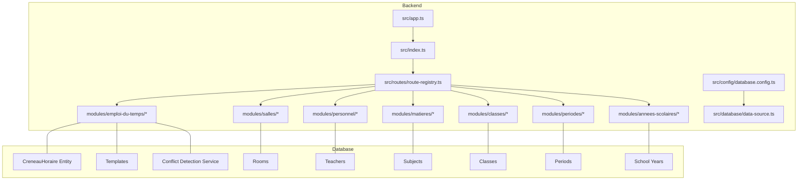

**Diagram sources**
- [app.ts](file://backend/src/app.ts)
- [index.ts](file://backend/src/index.ts)
- [route-registry.ts](file://backend/src/routes/route-registry.ts)
- [data-source.ts](file://backend/src/database/data-source.ts)
- [database.config.ts](file://backend/src/config/database.config.ts)

**Section sources**
- [app.ts](file://backend/src/app.ts)
- [index.ts](file://backend/src/index.ts)
- [route-registry.ts](file://backend/src/routes/route-registry.ts)
- [data-source.ts](file://backend/src/database/data-source.ts)
- [database.config.ts](file://backend/src/config/database.config.ts)

## Core Components
- **Timetable Module (emploi-du-temps)**: Provides CRUD and scheduling operations with the new CreneauHoraire entity for centralized time slot management, including automatic generation and manual adjustments.
- **Conflict Detection Service**: Dedicated service for identifying and resolving scheduling conflicts across teachers, rooms, and classes.
- **Rooms Module (salles)**: Manages room inventory, capacities, and equipment; supports principal room assignment per class.
- **Personnel Module (personnel)**: Manages teachers, roles, and availability constraints.
- **Subjects Module (matieres)**: Defines subjects and their relationships to levels/cycles.
- **Classes Module (classes)**: Represents classes/groups and their composition.
- **Periods Module (periodes)**: Models time slots and period hierarchies.
- **School Years Module (annees-scolaires)**: Anchors schedules to academic years and closure status.

Key responsibilities:
- **Constraint modeling**: teacher availability, room capacity/equipment, subject requirements, class grouping.
- **Enhanced conflict detection**: double-bookings for teachers, rooms, or classes; overlapping sessions using dedicated service.
- **Optimization**: minimize conflicts, balance workload, prefer suitable rooms, respect preferences.
- **Templates**: reusable schedule patterns for quick generation across periods and classes.
- **Bulk operations**: batch creation, import/export, regeneration strategies.

**Updated** The core components now feature the CreneauHoraire entity as the central scheduling unit, replacing the previous dual-entity approach with EmploiDuTemps and RepartitionHoraire.

**Section sources**
- [063-creer-module-emploi-du-temps.sql](file://backend/database/migrations/063-creer-module-emploi-du-temps.sql)
- [065-creer-templates-emploi-du-temps.sql](file://backend/database/migrations/065-creer-templates-emploi-du-temps.sql)
- [070-module-salles.sql](file://backend/database/migrations/070-module-salles.sql)
- [088-refactorisation-architecture-academique.sql](file://backend/database/migrations/088-refactorisation-architecture-academique.sql)
- [089-finalisation-architecture-academique-v2.sql](file://backend/database/migrations/089-finalisation-architecture-academique-v2.sql)
- [091-peuplement-architecture-academique.sql](file://backend/database/migrations/091-peuplement-architecture-academique.sql)
- [092-refactorisation-classeAnneeId.sql](file://backend/database/migrations/092-refactorisation-classeAnneeId.sql)
- [100-classes-salle-principale.sql](file://backend/database/migrations/100-classes-salle-principale.sql)
- [101-normalisation-annee-scolaire-cloture.sql](file://backend/database/migrations/101-normalisation-annee-scolaire-cloture.sql)
- [102-periodes-hierarchie.sql](file://backend/database/migrations/102-periodes-hierarchie.sql)
- [103-templates-periode-personnalisables.sql](file://backend/database/migrations/103-templates-periode-personnalisables.sql)
- [104-refonte-periodes-niveaux-configurables.sql](file://backend/database/migrations/104-refonte-periodes-niveaux-configurables.sql)
- [105-migration-templates-v5.sql](file://backend/database/migrations/105-migration-templates-v5.sql)

## Architecture Overview
The scheduling system follows a layered architecture with enhanced separation of concerns:
- **API Layer**: Controllers exposed via route registry handle requests for timetable operations with simplified architecture.
- **Service Layer**: Implements scheduling algorithms, constraint checks, and orchestration with dedicated conflict detection service.
- **Data Layer**: Repositories interact with the database using TypeORM data source configuration.
- **Domain Integration**: Integrates with rooms, personnel, subjects, classes, periods, and school years through the unified CreneauHoraire entity.

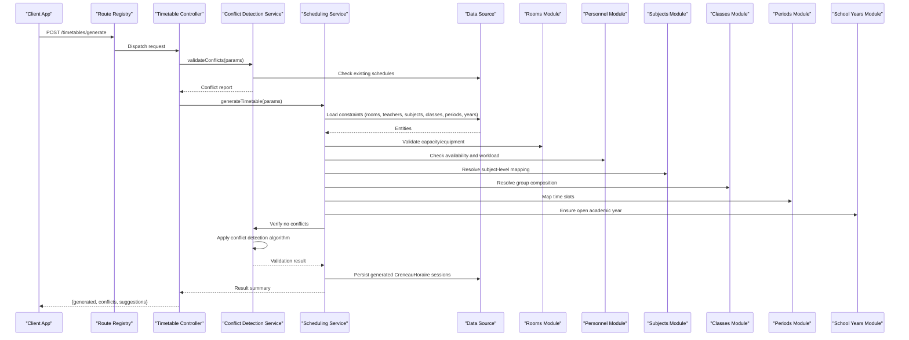

**Diagram sources**
- [route-registry.ts](file://backend/src/routes/route-registry.ts)
- [data-source.ts](file://backend/src/database/data-source.ts)
- [database.config.ts](file://backend/src/config/database.config.ts)
- [emploi-du-temps](file://backend/src/modules/emploi-du-temps)
- [salles](file://backend/src/modules/salles)
- [personnel](file://backend/src/modules/personnel)
- [matieres](file://backend/src/modules/matieres)
- [classes](file://backend/src/modules/classes)
- [periodes](file://backend/src/modules/periodes)
- [annees-scolaires](file://backend/src/modules/annees-scolaires)

## Detailed Component Analysis

### CreneauHoraire Entity Architecture
**New** The system now uses a unified CreneauHoraire entity that consolidates the functionality previously split between EmploiDuTemps and RepartitionHoraire entities. This architectural improvement provides:

- **Centralized Time Slot Management**: Single entity handles all scheduling-related data
- **Improved Data Integrity**: Reduced complexity in relationships and foreign keys
- **Enhanced Performance**: Fewer joins and queries for schedule operations
- **Simplified Maintenance**: Unified update and migration processes

Key attributes include:
- Unique identifier and reference to academic context
- Teacher, subject, and class associations
- Room allocation and time slot specifications
- Status tracking and validation flags
- Audit trail and modification history

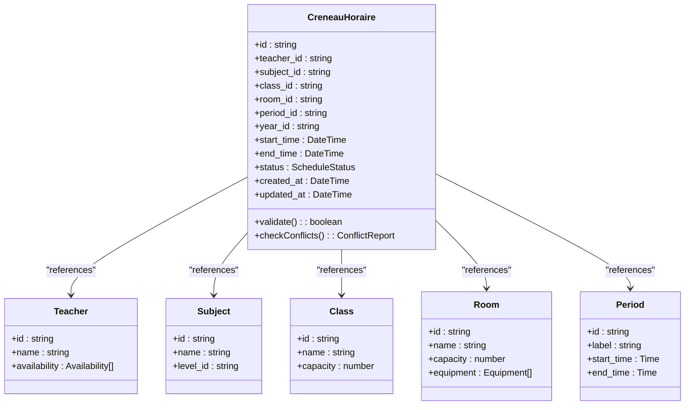

**Diagram sources**
- [063-creer-module-emploi-du-temps.sql](file://backend/database/migrations/063-creer-module-emploi-du-temps.sql)
- [065-creer-templates-emploi-du-temps.sql](file://backend/database/migrations/065-creer-templates-emploi-du-temps.sql)

**Section sources**
- [063-creer-module-emploi-du-temps.sql](file://backend/database/migrations/063-creer-module-emploi-du-temps.sql)
- [065-creer-templates-emploi-du-temps.sql](file://backend/database/migrations/065-creer-templates-emploi-du-temps.sql)

### Enhanced Timetable Generation Algorithm
The algorithm uses an improved constraint satisfaction approach with the new CreneauHoraire entity:
- **Inputs**: subjects, classes, teachers, rooms, periods, school year, templates.
- **Constraints**:
  - Teacher availability windows and maximum weekly hours.
  - Room capacity and required equipment.
  - Subject-class mappings and coefficients.
  - Class grouping rules and principal room preference.
  - Non-overlapping sessions for same resource (teacher, room, class).
- **Process**:
  - Build candidate sessions from templates or programmatic rules.
  - Score candidates based on fit (capacity match, proximity to preferred slots, workload balance).
  - Assign sessions greedily with backtracking when conflicts arise.
  - Detect and resolve conflicts by reassigning alternative slots/rooms or flagging for manual review.
  - Persist final schedule as CreneauHoraire entities and return conflict report.

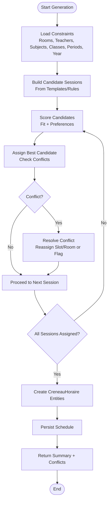

**Diagram sources**
- [063-creer-module-emploi-du-temps.sql](file://backend/database/migrations/063-creer-module-emploi-du-temps.sql)
- [065-creer-templates-emploi-du-temps.sql](file://backend/database/migrations/065-creer-templates-emploi-du-temps.sql)
- [103-templates-periode-personnalisables.sql](file://backend/database/migrations/103-templates-periode-personnalisables.sql)
- [104-refonte-periodes-niveaux-configurables.sql](file://backend/database/migrations/104-refonte-periodes-niveaux-configurables.sql)
- [105-migration-templates-v5.sql](file://backend/database/migrations/105-migration-templates-v5.sql)
- [070-module-salles.sql](file://backend/database/migrations/070-module-salles.sql)
- [100-classes-salle-principale.sql](file://backend/database/migrations/100-classes-salle-principale.sql)
- [101-normalisation-annee-scolaire-cloture.sql](file://backend/database/migrations/101-normalisation-annee-scolaire-cloture.sql)
- [102-periodes-hierarchie.sql](file://backend/database/migrations/102-periodes-hierarchie.sql)

**Section sources**
- [063-creer-module-emploi-du-temps.sql](file://backend/database/migrations/063-creer-module-emploi-du-temps.sql)
- [065-creer-templates-emploi-du-temps.sql](file://backend/database/migrations/065-creer-templates-emploi-du-temps.sql)
- [103-templates-periode-personnalisables.sql](file://backend/database/migrations/103-templates-periode-personnalisables.sql)
- [104-refonte-periodes-niveaux-configurables.sql](file://backend/database/migrations/104-refonte-periodes-niveaux-configurables.sql)
- [105-migration-templates-v5.sql](file://backend/database/migrations/105-migration-templates-v5.sql)
- [070-module-salles.sql](file://backend/database/migrations/070-module-salles.sql)
- [100-classes-salle-principale.sql](file://backend/database/migrations/100-classes-salle-principale.sql)
- [101-normalisation-annee-scolaire-cloture.sql](file://backend/database/migrations/101-normalisation-annee-scolaire-cloture.sql)
- [102-periodes-hierarchie.sql](file://backend/database/migrations/102-periodes-hierarchie.sql)

### Conflict Detection Service
**New** A dedicated conflict detection service provides comprehensive validation and resolution capabilities:

- **Multi-dimensional Conflict Checking**: Validates against teachers, rooms, and classes simultaneously
- **Real-time Validation**: Immediate feedback during schedule modifications
- **Intelligent Resolution Suggestions**: Recommends alternative time slots and rooms
- **Batch Processing**: Efficient handling of bulk schedule operations
- **Audit Trail**: Complete logging of conflict detection and resolution actions

The service implements advanced algorithms for:
- Temporal overlap detection using interval arithmetic
- Resource capacity validation with equipment requirements
- Workload balancing across teachers and rooms
- Preference scoring and optimization recommendations

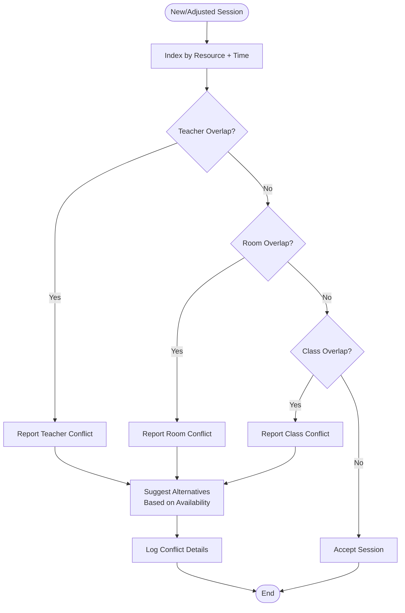

**Diagram sources**
- [063-creer-module-emploi-du-temps.sql](file://backend/database/migrations/063-creer-module-emploi-du-temps.sql)

**Section sources**
- [063-creer-module-emploi-du-temps.sql](file://backend/database/migrations/063-creer-module-emploi-du-temps.sql)

### Manual Schedule Adjustments
Manual adjustments allow administrators to:
- Drag-and-drop sessions to different periods or rooms.
- Swap teachers for a session if available.
- Override room assignments based on special needs.
- Lock sessions to prevent auto-regeneration from overwriting changes.

Workflow:
- Fetch current schedule for a period/year/class.
- Validate proposed change against constraints using conflict detection service.
- Apply change and update audit trail.
- Notify affected parties.

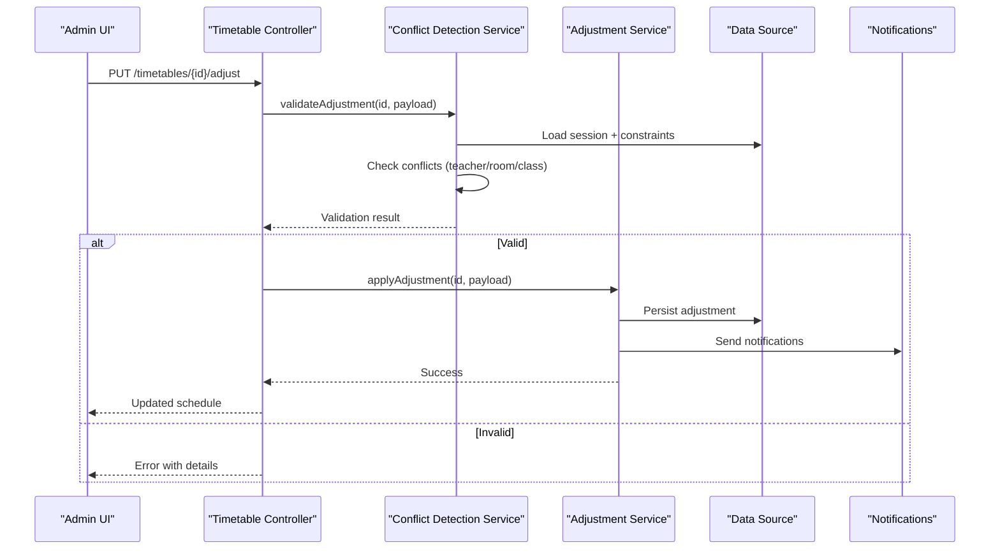

**Diagram sources**
- [route-registry.ts](file://backend/src/routes/route-registry.ts)
- [data-source.ts](file://backend/src/database/data-source.ts)
- [047-notifications-ameliorations.sql](file://backend/database/migrations/047-notifications-ameliorations.sql)
- [048-notifications-performance-optimizations.sql](file://backend/database/migrations/048-notifications-performance-optimizations.sql)

**Section sources**
- [route-registry.ts](file://backend/src/routes/route-registry.ts)
- [data-source.ts](file://backend/src/database/data-source.ts)
- [047-notifications-ameliorations.sql](file://backend/database/migrations/047-notifications-ameliorations.sql)
- [048-notifications-performance-optimizations.sql](file://backend/database/migrations/048-notifications-performance-optimizations.sql)

### Template-Based Scheduling
Templates encapsulate recurring patterns:
- Weekly structure (periods per day).
- Subject distribution across classes.
- Preferred rooms and teacher allocations.
- Customizable per period and level.

Operations:
- Create/edit templates linked to periods and levels.
- Apply templates to generate initial schedules.
- Version templates to track changes.

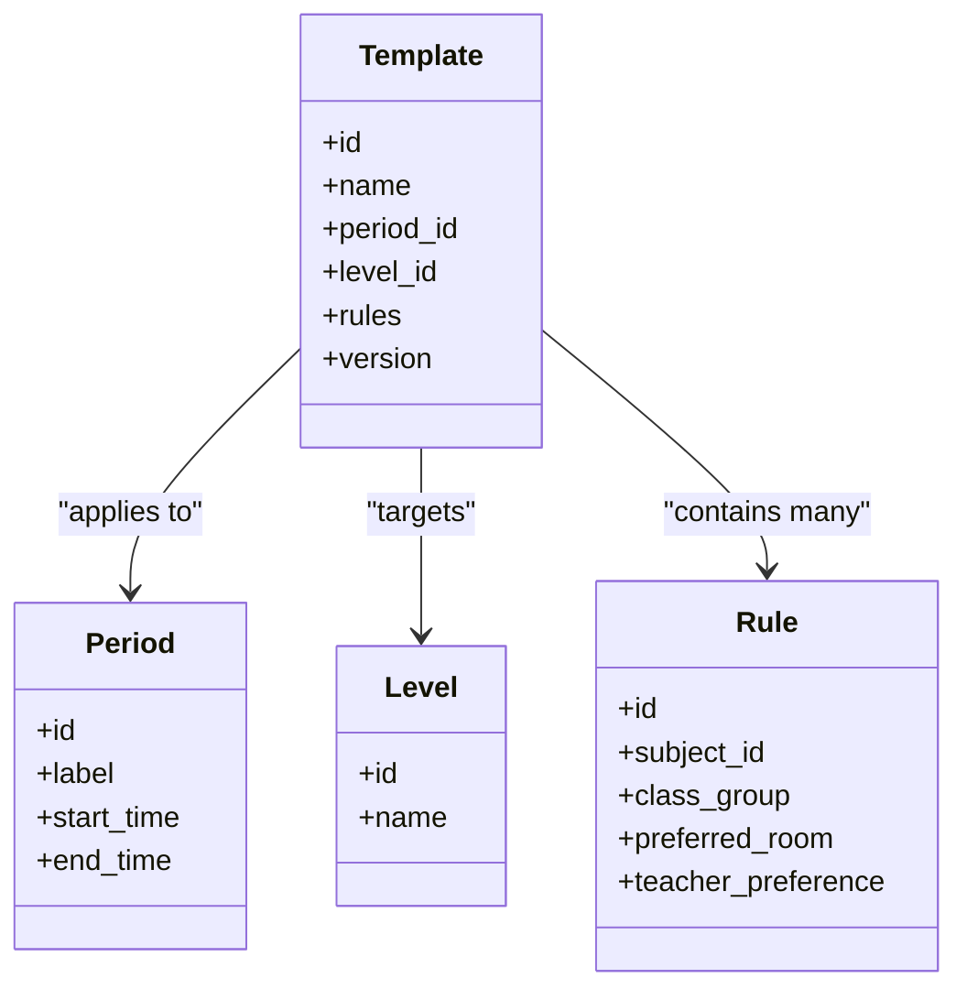

**Diagram sources**
- [065-creer-templates-emploi-du-temps.sql](file://backend/database/migrations/065-creer-templates-emploi-du-temps.sql)
- [103-templates-periode-personnalisables.sql](file://backend/database/migrations/103-templates-periode-personnalisables.sql)
- [104-refonte-periodes-niveaux-configurables.sql](file://backend/database/migrations/104-refonte-periodes-niveaux-configurables.sql)
- [105-migration-templates-v5.sql](file://backend/database/migrations/105-migration-templates-v5.sql)

**Section sources**
- [065-creer-templates-emploi-du-temps.sql](file://backend/database/migrations/065-creer-templates-emploi-du-temps.sql)
- [103-templates-periode-personnalisables.sql](file://backend/database/migrations/103-templates-periode-personnalisables.sql)
- [104-refonte-periodes-niveaux-configurables.sql](file://backend/database/migrations/104-refonte-periodes-niveaux-configurables.sql)
- [105-migration-templates-v5.sql](file://backend/database/migrations/105-migration-templates-v5.sql)

### Periodic Timetable Management
Management across academic cycles:
- Anchor schedules to school years and closures.
- Hierarchical periods enable multi-term structures.
- Regeneration strategies support updates without losing locked sessions.

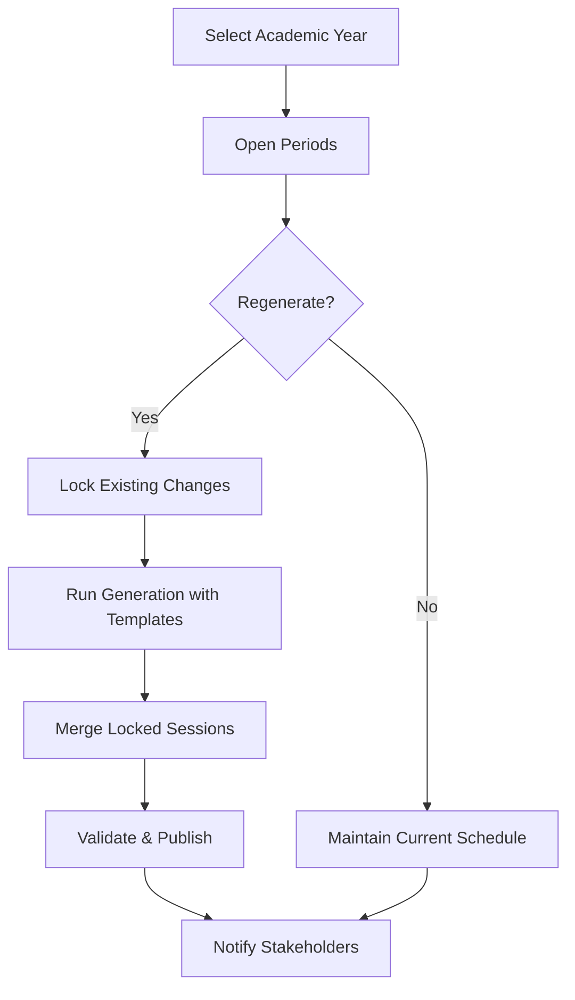

**Diagram sources**
- [101-normalisation-annee-scolaire-cloture.sql](file://backend/database/migrations/101-normalisation-annee-scolaire-cloture.sql)
- [102-periodes-hierarchie.sql](file://backend/database/migrations/102-periodes-hierarchie.sql)

**Section sources**
- [101-normalisation-annee-scolaire-cloture.sql](file://backend/database/migrations/101-normalisation-annee-scolaire-cloture.sql)
- [102-periodes-hierarchie.sql](file://backend/database/migrations/102-periodes-hierarchie.sql)

### Bulk Scheduling Operations
Bulk operations include:
- Importing sessions via CSV/JSON.
- Batch applying templates across multiple classes.
- Mass room reallocation based on capacity/equipment filters.
- Batch locking/unlocking sessions for protection during regeneration.

Operational flow:
- Validate input dataset.
- Partition into transactions for resilience.
- Execute with progress tracking and rollback on failure.
- Produce summary and error logs.

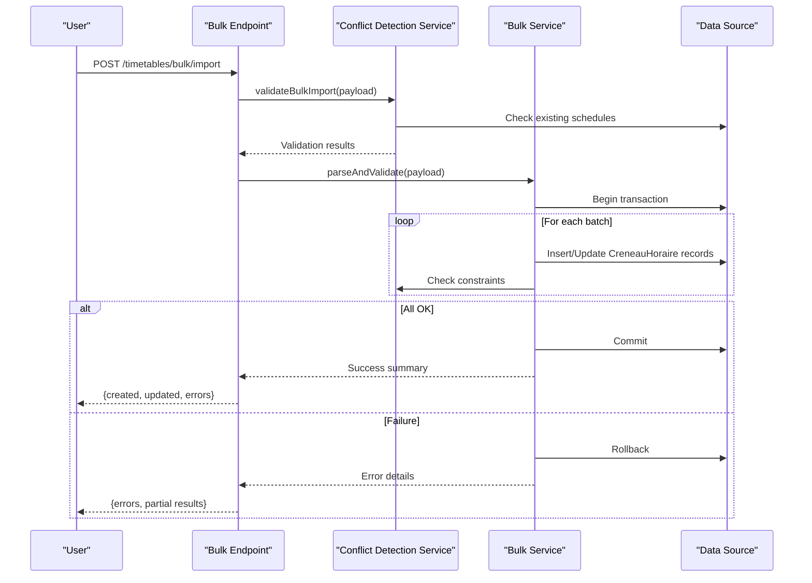

**Diagram sources**
- [route-registry.ts](file://backend/src/routes/route-registry.ts)
- [data-source.ts](file://backend/src/database/data-source.ts)

**Section sources**
- [route-registry.ts](file://backend/src/routes/route-registry.ts)
- [data-source.ts](file://backend/src/database/data-source.ts)

### Integration Points
- Teacher Assignments: Link teachers to subjects and classes; enforce availability and workload limits.
- Room Management: Enforce capacity and equipment; assign principal rooms per class.
- Academic Calendar: Use school year and period hierarchy to scope schedules; respect closure status.

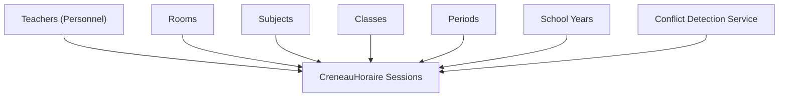

**Diagram sources**
- [088-refactorisation-architecture-academique.sql](file://backend/database/migrations/088-refactorisation-architecture-academique.sql)
- [089-finalisation-architecture-academique-v2.sql](file://backend/database/migrations/089-finalisation-architecture-academique-v2.sql)
- [091-peuplement-architecture-academique.sql](file://backend/database/migrations/091-peuplement-architecture-academique.sql)
- [092-refactorisation-classeAnneeId.sql](file://backend/database/migrations/092-refactorisation-classeAnneeId.sql)
- [070-module-salles.sql](file://backend/database/migrations/070-module-salles.sql)
- [100-classes-salle-principale.sql](file://backend/database/migrations/100-classes-salle-principale.sql)
- [101-normalisation-annee-scolaire-cloture.sql](file://backend/database/migrations/101-normalisation-annee-scolaire-cloture.sql)
- [102-periodes-hierarchie.sql](file://backend/database/migrations/102-periodes-hierarchie.sql)

**Section sources**
- [088-refactorisation-architecture-academique.sql](file://backend/database/migrations/088-refactorisation-architecture-academique.sql)
- [089-finalisation-architecture-academique-v2.sql](file://backend/database/migrations/089-finalisation-architecture-academique-v2.sql)
- [091-peuplement-architecture-academique.sql](file://backend/database/migrations/091-peuplement-architecture-academique.sql)
- [092-refactorisation-classeAnneeId.sql](file://backend/database/migrations/092-refactorisation-classeAnneeId.sql)
- [070-module-salles.sql](file://backend/database/migrations/070-module-salles.sql)
- [100-classes-salle-principale.sql](file://backend/database/migrations/100-classes-salle-principale.sql)
- [101-normalisation-annee-scolaire-cloture.sql](file://backend/database/migrations/101-normalisation-annee-scolaire-cloture.sql)
- [102-periodes-hierarchie.sql](file://backend/database/migrations/102-periodes-hierarchie.sql)

## Dependency Analysis
The scheduling module depends on several domain modules and shared configuration:
- Route registry wires controllers to HTTP endpoints.
- Data source centralizes database connectivity.
- Modules encapsulate domain logic and persistence.
- Conflict detection service provides cross-cutting validation concerns.

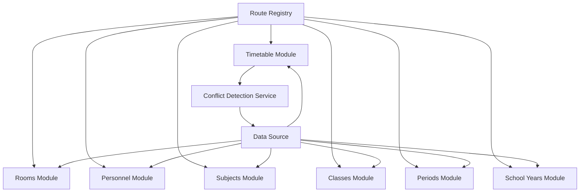

**Diagram sources**
- [route-registry.ts](file://backend/src/routes/route-registry.ts)
- [data-source.ts](file://backend/src/database/data-source.ts)
- [emploi-du-temps](file://backend/src/modules/emploi-du-temps)
- [salles](file://backend/src/modules/salles)
- [personnel](file://backend/src/modules/personnel)
- [matieres](file://backend/src/modules/matieres)
- [classes](file://backend/src/modules/classes)
- [periodes](file://backend/src/modules/periodes)
- [annees-scolaires](file://backend/src/modules/annees-scolaires)

**Section sources**
- [route-registry.ts](file://backend/src/routes/route-registry.ts)
- [data-source.ts](file://backend/src/database/data-source.ts)

## Performance Considerations
Optimization techniques applied across the system:
- **Enhanced indexing and query tuning** for timetable lookups and conflict checks using the unified CreneauHoraire entity.
- **Batch processing** for bulk imports and regenerations with improved transaction handling.
- **Transactional boundaries** to ensure consistency and reduce lock contention.
- **Notification performance improvements** to avoid blocking scheduling operations.
- **Multi-tenant scoping** to limit data access per establishment.
- **Conflict detection caching** for frequently accessed constraints.

Recommendations:
- Precompute candidate sets for templates to reduce runtime scoring.
- Cache frequently accessed constraints (rooms, teachers, periods).
- Use pagination for large schedule exports.
- Monitor long-running jobs and provide progress endpoints.
- Leverage the unified CreneauHoraire entity for optimized queries.

## Troubleshooting Guide
Common issues and resolutions:
- **Double-bookings detected**: Review conflict reports and adjust sessions manually or regenerate with stricter constraints using the conflict detection service.
- **Room capacity mismatch**: Verify room attributes and class sizes; update room capacity or reassign.
- **Teacher availability violations**: Confirm teacher availability windows and workload caps; adjust availability or redistribute sessions.
- **Academic year closed**: Ensure the selected school year is not closed before generating or modifying schedules.
- **Bulk import failures**: Inspect error logs for invalid rows; correct data and retry with smaller batches.
- **Entity relationship errors**: Verify CreneauHoraire references are valid and all required fields are populated.

Operational tips:
- Use locks to protect critical sessions during regeneration.
- Export current schedule before major changes to enable rollback.
- Leverage notifications to inform stakeholders of schedule updates.
- Utilize the conflict detection service for pre-validation before bulk operations.

**Section sources**
- [047-notifications-ameliorations.sql](file://backend/database/migrations/047-notifications-ameliorations.sql)
- [048-notifications-performance-optimizations.sql](file://backend/database/migrations/048-notifications-performance-optimizations.sql)
- [101-normalisation-annee-scolaire-cloture.sql](file://backend/database/migrations/101-normalisation-annee-scolaire-cloture.sql)

## Conclusion
The eLISAschool Timetable Creation and Scheduling system provides a robust, constraint-driven approach to building and managing academic schedules. With the modernized CreneauHoraire entity architecture, template-based automation, manual adjustment capabilities, and strong integration with rooms, teachers, subjects, classes, periods, and school years, it supports both rapid generation and fine-grained control. The addition of a dedicated conflict detection service and simplified controller architecture enhances maintainability and performance, ensuring reliable operation at scale.

## Appendices

### Practical Workflows
- **Automatic Generation**:
  - Select school year and periods.
  - Choose or create a template.
  - Run generation; review conflicts; accept or adjust.
- **Manual Adjustment**:
  - Open schedule view.
  - Drag/drop sessions to new slots/rooms.
  - Validate and save; receive notifications.
- **Template Management**:
  - Define period structure and rules.
  - Link to levels and subjects.
  - Version and apply to multiple classes.
- **Periodic Management**:
  - Lock important sessions.
  - Regenerate with updated inputs.
  - Merge locked sessions and publish.
- **Conflict Resolution**:
  - Use conflict detection service for validation.
  - Review suggested alternatives.
  - Apply intelligent resolutions automatically or manually.

### Migration Notes
**Important** When migrating from the previous EmploiDuTemps and RepartitionHoraire entities:
- All existing schedule data is migrated to the new CreneauHoraire entity structure.
- Foreign key relationships are preserved and enhanced.
- Performance improvements are immediate after migration.
- No manual intervention required for standard deployments.