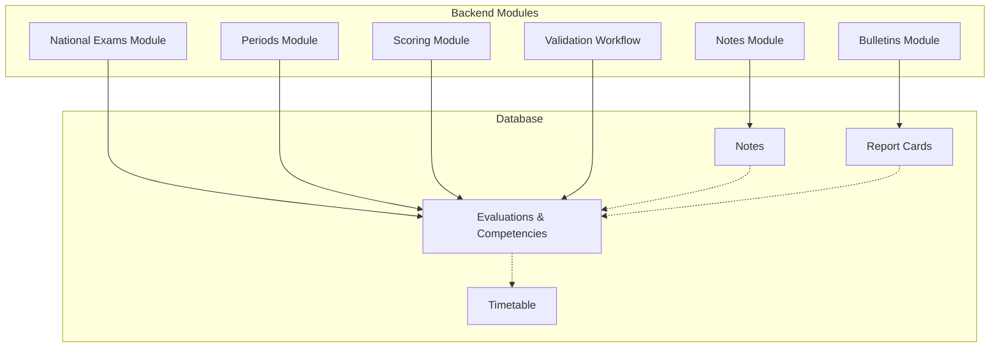
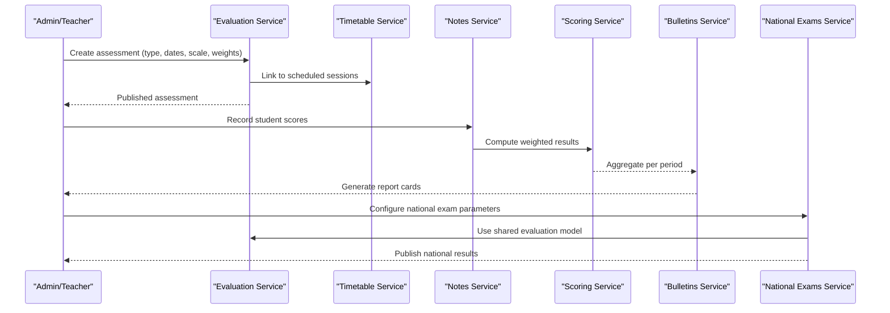
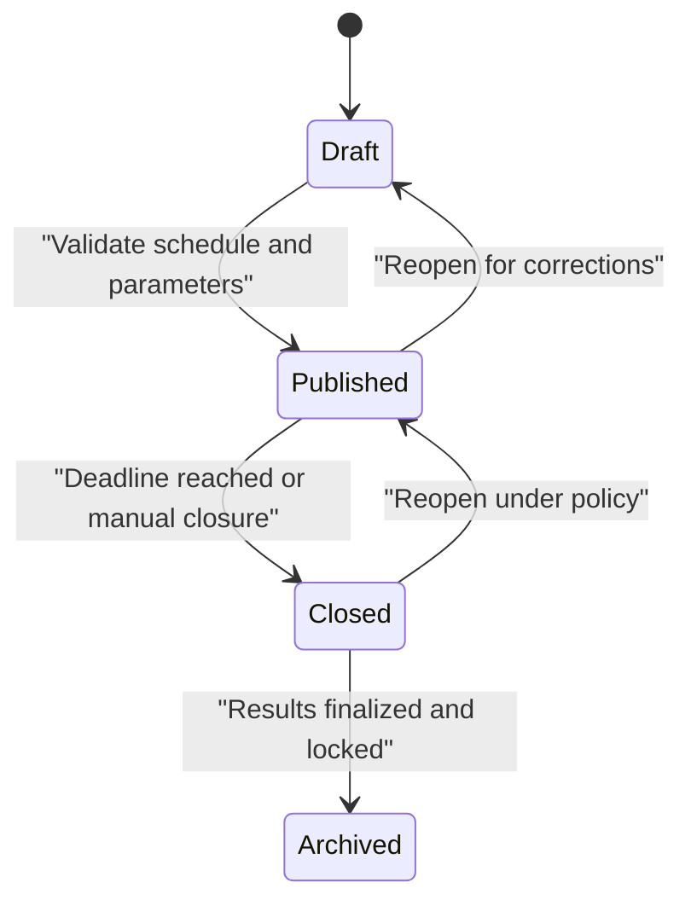
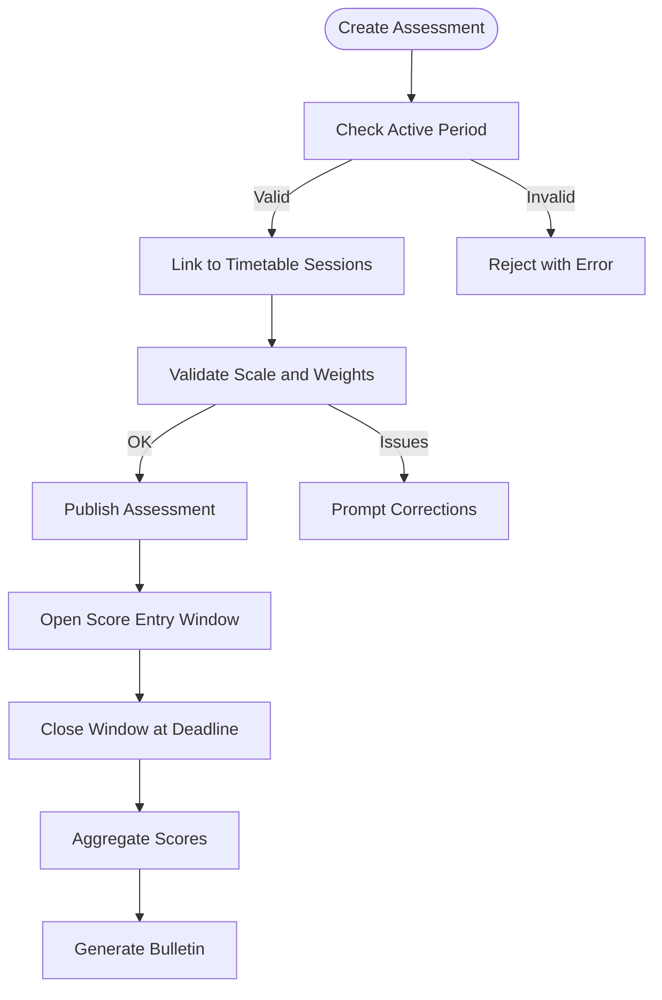
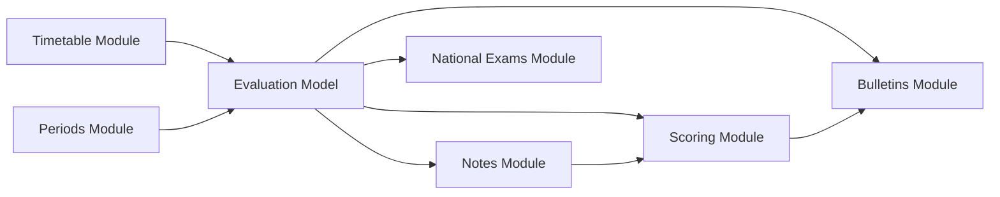

# Assessment Framework

<cite>
**Referenced Files in This Document**
- [106-rename-sequence-to-evaluation.sql](file://backend/database/migrations/106-rename-sequence-to-evaluation.sql)
- [062-creer-table-evaluations-competences.sql](file://backend/database/migrations/062-creer-table-evaluations-competences.sql)
- [063-creer-module-emploi-du-temps.sql](file://backend/database/migrations/063-creer-module-emploi-du-temps.sql)
- [084-cleanup-classe-id-notes.sql](file://backend/database/migrations/084-cleanup-classe-id-notes.sql)
- [092-refactorisation-classeAnneeId.sql](file://backend/database/migrations/092-refactorisation-classeAnneeId.sql)
- [notes/index.ts](file://backend/src/modules/notes/index.ts)
- [bulletins/index.ts](file://backend/src/modules/bulletins/index.ts)
- [examens-nationaux/index.ts](file://backend/src/modules/examens-nationaux/index.ts)
- [periodes/index.ts](file://backend/src/modules/periodes/index.ts)
- [scoring/index.ts](file://backend/src/modules/scoring/index.ts)
- [evaluation-workflow.ts](file://backend/src/modules/validation-workflow/services/evaluation-workflow.service.ts)
</cite>

## Table of Contents
1. [Introduction](#introduction)
2. [Project Structure](#project-structure)
3. [Core Components](#core-components)
4. [Architecture Overview](#architecture-overview)
5. [Detailed Component Analysis](#detailed-component-analysis)
6. [Dependency Analysis](#dependency-analysis)
7. [Performance Considerations](#performance-considerations)
8. [Troubleshooting Guide](#troubleshooting-guide)
9. [Conclusion](#conclusion)
10. [Appendices](#appendices)

## Introduction
This document defines the Assessment Framework for eLISAschool, covering all evaluation activities across continuous assessment, periodic exams, and national examinations. It explains how assessments are configured (grading scales, weights, criteria), their lifecycle from creation to completion (including validation rules and status management), and integration points with academic calendar and class scheduling systems. Practical examples illustrate setup workflows and parameter configuration.

## Project Structure
The assessment framework spans multiple modules and database migrations:
- Database schema and evolution for evaluations, competencies, timetables, notes, and report cards
- Module entry points for Notes, Report Cards (Bulletins), National Exams, Periods, Scoring, and Validation Workflow
- Migrations that rename sequences, create tables, and refactor identifiers to support robust assessment operations

**Diagram sources**
- [062-creer-table-evaluations-competences.sql](file://backend/database/migrations/062-creer-table-evaluations-competences.sql)
- [063-creer-module-emploi-du-temps.sql](file://backend/database/migrations/063-creer-module-emploi-du-temps.sql)
- [084-cleanup-classe-id-notes.sql](file://backend/database/migrations/084-cleanup-classe-id-notes.sql)
- [notes/index.ts](file://backend/src/modules/notes/index.ts)
- [bulletins/index.ts](file://backend/src/modules/bulletins/index.ts)
- [examens-nationaux/index.ts](file://backend/src/modules/examens-nationaux/index.ts)
- [periodes/index.ts](file://backend/src/modules/periodes/index.ts)
- [scoring/index.ts](file://backend/src/modules/scoring/index.ts)
- [evaluation-workflow.ts](file://backend/src/modules/validation-workflow/services/evaluation-workflow.service.ts)

**Section sources**
- [106-rename-sequence-to-evaluation.sql](file://backend/database/migrations/106-rename-sequence-to-evaluation.sql)
- [062-creer-table-evaluations-competences.sql](file://backend/database/migrations/062-creer-table-evaluations-competences.sql)
- [063-creer-module-emploi-du-temps.sql](file://backend/database/migrations/063-creer-module-emploi-du-temps.sql)
- [084-cleanup-classe-id-notes.sql](file://backend/database/migrations/084-cleanup-classe-id-notes.sql)
- [092-refactorisation-classeAnneeId.sql](file://backend/database/migrations/092-refactorisation-classeAnneeId.sql)
- [notes/index.ts](file://backend/src/modules/notes/index.ts)
- [bulletins/index.ts](file://backend/src/modules/bulletins/index.ts)
- [examens-nationaux/index.ts](file://backend/src/modules/examens-nationaux/index.ts)
- [periodes/index.ts](file://backend/src/modules/periodes/index.ts)
- [scoring/index.ts](file://backend/src/modules/scoring/index.ts)
- [evaluation-workflow.ts](file://backend/src/modules/validation-workflow/services/evaluation-workflow.service.ts)

## Core Components
- Evaluation entities and competency mapping: foundational tables for assessments and skill-based evaluation
- Timetable integration: aligns assessments with scheduled classes and rooms
- Notes module: captures scores and links them to evaluations and students
- Bulletins module: aggregates scores into report cards per period
- National Exams module: manages high-stakes external assessments
- Periods module: defines academic periods used to scope assessments and reports
- Scoring module: computes weighted results and final grades based on configured scales and criteria
- Validation workflow: enforces lifecycle transitions and business rules for assessments

Key responsibilities:
- Configuration of grading scales, weight assignments, and evaluation criteria
- Lifecycle state management (draft, published, closed, archived)
- Integration with academic calendar and timetable
- Aggregation and reporting for bulletins and national exams

**Section sources**
- [062-creer-table-evaluations-competences.sql](file://backend/database/migrations/062-creer-table-evaluations-competences.sql)
- [063-creer-module-emploi-du-temps.sql](file://backend/database/migrations/063-creer-module-emploi-du-temps.sql)
- [084-cleanup-classe-id-notes.sql](file://backend/database/migrations/084-cleanup-classe-id-notes.sql)
- [092-refactorisation-classeAnneeId.sql](file://backend/database/migrations/092-refactorisation-classeAnneeId.sql)
- [notes/index.ts](file://backend/src/modules/notes/index.ts)
- [bulletins/index.ts](file://backend/src/modules/bulletins/index.ts)
- [examens-nationaux/index.ts](file://backend/src/modules/examens-nationaux/index.ts)
- [periodes/index.ts](file://backend/src/modules/periodes/index.ts)
- [scoring/index.ts](file://backend/src/modules/scoring/index.ts)
- [evaluation-workflow.ts](file://backend/src/modules/validation-workflow/services/evaluation-workflow.service.ts)

## Architecture Overview
The assessment architecture is modular and event-driven around evaluations. Assessments are created within a period, linked to subjects/classes, and scored via notes. Results are aggregated by scoring and reported through bulletins. National exams follow a specialized flow but reuse core evaluation structures.

**Diagram sources**
- [062-creer-table-evaluations-competences.sql](file://backend/database/migrations/062-creer-table-evaluations-competences.sql)
- [063-creer-module-emploi-du-temps.sql](file://backend/database/migrations/063-creer-module-emploi-du-temps.sql)
- [notes/index.ts](file://backend/src/modules/notes/index.ts)
- [scoring/index.ts](file://backend/src/modules/scoring/index.ts)
- [bulletins/index.ts](file://backend/src/modules/bulletins/index.ts)
- [examens-nationaux/index.ts](file://backend/src/modules/examens-nationaux/index.ts)

## Detailed Component Analysis

### Continuous Assessment
Continuous assessment covers ongoing evaluations throughout a period. It uses the same evaluation model as other types but focuses on frequent, lower-stakes measurements.

- Creation: Define type, subject/class linkage, date range, grading scale, and weights
- Scheduling: Align with timetable sessions to ensure availability
- Scoring: Capture notes per student; compute weighted averages
- Reporting: Include in bulletin generation per period

Practical example:
- Set up a weekly quiz series for a subject
- Assign each quiz a weight and link to a timetable slot
- Record scores after each session
- Review running averages in the dashboard before bulletin generation

**Section sources**
- [062-creer-table-evaluations-competences.sql](file://backend/database/migrations/062-creer-table-evaluations-competences.sql)
- [063-creer-module-emploi-du-temps.sql](file://backend/database/migrations/063-creer-module-emploi-du-temps.sql)
- [notes/index.ts](file://backend/src/modules/notes/index.ts)
- [scoring/index.ts](file://backend/src/modules/scoring/index.ts)
- [bulletins/index.ts](file://backend/src/modules/bulletins/index.ts)

### Periodic Exams
Periodic exams are structured assessments aligned with academic periods. They typically carry higher weights and influence bulletin outcomes significantly.

- Configuration: Select period, assign subject/class, define grading scale and coefficients
- Validation: Ensure no conflicts with timetable and that period boundaries are respected
- Execution: Collect scores, apply weighting, and lock entries if required
- Reporting: Feed into bulletin aggregation for the selected period

Practical example:
- Schedule mid-term and end-of-term exams
- Assign coefficients per subject
- Lock submissions after deadline
- Generate interim bulletins for parents and teachers

**Section sources**
- [periodes/index.ts](file://backend/src/modules/periodes/index.ts)
- [062-creer-table-evaluations-competences.sql](file://backend/database/migrations/062-creer-table-evaluations-competences.sql)
- [notes/index.ts](file://backend/src/modules/notes/index.ts)
- [scoring/index.ts](file://backend/src/modules/scoring/index.ts)
- [bulletins/index.ts](file://backend/src/modules/bulletins/index.ts)

### National Examinations
National exams represent high-stakes external assessments. The system supports configuring parameters specific to national standards while reusing core evaluation structures.

- Setup: Define exam type, eligibility criteria, grading rubrics, and result publication rules
- Integration: Coordinate with timetable for exam sessions and invigilation
- Processing: Capture scores, validate against national constraints, and publish official results
- Archiving: Maintain historical records for compliance and analysis

Practical example:
- Configure national math exam with standardized grading thresholds
- Map eligible classes and sections
- Publish results according to ministry timelines
- Archive past years’ data for auditability

**Section sources**
- [examens-nationaux/index.ts](file://backend/src/modules/examens-nationaux/index.ts)
- [062-creer-table-evaluations-competences.sql](file://backend/database/migrations/062-creer-table-evaluations-competences.sql)
- [063-creer-module-emploi-du-temps.sql](file://backend/database/migrations/063-creer-module-emploi-du-temps.sql)

### Assessment Configuration
Assessment configuration centers on grading scales, weight assignments, and evaluation criteria.

- Grading scales: Define numeric ranges, letter grades, and pass/fail thresholds
- Weight assignments: Assign coefficients per assessment type and subject
- Evaluation criteria: Map competencies to assessments for skill-based reporting
- Constraints: Enforce minimum/maximum scores, rounding rules, and validation checks

Practical example:
- Set a 0–20 scale with 10 as passing threshold
- Assign coefficient 2 for periodic exams and 1 for continuous quizzes
- Link competencies to each assessment for detailed feedback

**Section sources**
- [062-creer-table-evaluations-competences.sql](file://backend/database/migrations/062-creer-table-evaluations-competences.sql)
- [scoring/index.ts](file://backend/src/modules/scoring/index.ts)

### Assessment Lifecycle
The lifecycle governs transitions from creation to completion, including validation rules and status management.

Validation rules:
- Date ranges must fall within the active period
- No timetable conflicts for scheduled sessions
- Required fields (scale, weights, criteria) must be complete
- Score entry windows enforced by policy

Status management:
- Draft: editable, not visible to students
- Published: visible, score entry allowed
- Closed: score entry disabled, review mode
- Archived: immutable, included in historical reports

**Diagram sources**
- [evaluation-workflow.ts](file://backend/src/modules/validation-workflow/services/evaluation-workflow.service.ts)

**Section sources**
- [evaluation-workflow.ts](file://backend/src/modules/validation-workflow/services/evaluation-workflow.service.ts)

### Integration Points
- Academic calendar: Assessments are scoped to periods; deadlines and publication dates align with calendar events
- Class scheduling: Timetable integration ensures assessments occur during allocated slots and rooms
- Reporting: Bulletins aggregate scores per period using configured weights and scales

**Diagram sources**
- [periodes/index.ts](file://backend/src/modules/periodes/index.ts)
- [063-creer-module-emploi-du-temps.sql](file://backend/database/migrations/063-creer-module-emploi-du-temps.sql)
- [notes/index.ts](file://backend/src/modules/notes/index.ts)
- [bulletins/index.ts](file://backend/src/modules/bulletins/index.ts)

**Section sources**
- [periodes/index.ts](file://backend/src/modules/periodes/index.ts)
- [063-creer-module-emploi-du-temps.sql](file://backend/database/migrations/063-creer-module-emploi-du-temps.sql)
- [notes/index.ts](file://backend/src/modules/notes/index.ts)
- [bulletins/index.ts](file://backend/src/modules/bulletins/index.ts)

## Dependency Analysis
Assessment components depend on shared evaluation models and supporting services. The following diagram shows key dependencies among modules and database artifacts.

**Diagram sources**
- [062-creer-table-evaluations-competences.sql](file://backend/database/migrations/062-creer-table-evaluations-competences.sql)
- [063-creer-module-emploi-du-temps.sql](file://backend/database/migrations/063-creer-module-emploi-du-temps.sql)
- [notes/index.ts](file://backend/src/modules/notes/index.ts)
- [scoring/index.ts](file://backend/src/modules/scoring/index.ts)
- [bulletins/index.ts](file://backend/src/modules/bulletins/index.ts)
- [examens-nationaux/index.ts](file://backend/src/modules/examens-nationaux/index.ts)
- [periodes/index.ts](file://backend/src/modules/periodes/index.ts)

**Section sources**
- [062-creer-table-evaluations-competences.sql](file://backend/database/migrations/062-creer-table-evaluations-competences.sql)
- [063-creer-module-emploi-du-temps.sql](file://backend/database/migrations/063-creer-module-emploi-du-temps.sql)
- [notes/index.ts](file://backend/src/modules/notes/index.ts)
- [scoring/index.ts](file://backend/src/modules/scoring/index.ts)
- [bulletins/index.ts](file://backend/src/modules/bulletins/index.ts)
- [examens-nationaux/index.ts](file://backend/src/modules/examens-nationaux/index.ts)
- [periodes/index.ts](file://backend/src/modules/periodes/index.ts)

## Performance Considerations
- Indexing: Ensure indexes on evaluation IDs, student IDs, and period boundaries to optimize queries for scoring and reporting
- Batch processing: Aggregate scores in batches to reduce database load during bulletin generation
- Caching: Cache computed weights and scales for frequently accessed subjects and periods
- Concurrency control: Prevent concurrent score edits during closed windows to maintain data integrity

[No sources needed since this section provides general guidance]

## Troubleshooting Guide
Common issues and resolutions:
- Assessment outside period bounds: Verify period configuration and adjust dates accordingly
- Timetable conflicts: Reschedule sessions or remove conflicting assessments
- Missing weights or criteria: Complete required fields before publishing
- Score entry blocked: Confirm window is open and user has permissions
- Bulletin discrepancies: Re-run aggregation and validate weights and rounding rules

Operational checks:
- Sequence naming consistency: Ensure evaluation sequences are correctly renamed and referenced
- Identifier refactoring: Confirm class-year ID mappings are updated to avoid broken links
- Notes cleanup: Validate that obsolete class IDs are removed to prevent query errors

**Section sources**
- [106-rename-sequence-to-evaluation.sql](file://backend/database/migrations/106-rename-sequence-to-evaluation.sql)
- [092-refactorisation-classeAnneeId.sql](file://backend/database/migrations/092-refactorisation-classeAnneeId.sql)
- [084-cleanup-classe-id-notes.sql](file://backend/database/migrations/084-cleanup-classe-id-notes.sql)

## Conclusion
The eLISAschool Assessment Framework provides a unified foundation for continuous assessment, periodic exams, and national examinations. By centralizing evaluation models, enforcing lifecycle rules, and integrating with academic calendars and timetables, it enables consistent, scalable, and auditable assessment processes. Proper configuration of grading scales, weights, and criteria ensures accurate reporting and meaningful insights for educators and stakeholders.

[No sources needed since this section summarizes without analyzing specific files]

## Appendices

### Practical Examples

- Setting up continuous assessment:
  - Create an evaluation linked to a subject and class
  - Assign a low coefficient and short date range
  - Link to weekly timetable sessions
  - Record scores incrementally and monitor running averages

- Configuring grading parameters:
  - Define a 0–20 scale with pass threshold at 10
  - Assign coefficients: continuous = 1, periodic = 2
  - Map competencies to assessments for detailed feedback

- Managing assessment schedules:
  - Align assessments with academic periods
  - Avoid timetable conflicts
  - Publish assessments and enforce score entry windows
  - Generate bulletins after closing windows

- National examination setup:
  - Configure eligibility and grading rubrics
  - Schedule exam sessions in the timetable
  - Publish results according to official timelines
  - Archive historical data for compliance

[No sources needed since this section provides general guidance]