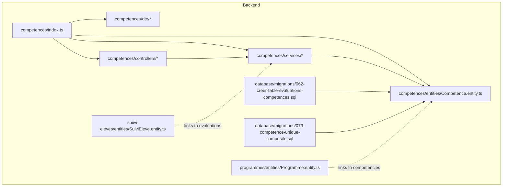
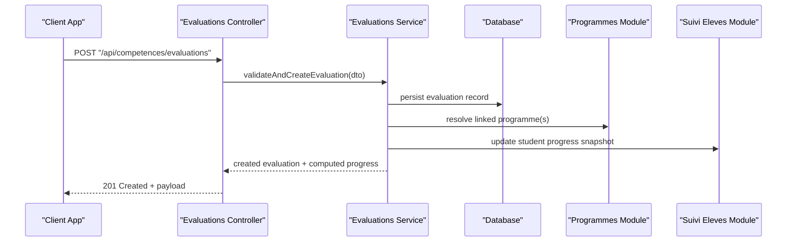
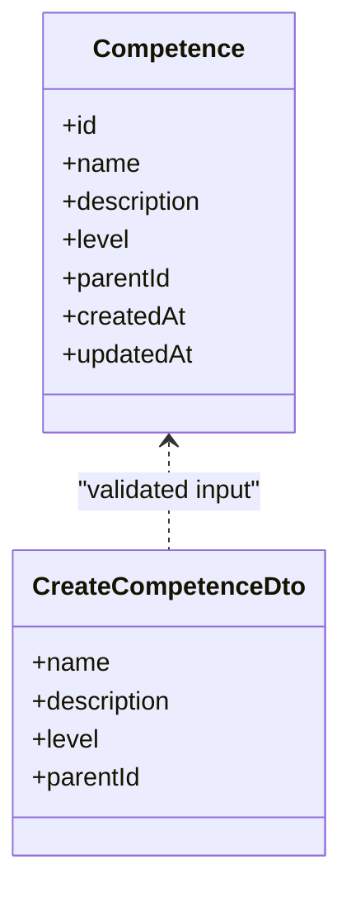
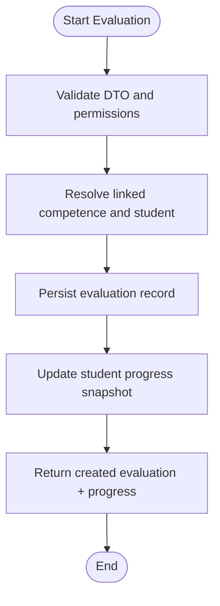
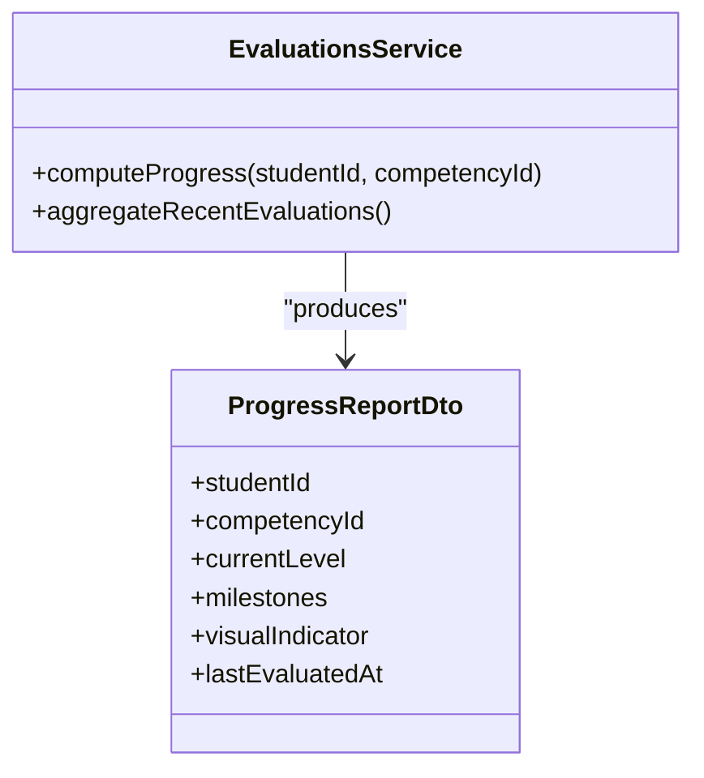
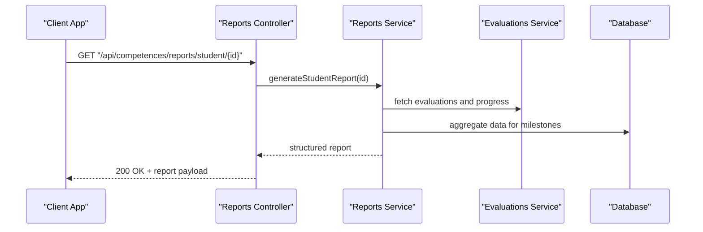
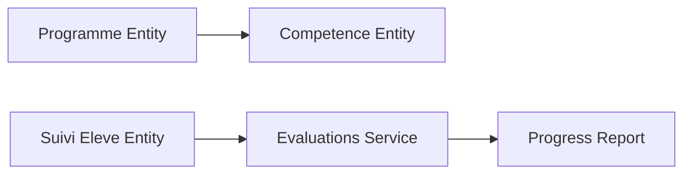
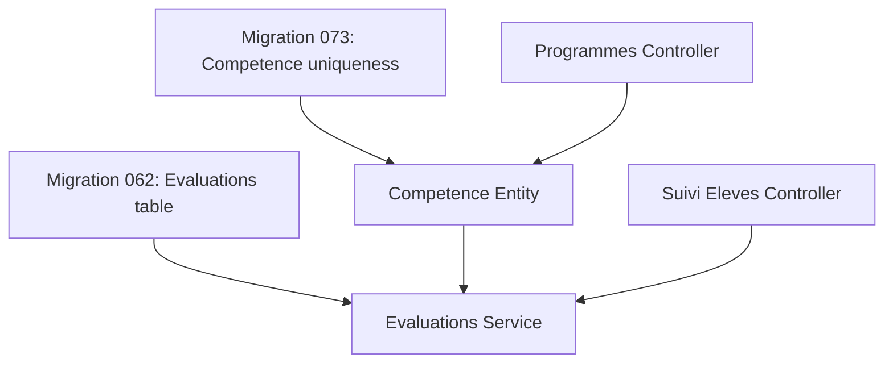

# Competency Tracking System

<cite>
**Referenced Files in This Document**
- [062-creer-table-evaluations-competences.sql](file://backend/database/migrations/062-creer-table-evaluations-competences.sql)
- [073-competence-unique-composite.sql](file://backend/database/migrations/073-competence-unique-composite.sql)
- [competences/index.ts](file://backend/src/modules/competences/index.ts)
- [competences/entities/Competence.entity.ts](file://backend/src/modules/competences/entities/Competence.entity.ts)
- [competences/dto/CreateCompetenceDto.ts](file://backend/src/modules/competences/dto/CreateCompetenceDto.ts)
- [competences/controllers/competences.controller.ts](file://backend/src/modules/competences/controllers/competences.controller.ts)
- [competences/services/competences.service.ts](file://backend/src/modules/competences/services/competences.service.ts)
- [competences/dto/EvaluateCompetenceDto.ts](file://backend/src/modules/competences/dto/EvaluateCompetenceDto.ts)
- [competences/controllers/evaluations.controller.ts](file://backend/src/modules/competences/controllers/evaluations.controller.ts)
- [competences/services/evaluations.service.ts](file://backend/src/modules/competences/services/evaluations.service.ts)
- [competences/dto/ProgressReportDto.ts](file://backend/src/modules/competences/dto/ProgressReportDto.ts)
- [competences/controllers/reports.controller.ts](file://backend/src/modules/competences/controllers/reports.controller.ts)
- [competences/services/reports.service.ts](file://backend/src/modules/competences/services/reports.service.ts)
- [programmes/entities/Programme.entity.ts](file://backend/src/modules/programmes/entities/Programme.entity.ts)
- [programmes/controllers/programmes.controller.ts](file://backend/src/modules/programmes/controllers/programmes.controller.ts)
- [suiivi-eleves/entities/SuiviEleve.entity.ts](file://backend/src/modules/suiivi-eleves/entities/SuiviEleve.entity.ts)
- [suiivi-eleves/controllers/suivi-eleves.controller.ts](file://backend/src/modules/suiivi-eleves/controllers/suivi-eleves.controller.ts)
</cite>

## Table of Contents
1. [Introduction](#introduction)
2. [Project Structure](#project-structure)
3. [Core Components](#core-components)
4. [Architecture Overview](#architecture-overview)
5. [Detailed Component Analysis](#detailed-component-analysis)
6. [Dependency Analysis](#dependency-analysis)
7. [Performance Considerations](#performance-considerations)
8. [Troubleshooting Guide](#troubleshooting-guide)
9. [Conclusion](#conclusion)
10. [Appendices](#appendices)

## Introduction
This document describes the Competency Tracking System within eLISAschool, focusing on skill-based evaluation and progress monitoring. It explains competency definitions, skill hierarchies, proficiency levels, assessment workflows (observation-based and practical demonstrations), progress tracking with visual indicators, milestone achievement, learning path progression, and integration points with curriculum planning and individualized education programs (IEP). Practical examples are provided for creating competency frameworks, assessing student skills, and generating competency reports.

## Project Structure
The competency system is implemented as a dedicated module under backend/src/modules/competences, with database migrations defining the schema and controllers/services handling API logic. Related integrations exist in programmes (curriculum) and suivi-eleves (student tracking).

**Diagram sources**
- [competences/index.ts](file://backend/src/modules/competences/index.ts)
- [competences/entities/Competence.entity.ts](file://backend/src/modules/competences/entities/Competence.entity.ts)
- [062-creer-table-evaluations-competences.sql](file://backend/database/migrations/062-creer-table-evaluations-competences.sql)
- [073-competence-unique-composite.sql](file://backend/database/migrations/073-competence-unique-composite.sql)
- [programmes/entities/Programme.entity.ts](file://backend/src/modules/programmes/entities/Programme.entity.ts)
- [suiivi-eleves/entities/SuiviEleve.entity.ts](file://backend/src/modules/suiivi-eleves/entities/SuiviEleve.entity.ts)

**Section sources**
- [competences/index.ts](file://backend/src/modules/competences/index.ts)
- [062-creer-table-evaluations-competences.sql](file://backend/database/migrations/062-creer-table-evaluations-competences.sql)
- [073-competence-unique-composite.sql](file://backend/database/migrations/073-competence-unique-composite.sql)

## Core Components
- Competency model: Defines competencies, hierarchical relationships, descriptions, and proficiency levels.
- Evaluation records: Captures observation-based assessments and practical demonstrations with timestamps, observers, evidence references, and outcomes.
- Progress aggregation: Computes per-student progress across competencies, milestones, and learning paths.
- Reporting: Generates structured competency reports suitable for teachers, parents, and IEP teams.
- Integration points: Links to curriculum programmes and student tracking entities.

Key responsibilities:
- CRUD operations for competencies and their hierarchy.
- Recording and retrieving evaluations linked to students and competencies.
- Computing progress metrics and visual indicators.
- Producing standardized reports.

**Section sources**
- [competences/entities/Competence.entity.ts](file://backend/src/modules/competences/entities/Competence.entity.ts)
- [competences/dto/CreateCompetenceDto.ts](file://backend/src/modules/competences/dto/CreateCompetenceDto.ts)
- [competences/dto/EvaluateCompetenceDto.ts](file://backend/src/modules/competences/dto/EvaluateCompetenceDto.ts)
- [competences/dto/ProgressReportDto.ts](file://backend/src/modules/competences/dto/ProgressReportDto.ts)

## Architecture Overview
The system follows a layered architecture:
- Controllers expose REST endpoints for competency management, evaluations, and reporting.
- Services encapsulate business logic, including validation, aggregation, and report generation.
- Entities map to database tables defined by migrations.
- Integrations connect to programme and student tracking modules.

**Diagram sources**
- [competences/controllers/evaluations.controller.ts](file://backend/src/modules/competences/controllers/evaluations.controller.ts)
- [competences/services/evaluations.service.ts](file://backend/src/modules/competences/services/evaluations.service.ts)
- [programmes/controllers/programmes.controller.ts](file://backend/src/modules/programmes/controllers/programmes.controller.ts)
- [suiivi-eleves/controllers/suivi-eleves.controller.ts](file://backend/src/modules/suiivi-eleves/controllers/suivi-eleves.controller.ts)

## Detailed Component Analysis

### Competency Model and Hierarchy
Competencies support hierarchical organization (parent-child) and proficiency levels. The entity defines fields for identification, description, level metadata, and parent reference. Migrations ensure unique constraints and performance indexes.

**Diagram sources**
- [competences/entities/Competence.entity.ts](file://backend/src/modules/competences/entities/Competence.entity.ts)
- [competences/dto/CreateCompetenceDto.ts](file://backend/src/modules/competences/dto/CreateCompetenceDto.ts)
- [073-competence-unique-composite.sql](file://backend/database/migrations/073-competence-unique-composite.sql)

Practical example: Creating a competency framework
- Define top-level competencies (e.g., “Numeracy”, “Literacy”).
- Add child competencies (e.g., “Addition”, “Reading Comprehension”) with appropriate levels.
- Use the create endpoint to seed the hierarchy.

**Section sources**
- [competences/entities/Competence.entity.ts](file://backend/src/modules/competences/entities/Competence.entity.ts)
- [competences/dto/CreateCompetenceDto.ts](file://backend/src/modules/competences/dto/CreateCompetenceDto.ts)
- [competences/controllers/competences.controller.ts](file://backend/src/modules/competences/controllers/competences.controller.ts)
- [competences/services/competences.service.ts](file://backend/src/modules/competences/services/competences.service.ts)
- [073-competence-unique-composite.sql](file://backend/database/migrations/073-competence-unique-composite.sql)

### Evaluation Workflow (Observation-Based and Practical Demonstrations)
Evaluations capture teacher observations and practical demonstrations. Each evaluation links to a student, a competency, an observer, and includes contextual details such as date, method type, and outcome.

**Diagram sources**
- [competences/dto/EvaluateCompetenceDto.ts](file://backend/src/modules/competences/dto/EvaluateCompetenceDto.ts)
- [competences/controllers/evaluations.controller.ts](file://backend/src/modules/competences/controllers/evaluations.controller.ts)
- [competences/services/evaluations.service.ts](file://backend/src/modules/competences/services/evaluations.service.ts)

Practical example: Assessing a student skill
- Select a competency from the framework.
- Choose evaluation method: Observation or Practical Demonstration.
- Record evaluator notes, evidence references, and outcome.
- System updates progress and visual indicators automatically.

**Section sources**
- [competences/dto/EvaluateCompetenceDto.ts](file://backend/src/modules/competences/dto/EvaluateCompetenceDto.ts)
- [competences/controllers/evaluations.controller.ts](file://backend/src/modules/competences/controllers/evaluations.controller.ts)
- [competences/services/evaluations.service.ts](file://backend/src/modules/competences/services/evaluations.service.ts)
- [062-creer-table-evaluations-competences.sql](file://backend/database/migrations/062-creer-table-evaluations-competences.sql)

### Progress Tracking and Visual Indicators
Progress is computed per student across competencies, aggregating recent evaluations to determine current proficiency levels and milestones. Visual indicators reflect status (e.g., Not Started, In Progress, Achieved).

**Diagram sources**
- [competences/dto/ProgressReportDto.ts](file://backend/src/modules/competences/dto/ProgressReportDto.ts)
- [competences/services/evaluations.service.ts](file://backend/src/modules/competences/services/evaluations.service.ts)

Practical example: Monitoring learning path progression
- View dashboard showing competency trees with color-coded indicators.
- Filter by period or class to identify trends.
- Export snapshots for review meetings.

**Section sources**
- [competences/dto/ProgressReportDto.ts](file://backend/src/modules/competences/dto/ProgressReportDto.ts)
- [competences/services/evaluations.service.ts](file://backend/src/modules/competences/services/evaluations.service.ts)

### Reporting and Milestone Achievement
Reports summarize student competency profiles, highlighting achieved milestones and areas needing attention. Reports can be generated per student, per class, or aggregated at program level.

**Diagram sources**
- [competences/controllers/reports.controller.ts](file://backend/src/modules/competences/controllers/reports.controller.ts)
- [competences/services/reports.service.ts](file://backend/src/modules/competences/services/reports.service.ts)
- [competences/services/evaluations.service.ts](file://backend/src/modules/competences/services/evaluations.service.ts)

Practical example: Generating a competency report
- Request a report for a specific student.
- Review sections: strengths, growth areas, milestones achieved, recommended next steps.
- Share with parents or include in IEP documentation.

**Section sources**
- [competences/controllers/reports.controller.ts](file://backend/src/modules/competences/controllers/reports.controller.ts)
- [competences/services/reports.service.ts](file://backend/src/modules/competences/services/reports.service.ts)
- [competences/dto/ProgressReportDto.ts](file://backend/src/modules/competences/dto/ProgressReportDto.ts)

### Integration with Curriculum Planning and Individualized Education Programs
Curriculum programmes define intended learning outcomes and may reference competencies. Student tracking captures broader educational context and supports IEP alignment.

**Diagram sources**
- [programmes/entities/Programme.entity.ts](file://backend/src/modules/programmes/entities/Programme.entity.ts)
- [suiivi-eleves/entities/SuiviEleve.entity.ts](file://backend/src/modules/suiivi-eleves/entities/SuiviEleve.entity.ts)
- [competences/services/evaluations.service.ts](file://backend/src/modules/competences/services/evaluations.service.ts)

Practical example: Aligning competencies with curriculum and IEP
- Map programme objectives to competencies during planning.
- Use evaluations to measure alignment and adjust instruction.
- Incorporate progress snapshots into IEP reviews and goal setting.

**Section sources**
- [programmes/entities/Programme.entity.ts](file://backend/src/modules/programmes/entities/Programme.entity.ts)
- [programmes/controllers/programmes.controller.ts](file://backend/src/modules/programmes/controllers/programmes.controller.ts)
- [suiivi-eleves/entities/SuiviEleve.entity.ts](file://backend/src/modules/suiivi-eleves/entities/SuiviEleve.entity.ts)
- [suiivi-eleves/controllers/suivi-eleves.controller.ts](file://backend/src/modules/suiivi-eleves/controllers/suivi-eleves.controller.ts)

## Dependency Analysis
The competencies module depends on:
- Database schema defined by migrations.
- Programmes module for curriculum linkage.
- Student tracking module for progress context.

**Diagram sources**
- [062-creer-table-evaluations-competences.sql](file://backend/database/migrations/062-creer-table-evaluations-competences.sql)
- [073-competence-unique-composite.sql](file://backend/database/migrations/073-competence-unique-composite.sql)
- [competences/services/evaluations.service.ts](file://backend/src/modules/competences/services/evaluations.service.ts)
- [competences/entities/Competence.entity.ts](file://backend/src/modules/competences/entities/Competence.entity.ts)
- [programmes/controllers/programmes.controller.ts](file://backend/src/modules/programmes/controllers/programmes.controller.ts)
- [suiivi-eleves/controllers/suivi-eleves.controller.ts](file://backend/src/modules/suiivi-eleves/controllers/suivi-eleves.controller.ts)

**Section sources**
- [062-creer-table-evaluations-competences.sql](file://backend/database/migrations/062-creer-table-evaluations-competences.sql)
- [073-competence-unique-composite.sql](file://backend/database/migrations/073-competence-unique-composite.sql)
- [competences/services/evaluations.service.ts](file://backend/src/modules/competences/services/evaluations.service.ts)
- [programmes/controllers/programmes.controller.ts](file://backend/src/modules/programmes/controllers/programmes.controller.ts)
- [suiivi-eleves/controllers/suivi-eleves.controller.ts](file://backend/src/modules/suiivi-eleves/controllers/suivi-eleves.controller.ts)

## Performance Considerations
- Indexes and constraints: Ensure composite uniqueness and frequent query patterns are indexed to optimize lookups for evaluations and competencies.
- Aggregation efficiency: Batch computations for progress snapshots; avoid N+1 queries when fetching multiple evaluations per student.
- Pagination and filtering: Apply server-side pagination and filters for large datasets in dashboards and reports.
- Caching: Consider caching frequently accessed progress summaries for short periods to reduce database load.

[No sources needed since this section provides general guidance]

## Troubleshooting Guide
Common issues and resolutions:
- Duplicate competency entries: Verify composite uniqueness constraints and migration execution.
- Missing evaluation records: Check foreign key references between evaluations, students, and competencies.
- Incorrect progress indicators: Validate aggregation logic and recent evaluation windows.
- Permission errors: Confirm user roles and permissions for creating evaluations and accessing reports.

**Section sources**
- [073-competence-unique-composite.sql](file://backend/database/migrations/073-competence-unique-composite.sql)
- [062-creer-table-evaluations-competences.sql](file://backend/database/migrations/062-creer-table-evaluations-competences.sql)
- [competences/services/evaluations.service.ts](file://backend/src/modules/competences/services/evaluations.service.ts)
- [competences/services/reports.service.ts](file://backend/src/modules/competences/services/reports.service.ts)

## Conclusion
The Competency Tracking System provides a robust foundation for skill-based evaluation and progress monitoring. By structuring competencies hierarchically, capturing diverse evaluation methods, computing actionable progress metrics, and integrating with curriculum and student tracking, it enables informed instructional decisions and personalized learning pathways.

[No sources needed since this section summarizes without analyzing specific files]

## Appendices

### API Quick Reference
- Create Competency: POST /api/competences
- Evaluate Competency: POST /api/competences/evaluations
- Get Student Progress: GET /api/competences/progress?studentId=...&competencyId=...
- Generate Report: GET /api/competences/reports/student/:id

[No sources needed since this section provides general guidance]