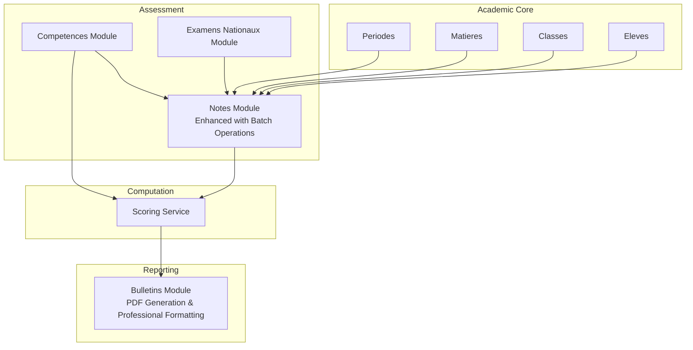
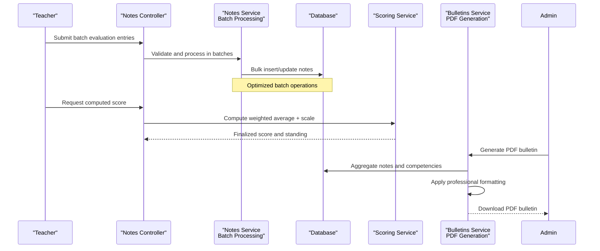
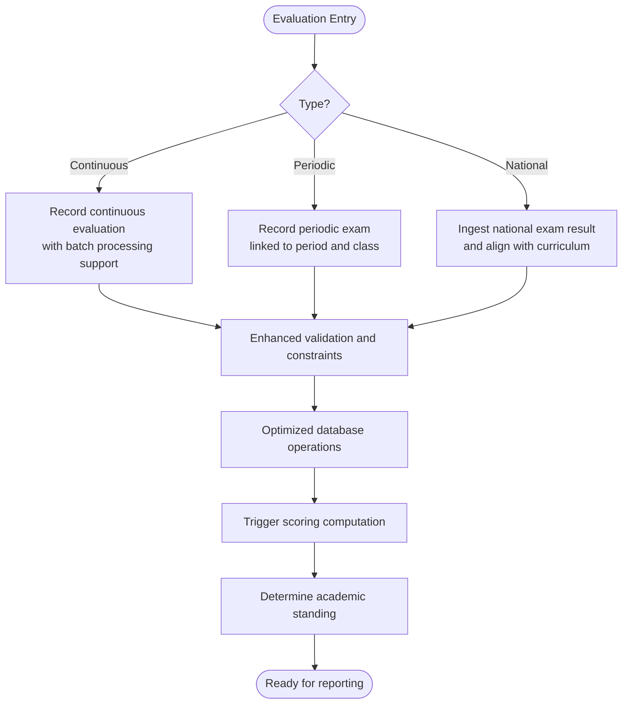
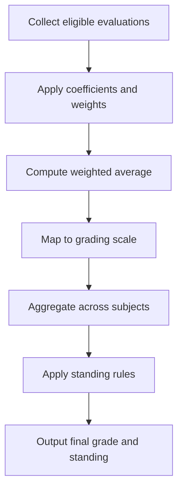
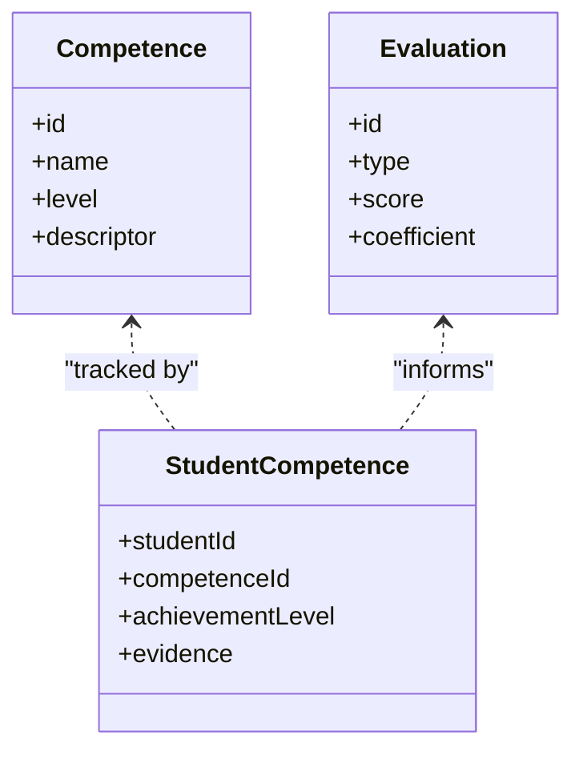
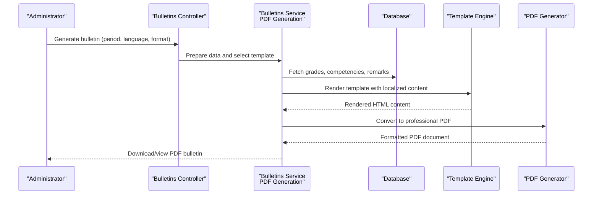
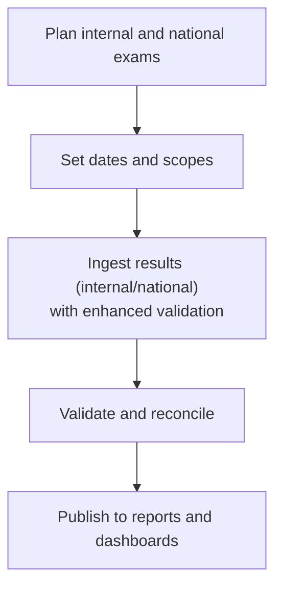
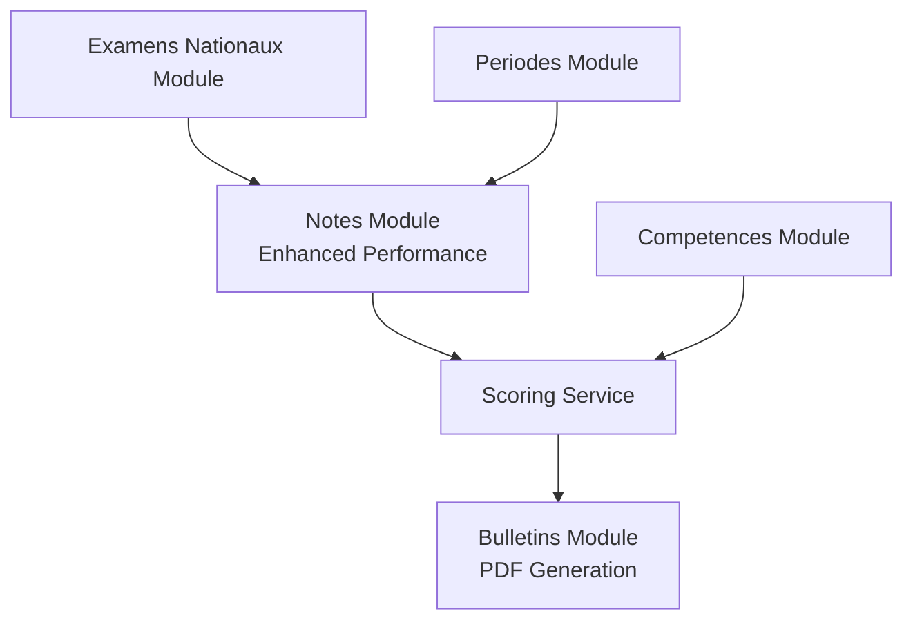

# Grade & Evaluation System

<cite>
**Referenced Files in This Document**
- [061-creer-table-bulletins-matieres.sql](file://backend/database/migrations/061-creer-table-bulletins-matieres.sql)
- [062-creer-table-evaluations-competences.sql](file://backend/database/migrations/062-creer-table-evaluations-competences.sql)
- [073-competence-unique-composite.sql](file://backend/database/migrations/073-competence-unique-composite.sql)
- [084-cleanup-classe-id-notes.sql](file://backend/database/migrations/084-cleanup-classe-id-notes.sql)
- [085-periode-etablissement-id.sql](file://backend/database/migrations/085-periode-etablissement-id.sql)
- [086-affectation-matiere-etablissement-id.sql](file://backend/database/migrations/086-affectation-matiere-etablissement-id.sql)
- [087-affectation-matiere-verifications.sql](file://backend/database/migrations/087-affectation-matiere-verifications.sql)
- [088-refactorisation-architecture-academique.sql](file://backend/database/migrations/088-refactorisation-architecture-academique.sql)
- [089-finalisation-architecture-academique-v2.sql](file://backend/database/migrations/089-finalisation-architecture-academique-v2.sql)
- [090-correction-migration-088-camelcase.sql](file://backend/database/migrations/090-correction-migration-088-camelcase.sql)
- [091-peuplement-architecture-academique.sql](file://backend/database/migrations/091-peuplement-architecture-academique.sql)
- [092-refactorisation-classeAnneeId.sql](file://backend/database/migrations/092-refactorisation-classeAnneeId.sql)
- [103-templates-periode-personnalisables.sql](file://backend/database/migrations/103-templates-periode-personnalisables.sql)
- [104-refonte-periodes-niveaux-configurables.sql](file://backend/database/migrations/104-refonte-periodes-niveaux-configurables.sql)
- [105-migration-templates-v5.sql](file://backend/database/migrations/105-migration-templates-v5.sql)
- [106-rename-sequence-to-evaluation.sql](file://backend/database/migrations/106-rename-sequence-to-evaluation.sql)
- [bulletins.service.ts](file://backend/src/modules/bulletins/services/bulletins.service.ts)
- [bulletins.controller.ts](file://backend/src/modules/bulletins/controllers/bulletins.controller.ts)
- [bulletins.module.ts](file://backend/src/modules/bulletins/bulletins.module.ts)
- [competences.service.ts](file://backend/src/modules/competences/services/competences.service.ts)
- [competences.controller.ts](file://backend/src/modules/competences/controllers/competences.controller.ts)
- [competences.module.ts](file://backend/src/modules/competences/competences.module.ts)
- [notes.service.ts](file://backend/src/modules/notes/services/notes.service.ts)
- [notes.controller.ts](file://backend/src/modules/notes/controllers/notes.controller.ts)
- [notes.module.ts](file://backend/src/modules/notes/notes.module.ts)
- [examens-nationaux.service.ts](file://backend/src/modules/examens-nationaux/services/examens-nationaux.service.ts)
- [examens-nationaux.controller.ts](file://backend/src/modules/examens-nationaux/controllers/examens-nationaux.controller.ts)
- [examens-nationaux.module.ts](file://backend/src/modules/examens-nationaux/examens-nationaux.module.ts)
- [scoring.service.ts](file://backend/src/modules/scoring/services/scoring.service.ts)
- [scoring.controller.ts](file://backend/src/modules/scoring/controllers/scoring.controller.ts)
- [scoring.module.ts](file://backend/src/modules/scoring/scoring.module.ts)
- [perodes.service.ts](file://backend/src/modules/periodes/services/periodes.service.ts)
- [perodes.controller.ts](file://backend/src/modules/periodes/controllers/periodes.controller.ts)
- [perodes.module.ts](file://backend/src/modules/periodes/periodes.module.ts)
</cite>

## Update Summary
**Changes Made**
- Enhanced notes module with batch operations for improved performance and scalability
- Added enhanced validation mechanisms for data integrity and consistency
- Implemented new bulletin generation service with PDF creation capabilities and professional formatting
- Updated performance optimizations across the evaluation system
- Expanded report card generation with advanced template support and multi-language capabilities

## Table of Contents
1. [Introduction](#introduction)
2. [Project Structure](#project-structure)
3. [Core Components](#core-components)
4. [Architecture Overview](#architecture-overview)
5. [Detailed Component Analysis](#detailed-component-analysis)
6. [Dependency Analysis](#dependency-analysis)
7. [Performance Considerations](#performance-considerations)
8. [Troubleshooting Guide](#troubleshooting-guide)
9. [Conclusion](#conclusion)
10. [Appendices](#appendices)

## Introduction
This document explains eLISAschool's Grade & Evaluation System with a focus on competency-based assessment, continuous and periodic evaluation, national examination integration, grade calculation algorithms, academic standing determination, competency tracking, report card generation (including customizable templates and multi-language support), and exam management for internal assessments and national coordination. The system has been significantly enhanced with batch processing capabilities, improved validation mechanisms, and advanced PDF generation for professional report cards. It provides practical examples of workflows, rules, and customization patterns to help educators and administrators implement consistent and transparent grading practices.

## Project Structure
The system is organized into backend modules that encapsulate domain responsibilities:
- Notes: captures continuous and periodic grades per student, subject, period, and class with enhanced batch operations.
- Competences: defines skills, descriptors, levels, and tracks student progress against competencies.
- Bulletins: generates report cards from evaluated data, supports templates, localization, and PDF creation with professional formatting.
- Examens Nationaux: manages national exams, schedules, results, and integration with school records.
- Scoring: centralizes grade computation, weighting, scales, and academic standing logic.
- Periodes: configures academic periods, term boundaries, and template scoping.

[No sources needed since this diagram shows conceptual workflow, not actual code structure]

## Core Components
- Notes Module: Stores and manages all types of evaluations (continuous, periodic, remediation) with significant improvements including batch operations for high-volume data processing, enhanced validation constraints, and performance optimizations.
- Competences Module: Defines skill taxonomies, proficiency levels, and evidence-based assessment entries linked to students and subjects.
- Scoring Service: Implements weighted aggregation, scale mapping, and academic standing determination based on configured policies.
- Bulletins Module: Produces report cards using configurable templates and localized content; now includes advanced PDF generation capabilities with professional formatting and multi-language support.
- Examens Nationaux Module: Coordinates national exam scheduling, result ingestion, and alignment with school reporting.
- Periodes Module: Manages academic calendar, period definitions, and template scoping for reports.

**Section sources**
- [notes.service.ts](file://backend/src/modules/notes/services/notes.service.ts)
- [competences.service.ts](file://backend/src/modules/competences/services/competences.service.ts)
- [scoring.service.ts](file://backend/src/modules/scoring/services/scoring.service.ts)
- [bulletins.service.ts](file://backend/src/modules/bulletins/services/bulletins.service.ts)
- [examens-nationaux.service.ts](file://backend/src/modules/examens-nationaux/services/examens-nationaux.service.ts)
- [perodes.service.ts](file://backend/src/modules/periodes/services/periodes.service.ts)

## Architecture Overview
The evaluation architecture follows a layered approach with enhanced performance and reliability:
- Data Layer: Migrations define tables for bulletins, competencies, notes, and related entities with optimized indexing.
- Service Layer: Business logic for scoring, validation, and report generation with batch processing capabilities.
- Controller Layer: REST endpoints for CRUD and operations like compute, publish, export, and PDF generation.
- Template Engine: Configurable report templates with multi-language support and professional PDF output.

**Diagram sources**
- [notes.controller.ts](file://backend/src/modules/notes/controllers/notes.controller.ts)
- [notes.service.ts](file://backend/src/modules/notes/services/notes.service.ts)
- [scoring.service.ts](file://backend/src/modules/scoring/services/scoring.service.ts)
- [bulletins.service.ts](file://backend/src/modules/bulletins/services/bulletins.service.ts)

## Detailed Component Analysis

### Evaluation Framework: Continuous, Periodic, and National Exams
- Continuous Assessment: Frequent formative evaluations captured via the Notes module, supporting multiple attempts and feedback with enhanced batch processing for large datasets.
- Periodic Exams: Summative evaluations aligned with academic periods defined by the Periodes module, now optimized for high-volume entry scenarios.
- National Examination Integration: The Examens Nationaux module coordinates external exam schedules and results, merging them into school records and reports with improved validation.

**Section sources**
- [notes.service.ts](file://backend/src/modules/notes/services/notes.service.ts)
- [perodes.service.ts](file://backend/src/modules/periodes/services/periodes.service.ts)
- [examens-nationaux.service.ts](file://backend/src/modules/examens-nationaux/services/examens-nationaux.service.ts)

### Grade Calculation Algorithms: Weighting, Scales, and Academic Standing
- Weighting System: Each evaluation has a coefficient and weight; final subject score is a weighted average across valid entries within the selected period(s).
- Grading Scale: Scores are mapped to letter grades or descriptive levels according to institution policy.
- Academic Standing: Determined by aggregated subject scores and institutional thresholds (e.g., pass/fail, honors).

**Section sources**
- [scoring.service.ts](file://backend/src/modules/scoring/services/scoring.service.ts)
- [notes.service.ts](file://backend/src/modules/notes/services/notes.service.ts)

### Competency Tracking: Skill-Based Evaluation and Progress Monitoring
- Competency Model: Skills, descriptors, and proficiency levels are defined centrally and linked to subjects and classes.
- Evidence Collection: Teachers record competency achievements tied to specific evaluations and activities.
- Progress Monitoring: Aggregated competency data informs individualized learning pathways and interventions.

**Diagram sources**
- [competences.service.ts](file://backend/src/modules/competences/services/competences.service.ts)
- [notes.service.ts](file://backend/src/modules/notes/services/notes.service.ts)

**Section sources**
- [competences.service.ts](file://backend/src/modules/competences/services/competences.service.ts)
- [competences.controller.ts](file://backend/src/modules/competences/controllers/competences.controller.ts)
- [competences.module.ts](file://backend/src/modules/competences/competences.module.ts)

### Report Card Generation: Customizable Templates, Multi-Language Support, and PDF Creation
- Template Configuration: Reports are generated using configurable templates scoped to periods and institutions with enhanced rendering capabilities.
- Localization: Templates support multiple languages for labels, comments, and descriptions with improved language switching.
- Content Aggregation: Bulletins combine numeric grades, competency summaries, and teacher remarks.
- **New PDF Generation**: Advanced PDF creation with professional formatting, layout optimization, and print-ready output.

**Diagram sources**
- [bulletins.controller.ts](file://backend/src/modules/bulletins/controllers/bulletins.controller.ts)
- [bulletins.service.ts](file://backend/src/modules/bulletins/services/bulletins.service.ts)

**Section sources**
- [bulletins.service.ts](file://backend/src/modules/bulletins/services/bulletins.service.ts)
- [bulletins.controller.ts](file://backend/src/modules/bulletins/controllers/bulletins.controller.ts)
- [bulletins.module.ts](file://backend/src/modules/bulletins/bulletins.module.ts)
- [103-templates-periode-personnalisables.sql](file://backend/database/migrations/103-templates-periode-personnalisables.sql)
- [105-migration-templates-v5.sql](file://backend/database/migrations/105-migration-templates-v5.sql)

### Exam Management: Internal Assessments and National Coordination
- Internal Assessments: Managed through the Notes module with clear linkage to periods and classes, now supporting batch operations for efficiency.
- National Exams: The Examens Nationaux module handles scheduling, result ingestion, and alignment with curriculum standards.
- Integration Points: Results flow into scoring and reporting pipelines, ensuring consistency across internal and external evaluations.

**Section sources**
- [examens-nationaux.service.ts](file://backend/src/modules/examens-nationaux/services/examens-nationaux.service.ts)
- [examens-nationaux.controller.ts](file://backend/src/modules/examens-nationaux/controllers/examens-nationaux.controller.ts)
- [examens-nationaux.module.ts](file://backend/src/modules/examens-nationaux/examens-nationaux.module.ts)

### Practical Examples: Workflows, Rules, and Customization Patterns
- Grade Entry Workflow:
  - Select class, subject, and period.
  - Enter evaluation type (continuous/periodic), score, coefficient, and optional remarks.
  - Use batch operations for bulk data entry when processing large cohorts.
  - Save and validate; system computes preliminary score with enhanced validation.
- Calculation Rules:
  - Apply coefficients and weights per evaluation.
  - Map raw averages to institutional grading scale.
  - Determine academic standing based on aggregated subject performance.
- Report Customization:
  - Choose template variant per period and institution.
  - Configure localized labels and comments.
  - Preview and export PDF or digital formats with professional styling.

[No sources needed since this section provides general guidance]

## Dependency Analysis
Module interactions and dependencies with enhanced performance characteristics:
- Notes depends on Matieres, Classes, Eleves, and Periodes for context and scoping, now optimized for batch operations.
- Competences integrates with Notes to link skill achievements to evaluations.
- Scoring consumes Notes and Competences outputs to compute final grades and standing.
- Bulletins aggregates Scoring outputs and renders localized templates with PDF generation capabilities.
- Examens Nationaux feeds external results into Notes and Scoring.

**Diagram sources**
- [notes.service.ts](file://backend/src/modules/notes/services/notes.service.ts)
- [competences.service.ts](file://backend/src/modules/competences/services/competences.service.ts)
- [scoring.service.ts](file://backend/src/modules/scoring/services/scoring.service.ts)
- [bulletins.service.ts](file://backend/src/modules/bulletins/services/bulletins.service.ts)
- [examens-nationaux.service.ts](file://backend/src/modules/examens-nationaux/services/examens-nationaux.service.ts)
- [perodes.service.ts](file://backend/src/modules/periodes/services/periodes.service.ts)

**Section sources**
- [notes.module.ts](file://backend/src/modules/notes/notes.module.ts)
- [competences.module.ts](file://backend/src/modules/competences/competences.module.ts)
- [scoring.module.ts](file://backend/src/modules/scoring/scoring.module.ts)
- [bulletins.module.ts](file://backend/src/modules/bulletins/bulletins.module.ts)
- [examens-nationaux.module.ts](file://backend/src/modules/examens-nationaux/examens-nationaux.module.ts)
- [perodes.module.ts](file://backend/src/modules/periodes/periodes.module.ts)

## Performance Considerations
- Indexing: Ensure indexes on frequently queried columns such as studentId, matiereId, periodeId, and classeId to optimize retrieval during report generation.
- **Batch Processing**: Utilize enhanced batch operations for large cohort processing when generating bulletins and entering grades to reduce database load and improve throughput.
- Caching: Cache computed scores and template renderings where appropriate to improve responsiveness.
- Validation Efficiency: Perform lightweight client-side validations before server submission to minimize round-trips, with server-side enhanced validation for data integrity.
- **PDF Generation Optimization**: Leverage efficient PDF rendering engines and template caching for fast report card generation.

[No sources needed since this section provides general guidance]

## Troubleshooting Guide
Common issues and resolutions:
- Missing Coefficients: Verify that each evaluation has a valid coefficient; default values should be enforced at the service layer.
- Period Misalignment: Ensure evaluations are scoped to the correct period; use period boundaries to filter eligible entries.
- Template Rendering Errors: Confirm template availability and localization keys; validate placeholders match data schema.
- National Exam Integration Failures: Check result ingestion mappings and reconciliation rules; log discrepancies for manual review.
- **Batch Operation Issues**: Monitor batch processing logs for failed operations and implement retry mechanisms for transient errors.
- **PDF Generation Problems**: Verify template compatibility with PDF engine and check memory limits for large document generation.

**Section sources**
- [notes.service.ts](file://backend/src/modules/notes/services/notes.service.ts)
- [bulletins.service.ts](file://backend/src/modules/bulletins/services/bulletins.service.ts)
- [examens-nationaux.service.ts](file://backend/src/modules/examens-nationaux/services/examens-nationaux.service.ts)

## Conclusion
eLISAschool's Grade & Evaluation System provides a robust framework for competency-based assessment, comprehensive grading calculations, and flexible report generation. The recent enhancements include significant improvements to the notes module with batch operations, enhanced validation mechanisms, and performance optimizations. The new bulletin generation service offers advanced PDF creation capabilities with professional formatting and multi-language support. By integrating continuous and periodic evaluations with national examinations, it ensures transparency and alignment with institutional policies. The modular architecture supports customization, localization, and scalability, enabling schools to tailor assessment practices to their needs while maintaining consistency and reliability.

## Appendices

### Database Schema Highlights
Key migrations underpinning the evaluation system:
- Bulletins and Subjects:
  - [061-creer-table-bulletins-matieres.sql](file://backend/database/migrations/061-creer-table-bulletins-matieres.sql)
- Competencies and Evaluations:
  - [062-creer-table-evaluations-competences.sql](file://backend/database/migrations/062-creer-table-evaluations-competences.sql)
  - [073-competence-unique-composite.sql](file://backend/database/migrations/073-competence-unique-composite.sql)
- Notes Cleanup and Contextual Integrity:
  - [084-cleanup-classe-id-notes.sql](file://backend/database/migrations/084-cleanup-classe-id-notes.sql)
  - [085-periode-etablissement-id.sql](file://backend/database/migrations/085-periode-etablissement-id.sql)
  - [086-affectation-matiere-etablissement-id.sql](file://backend/database/migrations/086-affectation-matiere-etablissement-id.sql)
  - [087-affectation-matiere-verifications.sql](file://backend/database/migrations/087-affectation-matiere-verifications.sql)
- Academic Architecture Refactoring:
  - [088-refactorisation-architecture-academique.sql](file://backend/database/migrations/088-refactorisation-architecture-academique.sql)
  - [089-finalisation-architecture-academique-v2.sql](file://backend/database/migrations/089-finalisation-architecture-academique-v2.sql)
  - [090-correction-migration-088-camelcase.sql](file://backend/database/migrations/090-correction-migration-088-camelcase.sql)
  - [091-peuplement-architecture-academique.sql](file://backend/database/migrations/091-peuplement-architecture-academique.sql)
  - [092-refactorisation-classeAnneeId.sql](file://backend/database/migrations/092-refactorisation-classeAnneeId.sql)
- Periods and Templates:
  - [103-templates-periode-personnalisables.sql](file://backend/database/migrations/103-templates-periode-personnalisables.sql)
  - [104-refonte-periodes-niveaux-configurables.sql](file://backend/database/migrations/104-refonte-periodes-niveaux-configurables.sql)
  - [105-migration-templates-v5.sql](file://backend/database/migrations/105-migration-templates-v5.sql)
  - [106-rename-sequence-to-evaluation.sql](file://backend/database/migrations/106-rename-sequence-to-evaluation.sql)

**Section sources**
- [061-creer-table-bulletins-matieres.sql](file://backend/database/migrations/061-creer-table-bulletins-matieres.sql)
- [062-creer-table-evaluations-competences.sql](file://backend/database/migrations/062-creer-table-evaluations-competences.sql)
- [073-competence-unique-composite.sql](file://backend/database/migrations/073-competence-unique-composite.sql)
- [084-cleanup-classe-id-notes.sql](file://backend/database/migrations/084-cleanup-classe-id-notes.sql)
- [085-periode-etablissement-id.sql](file://backend/database/migrations/085-periode-etablissement-id.sql)
- [086-affectation-matiere-etablissement-id.sql](file://backend/database/migrations/086-affectation-matiere-etablissement-id.sql)
- [087-affectation-matiere-verifications.sql](file://backend/database/migrations/087-affectation-matiere-verifications.sql)
- [088-refactorisation-architecture-academique.sql](file://backend/database/migrations/088-refactorisation-architecture-academique.sql)
- [089-finalisation-architecture-academique-v2.sql](file://backend/database/migrations/089-finalisation-architecture-academique-v2.sql)
- [090-correction-migration-088-camelcase.sql](file://backend/database/migrations/090-correction-migration-088-camelcase.sql)
- [091-peuplement-architecture-academique.sql](file://backend/database/migrations/091-peuplement-architecture-academique.sql)
- [092-refactorisation-classeAnneeId.sql](file://backend/database/migrations/092-refactorisation-classeAnneeId.sql)
- [103-templates-periode-personnalisables.sql](file://backend/database/migrations/103-templates-periode-personnalisables.sql)
- [104-refonte-periodes-niveaux-configurables.sql](file://backend/database/migrations/104-refonte-periodes-niveaux-configurables.sql)
- [105-migration-templates-v5.sql](file://backend/database/migrations/105-migration-templates-v5.sql)
- [106-rename-sequence-to-evaluation.sql](file://backend/database/migrations/106-rename-sequence-to-evaluation.sql)