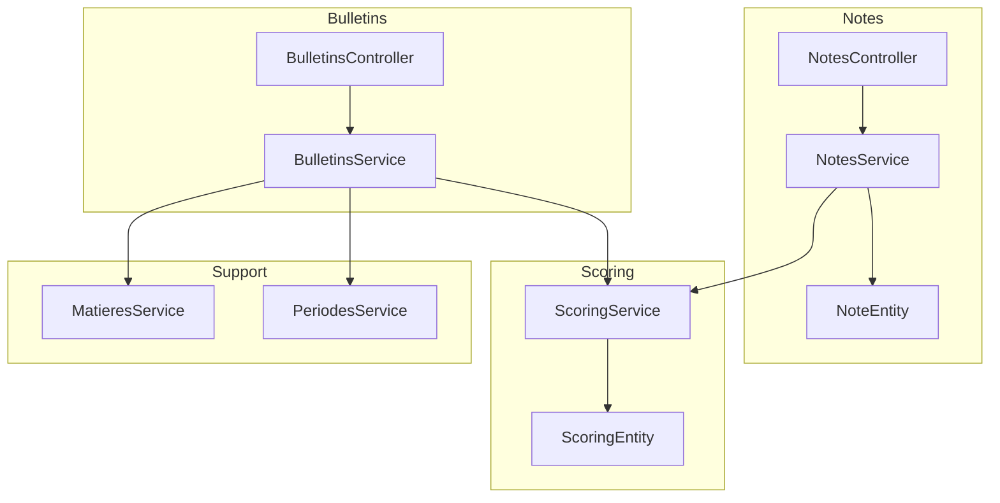
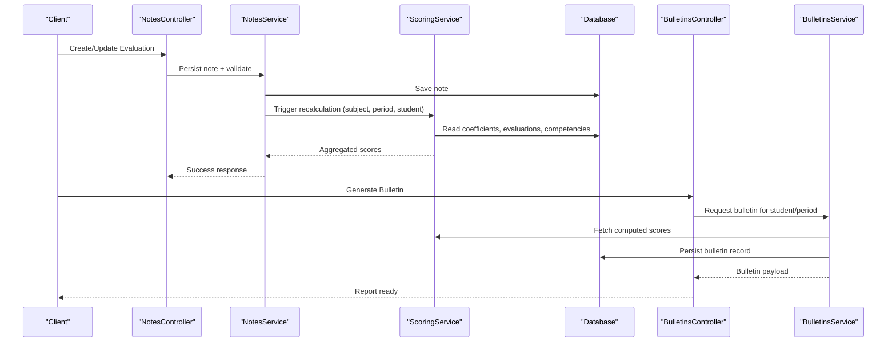
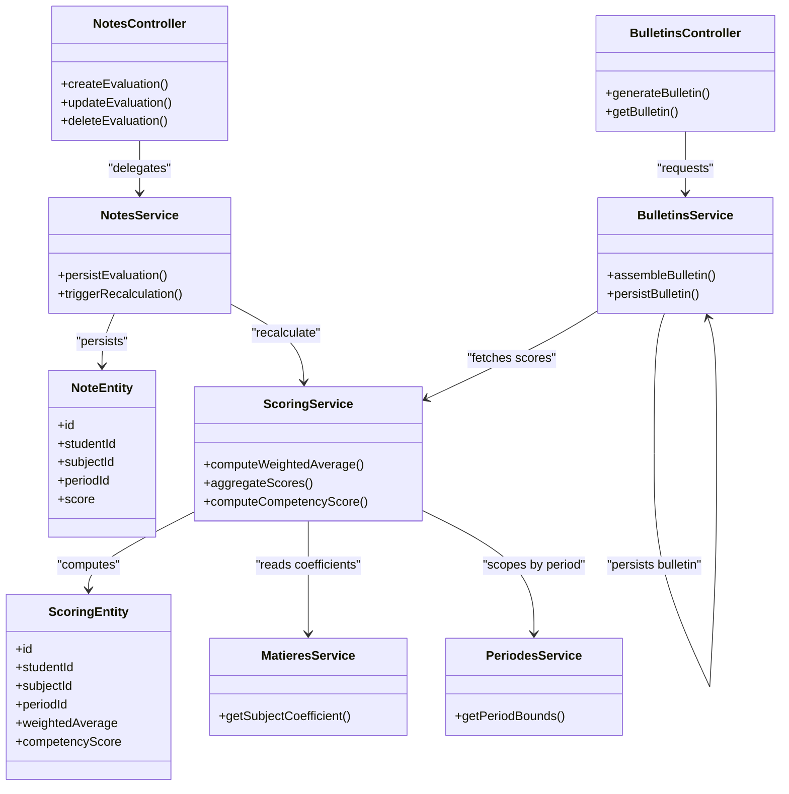
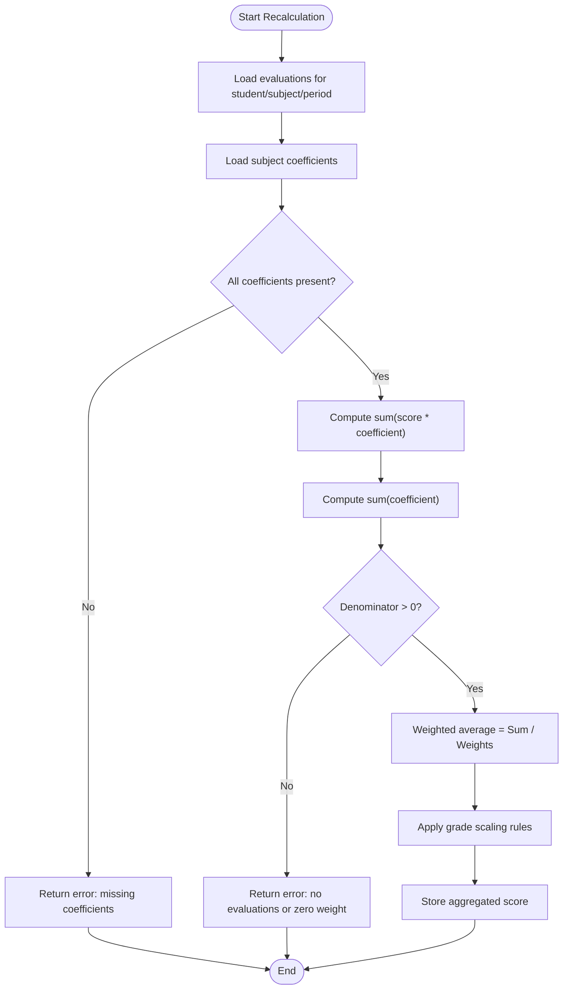

# Grade Calculation Engine

<cite>
**Referenced Files in This Document**
- [backend/src/modules/notes/notes.service.ts](file://backend/src/modules/notes/notes.service.ts)
- [backend/src/modules/notes/notes.controller.ts](file://backend/src/modules/notes/notes.controller.ts)
- [backend/src/modules/notes/entities/note.entity.ts](file://backend/src/modules/notes/entities/note.entity.ts)
- [backend/src/modules/bulletins/bulletins.service.ts](file://backend/src/modules/bulletins/bulletins.service.ts)
- [backend/src/modules/bulletins/bulletins.controller.ts](file://backend/src/modules/bulletins/bulletins.controller.ts)
- [backend/src/modules/scoring/scoring.service.ts](file://backend/src/modules/scoring/scoring.service.ts)
- [backend/src/modules/scoring/entities/scoring.entity.ts](file://backend/src/modules/scoring/entities/scoring.entity.ts)
- [backend/src/modules/matieres/matieres.service.ts](file://backend/src/modules/matieres/matieres.service.ts)
- [backend/src/modules/periodes/periodes.service.ts](file://backend/src/modules/periodes/periodes.service.ts)
- [backend/database/migrations/061-creer-table-bulletins-matieres.sql](file://backend/database/migrations/061-creer-table-bulletins-matieres.sql)
- [backend/database/migrations/062-creer-table-evaluations-competences.sql](file://backend/database/migrations/062-creer-table-evaluations-competences.sql)
- [backend/database/migrations/073-competence-unique-composite.sql](file://backend/database/migrations/073-competence-unique-composite.sql)
- [backend/database/migrations/084-cleanup-classe-id-notes.sql](file://backend/database/migrations/084-cleanup-classe-id-notes.sql)
- [backend/database/migrations/090-correction-migration-088-camelcase.sql](file://backend/database/migrations/090-correction-migration-088-camelcase.sql)
- [backend/database/migrations/101-normalisation-annee-scolaire-cloture.sql](file://backend/database/migrations/101-normalisation-annee-scolaire-cloture.sql)
</cite>

## Table of Contents
1. [Introduction](#introduction)
2. [Project Structure](#project-structure)
3. [Core Components](#core-components)
4. [Architecture Overview](#architecture-overview)
5. [Detailed Component Analysis](#detailed-component-analysis)
6. [Dependency Analysis](#dependency-analysis)
7. [Performance Considerations](#performance-considerations)
8. [Troubleshooting Guide](#troubleshooting-guide)
9. [Conclusion](#conclusion)
10. [Appendices](#appendices)

## Introduction
This document explains the Grade Calculation Engine used by eLISAschool to compute student grades, aggregate scores across subjects and periods, determine academic standing, and integrate with bulletin generation and academic reporting systems. It covers weighted average calculations, coefficient-based grading, competency scoring algorithms, grade scaling systems, data validation, error handling, performance optimization, and end-to-end calculation pipelines.

## Project Structure
The grade calculation engine spans several modules:
- Notes module: stores evaluations and raw scores, exposes APIs for CRUD and aggregation.
- Scoring module: implements coefficient-based weighting, competency scoring, and aggregation logic.
- Bulletins module: consumes computed grades to generate report cards and academic reports.
- Supporting modules (matières, périodes): provide subject metadata and period scoping.
- Database migrations: define tables and constraints for notes, bulletins, competencies, and related entities.

**Diagram sources**
- [backend/src/modules/notes/notes.controller.ts](file://backend/src/modules/notes/notes.controller.ts)
- [backend/src/modules/notes/notes.service.ts](file://backend/src/modules/notes/notes.service.ts)
- [backend/src/modules/notes/entities/note.entity.ts](file://backend/src/modules/notes/entities/note.entity.ts)
- [backend/src/modules/scoring/scoring.service.ts](file://backend/src/modules/scoring/scoring.service.ts)
- [backend/src/modules/scoring/entities/scoring.entity.ts](file://backend/src/modules/scoring/entities/scoring.entity.ts)
- [backend/src/modules/bulletins/bulletins.controller.ts](file://backend/src/modules/bulletins/bulletins.controller.ts)
- [backend/src/modules/bulletins/bulletins.service.ts](file://backend/src/modules/bulletins/bulletins.service.ts)
- [backend/src/modules/matieres/matieres.service.ts](file://backend/src/modules/matieres/matieres.service.ts)
- [backend/src/modules/periodes/periodes.service.ts](file://backend/src/modules/periodes/periodes.service.ts)

**Section sources**
- [backend/src/modules/notes/notes.controller.ts](file://backend/src/modules/notes/notes.controller.ts)
- [backend/src/modules/notes/notes.service.ts](file://backend/src/modules/notes/notes.service.ts)
- [backend/src/modules/notes/entities/note.entity.ts](file://backend/src/modules/notes/entities/note.entity.ts)
- [backend/src/modules/scoring/scoring.service.ts](file://backend/src/modules/scoring/scoring.service.ts)
- [backend/src/modules/scoring/entities/scoring.entity.ts](file://backend/src/modules/scoring/entities/scoring.entity.ts)
- [backend/src/modules/bulletins/bulletins.controller.ts](file://backend/src/modules/bulletins/bulletins.controller.ts)
- [backend/src/modules/bulletins/bulletins.service.ts](file://backend/src/modules/bulletins/bulletins.service.ts)
- [backend/src/modules/matieres/matieres.service.ts](file://backend/src/modules/matieres/matieres.service.ts)
- [backend/src/modules/periodes/periodes.service.ts](file://backend/src/modules/periodes/periodes.service.ts)

## Core Components
- NotesService: orchestrates evaluation persistence, retrieval, and triggers recalculations when inputs change.
- ScoringService: implements coefficient-weighted averages, competency scoring, and aggregation across subjects and periods.
- BulletinsService: composes final grades into bulletin records and integrates with reporting outputs.
- Entities: NoteEntity and ScoringEntity model core data structures for evaluations and computed scores.
- Supporting Services: MatieresService provides subject coefficients; PeriodesService scopes calculations per academic period.

Key responsibilities:
- Data validation at ingestion points (scores, coefficients, period boundaries).
- Deterministic computation of weighted averages and competency metrics.
- Idempotent recalculation on input changes.
- Integration hooks for bulletin generation and downstream reporting.

**Section sources**
- [backend/src/modules/notes/notes.service.ts](file://backend/src/modules/notes/notes.service.ts)
- [backend/src/modules/scoring/scoring.service.ts](file://backend/src/modules/scoring/scoring.service.ts)
- [backend/src/modules/bulletins/bulletins.service.ts](file://backend/src/modules/bulletins/bulletins.service.ts)
- [backend/src/modules/notes/entities/note.entity.ts](file://backend/src/modules/notes/entities/note.entity.ts)
- [backend/src/modules/scoring/entities/scoring.entity.ts](file://backend/src/modules/scoring/entities/scoring.entity.ts)
- [backend/src/modules/matieres/matieres.service.ts](file://backend/src/modules/matieres/matieres.service.ts)
- [backend/src/modules/periodes/periodes.service.ts](file://backend/src/modules/periodes/periodes.service.ts)

## Architecture Overview
The calculation pipeline is event-driven around note updates and explicit recalculation requests. The flow ensures that all dependent aggregates are updated consistently and that bulletin generation uses finalized, validated results.

**Diagram sources**
- [backend/src/modules/notes/notes.controller.ts](file://backend/src/modules/notes/notes.controller.ts)
- [backend/src/modules/notes/notes.service.ts](file://backend/src/modules/notes/notes.service.ts)
- [backend/src/modules/scoring/scoring.service.ts](file://backend/src/modules/scoring/scoring.service.ts)
- [backend/src/modules/bulletins/bulletins.controller.ts](file://backend/src/modules/bulletins/bulletins.controller.ts)
- [backend/src/modules/bulletins/bulletins.service.ts](file://backend/src/modules/bulletins/bulletins.service.ts)

## Detailed Component Analysis

### Notes Module
Responsibilities:
- Validate incoming evaluation payloads (score ranges, required fields).
- Persist evaluations and associate them with students, subjects, and periods.
- Emit recalculation signals to the scoring subsystem upon create/update/delete.

Data model highlights:
- Evaluations include identifiers linking to student, subject, period, and optional competency references.
- Constraints ensure referential integrity and prevent invalid states.

Validation and error handling:
- Rejects out-of-range scores or missing mandatory fields.
- Returns structured errors with actionable messages.

Recalculation trigger:
- On successful mutation, calls into ScoringService to recompute affected aggregates.

**Section sources**
- [backend/src/modules/notes/notes.controller.ts](file://backend/src/modules/notes/notes.controller.ts)
- [backend/src/modules/notes/notes.service.ts](file://backend/src/modules/notes/notes.service.ts)
- [backend/src/modules/notes/entities/note.entity.ts](file://backend/src/modules/notes/entities/note.entity.ts)
- [backend/database/migrations/084-cleanup-classe-id-notes.sql](file://backend/database/migrations/084-cleanup-classe-id-notes.sql)

### Scoring Module
Responsibilities:
- Compute coefficient-weighted averages per subject and period.
- Aggregate across subjects to produce overall averages.
- Implement competency scoring algorithms based on mapped evaluations.
- Provide deterministic, idempotent recomputation when inputs change.

Algorithmic overview:
- Coefficient-based weighting: each subject’s contribution is scaled by its coefficient before averaging.
- Competency scoring: maps evaluations to competencies and computes composite scores using defined weights.
- Grade scaling: applies configurable scaling rules to normalize or convert scores into institutional scales.

Error handling:
- Guards against zero-sum denominators and missing coefficients.
- Validates competency mappings and returns clear diagnostics.

**Section sources**
- [backend/src/modules/scoring/scoring.service.ts](file://backend/src/modules/scoring/scoring.service.ts)
- [backend/src/modules/scoring/entities/scoring.entity.ts](file://backend/src/modules/scoring/entities/scoring.entity.ts)
- [backend/src/modules/matieres/matieres.service.ts](file://backend/src/modules/matieres/matieres.service.ts)
- [backend/database/migrations/062-creer-table-evaluations-competences.sql](file://backend/database/migrations/062-creer-table-evaluations-competences.sql)
- [backend/database/migrations/073-competence-unique-composite.sql](file://backend/database/migrations/073-competence-unique-composite.sql)

### Bulletins Module
Responsibilities:
- Consume computed scores from ScoringService to assemble bulletin records.
- Persist bulletin snapshots for reporting and auditability.
- Expose endpoints to retrieve finalized bulletins for students and periods.

Integration points:
- Reads aggregated scores and competency summaries.
- Applies formatting and presentation rules suitable for academic reporting.

**Section sources**
- [backend/src/modules/bulletins/bulletins.controller.ts](file://backend/src/modules/bulletins/bulletins.controller.ts)
- [backend/src/modules/bulletins/bulletins.service.ts](file://backend/src/modules/bulletins/bulletins.service.ts)
- [backend/database/migrations/061-creer-table-bulletins-matieres.sql](file://backend/database/migrations/061-creer-table-bulletins-matieres.sql)

### Supporting Modules
- MatieresService: supplies subject metadata including coefficients used in weighted averages.
- PeriodesService: defines period boundaries and ensures calculations are scoped correctly.

**Section sources**
- [backend/src/modules/matieres/matieres.service.ts](file://backend/src/modules/matieres/matieres.service.ts)
- [backend/src/modules/periodes/periodes.service.ts](file://backend/src/modules/periodes/periodes.service.ts)

## Dependency Analysis
The following diagram shows key dependencies between components involved in grade calculation and bulletin generation.

**Diagram sources**
- [backend/src/modules/notes/notes.controller.ts](file://backend/src/modules/notes/notes.controller.ts)
- [backend/src/modules/notes/notes.service.ts](file://backend/src/modules/notes/notes.service.ts)
- [backend/src/modules/notes/entities/note.entity.ts](file://backend/src/modules/notes/entities/note.entity.ts)
- [backend/src/modules/scoring/scoring.service.ts](file://backend/src/modules/scoring/scoring.service.ts)
- [backend/src/modules/scoring/entities/scoring.entity.ts](file://backend/src/modules/scoring/entities/scoring.entity.ts)
- [backend/src/modules/bulletins/bulletins.controller.ts](file://backend/src/modules/bulletins/bulletins.controller.ts)
- [backend/src/modules/bulletins/bulletins.service.ts](file://backend/src/modules/bulletins/bulletins.service.ts)
- [backend/src/modules/matieres/matieres.service.ts](file://backend/src/modules/matieres/matieres.service.ts)
- [backend/src/modules/periodes/periodes.service.ts](file://backend/src/modules/periodes/periodes.service.ts)

**Section sources**
- [backend/src/modules/notes/notes.controller.ts](file://backend/src/modules/notes/notes.controller.ts)
- [backend/src/modules/notes/notes.service.ts](file://backend/src/modules/notes/notes.service.ts)
- [backend/src/modules/notes/entities/note.entity.ts](file://backend/src/modules/notes/entities/note.entity.ts)
- [backend/src/modules/scoring/scoring.service.ts](file://backend/src/modules/scoring/scoring.service.ts)
- [backend/src/modules/scoring/entities/scoring.entity.ts](file://backend/src/modules/scoring/entities/scoring.entity.ts)
- [backend/src/modules/bulletins/bulletins.controller.ts](file://backend/src/modules/bulletins/bulletins.controller.ts)
- [backend/src/modules/bulletins/bulletins.service.ts](file://backend/src/modules/bulletins/bulletins.service.ts)
- [backend/src/modules/matieres/matieres.service.ts](file://backend/src/modules/matieres/matieres.service.ts)
- [backend/src/modules/periodes/periodes.service.ts](file://backend/src/modules/periodes/periodes.service.ts)

## Performance Considerations
- Batch recalculation: group multiple note mutations and trigger a single recalculation pass to reduce redundant computations.
- Indexing: ensure database indexes exist on foreign keys and frequently filtered columns (studentId, subjectId, periodId) to speed up queries during aggregation.
- Caching: cache stable reference data such as subject coefficients and period bounds to avoid repeated lookups.
- Idempotency: design recalculation operations to be safe to retry without duplicating work or corrupting state.
- Pagination and filtering: when retrieving large sets of evaluations or bulletins, use pagination to limit memory usage and improve responsiveness.

[No sources needed since this section provides general guidance]

## Troubleshooting Guide
Common issues and resolutions:
- Out-of-range scores: validate score bounds at ingestion and return precise error messages indicating acceptable ranges.
- Missing coefficients: verify subject coefficients exist for the relevant period and institution; surface clear diagnostics if absent.
- Zero denominator in averages: guard against empty evaluation sets; handle gracefully by returning null or a configured default.
- Period boundary mismatches: confirm that evaluations are assigned to valid periods; use period service to resolve bounds and reject mis-scoped entries.
- Inconsistent bulletin snapshots: ensure bulletin generation reads finalized scores and persists atomic snapshots; investigate race conditions if discrepancies appear.

Operational checks:
- Confirm database schema versions match expected migrations for notes, bulletins, and competencies.
- Verify referential integrity constraints are enforced to prevent orphaned evaluations or missing subject mappings.

**Section sources**
- [backend/database/migrations/061-creer-table-bulletins-matieres.sql](file://backend/database/migrations/061-creer-table-bulletins-matieres.sql)
- [backend/database/migrations/062-creer-table-evaluations-competences.sql](file://backend/database/migrations/062-creer-table-evaluations-competences.sql)
- [backend/database/migrations/073-competence-unique-composite.sql](file://backend/database/migrations/073-competence-unique-composite.sql)
- [backend/database/migrations/084-cleanup-classe-id-notes.sql](file://backend/database/migrations/084-cleanup-classe-id-notes.sql)
- [backend/database/migrations/090-correction-migration-088-camelcase.sql](file://backend/database/migrations/090-correction-migration-088-camelcase.sql)
- [backend/database/migrations/101-normalisation-annee-scolaire-cloture.sql](file://backend/database/migrations/101-normalisation-annee-scolaire-cloture.sql)

## Conclusion
The Grade Calculation Engine integrates evaluation management, coefficient-based scoring, competency assessment, and bulletin generation into a cohesive pipeline. By enforcing strict validation, providing robust error handling, and optimizing performance through batching and caching, it delivers accurate and timely academic results. The modular architecture supports extensibility for custom weighting scenarios and future enhancements to academic standing determination and reporting.

[No sources needed since this section summarizes without analyzing specific files]

## Appendices

### Weighted Average Calculation Flow

[No sources needed since this diagram shows conceptual workflow, not actual code structure]

### Academic Standing Determination (Conceptual)
Academic standing can be derived from aggregated averages and competency thresholds. Institutions may define policies such as:
- Honor roll: average above threshold and minimum competency levels.
- Probation: average below threshold or insufficient competency coverage.
- Graduation eligibility: meeting cumulative requirements across periods.

These rules should be implemented as configurable policies within the scoring or bulletin services to allow flexibility across institutions.

[No sources needed since this section doesn't analyze specific files]