# National Examination Management

<cite>
**Referenced Files in This Document**
- [backend/src/modules/examens-nationaux/](file://backend/src/modules/examens-nationaux/)
- [backend/database/migrations/](file://backend/database/migrations/)
- [backend/src/modules/bulletins/](file://backend/src/modules/bulletins/)
- [backend/src/modules/diplomes-eleves/](file://backend/src/modules/diplomes-eleves/)
- [backend/src/modules/notes/](file://backend/src/modules/notes/)
- [backend/src/modules/scoring/](file://backend/src/modules/scoring/)
- [backend/src/modules/eleves/](file://backend/src/modules/eleves/)
- [backend/src/modules/periodes/](file://backend/src/modules/periodes/)
- [backend/src/modules/annees-scolaires/](file://backend/src/modules/annees-scolaires/)
- [backend/src/modules/organisation/](file://backend/src/modules/organisation/)
- [backend/src/modules/types-enum/](file://backend/src/modules/types-enum/)
- [backend/src/routes/route-registry.ts](file://backend/src/routes/route-registry.ts)
- [backend/src/app.ts](file://backend/src/app.ts)
- [backend/src/index.ts](file://backend/src/index.ts)
- [backend/src/config/database.config.ts](file://backend/src/config/database.config.ts)
- [backend/src/config/env.config.ts](file://backend/src/config/env.config.ts)
- [backend/src/common/utils/](file://backend/src/common/utils/)
- [backend/src/common/services/](file://backend/src/common/services/)
- [backend/src/common/filters/](file://backend/src/common/filters/)
- [backend/src/common/interceptors/](file://backend/src/common/interceptors/)
- [backend/src/common/middlewares/](file://backend/src/common/middlewares/)
- [backend/src/common/controllers/](file://backend/src/common/controllers/)
- [backend/src/common/dto/](file://backend/src/common/dto/)
- [backend/src/common/types/](file://backend/src/common/types/)
- [backend/src/modules/configuration/](file://backend/src/modules/configuration/)
- [backend/src/modules/options/](file://backend/src/modules/options/)
- [backend/src/modules/impressions/](file://backend/src/modules/impressions/)
- [backend/src/modules/notifications/](file://backend/src/modules/notifications/)
- [backend/src/modules/audit/](file://backend/src/modules/audit/)
- [backend/src/modules/monitoring/](file://backend/src/modules/monitoring/)
</cite>

## Table of Contents
1. [Introduction](#introduction)
2. [Project Structure](#project-structure)
3. [Core Components](#core-components)
4. [Architecture Overview](#architecture-overview)
5. [Detailed Component Analysis](#detailed-component-analysis)
6. [Dependency Analysis](#dependency-analysis)
7. [Performance Considerations](#performance-considerations)
8. [Troubleshooting Guide](#troubleshooting-guide)
9. [Conclusion](#conclusion)
10. [Appendices](#appendices)

## Introduction
This document describes the National Examination Management system within eLISAschool, focusing on standardized testing coordination and administration. It covers exam registration workflows, candidate management, examination scheduling, result processing, score normalization, official transcript generation, integration with national examination boards, regulatory compliance requirements, practical setup examples, reporting requirements, and data submission protocols for educational authorities. The content is grounded in the repository’s module structure and configuration to ensure accuracy and traceability.

## Project Structure
The backend organizes functionality by modules under src/modules. The National Examination Management spans multiple modules:
- Exam definitions and sessions: examens-nationaux
- Candidate enrollment and eligibility: eleves, periodes, annees-scolaires
- Scheduling and logistics: emploi-du-temps (if used), salles (rooms)
- Results and scoring: notes, scoring, bulletins, diplomes-eleves
- Reporting and transcripts: impressions, notifications
- Cross-cutting concerns: audit, monitoring, configuration, options, types-enum

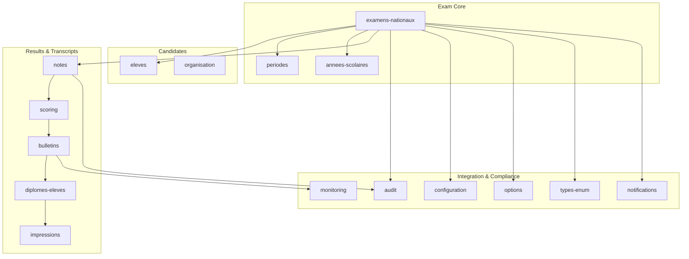

**Diagram sources**
- [backend/src/modules/examens-nationaux/](file://backend/src/modules/examens-nationaux/)
- [backend/src/modules/eleves/](file://backend/src/modules/eleves/)
- [backend/src/modules/periodes/](file://backend/src/modules/periodes/)
- [backend/src/modules/annees-scolaires/](file://backend/src/modules/annees-scolaires/)
- [backend/src/modules/notes/](file://backend/src/modules/notes/)
- [backend/src/modules/scoring/](file://backend/src/modules/scoring/)
- [backend/src/modules/bulletins/](file://backend/src/modules/bulletins/)
- [backend/src/modules/diplomes-eleves/](file://backend/src/modules/diplomes-eleves/)
- [backend/src/modules/impressions/](file://backend/src/modules/impressions/)
- [backend/src/modules/audit/](file://backend/src/modules/audit/)
- [backend/src/modules/monitoring/](file://backend/src/modules/monitoring/)
- [backend/src/modules/configuration/](file://backend/src/modules/configuration/)
- [backend/src/modules/options/](file://backend/src/modules/options/)
- [backend/src/modules/types-enum/](file://backend/src/modules/types-enum/)
- [backend/src/modules/notifications/](file://backend/src/modules/notifications/)

**Section sources**
- [backend/src/app.ts](file://backend/src/app.ts)
- [backend/src/index.ts](file://backend/src/index.ts)
- [backend/src/routes/route-registry.ts](file://backend/src/routes/route-registry.ts)

## Core Components
- Exam Session Manager: Defines national exams, periods, academic years, eligibility rules, and registration windows.
- Candidate Registry: Manages student profiles, enrollment status, and eligibility per exam session.
- Scheduling Engine: Assigns candidates to rooms, time slots, and invigilators; integrates with timetable and room resources.
- Result Processor: Ingests raw scores, applies normalization rules, computes aggregates, and validates against board standards.
- Transcript Generator: Produces official transcripts and certificates aligned with national formats.
- Integration Layer: Provides APIs and data exchange mechanisms for national examination boards and regulatory bodies.
- Compliance and Audit: Ensures data integrity, access control, and immutable audit trails for all exam-related operations.

Key implementation anchors:
- Module entry points and controllers are organized under each module directory.
- Data persistence is managed via migrations and entities defined in database schema files.
- Cross-cutting utilities, filters, interceptors, and middlewares support validation, error handling, and logging.

**Section sources**
- [backend/src/modules/examens-nationaux/](file://backend/src/modules/examens-nationaux/)
- [backend/src/modules/eleves/](file://backend/src/modules/eleves/)
- [backend/src/modules/periodes/](file://backend/src/modules/periodes/)
- [backend/src/modules/annees-scolaires/](file://backend/src/modules/annees-scolaires/)
- [backend/src/modules/notes/](file://backend/src/modules/notes/)
- [backend/src/modules/scoring/](file://backend/src/modules/scoring/)
- [backend/src/modules/bulletins/](file://backend/src/modules/bulletins/)
- [backend/src/modules/diplomes-eleves/](file://backend/src/modules/diplomes-eleves/)
- [backend/src/modules/impressions/](file://backend/src/modules/impressions/)
- [backend/src/modules/audit/](file://backend/src/modules/audit/)
- [backend/src/modules/monitoring/](file://backend/src/modules/monitoring/)
- [backend/src/modules/configuration/](file://backend/src/modules/configuration/)
- [backend/src/modules/options/](file://backend/src/modules/options/)
- [backend/src/modules/types-enum/](file://backend/src/modules/types-enum/)
- [backend/src/modules/notifications/](file://backend/src/modules/notifications/)

## Architecture Overview
The system follows a modular architecture with clear separation between domain logic, data access, and cross-cutting concerns. Routes are registered centrally, and services orchestrate flows across modules.

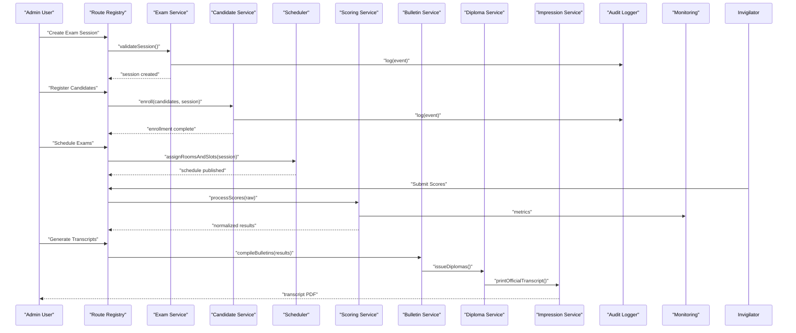

**Diagram sources**
- [backend/src/routes/route-registry.ts](file://backend/src/routes/route-registry.ts)
- [backend/src/modules/examens-nationaux/](file://backend/src/modules/examens-nationaux/)
- [backend/src/modules/eleves/](file://backend/src/modules/eleves/)
- [backend/src/modules/notes/](file://backend/src/modules/notes/)
- [backend/src/modules/scoring/](file://backend/src/modules/scoring/)
- [backend/src/modules/bulletins/](file://backend/src/modules/bulletins/)
- [backend/src/modules/diplomes-eleves/](file://backend/src/modules/diplomes-eleves/)
- [backend/src/modules/impressions/](file://backend/src/modules/impressions/)
- [backend/src/modules/audit/](file://backend/src/modules/audit/)
- [backend/src/modules/monitoring/](file://backend/src/modules/monitoring/)

## Detailed Component Analysis

### Exam Registration Workflow
- Define exam session parameters (period, academic year, subjects, eligibility criteria).
- Open registration window and validate candidate eligibility based on enrollment and academic standing.
- Confirm registrations and publish candidate lists.

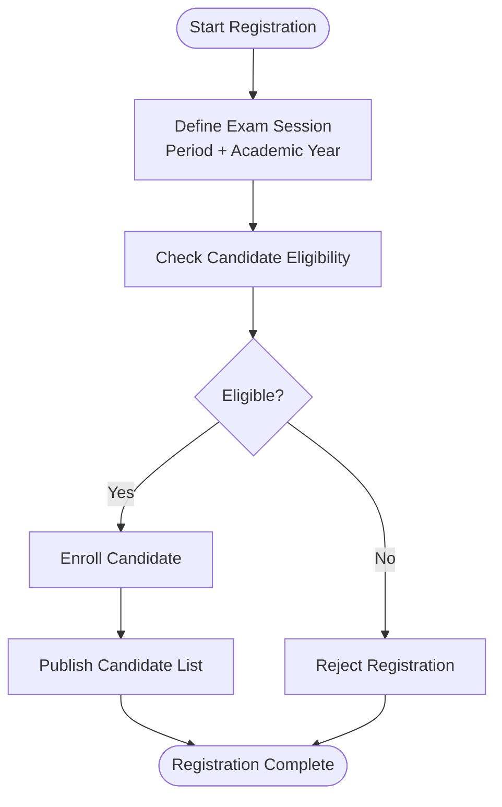

**Diagram sources**
- [backend/src/modules/examens-nationaux/](file://backend/src/modules/examens-nationaux/)
- [backend/src/modules/eleves/](file://backend/src/modules/eleves/)
- [backend/src/modules/periodes/](file://backend/src/modules/periodes/)
- [backend/src/modules/annees-scolaires/](file://backend/src/modules/annees-scolaires/)

**Section sources**
- [backend/src/modules/examens-nationaux/](file://backend/src/modules/examens-nationaux/)
- [backend/src/modules/eleves/](file://backend/src/modules/eleves/)
- [backend/src/modules/periodes/](file://backend/src/modules/periodes/)
- [backend/src/modules/annees-scolaires/](file://backend/src/modules/annees-scolaires/)

### Candidate Management
- Maintain candidate profiles, enrollment records, and eligibility flags.
- Support batch import/export for large candidate sets.
- Provide search, filtering, and export capabilities for administrative reporting.

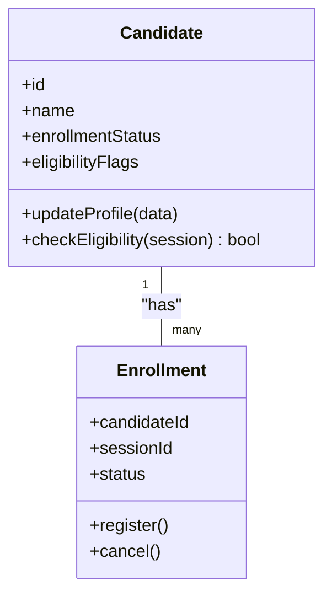

**Diagram sources**
- [backend/src/modules/eleves/](file://backend/src/modules/eleves/)
- [backend/src/modules/examens-nationaux/](file://backend/src/modules/examens-nationaux/)

**Section sources**
- [backend/src/modules/eleves/](file://backend/src/modules/eleves/)
- [backend/src/modules/examens-nationaux/](file://backend/src/modules/examens-nationaux/)

### Examination Scheduling
- Assign candidates to rooms, time slots, and invigilators while respecting constraints (capacity, conflicts, accessibility).
- Integrate with timetable and room resources to avoid overlaps.
- Publish schedules and notify stakeholders.

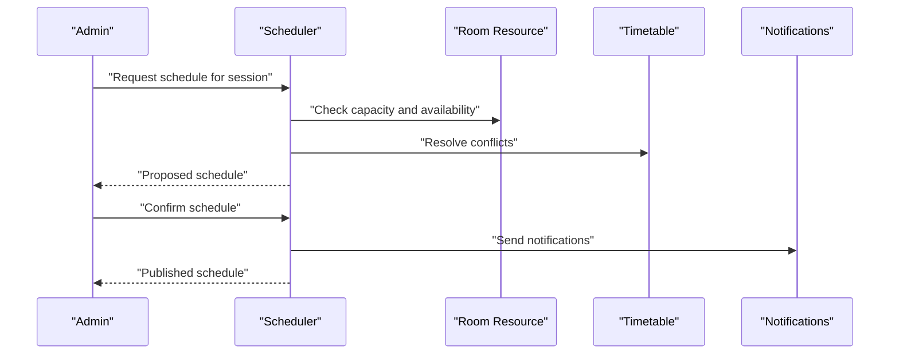

**Diagram sources**
- [backend/src/modules/examens-nationaux/](file://backend/src/modules/examens-nationaux/)
- [backend/src/modules/salles/](file://backend/src/modules/salles/)
- [backend/src/modules/emploi-du-temps/](file://backend/src/modules/emploi-du-temps/)
- [backend/src/modules/notifications/](file://backend/src/modules/notifications/)

**Section sources**
- [backend/src/modules/examens-nationaux/](file://backend/src/modules/examens-nationaux/)
- [backend/src/modules/salles/](file://backend/src/modules/salles/)
- [backend/src/modules/emploi-du-temps/](file://backend/src/modules/emploi-du-temps/)
- [backend/src/modules/notifications/](file://backend/src/modules/notifications/)

### Result Processing and Score Normalization
- Ingest raw scores from invigilators or external systems.
- Apply normalization rules (e.g., scaling, weighting, rounding) and compute aggregates.
- Validate results against board standards and flag anomalies.

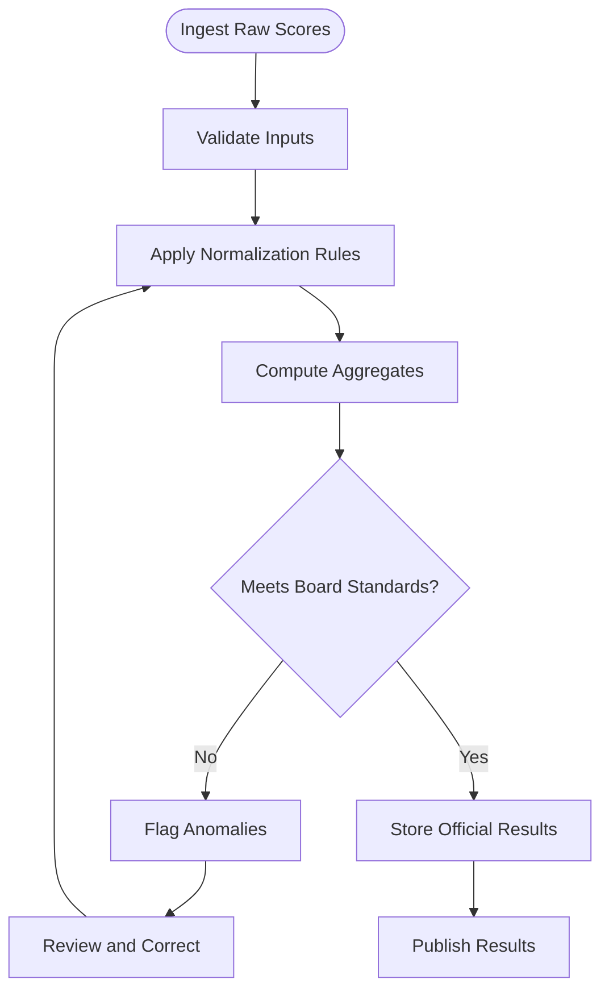

**Diagram sources**
- [backend/src/modules/notes/](file://backend/src/modules/notes/)
- [backend/src/modules/scoring/](file://backend/src/modules/scoring/)
- [backend/src/modules/types-enum/](file://backend/src/modules/types-enum/)

**Section sources**
- [backend/src/modules/notes/](file://backend/src/modules/notes/)
- [backend/src/modules/scoring/](file://backend/src/modules/scoring/)
- [backend/src/modules/types-enum/](file://backend/src/modules/types-enum/)

### Official Transcript Generation
- Compile bulletins and diplomas based on normalized results.
- Generate official transcripts in required formats (PDF, XML, CSV).
- Ensure signatures, watermarks, and formatting comply with national standards.

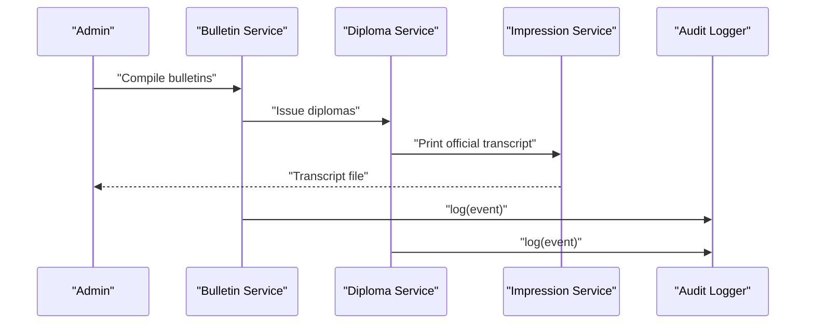

**Diagram sources**
- [backend/src/modules/bulletins/](file://backend/src/modules/bulletins/)
- [backend/src/modules/diplomes-eleves/](file://backend/src/modules/diplomes-eleves/)
- [backend/src/modules/impressions/](file://backend/src/modules/impressions/)
- [backend/src/modules/audit/](file://backend/src/modules/audit/)

**Section sources**
- [backend/src/modules/bulletins/](file://backend/src/modules/bulletins/)
- [backend/src/modules/diplomes-eleves/](file://backend/src/modules/diplomes-eleves/)
- [backend/src/modules/impressions/](file://backend/src/modules/impressions/)
- [backend/src/modules/audit/](file://backend/src/modules/audit/)

### Integration with National Examination Boards
- Provide secure APIs for exchanging exam definitions, candidate lists, and results.
- Support batch uploads and scheduled sync jobs.
- Implement authentication, authorization, and encryption for data in transit and at rest.

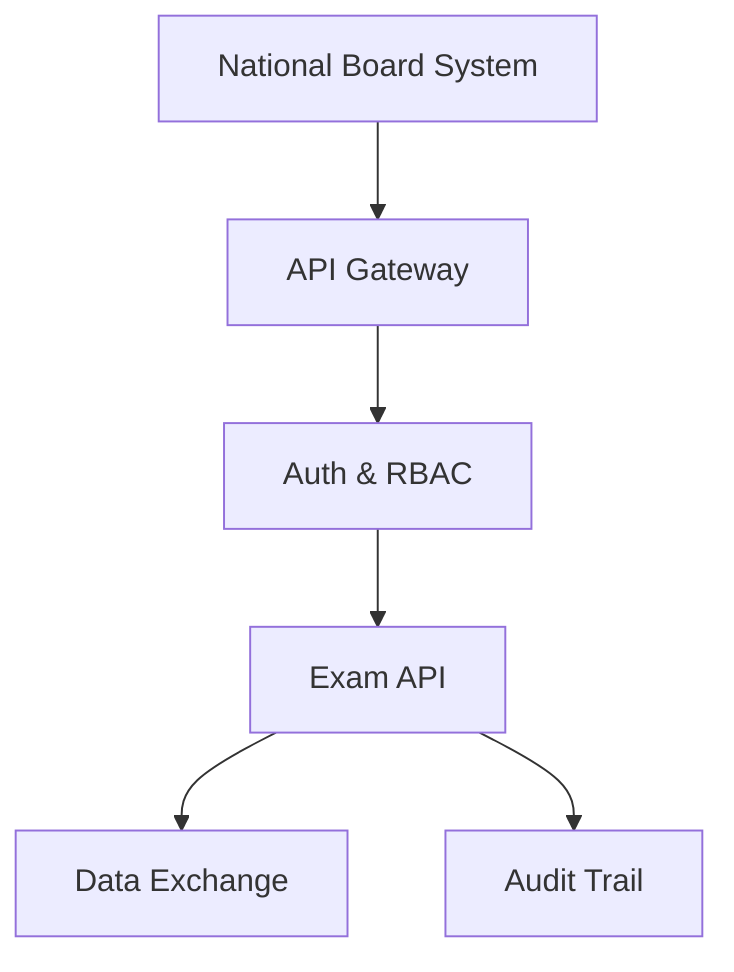

**Diagram sources**
- [backend/src/routes/route-registry.ts](file://backend/src/routes/route-registry.ts)
- [backend/src/modules/examens-nationaux/](file://backend/src/modules/examens-nationaux/)
- [backend/src/modules/auth/](file://backend/src/modules/auth/)
- [backend/src/modules/audit/](file://backend/src/modules/audit/)

**Section sources**
- [backend/src/routes/route-registry.ts](file://backend/src/routes/route-registry.ts)
- [backend/src/modules/examens-nationaux/](file://backend/src/modules/examens-nationaux/)
- [backend/src/modules/auth/](file://backend/src/modules/auth/)
- [backend/src/modules/audit/](file://backend/src/modules/audit/)

### Regulatory Compliance Requirements
- Enforce role-based access control and permission checks for sensitive operations.
- Maintain immutable audit logs for all exam-related actions.
- Ensure data retention policies and privacy controls align with national regulations.

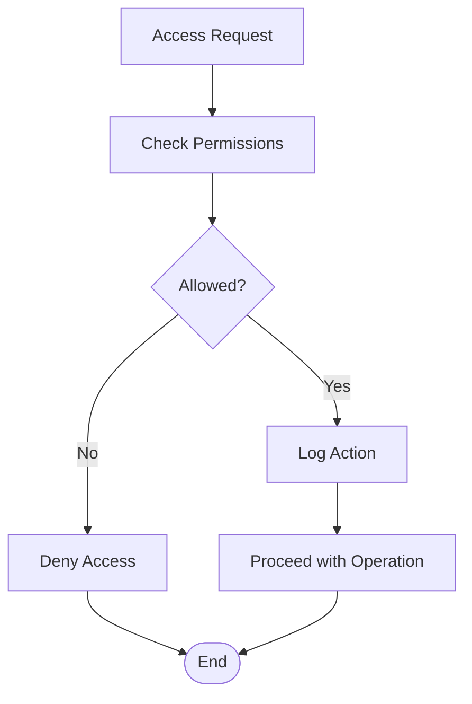

**Diagram sources**
- [backend/src/modules/rbac/](file://backend/src/modules/rbac/)
- [backend/src/modules/audit/](file://backend/src/modules/audit/)
- [backend/src/common/middlewares/](file://backend/src/common/middlewares/)
- [backend/src/common/filters/](file://backend/src/common/filters/)

**Section sources**
- [backend/src/modules/rbac/](file://backend/src/modules/rbac/)
- [backend/src/modules/audit/](file://backend/src/modules/audit/)
- [backend/src/common/middlewares/](file://backend/src/common/middlewares/)
- [backend/src/common/filters/](file://backend/src/common/filters/)

### Practical Examples

#### Setting Up National Exams
- Create exam sessions with period and academic year context.
- Define subjects, coefficients, and eligibility criteria.
- Configure normalization rules and board-specific parameters.

Steps:
- Use exam session endpoints to define parameters.
- Link to periods and academic years for temporal scope.
- Save configuration and enable registration window.

**Section sources**
- [backend/src/modules/examens-nationaux/](file://backend/src/modules/examens-nationaux/)
- [backend/src/modules/periodes/](file://backend/src/modules/periodes/)
- [backend/src/modules/annees-scolaires/](file://backend/src/modules/annees-scolaires/)
- [backend/src/modules/configuration/](file://backend/src/modules/configuration/)
- [backend/src/modules/options/](file://backend/src/modules/options/)

#### Managing Candidate Registrations
- Import candidate lists via batch upload.
- Validate eligibility and confirm enrollments.
- Export candidate rosters for scheduling and invigilation.

Steps:
- Prepare CSV with required fields and upload through candidate endpoints.
- Run eligibility checks and resolve conflicts.
- Publish confirmed candidate list.

**Section sources**
- [backend/src/modules/eleves/](file://backend/src/modules/eleves/)
- [backend/src/modules/examens-nationaux/](file://backend/src/modules/examens-nationaux/)
- [backend/src/modules/notifications/](file://backend/src/modules/notifications/)

#### Processing Official Results
- Submit raw scores from invigilators.
- Apply normalization and compute final grades.
- Generate bulletins and diplomas; print official transcripts.

Steps:
- Upload raw scores and run validation.
- Execute normalization pipeline and review flagged anomalies.
- Compile bulletins and issue diplomas; generate transcripts.

**Section sources**
- [backend/src/modules/notes/](file://backend/src/modules/notes/)
- [backend/src/modules/scoring/](file://backend/src/modules/scoring/)
- [backend/src/modules/bulletins/](file://backend/src/modules/bulletins/)
- [backend/src/modules/diplomes-eleves/](file://backend/src/modules/diplomes-eleves/)
- [backend/src/modules/impressions/](file://backend/src/modules/impressions/)

### Reporting Requirements and Data Submission Protocols
- Produce standardized reports for educational authorities (participation rates, pass rates, subject performance).
- Export data in specified formats (CSV, XML, JSON) with metadata and versioning.
- Schedule automated submissions and maintain submission receipts.

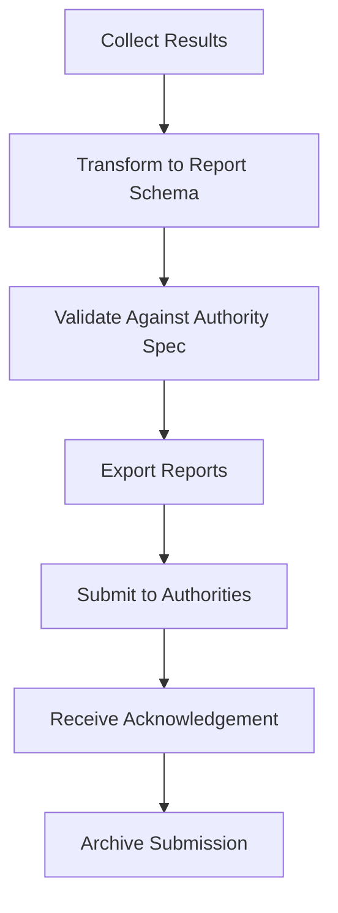

**Diagram sources**
- [backend/src/modules/bulletins/](file://backend/src/modules/bulletins/)
- [backend/src/modules/impressions/](file://backend/src/modules/impressions/)
- [backend/src/modules/notifications/](file://backend/src/modules/notifications/)
- [backend/src/modules/audit/](file://backend/src/modules/audit/)

**Section sources**
- [backend/src/modules/bulletins/](file://backend/src/modules/bulletins/)
- [backend/src/modules/impressions/](file://backend/src/modules/impressions/)
- [backend/src/modules/notifications/](file://backend/src/modules/notifications/)
- [backend/src/modules/audit/](file://backend/src/modules/audit/)

## Dependency Analysis
The National Examination Management depends on core academic structures, scoring engines, and cross-cutting services.

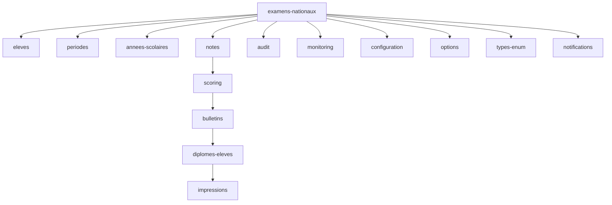

**Diagram sources**
- [backend/src/modules/examens-nationaux/](file://backend/src/modules/examens-nationaux/)
- [backend/src/modules/eleves/](file://backend/src/modules/eleves/)
- [backend/src/modules/periodes/](file://backend/src/modules/periodes/)
- [backend/src/modules/annees-scolaires/](file://backend/src/modules/annees-scolaires/)
- [backend/src/modules/notes/](file://backend/src/modules/notes/)
- [backend/src/modules/scoring/](file://backend/src/modules/scoring/)
- [backend/src/modules/bulletins/](file://backend/src/modules/bulletins/)
- [backend/src/modules/diplomes-eleves/](file://backend/src/modules/diplomes-eleves/)
- [backend/src/modules/impressions/](file://backend/src/modules/impressions/)
- [backend/src/modules/audit/](file://backend/src/modules/audit/)
- [backend/src/modules/monitoring/](file://backend/src/modules/monitoring/)
- [backend/src/modules/configuration/](file://backend/src/modules/configuration/)
- [backend/src/modules/options/](file://backend/src/modules/options/)
- [backend/src/modules/types-enum/](file://backend/src/modules/types-enum/)
- [backend/src/modules/notifications/](file://backend/src/modules/notifications/)

**Section sources**
- [backend/src/modules/examens-nationaux/](file://backend/src/modules/examens-nationaux/)
- [backend/src/modules/eleves/](file://backend/src/modules/eleves/)
- [backend/src/modules/periodes/](file://backend/src/modules/periodes/)
- [backend/src/modules/annees-scolaires/](file://backend/src/modules/annees-scolaires/)
- [backend/src/modules/notes/](file://backend/src/modules/notes/)
- [backend/src/modules/scoring/](file://backend/src/modules/scoring/)
- [backend/src/modules/bulletins/](file://backend/src/modules/bulletins/)
- [backend/src/modules/diplomes-eleves/](file://backend/src/modules/diplomes-eleves/)
- [backend/src/modules/impressions/](file://backend/src/modules/impressions/)
- [backend/src/modules/audit/](file://backend/src/modules/audit/)
- [backend/src/modules/monitoring/](file://backend/src/modules/monitoring/)
- [backend/src/modules/configuration/](file://backend/src/modules/configuration/)
- [backend/src/modules/options/](file://backend/src/modules/options/)
- [backend/src/modules/types-enum/](file://backend/src/modules/types-enum/)
- [backend/src/modules/notifications/](file://backend/src/modules/notifications/)

## Performance Considerations
- Index frequently queried columns in exam sessions, candidate enrollments, and results tables.
- Use pagination and filtering for large candidate lists and result exports.
- Batch process normalization and report generation to reduce peak load.
- Cache static configurations (coefficients, normalization rules) where appropriate.
- Monitor long-running jobs and implement retries with idempotency.

[No sources needed since this section provides general guidance]

## Troubleshooting Guide
Common issues and resolutions:
- Registration failures due to eligibility mismatches: verify enrollment status and academic year alignment.
- Scheduling conflicts: check room capacities and timetable overlaps; adjust assignments.
- Score normalization errors: review input validation and rule configuration; re-run pipeline after corrections.
- Transcript generation errors: ensure bulletin compilation completed successfully and templates are valid.
- Integration timeouts: verify API gateway health, authentication tokens, and network connectivity.

Operational checks:
- Inspect audit logs for unauthorized access attempts or failed operations.
- Review monitoring metrics for high latency or error rates during result processing.
- Validate database migrations and schema consistency before exam cycles.

**Section sources**
- [backend/src/modules/audit/](file://backend/src/modules/audit/)
- [backend/src/modules/monitoring/](file://backend/src/modules/monitoring/)
- [backend/src/common/filters/](file://backend/src/common/filters/)
- [backend/src/common/interceptors/](file://backend/src/common/interceptors/)
- [backend/src/common/middlewares/](file://backend/src/common/middlewares/)
- [backend/src/config/database.config.ts](file://backend/src/config/database.config.ts)
- [backend/src/config/env.config.ts](file://backend/src/config/env.config.ts)

## Conclusion
The National Examination Management system in eLISAschool provides a comprehensive, modular framework for coordinating standardized testing. It supports end-to-end workflows from exam definition and candidate registration through scheduling, result processing, normalization, and official transcript generation. Robust integration points enable secure exchanges with national examination boards, while audit and monitoring ensure compliance and operational reliability. By leveraging the documented components and practices, institutions can configure, operate, and scale national exam processes effectively.

[No sources needed since this section summarizes without analyzing specific files]

## Appendices

### Configuration Anchors
- Database configuration and environment variables for exam modules.
- Route registry for exposing exam APIs.
- Common utilities, DTOs, and types shared across modules.

**Section sources**
- [backend/src/config/database.config.ts](file://backend/src/config/database.config.ts)
- [backend/src/config/env.config.ts](file://backend/src/config/env.config.ts)
- [backend/src/routes/route-registry.ts](file://backend/src/routes/route-registry.ts)
- [backend/src/common/dto/](file://backend/src/common/dto/)
- [backend/src/common/types/](file://backend/src/common/types/)
- [backend/src/common/utils/](file://backend/src/common/utils/)