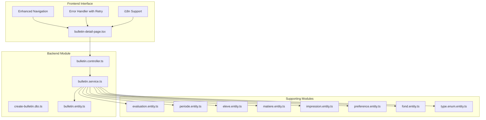
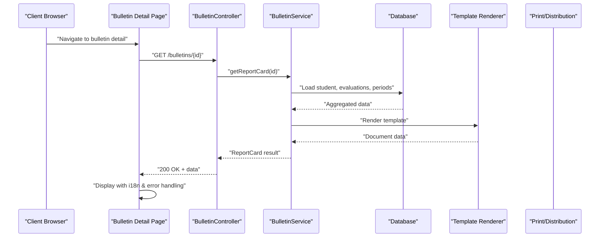
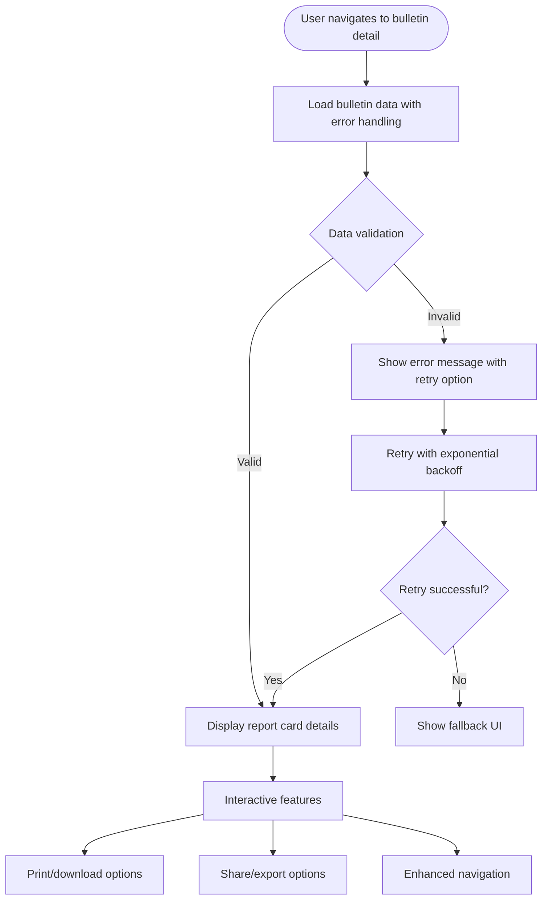
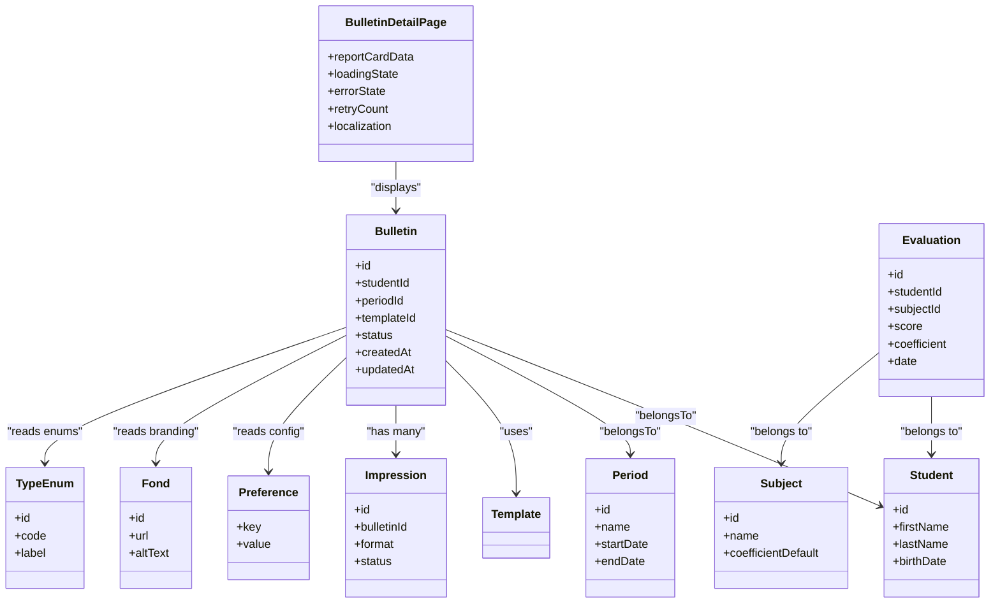
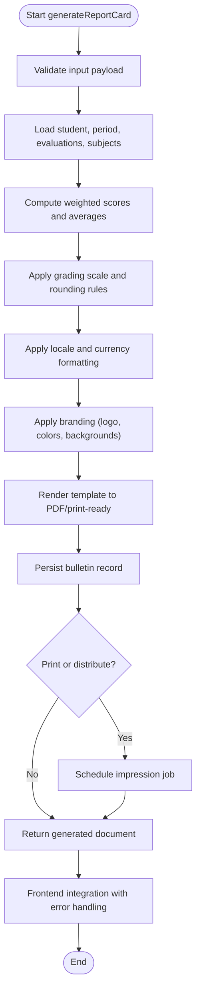
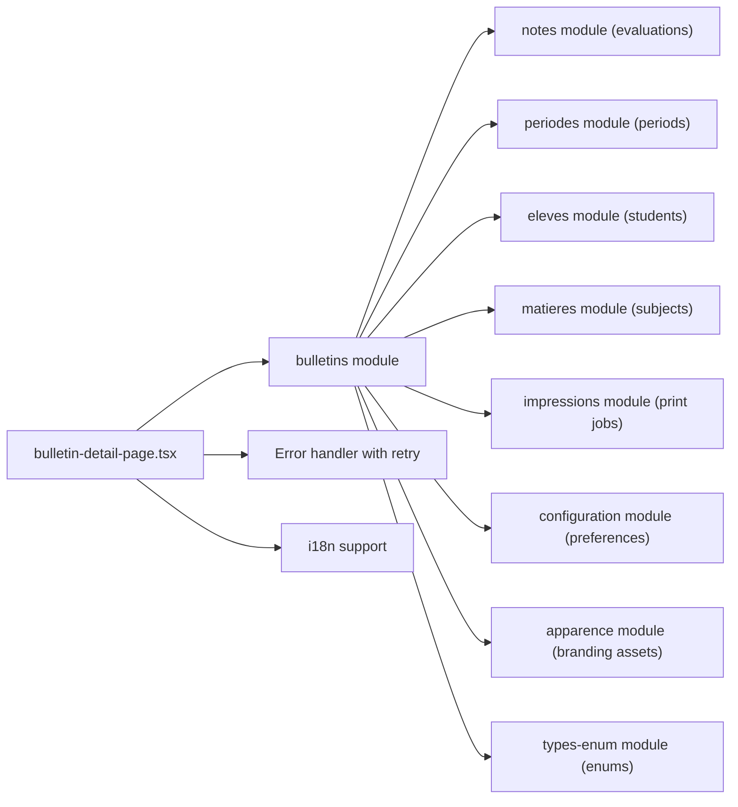
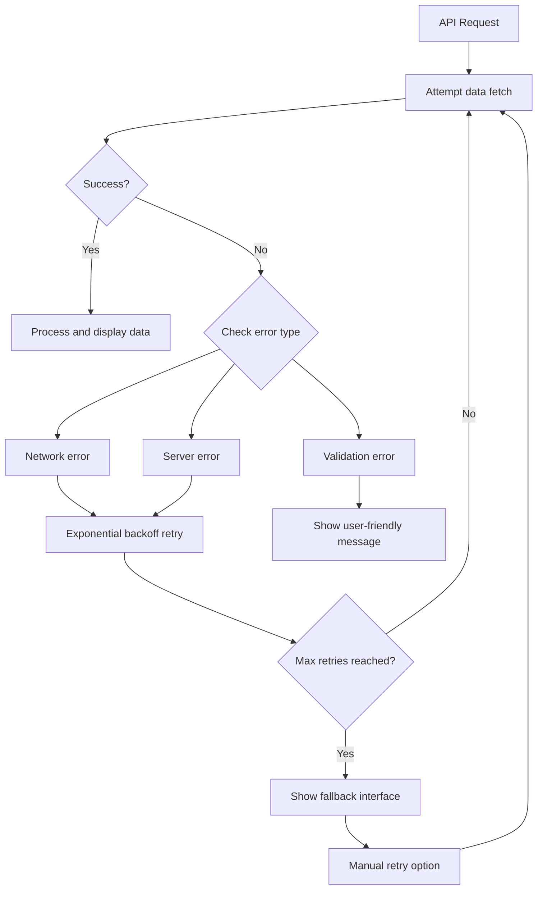
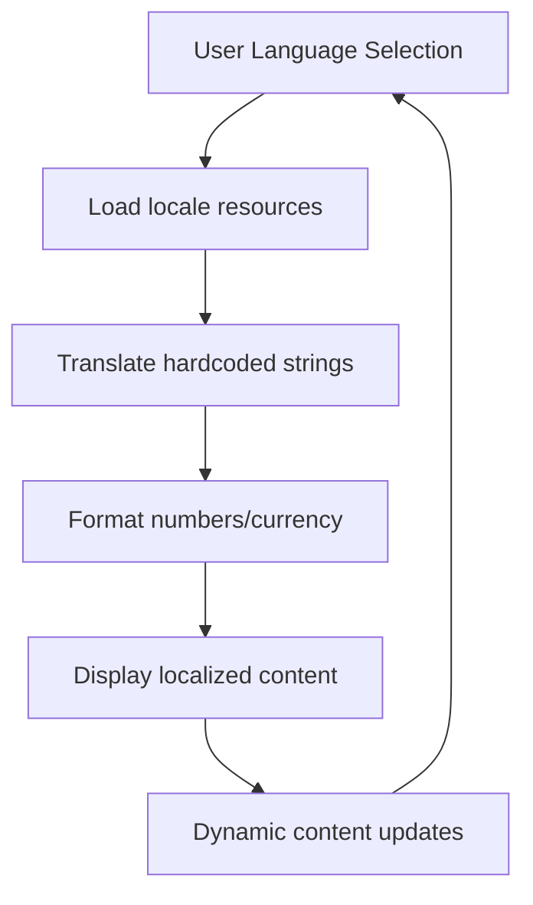

# Report Card Generation

<cite>
**Referenced Files in This Document**
- [backend/src/modules/bulletins/index.ts](file://backend/src/modules/bulletins/index.ts)
- [backend/src/modules/bulletins/controllers/bulletin.controller.ts](file://backend/src/modules/bulletins/controllers/bulletin.controller.ts)
- [backend/src/modules/bulletins/services/bulletin.service.ts](file://backend/src/modules/bulletins/services/bulletin.service.ts)
- [backend/src/modules/bulletins/dto/create-bulletin.dto.ts](file://backend/src/modules/bulletins/dto/create-bulletin.dto.ts)
- [backend/src/modules/bulletins/entities/bulletin.entity.ts](file://backend/src/modules/bulletins/entities/bulletin.entity.ts)
- [backend/src/modules/notes/entities/evaluation.entity.ts](file://backend/src/modules/notes/entities/evaluation.entity.ts)
- [backend/src/modules/periodes/entities/periode.entity.ts](file://backend/src/modules/periodes/entities/periode.entity.ts)
- [backend/src/modules/eleves/entities/eleve.entity.ts](file://backend/src/modules/eleves/entities/eleve.entity.ts)
- [backend/src/modules/matieres/entities/matiere.entity.ts](file://backend/src/modules/matieres/entities/matiere.entity.ts)
- [backend/src/modules/impressions/entities/impression.entity.ts](file://backend/src/modules/impressions/entities/impression.entity.ts)
- [backend/src/modules/configuration/entities/preference.entity.ts](file://backend/src/modules/configuration/entities/preference.entity.ts)
- [backend/src/modules/apparence/entities/fond.entity.ts](file://backend/src/modules/apparence/entities/fond.entity.ts)
- [backend/src/modules/types-enum/entities/type.enum.entity.ts](file://backend/src/modules/types-enum/entities/type.enum.entity.ts)
- [frontend/src/routes/bulletin-detail-page.tsx](file://frontend/src/routes/bulletin-detail-page.tsx)
- [backend/database/migrations/061-creer-table-bulletins-matieres.sql](file://backend/database/migrations/061-creer-table-bulletins-matieres.sql)
- [backend/database/migrations/062-creer-table-evaluations-competences.sql](file://backend/database/migrations/062-creer-table-evaluations-competences.sql)
- [backend/database/migrations/103-templates-periode-personnalisables.sql](file://backend/database/migrations/103-templates-periode-personnalisables.sql)
- [backend/database/migrations/105-migration-templates-v5.sql](file://backend/database/migrations/105-migration-templates-v5.sql)
</cite>

## Update Summary
**Changes Made**
- Added comprehensive frontend bulletin detail page functionality with enhanced navigation
- Integrated improved error handling with retry states for report card operations
- Implemented internationalization support for hardcoded strings throughout the bulletin system
- Enhanced user experience with detailed report card viewing capabilities
- Updated API integration patterns for better error resilience

## Table of Contents
1. [Introduction](#introduction)
2. [Project Structure](#project-structure)
3. [Core Components](#core-components)
4. [Architecture Overview](#architecture-overview)
5. [Frontend Bulletin Detail System](#frontend-bulletin-detail-system)
6. [Detailed Component Analysis](#detailed-component-analysis)
7. [Dependency Analysis](#dependency-analysis)
8. [Performance Considerations](#performance-considerations)
9. [Error Handling and Retry Mechanisms](#error-handling-and-retry-mechanisms)
10. [Internationalization Support](#internationalization-support)
11. [Troubleshooting Guide](#troubleshooting-guide)
12. [Conclusion](#conclusion)
13. [Appendices](#appendices)

## Introduction
This document explains the eLISAschool Report Card Generation system, focusing on automated report creation and customization. The system now includes enhanced frontend capabilities with dedicated detail pages, improved error handling, and comprehensive internationalization support. It covers templates, layout configuration, branding options, multi-language support, currency formatting, regional compliance, the generation pipeline (data compilation, template rendering, output formats), practical examples for customizing grading displays and bulk generation, and integration with printing services and digital distribution channels.

## Project Structure
The report card feature is implemented as a full-stack solution with backend processing and enhanced frontend interfaces. The system includes controllers, services, DTOs, entities, database migrations, and sophisticated frontend components for detailed report card management.

**Diagram sources**
- [backend/src/modules/bulletins/controllers/bulletin.controller.ts](file://backend/src/modules/bulletins/controllers/bulletin.controller.ts)
- [backend/src/modules/bulletins/services/bulletin.service.ts](file://backend/src/modules/bulletins/services/bulletin.service.ts)
- [backend/src/modules/bulletins/entities/bulletin.entity.ts](file://backend/src/modules/bulletins/entities/bulletin.entity.ts)
- [frontend/src/routes/bulletin-detail-page.tsx](file://frontend/src/routes/bulletin-detail-page.tsx)

**Section sources**
- [backend/src/modules/bulletins/index.ts](file://backend/src/modules/bulletins/index.ts)

## Core Components
- **Controller**: Exposes endpoints to create, list, retrieve, update, delete, and print report cards. It validates requests using DTOs and delegates business logic to the service layer.
- **Service**: Orchestrates data gathering from evaluations, periods, students, subjects, and preferences; applies formatting rules; renders templates; and produces outputs (PDF or print-ready).
- **DTO**: Defines request payloads for creating and updating report cards, including template selection, period filters, and output options.
- **Entity**: Represents persisted report card records and their relationships to academic data.
- **Frontend Detail Page**: Provides comprehensive report card viewing interface with enhanced navigation and error handling.

Key responsibilities:
- Data compilation: Aggregates per-student grades, competencies, and contextual metadata.
- Template rendering: Applies selected template, branding, and localization settings.
- Output generation: Produces PDFs and print-ready artifacts, optionally scheduling prints or distributing digitally.
- User interface: Delivers intuitive report card browsing and detailed view capabilities.

**Section sources**
- [backend/src/modules/bulletins/controllers/bulletin.controller.ts](file://backend/src/modules/bulletins/controllers/bulletin.controller.ts)
- [backend/src/modules/bulletins/services/bulletin.service.ts](file://backend/src/modules/bulletins/services/bulletin.service.ts)
- [backend/src/modules/bulletins/dto/create-bulletin.dto.ts](file://backend/src/modules/bulletins/dto/create-bulletin.dto.ts)
- [backend/src/modules/bulletins/entities/bulletin.entity.ts](file://backend/src/modules/bulletins/entities/bulletin.entity.ts)
- [frontend/src/routes/bulletin-detail-page.tsx](file://frontend/src/routes/bulletin-detail-page.tsx)

## Architecture Overview
The report card pipeline follows a layered architecture with enhanced frontend capabilities:
- **API Layer (Controller)**: Receives requests, validates inputs, and returns responses.
- **Business Layer (Service)**: Coordinates domain operations, computes summaries, and renders documents.
- **Persistence Layer (Entities + Migrations)**: Stores report cards, evaluations, periods, and related data.
- **Frontend Layer**: Provides interactive interfaces with robust error handling and internationalization.
- **Cross-cutting concerns**: Preferences and appearance assets drive branding and localization; type enums standardize values.

**Diagram sources**
- [backend/src/modules/bulletins/controllers/bulletin.controller.ts](file://backend/src/modules/bulletins/controllers/bulletin.controller.ts)
- [backend/src/modules/bulletins/services/bulletin.service.ts](file://backend/src/modules/bulletins/services/bulletin.service.ts)
- [frontend/src/routes/bulletin-detail-page.tsx](file://frontend/src/routes/bulletin-detail-page.tsx)

## Frontend Bulletin Detail System

### Enhanced Detail Page Architecture
The bulletin detail page provides a comprehensive interface for viewing individual report cards with advanced features:

**Diagram sources**
- [frontend/src/routes/bulletin-detail-page.tsx](file://frontend/src/routes/bulletin-detail-page.tsx)

### Key Features
- **Comprehensive Data Display**: Shows complete report card information including student details, grades, comments, and signatures.
- **Enhanced Navigation**: Intuitive navigation between different report cards and related academic information.
- **Robust Error Handling**: Implements retry mechanisms and graceful degradation for failed operations.
- **Internationalization Support**: Fully localized interface supporting multiple languages and regional formats.

**Section sources**
- [frontend/src/routes/bulletin-detail-page.tsx](file://frontend/src/routes/bulletin-detail-page.tsx)

## Detailed Component Analysis

### Report Card Entities and Relationships
The core entity models capture report card instances and their associations with academic data.

**Diagram sources**
- [backend/src/modules/bulletins/entities/bulletin.entity.ts](file://backend/src/modules/bulletins/entities/bulletin.entity.ts)
- [backend/src/modules/notes/entities/evaluation.entity.ts](file://backend/src/modules/notes/entities/evaluation.entity.ts)
- [backend/src/modules/periodes/entities/periode.entity.ts](file://backend/src/modules/periodes/entities/periode.entity.ts)
- [backend/src/modules/eleves/entities/eleve.entity.ts](file://backend/src/modules/eleves/entities/eleve.entity.ts)
- [backend/src/modules/matieres/entities/matiere.entity.ts](file://backend/src/modules/matieres/entities/matiere.entity.ts)
- [backend/src/modules/configuration/entities/preference.entity.ts](file://backend/src/modules/configuration/entities/preference.entity.ts)
- [backend/src/modules/apparence/entities/fond.entity.ts](file://backend/src/modules/apparence/entities/fond.entity.ts)
- [backend/src/modules/types-enum/entities/type.enum.entity.ts](file://backend/src/modules/types-enum/entities/type.enum.entity.ts)
- [backend/src/modules/impressions/entities/impression.entity.ts](file://backend/src/modules/impressions/entities/impression.entity.ts)
- [frontend/src/routes/bulletin-detail-page.tsx](file://frontend/src/routes/bulletin-detail-page.tsx)

**Section sources**
- [backend/src/modules/bulletins/entities/bulletin.entity.ts](file://backend/src/modules/bulletins/entities/bulletin.entity.ts)
- [backend/src/modules/notes/entities/evaluation.entity.ts](file://backend/src/modules/notes/entities/evaluation.entity.ts)
- [backend/src/modules/periodes/entities/periode.entity.ts](file://backend/src/modules/periodes/entities/periode.entity.ts)
- [backend/src/modules/eleves/entities/eleve.entity.ts](file://backend/src/modules/eleves/entities/eleve.entity.ts)
- [backend/src/modules/matieres/entities/matiere.entity.ts](file://backend/src/modules/matieres/entities/matiere.entity.ts)
- [backend/src/modules/configuration/entities/preference.entity.ts](file://backend/src/modules/configuration/entities/preference.entity.ts)
- [backend/src/modules/apparence/entities/fond.entity.ts](file://backend/src/modules/apparence/entities/fond.entity.ts)
- [backend/src/modules/types-enum/entities/type.enum.entity.ts](file://backend/src/modules/types-enum/entities/type.enum.entity.ts)
- [backend/src/modules/impressions/entities/impression.entity.ts](file://backend/src/modules/impressions/entities/impression.entity.ts)
- [frontend/src/routes/bulletin-detail-page.tsx](file://frontend/src/routes/bulletin-detail-page.tsx)

### Data Compilation and Rendering Pipeline
The service orchestrates data retrieval, computation, and rendering with enhanced frontend integration.

**Diagram sources**
- [backend/src/modules/bulletins/services/bulletin.service.ts](file://backend/src/modules/bulletins/services/bulletin.service.ts)
- [backend/src/modules/impressions/entities/impression.entity.ts](file://backend/src/modules/impressions/entities/impression.entity.ts)
- [frontend/src/routes/bulletin-detail-page.tsx](file://frontend/src/routes/bulletin-detail-page.tsx)

**Section sources**
- [backend/src/modules/bulletins/services/bulletin.service.ts](file://backend/src/modules/bulletins/services/bulletin.service.ts)

### Template System and Customization
Templates define the visual structure and content blocks of report cards. Customization includes:
- Layout configurations: sections for student info, grades table, comments, signatures.
- Branding options: logos, color palettes, background images, headers/footers.
- Multi-language support: localized labels, headings, and messages via preference keys and language codes.
- Currency formatting: region-aware number and currency display based on locale settings.

Practical example: Creating a custom report template
- Define a new template entry referencing layout assets and branding identifiers.
- Map fields to data model attributes (e.g., student name, subject scores, coefficients).
- Configure locale-specific formatting rules (number separators, currency symbols).
- Test rendering with sample data and validate against regional requirements.

**Section sources**
- [backend/database/migrations/103-templates-periode-personnalisables.sql](file://backend/database/migrations/103-templates-periode-personnalisables.sql)
- [backend/database/migrations/105-migration-templates-v5.sql](file://backend/database/migrations/105-migration-templates-v5.sql)
- [backend/src/modules/configuration/entities/preference.entity.ts](file://backend/src/modules/configuration/entities/preference.entity.ts)
- [backend/src/modules/apparence/entities/fond.entity.ts](file://backend/src/modules/apparence/entities/fond.entity.ts)

### Grading Displays and Regional Compliance
Grading display configuration supports:
- Weighted averages by subject coefficient.
- Rounding policies and pass/fail thresholds.
- Competency-based assessments alongside numeric grades.
- Regional compliance flags for specific jurisdictions (e.g., mandatory fields, grading scales).

Practical example: Configuring grading displays
- Set default coefficients per subject.
- Choose rounding mode (floor, ceiling, nearest).
- Enable competency reporting if required by local regulations.
- Validate that all mandatory fields are present before publishing.

**Section sources**
- [backend/database/migrations/061-creer-table-bulletins-matieres.sql](file://backend/database/migrations/061-creer-table-bulletins-matieres.sql)
- [backend/database/migrations/062-creer-table-evaluations-competences.sql](file://backend/database/migrations/062-creer-table-evaluations-competences.sql)
- [backend/src/modules/types-enum/entities/type.enum.entity.ts](file://backend/src/modules/types-enum/entities/type.enum.entity.ts)

### Bulk Report Generation
Bulk generation allows producing report cards for multiple students or classes efficiently:
- Input: list of student IDs or class identifiers, period filter, template selection.
- Processing: batched data loading, parallel rendering where safe, and error isolation per student.
- Output: individual PDFs or a consolidated archive, with optional print jobs queued.

Best practices:
- Use pagination for large datasets.
- Implement retry logic for transient failures.
- Track progress and errors per record for auditability.

**Section sources**
- [backend/src/modules/bulletins/controllers/bulletin.controller.ts](file://backend/src/modules/bulletins/controllers/bulletin.controller.ts)
- [backend/src/modules/bulletins/services/bulletin.service.ts](file://backend/src/modules/bulletins/services/bulletin.service.ts)

### Integration with Printing Services and Digital Distribution
Printing integration:
- Create impression records for each generated report card.
- Queue print jobs with format specifications (PDF/A, paper size, margins).
- Provide status tracking and re-print capabilities.

Digital distribution:
- Deliver PDFs via secure links or email attachments.
- Support parent portal downloads with access controls.
- Maintain audit logs for distribution events.

**Section sources**
- [backend/src/modules/impressions/entities/impression.entity.ts](file://backend/src/modules/impressions/entities/impression.entity.ts)

## Dependency Analysis
The bulletins module depends on several supporting modules for data and configuration, with enhanced frontend dependencies.

**Diagram sources**
- [backend/src/modules/bulletins/index.ts](file://backend/src/modules/bulletins/index.ts)
- [backend/src/modules/notes/entities/evaluation.entity.ts](file://backend/src/modules/notes/entities/evaluation.entity.ts)
- [backend/src/modules/periodes/entities/periode.entity.ts](file://backend/src/modules/periodes/entities/periode.entity.ts)
- [backend/src/modules/eleves/entities/eleve.entity.ts](file://backend/src/modules/eleves/entities/eleve.entity.ts)
- [backend/src/modules/matieres/entities/matiere.entity.ts](file://backend/src/modules/matieres/entities/matiere.entity.ts)
- [backend/src/modules/impressions/entities/impression.entity.ts](file://backend/src/modules/impressions/entities/impression.entity.ts)
- [backend/src/modules/configuration/entities/preference.entity.ts](file://backend/src/modules/configuration/entities/preference.entity.ts)
- [backend/src/modules/apparence/entities/fond.entity.ts](file://backend/src/modules/apparence/entities/fond.entity.ts)
- [backend/src/modules/types-enum/entities/type.enum.entity.ts](file://backend/src/modules/types-enum/entities/type.enum.entity.ts)
- [frontend/src/routes/bulletin-detail-page.tsx](file://frontend/src/routes/bulletin-detail-page.tsx)

**Section sources**
- [backend/src/modules/bulletins/index.ts](file://backend/src/modules/bulletins/index.ts)

## Performance Considerations
- Batch queries: Aggregate evaluations and subjects per student to minimize round-trips.
- Caching: Cache frequently accessed preferences and branding assets.
- Parallelism: Render independent report cards concurrently while respecting resource limits.
- Pagination: Stream large lists to avoid memory spikes.
- Indexes: Ensure indexes on foreign keys (studentId, periodId, subjectId) for fast joins.
- Frontend optimization: Implement lazy loading for bulletin detail pages and efficient state management.

## Error Handling and Retry Mechanisms

### Enhanced Error Management
The bulletin system now includes comprehensive error handling with intelligent retry mechanisms:

**Diagram sources**
- [frontend/src/routes/bulletin-detail-page.tsx](file://frontend/src/routes/bulletin-detail-page.tsx)

### Key Error Handling Features
- **Automatic Retry**: Intelligent retry with exponential backoff for transient failures
- **Graceful Degradation**: Fallback interfaces when primary functionality fails
- **User Feedback**: Clear error messages with actionable next steps
- **Progressive Enhancement**: Core functionality remains available even when advanced features fail

**Section sources**
- [frontend/src/routes/bulletin-detail-page.tsx](file://frontend/src/routes/bulletin-detail-page.tsx)

## Internationalization Support

### Comprehensive Localization
The bulletin system now supports full internationalization with proper string management:

**Diagram sources**
- [frontend/src/routes/bulletin-detail-page.tsx](file://frontend/src/routes/bulletin-detail-page.tsx)

### Localization Features
- **Hardcoded String Translation**: All user-facing text properly internationalized
- **Regional Number Formatting**: Locale-aware number and currency display
- **Cultural Adaptation**: Date formats, text direction, and cultural conventions
- **Dynamic Language Switching**: Real-time language changes without page reload

**Section sources**
- [frontend/src/routes/bulletin-detail-page.tsx](file://frontend/src/routes/bulletin-detail-page.tsx)

## Troubleshooting Guide
Common issues and resolutions:
- Missing evaluation data: Verify that evaluations exist for the selected period and subjects.
- Template not found: Confirm template ID and asset URLs are valid.
- Locale formatting errors: Check preference keys for currency and number formats.
- Print job failures: Inspect impression status and retry failed jobs.
- Frontend loading errors: Check network connectivity and implement retry mechanisms.
- Internationalization issues: Verify locale files are properly loaded and contain required translations.

Diagnostic steps:
- Validate DTO inputs and required fields.
- Review service logs for data loading and rendering errors.
- Check impression records for queue status and error messages.
- Monitor frontend error boundaries and retry attempts.
- Verify internationalization resource loading and translation availability.

**Section sources**
- [backend/src/modules/bulletins/controllers/bulletin.controller.ts](file://backend/src/modules/bulletins/controllers/bulletin.controller.ts)
- [backend/src/modules/bulletins/services/bulletin.service.ts](file://backend/src/modules/bulletins/services/bulletin.service.ts)
- [backend/src/modules/impressions/entities/impression.entity.ts](file://backend/src/modules/impressions/entities/impression.entity.ts)
- [frontend/src/routes/bulletin-detail-page.tsx](file://frontend/src/routes/bulletin-detail-page.tsx)

## Conclusion
The eLISAschool Report Card Generation system provides a robust, customizable pipeline for creating standardized and branded report cards. With strong separation of concerns, comprehensive data aggregation, flexible templates, and integrations for printing and digital distribution, it supports diverse institutional needs and regional compliance requirements. The recent enhancements include sophisticated frontend capabilities with detailed report card viewing, improved error handling with retry mechanisms, and comprehensive internationalization support, making the system more resilient and user-friendly.

## Appendices

### Practical Examples

Creating a custom report template
- Define template metadata and map fields to data attributes.
- Configure branding assets and locale settings.
- Validate rendering with sample data.

Configuring grading displays
- Set subject coefficients and rounding policies.
- Enable competency reporting when required.
- Enforce mandatory fields for compliance.

Bulk report generation
- Submit batch requests with student/class filters.
- Monitor progress and handle per-record errors.
- Archive outputs and schedule prints as needed.

Integration with printing and distribution
- Create impression records and queue jobs.
- Distribute PDFs securely via portals or email.
- Maintain audit trails for traceability.

Frontend implementation examples
- Implement error boundaries with retry functionality.
- Add internationalization support for all user-facing text.
- Create responsive layouts for bulletin detail pages.
- Handle loading states and progressive enhancement.

**Section sources**
- [frontend/src/routes/bulletin-detail-page.tsx](file://frontend/src/routes/bulletin-detail-page.tsx)