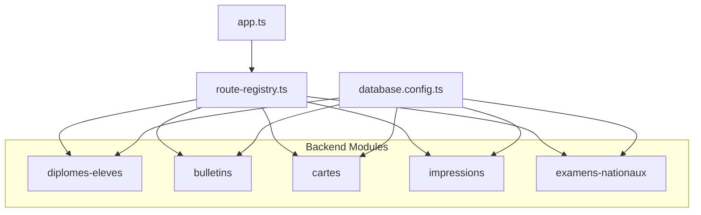
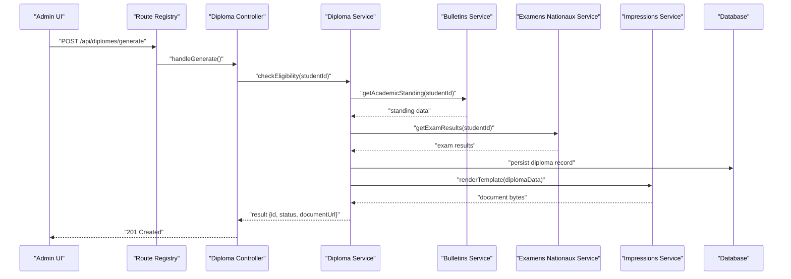
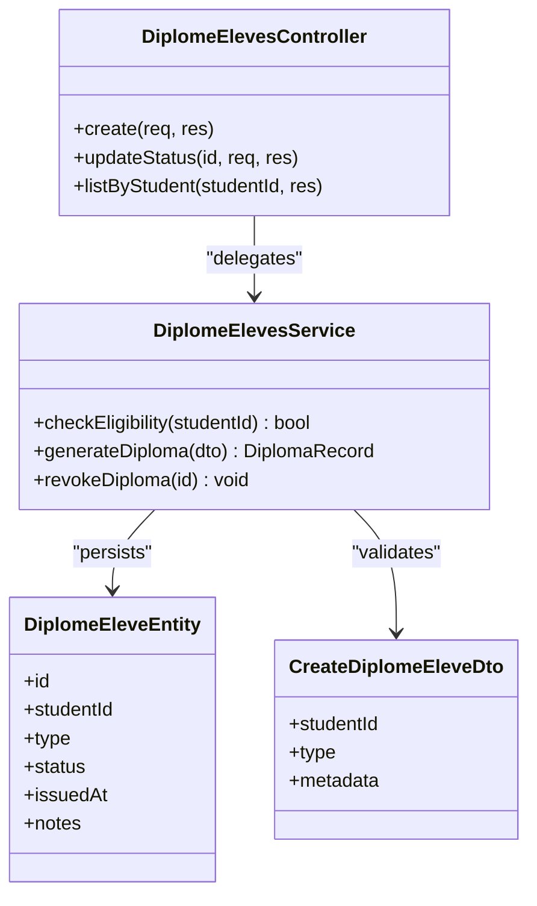
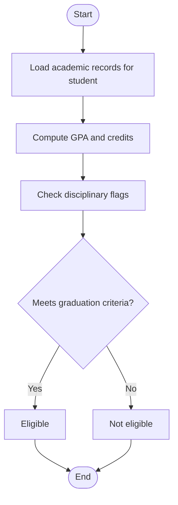
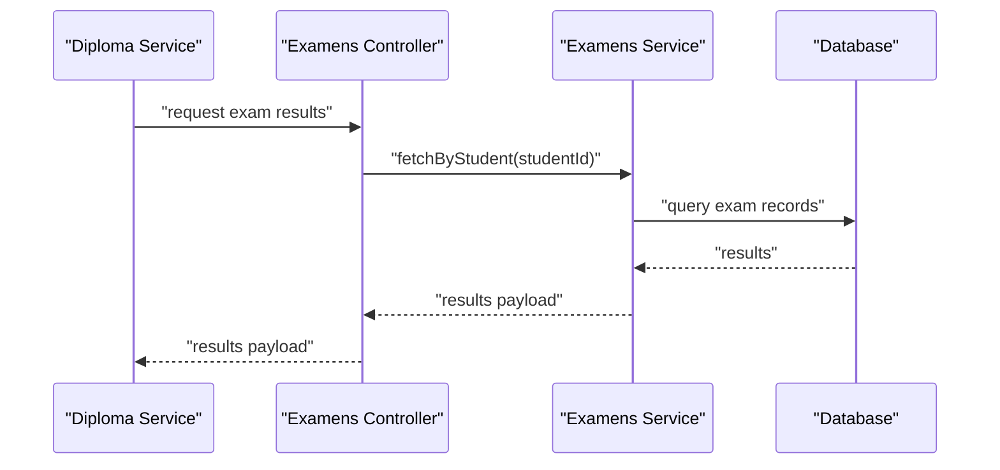
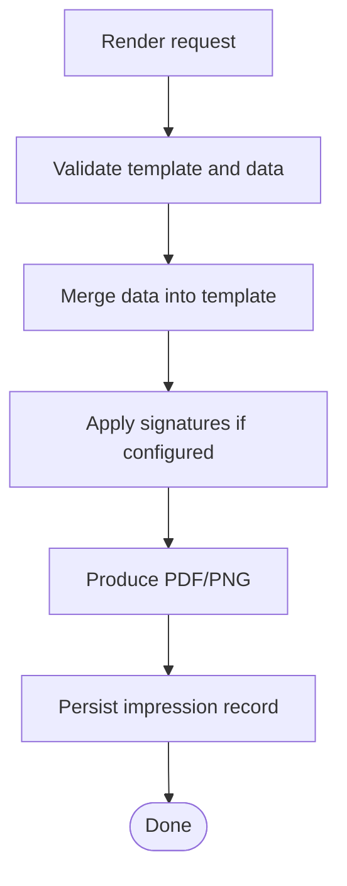
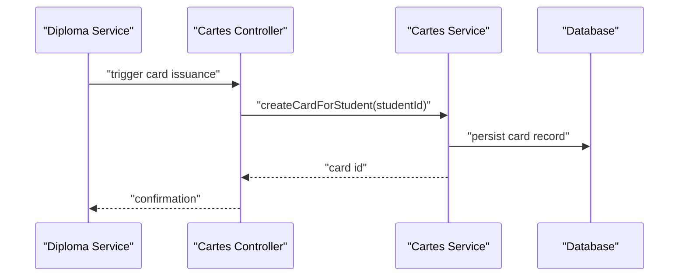
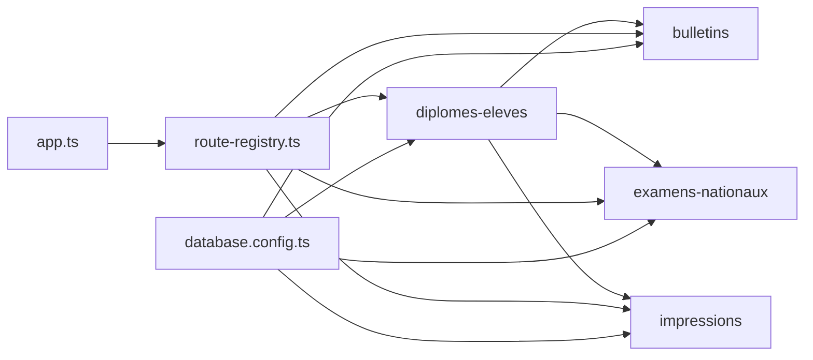

# Diploma & Certificate Management

<cite>
**Referenced Files in This Document**
- [diplomes-eleves module index](file://backend/src/modules/diplomes-eleves/index.ts)
- [diplomes-eleves controller](file://backend/src/modules/diplomes-eleves/controllers/diplomesEleves.controller.ts)
- [diplomes-eleves service](file://backend/src/modules/diplomes-eleves/services/diplomesEleves.service.ts)
- [diplomes-eleves entity](file://backend/src/modules/diplomes-eleves/entities/diplomeEleve.entity.ts)
- [diplomes-eleves dto](file://backend/src/modules/diplomes-eleves/dto/createDiplomeEleve.dto.ts)
- [bulletins module index](file://backend/src/modules/bulletins/index.ts)
- [bulletins controller](file://backend/src/modules/bulletins/controllers/bulletins.controller.ts)
- [bulletins service](file://backend/src/modules/bulletins/services/bulletins.service.ts)
- [bulletins entity](file://backend/src/modules/bulletins/entities/bulletin.entity.ts)
- [cartes module index](file://backend/src/modules/cartes/index.ts)
- [cartes controller](file://backend/src/modules/cartes/controllers/cartes.controller.ts)
- [cartes service](file://backend/src/modules/cartes/services/cartes.service.ts)
- [cartes entity](file://backend/src/modules/cartes/entities/carte.entity.ts)
- [impressions module index](file://backend/src/modules/impressions/index.ts)
- [impressions controller](file://backend/src/modules/impressions/controllers/impressions.controller.ts)
- [impressions service](file://backend/src/modules/impressions/services/impressions.service.ts)
- [impressions entity](file://backend/src/modules/impressions/entities/impression.entity.ts)
- [examens-nationaux module index](file://backend/src/modules/examens-nationaux/index.ts)
- [examens-nationaux controller](file://backend/src/modules/examens-nationaux/controllers/examensNationaux.controller.ts)
- [examens-nationaux service](file://backend/src/modules/examens-nationaux/services/examensNationaux.service.ts)
- [examens-nationaux entity](file://backend/src/modules/examens-nationaux/entities/examenNational.entity.ts)
- [routes registry](file://backend/src/routes/route-registry.ts)
- [app entry](file://backend/src/app.ts)
- [database config](file://backend/src/config/database.config.ts)
- [migrations README](file://backend/database/migrations/README.md)
</cite>

## Table of Contents
1. [Introduction](#introduction)
2. [Project Structure](#project-structure)
3. [Core Components](#core-components)
4. [Architecture Overview](#architecture-overview)
5. [Detailed Component Analysis](#detailed-component-analysis)
6. [Dependency Analysis](#dependency-analysis)
7. [Performance Considerations](#performance-considerations)
8. [Troubleshooting Guide](#troubleshooting-guide)
9. [Conclusion](#conclusion)
10. [Appendices](#appendices)

## Introduction
This document provides comprehensive guidance for Diploma and Certificate Management across the graduation and credential issuance lifecycle. It covers diploma types, certificate templates, qualification frameworks, eligibility criteria, academic standing verification, digital certificate creation, signature application, secure distribution, batch generation, and verification processes. It also explains integration with academic records for automatic eligibility checks, international recognition standards, transcript generation, and credential verification services. Practical examples are included to help configure diplomas, generate certificates in bulk, and implement institution-specific requirements.

## Project Structure
The system organizes diploma and certificate functionality into dedicated modules:
- Diplomas for students (diplomes-eleves): manages student diplomas, statuses, and issuance workflows.
- Report cards (bulletins): supports transcripts and academic records used for eligibility and verification.
- Cards (cartes): handles identity or access cards that may be issued alongside credentials.
- Impressions: centralizes printing and template rendering for documents such as diplomas and certificates.
- National exams (examens-nationaux): integrates national exam results into graduation decisions.
- Routes and app configuration: wires endpoints and initializes modules.

**Diagram sources**
- [routes registry](file://backend/src/routes/route-registry.ts)
- [app entry](file://backend/src/app.ts)
- [database config](file://backend/src/config/database.config.ts)
- [diplomes-eleves module index](file://backend/src/modules/diplomes-eleves/index.ts)
- [bulletins module index](file://backend/src/modules/bulletins/index.ts)
- [cartes module index](file://backend/src/modules/cartes/index.ts)
- [impressions module index](file://backend/src/modules/impressions/index.ts)
- [examens-nationaux module index](file://backend/src/modules/examens-nationaux/index.ts)

**Section sources**
- [diplomes-eleves module index](file://backend/src/modules/diplomes-eleves/index.ts)
- [bulletins module index](file://backend/src/modules/bulletins/index.ts)
- [cartes module index](file://backend/src/modules/cartes/index.ts)
- [impressions module index](file://backend/src/modules/impressions/index.ts)
- [examens-nationaux module index](file://backend/src/modules/examens-nationaux/index.ts)
- [routes registry](file://backend/src/routes/route-registry.ts)
- [app entry](file://backend/src/app.ts)
- [database config](file://backend/src/config/database.config.ts)

## Core Components
- Diploma management (diplomes-eleves): defines entities, DTOs, controllers, and services to create, update, and track diplomas for students.
- Transcript and report card management (bulletins): maintains academic records required for eligibility checks and transcript generation.
- Card issuance (cartes): issues related identification/access cards; can be coordinated with diploma issuance.
- Printing and templates (impressions): renders printable documents using templates and manages print jobs.
- National exam integration (examens-nationaux): incorporates national exam outcomes into graduation decisions.

Key responsibilities:
- Eligibility evaluation based on academic records and exam results.
- Template-driven diploma and certificate generation.
- Secure storage and distribution of digital credentials.
- Batch operations for large-scale issuance.
- Verification endpoints for third-party validation.

**Section sources**
- [diplomes-eleves controller](file://backend/src/modules/diplomes-eleves/controllers/diplomesEleves.controller.ts)
- [diplomes-eleves service](file://backend/src/modules/diplomes-eleves/services/diplomesEleves.service.ts)
- [diplomes-eleves entity](file://backend/src/modules/diplomes-eleves/entities/diplomeEleve.entity.ts)
- [diplomes-eleves dto](file://backend/src/modules/diplomes-eleves/dto/createDiplomeEleve.dto.ts)
- [bulletins controller](file://backend/src/modules/bulletins/controllers/bulletins.controller.ts)
- [bulletins service](file://backend/src/modules/bulletins/services/bulletins.service.ts)
- [bulletins entity](file://backend/src/modules/bulletins/entities/bulletin.entity.ts)
- [cartes controller](file://backend/src/modules/cartes/controllers/cartes.controller.ts)
- [cartes service](file://backend/src/modules/cartes/services/cartes.service.ts)
- [cartes entity](file://backend/src/modules/cartes/entities/carte.entity.ts)
- [impressions controller](file://backend/src/modules/impressions/controllers/impressions.controller.ts)
- [impressions service](file://backend/src/modules/impressions/services/impressions.service.ts)
- [impressions entity](file://backend/src/modules/impressions/entities/impression.entity.ts)
- [examens-nationaux controller](file://backend/src/modules/examens-nationaux/controllers/examensNationaux.controller.ts)
- [examens-nationaux service](file://backend/src/modules/examens-nationaux/services/examensNationaux.service.ts)
- [examens-nationaux entity](file://backend/src/modules/examens-nationaux/entities/examenNational.entity.ts)

## Architecture Overview
The diploma and certificate workflow spans multiple modules:
- Academic records (bulletins) and national exams (examens-nationaux) feed eligibility logic.
- The diploma service orchestrates eligibility checks and creates diploma records.
- The impressions module renders templates and produces final documents.
- Optional card issuance (cartes) is coordinated during graduation.
- Routes expose APIs for front-end and external integrations.

**Diagram sources**
- [routes registry](file://backend/src/routes/route-registry.ts)
- [diplomes-eleves controller](file://backend/src/modules/diplomes-eleves/controllers/diplomesEleves.controller.ts)
- [diplomes-eleves service](file://backend/src/modules/diplomes-eleves/services/diplomesEleves.service.ts)
- [bulletins service](file://backend/src/modules/bulletins/services/bulletins.service.ts)
- [examens-nationaux service](file://backend/src/modules/examens-nationaux/services/examensNationaux.service.ts)
- [impressions service](file://backend/src/modules/impressions/services/impressions.service.ts)
- [database config](file://backend/src/config/database.config.ts)

## Detailed Component Analysis

### Diploma Module (diplomes-eleves)
Responsibilities:
- Define diploma entities and DTOs for input validation.
- Provide CRUD and workflow endpoints for diploma issuance.
- Orchestrate eligibility checks by integrating with bulletins and examens-nationaux.
- Trigger template rendering via impressions.

**Diagram sources**
- [diplomes-eleves entity](file://backend/src/modules/diplomes-eleves/entities/diplomeEleve.entity.ts)
- [diplomes-eleves dto](file://backend/src/modules/diplomes-eleves/dto/createDiplomeEleve.dto.ts)
- [diplomes-eleves controller](file://backend/src/modules/diplomes-eleves/controllers/diplomesEleves.controller.ts)
- [diplomes-eleves service](file://backend/src/modules/diplomes-eleves/services/diplomesEleves.service.ts)

**Section sources**
- [diplomes-eleves controller](file://backend/src/modules/diplomes-eleves/controllers/diplomesEleves.controller.ts)
- [diplomes-eleves service](file://backend/src/modules/diplomes-eleves/services/diplomesEleves.service.ts)
- [diplomes-eleves entity](file://backend/src/modules/diplomes-eleves/entities/diplomeEleve.entity.ts)
- [diplomes-eleves dto](file://backend/src/modules/diplomes-eleves/dto/createDiplomeEleve.dto.ts)

### Transcript and Academic Records (bulletins)
Responsibilities:
- Maintain report cards and academic standing data.
- Provide queries for GPA, credits, completion status, and disciplinary flags.
- Support transcript generation for verification and international recognition.

**Diagram sources**
- [bulletins controller](file://backend/src/modules/bulletins/controllers/bulletins.controller.ts)
- [bulletins service](file://backend/src/modules/bulletins/services/bulletins.service.ts)
- [bulletins entity](file://backend/src/modules/bulletins/entities/bulletin.entity.ts)

**Section sources**
- [bulletins controller](file://backend/src/modules/bulletins/controllers/bulletins.controller.ts)
- [bulletins service](file://backend/src/modules/bulletins/services/bulletins.service.ts)
- [bulletins entity](file://backend/src/modules/bulletins/entities/bulletin.entity.ts)

### National Exams Integration (examens-nationaux)
Responsibilities:
- Store and retrieve national exam results.
- Provide eligibility inputs for diploma issuance.
- Support official result reconciliation and audit trails.

**Diagram sources**
- [examens-nationaux controller](file://backend/src/modules/examens-nationaux/controllers/examensNationaux.controller.ts)
- [examens-nationaux service](file://backend/src/modules/examens-nationaux/services/examensNationaux.service.ts)
- [examens-nationaux entity](file://backend/src/modules/examens-nationaux/entities/examenNational.entity.ts)

**Section sources**
- [examens-nationaux controller](file://backend/src/modules/examens-nationaux/controllers/examensNationaux.controller.ts)
- [examens-nationaux service](file://backend/src/modules/examens-nationaux/services/examensNationaux.service.ts)
- [examens-nationaux entity](file://backend/src/modules/examens-nationaux/entities/examenNational.entity.ts)

### Printing and Templates (impressions)
Responsibilities:
- Manage document templates for diplomas and certificates.
- Render final documents from data payloads.
- Track print jobs and outputs.

**Diagram sources**
- [impressions controller](file://backend/src/modules/impressions/controllers/impressions.controller.ts)
- [impressions service](file://backend/src/modules/impressions/services/impressions.service.ts)
- [impressions entity](file://backend/src/modules/impressions/entities/impression.entity.ts)

**Section sources**
- [impressions controller](file://backend/src/modules/impressions/controllers/impressions.controller.ts)
- [impressions service](file://backend/src/modules/impressions/services/impressions.service.ts)
- [impressions entity](file://backend/src/modules/impressions/entities/impression.entity.ts)

### Related Issuance (cartes)
Responsibilities:
- Issue identity or access cards alongside diplomas.
- Coordinate issuance timing and data consistency.

**Diagram sources**
- [cartes controller](file://backend/src/modules/cartes/controllers/cartes.controller.ts)
- [cartes service](file://backend/src/modules/cartes/services/cartes.service.ts)
- [cartes entity](file://backend/src/modules/cartes/entities/carte.entity.ts)

**Section sources**
- [cartes controller](file://backend/src/modules/cartes/controllers/cartes.controller.ts)
- [cartes service](file://backend/src/modules/cartes/services/cartes.service.ts)
- [cartes entity](file://backend/src/modules/cartes/entities/carte.entity.ts)

## Dependency Analysis
Module interactions and coupling:
- Diploma service depends on bulletins and examens-nationaux for eligibility.
- Impressions is invoked by diploma issuance to produce final documents.
- Routes registry exposes endpoints that wire controllers to services.
- Database configuration underpins all modules.

**Diagram sources**
- [routes registry](file://backend/src/routes/route-registry.ts)
- [app entry](file://backend/src/app.ts)
- [database config](file://backend/src/config/database.config.ts)
- [diplomes-eleves module index](file://backend/src/modules/diplomes-eleves/index.ts)
- [bulletins module index](file://backend/src/modules/bulletins/index.ts)
- [examens-nationaux module index](file://backend/src/modules/examens-nationaux/index.ts)
- [impressions module index](file://backend/src/modules/impressions/index.ts)

**Section sources**
- [routes registry](file://backend/src/routes/route-registry.ts)
- [app entry](file://backend/src/app.ts)
- [database config](file://backend/src/config/database.config.ts)

## Performance Considerations
- Use pagination and filtering when listing diplomas, transcripts, and impressions.
- Cache frequently accessed academic standing data where appropriate.
- Stream large document generation to avoid memory spikes.
- Index common query fields (studentId, type, status, issuedAt).
- Offload heavy rendering tasks to background workers if needed.

[No sources needed since this section provides general guidance]

## Troubleshooting Guide
Common issues and resolutions:
- Missing academic records: ensure bulletins are up-to-date before generating diplomas.
- Exam result mismatches: reconcile examens-nationaux data and re-run eligibility checks.
- Template rendering failures: validate template syntax and data completeness.
- Permission errors: verify RBAC permissions for diploma and impression endpoints.
- Database connectivity: check database configuration and migration status.

Operational references:
- Migration documentation and scripts for schema updates.
- App initialization and route registration for endpoint availability.

**Section sources**
- [migrations README](file://backend/database/migrations/README.md)
- [app entry](file://backend/src/app.ts)
- [routes registry](file://backend/src/routes/route-registry.ts)
- [database config](file://backend/src/config/database.config.ts)

## Conclusion
The Diploma and Certificate Management system integrates academic records, national exams, and template-based document rendering to deliver a robust graduation and credential issuance process. By leveraging modular design and clear workflows, institutions can automate eligibility checks, customize templates, issue related cards, and provide secure verification mechanisms aligned with international standards.

[No sources needed since this section summarizes without analyzing specific files]

## Appendices

### Practical Examples

- Diploma configuration
  - Define diploma types and metadata via DTOs and entities.
  - Configure eligibility rules by combining bulletins and examens-nationaux data.
  - Reference: [diplomes-eleves dto](file://backend/src/modules/diplomes-eleves/dto/createDiplomeEleve.dto.ts), [diplomes-eleves entity](file://backend/src/modules/diplomes-eleves/entities/diplomeEleve.entity.ts)

- Batch certificate generation
  - Iterate over eligible students and call the diploma generation endpoint.
  - Use impressions to render templates per student.
  - Reference: [diplomes-eleves controller](file://backend/src/modules/diplomes-eleves/controllers/diplomesEleves.controller.ts), [impressions service](file://backend/src/modules/impressions/services/impressions.service.ts)

- Verification processes
  - Implement verification endpoints that return signed credential details.
  - Integrate with external verifiers via public APIs.
  - Reference: [diplomes-eleves controller](file://backend/src/modules/diplomes-eleves/controllers/diplomesEleves.controller.ts)

- International recognition standards
  - Align transcript formats and data fields with recognized frameworks.
  - Ensure consistent naming and codes for qualifications.
  - Reference: [bulletins service](file://backend/src/modules/bulletins/services/bulletins.service.ts)

- Customizing diploma templates
  - Update templates in the impressions module.
  - Validate merged data before rendering.
  - Reference: [impressions controller](file://backend/src/modules/impressions/controllers/impressions.controller.ts), [impressions service](file://backend/src/modules/impressions/services/impressions.service.ts)

- Institution-specific graduation requirements
  - Extend eligibility logic in the diploma service to include institutional rules.
  - Combine bulletins and examens-nationaux with additional criteria.
  - Reference: [diplomes-eleves service](file://backend/src/modules/diplomes-eleves/services/diplomesEleves.service.ts), [bulletins service](file://backend/src/modules/bulletins/services/bulletins.service.ts), [examens-nationaux service](file://backend/src/modules/examens-nationaux/services/examensNationaux.service.ts)